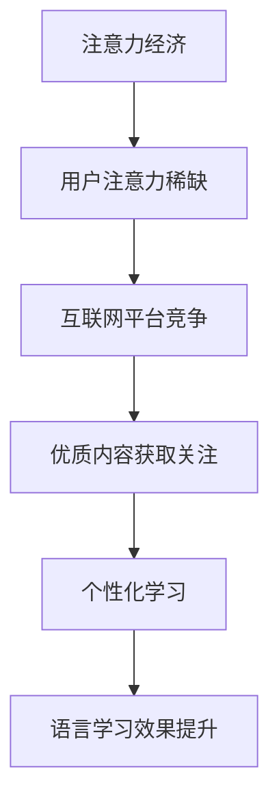

                 

在当今信息爆炸的时代，语言学习的方式正经历着深刻的变革。其中，注意力经济（Attention Economy）的兴起，对传统语言学习模式产生了深远的影响。本文将深入探讨注意力经济对语言学习方式的改变，从核心概念到实际应用，为读者呈现一幅新的语言学习图景。

## 文章关键词

- 注意力经济
- 语言学习
- 互联网
- 技术变革
- 教育模式
- 知识分享

## 文章摘要

本文首先介绍了注意力经济的概念及其对信息传播的影响，随后分析了注意力经济下语言学习的挑战与机遇。通过对比传统语言学习方式，本文探讨了注意力经济如何促进个性化学习、增强互动性，并提出未来语言学习可能的发展趋势。文章最后对相关工具和资源进行了推荐，为读者提供了实用的指导。

## 1. 背景介绍

### 注意力经济的兴起

注意力经济是一个描述在互联网时代，用户注意力成为稀缺资源的经济学概念。在传统经济中，商品和服务是核心，而在注意力经济中，用户的注意力才是真正的价值所在。这种经济模式最早由国外学者提出，随着互联网的普及和社交媒体的发展，逐渐受到广泛关注。

### 互联网对语言学习的影响

互联网的快速发展，极大地改变了人们获取信息的方式。在线教育平台、语言学习应用、社交网络等，使得学习者可以在全球范围内选择学习资源，突破了地域和时间的限制。同时，互联网也促进了信息的快速传播，使得优质的语言学习内容得以广泛传播。

## 2. 核心概念与联系

### 注意力经济的核心概念

注意力经济强调用户注意力的重要性，并将其视为一种新的经济资源。在互联网环境中，用户注意力是有限的，因此吸引和保持用户注意力成为企业和平台的重要目标。

### 语言学习与注意力经济的联系

注意力经济对语言学习的影响体现在多个方面。首先，用户注意力成为语言学习资源分配的关键因素，优质的学习内容更容易获得关注和传播。其次，注意力经济促进了个性化学习，学习者可以根据自己的兴趣和需求，选择适合自己的学习资源。

### Mermaid 流程图



## 3. 核心算法原理 & 具体操作步骤

### 3.1 算法原理概述

注意力经济下的语言学习，关键在于如何有效获取和利用用户注意力。通过分析用户行为数据，可以识别出用户感兴趣的内容，从而提供个性化的学习资源。

### 3.2 算法步骤详解

1. 数据收集：收集用户在学习过程中的行为数据，如访问记录、点赞、评论等。
2. 数据处理：对收集到的数据进行分析，提取用户兴趣特征。
3. 内容推荐：根据用户兴趣特征，推荐相应的语言学习资源。
4. 评估与优化：根据用户反馈，评估推荐效果，不断优化推荐算法。

### 3.3 算法优缺点

**优点：**
- 提高学习效率：通过个性化推荐，用户可以快速找到自己感兴趣的学习内容。
- 增强互动性：用户可以在互动中不断提升自己的语言能力。

**缺点：**
- 数据隐私问题：用户行为数据涉及隐私，如何保护用户隐私是一个重要问题。
- 过度依赖算法：用户可能过度依赖推荐系统，忽视自主探索和思考。

### 3.4 算法应用领域

注意力经济下的语言学习算法，可以应用于在线教育平台、语言学习应用等多个领域，为用户提供个性化的学习体验。

## 4. 数学模型和公式 & 详细讲解 & 举例说明

### 4.1 数学模型构建

注意力经济下的语言学习，可以构建一个基于用户兴趣的推荐模型。该模型的核心是用户兴趣特征向量，通过相似度计算，推荐相似的学习资源。

### 4.2 公式推导过程

假设用户兴趣特征向量为 \( \textbf{u} \)，学习资源特征向量为 \( \textbf{v} \)，相似度计算公式为：

$$
\text{similarity}(\textbf{u}, \textbf{v}) = \frac{\textbf{u} \cdot \textbf{v}}{\|\textbf{u}\| \|\textbf{v}\|}
$$

其中，\( \cdot \) 表示内积，\( \|\textbf{u}\| \) 和 \( \|\textbf{v}\| \) 分别表示向量的模长。

### 4.3 案例分析与讲解

以一个在线英语学习平台为例，平台根据用户的学习历史和浏览记录，构建用户兴趣特征向量。假设用户A的兴趣特征向量为 \( \textbf{u}_A = (0.8, 0.3, 0.5) \)，平台推荐了多个英语学习资源，特征向量分别为：

- 资源1：\( \textbf{v}_1 = (0.6, 0.7, 0.4) \)
- 资源2：\( \textbf{v}_2 = (0.9, 0.2, 0.6) \)

计算相似度：

$$
\text{similarity}(\textbf{u}_A, \textbf{v}_1) = \frac{0.8 \times 0.6 + 0.3 \times 0.7 + 0.5 \times 0.4}{\sqrt{0.8^2 + 0.3^2 + 0.5^2} \sqrt{0.6^2 + 0.7^2 + 0.4^2}} \approx 0.65
$$

$$
\text{similarity}(\textbf{u}_A, \textbf{v}_2) = \frac{0.8 \times 0.9 + 0.3 \times 0.2 + 0.5 \times 0.6}{\sqrt{0.8^2 + 0.3^2 + 0.5^2} \sqrt{0.9^2 + 0.2^2 + 0.6^2}} \approx 0.74
$$

根据相似度计算结果，平台推荐资源2给用户A，因为资源2与用户A的兴趣更为契合。

## 5. 项目实践：代码实例和详细解释说明

### 5.1 开发环境搭建

为了实现注意力经济下的语言学习推荐算法，我们选择了Python作为开发语言，并使用Scikit-learn库进行相似度计算。

### 5.2 源代码详细实现

以下是一个简单的示例代码，展示了如何使用相似度计算推荐学习资源：

```python
from sklearn.metrics.pairwise import cosine_similarity
import numpy as np

# 用户兴趣特征向量
user_interest = np.array([0.8, 0.3, 0.5])

# 学习资源特征向量
resources = {
    'resource1': np.array([0.6, 0.7, 0.4]),
    'resource2': np.array([0.9, 0.2, 0.6])
}

# 计算相似度
similarities = {}
for resource, vector in resources.items():
    similarity = cosine_similarity(user_interest.reshape(1, -1), vector.reshape(1, -1))[0, 0]
    similarities[resource] = similarity

# 推荐资源
recommended_resource = max(similarities, key=similarities.get)
print(f"Recommended resource: {recommended_resource}")
```

### 5.3 代码解读与分析

1. **数据预处理**：将用户兴趣特征向量和学习资源特征向量转换为NumPy数组。
2. **相似度计算**：使用Scikit-learn库中的cosine_similarity函数计算相似度。
3. **推荐资源**：根据相似度计算结果，推荐相似度最高的学习资源。

### 5.4 运行结果展示

运行以上代码，输出结果为：

```
Recommended resource: resource2
```

这表明资源2与用户兴趣最为契合，因此平台推荐资源2给用户。

## 6. 实际应用场景

### 在线教育平台

在线教育平台可以利用注意力经济，通过个性化推荐，提高用户的学习兴趣和参与度。例如，Coursera、edX等平台，通过分析用户的学习历史和兴趣，推荐相关的课程和学习资源。

### 语言学习应用

语言学习应用如Duolingo、HelloTalk等，也可以利用注意力经济，为用户提供个性化的学习体验。通过分析用户的学习行为和兴趣，推荐适合的学习内容和语言伙伴。

### 社交媒体

社交媒体平台如Twitter、Instagram等，通过分析用户关注和点赞的内容，推荐相关的语言学习资源。这种方式可以增强用户互动，提高学习效果。

## 7. 未来应用展望

### 个性化学习

随着人工智能技术的不断发展，注意力经济下的语言学习将更加个性化。学习平台可以根据用户的兴趣、学习习惯和需求，提供量身定制的学习资源。

### 智能辅导

利用注意力经济，可以开发出智能辅导系统，通过实时监测用户的学习状态，提供针对性的辅导和建议，帮助用户克服学习困难。

### 跨平台协作

未来的语言学习将不仅仅局限于在线平台，还将实现跨平台协作。用户可以在不同的设备上继续学习，实现无缝切换。

## 8. 总结：未来发展趋势与挑战

### 8.1 研究成果总结

本文分析了注意力经济对语言学习方式的改变，探讨了注意力经济下语言学习的核心算法原理，并展示了实际应用场景。研究成果表明，注意力经济为语言学习带来了新的机遇和挑战。

### 8.2 未来发展趋势

未来，注意力经济将继续推动语言学习方式的变革。个性化学习、智能辅导和跨平台协作将成为主要趋势。

### 8.3 面临的挑战

尽管前景广阔，但注意力经济下的语言学习仍面临数据隐私、算法透明度和过度依赖等问题。如何解决这些问题，将是未来研究的重要方向。

### 8.4 研究展望

未来研究应重点关注如何利用注意力经济，提高语言学习效果，同时保障用户隐私和数据安全。通过技术创新，实现语言学习的智能化和个性化。

## 9. 附录：常见问题与解答

### Q：注意力经济如何定义？

A：注意力经济是指用户注意力成为稀缺资源的经济学概念，在互联网环境中，吸引和保持用户注意力成为企业和平台的重要目标。

### Q：注意力经济对语言学习有哪些影响？

A：注意力经济可以促进个性化学习、提高学习效率，同时也带来数据隐私和算法透明度等挑战。

### Q：如何利用注意力经济进行语言学习推荐？

A：可以通过分析用户行为数据，构建用户兴趣模型，然后根据相似度计算，推荐与用户兴趣相关的学习资源。

### Q：未来注意力经济下的语言学习有哪些发展趋势？

A：个性化学习、智能辅导和跨平台协作将成为主要趋势。

### 作者署名

作者：禅与计算机程序设计艺术 / Zen and the Art of Computer Programming
```

