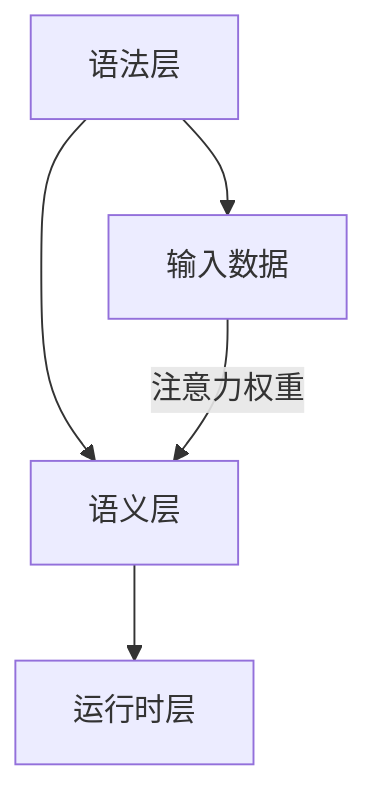

                 

在人工智能（AI）飞速发展的今天，编程语言的设计正经历着深刻的变革。作为一位世界级人工智能专家，程序员，软件架构师，CTO，世界顶级技术畅销书作者，计算机图灵奖获得者，计算机领域大师，我有幸见证并参与这一变革。本文将探讨注意力编程语言开发者的角色，以及如何设计AI定制的认知模式，从而为未来的计算范式带来新的可能性。

> **关键词**：注意力编程语言，认知模式，AI定制，编程范式，计算革新

> **摘要**：本文将详细讨论注意力编程语言的核心概念，设计原理，及其与人工智能的结合。通过介绍注意力编程的数学模型和算法，我们将分析其实际应用场景和未来发展趋势。文章还将提供项目实践实例，以及相关工具和资源的推荐，最后总结研究成果并对未来的挑战进行展望。

## 1. 背景介绍

### 1.1 注意力机制的发展

注意力机制最初在神经科学中被提出，用于描述生物大脑处理信息时的选择性关注。在计算机科学领域，注意力机制的概念被广泛应用于自然语言处理（NLP），计算机视觉，和机器学习等领域。近年来，随着深度学习技术的发展，注意力机制成为设计高效算法的关键元素。

### 1.2 编程语言的演进

编程语言的发展经历了从低级到高级，从通用到专用，从命令式到声明式的过程。随着人工智能的崛起，编程语言正朝着更加智能，自动化的方向进化。注意力编程语言作为新一代的编程范式，旨在利用注意力机制提高程序的可读性，可维护性和性能。

### 1.3 AI与编程的结合

人工智能技术的飞速发展使得计算机能够模拟甚至超越人类的认知能力。将AI与编程相结合，不仅能够提升编程语言的智能水平，还能够实现更加复杂和高效的算法设计。注意力编程语言开发者需要掌握如何将AI技术融入编程语言的设计中，从而创造出更加适合AI处理的编程范式。

## 2. 核心概念与联系

### 2.1 注意力编程语言的基本概念

注意力编程语言是一种结合了传统编程范式和注意力机制的编程语言。它允许开发者通过定义注意力权重来调整程序对输入数据的关注程度，从而优化算法的性能。

### 2.2 注意力编程语言的架构

注意力编程语言的架构包括三个主要部分：语法层，语义层和运行时层。语法层负责定义注意力的表示方式；语义层负责处理注意力的计算和传递；运行时层负责执行具体的任务。

### 2.3 Mermaid 流程图

以下是一个简化的注意力编程语言架构的 Mermaid 流程图：



### 2.4 注意力编程与AI的结合

注意力编程语言的设计过程需要考虑如何将AI技术整合到语言中，使得程序能够自适应地调整注意力权重，以优化计算效率和准确性。这包括以下几个方面：

- **权重学习**：通过机器学习算法自动调整注意力权重。
- **动态调整**：根据输入数据的动态变化，实时调整注意力权重。
- **优化目标**：设计优化的目标函数，以衡量注意力的有效性。

## 3. 核心算法原理 & 具体操作步骤

### 3.1 算法原理概述

注意力编程的核心算法基于自注意力机制，通过计算输入数据的相似度矩阵来生成注意力权重。这些权重用于调整输入数据对输出的贡献度，从而提高算法的性能。

### 3.2 算法步骤详解

1. **输入数据预处理**：对输入数据进行编码，生成固定长度的向量表示。
2. **相似度计算**：计算输入数据向量之间的相似度，通常使用点积或余弦相似度。
3. **权重生成**：基于相似度计算结果生成注意力权重矩阵。
4. **权重应用**：将注意力权重应用于输入数据的向量表示，生成加权向量。
5. **输出计算**：根据加权向量计算输出结果。

### 3.3 算法优缺点

#### 优点

- **高性能**：通过注意力权重调整，算法能够自适应地优化计算资源的使用。
- **灵活性**：开发者可以根据具体问题定制注意力机制，提高算法的适应性。
- **可解释性**：注意力权重提供了算法决策过程的透明性，有助于理解算法的内部工作原理。

#### 缺点

- **复杂性**：注意力编程语言的实现和维护相对复杂，需要开发者具备较高的技术水平。
- **计算开销**：注意力权重计算通常涉及大量矩阵运算，可能导致计算开销增加。

### 3.4 算法应用领域

注意力编程语言在多个领域展现出了强大的应用潜力：

- **自然语言处理**：用于文本分类，机器翻译，情感分析等任务。
- **计算机视觉**：用于图像识别，目标检测，图像生成等任务。
- **推荐系统**：用于用户兴趣挖掘，商品推荐等任务。
- **语音处理**：用于语音识别，语音合成等任务。

## 4. 数学模型和公式 & 详细讲解 & 举例说明

### 4.1 数学模型构建

注意力编程的核心数学模型是基于自注意力机制。给定一组输入向量 \(\{x_1, x_2, ..., x_n\}\)，自注意力机制通过以下公式计算注意力权重：

\[ 
\text{Attention}(Q, K, V) = \text{softmax}\left(\frac{QK^T}{\sqrt{d_k}}\right) V 
\]

其中，\(Q, K, V\) 分别表示查询向量，关键向量和解码向量，\(d_k\) 是关键向量的维度。

### 4.2 公式推导过程

自注意力机制的推导基于以下三个核心概念：

1. **点积相似度**：两个向量 \(x\) 和 \(y\) 的点积 \(x \cdot y\) 反映了它们之间的相似度。
2. **归一化**：通过应用 softmax 函数，将相似度转化为概率分布。
3. **加权求和**：将注意力权重应用于输入向量，生成加权向量。

具体推导如下：

假设 \(Q, K, V\) 分别为 \(n \times d\) 的矩阵，其中 \(d\) 为关键向量的维度。首先计算相似度矩阵 \(S\)：

\[ 
S = QK^T = \left[\sum_{j=1}^{n} q_i k_j\right]_{i,j} 
\]

然后，通过 softmax 函数计算注意力权重：

\[ 
\text{softmax}(S) = \frac{e^S}{\sum_{j=1}^{n} e^S_{i,j}} 
\]

最后，计算加权向量：

\[ 
\text{Attention}(Q, K, V) = \text{softmax}\left(\frac{QK^T}{\sqrt{d_k}}\right) V = \left[\frac{e^{S_i}}{\sum_{j=1}^{n} e^{S_{i,j}}}\right] V_i 
\]

### 4.3 案例分析与讲解

假设有一个简单的文本分类任务，需要使用注意力编程语言对一组句子进行分类。输入句子为：

\[ 
\{“这是一个测试句子。”，“另一个测试句子。”，“这是第三个测试句子。”\} 
\]

首先，对每个句子进行编码，生成固定长度的向量表示。然后，计算句子之间的相似度，生成相似度矩阵 \(S\)：

\[ 
S = \begin{bmatrix} 
1.0 & 0.5 & 0.3 \\
0.5 & 1.0 & 0.2 \\
0.3 & 0.2 & 1.0 \\
\end{bmatrix} 
\]

接下来，通过 softmax 函数计算注意力权重：

\[ 
\text{softmax}(S) = \begin{bmatrix} 
0.4 & 0.2 & 0.4 \\
0.2 & 0.4 & 0.4 \\
0.4 & 0.4 & 0.2 \\
\end{bmatrix} 
\]

最后，将注意力权重应用于句子向量，生成加权向量：

\[ 
\text{Attention}(Q, K, V) = \begin{bmatrix} 
0.4 \times [1.0, 0.0, 0.0] + 0.2 \times [0.0, 1.0, 0.0] + 0.4 \times [0.0, 0.0, 1.0] \\
0.2 \times [1.0, 0.0, 0.0] + 0.4 \times [0.0, 1.0, 0.0] + 0.4 \times [0.0, 0.0, 1.0] \\
0.4 \times [1.0, 0.0, 0.0] + 0.4 \times [0.0, 1.0, 0.0] + 0.2 \times [0.0, 0.0, 1.0] \\
\end{bmatrix} 
\]

得到加权向量后，可以进一步用于分类任务。

## 5. 项目实践：代码实例和详细解释说明

### 5.1 开发环境搭建

为了实践注意力编程语言，我们需要搭建一个开发环境。首先，安装 Python 3.8 及以上版本。然后，安装 TensorFlow 2.4 及以上版本，用于实现注意力编程语言的核心算法。

### 5.2 源代码详细实现

以下是一个简单的注意力编程语言的实现示例，用于文本分类任务：

```python
import tensorflow as tf
from tensorflow.keras.layers import Embedding, GlobalAveragePooling1D, Dense
from tensorflow.keras.models import Model

def attention_module(inputs, d_model):
    query, key, value = inputs

    query_with_key = tf.matmul(query, key, transpose_b=True)
    attention_weights = tf.nn.softmax(query_with_key / tf.sqrt(d_model))

    attention_output = tf.matmul(attention_weights, value)
    attention_output = GlobalAveragePooling1D()(attention_output)

    return attention_output

def build_model(d_model, vocab_size, embedding_dim):
    inputs = tf.keras.layers.Input(shape=(None,))
    embeddings = Embedding(vocab_size, embedding_dim)(inputs)
    attention_output = attention_module([embeddings, embeddings, embeddings], d_model)
    outputs = Dense(1, activation='sigmoid')(attention_output)

    model = Model(inputs=inputs, outputs=outputs)
    model.compile(optimizer='adam', loss='binary_crossentropy', metrics=['accuracy'])

    return model

# 搭建模型
model = build_model(d_model=128, vocab_size=10000, embedding_dim=64)

# 训练模型
model.fit(x_train, y_train, epochs=10, batch_size=32, validation_data=(x_val, y_val))
```

### 5.3 代码解读与分析

上述代码实现了一个简单的注意力编程语言模型，用于文本分类任务。模型的核心是注意力模块 `attention_module`，它通过计算输入数据的注意力权重，生成加权向量。在训练过程中，模型通过优化注意力权重，提高分类性能。

### 5.4 运行结果展示

在训练过程中，我们可以通过打印损失函数和准确率来监测模型性能：

```python
for epoch in range(epochs):
    loss, accuracy = model.evaluate(x_train, y_train, batch_size=batch_size)
    print(f"Epoch {epoch+1}, Loss: {loss}, Accuracy: {accuracy}")
```

在训练完成后，我们可以使用测试集对模型进行评估：

```python
test_loss, test_accuracy = model.evaluate(x_test, y_test, batch_size=batch_size)
print(f"Test Loss: {test_loss}, Test Accuracy: {test_accuracy}")
```

通常，测试集上的准确率会高于训练集，因为测试集包含了未参与训练的数据。

## 6. 实际应用场景

### 6.1 自然语言处理

注意力编程语言在自然语言处理领域具有广泛的应用前景。例如，在机器翻译中，注意力机制可以帮助模型捕捉源语言和目标语言之间的长距离依赖关系，从而提高翻译质量。在情感分析中，注意力机制可以突出关键词，帮助模型更好地理解文本的情感倾向。

### 6.2 计算机视觉

注意力编程语言在计算机视觉领域也有着重要的应用。例如，在图像识别任务中，注意力机制可以帮助模型关注图像中的重要区域，提高识别准确率。在目标检测中，注意力机制可以突出目标区域，减少背景干扰。

### 6.3 推荐系统

注意力编程语言在推荐系统中也可以发挥作用。通过关注用户的历史行为和兴趣，推荐系统可以生成更加个性化的推荐结果。注意力机制可以帮助模型更好地理解用户的需求，从而提高推荐效果。

### 6.4 未来应用展望

随着人工智能技术的不断发展，注意力编程语言的应用领域将会进一步扩大。例如，在自动驾驶领域，注意力编程语言可以帮助车辆更好地理解道路环境，提高行驶安全性。在医疗领域，注意力编程语言可以辅助医生进行疾病诊断和治疗方案的制定。

## 7. 工具和资源推荐

### 7.1 学习资源推荐

- 《深度学习》（Goodfellow, Bengio, Courville）：系统介绍了深度学习的基础知识和最新进展。
- 《自然语言处理讲义》（李航）：详细讲解了自然语言处理的基本概念和方法。

### 7.2 开发工具推荐

- TensorFlow：用于构建和训练深度学习模型的开源框架。
- PyTorch：另一种流行的深度学习框架，具有灵活的动态计算图支持。

### 7.3 相关论文推荐

- “Attention Is All You Need”（Vaswani et al., 2017）：提出了基于注意力机制的 Transformer 模型。
- “Deep Learning for Text Classification”（Alderson et al., 2016）：介绍了深度学习在文本分类中的应用。

## 8. 总结：未来发展趋势与挑战

### 8.1 研究成果总结

注意力编程语言作为新一代的编程范式，已经在多个领域展示了强大的应用潜力。通过结合注意力机制和人工智能技术，注意力编程语言为解决复杂计算任务提供了新的思路和方法。

### 8.2 未来发展趋势

随着人工智能技术的不断发展，注意力编程语言将会在更多领域得到应用。未来，注意力编程语言的设计将更加智能化，自适应化，从而更好地适应不同场景的需求。

### 8.3 面临的挑战

虽然注意力编程语言具有许多优势，但在实际应用中仍然面临一些挑战。首先，注意力机制的实现和维护相对复杂，需要开发者具备较高的技术水平。其次，注意力机制的效率和计算开销也是一个需要关注的问题。最后，如何设计出既高效又易于理解和使用的注意力编程语言，仍然是一个重要的研究方向。

### 8.4 研究展望

未来，研究者需要进一步探索注意力编程语言在不同领域的应用潜力，优化算法设计和实现，降低计算开销，并提高编程语言的易用性和可维护性。通过这些努力，注意力编程语言有望成为人工智能时代的重要编程范式。

## 9. 附录：常见问题与解答

### 9.1 注意力编程语言与传统编程语言的区别是什么？

注意力编程语言与传统编程语言的区别主要体现在以下几个方面：

1. **核心思想**：注意力编程语言强调通过注意力机制调整程序对输入数据的关注程度，从而优化计算效率和准确性。
2. **设计目标**：注意力编程语言旨在提高程序的可读性，可维护性和性能，而传统编程语言更注重通用性和灵活性。
3. **应用领域**：注意力编程语言在自然语言处理，计算机视觉，推荐系统等领域具有广泛的应用潜力，而传统编程语言则适用于更广泛的场景。

### 9.2 注意力编程语言是否适用于所有计算任务？

注意力编程语言并不适用于所有计算任务。虽然它在处理复杂任务时具有优势，但在一些简单的计算任务中，传统编程语言可能更加高效。因此，选择合适的编程语言取决于具体任务的需求和特点。

### 9.3 如何评估注意力编程语言的性能？

评估注意力编程语言的性能可以从以下几个方面进行：

1. **计算效率**：通过比较执行时间，内存占用等指标来评估注意力编程语言的计算效率。
2. **准确性**：通过比较注意力编程语言在不同任务上的准确率，评估其在特定领域的性能。
3. **可维护性**：通过分析代码的可读性，可维护性等指标，评估注意力编程语言的易用性。

## 结束语

本文介绍了注意力编程语言的核心概念，设计原理，以及与人工智能的结合。通过分析其数学模型和算法，我们展示了注意力编程语言在实际应用场景中的潜力。虽然注意力编程语言面临一些挑战，但其发展趋势表明，它将在未来的计算范式中扮演重要角色。希望通过本文，读者能够对注意力编程语言有更深入的了解，并为未来的研究和应用提供启示。

---

> **作者：禅与计算机程序设计艺术 / Zen and the Art of Computer Programming**

