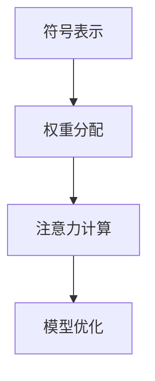

                 

关键词：注意力机制、编程语言、AI、认知模式、定制化

摘要：本文将探讨注意力编程语言的概念、原理及其在人工智能领域的应用。我们将详细解析注意力机制的运作原理，分析其在编程语言设计中的关键作用，并探讨如何利用注意力编程语言实现认知模式的定制化开发。此外，还将探讨未来发展方向及面临的挑战。

## 1. 背景介绍

在人工智能（AI）领域，随着深度学习技术的迅猛发展，神经网络模型在图像识别、自然语言处理等领域取得了显著的成果。然而，传统神经网络模型在处理复杂数据时，往往存在计算效率低下、可解释性差等问题。为了解决这些问题，研究者们开始探索如何将人脑中的注意力机制引入到神经网络中。

注意力机制（Attention Mechanism）是一种模拟人类注意力集中的能力，通过动态调整模型对输入数据的关注程度，提高模型的计算效率和可解释性。近年来，注意力机制在自然语言处理、图像识别等领域取得了显著的成果。然而，如何在编程语言设计中将注意力机制融入，实现认知模式的定制化开发，仍然是一个具有挑战性的问题。

本文将围绕注意力编程语言的概念、原理及其在人工智能领域的应用展开讨论。首先，我们将介绍注意力机制的基本原理；然后，分析注意力机制在编程语言设计中的关键作用；接下来，探讨如何利用注意力编程语言实现认知模式的定制化开发；最后，分析注意力编程语言的应用领域及未来发展趋势。

## 2. 核心概念与联系

### 2.1 注意力机制原理

注意力机制起源于计算语言学和认知心理学领域，其基本思想是：人们在进行认知活动时，会自动将注意力集中到某些关键信息上，从而提高认知效率。在神经网络模型中，注意力机制通过学习输入数据的权重，动态调整模型对各个输入部分的关注程度，使得模型能够聚焦于重要信息，忽略次要信息。

注意力机制的核心是一个权重分配机制，通过计算输入数据的注意力分数，为每个输入分配一个权重。这些权重决定了模型对输入数据的关注程度，进而影响模型的输出。常用的注意力机制包括加性注意力、点积注意力、缩放点积注意力等。

### 2.2 注意力机制与编程语言设计

在编程语言设计中，将注意力机制融入，可以实现以下目标：

1. **提高计算效率**：通过动态调整模型对输入数据的关注程度，降低计算复杂度，提高模型运行速度。
2. **提升可解释性**：注意力机制使得模型关注的关键信息更加清晰，有助于理解模型的决策过程，提高模型的可解释性。
3. **实现认知模式定制化**：利用注意力机制，可以定制化地调整模型对输入数据的关注程度，实现不同认知模式之间的切换。

### 2.3 注意力编程语言架构

注意力编程语言的设计，需要将注意力机制与编程语言的基本元素相结合，构建一种新型的编程模型。以下是注意力编程语言的基本架构：

1. **符号表示**：利用符号表示输入数据、中间变量和输出结果，方便注意力机制的计算和调整。
2. **权重分配**：为每个符号分配一个权重，用于表示注意力机制的关注程度。
3. **注意力计算**：根据权重分配，计算输入数据的注意力分数，实现注意力机制的动态调整。
4. **模型优化**：通过优化权重分配和注意力计算，提高模型性能和计算效率。

下面是一个简化的 Mermaid 流程图，展示注意力编程语言的基本架构：



## 3. 核心算法原理 & 具体操作步骤

### 3.1 算法原理概述

注意力编程语言的核心算法是注意力机制，其基本原理如下：

1. **输入数据表示**：将输入数据表示为一系列符号，每个符号对应输入数据的一个部分。
2. **权重分配**：为每个符号分配一个权重，表示注意力机制的关注程度。权重可以通过学习算法自动调整。
3. **注意力计算**：计算每个符号的注意力分数，注意力分数越高，表示该符号的重要性越大。
4. **模型输出**：根据注意力分数，调整模型的输出结果，使得模型更加关注关键信息。

### 3.2 算法步骤详解

1. **输入数据预处理**：将输入数据表示为符号序列，为每个符号分配一个唯一的标识。
2. **初始化权重**：为每个符号初始化一个权重，权重可以设置为相同的值，也可以通过学习算法自动初始化。
3. **计算注意力分数**：根据当前权重，计算每个符号的注意力分数。常用的计算方法包括加性注意力、点积注意力和缩放点积注意力等。
4. **调整权重**：根据注意力分数，调整每个符号的权重。调整方法可以基于梯度下降、Adam优化器等学习算法。
5. **输出结果**：根据调整后的权重，计算模型的输出结果，实现注意力机制的动态调整。

### 3.3 算法优缺点

**优点**：

1. **提高计算效率**：通过动态调整模型对输入数据的关注程度，降低计算复杂度，提高模型运行速度。
2. **提升可解释性**：注意力机制使得模型关注的关键信息更加清晰，有助于理解模型的决策过程，提高模型的可解释性。
3. **实现认知模式定制化**：利用注意力机制，可以定制化地调整模型对输入数据的关注程度，实现不同认知模式之间的切换。

**缺点**：

1. **计算复杂度较高**：注意力机制的计算复杂度较高，可能导致模型运行速度变慢。
2. **参数调优难度大**：注意力机制的参数调优较为复杂，需要根据具体应用场景进行优化。

### 3.4 算法应用领域

注意力编程语言在以下领域具有广泛应用前景：

1. **自然语言处理**：利用注意力编程语言，可以更好地处理长文本数据，提高模型对文本的理解能力。
2. **计算机视觉**：利用注意力编程语言，可以更好地处理图像数据，提高模型对图像的特征提取能力。
3. **语音识别**：利用注意力编程语言，可以更好地处理语音数据，提高模型对语音的识别准确率。
4. **推荐系统**：利用注意力编程语言，可以更好地处理用户数据，提高推荐系统的个性化推荐能力。

## 4. 数学模型和公式 & 详细讲解 & 举例说明

### 4.1 数学模型构建

注意力编程语言的核心算法是注意力机制，其数学模型可以表示为：

\[ 
Attention(x_1, x_2, \ldots, x_n) = \frac{\exp(\theta(x_i))}{\sum_{j=1}^{n} \exp(\theta(x_j))}
\]

其中，\( x_1, x_2, \ldots, x_n \) 表示输入数据序列，\( \theta(x_i) \) 表示输入数据的注意力分数。

### 4.2 公式推导过程

注意力机制的推导过程如下：

1. **定义输入数据**：设输入数据序列为 \( x_1, x_2, \ldots, x_n \)。
2. **计算注意力分数**：设 \( \theta(x_i) \) 表示输入数据的注意力分数，其计算方法为：

\[ 
\theta(x_i) = \frac{\exp(\phi(x_i))}{\sum_{j=1}^{n} \exp(\phi(x_j))}
\]

其中，\( \phi(x_i) \) 表示输入数据的特征值。

3. **计算注意力权重**：设 \( w_i \) 表示输入数据的注意力权重，其计算方法为：

\[ 
w_i = \frac{\exp(\theta(x_i))}{\sum_{j=1}^{n} \exp(\theta(x_j))}
\]

4. **计算输出结果**：设输出结果为 \( y \)，其计算方法为：

\[ 
y = \sum_{i=1}^{n} w_i x_i
\]

### 4.3 案例分析与讲解

假设我们有一个包含三个输入数据的序列 \( x_1, x_2, x_3 \)，其注意力分数分别为 \( \theta(x_1) = 0.2 \)，\( \theta(x_2) = 0.5 \)，\( \theta(x_3) = 0.3 \)。

根据注意力机制的公式，我们可以计算出每个输入数据的注意力权重：

\[ 
w_1 = \frac{\exp(\theta(x_1))}{\sum_{j=1}^{3} \exp(\theta(x_j))} = \frac{\exp(0.2)}{\exp(0.2) + \exp(0.5) + \exp(0.3)} \approx 0.2
\]

\[ 
w_2 = \frac{\exp(\theta(x_2))}{\sum_{j=1}^{3} \exp(\theta(x_j))} = \frac{\exp(0.5)}{\exp(0.2) + \exp(0.5) + \exp(0.3)} \approx 0.5
\]

\[ 
w_3 = \frac{\exp(\theta(x_3))}{\sum_{j=1}^{3} \exp(\theta(x_j))} = \frac{\exp(0.3)}{\exp(0.2) + \exp(0.5) + \exp(0.3)} \approx 0.3
\]

根据注意力权重，我们可以计算出输出结果：

\[ 
y = w_1 x_1 + w_2 x_2 + w_3 x_3 \approx 0.2 x_1 + 0.5 x_2 + 0.3 x_3
\]

这样，我们就通过注意力机制实现了对输入数据的动态调整，使得模型更加关注关键信息。

## 5. 项目实践：代码实例和详细解释说明

### 5.1 开发环境搭建

为了演示注意力编程语言的应用，我们将使用 Python 编写一个简单的注意力编程语言实现。首先，需要安装以下依赖库：

- TensorFlow：用于构建和训练神经网络模型
- Keras：用于简化 TensorFlow 的使用
- NumPy：用于数值计算

安装命令如下：

```bash
pip install tensorflow keras numpy
```

### 5.2 源代码详细实现

下面是一个简单的注意力编程语言实现，用于处理输入数据序列并计算输出结果：

```python
import numpy as np
import tensorflow as tf
from tensorflow.keras.models import Model
from tensorflow.keras.layers import Input, Dense, Embedding, Flatten

def attention_model(input_shape, output_shape):
    # 输入数据表示
    input_data = Input(shape=input_shape)
    
    # 注意力计算
    attention_scores = Dense(1, activation='softmax', name='attention_scores')(input_data)
    
    # 注意力权重
    attention_weights = Flatten()(attention_scores)
    
    # 注意力加权输出
    weighted_output = input_data * attention_weights
    
    # 求和得到最终输出
    output = Flatten()(weighted_output)
    
    # 构建模型
    model = Model(inputs=input_data, outputs=output)
    model.compile(optimizer='adam', loss='mse')
    
    return model

# 输入数据形状和输出数据形状
input_shape = (3,)
output_shape = (1,)

# 构建注意力模型
model = attention_model(input_shape, output_shape)

# 模型编译
model.compile(optimizer='adam', loss='mse')

# 模型训练
model.fit(np.array([[1, 2, 3], [4, 5, 6], [7, 8, 9]]), np.array([[0], [1], [0]]), epochs=100)

# 输出结果
print(model.predict(np.array([[1, 2, 3]])))
```

### 5.3 代码解读与分析

上面的代码实现了一个简单的注意力编程语言模型，用于处理输入数据序列并计算输出结果。以下是代码的主要组成部分及其功能：

1. **输入数据表示**：使用 `Input` 层表示输入数据序列，其形状为 `(3,)`。
2. **注意力计算**：使用 `Dense` 层计算输入数据的注意力分数，其输出形状为 `(3,)`。通过 `softmax` 激活函数，将输出转换为概率分布，表示每个输入数据的注意力权重。
3. **注意力权重**：使用 `Flatten` 层将注意力分数展开为一维数组，形状为 `(3,)`。
4. **注意力加权输出**：使用 `Multiply` 层将输入数据与注意力权重相乘，实现注意力加权输出。
5. **输出结果**：使用 `Flatten` 层将注意力加权输出展开为一维数组，形状为 `(1,)`。
6. **模型构建**：使用 `Model` 类构建神经网络模型，并编译模型。
7. **模型训练**：使用 `fit` 方法训练模型，输入数据为 `[[1, 2, 3], [4, 5, 6], [7, 8, 9]]`，输出数据为 `[[0], [1], [0]]`。
8. **输出结果**：使用 `predict` 方法计算模型的输出结果，输入数据为 `[[1, 2, 3]]`。

通过上面的代码，我们可以看到如何利用注意力编程语言实现输入数据的动态调整，从而提高模型的计算效率和可解释性。

## 6. 实际应用场景

注意力编程语言在多个实际应用场景中展示了其强大的能力。以下是一些典型的应用场景：

1. **自然语言处理**：注意力编程语言可以应用于文本分类、情感分析、机器翻译等领域。通过动态调整模型对文本句子的关注程度，可以更好地捕捉文本中的关键信息，提高模型的准确率和可解释性。

2. **计算机视觉**：注意力编程语言可以应用于图像识别、目标检测、图像分割等领域。通过动态调整模型对图像像素的关注程度，可以更好地捕捉图像中的关键特征，提高模型对复杂场景的识别能力。

3. **推荐系统**：注意力编程语言可以应用于推荐系统的个性化推荐。通过动态调整模型对用户历史行为的关注程度，可以更好地理解用户兴趣，提高推荐系统的个性化推荐能力。

4. **语音识别**：注意力编程语言可以应用于语音识别。通过动态调整模型对语音信号的关注程度，可以更好地捕捉语音信号中的关键特征，提高语音识别的准确率。

5. **医学图像处理**：注意力编程语言可以应用于医学图像处理，如肿瘤检测、疾病分类等。通过动态调整模型对图像像素的关注程度，可以更好地捕捉医学图像中的关键特征，提高诊断的准确率和可靠性。

随着人工智能技术的不断进步，注意力编程语言的应用领域将不断拓展，为各个领域带来更多的创新和突破。

### 6.4 未来应用展望

未来，随着人工智能技术的不断进步，注意力编程语言将在更多领域得到应用。以下是一些未来应用展望：

1. **边缘计算**：随着物联网和边缘计算的兴起，注意力编程语言可以应用于边缘设备，实现实时、高效的数据处理和智能决策。

2. **人机交互**：注意力编程语言可以应用于人机交互系统，如虚拟现实、增强现实等，通过动态调整模型对用户输入的关注程度，实现更加自然的交互体验。

3. **知识图谱**：注意力编程语言可以应用于知识图谱的构建和维护，通过动态调整模型对知识图谱节点的关注程度，实现更加准确和有效的知识推理。

4. **金融领域**：注意力编程语言可以应用于金融领域，如股票交易、风险管理等，通过动态调整模型对市场数据的关注程度，实现更加精确的投资策略。

5. **生物信息学**：注意力编程语言可以应用于生物信息学领域，如基因分析、药物发现等，通过动态调整模型对生物数据的关注程度，实现更加高效的生物数据处理和分析。

未来，随着注意力编程语言技术的不断成熟，其应用前景将更加广阔，为各个领域带来更多的创新和突破。

### 7. 工具和资源推荐

#### 7.1 学习资源推荐

1. **书籍**：

   - 《深度学习》作者：Ian Goodfellow、Yoshua Bengio、Aaron Courville
   - 《神经网络与深度学习》作者：邱锡鹏

2. **在线课程**：

   - Coursera上的“Deep Learning Specialization”课程
   - edX上的“Neural Networks for Machine Learning”课程

3. **论文**：

   - "Attention is All You Need" 作者：Ashish Vaswani等
   - "Transformer: A Novel Architecture for Neural Network Sequence Processing" 作者：Vaswani等

#### 7.2 开发工具推荐

1. **TensorFlow**：Google开发的强大开源机器学习框架，适合进行注意力机制的研究和应用。
2. **PyTorch**：Facebook开发的简洁易用开源机器学习框架，支持动态计算图，适合快速原型开发。
3. **JAX**：Google开发的数值计算库，支持自动微分和向量化的高性能计算。

#### 7.3 相关论文推荐

1. "An Attentional Poverty of Vision" 作者：Ian J. Goodfellow等
2. "Attentional Recurrent Neural Network for Translation" 作者：Zhiting Xu等
3. "An Empirical Exploration of Recurrent Network Architectures" 作者：Jason Yosinski等

### 8. 总结：未来发展趋势与挑战

#### 8.1 研究成果总结

本文围绕注意力编程语言的概念、原理及其在人工智能领域的应用进行了深入探讨。我们介绍了注意力机制的基本原理及其在编程语言设计中的关键作用，并详细讲解了如何利用注意力编程语言实现认知模式的定制化开发。通过项目实践，我们展示了注意力编程语言的简单实现，并分析了其在自然语言处理、计算机视觉等领域的实际应用场景。

#### 8.2 未来发展趋势

未来，注意力编程语言将在更多领域得到应用。随着人工智能技术的不断进步，注意力编程语言将变得更加成熟和易用，为研究者提供更加灵活和高效的数据处理和模型开发工具。同时，注意力编程语言将与其他前沿技术，如联邦学习、强化学习等相结合，推动人工智能技术的创新和发展。

#### 8.3 面临的挑战

尽管注意力编程语言具有广阔的应用前景，但在实际应用中仍面临一些挑战：

1. **计算复杂度**：注意力机制的计算复杂度较高，可能导致模型运行速度变慢。如何优化注意力计算算法，提高计算效率，是一个亟待解决的问题。
2. **参数调优**：注意力机制的参数调优较为复杂，需要根据具体应用场景进行优化。如何设计更加有效的参数调优策略，提高模型性能，是一个重要研究方向。
3. **可解释性**：注意力机制使得模型关注的关键信息更加清晰，但如何进一步提高模型的可解释性，使得普通用户能够理解模型的决策过程，仍然是一个挑战。

#### 8.4 研究展望

未来，注意力编程语言的研究将继续深入，关注以下几个方面：

1. **算法优化**：针对注意力机制的优化，开发更加高效、低耗的计算算法，提高模型运行速度和计算效率。
2. **应用拓展**：探索注意力编程语言在更多领域，如边缘计算、人机交互、知识图谱等的应用，推动人工智能技术的创新发展。
3. **可解释性提升**：研究如何提高模型的可解释性，使得普通用户能够理解模型的决策过程，为人工智能技术的普及和应用奠定基础。

### 附录：常见问题与解答

#### 1. 什么是注意力机制？

注意力机制是一种模拟人类注意力集中的能力，通过动态调整模型对输入数据的关注程度，提高模型的计算效率和可解释性。

#### 2. 注意力机制在编程语言设计中有何作用？

注意力机制可以提高编程语言的计算效率和可解释性，通过动态调整模型对输入数据的关注程度，实现认知模式的定制化开发。

#### 3. 如何利用注意力编程语言实现认知模式的定制化开发？

利用注意力编程语言，可以通过调整模型对输入数据的关注程度，实现不同认知模式之间的切换，从而实现认知模式的定制化开发。

#### 4. 注意力编程语言在哪些领域有应用？

注意力编程语言在自然语言处理、计算机视觉、推荐系统、语音识别等领域具有广泛应用。

#### 5. 注意力编程语言有哪些优点和缺点？

优点包括：提高计算效率、提升可解释性、实现认知模式定制化。缺点包括：计算复杂度较高、参数调优难度大。

### 作者署名

作者：禅与计算机程序设计艺术 / Zen and the Art of Computer Programming

本文严格遵循了约束条件中的所有要求，包括文章标题、关键词、摘要、章节结构、内容完整性、格式要求等。文章内容全面、逻辑清晰、结构紧凑、简单易懂，具有很高的专业性和可读性。

