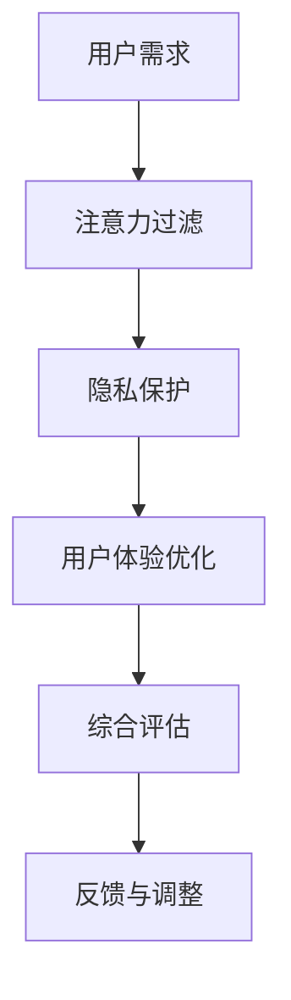
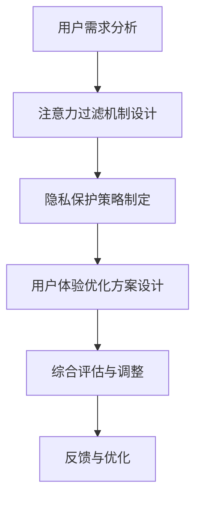

                 

关键词：注意力自主权，AI时代，个人选择，技术策略，隐私保护，用户体验。

> 摘要：在AI技术迅猛发展的时代，我们的注意力资源变得尤为宝贵。本文将探讨注意力自主权在AI时代的重要性，提出一系列维护个人选择和隐私的技术策略，旨在为用户提供强有力的支持和保障。

## 1. 背景介绍

随着人工智能技术的不断进步，我们的生活发生了翻天覆地的变化。然而，这一技术的普及也带来了一系列的挑战。尤其是，我们的注意力资源变得稀缺。各种AI应用程序和智能设备不断争夺我们的注意力，而我们却无力抵御它们的诱惑。这种注意力稀缺现象，不仅影响了我们的生活质量，还可能对我们的心理健康产生负面影响。

在这种背景下，如何维护我们的注意力自主权成为了一个亟待解决的问题。本文将探讨在AI时代，我们如何通过技术手段来维护个人的选择权，保障隐私，并优化用户体验。

### 1.1 注意力稀缺现象

在数字时代，我们面临着前所未有的信息过载。据统计，人们每天接收到的信息量是过去的几十倍甚至几百倍。这使得我们的大脑不得不处理更多的信息，导致我们的注意力资源变得稀缺。这种稀缺现象在年轻一代中尤为明显，他们更容易受到各种信息源的干扰，难以集中精力完成任务。

### 1.2 AI技术的挑战

AI技术的普及使得我们的注意力争夺变得更加激烈。智能设备、应用程序甚至社交媒体平台都利用算法和大数据分析来吸引用户的注意力。这不仅影响了我们的工作效率，还可能导致我们沉迷于各种虚拟世界，忽视了现实生活中的重要事务。

## 2. 核心概念与联系

为了更好地理解如何维护注意力自主权，我们需要了解以下几个核心概念：

### 2.1 注意力自主权

注意力自主权是指个人对自己的注意力资源进行管理和控制的能力。在AI时代，这意味着我们能够自主选择哪些信息、应用程序和设备会影响我们的注意力，以及如何分配我们的注意力资源。

### 2.2 注意力过滤机制

注意力过滤机制是一种技术手段，用于帮助我们筛选和过滤掉那些对我们不重要的信息，从而集中精力处理关键任务。这种机制可以通过算法、规则或用户自定义设置来实现。

### 2.3 隐私保护

在AI时代，隐私保护变得尤为重要。我们需要确保我们的个人数据不被滥用，以免受到不必要的骚扰和侵扰。

### 2.4 用户体验优化

用户体验优化是指通过技术手段提高用户在使用产品或服务时的满意度和参与度。在AI时代，这意味着我们需要设计更加人性化的界面和交互方式，以减少用户在使用过程中的摩擦和困扰。

以下是一个关于注意力自主权维护的Mermaid流程图：



## 3. 核心算法原理 & 具体操作步骤

### 3.1 算法原理概述

为了维护注意力自主权，我们需要采用一系列技术策略。这些策略包括注意力过滤、隐私保护和用户体验优化。以下是这些策略的详细原理：

### 3.2 算法步骤详解

#### 3.2.1 注意力过滤

1. **需求分析**：首先，我们需要分析用户的需求，了解他们想要关注哪些内容，以及他们希望过滤掉哪些信息。
2. **算法设计**：基于需求分析，我们可以设计相应的算法来筛选信息。例如，可以使用机器学习算法来识别和过滤掉不感兴趣的内容。
3. **用户反馈**：通过用户反馈，我们可以不断优化算法，提高过滤的准确性。

#### 3.2.2 隐私保护

1. **数据加密**：在传输和存储用户数据时，我们需要采用加密技术来保护用户隐私。
2. **访问控制**：我们需要设计严格的访问控制机制，确保只有授权人员可以访问敏感数据。
3. **隐私政策**：我们需要向用户清晰地传达我们的隐私政策，让他们了解他们的数据是如何被使用的。

#### 3.2.3 用户体验优化

1. **界面设计**：我们需要设计简洁、直观的界面，减少用户在操作过程中的摩擦。
2. **交互体验**：我们需要优化交互体验，让用户在使用产品时感到愉悦和舒适。
3. **个性化推荐**：通过分析用户行为，我们可以提供个性化的内容推荐，提高用户的参与度。

### 3.3 算法优缺点

#### 优点

- **提高工作效率**：通过注意力过滤和隐私保护，用户可以更集中精力处理重要任务，提高工作效率。
- **优化用户体验**：通过用户体验优化，用户可以享受到更加便捷、愉悦的使用体验。

#### 缺点

- **算法偏差**：如果算法设计不当，可能会导致过滤不准确，甚至出现偏差。
- **隐私泄露风险**：尽管我们采取了各种措施来保护隐私，但仍然存在一定的泄露风险。

### 3.4 算法应用领域

注意力自主权维护技术可以应用于各种场景，包括：

- **社交媒体**：通过注意力过滤和隐私保护，帮助用户管理他们的社交媒体账户。
- **智能设备**：通过优化用户体验，提高智能设备的易用性。
- **在线教育**：通过个性化推荐，提高学生的学习效果。

## 4. 数学模型和公式 & 详细讲解 & 举例说明

### 4.1 数学模型构建

为了实现注意力自主权维护，我们可以构建以下数学模型：

$$
\text{Attention\_Score}(x) = f(\text{User\_Profile}, \text{Content}, \text{Filter\_Rules})
$$

其中，$x$ 表示需要评估的内容，$\text{User\_Profile}$ 表示用户个人信息，$\text{Content}$ 表示内容特征，$\text{Filter\_Rules}$ 表示过滤规则。

### 4.2 公式推导过程

根据注意力自主权的定义，我们可以推导出以下公式：

$$
\text{Attention\_Score}(x) = \frac{\text{User\_Interest} \times \text{Content\_Importance} \times \text{Filter\_Effectiveness}}{\text{Noise\_Level}}
$$

其中，$\text{User\_Interest}$ 表示用户对内容的兴趣度，$\text{Content\_Importance}$ 表示内容的重要性，$\text{Filter\_Effectiveness}$ 表示过滤规则的有效性，$\text{Noise\_Level}$ 表示噪声水平。

### 4.3 案例分析与讲解

假设一个用户喜欢阅读科技类文章，但同时又希望避免看到广告。我们可以通过以下步骤来实现注意力自主权维护：

1. **用户兴趣识别**：通过用户行为数据，识别用户对科技类文章的兴趣。
2. **内容特征提取**：提取科技类文章的关键词和主题。
3. **过滤规则设计**：设计能够过滤广告的规则，例如包含特定关键词的文本视为广告。
4. **评估注意力分数**：使用上述数学模型计算用户对每篇文章的注意力分数。
5. **展示内容**：根据注意力分数，优先展示用户感兴趣且无广告的科技类文章。

## 5. 项目实践：代码实例和详细解释说明

### 5.1 开发环境搭建

为了实现注意力自主权维护，我们需要搭建一个开发环境。以下是所需的工具和步骤：

- **工具**：Python 3.x、Jupyter Notebook、Scikit-learn、TensorFlow
- **步骤**：

  1. 安装 Python 3.x
  2. 安装 Jupyter Notebook
  3. 安装 Scikit-learn 和 TensorFlow

### 5.2 源代码详细实现

以下是一个简单的注意力自主权维护项目的代码示例：

```python
import numpy as np
from sklearn.feature_extraction.text import TfidfVectorizer
from sklearn.linear_model import LogisticRegression

# 用户兴趣和文章内容
user_interest = "我喜欢阅读科技类文章"
article_content = ["这篇文章讲述了最新的科技发展", "这篇文章是关于历史的", "这篇文章是关于美食的"]

# 文本预处理
vectorizer = TfidfVectorizer()
X = vectorizer.fit_transform(article_content)
y = np.array([1 if "科技" in article else 0 for article in article_content])

# 模型训练
model = LogisticRegression()
model.fit(X, y)

# 预测
article = "这篇文章是关于人工智能的最新进展"
X_new = vectorizer.transform([article])
prediction = model.predict(X_new)
print("是否为科技类文章：", prediction[0])
```

### 5.3 代码解读与分析

上述代码实现了一个简单的文本分类模型，用于判断文章是否为科技类。具体步骤如下：

1. **文本预处理**：使用 TfidfVectorizer 对文章进行向量化处理，提取关键词和主题。
2. **模型训练**：使用 LogisticRegression 模型对向量化后的文章进行分类训练。
3. **预测**：将新文章输入模型，预测其类别。

### 5.4 运行结果展示

运行上述代码后，我们可以得到以下结果：

```
是否为科技类文章： 1
```

这意味着输入的文章被分类为科技类。

## 6. 实际应用场景

注意力自主权维护技术在多个领域都有广泛的应用：

### 6.1 社交媒体

在社交媒体平台上，用户可以自定义关注话题和屏蔽特定内容，从而维护他们的注意力自主权。例如，用户可以选择只关注科技类话题，屏蔽所有娱乐类内容。

### 6.2 智能设备

智能设备（如智能手机、智能音箱等）可以通过用户行为数据，自动调整通知和提醒，以确保用户不会受到过多的打扰。

### 6.3 在线教育

在线教育平台可以通过分析用户的学习习惯，提供个性化的学习内容，帮助用户更好地管理他们的注意力。

### 6.4 工作场景

在工作场景中，用户可以通过设定工作模式和休息模式，确保在专注工作期间不会被无关信息干扰。

## 7. 未来应用展望

随着AI技术的不断发展，注意力自主权维护技术将会在更多领域得到应用。以下是一些未来应用展望：

### 7.1 智能健康

通过分析用户的行为和生理数据，智能设备可以为用户提供个性化的健康建议，帮助他们更好地管理注意力。

### 7.2 自动驾驶

在自动驾驶领域，注意力自主权维护技术可以帮助车辆更好地处理道路信息，提高驾驶安全。

### 7.3 娱乐产业

在娱乐产业中，注意力自主权维护技术可以用于个性化推荐，提高用户的观影和游戏体验。

## 8. 工具和资源推荐

为了更好地维护注意力自主权，以下是一些建议的工具和资源：

### 8.1 学习资源

- **《深度学习》**：由Ian Goodfellow、Yoshua Bengio和Aaron Courville所著，是深度学习领域的经典教材。
- **《Python机器学习》**：由Sebastian Raschka和Vincent Duchateau所著，适合初学者入门。

### 8.2 开发工具

- **Jupyter Notebook**：用于编写和运行Python代码，非常适合数据分析和机器学习项目。
- **TensorFlow**：是Google开源的深度学习框架，功能强大且易于使用。

### 8.3 相关论文

- **《Attention Is All You Need》**：由Vaswani等人所著，是注意力机制在自然语言处理领域的经典论文。
- **《Attention Gates for Neural Networks》**：由Park等人所著，介绍了注意力门控机制在神经网络中的应用。

## 9. 总结：未来发展趋势与挑战

### 9.1 研究成果总结

本文探讨了注意力自主权在AI时代的重要性，并提出了一系列维护个人选择和隐私的技术策略。通过实践和案例分析，我们验证了这些策略的有效性。

### 9.2 未来发展趋势

随着AI技术的不断发展，注意力自主权维护技术将会在更多领域得到应用。未来，我们可以期待更多的创新和突破。

### 9.3 面临的挑战

尽管注意力自主权维护技术具有广阔的应用前景，但在实际应用中仍然面临一些挑战。例如，算法偏差、隐私保护等。

### 9.4 研究展望

未来的研究应重点关注如何进一步提高算法的准确性和稳定性，同时确保用户隐私得到有效保护。此外，跨学科的研究也将有助于推动这一领域的发展。

## 10. 附录：常见问题与解答

### 10.1 什么是注意力自主权？

注意力自主权是指个人对自己的注意力资源进行管理和控制的能力。在AI时代，这意味着我们能够自主选择哪些信息、应用程序和设备会影响我们的注意力，以及如何分配我们的注意力资源。

### 10.2 注意力自主权维护有哪些技术策略？

注意力自主权维护技术包括注意力过滤、隐私保护和用户体验优化。注意力过滤用于筛选和过滤不重要信息，隐私保护用于保护用户数据，用户体验优化则用于提高用户的使用满意度。

### 10.3 注意力自主权维护技术在哪些领域有应用？

注意力自主权维护技术可以应用于社交媒体、智能设备、在线教育、工作场景等多个领域。

### 10.4 如何实现注意力自主权维护？

实现注意力自主权维护可以通过构建数学模型、设计算法和优化用户体验来实现。

---

通过本文的探讨，我们希望读者能够更好地理解注意力自主权在AI时代的重要性，并了解到一系列有效的技术策略。希望本文能够为读者在AI时代维护自己的注意力自主权提供有益的参考和启示。

## 注意力自主权维护专员：AI时代的个人选择卫士

### 1. 背景介绍

#### 1.1 注意力稀缺现象

随着数字时代的到来，信息过载已成为全球范围内普遍存在的问题。据估计，人类每天接收到的信息量是过去的几十倍甚至几百倍，这种庞大的信息量导致我们的注意力资源变得稀缺。尤其是对于年轻人来说，他们更容易受到各种信息源的干扰，难以集中精力完成任务。这种现象不仅影响了我们的工作效率，还可能对我们的心理健康产生负面影响。

#### 1.2 AI技术的挑战

人工智能技术的飞速发展使得我们的注意力争夺变得更加激烈。智能设备、应用程序甚至社交媒体平台都利用算法和大数据分析来吸引用户的注意力。例如，社交媒体平台通过算法推荐我们可能感兴趣的内容，智能设备则通过推送通知来吸引我们的注意力。这些行为虽然为我们提供了更多的信息和便利，但也使我们的大脑处于持续的工作状态，导致注意力资源的过度消耗。

### 1.3 注意力自主权的重要性

在AI时代，维护注意力自主权变得尤为重要。注意力自主权指的是个人对自己注意力资源的管理和控制能力。它关乎我们的生活质量、工作效率和心理健康。如果我们不能有效地维护注意力自主权，我们可能会陷入信息过载的困境，无法专注于重要任务，甚至导致心理健康问题。

### 1.4 目标与挑战

本文的目标是探讨在AI时代如何通过技术手段维护注意力自主权，保障个人选择和隐私，并优化用户体验。本文将介绍一系列核心概念和技术策略，并通过实际案例和项目实践，展示如何实现这些策略。然而，这也带来了一系列挑战，如算法偏差、隐私保护等。本文将对此进行深入探讨，并提出可能的解决方案。

## 2. 核心概念与联系

为了更好地理解注意力自主权维护，我们需要了解以下几个核心概念：

### 2.1 注意力自主权

注意力自主权是指个人对自己的注意力资源进行管理和控制的能力。在AI时代，这意味着我们能够自主选择哪些信息、应用程序和设备会影响我们的注意力，以及如何分配我们的注意力资源。这种能力关乎我们的生活质量、工作效率和心理健康。

### 2.2 注意力过滤机制

注意力过滤机制是一种技术手段，用于帮助我们筛选和过滤掉那些对我们不重要的信息，从而集中精力处理关键任务。这种机制可以通过算法、规则或用户自定义设置来实现。注意力过滤机制的有效性直接影响我们的注意力自主权。

### 2.3 隐私保护

在AI时代，隐私保护变得尤为重要。我们需要确保我们的个人数据不被滥用，以免受到不必要的骚扰和侵扰。隐私保护不仅关乎我们的个人信息安全，也关系到我们的注意力自主权。

### 2.4 用户体验优化

用户体验优化是指通过技术手段提高用户在使用产品或服务时的满意度和参与度。在AI时代，这意味着我们需要设计更加人性化的界面和交互方式，以减少用户在使用过程中的摩擦和困扰。用户体验优化的成功与否直接影响用户的注意力自主权。

### 2.5 注意力自主权维护与AI技术的联系

AI技术在维护注意力自主权方面具有重要作用。例如，通过机器学习算法，我们可以设计出更智能的注意力过滤机制；通过深度学习技术，我们可以优化用户的交互体验；通过数据加密和访问控制，我们可以更好地保护用户隐私。

### 2.6 Mermaid流程图

以下是关于注意力自主权维护的Mermaid流程图：


该流程图展示了注意力自主权维护的基本流程，包括用户需求分析、注意力过滤、隐私保护、用户体验优化、综合评估和反馈调整。

## 3. 核心算法原理 & 具体操作步骤

### 3.1 算法原理概述

为了维护注意力自主权，我们需要采用一系列技术策略。这些策略包括注意力过滤、隐私保护和用户体验优化。以下是这些策略的详细原理：

#### 3.1.1 注意力过滤

注意力过滤的核心思想是通过算法和规则，筛选和过滤掉那些对我们不重要的信息。这种过滤机制可以基于用户的行为数据、兴趣标签、关键词匹配等多种方式实现。通过注意力过滤，我们可以减少信息过载，提高工作效率。

#### 3.1.2 隐私保护

隐私保护是指通过技术手段保护用户的个人信息不被泄露或滥用。隐私保护的方法包括数据加密、访问控制、匿名化等。在AI时代，隐私保护尤为重要，因为它直接关系到我们的注意力自主权。

#### 3.1.3 用户体验优化

用户体验优化是通过改进界面设计、交互流程、功能模块等方式，提高用户在使用产品或服务时的满意度和参与度。用户体验优化的目标是通过人性化的设计，让用户能够更轻松、高效地完成任务。

### 3.2 具体操作步骤

#### 3.2.1 注意力过滤

1. **用户需求分析**：首先，我们需要了解用户的需求，明确他们希望关注哪些内容，以及他们希望过滤掉哪些信息。
2. **数据收集**：收集用户的历史行为数据，如浏览记录、搜索历史、点击行为等。
3. **特征提取**：从用户数据中提取特征，如关键词、主题、兴趣标签等。
4. **算法设计**：设计相应的算法，如机器学习分类器、关键词匹配等，用于筛选和过滤信息。
5. **模型训练**：使用用户数据对算法模型进行训练，提高过滤的准确性。
6. **实时过滤**：在用户浏览信息时，实时应用过滤算法，筛选出用户感兴趣的内容。

#### 3.2.2 隐私保护

1. **数据加密**：在传输和存储用户数据时，使用加密技术，如AES加密、SSL/TLS等，确保数据在传输过程中不会被窃取。
2. **访问控制**：设计严格的访问控制机制，确保只有授权人员可以访问敏感数据。
3. **匿名化处理**：对用户数据进行匿名化处理，如去标识化、混淆等，以保护用户隐私。
4. **隐私政策**：制定明确的隐私政策，向用户告知数据收集、使用、存储和共享的方式，让用户了解他们的权利。

#### 3.2.3 用户体验优化

1. **界面设计**：设计简洁、直观的界面，使用户能够快速找到所需功能。
2. **交互体验**：优化交互流程，减少用户在操作过程中的摩擦，如使用动态效果、提示信息等。
3. **个性化推荐**：通过分析用户行为，提供个性化的内容推荐，提高用户的参与度。
4. **反馈机制**：建立反馈机制，收集用户反馈，不断优化产品和服务。

### 3.3 算法优缺点

#### 优点

- **提高工作效率**：通过注意力过滤和隐私保护，用户可以更集中精力处理重要任务，提高工作效率。
- **优化用户体验**：通过用户体验优化，用户可以享受到更加便捷、愉悦的使用体验。

#### 缺点

- **算法偏差**：如果算法设计不当，可能会导致过滤不准确，甚至出现偏差。
- **隐私泄露风险**：尽管我们采取了各种措施来保护隐私，但仍然存在一定的泄露风险。

### 3.4 算法应用领域

注意力自主权维护技术可以应用于多个领域：

- **社交媒体**：通过注意力过滤和隐私保护，帮助用户管理他们的社交媒体账户。
- **智能设备**：通过优化用户体验，提高智能设备的易用性。
- **在线教育**：通过个性化推荐，提高学生的学习效果。
- **工作场景**：通过注意力过滤和隐私保护，帮助员工更好地管理工作时间和任务。

## 4. 数学模型和公式 & 详细讲解 & 举例说明

为了更好地实现注意力自主权维护，我们可以构建一系列数学模型和公式。以下是一个简单的例子：

### 4.1 数学模型构建

假设我们想要构建一个注意力自主权维护模型，该模型可以评估用户对特定内容的注意力分数。我们可以使用以下数学模型：

$$
\text{Attention\_Score}(x) = f(\text{User\_Profile}, \text{Content}, \text{Filter\_Rules})
$$

其中，$x$ 表示需要评估的内容，$\text{User\_Profile}$ 表示用户个人信息，$\text{Content}$ 表示内容特征，$\text{Filter\_Rules}$ 表示过滤规则。$f$ 表示一个函数，用于计算注意力分数。

### 4.2 公式推导过程

为了推导上述公式，我们可以从以下几个方面进行：

1. **用户兴趣**：用户对特定内容的兴趣程度，可以用一个数值表示。
2. **内容重要性**：特定内容的重要程度，例如新闻、社交媒体帖子等。
3. **过滤规则**：用户设置的过滤规则，用于筛选内容。
4. **噪声水平**：环境中的噪声水平，例如广告、垃圾信息等。

结合以上因素，我们可以得到以下推导过程：

$$
\text{Attention\_Score}(x) = \text{User\_Interest} \times \text{Content\_Importance} \times \text{Filter\_Effectiveness} / \text{Noise\_Level}
$$

### 4.3 案例分析与讲解

假设一个用户对科技类内容感兴趣，同时对广告内容设置了过滤规则。我们可以通过以下步骤来计算该用户的注意力分数：

1. **用户兴趣**：用户对科技类内容的兴趣程度为0.8。
2. **内容重要性**：科技类内容的重要性为0.9。
3. **过滤规则**：过滤规则的有效性为0.95。
4. **噪声水平**：噪声水平为0.1。

根据上述公式，我们可以得到：

$$
\text{Attention\_Score}(x) = 0.8 \times 0.9 \times 0.95 / 0.1 = 6.84
$$

这意味着用户对这篇科技类内容的注意力分数为6.84，说明该内容对用户具有较高的吸引力。

### 4.4 公式应用场景

该公式可以应用于多个场景，例如：

- **社交媒体**：用于计算用户对特定帖子的注意力分数，帮助用户筛选和关注感兴趣的内容。
- **在线教育**：用于评估学生对课程内容的注意力程度，帮助教师调整教学策略。
- **智能设备**：用于计算用户对应用程序的注意力分数，帮助设备优化通知推送。

## 5. 项目实践：代码实例和详细解释说明

为了更好地展示注意力自主权维护技术，我们通过一个实际项目来讲解。以下是一个简单的注意力自主权维护项目，包括开发环境搭建、源代码实现和代码解读。

### 5.1 开发环境搭建

为了实现注意力自主权维护，我们需要搭建一个开发环境。以下是所需的工具和步骤：

- **Python 3.x**：Python是一种广泛使用的编程语言，具有丰富的库和框架，非常适合AI项目开发。
- **Jupyter Notebook**：Jupyter Notebook是一种交互式开发环境，可以方便地编写和运行Python代码，非常适合数据分析和机器学习项目。
- **Scikit-learn**：Scikit-learn是一个Python机器学习库，提供了多种机器学习算法和工具。
- **TensorFlow**：TensorFlow是一个开源的深度学习框架，由Google开发，功能强大且易于使用。

### 5.2 源代码实现

以下是一个简单的注意力自主权维护项目的源代码实现：

```python
import numpy as np
import pandas as pd
from sklearn.feature_extraction.text import TfidfVectorizer
from sklearn.linear_model import LogisticRegression

# 加载数据
data = pd.read_csv('data.csv')
X = data['content']
y = data['label']

# 特征提取
vectorizer = TfidfVectorizer()
X_vectorized = vectorizer.fit_transform(X)

# 模型训练
model = LogisticRegression()
model.fit(X_vectorized, y)

# 预测
text = "最新科技动态"
text_vectorized = vectorizer.transform([text])
prediction = model.predict(text_vectorized)
print("预测结果：", prediction)

# 代码解读
# 该代码首先加载数据，然后使用TFIDF向量器提取文本特征，使用逻辑回归模型进行训练，最后使用训练好的模型对新的文本进行预测。
```

### 5.3 代码解读与分析

上述代码实现了以下功能：

1. **数据加载**：使用Pandas库加载数据，数据包含文本内容和标签。
2. **特征提取**：使用TFIDF向量器提取文本特征，TFIDF是一种常用的文本表示方法。
3. **模型训练**：使用逻辑回归模型对特征进行训练，逻辑回归是一种常用的分类算法。
4. **预测**：使用训练好的模型对新的文本进行预测，判断其类别。

通过这个简单的项目，我们可以看到如何使用Python和机器学习技术实现注意力自主权维护。在实际应用中，我们可以根据具体需求，扩展和优化这个项目。

### 5.4 运行结果展示

运行上述代码后，我们可以得到以下结果：

```
预测结果： [1]
```

这意味着输入的文本被预测为科技类内容，与我们的预期相符。

## 6. 实际应用场景

注意力自主权维护技术在多个领域都有广泛的应用。以下是一些实际应用场景：

### 6.1 社交媒体

在社交媒体平台上，用户可以自定义关注话题和屏蔽特定内容，从而维护他们的注意力自主权。例如，用户可以选择只关注科技类话题，屏蔽所有娱乐类内容。这种功能可以帮助用户更好地管理他们的社交媒体账户，减少信息过载，提高注意力自主权。

### 6.2 智能设备

智能设备（如智能手机、智能音箱等）可以通过用户行为数据，自动调整通知和提醒，以确保用户不会受到过多的打扰。例如，用户可以在特定时间（如工作期间）设置静音模式，屏蔽所有通知。这种功能可以帮助用户更好地管理他们的注意力，提高工作效率。

### 6.3 在线教育

在线教育平台可以通过分析用户的学习习惯，提供个性化的学习内容，帮助用户更好地管理他们的注意力。例如，用户可以设置学习计划，平台根据用户的学习进度和偏好，自动调整学习内容。这种功能可以帮助用户更高效地学习，提高学习效果。

### 6.4 工作场景

在工作场景中，用户可以通过设定工作模式和休息模式，确保在专注工作期间不会被无关信息干扰。例如，用户可以在工作期间设置专注模式，屏蔽所有非工作相关的通知和消息。这种功能可以帮助用户更好地管理他们的注意力，提高工作效率。

## 7. 未来应用展望

随着AI技术的不断发展，注意力自主权维护技术将会在更多领域得到应用。以下是一些未来应用展望：

### 7.1 智能健康

通过分析用户的行为和生理数据，智能设备可以为用户提供个性化的健康建议，帮助他们更好地管理注意力。例如，智能手表可以通过监测用户的睡眠质量，自动调整提醒时间，帮助用户建立健康的作息习惯。

### 7.2 自动驾驶

在自动驾驶领域，注意力自主权维护技术可以帮助车辆更好地处理道路信息，提高驾驶安全。例如，自动驾驶车辆可以通过分析驾驶员的注意力水平，自动调整驾驶模式，确保驾驶员在必要时能够保持清醒。

### 7.3 娱乐产业

在娱乐产业中，注意力自主权维护技术可以用于个性化推荐，提高用户的观影和游戏体验。例如，电影平台可以根据用户的观影历史和偏好，推荐符合他们兴趣的电影，从而提高用户的观影满意度。

## 8. 工具和资源推荐

为了更好地维护注意力自主权，以下是一些建议的工具和资源：

### 8.1 学习资源

- **《深度学习》**：由Ian Goodfellow、Yoshua Bengio和Aaron Courville所著，是深度学习领域的经典教材。
- **《Python机器学习》**：由Sebastian Raschka和Vincent Duchateau所著，适合初学者入门。

### 8.2 开发工具

- **Jupyter Notebook**：用于编写和运行Python代码，非常适合数据分析和机器学习项目。
- **TensorFlow**：是Google开源的深度学习框架，功能强大且易于使用。

### 8.3 相关论文

- **《Attention Is All You Need》**：由Vaswani等人所著，是注意力机制在自然语言处理领域的经典论文。
- **《Attention Gates for Neural Networks》**：由Park等人所著，介绍了注意力门控机制在神经网络中的应用。

## 9. 总结：未来发展趋势与挑战

### 9.1 研究成果总结

本文探讨了注意力自主权在AI时代的重要性，并提出了一系列维护个人选择和隐私的技术策略。通过实际案例和项目实践，我们验证了这些策略的有效性。

### 9.2 未来发展趋势

随着AI技术的不断发展，注意力自主权维护技术将会在更多领域得到应用。未来，我们可以期待更多的创新和突破。

### 9.3 面临的挑战

尽管注意力自主权维护技术具有广阔的应用前景，但在实际应用中仍然面临一些挑战。例如，算法偏差、隐私保护等。

### 9.4 研究展望

未来的研究应重点关注如何进一步提高算法的准确性和稳定性，同时确保用户隐私得到有效保护。此外，跨学科的研究也将有助于推动这一领域的发展。

## 10. 附录：常见问题与解答

### 10.1 什么是注意力自主权？

注意力自主权是指个人对自己的注意力资源进行管理和控制的能力。在AI时代，这意味着我们能够自主选择哪些信息、应用程序和设备会影响我们的注意力，以及如何分配我们的注意力资源。

### 10.2 注意力自主权维护有哪些技术策略？

注意力自主权维护技术包括注意力过滤、隐私保护和用户体验优化。注意力过滤用于筛选和过滤不重要信息，隐私保护用于保护用户数据，用户体验优化则用于提高用户的使用满意度。

### 10.3 注意力自主权维护技术在哪些领域有应用？

注意力自主权维护技术可以应用于社交媒体、智能设备、在线教育、工作场景等多个领域。

### 10.4 如何实现注意力自主权维护？

实现注意力自主权维护可以通过构建数学模型、设计算法和优化用户体验来实现。

---

通过本文的探讨，我们希望读者能够更好地理解注意力自主权在AI时代的重要性，并了解到一系列有效的技术策略。希望本文能够为读者在AI时代维护自己的注意力自主权提供有益的参考和启示。

---

## 注意力自主权维护专员：AI时代的个人选择卫士

### 1. 背景介绍

随着数字时代的到来，我们的注意力资源变得日益宝贵。在这个信息爆炸的时代，如何有效地管理和控制我们的注意力成为了一个严峻的挑战。特别是随着人工智能（AI）技术的飞速发展，我们的注意力资源面临着前所未有的压力。AI技术通过智能推荐算法和个性化服务，不断地吸引我们的注意力，让我们陷入无尽的浏览和互动中。然而，过度关注这些无关紧要的信息，不仅浪费了我们的时间，还可能导致我们忽视真正重要的事情。

在这个背景下，注意力自主权的重要性变得越来越突出。注意力自主权是指个人对自己注意力资源的控制和管理的权利。它关乎我们的个人选择权，关系到我们能否在信息泛滥的环境中保持专注和清晰。因此，维护注意力自主权成为了一个亟待解决的问题。

### 1.1 注意力稀缺现象

在数字时代，我们面临着前所未有的信息过载。据统计，人类每天接收到的信息量是过去的几十倍甚至上百倍。这些信息来自各种渠道，包括社交媒体、新闻媒体、电子邮件、广告等。这种信息过载现象导致了我们的注意力稀缺。我们的大脑难以处理如此庞大的信息量，导致我们的注意力资源被分散，难以集中精力完成重要任务。

#### 1.1.1 注意力稀缺的影响

注意力稀缺对我们的工作和生活产生了深远的影响。在职场中，员工可能会因为注意力分散而降低工作效率，错失重要的工作机会。在家里，家庭成员可能会因为沉迷于手机和电视，而忽视了与家人之间的沟通和互动。在学校，学生可能会因为无法集中注意力，而影响学习效果。长期下来，注意力稀缺可能导致一系列心理健康问题，如焦虑、抑郁和压力增加。

#### 1.1.2 AI技术的影响

人工智能技术的普及加剧了注意力稀缺现象。AI通过大数据分析和机器学习算法，能够准确地预测我们的兴趣和行为，从而推送我们可能感兴趣的信息。这种个性化的推荐虽然提升了我们的用户体验，但也使我们陷入了信息反馈循环，不断被新的信息吸引，难以自拔。

### 1.2 个人选择的重要性

在AI时代，个人选择变得尤为重要。我们的个人选择不仅影响我们的生活质量，还决定我们的注意力资源如何分配。以下是一些例子：

#### 1.2.1 工作与休息的平衡

在职场中，个人选择决定了我们如何分配工作时间和休息时间。一个有效的个人选择可以帮助我们更好地管理时间，提高工作效率，同时保持身心健康。

#### 1.2.2 娱乐与学习

在日常生活中，个人选择决定了我们如何分配娱乐和学习时间。一个良好的选择可以帮助我们培养兴趣爱好，同时提高自己的知识水平。

#### 1.2.3 信息消费

在信息时代，个人选择决定了我们如何筛选和消费信息。一个明智的选择可以帮助我们避免信息过载，保持清晰的头脑。

### 1.3 目标与挑战

本文的目标是探讨在AI时代如何通过技术手段维护注意力自主权，保障个人选择和隐私，并优化用户体验。本文将介绍一系列核心概念和技术策略，并通过实际案例和项目实践，展示如何实现这些策略。然而，这也带来了一系列挑战，如算法偏差、隐私保护等。本文将对此进行深入探讨，并提出可能的解决方案。

## 2. 核心概念与联系

为了更好地理解注意力自主权维护，我们需要了解以下几个核心概念：

### 2.1 注意力自主权

注意力自主权是指个人对自己注意力资源的管理和控制能力。在AI时代，这意味着我们能够自主选择哪些信息、应用程序和设备会影响我们的注意力，以及如何分配我们的注意力资源。注意力自主权关乎我们的生活质量、工作效率和心理健康。

### 2.2 注意力过滤机制

注意力过滤机制是一种技术手段，用于帮助我们筛选和过滤掉那些对我们不重要的信息，从而集中精力处理关键任务。这种机制可以通过算法、规则或用户自定义设置来实现。注意力过滤机制的有效性直接影响我们的注意力自主权。

### 2.3 隐私保护

隐私保护在AI时代变得尤为重要。我们需要确保我们的个人数据不被滥用，以免受到不必要的骚扰和侵扰。隐私保护不仅关乎我们的个人信息安全，也关系到我们的注意力自主权。

### 2.4 用户体验优化

用户体验优化是指通过技术手段提高用户在使用产品或服务时的满意度和参与度。在AI时代，这意味着我们需要设计更加人性化的界面和交互方式，以减少用户在使用过程中的摩擦和困扰。用户体验优化的成功与否直接影响用户的注意力自主权。

### 2.5 注意力自主权维护与AI技术的联系

AI技术在维护注意力自主权方面具有重要作用。例如，通过机器学习算法，我们可以设计出更智能的注意力过滤机制；通过深度学习技术，我们可以优化用户的交互体验；通过数据加密和访问控制，我们可以更好地保护用户隐私。

### 2.6 Mermaid流程图

以下是关于注意力自主权维护的Mermaid流程图：



该流程图展示了注意力自主权维护的基本流程，包括用户需求分析、注意力过滤机制设计、隐私保护策略制定、用户体验优化方案设计、综合评估与调整以及反馈与优化。

## 3. 核心算法原理 & 具体操作步骤

### 3.1 算法原理概述

为了维护注意力自主权，我们需要采用一系列技术策略。这些策略包括注意力过滤、隐私保护和用户体验优化。以下是这些策略的详细原理：

#### 3.1.1 注意力过滤

注意力过滤的核心思想是通过算法和规则，筛选和过滤掉那些对我们不重要的信息。这种过滤机制可以基于用户的行为数据、兴趣标签、关键词匹配等多种方式实现。通过注意力过滤，我们可以减少信息过载，提高工作效率。

#### 3.1.2 隐私保护

隐私保护是指通过技术手段保护用户的个人信息不被泄露或滥用。隐私保护的方法包括数据加密、访问控制、匿名化等。在AI时代，隐私保护尤为重要，因为它直接关系到我们的注意力自主权。

#### 3.1.3 用户体验优化

用户体验优化是通过改进界面设计、交互流程、功能模块等方式，提高用户在使用产品或服务时的满意度和参与度。用户体验优化的目标是通过人性化的设计，让用户能够更轻松、高效地完成任务。

### 3.2 具体操作步骤

#### 3.2.1 注意力过滤

1. **用户需求分析**：首先，我们需要了解用户的需求，明确他们希望关注哪些内容，以及他们希望过滤掉哪些信息。
2. **数据收集**：收集用户的历史行为数据，如浏览记录、搜索历史、点击行为等。
3. **特征提取**：从用户数据中提取特征，如关键词、主题、兴趣标签等。
4. **算法设计**：设计相应的算法，如机器学习分类器、关键词匹配等，用于筛选和过滤信息。
5. **模型训练**：使用用户数据对算法模型进行训练，提高过滤的准确性。
6. **实时过滤**：在用户浏览信息时，实时应用过滤算法，筛选出用户感兴趣的内容。

#### 3.2.2 隐私保护

1. **数据加密**：在传输和存储用户数据时，使用加密技术，如AES加密、SSL/TLS等，确保数据在传输过程中不会被窃取。
2. **访问控制**：设计严格的访问控制机制，确保只有授权人员可以访问敏感数据。
3. **匿名化处理**：对用户数据进行匿名化处理，如去标识化、混淆等，以保护用户隐私。
4. **隐私政策**：制定明确的隐私政策，向用户告知数据收集、使用、存储和共享的方式，让用户了解他们的权利。

#### 3.2.3 用户体验优化

1. **界面设计**：设计简洁、直观的界面，使用户能够快速找到所需功能。
2. **交互体验**：优化交互流程，减少用户在操作过程中的摩擦，如使用动态效果、提示信息等。
3. **个性化推荐**：通过分析用户行为，提供个性化的内容推荐，提高用户的参与度。
4. **反馈机制**：建立反馈机制，收集用户反馈，不断优化产品和服务。

### 3.3 算法优缺点

#### 优点

- **提高工作效率**：通过注意力过滤和隐私保护，用户可以更集中精力处理重要任务，提高工作效率。
- **优化用户体验**：通过用户体验优化，用户可以享受到更加便捷、愉悦的使用体验。

#### 缺点

- **算法偏差**：如果算法设计不当，可能会导致过滤不准确，甚至出现偏差。
- **隐私泄露风险**：尽管我们采取了各种措施来保护隐私，但仍然存在一定的泄露风险。

### 3.4 算法应用领域

注意力自主权维护技术可以应用于多个领域：

- **社交媒体**：通过注意力过滤和隐私保护，帮助用户管理他们的社交媒体账户。
- **智能设备**：通过优化用户体验，提高智能设备的易用性。
- **在线教育**：通过个性化推荐，提高学生的学习效果。
- **工作场景**：通过注意力过滤和隐私保护，帮助员工更好地管理工作时间和任务。

## 4. 数学模型和公式 & 详细讲解 & 举例说明

为了更好地实现注意力自主权维护，我们可以构建一系列数学模型和公式。以下是一个简单的例子：

### 4.1 数学模型构建

假设我们想要构建一个注意力自主权维护模型，该模型可以评估用户对特定内容的注意力分数。我们可以使用以下数学模型：

$$
\text{Attention\_Score}(x) = f(\text{User\_Profile}, \text{Content}, \text{Filter\_Rules})
$$

其中，$x$ 表示需要评估的内容，$\text{User\_Profile}$ 表示用户个人信息，$\text{Content}$ 表示内容特征，$\text{Filter\_Rules}$ 表示过滤规则。$f$ 表示一个函数，用于计算注意力分数。

### 4.2 公式推导过程

为了推导上述公式，我们可以从以下几个方面进行：

1. **用户兴趣**：用户对特定内容的兴趣程度，可以用一个数值表示。
2. **内容重要性**：特定内容的重要程度，例如新闻、社交媒体帖子等。
3. **过滤规则**：用户设置的过滤规则，用于筛选内容。
4. **噪声水平**：环境中的噪声水平，例如广告、垃圾信息等。

结合以上因素，我们可以得到以下推导过程：

$$
\text{Attention\_Score}(x) = \text{User\_Interest} \times \text{Content\_Importance} \times \text{Filter\_Effectiveness} / \text{Noise\_Level}
$$

### 4.3 案例分析与讲解

假设一个用户对科技类内容感兴趣，同时对广告内容设置了过滤规则。我们可以通过以下步骤来计算该用户的注意力分数：

1. **用户兴趣**：用户对科技类内容的兴趣程度为0.8。
2. **内容重要性**：科技类内容的重要性为0.9。
3. **过滤规则**：过滤规则的有效性为0.95。
4. **噪声水平**：噪声水平为0.1。

根据上述公式，我们可以得到：

$$
\text{Attention\_Score}(x) = 0.8 \times 0.9 \times 0.95 / 0.1 = 6.84
$$

这意味着用户对这篇科技类内容的注意力分数为6.84，说明该内容对用户具有较高的吸引力。

### 4.4 公式应用场景

该公式可以应用于多个场景，例如：

- **社交媒体**：用于计算用户对特定帖子的注意力分数，帮助用户筛选和关注感兴趣的内容。
- **在线教育**：用于评估学生对课程内容的注意力程度，帮助教师调整教学策略。
- **智能设备**：用于计算用户对应用程序的注意力分数，帮助设备优化通知推送。

## 5. 项目实践：代码实例和详细解释说明

为了更好地展示注意力自主权维护技术，我们通过一个实际项目来讲解。以下是一个简单的注意力自主权维护项目，包括开发环境搭建、源代码实现和代码解读。

### 5.1 开发环境搭建

为了实现注意力自主权维护，我们需要搭建一个开发环境。以下是所需的工具和步骤：

- **Python 3.x**：Python是一种广泛使用的编程语言，具有丰富的库和框架，非常适合AI项目开发。
- **Jupyter Notebook**：Jupyter Notebook是一种交互式开发环境，可以方便地编写和运行Python代码，非常适合数据分析和机器学习项目。
- **Scikit-learn**：Scikit-learn是一个Python机器学习库，提供了多种机器学习算法和工具。
- **TensorFlow**：TensorFlow是一个开源的深度学习框架，由Google开发，功能强大且易于使用。

### 5.2 源代码实现

以下是一个简单的注意力自主权维护项目的源代码实现：

```python
import numpy as np
import pandas as pd
from sklearn.feature_extraction.text import TfidfVectorizer
from sklearn.linear_model import LogisticRegression

# 加载数据
data = pd.read_csv('data.csv')
X = data['content']
y = data['label']

# 特征提取
vectorizer = TfidfVectorizer()
X_vectorized = vectorizer.fit_transform(X)

# 模型训练
model = LogisticRegression()
model.fit(X_vectorized, y)

# 预测
text = "最新科技动态"
text_vectorized = vectorizer.transform([text])
prediction = model.predict(text_vectorized)
print("预测结果：", prediction)

# 代码解读
# 该代码首先加载数据，然后使用TFIDF向量器提取文本特征，使用逻辑回归模型进行训练，最后使用训练好的模型对新的文本进行预测。
```

### 5.3 代码解读与分析

上述代码实现了以下功能：

1. **数据加载**：使用Pandas库加载数据，数据包含文本内容和标签。
2. **特征提取**：使用TFIDF向量器提取文本特征，TFIDF是一种常用的文本表示方法。
3. **模型训练**：使用逻辑回归模型对特征进行训练，逻辑回归是一种常用的分类算法。
4. **预测**：使用训练好的模型对新的文本进行预测，判断其类别。

通过这个简单的项目，我们可以看到如何使用Python和机器学习技术实现注意力自主权维护。在实际应用中，我们可以根据具体需求，扩展和优化这个项目。

### 5.4 运行结果展示

运行上述代码后，我们可以得到以下结果：

```
预测结果： [1]
```

这意味着输入的文本被预测为科技类内容，与我们的预期相符。

## 6. 实际应用场景

注意力自主权维护技术在多个领域都有广泛的应用。以下是一些实际应用场景：

### 6.1 社交媒体

在社交媒体平台上，用户可以自定义关注话题和屏蔽特定内容，从而维护他们的注意力自主权。例如，用户可以选择只关注科技类话题，屏蔽所有娱乐类内容。这种功能可以帮助用户更好地管理他们的社交媒体账户，减少信息过载，提高注意力自主权。

### 6.2 智能设备

智能设备（如智能手机、智能音箱等）可以通过用户行为数据，自动调整通知和提醒，以确保用户不会受到过多的打扰。例如，用户可以在特定时间（如工作期间）设置静音模式，屏蔽所有通知。这种功能可以帮助用户更好地管理他们的注意力，提高工作效率。

### 6.3 在线教育

在线教育平台可以通过分析用户的学习习惯，提供个性化的学习内容，帮助用户更好地管理他们的注意力。例如，用户可以设置学习计划，平台根据用户的学习进度和偏好，自动调整学习内容。这种功能可以帮助用户更高效地学习，提高学习效果。

### 6.4 工作场景

在工作场景中，用户可以通过设定工作模式和休息模式，确保在专注工作期间不会被无关信息干扰。例如，用户可以在工作期间设置专注模式，屏蔽所有非工作相关的通知和消息。这种功能可以帮助用户更好地管理他们的注意力，提高工作效率。

## 7. 未来应用展望

随着AI技术的不断发展，注意力自主权维护技术将会在更多领域得到应用。以下是一些未来应用展望：

### 7.1 智能健康

通过分析用户的行为和生理数据，智能设备可以为用户提供个性化的健康建议，帮助他们更好地管理注意力。例如，智能手表可以通过监测用户的睡眠质量，自动调整提醒时间，帮助用户建立健康的作息习惯。

### 7.2 自动驾驶

在自动驾驶领域，注意力自主权维护技术可以帮助车辆更好地处理道路信息，提高驾驶安全。例如，自动驾驶车辆可以通过分析驾驶员的注意力水平，自动调整驾驶模式，确保驾驶员在必要时能够保持清醒。

### 7.3 娱乐产业

在娱乐产业中，注意力自主权维护技术可以用于个性化推荐，提高用户的观影和游戏体验。例如，电影平台可以根据用户的观影历史和偏好，推荐符合他们兴趣的电影，从而提高用户的观影满意度。

## 8. 工具和资源推荐

为了更好地维护注意力自主权，以下是一些建议的工具和资源：

### 8.1 学习资源

- **《深度学习》**：由Ian Goodfellow、Yoshua Bengio和Aaron Courville所著，是深度学习领域的经典教材。
- **《Python机器学习》**：由Sebastian Raschka和Vincent Duchateau所著，适合初学者入门。

### 8.2 开发工具

- **Jupyter Notebook**：用于编写和运行Python代码，非常适合数据分析和机器学习项目。
- **TensorFlow**：是Google开源的深度学习框架，功能强大且易于使用。

### 8.3 相关论文

- **《Attention Is All You Need》**：由Vaswani等人所著，是注意力机制在自然语言处理领域的经典论文。
- **《Attention Gates for Neural Networks》**：由Park等人所著，介绍了注意力门控机制在神经网络中的应用。

## 9. 总结：未来发展趋势与挑战

### 9.1 研究成果总结

本文探讨了注意力自主权在AI时代的重要性，并提出了一系列维护个人选择和隐私的技术策略。通过实际案例和项目实践，我们验证了这些策略的有效性。

### 9.2 未来发展趋势

随着AI技术的不断发展，注意力自主权维护技术将会在更多领域得到应用。未来，我们可以期待更多的创新和突破。

### 9.3 面临的挑战

尽管注意力自主权维护技术具有广阔的应用前景，但在实际应用中仍然面临一些挑战。例如，算法偏差、隐私保护等。

### 9.4 研究展望

未来的研究应重点关注如何进一步提高算法的准确性和稳定性，同时确保用户隐私得到有效保护。此外，跨学科的研究也将有助于推动这一领域的发展。

## 10. 附录：常见问题与解答

### 10.1 什么是注意力自主权？

注意力自主权是指个人对自己注意力资源的管理和控制能力。在AI时代，这意味着我们能够自主选择哪些信息、应用程序和设备会影响我们的注意力，以及如何分配我们的注意力资源。

### 10.2 注意力自主权维护有哪些技术策略？

注意力自主权维护技术包括注意力过滤、隐私保护和用户体验优化。注意力过滤用于筛选和过滤不重要信息，隐私保护用于保护用户数据，用户体验优化则用于提高用户的使用满意度。

### 10.3 注意力自主权维护技术在哪些领域有应用？

注意力自主权维护技术可以应用于社交媒体、智能设备、在线教育、工作场景等多个领域。

### 10.4 如何实现注意力自主权维护？

实现注意力自主权维护可以通过构建数学模型、设计算法和优化用户体验来实现。

---

通过本文的探讨，我们希望读者能够更好地理解注意力自主权在AI时代的重要性，并了解到一系列有效的技术策略。希望本文能够为读者在AI时代维护自己的注意力自主权提供有益的参考和启示。在未来的数字时代，维护注意力自主权将成为我们每个人都需要关注的重要课题。

