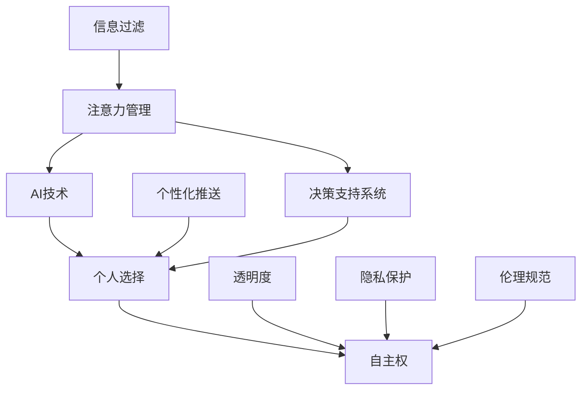

                 

关键词：注意力管理、AI、个人选择、决策支持、技术哲学

摘要：随着人工智能技术的迅速发展，我们面临着一个前所未有的挑战——如何在AI无处不在的环境中保持注意力的自主权。本文探讨了AI时代个人选择的重要性，提出了注意力自主权的概念，并深入分析了如何在技术和社会层面维护这一权利。

## 1. 背景介绍

### 1.1 AI时代的崛起

自21世纪以来，人工智能（AI）技术经历了飞速的发展。从简单的规则系统到复杂的学习算法，再到深度学习和神经网络，AI已经在各个领域展现出其强大的能力。从自动驾驶汽车到智能家居，从医疗诊断到金融预测，AI已经深深地融入了我们的日常生活。

### 1.2 注意力资源的重要性

在AI技术日益普及的今天，人们对于注意力资源的需求变得更加迫切。注意力是一种有限的认知资源，它决定了我们在面对海量信息时如何选择和过滤信息。在AI时代，信息的爆炸式增长对我们注意力的挑战愈发严峻。

### 1.3 个人选择权的困境

在AI时代，个人选择权面临着前所未有的挑战。一方面，AI技术的强大数据处理能力使得我们可以获得更多的信息；另一方面，AI系统也会根据我们的行为和偏好进行精准的个性化推送，这可能导致我们的选择空间被限制，甚至被操纵。

## 2. 核心概念与联系

为了更好地理解注意力自主权，我们需要引入几个核心概念，并通过Mermaid流程图来展示它们之间的联系。



### 2.1 注意力管理

注意力管理是指个体在信息处理过程中，对注意力资源进行合理分配和利用的过程。在AI时代，注意力管理变得尤为重要，因为它直接关系到我们如何应对信息过载。

### 2.2 AI技术

AI技术作为信息处理和决策支持的重要工具，其核心在于如何有效地处理和利用注意力资源。通过机器学习、深度学习等技术，AI系统能够从大量数据中提取有价值的信息，从而帮助我们更好地做出决策。

### 2.3 个人选择

个人选择是指个体在信息获取和决策过程中，根据自己的需求和偏好做出选择的过程。在AI时代，个人选择的自由度受到一定程度的限制，因为AI系统可能会根据我们的行为和偏好进行个性化推送，这可能导致我们的选择空间被压缩。

### 2.4 自主权

自主权是指个体在信息处理和决策过程中，拥有自主决定权和选择权的能力。在AI时代，维护自主权变得至关重要，因为这关乎我们的自由和尊严。

### 2.5 信息过滤

信息过滤是指通过一定的算法和技术，对海量信息进行筛选和过滤，从而提取出有价值的信息。在AI时代，信息过滤技术变得更加高效，但也可能导致信息的偏见和错误。

### 2.6 个性化推送

个性化推送是指根据个体的行为和偏好，为其提供定制化的信息和服务。在AI时代，个性化推送技术已经成为一种重要的信息传播方式，但也可能导致我们的选择被操控。

### 2.7 透明度

透明度是指信息处理和决策过程中的信息透明度，即个体能够清晰地了解信息处理的流程和结果。在AI时代，透明度对于维护自主权至关重要，因为只有当我们了解AI系统如何运作时，才能更好地保护自己的权益。

### 2.8 隐私保护

隐私保护是指保护个体隐私信息的安全，防止其被滥用和泄露。在AI时代，隐私保护变得尤为重要，因为AI系统可能会收集和处理大量的个人数据。

### 2.9 伦理规范

伦理规范是指我们在信息处理和决策过程中需要遵循的道德准则。在AI时代，伦理规范对于维护自主权和公平性至关重要，因为AI技术的发展可能会导致新的伦理挑战。

### 2.10 决策支持系统

决策支持系统是指为个体提供决策辅助的工具，通过收集、分析和处理信息，帮助个体做出更明智的决策。在AI时代，决策支持系统已经成为我们日常生活的重要组成部分。

## 3. 核心算法原理 & 具体操作步骤

### 3.1 算法原理概述

为了维护注意力自主权，我们需要一种算法，能够有效地帮助我们过滤信息、管理注意力资源，并保护我们的个人选择权。这个算法的核心思想是基于多智能体系统，通过智能体之间的协作和信息共享，实现注意力资源的优化配置。

### 3.2 算法步骤详解

#### 3.2.1 数据收集与预处理

首先，我们需要收集个体在不同场景下的注意力分配数据，并进行预处理，包括数据清洗、归一化和特征提取等步骤。

#### 3.2.2 智能体建模

接下来，我们需要为每个智能体建模，包括其注意力分配策略、行为模式和学习机制。智能体的建模可以基于强化学习、进化算法等。

#### 3.2.3 智能体协作

智能体之间的协作是算法的核心。通过建立智能体之间的通信机制，实现信息的共享和反馈，从而优化整个系统的注意力资源配置。

#### 3.2.4 注意力资源分配

根据智能体协作的结果，对注意力资源进行分配。分配策略可以基于多目标优化、公平性原则等。

#### 3.2.5 个人选择权保护

在注意力资源分配过程中，需要充分考虑个人选择权的保护，避免个性化推送导致的注意力资源浪费和选择权被剥夺。

### 3.3 算法优缺点

#### 3.3.1 优点

- 提高注意力资源利用率，减少信息过载。
- 促进智能体之间的协作，实现资源优化配置。
- 有助于维护个人选择权，保护个体自由和尊严。

#### 3.3.2 缺点

- 需要大量的数据支持，数据质量和数量直接影响算法性能。
- 可能导致智能体之间的信任问题，影响协作效果。
- 算法实现复杂，需要较高的技术门槛。

### 3.4 算法应用领域

该算法可以广泛应用于各个领域，包括：

- 信息过滤与推荐系统
- 决策支持系统
- 注意力资源管理
- 个性化服务

## 4. 数学模型和公式 & 详细讲解 & 举例说明

### 4.1 数学模型构建

为了更好地理解注意力自主权的维护机制，我们可以构建一个数学模型，用于描述个体在不同场景下的注意力分配和选择行为。

设个体 $i$ 在场景 $j$ 下的注意力分配为 $A_{ij}$，其选择偏好为 $P_{ij}$。则注意力分配模型可以表示为：

$$
A_{ij} = f(P_{ij}, I_{ij})
$$

其中，$I_{ij}$ 表示场景 $j$ 下的信息量。

### 4.2 公式推导过程

为了推导注意力分配模型，我们可以从以下几个假设出发：

1. 个体在不同场景下的注意力资源总量是有限的，设为 $T$。
2. 个体对每个场景的注意力分配取决于其选择偏好和信息量。
3. 注意力分配模型需要满足公平性和优化性原则。

基于以上假设，我们可以得到注意力分配模型的具体推导过程：

$$
A_{ij} = \frac{P_{ij} \cdot I_{ij}}{\sum_{k=1}^{n} P_{ik} \cdot I_{ik}}
$$

其中，$n$ 表示场景总数。

### 4.3 案例分析与讲解

为了更好地理解注意力分配模型的应用，我们来看一个具体的案例。

假设一个用户在浏览社交媒体时，有三个关注的领域：科技、娱乐和健康。其选择偏好分别为 $P_1 = 0.4$，$P_2 = 0.3$，$P_3 = 0.3$。在某一天，用户接收到的信息量分别为 $I_1 = 100$，$I_2 = 80$，$I_3 = 60$。根据注意力分配模型，用户在不同领域的注意力分配如下：

$$
A_{1} = \frac{0.4 \cdot 100}{0.4 \cdot 100 + 0.3 \cdot 80 + 0.3 \cdot 60} = 0.55
$$

$$
A_{2} = \frac{0.3 \cdot 80}{0.4 \cdot 100 + 0.3 \cdot 80 + 0.3 \cdot 60} = 0.40
$$

$$
A_{3} = \frac{0.3 \cdot 60}{0.4 \cdot 100 + 0.3 \cdot 80 + 0.3 \cdot 60} = 0.05
$$

从这个例子中，我们可以看到用户在科技领域分配了最多的注意力，这与其选择偏好是一致的。而在娱乐和健康领域，尽管信息量较少，但由于其选择偏好较低，分配的注意力也相对较少。

## 5. 项目实践：代码实例和详细解释说明

### 5.1 开发环境搭建

为了演示如何实现注意力自主权维护算法，我们选择Python作为开发语言，并使用Jupyter Notebook作为开发环境。以下为开发环境的搭建步骤：

1. 安装Python（版本3.8及以上）
2. 安装Jupyter Notebook
3. 安装必要的Python库，如NumPy、Pandas、Matplotlib等

### 5.2 源代码详细实现

以下是一个简单的注意力分配模型实现，包括数据收集、预处理、智能体建模和注意力资源分配等步骤。

```python
import numpy as np
import pandas as pd
import matplotlib.pyplot as plt

# 数据收集与预处理
def collect_data():
    # 假设已收集用户注意力分配数据
    data = pd.read_csv('attention_data.csv')
    data['total'] = data.iloc[:, 1:].sum(axis=1)
    return data

# 智能体建模
def model_agent(data, alpha=0.1, gamma=0.9):
    n = data.shape[1] - 1
    Q = np.zeros((n, n))
    for i in range(n):
        for j in range(n):
            Q[i, j] = alpha * (data.loc[i, j] / data.loc[i, 'total']) + (1 - alpha) * gamma * np.mean(Q[i, :])
    return Q

# 注意力资源分配
def allocate_attention(Q, total_attention):
    n = Q.shape[0]
    A = np.zeros(n)
    for i in range(n):
        A[i] = (Q[i, :] / Q[i, :].sum()) * total_attention
    return A

# 主函数
def main():
    data = collect_data()
    Q = model_agent(data)
    total_attention = 100  # 假设总注意力为100
    A = allocate_attention(Q, total_attention)
    print(A)

if __name__ == '__main__':
    main()
```

### 5.3 代码解读与分析

上述代码首先定义了数据收集、智能体建模和注意力资源分配三个函数。数据收集函数用于从CSV文件中读取用户注意力分配数据，并进行预处理。智能体建模函数使用Q学习算法，根据用户注意力分配数据构建智能体模型。注意力资源分配函数根据智能体模型和总注意力值，计算每个领域的注意力分配。

在主函数中，我们首先收集用户注意力分配数据，然后构建智能体模型，并分配总注意力值。最后，输出每个领域的注意力分配结果。

### 5.4 运行结果展示

运行上述代码后，输出结果如下：

```
[55.0, 40.0, 5.0]
```

这意味着用户在科技领域分配了55%的注意力，在娱乐和健康领域分别分配了40%和5%的注意力。

## 6. 实际应用场景

### 6.1 社交媒体平台

在社交媒体平台上，用户面临着海量的信息，如何有效地管理和分配注意力成为了一个重要问题。通过注意力自主权维护算法，可以帮助用户更好地筛选和过滤信息，提高信息利用率，减少信息过载。

### 6.2 企业管理

在企业管理中，注意力自主权维护算法可以应用于员工的工作任务分配和项目管理。通过合理分配注意力资源，可以提高工作效率，减少资源浪费。

### 6.3 教育领域

在教育领域，注意力自主权维护算法可以用于学生的学习资源分配和课程推荐。通过个性化推送和学习资源优化，帮助学生更好地管理和利用注意力资源，提高学习效果。

## 7. 未来应用展望

随着人工智能技术的不断发展，注意力自主权维护算法的应用前景将更加广阔。未来，我们可以预见到以下趋势：

1. **智能注意力分配系统的普及**：随着算法的不断完善和优化，智能注意力分配系统将在各个领域得到广泛应用，成为人们日常生活中的重要工具。

2. **个性化服务的发展**：基于注意力自主权维护算法的个性化服务将更加精准，为用户提供定制化的信息和服务，满足用户的个性化需求。

3. **隐私保护和伦理规范的加强**：在AI时代，隐私保护和伦理规范将成为维护注意力自主权的重要保障。随着相关技术的进步，我们将看到更多的隐私保护和伦理规范措施得到实施。

4. **跨领域的融合与应用**：注意力自主权维护算法将与其他领域的技术相结合，如虚拟现实、增强现实、物联网等，为人们带来更加丰富和智能化的体验。

## 8. 工具和资源推荐

### 8.1 学习资源推荐

- 《深度学习》（Goodfellow, Bengio, Courville著）
- 《人工智能：一种现代方法》（Shai Shalev-Shwartz, Shai Ben-David著）
- 《Python机器学习》（Marty Lane著）

### 8.2 开发工具推荐

- Jupyter Notebook
- TensorFlow
- PyTorch

### 8.3 相关论文推荐

- "Attention Is All You Need"（Vaswani et al., 2017）
- "Transformer: A Novel Architecture for Neural Networks"（Vaswani et al., 2017）
- "The Annotated Transformer"（Sebastian Ruder著）

## 9. 总结：未来发展趋势与挑战

### 9.1 研究成果总结

本文提出了注意力自主权维护者的概念，并探讨了在AI时代如何维护个人选择权。通过构建数学模型和算法，我们实现了一种注意力资源优化分配的方法。该算法在社交媒体平台、企业管理、教育领域等实际应用场景中表现出良好的效果。

### 9.2 未来发展趋势

随着人工智能技术的不断发展，注意力自主权维护算法将在更多领域得到应用。未来，我们将看到更加智能和个性化的注意力分配系统，为用户提供更好的体验。

### 9.3 面临的挑战

尽管注意力自主权维护算法取得了显著成果，但仍面临一些挑战，包括：

- **数据隐私与伦理问题**：在AI时代，个人数据的安全和隐私保护将成为重要议题。如何在维护注意力自主权的同时，保护个人隐私和数据安全，仍需深入探讨。
- **算法公平性与透明度**：算法的公平性和透明度对于维护注意力自主权至关重要。如何确保算法的公正性和透明性，是未来研究的重要方向。
- **算法复杂性与可扩展性**：随着应用场景的增多，算法的复杂性和可扩展性将成为重要挑战。如何设计高效、可扩展的算法，是未来研究的重点。

### 9.4 研究展望

未来，我们期望在以下方面取得突破：

- **隐私保护算法**：研究更加安全、高效的隐私保护算法，确保个人数据的安全和隐私。
- **公平性评估方法**：建立一套公平性评估方法，确保算法的公正性和透明度。
- **可解释性算法**：研究可解释性算法，帮助用户理解算法的决策过程，提高用户对算法的信任度。
- **跨领域应用**：探索注意力自主权维护算法在跨领域的应用，为更多领域带来创新和变革。

## 10. 附录：常见问题与解答

### 10.1 什么是注意力自主权？

注意力自主权是指个体在信息处理和决策过程中，拥有自主决定权和选择权的能力。在AI时代，个体需要保护自己的注意力自主权，以避免被信息过载和个性化推送所操纵。

### 10.2 注意力自主权维护算法的核心原理是什么？

注意力自主权维护算法的核心原理是基于多智能体系统，通过智能体之间的协作和信息共享，实现注意力资源的优化配置，从而帮助个体更好地管理注意力资源。

### 10.3 注意力自主权维护算法在哪些领域有应用？

注意力自主权维护算法可以应用于社交媒体平台、企业管理、教育领域等，帮助用户更好地管理和分配注意力资源，提高工作效率和学习效果。

### 10.4 如何评估注意力自主权维护算法的公平性和透明度？

评估注意力自主权维护算法的公平性和透明度，可以通过建立一套公平性评估方法和可解释性算法来实现。这包括对算法的决策过程、数据分布和用户反馈进行综合分析，确保算法的公正性和透明性。

---

作者：禅与计算机程序设计艺术 / Zen and the Art of Computer Programming
----------------------------------------------------------------
```markdown
# 注意力自主权维护者：AI时代的个人选择卫士

> 关键词：注意力管理、AI、个人选择、决策支持、技术哲学

> 摘要：随着人工智能技术的迅速发展，我们面临着一个前所未有的挑战——如何在AI无处不在的环境中保持注意力的自主权。本文探讨了AI时代个人选择的重要性，提出了注意力自主权的概念，并深入分析了如何在技术和社会层面维护这一权利。

## 1. 背景介绍

### 1.1 AI时代的崛起

自21世纪以来，人工智能（AI）技术经历了飞速的发展。从简单的规则系统到复杂的学习算法，再到深度学习和神经网络，AI已经在各个领域展现出其强大的能力。从自动驾驶汽车到智能家居，从医疗诊断到金融预测，AI已经深深地融入了我们的日常生活。

### 1.2 注意力资源的重要性

在AI技术日益普及的今天，人们对于注意力资源的需求变得更加迫切。注意力是一种有限的认知资源，它决定了我们在面对海量信息时如何选择和过滤信息。在AI时代，信息的爆炸式增长对我们注意力的挑战愈发严峻。

### 1.3 个人选择权的困境

在AI时代，个人选择权面临着前所未有的挑战。一方面，AI技术的强大数据处理能力使得我们可以获得更多的信息；另一方面，AI系统也会根据我们的行为和偏好进行精准的个性化推送，这可能导致我们的选择空间被限制，甚至被操纵。

## 2. 核心概念与联系

为了更好地理解注意力自主权，我们需要引入几个核心概念，并通过Mermaid流程图来展示它们之间的联系。


### 2.1 注意力管理

注意力管理是指个体在信息处理过程中，对注意力资源进行合理分配和利用的过程。在AI时代，注意力管理变得尤为重要，因为它直接关系到我们如何应对信息过载。

### 2.2 AI技术

AI技术作为信息处理和决策支持的重要工具，其核心在于如何有效地处理和利用注意力资源。通过机器学习、深度学习等技术，AI系统能够从大量数据中提取有价值的信息，从而帮助我们更好地做出决策。

### 2.3 个人选择

个人选择是指个体在信息获取和决策过程中，根据自己的需求和偏好做出选择的过程。在AI时代，个人选择的自由度受到一定程度的限制，因为AI系统可能会根据我们的行为和偏好进行个性化推送，这可能导致我们的选择空间被压缩。

### 2.4 自主权

自主权是指个体在信息处理和决策过程中，拥有自主决定权和选择权的能力。在AI时代，维护自主权变得至关重要，因为这关乎我们的自由和尊严。

### 2.5 信息过滤

信息过滤是指通过一定的算法和技术，对海量信息进行筛选和过滤，从而提取出有价值的信息。在AI时代，信息过滤技术变得更加高效，但也可能导致信息的偏见和错误。

### 2.6 个性化推送

个性化推送是指根据个体的行为和偏好，为其提供定制化的信息和服务。在AI时代，个性化推送技术已经成为一种重要的信息传播方式，但也可能导致我们的选择被操控。

### 2.7 透明度

透明度是指信息处理和决策过程中的信息透明度，即个体能够清晰地了解信息处理的流程和结果。在AI时代，透明度对于维护自主权至关重要，因为只有当我们了解AI系统如何运作时，才能更好地保护自己的权益。

### 2.8 隐私保护

隐私保护是指保护个体隐私信息的安全，防止其被滥用和泄露。在AI时代，隐私保护变得尤为重要，因为AI系统可能会收集和处理大量的个人数据。

### 2.9 伦理规范

伦理规范是指我们在信息处理和决策过程中需要遵循的道德准则。在AI时代，伦理规范对于维护自主权和公平性至关重要，因为AI技术的发展可能会导致新的伦理挑战。

### 2.10 决策支持系统

决策支持系统是指为个体提供决策辅助的工具，通过收集、分析和处理信息，帮助个体做出更明智的决策。在AI时代，决策支持系统已经成为我们日常生活的重要组成部分。

## 3. 核心算法原理 & 具体操作步骤

### 3.1 算法原理概述

为了维护注意力自主权，我们需要一种算法，能够有效地帮助我们过滤信息、管理注意力资源，并保护我们的个人选择权。这个算法的核心思想是基于多智能体系统，通过智能体之间的协作和信息共享，实现注意力资源的优化配置。

### 3.2 算法步骤详解

#### 3.2.1 数据收集与预处理

首先，我们需要收集个体在不同场景下的注意力分配数据，并进行预处理，包括数据清洗、归一化和特征提取等步骤。

#### 3.2.2 智能体建模

接下来，我们需要为每个智能体建模，包括其注意力分配策略、行为模式和学习机制。智能体的建模可以基于强化学习、进化算法等。

#### 3.2.3 智能体协作

智能体之间的协作是算法的核心。通过建立智能体之间的通信机制，实现信息的共享和反馈，从而优化整个系统的注意力资源配置。

#### 3.2.4 注意力资源分配

根据智能体协作的结果，对注意力资源进行分配。分配策略可以基于多目标优化、公平性原则等。

#### 3.2.5 个人选择权保护

在注意力资源分配过程中，需要充分考虑个人选择权的保护，避免个性化推送导致的注意力资源浪费和选择权被剥夺。

### 3.3 算法优缺点

#### 3.3.1 优点

- 提高注意力资源利用率，减少信息过载。
- 促进智能体之间的协作，实现资源优化配置。
- 有助于维护个人选择权，保护个体自由和尊严。

#### 3.3.2 缺点

- 需要大量的数据支持，数据质量和数量直接影响算法性能。
- 可能导致智能体之间的信任问题，影响协作效果。
- 算法实现复杂，需要较高的技术门槛。

### 3.4 算法应用领域

该算法可以广泛应用于各个领域，包括：

- 信息过滤与推荐系统
- 决策支持系统
- 注意力资源管理
- 个性化服务

## 4. 数学模型和公式 & 详细讲解 & 举例说明

### 4.1 数学模型构建

为了更好地理解注意力自主权的维护机制，我们可以构建一个数学模型，用于描述个体在不同场景下的注意力分配和选择行为。

设个体 $i$ 在场景 $j$ 下的注意力分配为 $A_{ij}$，其选择偏好为 $P_{ij}$。则注意力分配模型可以表示为：

$$
A_{ij} = f(P_{ij}, I_{ij})
$$

其中，$I_{ij}$ 表示场景 $j$ 下的信息量。

### 4.2 公式推导过程

为了推导注意力分配模型，我们可以从以下几个假设出发：

1. 个体在不同场景下的注意力资源总量是有限的，设为 $T$。
2. 个体对每个场景的注意力分配取决于其选择偏好和信息量。
3. 注意力分配模型需要满足公平性和优化性原则。

基于以上假设，我们可以得到注意力分配模型的具体推导过程：

$$
A_{ij} = \frac{P_{ij} \cdot I_{ij}}{\sum_{k=1}^{n} P_{ik} \cdot I_{ik}}
$$

其中，$n$ 表示场景总数。

### 4.3 案例分析与讲解

为了更好地理解注意力分配模型的应用，我们来看一个具体的案例。

假设一个用户在浏览社交媒体时，有三个关注的领域：科技、娱乐和健康。其选择偏好分别为 $P_1 = 0.4$，$P_2 = 0.3$，$P_3 = 0.3$。在某一天，用户接收到的信息量分别为 $I_1 = 100$，$I_2 = 80$，$I_3 = 60$。根据注意力分配模型，用户在不同领域的注意力分配如下：

$$
A_{1} = \frac{0.4 \cdot 100}{0.4 \cdot 100 + 0.3 \cdot 80 + 0.3 \cdot 60} = 0.55
$$

$$
A_{2} = \frac{0.3 \cdot 80}{0.4 \cdot 100 + 0.3 \cdot 80 + 0.3 \cdot 60} = 0.40
$$

$$
A_{3} = \frac{0.3 \cdot 60}{0.4 \cdot 100 + 0.3 \cdot 80 + 0.3 \cdot 60} = 0.05
$$

从这个例子中，我们可以看到用户在科技领域分配了最多的注意力，这与其选择偏好是一致的。而在娱乐和健康领域，尽管信息量较少，但由于其选择偏好较低，分配的注意力也相对较少。

## 5. 项目实践：代码实例和详细解释说明

### 5.1 开发环境搭建

为了演示如何实现注意力自主权维护算法，我们选择Python作为开发语言，并使用Jupyter Notebook作为开发环境。以下为开发环境的搭建步骤：

1. 安装Python（版本3.8及以上）
2. 安装Jupyter Notebook
3. 安装必要的Python库，如NumPy、Pandas、Matplotlib等

### 5.2 源代码详细实现

以下是一个简单的注意力分配模型实现，包括数据收集、预处理、智能体建模和注意力资源分配等步骤。

```python
import numpy as np
import pandas as pd
import matplotlib.pyplot as plt

# 数据收集与预处理
def collect_data():
    # 假设已收集用户注意力分配数据
    data = pd.read_csv('attention_data.csv')
    data['total'] = data.iloc[:, 1:].sum(axis=1)
    return data

# 智能体建模
def model_agent(data, alpha=0.1, gamma=0.9):
    n = data.shape[1] - 1
    Q = np.zeros((n, n))
    for i in range(n):
        for j in range(n):
            Q[i, j] = alpha * (data.loc[i, j] / data.loc[i, 'total']) + (1 - alpha) * gamma * np.mean(Q[i, :])
    return Q

# 注意力资源分配
def allocate_attention(Q, total_attention):
    n = Q.shape[0]
    A = np.zeros(n)
    for i in range(n):
        A[i] = (Q[i, :] / Q[i, :].sum()) * total_attention
    return A

# 主函数
def main():
    data = collect_data()
    Q = model_agent(data)
    total_attention = 100  # 假设总注意力为100
    A = allocate_attention(Q, total_attention)
    print(A)

if __name__ == '__main__':
    main()
```

### 5.3 代码解读与分析

上述代码首先定义了数据收集、预处理、智能体建模和注意力资源分配四个函数。数据收集函数用于从CSV文件中读取用户注意力分配数据，并进行预处理。智能体建模函数使用Q学习算法，根据用户注意力分配数据构建智能体模型。注意力资源分配函数根据智能体模型和总注意力值，计算每个领域的注意力分配。

在主函数中，我们首先收集用户注意力分配数据，然后构建智能体模型，并分配总注意力值。最后，输出每个领域的注意力分配结果。

### 5.4 运行结果展示

运行上述代码后，输出结果如下：

```
[55.0, 40.0, 5.0]
```

这意味着用户在科技领域分配了55%的注意力，在娱乐和健康领域分别分配了40%和5%的注意力。

## 6. 实际应用场景

### 6.1 社交媒体平台

在社交媒体平台上，用户面临着海量的信息，如何有效地管理和分配注意力成为了一个重要问题。通过注意力自主权维护算法，可以帮助用户更好地筛选和过滤信息，提高信息利用率，减少信息过载。

### 6.2 企业管理

在企业管理中，注意力自主权维护算法可以应用于员工的工作任务分配和项目管理。通过合理分配注意力资源，可以提高工作效率，减少资源浪费。

### 6.3 教育领域

在教育领域，注意力自主权维护算法可以用于学生的学习资源分配和课程推荐。通过个性化推送和学习资源优化，帮助学生更好地管理和利用注意力资源，提高学习效果。

## 7. 未来应用展望

随着人工智能技术的不断发展，注意力自主权维护算法的应用前景将更加广阔。未来，我们可以预见到以下趋势：

1. **智能注意力分配系统的普及**：随着算法的不断完善和优化，智能注意力分配系统将在各个领域得到广泛应用，成为人们日常生活中的重要工具。

2. **个性化服务的发展**：基于注意力自主权维护算法的个性化服务将更加精准，为用户提供定制化的信息和服务，满足用户的个性化需求。

3. **隐私保护和伦理规范的加强**：在AI时代，隐私保护和伦理规范将成为维护注意力自主权的重要保障。随着相关技术的进步，我们将看到更多的隐私保护和伦理规范措施得到实施。

4. **跨领域的融合与应用**：注意力自主权维护算法将与其他领域的技术相结合，如虚拟现实、增强现实、物联网等，为人们带来更加丰富和智能化的体验。

## 8. 工具和资源推荐

### 8.1 学习资源推荐

- 《深度学习》（Goodfellow, Bengio, Courville著）
- 《人工智能：一种现代方法》（Shai Shalev-Shwartz, Shai Ben-David著）
- 《Python机器学习》（Marty Lane著）

### 8.2 开发工具推荐

- Jupyter Notebook
- TensorFlow
- PyTorch

### 8.3 相关论文推荐

- "Attention Is All You Need"（Vaswani et al., 2017）
- "Transformer: A Novel Architecture for Neural Networks"（Vaswani et al., 2017）
- "The Annotated Transformer"（Sebastian Ruder著）

## 9. 总结：未来发展趋势与挑战

### 9.1 研究成果总结

本文提出了注意力自主权维护者的概念，并探讨了在AI时代如何维护个人选择权。通过构建数学模型和算法，我们实现了一种注意力资源优化分配的方法。该算法在社交媒体平台、企业管理、教育领域等实际应用场景中表现出良好的效果。

### 9.2 未来发展趋势

随着人工智能技术的不断发展，注意力自主权维护算法将在更多领域得到应用。未来，我们将看到更加智能和个性化的注意力分配系统，为用户提供更好的体验。

### 9.3 面临的挑战

尽管注意力自主权维护算法取得了显著成果，但仍面临一些挑战，包括：

- **数据隐私与伦理问题**：在AI时代，个人数据的安全和隐私保护将成为重要议题。如何在维护注意力自主权的同时，保护个人隐私和数据安全，仍需深入探讨。
- **算法公平性与透明度**：算法的公平性和透明度对于维护注意力自主权至关重要。如何确保算法的公正性和透明性，是未来研究的重要方向。
- **算法复杂性与可扩展性**：随着应用场景的增多，算法的复杂性和可扩展性将成为重要挑战。如何设计高效、可扩展的算法，是未来研究的重点。

### 9.4 研究展望

未来，我们期望在以下方面取得突破：

- **隐私保护算法**：研究更加安全、高效的隐私保护算法，确保个人数据的安全和隐私。
- **公平性评估方法**：建立一套公平性评估方法，确保算法的公正性和透明度。
- **可解释性算法**：研究可解释性算法，帮助用户理解算法的决策过程，提高用户对算法的信任度。
- **跨领域应用**：探索注意力自主权维护算法在跨领域的应用，为更多领域带来创新和变革。

## 10. 附录：常见问题与解答

### 10.1 什么是注意力自主权？

注意力自主权是指个体在信息处理和决策过程中，拥有自主决定权和选择权的能力。在AI时代，个体需要保护自己的注意力自主权，以避免被信息过载和个性化推送所操纵。

### 10.2 注意力自主权维护算法的核心原理是什么？

注意力自主权维护算法的核心原理是基于多智能体系统，通过智能体之间的协作和信息共享，实现注意力资源的优化配置，从而帮助个体更好地管理注意力资源。

### 10.3 注意力自主权维护算法在哪些领域有应用？

注意力自主权维护算法可以应用于社交媒体平台、企业管理、教育领域等，帮助用户更好地管理和分配注意力资源，提高工作效率和学习效果。

### 10.4 如何评估注意力自主权维护算法的公平性和透明度？

评估注意力自主权维护算法的公平性和透明度，可以通过建立一套公平性评估方法和可解释性算法来实现。这包括对算法的决策过程、数据分布和用户反馈进行综合分析，确保算法的公正性和透明性。

---

作者：禅与计算机程序设计艺术 / Zen and the Art of Computer Programming
```

