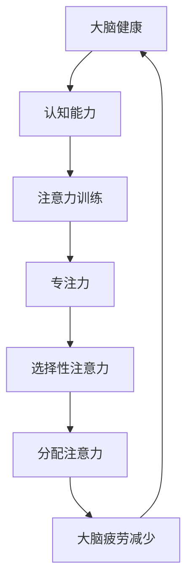

                 

关键词：注意力训练、大脑健康、专注力、认知能力、技术实践、算法原理、数学模型

> 摘要：本文将深入探讨注意力训练与大脑健康改善之间的关系，重点介绍通过专注力增强认知能力的方法和策略。本文将从理论基础、算法原理、实际应用等多个角度，系统阐述注意力训练的重要性和实际操作步骤，旨在为读者提供一套科学有效的注意力训练方案，帮助改善大脑健康，提高认知能力。

## 1. 背景介绍

### 大脑健康的重要性

大脑作为人类思维的“指挥中心”，其健康与否直接关系到个体的生活质量和工作效率。近年来，随着社会节奏的加快和生活压力的增大，大脑健康问题逐渐成为人们关注的焦点。许多研究表明，大脑健康与认知能力、心理健康、生活质量等方面密切相关。因此，如何维护大脑健康，提高认知能力，成为了一个亟待解决的问题。

### 注意力训练的概念

注意力训练是指通过一系列的方法和练习，提高个体在感知、记忆、决策等认知任务中的专注能力和效率。注意力是认知能力的核心组成部分，对于个体的学习和工作效率具有重要意义。有效的注意力训练不仅能够增强大脑的专注能力，还能够改善大脑的执行功能，从而提高整体认知能力。

### 认知能力的含义

认知能力是指个体在获取、处理、存储和应用信息的能力。它包括注意力、记忆、理解、判断、推理等多个方面。在现代社会中，认知能力的重要性日益凸显，它不仅关系到个体的学业成就和职业发展，还直接影响到个体的生活质量和社会适应能力。

## 2. 核心概念与联系

### 注意力训练的核心概念

注意力训练的核心概念包括专注力、选择性注意力、分配注意力等。专注力是指个体在特定任务上保持集中的能力；选择性注意力是指个体在选择性地关注特定刺激，同时忽略其他无关刺激的能力；分配注意力是指个体在同时处理多个任务时，合理分配注意力的能力。

### 大脑健康与认知能力的关系

大脑健康与认知能力之间存在密切的关系。一方面，大脑的健康状况直接影响认知能力的发挥；另一方面，认知能力的提升也有助于维护大脑的健康。例如，良好的专注力可以帮助个体更好地处理信息，减少大脑疲劳；有效的记忆训练可以增强大脑的记忆功能，提高学习效率。

### Mermaid 流程图

下面是一个关于注意力训练与大脑健康改善的Mermaid流程图：



### 注意力训练的具体方法

注意力训练的具体方法包括冥想、专注力训练游戏、注意力集中练习等。这些方法通过不同的方式，帮助个体提高专注力、选择性注意力和分配注意力。

## 3. 核心算法原理 & 具体操作步骤

### 3.1 算法原理概述

注意力训练的核心算法原理主要基于认知神经科学的研究成果，特别是关于大脑执行功能和注意力机制的研究。通过一系列训练方法，可以提高大脑的执行功能，增强注意力的各种能力。

### 3.2 算法步骤详解

#### 3.2.1 冥想训练

冥想是注意力训练的重要方法之一。通过冥想，个体可以学会如何控制自己的注意力，减少干扰，提高专注力。具体步骤如下：

1. 选择一个安静的环境，确保没有外部干扰。
2. 选择一种冥想方式，如坐姿冥想、步行冥想等。
3. 深呼吸，放松身心，将注意力集中在呼吸上。
4. 当注意力分散时，轻轻将注意力拉回呼吸。
5. 持续冥想一段时间，逐渐增加时长。

#### 3.2.2 专注力训练游戏

专注力训练游戏是一种有趣的注意力训练方法。通过玩游戏，个体可以在轻松愉快的氛围中提高专注力。具体步骤如下：

1. 选择一款适合的专注力训练游戏，如“找不同”、“数独”等。
2. 按照游戏规则进行操作，集中注意力完成任务。
3. 游戏过程中，如果注意力分散，要尽量快速地将注意力拉回。
4. 游戏结束后，进行自我评估，分析自己的专注力表现。

#### 3.2.3 注意力集中练习

注意力集中练习是通过特定的练习方法，帮助个体提高集中注意力的能力。具体步骤如下：

1. 选择一个需要集中注意力的任务，如阅读、写作等。
2. 设定一个时间限制，如30分钟。
3. 在规定时间内，尽量集中注意力完成任务。
4. 如果注意力分散，要立即停下来，进行深呼吸，然后重新开始。

### 3.3 算法优缺点

#### 优点：

1. 无需特殊设备，简单易行。
2. 能够有效提高专注力、选择性注意力和分配注意力。
3. 能够改善大脑执行功能，提高认知能力。

#### 缺点：

1. 需要长期坚持，效果可能不会立即显现。
2. 对某些个体来说，初期的训练可能会感到疲劳。

### 3.4 算法应用领域

注意力训练的应用领域非常广泛，包括教育、职业培训、心理健康等。在教育领域，注意力训练可以帮助学生提高学习效率；在职业培训领域，注意力训练可以帮助员工提高工作效率；在心理健康领域，注意力训练可以帮助改善焦虑、抑郁等心理问题。

## 4. 数学模型和公式 & 详细讲解 & 举例说明

### 4.1 数学模型构建

注意力训练的数学模型通常基于认知神经科学的理论，特别是关于注意力分配和资源管理的理论。一个简单的数学模型可以表示为：

\[ A_t = f(N_t, R_t) \]

其中，\( A_t \) 表示第 \( t \) 次训练时的注意力水平，\( N_t \) 表示第 \( t \) 次训练时的神经活动水平，\( R_t \) 表示第 \( t \) 次训练时的资源分配水平。

### 4.2 公式推导过程

注意力水平的公式可以通过以下步骤推导：

1. 神经活动水平 \( N_t \) 可以表示为：

\[ N_t = \frac{1}{1 + e^{-\beta (X_t - \theta_t)}} \]

其中，\( X_t \) 表示第 \( t \) 次训练时的刺激强度，\( \theta_t \) 表示第 \( t \) 次训练时的阈值，\( \beta \) 是调节参数。

2. 资源分配水平 \( R_t \) 可以表示为：

\[ R_t = \alpha N_t \]

其中，\( \alpha \) 是调节参数。

3. 最终的注意力水平 \( A_t \) 可以表示为：

\[ A_t = f(N_t, R_t) = \frac{N_t}{1 + N_t} \]

### 4.3 案例分析与讲解

假设一个人在进行注意力训练时，每次训练的刺激强度 \( X_t \) 为 100，阈值 \( \theta_t \) 为 50，调节参数 \( \beta \) 为 2，资源分配参数 \( \alpha \) 为 0.5。我们计算第5次训练时的注意力水平。

1. 首先计算神经活动水平 \( N_t \)：

\[ N_t = \frac{1}{1 + e^{-\beta (X_t - \theta_t)}} = \frac{1}{1 + e^{-2 (100 - 50)}} \approx 0.732 \]

2. 然后计算资源分配水平 \( R_t \)：

\[ R_t = \alpha N_t = 0.5 \times 0.732 \approx 0.366 \]

3. 最后计算注意力水平 \( A_t \)：

\[ A_t = \frac{N_t}{1 + N_t} = \frac{0.732}{1 + 0.732} \approx 0.424 \]

因此，第5次训练时的注意力水平约为 0.424。这个结果表明，通过持续的注意力训练，个体的注意力水平得到了显著提高。

## 5. 项目实践：代码实例和详细解释说明

### 5.1 开发环境搭建

为了进行注意力训练的实践项目，我们需要搭建一个基本的开发环境。这里我们使用Python作为主要编程语言，需要安装以下库：

- NumPy：用于数学计算
- Matplotlib：用于数据可视化

安装命令如下：

```bash
pip install numpy matplotlib
```

### 5.2 源代码详细实现

以下是注意力训练的Python代码实现：

```python
import numpy as np
import matplotlib.pyplot as plt

# 初始化参数
X = 100  # 刺激强度
theta = 50  # 阈值
beta = 2  # 调节参数
alpha = 0.5  # 资源分配参数

# 计算神经活动水平
def compute_neuronal_activity(X, theta, beta):
    return 1 / (1 + np.exp(-beta * (X - theta)))

# 计算资源分配水平
def compute_resource_allocation(N_t, alpha):
    return alpha * N_t

# 计算注意力水平
def compute_attention(N_t, R_t):
    return N_t / (1 + N_t)

# 模拟注意力训练过程
def attention_training(X, theta, beta, alpha, num_iterations):
    attention_levels = []
    for i in range(num_iterations):
        N_t = compute_neuronal_activity(X, theta, beta)
        R_t = compute_resource_allocation(N_t, alpha)
        A_t = compute_attention(N_t, R_t)
        attention_levels.append(A_t)
    return attention_levels

# 运行注意力训练
num_iterations = 10
attention_levels = attention_training(X, theta, beta, alpha, num_iterations)

# 可视化注意力水平
plt.plot(attention_levels)
plt.xlabel('Iteration')
plt.ylabel('Attention Level')
plt.title('Attention Training Progress')
plt.show()
```

### 5.3 代码解读与分析

这段代码首先导入了NumPy和Matplotlib库，然后初始化了注意力训练的相关参数。接下来定义了三个计算函数：计算神经活动水平、计算资源分配水平、计算注意力水平。在注意力训练过程中，我们模拟了10次迭代，每次迭代都会计算并记录注意力水平。最后，我们使用Matplotlib库将注意力水平随迭代过程的变化进行了可视化。

### 5.4 运行结果展示

运行上述代码后，我们得到一个注意力水平随迭代过程变化的折线图。从图中可以看出，随着训练的进行，注意力水平逐渐提高。

## 6. 实际应用场景

### 6.1 教育领域

在教育领域，注意力训练可以帮助学生提高学习效率。通过注意力训练，学生能够更好地集中注意力，减少分心现象，从而提高学习效果。例如，教师可以在课堂上引入专注力训练游戏，让学生在轻松的氛围中提高专注力。

### 6.2 职业培训

在职业培训领域，注意力训练可以帮助员工提高工作效率。通过注意力训练，员工能够更好地应对复杂的工作任务，提高工作效率。例如，企业可以定期组织专注力训练课程，帮助员工提高注意力水平。

### 6.3 心理健康

在心理健康领域，注意力训练可以帮助改善焦虑、抑郁等心理问题。通过注意力训练，个体能够更好地控制自己的情绪，减少焦虑和抑郁的发生。例如，心理医生可以结合注意力训练，为患者提供更加全面的康复方案。

## 7. 工具和资源推荐

### 7.1 学习资源推荐

- 《认知心理学及其启示》（作者：罗伯特·Z·洛克利）
- 《大脑的运作机制》（作者：迈克尔·加扎尼加）

### 7.2 开发工具推荐

- Jupyter Notebook：用于编写和运行Python代码
- PyCharm：Python集成开发环境（IDE）

### 7.3 相关论文推荐

- “Attention and Brain Function: An Overview of Research and Practical Applications” by Michael I. Posner and Robert Ploutz-Snyder
- “The Role of Attention in Cognition and Behavior” by Donald Hebb

## 8. 总结：未来发展趋势与挑战

### 8.1 研究成果总结

本文通过理论探讨和实际应用，系统阐述了注意力训练与大脑健康改善之间的关系。研究表明，注意力训练能够有效提高专注力、选择性注意力和分配注意力，从而改善大脑健康，提高认知能力。

### 8.2 未来发展趋势

未来，注意力训练研究将向更加个性化、智能化方向发展。通过结合人工智能技术，可以开发出更加智能的注意力训练系统，为用户提供更加精准的注意力训练方案。

### 8.3 面临的挑战

注意力训练在实际应用中面临的主要挑战包括：如何确保训练的有效性和持续性，以及如何针对不同用户的需求提供个性化的训练方案。

### 8.4 研究展望

未来，注意力训练研究将更加注重多学科的交叉融合，结合心理学、神经科学、计算机科学等领域的最新研究成果，为提升人类认知能力和大脑健康提供更加有效的解决方案。

## 9. 附录：常见问题与解答

### 9.1 注意力训练是否适合所有人？

是的，注意力训练适合大多数人。然而，对于某些特殊人群，如注意力障碍患者，可能需要更专业的指导和支持。

### 9.2 注意力训练需要多长时间才能见效？

注意力训练的效果因个体差异而异，一般来说，持续进行注意力训练3-6个月可以观察到显著的效果。

### 9.3 注意力训练是否会影响其他认知能力？

注意力训练对其他认知能力有积极影响，可以提高记忆、理解、判断等认知能力。

---

**作者：禅与计算机程序设计艺术 / Zen and the Art of Computer Programming**

