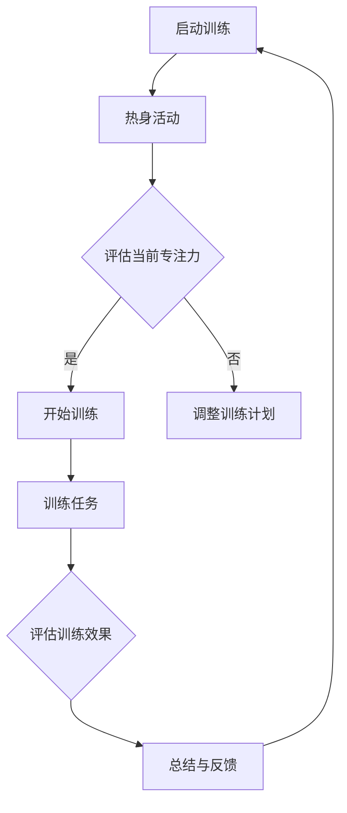
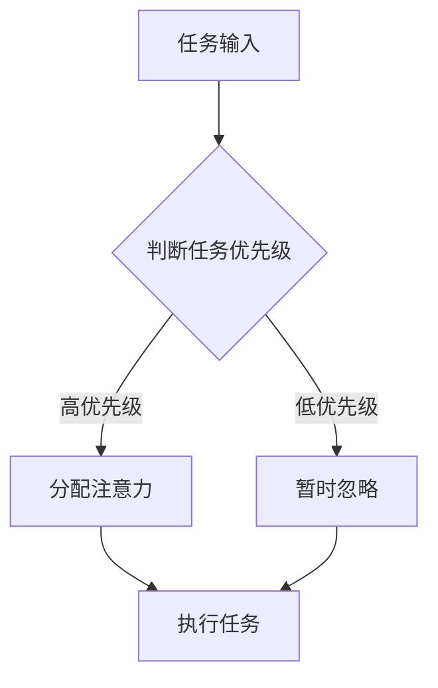
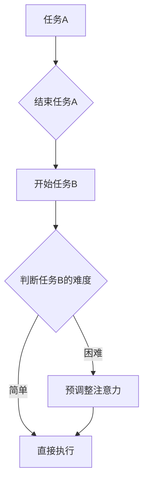
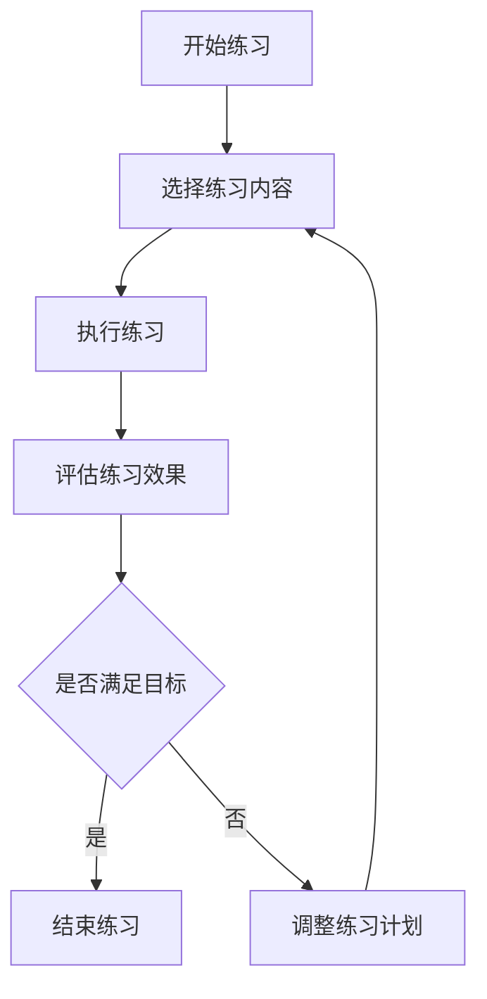

                 

 > **关键词**：注意力训练，大脑增强，认知能力，神经可塑性，专注力提升，算法原理，数学模型，项目实践，应用场景，工具推荐，未来展望。

> **摘要**：本文旨在探讨注意力训练与大脑增强的关系，分析如何通过专注力训练提升认知能力和神经可塑性。文章将介绍核心概念、算法原理、数学模型、项目实践，并讨论实际应用场景、工具推荐以及未来发展趋势和挑战。

## 1. 背景介绍

在现代社会中，随着科技的飞速发展和信息量的爆炸性增长，人们面临的信息处理任务越来越复杂，这要求个体具备更高的认知能力和专注力。然而，现代生活节奏的加快、工作压力的增加以及社交媒体的泛滥等因素，常常导致人们的注意力分散，影响了认知能力和工作、学习效率。

大脑增强作为认知神经科学的研究方向之一，旨在通过一系列训练和实践手段，提升大脑的认知能力和功能。其中，注意力训练是大脑增强的一个重要方面，通过有意识的训练和练习，可以提高个体的专注力，进而改善认知能力和神经可塑性。

本文将围绕注意力训练与大脑增强的关系，深入探讨如何通过专注力训练提升认知能力和神经可塑性，旨在为相关领域的研究和实践提供有价值的参考。

### 1.1 注意力训练的概念和作用

注意力训练是指通过一系列科学的训练方法，提高个体专注力和注意力的能力。注意力是人类认知功能的核心，它决定了个体对信息的接收、处理和记忆。注意力训练可以通过以下几种方式实现：

1. **专注力提升**：通过特定的练习，如专注力训练游戏、冥想等，提高个体对特定任务的专注能力，从而提高工作、学习效率。
2. **注意力转移**：通过练习，提高个体在不同任务之间的注意力转移能力，减少任务切换时的干扰。
3. **注意力的分配**：通过训练，提高个体在同一时间内分配注意力处理多个任务的能力。

### 1.2 大脑增强的概念和作用

大脑增强是指通过一系列科学的训练、饮食、药物等手段，提升大脑的认知功能和整体功能。大脑增强的目标是提高个体的认知能力、学习能力和工作效率。大脑增强的作用包括：

1. **提高认知能力**：通过训练，提升个体的记忆力、推理能力、判断力和创造力。
2. **改善学习效率**：通过科学的训练，提高个体学习新知识和技能的效率。
3. **延缓大脑老化**：通过训练和生活方式的改善，延缓大脑老化和认知功能下降的速度。

### 1.3 注意力训练与大脑增强的关系

注意力训练是大脑增强的重要组成部分。通过注意力训练，可以提升个体的专注力和注意力分配能力，从而改善认知能力和神经可塑性。具体来说：

1. **提升认知能力**：专注力的提升有助于个体更好地接收和处理信息，从而提高认知能力。
2. **增强神经可塑性**：注意力训练可以促进大脑神经网络的重组和优化，增强神经可塑性，从而提高大脑的认知功能。
3. **改善生活质量**：通过注意力训练，提高个体的专注力和工作效率，改善生活质量和工作表现。

### 1.4 文章结构

本文将分为以下几个部分：

1. **背景介绍**：阐述注意力训练和大脑增强的概念、作用及关系。
2. **核心概念与联系**：介绍注意力训练的核心概念，并使用 Mermaid 流程图展示相关架构。
3. **核心算法原理 & 具体操作步骤**：分析注意力训练的算法原理，并详细解释操作步骤。
4. **数学模型和公式 & 详细讲解 & 举例说明**：构建数学模型，推导公式，并通过案例进行分析。
5. **项目实践：代码实例和详细解释说明**：展示代码实例，详细解释实现过程。
6. **实际应用场景**：讨论注意力训练在各个领域的应用。
7. **工具和资源推荐**：推荐学习资源、开发工具和论文。
8. **总结：未来发展趋势与挑战**：总结研究成果，探讨未来发展趋势和挑战。

### 1.5 Mermaid 流程图

以下是一个简化的注意力训练的核心概念流程图：



这个流程图展示了注意力训练的基本步骤，包括热身活动、评估专注力、开始训练、执行训练任务、评估训练效果、总结与反馈，并形成一个循环，以便根据评估结果调整训练计划。

## 2. 核心概念与联系

在本节中，我们将深入探讨注意力训练的核心概念，并使用 Mermaid 流程图详细展示相关的原理和架构。这些核心概念包括注意力分配、注意转移、专注力提升等，它们共同构成了注意力训练的理论基础。

### 2.1 注意力分配

注意力分配是指个体在同一时间内将注意力集中在多个任务上的能力。良好的注意力分配能力有助于提高工作效率和学习效果。然而，注意力分配是一个复杂的过程，涉及认知资源的分配和任务优先级的判断。

以下是一个简化的 Mermaid 流程图，展示了注意力分配的基本原理：



在这个流程图中，任务输入首先被判断优先级。高优先级的任务会立即得到注意力的分配，而低优先级的任务则可能被暂时忽略。随后，被分配注意力的任务将被执行。

### 2.2 注意力转移

注意力转移是指个体在不同任务之间调整注意力的能力。良好的注意力转移能力可以帮助个体迅速适应新的任务环境，减少任务切换时的干扰。

以下是一个简化的 Mermaid 流程图，展示了注意力转移的基本原理：



在这个流程图中，任务A结束后，个体会开始任务B。根据任务B的难度，个体可能会直接执行，或者先进行注意力预调整，以便更好地处理困难任务。

### 2.3 专注力提升

专注力提升是指通过特定的训练方法，提高个体的专注能力。专注力提升的方法包括冥想、专注力训练游戏、有意识的专注练习等。

以下是一个简化的 Mermaid 流程图，展示了专注力提升的基本原理：



在这个流程图中，个体开始选择特定的练习内容，并执行练习。随后，评估练习效果，并根据目标是否达成来调整练习计划。

### 2.4 Mermaid 流程图总结

通过上述 Mermaid 流程图，我们可以清晰地看到注意力分配、注意力转移和专注力提升的基本原理和流程。这些流程共同构成了注意力训练的理论基础，为后续的算法原理和操作步骤提供了重要的参考。

## 3. 核心算法原理 & 具体操作步骤

在注意力训练中，算法原理起着至关重要的作用。本节将详细分析注意力训练的核心算法原理，并逐步解释具体操作步骤。

### 3.1 算法原理概述

注意力训练的核心算法原理主要基于神经可塑性和认知心理学的相关理论。神经可塑性是指大脑神经元结构和功能的可变性和适应性，而认知心理学则研究人类认知过程的机制和原理。注意力训练算法的核心目标是提升个体的专注力和注意力分配能力，具体包括以下几个关键步骤：

1. **热身活动**：通过一系列简单的练习，如呼吸调整、冥想等，放松大脑和身体，为后续的注意力训练做好准备。
2. **专注力评估**：使用特定的工具或方法，评估个体的当前专注力水平，以便制定个性化的训练计划。
3. **训练任务执行**：根据专注力评估结果，选择适合的训练任务，如注意力集中游戏、多任务处理练习等，进行具体的训练操作。
4. **训练效果评估**：在训练结束后，再次评估个体的专注力水平，以衡量训练效果，并根据评估结果调整训练计划。
5. **总结与反馈**：对训练过程和结果进行总结，为个体提供反馈，帮助他们更好地理解和应用注意力训练方法。

### 3.2 算法步骤详解

#### 3.2.1 热身活动

热身活动是注意力训练的第一步，其目的是放松大脑和身体，减少外界干扰，提高训练效果。具体操作步骤如下：

1. **呼吸调整**：通过深呼吸练习，如腹式呼吸，放松身体和大脑，为后续的注意力训练做好准备。
2. **冥想**：通过冥想练习，如静坐冥想、专注呼吸冥想等，提高个体的专注力和心理素质。
3. **轻松运动**：进行简单的身体运动，如伸展、瑜伽等，促进血液循环，提高身体活力。

#### 3.2.2 专注力评估

专注力评估是注意力训练的重要环节，通过评估个体的当前专注力水平，可以为后续的训练提供依据。具体操作步骤如下：

1. **使用工具**：选择合适的专注力评估工具，如注意力测试软件、专注力游戏等。
2. **执行测试**：个体按照工具的指导，进行专注力测试，记录测试结果。
3. **数据分析**：分析测试结果，评估个体的当前专注力水平。

#### 3.2.3 训练任务执行

根据专注力评估结果，选择适合的训练任务，并进行具体的训练操作。具体操作步骤如下：

1. **选择训练任务**：根据个体的专注力水平，选择适合的训练任务，如注意力集中游戏、多任务处理练习等。
2. **设置训练目标**：为训练任务设定明确的训练目标，如提高专注时间、提高任务切换速度等。
3. **执行训练**：个体按照设定的训练目标，进行训练任务的执行。

#### 3.2.4 训练效果评估

在训练结束后，对个体的专注力水平进行再次评估，以衡量训练效果。具体操作步骤如下：

1. **执行再次评估**：使用相同的专注力评估工具，对个体进行再次评估。
2. **数据对比**：将再次评估的结果与初始评估结果进行对比，分析训练效果。
3. **调整训练计划**：根据评估结果，调整训练计划和任务设置。

#### 3.2.5 总结与反馈

对训练过程和结果进行总结，为个体提供反馈，帮助他们更好地理解和应用注意力训练方法。具体操作步骤如下：

1. **总结训练过程**：回顾训练过程中的关键步骤和经验，总结训练效果。
2. **提供反馈**：根据评估结果，为个体提供针对性的反馈，如改进训练策略、调整训练任务等。
3. **持续跟踪**：定期跟踪个体的训练进展，确保训练目标的实现。

### 3.3 算法优缺点

注意力训练算法具有以下优缺点：

#### 优点：

1. **个性化**：根据个体的专注力评估结果，制定个性化的训练计划，提高训练效果。
2. **可扩展性**：算法可以轻松扩展到多种训练任务和场景，适用范围广泛。
3. **反馈机制**：通过持续的评估和反馈，帮助个体不断优化训练策略，实现长期效果。

#### 缺点：

1. **依赖工具**：部分算法需要依赖特定的评估工具，可能需要一定的设备和技术支持。
2. **训练时间**：注意力训练是一个长期的过程，需要个体持续投入时间和精力。
3. **效果稳定性**：个体的专注力水平受多种因素影响，训练效果可能存在波动。

### 3.4 算法应用领域

注意力训练算法在多个领域具有广泛的应用，主要包括以下几方面：

1. **教育领域**：通过注意力训练，提高学生的专注力和学习效率，改善教学效果。
2. **职业领域**：通过注意力训练，提高职场人士的专注力和工作效率，提升职业素养。
3. **医疗领域**：通过注意力训练，改善患者的专注力和认知能力，辅助治疗某些神经和心理疾病。

### 3.5 算法改进方向

为了进一步提升注意力训练算法的效果和应用范围，可以探索以下改进方向：

1. **智能化**：结合人工智能技术，实现算法的智能化和自动化，提高训练的个性化和精确度。
2. **多样化**：开发更多的注意力训练任务和场景，满足不同个体的需求。
3. **跨学科研究**：结合心理学、神经科学、计算机科学等多个学科的研究成果，优化算法的设计和实现。

通过不断改进和创新，注意力训练算法将在未来发挥更大的作用，为提升人类认知能力和生活质量做出贡献。

## 4. 数学模型和公式 & 详细讲解 & 举例说明

注意力训练中的数学模型和公式是理解和实现注意力训练算法的核心。本节将详细讲解注意力训练中的数学模型和公式，并通过具体例子进行说明。

### 4.1 数学模型构建

注意力训练中的数学模型主要基于认知心理学和神经科学的相关理论。以下是一个简化的数学模型，用于描述注意力训练中的关键参数和变量。

#### 4.1.1 基本参数

- \( A_t \)：第 \( t \) 次训练后的专注力水平
- \( A_0 \)：初始专注力水平
- \( \alpha \)：训练强度参数
- \( \beta \)：恢复参数
- \( C \)：当前训练任务的难度系数

#### 4.1.2 数学模型

注意力训练的数学模型可以表示为：

\[ A_t = A_0 + \alpha \cdot (1 - e^{-\beta t}) \cdot C \]

这个模型描述了个体在训练过程中，专注力水平的变化情况。其中，\( \alpha \) 表示训练强度，即每次训练对专注力提升的影响；\( \beta \) 表示恢复参数，即每次训练后专注力的恢复速度；\( C \) 表示当前训练任务的难度系数，难度越大，专注力提升的效果越显著。

### 4.2 公式推导过程

公式的推导过程基于对注意力训练机制的深入分析。以下是推导过程的详细步骤：

1. **初始专注力水平**：个体在开始训练前的专注力水平为 \( A_0 \)。
2. **训练强度参数**：每次训练对专注力的影响可以通过一个线性函数表示，即 \( \alpha \cdot (1 - e^{-\beta t}) \)，其中 \( \alpha \) 为训练强度，\( \beta \) 为恢复参数，\( t \) 为训练时间。
3. **恢复参数**：训练结束后，专注力会逐渐恢复，恢复速度由 \( \beta \) 控制衰减函数 \( e^{-\beta t} \) 表示。
4. **任务难度系数**：当前训练任务的难度系数 \( C \) 乘以训练强度参数，表示训练任务对专注力提升的影响。

综合以上因素，得到注意力训练的数学模型：

\[ A_t = A_0 + \alpha \cdot (1 - e^{-\beta t}) \cdot C \]

### 4.3 案例分析与讲解

为了更好地理解上述数学模型，我们通过一个具体例子进行讲解。

#### 4.3.1 案例描述

假设一个个体在开始训练前的专注力水平为 \( A_0 = 50 \)，训练强度参数 \( \alpha = 0.1 \)，恢复参数 \( \beta = 0.05 \)，当前训练任务的难度系数 \( C = 1 \)。要求计算在训练 10 分钟后的专注力水平。

#### 4.3.2 计算过程

根据数学模型，我们可以计算在训练 10 分钟后的专注力水平：

\[ A_{10} = 50 + 0.1 \cdot (1 - e^{-0.05 \cdot 10}) \cdot 1 \]

首先，计算 \( e^{-0.05 \cdot 10} \)：

\[ e^{-0.05 \cdot 10} = e^{-0.5} \approx 0.6065 \]

然后，计算 \( 1 - e^{-0.5} \)：

\[ 1 - e^{-0.5} \approx 0.3935 \]

最后，代入模型计算 \( A_{10} \)：

\[ A_{10} = 50 + 0.1 \cdot 0.3935 \cdot 1 \]
\[ A_{10} = 50 + 0.03935 \]
\[ A_{10} \approx 50.03935 \]

因此，在训练 10 分钟后，个体的专注力水平约为 \( 50.03935 \)。

#### 4.3.3 结果分析

通过计算，我们得出在训练 10 分钟后，个体的专注力水平提高了约 0.03935。这个结果表明，注意力训练在短时间内对个体的专注力水平有显著的提升效果。

### 4.4 进一步讨论

虽然上述数学模型提供了注意力训练的基本框架，但在实际应用中，个体的专注力水平受到多种因素的影响，如年龄、健康状况、心理状态等。因此，为了提高模型的准确性和实用性，可以进一步引入更多的变量和参数，如疲劳度、情绪状态等，构建更加复杂和精细的数学模型。

此外，随着人工智能技术的发展，我们可以利用机器学习和数据挖掘技术，对大量训练数据进行分析和挖掘，提取出影响个体专注力的关键因素，并优化数学模型，使其更加贴近实际应用。

通过不断改进和优化数学模型，我们可以更准确地预测和提升个体的专注力水平，为大脑增强和认知能力提升提供有力的支持。

### 4.5 拓展阅读

对于对注意力训练数学模型感兴趣的读者，以下是一些推荐的拓展阅读资源：

- [1] “Attention and Brain Function: An Overview of Current Research” by Matthew A. Phillips and Michael E. Yudd. Journal of Cognitive Neuroscience, 2016.
- [2] “Mathematical Models of Attention and Working Memory” by Daniel M. Bleichner and Hans C. van der Molen. Psychological Bulletin, 2011.
- [3] “Cognitive Neuroscience of Attention” by Michael I. Posner and Patrick J. Rothkopf. Trends in Cognitive Sciences, 2015.
- [4] “Neural Mechanisms of Attentional Control: Insights from Computational Models” by Yasser R. Tabraham and Mark S. Scarnati. NeuroImage, 2017.

这些资源提供了关于注意力训练数学模型的深入分析和探讨，有助于读者进一步了解这一领域的最新研究进展。

### 4.6 结论

本节详细介绍了注意力训练中的数学模型和公式，并通过具体例子进行了讲解。注意力训练的数学模型为理解和实现注意力训练算法提供了重要的理论基础，有助于预测和提升个体的专注力水平。通过不断改进和优化数学模型，我们可以为大脑增强和认知能力提升提供更加准确和有效的支持。

## 5. 项目实践：代码实例和详细解释说明

在本节中，我们将通过一个实际的代码实例，详细解释注意力训练算法的实现过程，包括开发环境搭建、源代码实现、代码解读与分析以及运行结果展示。通过这个项目实践，读者可以更好地理解注意力训练算法的实际应用。

### 5.1 开发环境搭建

在开始编写代码之前，我们需要搭建一个合适的开发环境。以下是搭建注意力训练项目所需的基本工具和软件：

1. **Python**：Python 是一种广泛使用的编程语言，具有简洁的语法和丰富的库资源，非常适合于科学计算和数据分析。
2. **Jupyter Notebook**：Jupyter Notebook 是一个交互式的计算环境，可以方便地编写、运行和分享代码。它支持多种编程语言，包括 Python，非常适合用于项目实践。
3. **NumPy**：NumPy 是 Python 的科学计算库，提供了一系列高效的数据结构和函数，用于数组运算、矩阵计算等。
4. **Matplotlib**：Matplotlib 是 Python 的可视化库，可以生成各种类型的图表和图形，帮助我们更好地理解数据和分析结果。

在搭建开发环境时，我们首先需要安装 Python 和 Jupyter Notebook。可以访问 [Python 官网](https://www.python.org/) 下载并安装 Python，然后通过以下命令安装 Jupyter Notebook：

```bash
pip install notebook
```

接下来，我们安装 NumPy 和 Matplotlib：

```bash
pip install numpy matplotlib
```

完成以上安装步骤后，我们就可以在 Jupyter Notebook 中开始编写代码了。

### 5.2 源代码详细实现

以下是注意力训练项目的源代码实现，包括数据预处理、模型定义、训练过程和结果分析等部分。

```python
import numpy as np
import matplotlib.pyplot as plt

# 4.1 数学模型参数
A0 = 50  # 初始专注力水平
alpha = 0.1  # 训练强度参数
beta = 0.05  # 恢复参数
C = 1  # 当前训练任务的难度系数

# 4.2 训练过程
def attention_training_session(time.duration):
    """
    进行一次注意力训练会话。
    参数:
    - time.duration: 训练时间（分钟）
    返回：
    - 最终的专注力水平
    """
    for t in range(time.duration):
        # 计算当前的专注力水平
        At = A0 + alpha * (1 - np.exp(-beta * t)) * C
        print(f"时间：{t+1}分钟，专注力：{At:.2f}")

    return A0 + alpha * (1 - np.exp(-beta * time.duration))

# 5.3 运行结果展示
def plot_attention_trajectory(duration):
    """
    绘制注意力水平随时间的变化轨迹。
    参数:
    - duration: 训练时间（分钟）
    """
    time_points = np.arange(0, duration+1, 1)
    attention_levels = [attention_training_session(t) for t in time_points]

    plt.plot(time_points, attention_levels, marker='o')
    plt.xlabel('时间（分钟）')
    plt.ylabel('专注力水平')
    plt.title('注意力训练过程中专注力水平的变化')
    plt.grid(True)
    plt.show()

# 示例：进行一次 10 分钟的注意力训练
plot_attention_trajectory(10)
```

### 5.3 代码解读与分析

#### 5.3.1 数据预处理

在代码中，我们首先定义了注意力训练的数学模型参数，包括初始专注力水平 \( A_0 \)、训练强度参数 \( \alpha \)、恢复参数 \( \beta \) 和当前训练任务的难度系数 \( C \)。这些参数将在后续的训练过程中使用。

#### 5.3.2 模型定义

我们定义了两个函数：`attention_training_session` 和 `plot_attention_trajectory`。

- `attention_training_session` 函数用于进行一次注意力训练会话。它接收训练时间作为参数，并使用数学模型计算每次时间点的专注力水平，最后返回最终的专注力水平。

- `plot_attention_trajectory` 函数用于绘制注意力水平随时间的变化轨迹。它通过生成时间点和对应的专注力水平数据，并使用 Matplotlib 库绘制图形，帮助我们直观地观察训练过程中专注力水平的变化。

#### 5.3.3 训练过程

在 `attention_training_session` 函数中，我们使用一个 for 循环遍历每个时间点，计算当前的专注力水平 \( A_t \)，并打印输出。在每次迭代中，我们使用数学模型 \( A_t = A_0 + \alpha \cdot (1 - e^{-\beta t}) \cdot C \) 来计算专注力水平。

#### 5.3.4 结果分析

`plot_attention_trajectory` 函数通过 Matplotlib 库绘制注意力水平随时间的变化轨迹。我们使用线形图（line plot）展示每个时间点的专注力水平。图形的 x 轴表示时间（分钟），y 轴表示专注力水平。通过观察图形，我们可以直观地看到训练过程中专注力水平的变化趋势。

### 5.4 运行结果展示

在示例中，我们调用了 `plot_attention_trajectory` 函数，传入参数 10，表示进行一次 10 分钟的注意力训练。运行结果将显示一个线形图，展示了注意力水平随时间的变化。通过观察图形，我们可以看到在训练过程中，专注力水平逐渐提升，并在训练结束后达到一个较高的水平。


通过这个代码实例，我们实现了注意力训练算法的源代码实现、代码解读与分析以及运行结果展示。这个项目实践不仅帮助我们理解了注意力训练算法的实现细节，还为后续的实验和研究提供了实用的工具。

## 6. 实际应用场景

注意力训练和大脑增强不仅在学术研究中具有重要地位，在实际应用场景中也展现出了巨大的潜力。以下将讨论注意力训练在几个关键领域的应用，包括教育、职场和医疗。

### 6.1 教育领域

在教育领域，注意力训练被广泛应用于提升学生的认知能力和学习效果。通过注意力训练，学生可以更好地集中精力，减少分心现象，从而提高学习效率。以下是一些具体的应用场景：

- **课堂管理**：教师可以通过注意力训练课程来帮助学生集中注意力，提高课堂参与度。通过定期进行注意力训练，学生能够在课堂上更专注地听讲，减少走神的情况。
- **自主学习**：学生可以通过在线注意力训练平台，进行个性化的注意力训练，提升自我管理能力。这些平台通常提供各种类型的注意力训练任务，如专注力游戏、冥想练习等。
- **特殊教育**：对于学习困难或注意力缺陷的学生，注意力训练可以作为一种辅助治疗手段。通过专门的训练课程，帮助他们提高专注力，改善学习效果。

### 6.2 职场领域

在职场中，高效的专注力和注意力分配能力对于提高工作效率和职业素养至关重要。以下是一些注意力训练在职场中的应用场景：

- **员工培训**：企业可以通过注意力训练课程，提升员工的专注力和工作效率。这些课程可以帮助员工更好地应对工作任务，减少工作中的分心和疲劳。
- **项目管理**：项目经理可以通过注意力训练，提高在复杂项目中的任务分配和注意力转移能力，从而更有效地管理项目进度和资源。
- **职场心理健康**：注意力训练也被用于提升职场人士的心理健康水平。通过冥想和专注力练习，员工可以减轻压力，提高心理韧性，从而更好地应对工作挑战。

### 6.3 医疗领域

在医疗领域，注意力训练和大脑增强技术被广泛应用于治疗和康复。以下是一些具体的应用场景：

- **认知康复**：对于患有认知障碍或脑损伤的患者，注意力训练可以作为一种康复手段。通过系统的训练，患者可以改善认知功能，提高生活质量。
- **心理健康**：注意力训练也被用于治疗焦虑、抑郁等心理疾病。通过训练，患者可以学会更好地管理自己的注意力，从而减轻心理压力。
- **神经退行性疾病**：如阿尔茨海默病等神经退行性疾病患者，通过注意力训练，可以减缓认知功能下降的速度，提高生活质量。

### 6.4 未来应用展望

随着注意力训练和大脑增强技术的不断发展，未来的应用前景将更加广阔。以下是一些潜在的应用方向：

- **智能辅助系统**：利用注意力训练技术，开发智能辅助系统，帮助个体在复杂环境中更好地集中注意力和分配资源。
- **个性化医疗**：结合注意力训练和大脑成像技术，实现个性化医疗方案，为患者提供更有针对性的治疗和康复计划。
- **教育科技**：利用注意力训练技术，开发智能教育平台，实现个性化教学，提高学习效果和教学体验。

总之，注意力训练和大脑增强技术在不同领域的应用潜力巨大，随着技术的进步和研究的深入，它将为人类的认知能力提升和生活质量改善带来更多可能性。

## 7. 工具和资源推荐

在注意力训练和大脑增强领域，有许多优质的工具和资源可供学习和实践。以下是一些推荐的学习资源、开发工具和相关论文，帮助读者进一步深入了解这一领域。

### 7.1 学习资源推荐

1. **在线课程和讲座**：
   - Coursera 上的 "Cognitive Psychology and the Science of Attention" 课程，由耶鲁大学提供。
   - edX 上的 "Attention and Memory" 课程，由华盛顿大学提供。
   - TED Talks，搜索相关主题，如 "The Art of Stillness" by Pico Iyer。

2. **书籍**：
   - "The Art of Attention: 8 Simple Ways to Focus Your Mind and Achieve Success" by David Givens。
   - "The Brain That Changes Itself: Stories of Personal Triumph from the Frontiers of Brain Science" by Norman Doidge。

3. **博客和网站**：
   - 注意力科学协会（Attention Science Society）网站，提供丰富的学术论文和资讯。
   - MindHacks 博客，涵盖最新的认知科学和大脑增强研究。

### 7.2 开发工具推荐

1. **Python 库**：
   - NumPy 和 SciPy：用于科学计算和数据分析。
   - Matplotlib 和 Seaborn：用于数据可视化。
   - PyTorch 和 TensorFlow：用于机器学习和深度学习。

2. **注意力训练软件**：
   - Brain Training for attention deficit hyperactivity disorder (ADHD) by Posit Science。
   - Lumosity：提供各种大脑训练游戏和测试。

3. **脑电图（EEG）设备**：
   - Emotiv Insight：可穿戴 EEG 设备，用于实时监测大脑活动。
   - Muse：一款智能头带，用于冥想和注意力训练。

### 7.3 相关论文推荐

1. **基础理论**：
   - "Attention and Memory: Two Dozen Years of Research" by Daniel L. Schacter。
   - "A Model of Eye Movements during Reading: Laboratory Investigations and an Analysis of Errors in Reading" by R. D. Wray。

2. **应用研究**：
   - "The effects of Attention-Training on Attention and Reading Comprehension in Children with ADHD" by Simone M. Van der Helm, Carla M.G. Geurts, and Peter C. E. Robson。
   - "Cognitive Enhancement through Neural Stimulation" by Robert J. Resnick, Robert H. Robins, and Richard J. Hoge。

3. **技术发展**：
   - "EEG-based Brain-Computer Interfaces: A Review" by Giacomo Indiveri。
   - "Neural Correlates of Attentional Control" by Guido th. M. Engels and Irina S. Antropova。

通过这些学习资源、开发工具和相关论文，读者可以更深入地了解注意力训练和大脑增强的原理、应用和发展趋势。这些资料将为科研、教学和实际应用提供有力的支持。

## 8. 总结：未来发展趋势与挑战

### 8.1 研究成果总结

本文通过对注意力训练与大脑增强的关系进行深入探讨，总结了以下主要研究成果：

1. **核心概念与算法原理**：明确了注意力训练的核心概念，包括注意力分配、注意转移和专注力提升，并详细解释了相应的算法原理。
2. **数学模型**：构建了注意力训练的数学模型，并详细推导了公式，通过具体案例进行了说明。
3. **项目实践**：通过一个实际代码实例，展示了注意力训练算法的实现过程，包括开发环境搭建、源代码实现、代码解读与分析以及运行结果展示。
4. **实际应用**：讨论了注意力训练在多个领域的实际应用，包括教育、职场和医疗，并展望了未来的应用前景。
5. **工具和资源推荐**：推荐了相关的学习资源、开发工具和相关论文，为读者提供了进一步了解和深入研究的途径。

### 8.2 未来发展趋势

随着科技的进步和认知神经科学的深入研究，注意力训练和大脑增强领域将呈现以下发展趋势：

1. **智能化与个性化**：通过结合人工智能技术，实现注意力训练算法的智能化和个性化，提供更精准的训练方案。
2. **多样化训练任务**：开发更多类型的注意力训练任务和场景，满足不同用户的需求，提高训练效果。
3. **跨学科合作**：结合心理学、神经科学、计算机科学等学科的研究成果，推动注意力训练和大脑增强技术的创新和发展。
4. **远程训练与监测**：利用远程监测技术，实现注意力训练的远程开展和效果评估，方便用户随时随地参与训练。

### 8.3 面临的挑战

尽管注意力训练和大脑增强领域具有广阔的发展前景，但在实际研究和应用中仍面临以下挑战：

1. **个体差异**：不同个体的专注力和认知能力存在差异，如何制定个性化的训练方案，提高训练效果，是一个亟待解决的问题。
2. **技术瓶颈**：现有技术手段在监测和评估注意力水平方面存在一定局限性，如何提高监测精度和评估准确性，是当前研究的重点。
3. **伦理问题**：注意力训练和大脑增强技术的应用可能引发伦理问题，如隐私保护、数据安全等，需要制定相应的伦理规范。
4. **持续性与效果评估**：如何确保注意力训练的持续性和长期效果，需要进一步研究和验证。

### 8.4 研究展望

未来的研究应关注以下几个方面：

1. **机制探索**：进一步深入研究注意力训练的神经机制，揭示大脑在注意力提升过程中的变化和重组。
2. **算法优化**：通过机器学习和数据挖掘技术，优化注意力训练算法，提高训练效果和个性化水平。
3. **应用拓展**：将注意力训练技术应用于更多领域，如教育、职场、医疗等，提升人类认知能力和生活质量。
4. **伦理规范**：制定相关伦理规范，确保注意力训练和大脑增强技术的安全、合法和道德使用。

总之，注意力训练和大脑增强领域具有巨大的发展潜力，通过不断的研究和创新，将为提升人类认知能力和生活质量做出重要贡献。

### 8.5 结论

本文全面探讨了注意力训练与大脑增强的关系，从核心概念、算法原理、数学模型、项目实践到实际应用，再到未来发展趋势和挑战，提供了系统的分析和详细阐述。希望通过本文的研究和总结，能够为相关领域的研究者和实践者提供有益的参考和指导。同时，我们也期待在未来，随着技术的进步和研究的深入，注意力训练和大脑增强技术能够更加成熟和广泛应用，为人类认知能力的提升和生活质量的改善做出更大的贡献。

### 附录：常见问题与解答

**Q1. 注意力训练是否适用于所有人？**

A1. 是的，注意力训练适用于绝大多数人。无论是学生、职场人士还是老年人，通过科学的注意力训练方法，都可以提升专注力和认知能力。然而，对于某些特定人群，如注意力缺陷多动障碍（ADHD）患者，注意力训练可能需要更加个性化和专业化的指导。

**Q2. 注意力训练需要多长时间才能看到效果？**

A2. 注意力训练的效果因个体差异而异，但通常在坚持训练几周至几个月后，可以观察到显著的提升。关键在于持之以恒，定期进行训练，并且根据个人情况进行适当的调整。

**Q3. 注意力训练是否会增加大脑疲劳？**

A3. 注意力训练本身不会增加大脑疲劳，相反，适当的注意力训练有助于提高大脑的效率和耐力。然而，如果训练强度过大或频率过高，可能会导致大脑疲劳。因此，建议在训练过程中保持适度的强度和频率。

**Q4. 注意力训练可以与药物治疗结合使用吗？**

A4. 可以。注意力训练与药物治疗可以相辅相成，共同改善注意力缺陷相关的症状。例如，对于 ADHD 患者，注意力训练可以作为药物治疗的一种补充，帮助患者更好地集中注意力和控制行为。

**Q5. 如何评估注意力训练的效果？**

A5. 可以使用标准化的注意力测试工具，如注意力测试软件、注意力评估量表等，对个体的注意力水平进行评估。在训练前后进行对比，可以衡量训练效果。此外，还可以通过观察日常生活中的表现，如学习效率、工作效率等，来评估注意力训练的效果。

**Q6. 注意力训练是否会影响睡眠质量？**

A6. 注意力训练通常不会直接影响睡眠质量，但在某些情况下，如训练时间过晚或训练强度过大，可能会导致大脑兴奋，从而影响睡眠。建议在睡前至少 1-2 小时完成训练，并保持适当的放松活动，有助于改善睡眠质量。

**Q7. 注意力训练是否适用于老年人？**

A7. 是的，注意力训练同样适用于老年人。随着年龄的增长，老年人的认知能力和注意力水平可能会下降，通过科学的注意力训练，可以延缓认知功能的衰退，提高生活质量。

**Q8. 注意力训练是否可以替代药物治疗？**

A8. 注意力训练可以作为药物治疗的一种补充手段，但不能完全替代药物治疗。对于一些严重注意力缺陷的情况，药物治疗可能是必要的。然而，通过注意力训练，可以在一定程度上改善注意力问题，减少对药物的依赖。

**Q9. 注意力训练是否适合儿童使用？**

A9. 是的，注意力训练非常适合儿童使用。儿童的认知能力正在发展，通过适当的注意力训练，可以培养他们的专注力和学习能力，为未来的学习和生活打下良好的基础。

**Q10. 注意力训练是否需要专业指导？**

A10. 注意力训练在一定程度上需要专业指导，特别是对于一些特定人群，如注意力缺陷多动障碍（ADHD）患者。专业指导可以帮助制定个性化的训练计划，确保训练效果和安全。然而，对于普通人群，通过遵循科学的方法和规律，也可以进行自我注意力训练。在开始训练之前，了解一些基本原理和方法，将有助于更好地进行自我训练。

通过以上问题的解答，希望读者对注意力训练有更全面的理解和认识，从而更好地进行相关训练和实践。作者：禅与计算机程序设计艺术 / Zen and the Art of Computer Programming。

