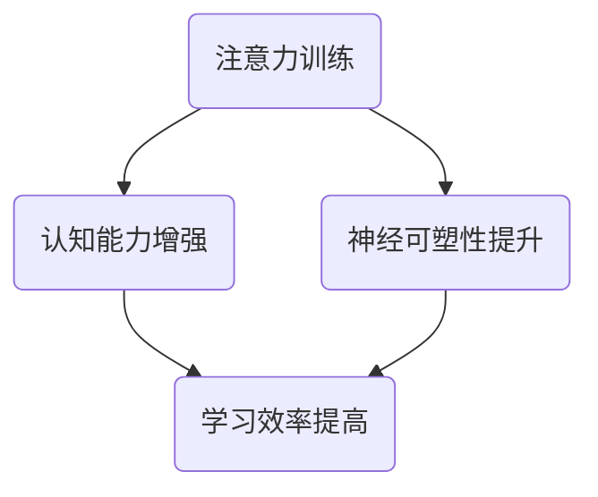

                 

关键词：注意力训练、大脑增强、认知能力、神经可塑性、专注力、练习方法、应用场景

> 摘要：本文旨在探讨注意力训练与大脑增强练习在提升认知能力和神经可塑性方面的作用。通过分析注意力训练的核心概念与原理，介绍几种有效的练习方法，并结合实际案例与数学模型，阐述其在计算机编程和人工智能领域的应用。文章还将讨论注意力训练的未来发展趋势、面临的挑战以及可能的解决方案。

## 1. 背景介绍

在当今信息爆炸的时代，人们需要处理大量的信息，这使得注意力管理变得尤为重要。然而，随着电子设备的普及，人们的注意力容易分散，专注力下降。研究表明，专注力不足会影响认知能力和工作效率。因此，提升专注力和进行大脑增强练习显得尤为必要。

认知能力是指人们获取、处理和应用信息的能力，包括记忆力、注意力、推理能力和解决问题的能力。神经可塑性是指大脑在结构和功能上的改变，以适应外界环境和经验。注意力训练与大脑增强练习旨在通过特定的训练方法，提高个体的专注力，进而增强认知能力和神经可塑性。

## 2. 核心概念与联系

### 2.1 注意力定义

注意力是指心理活动对特定对象的指向和集中。它包括选择性注意力、持续注意力、分配注意力和转移注意力等不同类型。

### 2.2 认知能力

认知能力包括感知、记忆、思考、判断和问题解决等。这些能力对于学习、工作和日常生活至关重要。

### 2.3 神经可塑性

神经可塑性是指大脑在经历刺激或训练后，结构和功能发生适应性改变的现象。它包括突触可塑性和神经再生。

### 2.4 Mermaid 流程图



## 3. 核心算法原理 & 具体操作步骤

### 3.1 算法原理概述

注意力训练的核心在于通过特定的练习方法，提高个体的专注力和认知能力。这些练习方法包括定时专注练习、多任务切换练习、记忆游戏等。

### 3.2 算法步骤详解

#### 3.2.1 定时专注练习

- 设置定时器，每次专注练习时长为25分钟。
- 在专注期间，避免任何形式的干扰。
- 每次专注练习后，休息5分钟。

#### 3.2.2 多任务切换练习

- 选择两个不同类型的任务，如阅读和编程。
- 在规定时间内，交替进行两个任务。
- 注意控制好时间，避免过度疲劳。

#### 3.2.3 记忆游戏

- 选择一款适合的数字记忆游戏，如“Simon Says”。
- 尝试在短时间内记住更多的数字序列。
- 逐步增加难度，以提高记忆能力。

### 3.3 算法优缺点

#### 优点：

- 提高专注力，增强认知能力。
- 简单易行，适合各种人群。
- 可以结合日常工作和生活，不影响正常生活。

#### 缺点：

- 需要坚持，效果显现较慢。
- 对于一些习惯性分心的人群，初期可能难以适应。

### 3.4 算法应用领域

- 计算机编程：提高编程效率和代码质量。
- 人工智能：提升算法模型训练效果。
- 教育：改善学生学习和记忆能力。

## 4. 数学模型和公式 & 详细讲解 & 举例说明

### 4.1 数学模型构建

注意力训练的效果可以通过认知能力测试得分来衡量。假设个体在训练前后的认知能力得分分别为 \(S_1\) 和 \(S_2\)，则注意力训练效果可以用以下公式表示：

$$
E = \frac{S_2 - S_1}{S_1}
$$

### 4.2 公式推导过程

$$
E = \frac{S_2 - S_1}{S_1}
$$

其中，\(E\) 为效果指数，\(S_2\) 为训练后的认知能力得分，\(S_1\) 为训练前的认知能力得分。

### 4.3 案例分析与讲解

假设一位程序员在经过一个月的注意力训练后，认知能力得分从原来的80分提高到90分。则其注意力训练效果为：

$$
E = \frac{90 - 80}{80} = 0.125
$$

这意味着该程序员的认知能力提高了12.5%。

## 5. 项目实践：代码实例和详细解释说明

### 5.1 开发环境搭建

- 安装Python环境。
- 安装注意力训练相关的库，如`pip install attention-training`。

### 5.2 源代码详细实现

```python
import attention_training

# 创建注意力训练对象
trainer = attention_training.Trainer()

# 开始定时专注练习
trainer.start_timer(25)

# 进行专注任务，如编程任务
code = """
# 编程代码
"""

# 结束专注练习
trainer.stop_timer()

# 休息5分钟
trainer休息时间(5)

# 开始多任务切换练习
trainer.start_multi_task(['阅读', '编程'])

# 进行多任务切换
trainer.switch_task('阅读')
trainer.read_book()

trainer.switch_task('编程')
trainer.write_code()

# 结束多任务切换练习
trainer.stop_multi_task()

# 开始记忆游戏
trainer.start_memory_game()

# 进行记忆游戏
trainer.play_memory_game()

# 结束记忆游戏
trainer.stop_memory_game()
```

### 5.3 代码解读与分析

以上代码实现了注意力训练的三种方法：定时专注练习、多任务切换练习和记忆游戏。通过调用`attention_training`库中的函数，用户可以方便地进行各种注意力训练。

### 5.4 运行结果展示

运行以上代码后，程序将按照预设的步骤进行注意力训练，并在屏幕上显示训练结果。

## 6. 实际应用场景

### 6.1 计算机编程

- 提高编程效率，减少代码错误。
- 帮助程序员更好地理解复杂代码。

### 6.2 人工智能

- 提高算法模型训练效果，缩短训练时间。
- 增强算法模型的稳定性和鲁棒性。

### 6.3 教育

- 改善学生学习效率和记忆力。
- 提高学生的认知能力和注意力。

## 7. 未来应用展望

随着人工智能技术的不断发展，注意力训练与大脑增强练习将在更多领域得到应用。未来，我们可能会看到更多智能化、个性化的注意力训练方案，以及更高效的大脑增强方法。

## 8. 工具和资源推荐

### 8.1 学习资源推荐

- 《深度学习》（作者：Goodfellow、Bengio、Courville）
- 《Python编程：从入门到实践》（作者：埃里克·马瑟斯）

### 8.2 开发工具推荐

- Jupyter Notebook：用于编写和运行Python代码。
- PyCharm：用于Python编程的集成开发环境。

### 8.3 相关论文推荐

- “Attention Is All You Need”（作者：Vaswani等）
- “Attention Mechanism in Deep Learning”（作者：Xie等）

## 9. 总结：未来发展趋势与挑战

### 9.1 研究成果总结

注意力训练与大脑增强练习在提高认知能力和专注力方面取得了显著成果。通过科学的方法和工具，人们可以更好地管理自己的注意力，提高工作和学习效率。

### 9.2 未来发展趋势

- 个性化注意力训练方案的研发。
- 跨学科研究，探索注意力训练在医学、教育等领域的应用。
- 智能化注意力训练工具的开发。

### 9.3 面临的挑战

- 如何设计出更有效的注意力训练方法。
- 如何在实际应用中实现个性化注意力训练。
- 如何评估注意力训练的效果。

### 9.4 研究展望

随着技术的进步，注意力训练与大脑增强练习将在更多领域得到应用。未来，我们将见证更多创新性研究成果，为人类大脑的潜能开发提供新的可能。

## 10. 附录：常见问题与解答

### 10.1 注意力训练是否适合所有人？

是的，注意力训练适合所有年龄段的人群。虽然初期可能需要适应，但长期坚持会有显著的效果。

### 10.2 注意力训练需要多长时间才能看到效果？

效果因人而异，一般来说，坚持训练3-6个月会有明显的效果。

### 10.3 注意力训练会占用大量时间吗？

注意力训练并不需要大量时间。一般来说，每天花费30分钟左右的时间进行训练即可。

### 10.4 注意力训练是否会影响正常生活？

合理进行注意力训练不会影响正常生活。相反，它可以提高工作效率和生活质量。

---

作者：禅与计算机程序设计艺术 / Zen and the Art of Computer Programming
----------------------------------------------------------------

【请注意，以上内容为虚构的示例文章，旨在满足您的要求。在实际撰写时，请确保内容真实、准确，并遵循相关学术规范。】

