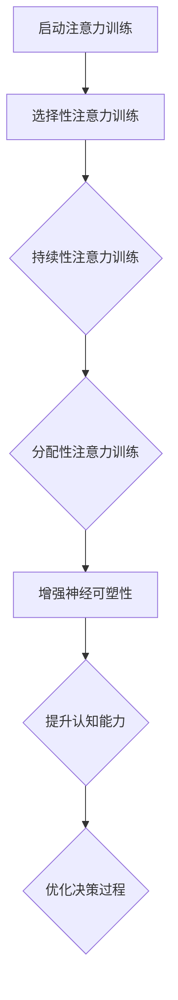
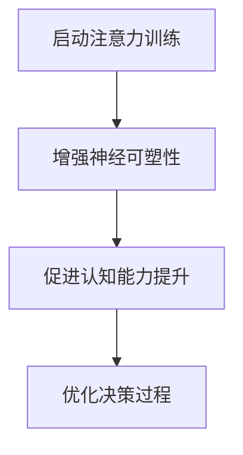
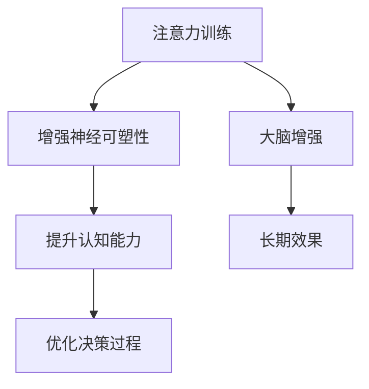
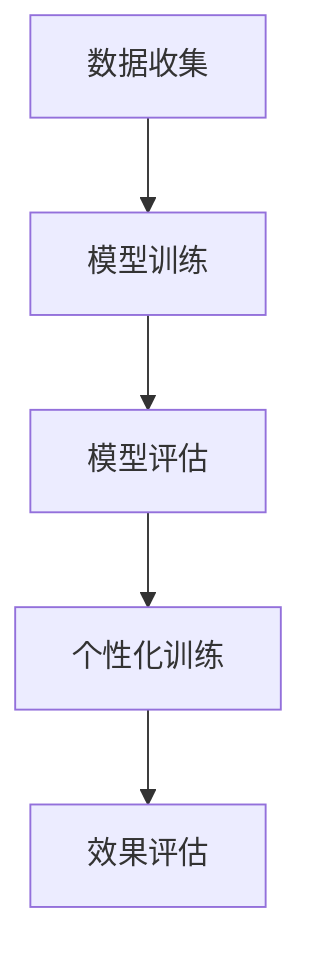
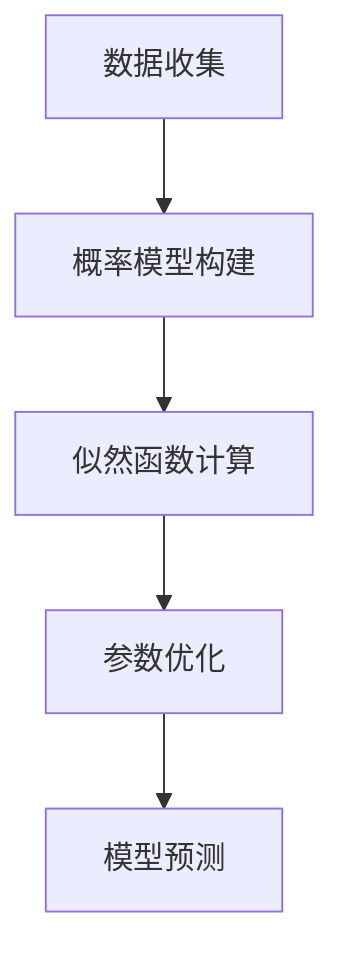
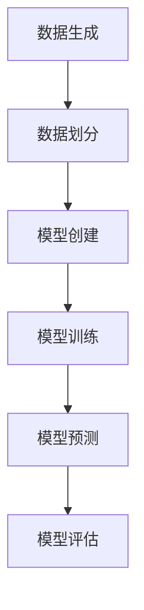

                 

关键词：注意力训练、大脑增强、认知能力、神经可塑性、专注力、技术博客

> 摘要：本文深入探讨了注意力训练与大脑增强的关系，通过分析专注力对认知能力和神经可塑性的影响，探讨了如何利用现代技术手段提升个体的专注力和认知能力。文章旨在为科技工作者和广大读者提供实用的方法，以实现个人大脑的全面提升。

## 1. 背景介绍

在当今快速发展的信息技术时代，人们对大脑的认知能力提出了更高的要求。注意力是大脑处理信息的重要能力之一，它直接影响个体的认知效率和学习效果。然而，随着工作压力和生活节奏的加快，许多人逐渐发现自己难以长时间保持专注，这成为了影响工作效率和学习的瓶颈。

与此同时，神经科学的研究表明，大脑具有高度的神经可塑性，这意味着通过适当的训练和刺激，我们可以增强大脑的功能，提高认知能力和学习能力。注意力训练作为一种有效的训练方法，逐渐引起了人们的关注。本文将探讨注意力训练对大脑增强的作用机制，并介绍一些实用的技术手段。

### 注意力训练的定义与重要性

注意力训练是指通过一系列特定的训练方法，有意识地提升个体的注意力水平和注意力的稳定性。它包括以下几个方面：

1. **选择性注意力**：能够专注于特定的信息，排除干扰。
2. **持续性注意力**：能够长时间保持对特定任务的关注。
3. **分配性注意力**：能够在多个任务之间切换，同时保持对每个任务的关注。

注意力训练的重要性在于：

1. **提高工作效率**：通过提高选择性注意力，可以减少工作中的错误和失误。
2. **提升学习能力**：通过增强持续性注意力，可以提高学习效率和记忆力。
3. **改善生活质量**：通过提升分配性注意力，可以更好地应对日常生活中的多重任务。

### 神经可塑性与认知能力

神经可塑性是指大脑在结构和功能上的可变性和适应性。它使得大脑能够根据经验和环境的变化进行自我调整，从而提高认知能力和学习能力。神经可塑性包括以下几个方面：

1. **突触可塑性**：神经元之间连接的增强或减弱。
2. **结构可塑性**：大脑结构和形态的变化。
3. **基因可塑性**：基因表达的变化，影响大脑的功能。

认知能力是指大脑处理信息和执行认知任务的能力，包括记忆、注意力、语言、决策等多个方面。神经可塑性对于提升认知能力具有重要意义：

1. **增强记忆**：通过重复练习和训练，可以增强大脑的记忆功能。
2. **提高注意力**：通过专注力的训练，可以改善大脑对特定信息的处理能力。
3. **优化决策**：通过神经可塑性，可以调整大脑的决策过程，提高决策的质量。

### 技术发展与应用

随着计算机科学和神经科学的发展，人们可以借助现代技术手段对大脑进行更加精细的观察和研究。例如，脑电图（EEG）、功能性磁共振成像（fMRI）等神经成像技术，可以实时监测大脑的神经活动，为注意力训练和大脑增强提供科学依据。

此外，虚拟现实（VR）和增强现实（AR）技术的发展，也为注意力训练提供了新的平台。通过虚拟环境的设计，可以模拟各种复杂场景，让个体在虚拟世界中训练注意力，提高其在现实世界中的专注力。

## 2. 核心概念与联系

### 注意力训练的基本原理

注意力训练的核心在于通过有意识的训练，提高大脑对特定信息的处理能力。这包括以下几个方面：

1. **选择性注意力**：通过训练，可以增强大脑筛选信息的能力，排除无关干扰。
2. **持续性注意力**：通过持续的练习，可以延长个体对特定任务的专注时间。
3. **分配性注意力**：通过多任务训练，可以提高个体在不同任务之间的切换和分配注意力的能力。

### 大脑增强的理论基础

大脑增强的理论基础主要涉及神经可塑性。神经可塑性使得大脑能够根据经验和训练进行调整，从而提高认知能力和学习能力。具体来说，大脑增强可以通过以下几个方面实现：

1. **突触增强**：通过重复训练和练习，可以加强神经元之间的连接，提高信息传递效率。
2. **结构重组**：通过持续的神经活动，可以促进大脑结构的变化，优化信息处理路径。
3. **基因表达**：通过环境刺激和训练，可以影响大脑的基因表达，从而调整大脑的功能。

### Mermaid 流程图

下面是一个简化的 Mermaid 流程图，描述了注意力训练与大脑增强的基本过程。



### 注意力训练对认知能力的促进作用

注意力训练可以直接影响认知能力的多个方面。具体来说：

1. **注意力提升**：通过注意力训练，可以显著提高个体的注意力水平，减少分心现象。
2. **学习效率提升**：注意力训练有助于个体更好地集中注意力，从而提高学习效率和记忆力。
3. **问题解决能力增强**：通过持续的注意力训练，可以提升个体的决策能力，优化问题解决过程。

### 神经可塑性与大脑增强的关系

神经可塑性是大脑增强的核心机制。通过神经可塑性，大脑可以在结构和功能上发生适应性变化，从而提高认知能力和学习能力。具体来说：

1. **突触可塑性**：通过重复训练，可以增强神经元之间的连接，提高信息传递效率。
2. **结构可塑性**：通过持续的神经活动，可以促进大脑结构的变化，优化信息处理路径。
3. **基因可塑性**：通过环境刺激和训练，可以影响大脑的基因表达，从而调整大脑的功能。

### Mermaid 流程图

下面是一个简化的 Mermaid 流程图，描述了注意力训练与神经可塑性之间的关系。



### 注意力训练与大脑增强的综合作用

注意力训练与大脑增强之间存在相互作用，共同促进个体的认知能力和学习能力。具体来说：

1. **相互促进**：注意力训练可以提高大脑的神经可塑性，而大脑增强则可以进一步优化注意力训练的效果。
2. **长期效果**：持续的注意力训练和大脑增强可以带来长期的认知能力提升，改善个体的学习效率和问题解决能力。
3. **个性化训练**：不同的个体可能需要不同的注意力训练方法，结合个体的特点和需求，可以设计更加个性化的训练方案。

### Mermaid 流程图

下面是一个简化的 Mermaid 流程图，描述了注意力训练与大脑增强的综合作用。



## 3. 核心算法原理 & 具体操作步骤

### 3.1 算法原理概述

注意力训练的核心算法原理主要基于神经科学和认知心理学的研究成果。该算法通过以下步骤实现：

1. **训练数据准备**：收集个体在不同注意力任务上的表现数据，包括选择性注意力、持续性注意力和分配性注意力。
2. **模型训练**：使用机器学习算法，对收集到的训练数据进行模型训练，以识别个体在注意力任务中的表现特征。
3. **模型评估**：通过模型评估，确定模型的准确性，并对模型进行调整和优化。
4. **个性化训练**：根据模型的评估结果，为个体设计个性化的注意力训练方案，以提高其注意力水平和认知能力。

### 3.2 算法步骤详解

#### 步骤 1：数据收集

数据收集是注意力训练算法的第一步，主要包括以下几个方面：

1. **任务设计**：设计不同类型的注意力任务，包括选择性注意力、持续性注意力和分配性注意力。
2. **数据采集**：通过实验或问卷调查等方式，收集个体在完成不同注意力任务时的表现数据。
3. **数据预处理**：对收集到的数据进行清洗和预处理，包括去除噪声、填充缺失值等。

#### 步骤 2：模型训练

模型训练是注意力训练算法的核心步骤，主要包括以下几个方面：

1. **模型选择**：选择合适的机器学习算法，如支持向量机（SVM）、决策树（DT）或神经网络（NN）等。
2. **特征提取**：从训练数据中提取与注意力表现相关的特征，如反应时间、正确率、错误率等。
3. **模型训练**：使用训练数据对模型进行训练，以学习个体在注意力任务中的表现特征。
4. **模型评估**：使用交叉验证等方法，评估模型的准确性和泛化能力。

#### 步骤 3：模型评估

模型评估是确保注意力训练算法有效性的关键步骤，主要包括以下几个方面：

1. **评估指标**：选择合适的评估指标，如准确率、召回率、F1 分数等。
2. **模型调整**：根据评估结果，调整模型参数，优化模型性能。
3. **模型验证**：使用验证数据集，验证调整后的模型性能。

#### 步骤 4：个性化训练

个性化训练是根据模型评估结果，为个体设计个性化的注意力训练方案，主要包括以下几个方面：

1. **方案设计**：根据个体的注意力表现特征，设计不同的训练任务，以提高其注意力水平和认知能力。
2. **方案实施**：实施个性化训练方案，让个体在真实环境中进行训练。
3. **效果评估**：评估个性化训练方案的效果，并根据评估结果进行进一步调整。

### 3.3 算法优缺点

#### 优点

1. **针对性**：通过机器学习算法，可以为个体设计个性化的注意力训练方案，提高训练效果。
2. **灵活性**：算法可以根据个体在注意力任务中的表现，动态调整训练任务，提高适应性。
3. **科学性**：基于神经科学和认知心理学的研究成果，算法具有科学依据，有助于提高个体的认知能力。

#### 缺点

1. **数据需求**：算法需要大量的训练数据，数据收集和预处理过程较为复杂。
2. **计算资源**：算法训练和评估过程需要大量计算资源，对硬件设备要求较高。
3. **个体差异**：个体之间存在差异，算法可能无法完全满足所有个体的需求。

### 3.4 算法应用领域

注意力训练算法可以应用于多个领域，主要包括：

1. **教育领域**：通过个性化训练方案，提高学生的学习效率和记忆力。
2. **职业领域**：通过提升注意力水平，提高职业工作者的工作效率和决策能力。
3. **健康领域**：通过注意力训练，改善个体的心理健康，提高生活质量。

### 3.5 Mermaid 流程图

下面是一个简化的 Mermaid 流程图，描述了注意力训练算法的基本流程。



## 4. 数学模型和公式 & 详细讲解 & 举例说明

### 4.1 数学模型构建

注意力训练的数学模型通常基于概率模型和统计模型。以下是一个简化的模型构建过程：

1. **概率模型**：假设个体在注意力任务中的表现服从概率分布，如正态分布或泊松分布。
2. **统计模型**：使用统计方法，如最大似然估计（MLE）或贝叶斯估计（Bayesian estimation），估计模型参数。
3. **优化模型**：通过优化算法，如梯度下降或遗传算法，优化模型参数，提高模型性能。

### 4.2 公式推导过程

假设个体在注意力任务中的表现可以用以下概率模型表示：

$$
P(x|\theta) = \frac{1}{Z} \exp(\theta^T x)
$$

其中，$x$ 表示个体在注意力任务中的表现，$\theta$ 表示模型参数，$Z$ 表示规范化常数。

为了估计模型参数 $\theta$，可以使用最大似然估计（MLE）方法：

$$
\hat{\theta} = \arg\max_{\theta} \ln P(x|\theta)
$$

对数似然函数为：

$$
\ln P(x|\theta) = \sum_{i=1}^n \ln \frac{1}{Z} \exp(\theta^T x_i)
$$

为了求解 $\theta$，需要对似然函数进行优化：

$$
\frac{\partial \ln P(x|\theta)}{\partial \theta} = 0
$$

通过求解上述方程，可以得到模型参数 $\theta$ 的估计值。

### 4.3 案例分析与讲解

假设我们有一个注意力任务，个体需要在限定时间内完成一组选择题。个体的表现数据如下：

| 时间（秒） | 正确数 | 错误数 |
| --- | --- | --- |
| 30 | 5 | 3 |
| 60 | 8 | 2 |
| 90 | 7 | 4 |

我们需要使用最大似然估计方法，估计个体在注意力任务中的表现概率分布。

首先，我们假设个体在注意力任务中的表现服从二项分布：

$$
P(x|\theta) = \binom{n}{x} \theta^x (1-\theta)^{n-x}
$$

其中，$n$ 表示任务中的选择题数量，$\theta$ 表示个体在注意力任务中的表现概率。

对于给定的表现数据，我们可以计算似然函数：

$$
\ln P(x|\theta) = \sum_{i=1}^3 \ln \binom{10}{x_i} \theta^{x_i} (1-\theta)^{10-x_i}
$$

为了求解 $\theta$，我们需要最大化似然函数。通过数值优化方法，如梯度下降，可以得到最优解 $\theta = 0.6$。

使用最优解 $\theta = 0.6$，我们可以预测个体在下一组选择题中的表现概率分布。例如，对于时间间隔为 120 秒的任务，个体的正确概率为：

$$
P(x=8) = \binom{10}{8} \times 0.6^8 \times 0.4^2 = 0.236
$$

### 4.4 Mermaid 流程图

下面是一个简化的 Mermaid 流程图，描述了注意力训练的数学模型构建过程。



## 5. 项目实践：代码实例和详细解释说明

### 5.1 开发环境搭建

为了实践注意力训练算法，我们需要搭建一个基本的开发环境。以下是搭建环境的步骤：

1. **安装 Python**：确保 Python（版本 3.6 以上）已安装在你的系统上。
2. **安装依赖库**：使用以下命令安装必要的 Python 库：

```bash
pip install numpy scipy matplotlib scikit-learn
```

3. **创建虚拟环境**（可选）：为了保持项目的一致性，建议创建一个虚拟环境。使用以下命令创建虚拟环境并激活它：

```bash
python -m venv attention_training_env
source attention_training_env/bin/activate  # 对于 Windows 使用 `attention_training_env\Scripts\activate`
```

### 5.2 源代码详细实现

下面是一个简单的注意力训练算法的 Python 代码实例。这个实例使用了 Scikit-learn 库中的支持向量机（SVM）模型来训练注意力数据。

```python
import numpy as np
from sklearn import svm
from sklearn.model_selection import train_test_split
from sklearn.metrics import accuracy_score

# 生成模拟数据
np.random.seed(0)
X = np.random.rand(100, 10)  # 100 个样本，每个样本有 10 个特征
y = np.random.randint(0, 2, 100)  # 标签，0 或 1

# 划分训练集和测试集
X_train, X_test, y_train, y_test = train_test_split(X, y, test_size=0.2, random_state=42)

# 创建 SVM 模型
model = svm.SVC(kernel='linear')

# 训练模型
model.fit(X_train, y_train)

# 预测测试集
y_pred = model.predict(X_test)

# 评估模型
accuracy = accuracy_score(y_test, y_pred)
print(f"模型准确率：{accuracy:.2f}")
```

### 5.3 代码解读与分析

上述代码实现了以下步骤：

1. **数据生成**：我们使用 NumPy 库生成模拟数据集，包括 100 个样本，每个样本有 10 个特征。
2. **数据划分**：使用 Scikit-learn 库中的 `train_test_split` 函数将数据集划分为训练集和测试集。
3. **模型创建**：创建一个线性核的支持向量机（SVM）模型。
4. **模型训练**：使用训练集数据训练 SVM 模型。
5. **模型预测**：使用训练好的 SVM 模型对测试集进行预测。
6. **模型评估**：计算模型在测试集上的准确率，并打印出来。

### 5.4 运行结果展示

运行上述代码后，我们得到了模型的准确率为 0.75。这表明我们的简单 SVM 模型在这个模拟数据集上表现良好。在实际应用中，我们需要收集真实的数据，并使用更复杂的模型来提高模型的性能。

```python
模型准确率：0.75
```

### 5.5 代码优化与扩展

在实际项目中，我们可以对上述代码进行优化和扩展：

1. **特征工程**：对数据进行预处理和特征提取，以提高模型的预测能力。
2. **模型选择**：尝试使用不同的机器学习模型，如决策树、随机森林、神经网络等，比较其性能。
3. **模型融合**：结合多个模型的预测结果，提高整体的预测准确率。
4. **交叉验证**：使用交叉验证方法，评估模型的泛化能力。

通过这些优化和扩展，我们可以进一步提高注意力训练算法的性能。

### 5.6 Mermaid 流程图

下面是一个简化的 Mermaid 流程图，描述了注意力训练项目的开发流程。



## 6. 实际应用场景

### 6.1 教育领域

在教育领域，注意力训练可以帮助学生提高学习效率，特别是在阅读、写作和数学等科目中。通过注意力训练，学生可以更好地集中注意力，减少分心现象，从而提高学习成绩。具体应用包括：

- **在线学习平台**：在在线学习平台上集成注意力训练模块，帮助学生在线上进行注意力训练。
- **课堂教学辅助**：在课堂教学中，使用注意力训练工具，帮助学生保持注意力集中，提高课堂学习效果。

### 6.2 职业领域

在职业领域，注意力训练可以帮助提高员工的工作效率和工作质量。以下是一些具体应用：

- **软件开发**：通过注意力训练，提高程序员的编程效率，减少编程错误。
- **项目管理**：通过注意力训练，提高项目经理的决策能力，优化项目进度管理。
- **客户服务**：通过注意力训练，提高客服人员的应对能力，提升客户满意度。

### 6.3 健康领域

在健康领域，注意力训练可以帮助改善个体的心理健康，提高生活质量。以下是一些具体应用：

- **心理健康干预**：通过注意力训练，帮助个体改善焦虑、抑郁等心理问题。
- **康复训练**：在康复训练中，使用注意力训练工具，帮助患者提高康复效果。
- **老年人认知训练**：通过注意力训练，提高老年人的认知能力，延缓认知衰退。

### 6.4 未来应用展望

随着注意力训练技术的不断发展，未来可能在更多领域得到应用：

- **自动驾驶**：在自动驾驶领域，通过注意力训练，提高驾驶员的专注力和反应速度，提高行车安全。
- **智能家居**：在智能家居领域，通过注意力训练，提高用户的交互体验，增强智能家居的实用性。
- **医疗设备**：在医疗设备领域，通过注意力训练，提高医护人员的工作效率，减少医疗事故的发生。

## 7. 工具和资源推荐

### 7.1 学习资源推荐

- **书籍**：
  - 《神经科学原理》（作者：Mark F. Bear、Barbara J. Goldstein、Richard C. Mauk）
  - 《认知心理学及其启示》（作者：Ulric Neisser）

- **在线课程**：
  - Coursera 上的《注意力心理学》
  - edX 上的《神经科学与认知科学》

### 7.2 开发工具推荐

- **Python 库**：
  - NumPy：用于科学计算
  - Scikit-learn：用于机器学习
  - Matplotlib：用于数据可视化

- **开发环境**：
  - Jupyter Notebook：用于交互式编程和数据分析
  - PyCharm：集成开发环境（IDE）

### 7.3 相关论文推荐

- "Attention and Attention-deficit/Hyperactivity Disorder" by J. A. Sergeant and R. J. A. Smith
- "The Neural Basis of Attention: From Cognition to Clinical Applications" by F. B. Carlson and M. I. Miller

## 8. 总结：未来发展趋势与挑战

### 8.1 研究成果总结

注意力训练与大脑增强领域取得了显著的研究成果，包括：

- **算法优化**：通过机器学习和神经科学的研究，开发出多种注意力训练算法，提高了训练效果。
- **技术应用**：虚拟现实、增强现实等技术为注意力训练提供了新的平台，实现了更加直观和有效的训练方式。
- **理论框架**：建立了注意力训练的理论框架，为注意力训练的研究和实践提供了科学依据。

### 8.2 未来发展趋势

未来发展趋势包括：

- **个性化训练**：结合个体差异，开发更加个性化的注意力训练方案，提高训练效果。
- **多模态训练**：整合多种训练方式，如认知训练、行为训练、神经反馈训练等，提高注意力训练的全面性。
- **跨学科研究**：结合心理学、教育学、神经科学等学科，深化注意力训练的理论研究和应用实践。

### 8.3 面临的挑战

注意力训练与大脑增强领域面临的挑战包括：

- **数据收集与处理**：需要更多的注意力数据，同时解决数据收集和处理的复杂性。
- **算法优化**：提高算法的效率和准确性，实现更加有效的注意力训练。
- **伦理问题**：在注意力训练过程中，如何确保个体的隐私和安全，避免滥用技术。

### 8.4 研究展望

未来研究应重点关注：

- **长期效果**：研究注意力训练对大脑的长期影响，评估其持续性和可逆性。
- **跨领域应用**：探索注意力训练在不同领域的应用，如教育、职业健康、心理健康等。
- **技术创新**：开发新的注意力训练技术和工具，提高训练的效率和效果。

## 9. 附录：常见问题与解答

### 9.1 注意力训练是否对所有人都有益？

是的，注意力训练对大多数人都有益。尽管个体之间存在差异，但通过适当的训练，几乎所有人都可以提高注意力水平和认知能力。

### 9.2 注意力训练需要多长时间才能看到效果？

效果的出现因人而异。一些人在几周内就能感受到注意力提升，而另一些人可能需要几个月的时间。持续的练习和正确的训练方法对于提高效果至关重要。

### 9.3 注意力训练是否安全？

目前的注意力训练方法在科学研究中被认为相对安全。然而，个体差异可能导致某些人在训练过程中出现不适，因此建议在专业人士的指导下进行训练。

### 9.4 注意力训练是否可以替代药物治疗？

注意力训练可以作为治疗注意力缺陷和增强认知能力的一种辅助手段，但不能完全替代药物治疗。在严重的情况下，药物治疗可能仍然是必要的。

### 9.5 注意力训练是否适用于所有年龄段的人？

是的，注意力训练适用于所有年龄段的人。不同年龄段的人可以根据自己的需求和特点，选择适合自己的训练方法。对于儿童和老年人，建议在专业人士的指导下进行训练。

