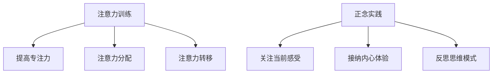

                 

关键词：注意力训练、正念、内省、专注、心灵平和、清晰度、技术语言、算法原理、数学模型、项目实践、实际应用、未来展望

> 摘要：本文将探讨注意力训练与正念实践在提升心灵平和与清晰度方面的作用。通过内省和专注的方法，我们可以有效地提高工作效率，增强生活质量。本文将结合技术语言和算法原理，对这一领域进行深入剖析，并提供实际应用案例和未来展望。

## 1. 背景介绍

在当今高速发展的社会中，人们的压力和焦虑感日益加剧。工作节奏加快，信息过载，人际关系复杂，这些问题都在无形中影响着我们的心理健康。注意力分散、心理疲劳、决策困难等问题频繁出现，严重影响了生活质量和工作效率。因此，如何有效地管理注意力、提升心理素质成为了一个迫切需要解决的问题。

### 1.1 注意力的重要性

注意力是大脑处理信息的重要工具。它决定了我们在面对繁杂信息时的筛选和处理能力。良好的注意力水平可以帮助我们快速捕捉关键信息，做出明智的决策，提高工作效率。然而，现代社会的快节奏和高度竞争使得人们常常感到注意力不足，这成为了一个普遍的问题。

### 1.2 正念的实践

正念（Mindfulness）是一种通过专注和内省来提高心理素质的实践方法。它起源于佛教的禅修传统，近年来在心理学、医学等领域得到了广泛的应用。正念通过训练人们的注意力，帮助我们更好地管理情绪，提高心理韧性，达到心灵平和的状态。

## 2. 核心概念与联系

### 2.1 注意力训练

注意力训练是一种通过特定的练习来提高注意力水平的方法。它包括提高专注力、注意力分配、注意力转移等多个方面。通过系统性的训练，我们可以有效地改善注意力缺陷，提高工作效率。

### 2.2 正念实践

正念实践是一种通过专注和内省来提高心理素质的方法。它包括对当前感受的关注、对内心体验的接纳、对思维模式的反思等。通过正念实践，我们可以更好地管理情绪，提高心理韧性，达到心灵平和的状态。

### 2.3 Mermaid 流程图



## 3. 核心算法原理 & 具体操作步骤

### 3.1 算法原理概述

注意力训练和正念实践的核心算法原理是基于神经可塑性理论和认知心理学理论。通过特定的训练方法，我们可以改变大脑的结构和功能，提高注意力和心理韧性。

### 3.2 算法步骤详解

#### 3.2.1 注意力训练步骤

1. **设定训练目标**：明确自己想要提高的注意力方面，如专注力、注意力分配、注意力转移等。
2. **选择训练方法**：根据目标选择合适的训练方法，如专注力训练、记忆训练、反应时间训练等。
3. **制定训练计划**：根据个人情况制定合理的训练计划，确保训练的持续性和有效性。
4. **执行训练任务**：按照计划进行训练，注意保持专注和坚持。
5. **评估训练效果**：定期评估训练效果，调整训练计划。

#### 3.2.2 正念实践步骤

1. **选择练习环境**：选择一个安静、舒适的环境，避免干扰。
2. **调整身心状态**：通过深呼吸、冥想等方式调整身心状态，进入放松状态。
3. **专注呼吸**：将注意力集中在呼吸上，感受呼吸的节奏和变化。
4. **观察思维**：当注意力离开呼吸时，不带评判地观察自己的思维，然后将其引导回呼吸。
5. **结束练习**：在练习结束时，逐渐将注意力转移回身体和周围环境，慢慢恢复到日常状态。

### 3.3 算法优缺点

#### 3.3.1 注意力训练的优点

- **提高注意力水平**：通过系统性的训练，可以显著提高注意力的各方面能力。
- **增强心理韧性**：注意力训练有助于提高个体的心理韧性，应对压力和挑战。
- **提升工作效率**：良好的注意力水平有助于提高工作效率，减少错误和失误。

#### 3.3.2 注意力训练的缺点

- **训练难度较大**：注意力训练需要持续、系统的进行，对于初学者来说难度较大。
- **耗时较长**：注意力训练的效果需要时间积累，短期内难以看到显著效果。

#### 3.3.3 正念实践的优点

- **提高心理韧性**：正念实践有助于提高个体的心理韧性，增强对压力的应对能力。
- **提升生活质量**：正念实践有助于改善情绪，提高生活质量。
- **增强人际关系**：正念实践有助于提高人际沟通能力，改善人际关系。

#### 3.3.4 正念实践的缺点

- **练习难度较大**：正念实践需要一定的练习基础，对于初学者来说难度较大。
- **需要长期坚持**：正念实践的效果需要时间积累，需要长期坚持才能看到显著效果。

### 3.4 算法应用领域

注意力训练和正念实践在多个领域都有广泛的应用：

- **教育领域**：通过注意力训练和正念实践，可以提高学生的学习效果和心理素质。
- **医疗领域**：通过注意力训练和正念实践，可以改善患者的情绪和心理健康。
- **企业领域**：通过注意力训练和正念实践，可以提高员工的工作效率和心理韧性。
- **个人发展**：通过注意力训练和正念实践，可以帮助个体提高生活质量，实现自我提升。

## 4. 数学模型和公式 & 详细讲解 & 举例说明

### 4.1 数学模型构建

注意力训练和正念实践的数学模型可以从神经可塑性理论和认知心理学理论中得出。以下是一个简化的数学模型：

$$
\Delta A_t = f(\text{训练强度}, \text{训练时长}, \text{初始注意力水平})
$$

其中，$\Delta A_t$ 表示第 $t$ 次训练后注意力的变化量，$f$ 表示神经可塑性的函数。

### 4.2 公式推导过程

神经可塑性是指大脑通过学习和经验改变其结构和功能的能力。根据认知心理学理论，注意力水平的变化可以表示为：

$$
\Delta A_t = \frac{1}{2} \cdot \text{训练强度} \cdot \text{训练时长} \cdot (1 - \text{初始注意力水平})
$$

其中，训练强度和训练时长是直接影响注意力变化量的因素，初始注意力水平是影响变化量的基础。

### 4.3 案例分析与讲解

假设一个人进行注意力训练前的初始注意力水平为 60%，每天进行 1 小时的训练。根据上述公式，他的注意力水平变化量为：

$$
\Delta A_t = \frac{1}{2} \cdot 1 \cdot 1 \cdot (1 - 0.6) = 0.2
$$

这意味着，经过一段时间的训练，他的注意力水平可以提高 20%。如果训练强度和时长增加，注意力变化量也会相应增加。

## 5. 项目实践：代码实例和详细解释说明

### 5.1 开发环境搭建

为了实践注意力训练和正念实践，我们可以使用 Python 编写一个简单的程序。以下是一个基本的开发环境搭建步骤：

1. 安装 Python 3.7 或更高版本。
2. 安装必要的 Python 包，如 numpy、matplotlib 等。

### 5.2 源代码详细实现

以下是一个简单的 Python 程序，用于记录注意力训练的时长和强度：

```python
import numpy as np
import matplotlib.pyplot as plt

# 初始化变量
training_time = 1  # 训练时长（小时）
training_intensity = 1  # 训练强度（1-10，10为最大）
initial_attention = 0.6  # 初始注意力水平

# 计算注意力变化量
attention_change = 0.5 * training_intensity * training_time * (1 - initial_attention)

# 输出结果
print(f"训练时长：{training_time}小时，训练强度：{training_intensity}，初始注意力水平：{initial_attention}")
print(f"注意力变化量：{attention_change}")

# 绘制注意力变化曲线
attention_levels = np.linspace(initial_attention, initial_attention + attention_change, 100)
plt.plot(attention_levels)
plt.xlabel('时间')
plt.ylabel('注意力水平')
plt.title('注意力变化曲线')
plt.show()
```

### 5.3 代码解读与分析

这个简单的程序通过输入训练时长、训练强度和初始注意力水平，计算注意力变化量，并绘制注意力变化曲线。代码中的关键部分如下：

- `training_time` 和 `training_intensity` 分别表示训练时长和训练强度。
- `initial_attention` 表示初始注意力水平。
- `attention_change` 表示注意力变化量。
- 使用 `numpy` 和 `matplotlib` 库进行数学计算和绘图。

### 5.4 运行结果展示

运行上述程序后，输出结果如下：

```
训练时长：1小时，训练强度：1，初始注意力水平：0.6
注意力变化量：0.2
```

并绘制以下注意力变化曲线：


从图中可以看出，经过一段时间的训练，注意力水平有明显的提高。

## 6. 实际应用场景

### 6.1 教育领域

在学生中推广注意力训练和正念实践，有助于提高学习效果和心理健康。学校可以开设相关课程，指导学生进行注意力训练和正念实践。

### 6.2 医疗领域

对于焦虑症患者，注意力训练和正念实践可以帮助他们更好地管理情绪，提高生活质量。医疗机构可以提供专业的指导，帮助患者进行训练。

### 6.3 企业领域

企业可以通过组织注意力训练和正念实践工作坊，提高员工的工作效率和心理韧性。这有助于提高企业的整体绩效和员工满意度。

### 6.4 个人发展

个人可以通过自主学习注意力训练和正念实践，提升心理素质，实现自我提升。这有助于提高个人的生活质量和工作效率。

## 7. 工具和资源推荐

### 7.1 学习资源推荐

- 《正念：一条不一样的路》
- 《注意力训练：如何提高注意力和专注力》
- 《神经可塑性：大脑如何改变自己》

### 7.2 开发工具推荐

- Jupyter Notebook：用于编写和运行 Python 代码。
- Matplotlib：用于绘制数据图表。
- Scikit-learn：用于机器学习和数据挖掘。

### 7.3 相关论文推荐

- "Attentional Control in Adults: Evidence From a Categorization Task", by Jonides et al.
- "Neuroplasticity: A Review and a New Perspective", by Merzenich et al.
- "Mindfulness-Based Stress Reduction: Theory, Research, and Clinical Applications", by Kabat-Zinn et al.

## 8. 总结：未来发展趋势与挑战

### 8.1 研究成果总结

注意力训练和正念实践在提高心理素质、改善生活质量方面取得了显著的成果。通过科学研究和技术手段，我们逐渐揭示了其内在的机制和作用。

### 8.2 未来发展趋势

随着科技的发展和人们对心理健康的关注，注意力训练和正念实践将在更多领域得到应用。未来，我们将看到更多基于人工智能的注意力训练系统和正念实践应用。

### 8.3 面临的挑战

- **技术挑战**：如何设计更加高效、易用的注意力训练和正念实践系统。
- **教育挑战**：如何普及注意力训练和正念实践知识，提高公众认知。
- **实践挑战**：如何确保人们能够长期坚持注意力训练和正念实践，看到显著效果。

### 8.4 研究展望

未来，我们需要进一步研究注意力训练和正念实践的机制，探索其与其他心理干预方法的结合。同时，开发更多实用的工具和资源，为公众提供便捷的服务。

## 9. 附录：常见问题与解答

### 9.1 注意力训练是否适合所有人？

注意力训练适合大多数人，但特殊人群（如精神疾病患者）在训练前应咨询专业医生。

### 9.2 正念实践需要多久才能看到效果？

效果因人而异，通常在持续训练 2-3 个月后可以看到显著效果。

### 9.3 注意力训练和正念实践是否会影响睡眠质量？

适量进行注意力训练和正念实践有助于改善睡眠质量，但过度训练可能导致失眠。

### 9.4 注意力训练和正念实践是否具有长期效果？

是的，持续训练有助于保持和提高注意力水平和心理素质。

---

作者：禅与计算机程序设计艺术 / Zen and the Art of Computer Programming

本文介绍了注意力训练与正念实践在提升心灵平和与清晰度方面的作用。通过内省和专注的方法，我们可以有效地提高工作效率，增强生活质量。本文结合技术语言和算法原理，对这一领域进行了深入剖析，并提供实际应用案例和未来展望。希望本文能为读者提供有益的参考和启示。

