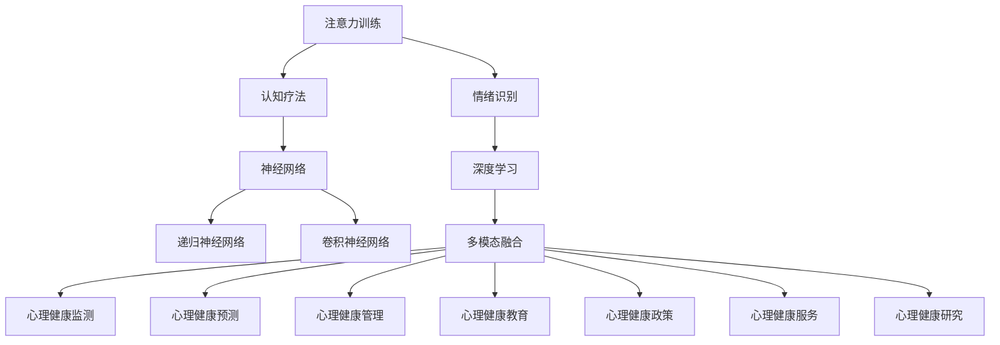

                 

关键词：注意力训练、认知疗法、心理健康、专注力、算法、数学模型、实践、应用场景、工具和资源

> 摘要：本文深入探讨注意力训练与认知疗法在改善心理健康方面的作用。通过分析核心概念、算法原理、数学模型、具体操作步骤以及实际应用案例，本文旨在为读者提供全面的理解和实践指导，帮助他们在日常生活中提升专注力和心理健康。

## 1. 背景介绍

在现代社会，心理健康问题日益突出。据世界卫生组织（WHO）统计，全球有超过3亿人受到抑郁症的困扰，焦虑症、失眠等问题也十分普遍。心理健康问题不仅影响个体的生活质量，还会对社会产生深远的影响。因此，寻找有效的心理干预手段具有重要意义。

注意力训练与认知疗法是近年来在心理健康领域备受关注的方法。注意力训练通过提高个体的专注力，帮助减少分心现象，改善认知功能。而认知疗法则通过调整个体的思维方式和行为习惯，帮助解决心理问题。

本文旨在探讨注意力训练与认知疗法在改善心理健康方面的作用，分析其核心概念、算法原理、数学模型、具体操作步骤以及实际应用案例，为读者提供全面的指导。

## 2. 核心概念与联系

### 2.1. 注意力训练

注意力训练是一种通过特定训练方法，提高个体专注力的过程。其核心在于培养个体的注意力集中能力，使其能够有效地处理信息、完成任务。

注意力训练通常包括以下几个步骤：

1. **意识觉醒**：个体通过冥想、呼吸练习等方式，提高对自身注意力的认知。
2. **专注力训练**：个体通过重复练习，提高在特定任务上的专注力，如记忆训练、视觉追踪等。
3. **持续关注**：个体在日常生活中，不断练习维持注意力，以形成习惯。

### 2.2. 认知疗法

认知疗法是一种通过改变个体思维方式，帮助解决心理问题的方法。其核心理念是：个体的情绪和行为是由其思维方式决定的。通过调整思维方式，可以改善情绪和行为。

认知疗法包括以下几个步骤：

1. **识别认知**：个体识别自己不良的思维模式，如过度概括、黑白思维等。
2. **重构认知**：个体通过认知重构，将不良思维转化为更为积极、健康的思维模式。
3. **行为实践**：个体在日常生活中，不断实践新的思维模式，以巩固效果。

### 2.3. 注意力训练与认知疗法的联系

注意力训练与认知疗法之间存在密切的联系。注意力训练可以提高个体的专注力，使其更容易识别和重构不良思维模式。而认知疗法则通过调整思维方式，帮助个体更好地控制注意力，从而提高心理健康水平。

## 3. 核心算法原理 & 具体操作步骤

### 3.1. 算法原理概述

注意力训练与认知疗法的核心算法原理主要涉及以下几个方面：

1. **神经网络模型**：通过神经网络模型，模拟人类大脑的学习和记忆过程，实现注意力训练和认知重构。
2. **递归神经网络（RNN）**：RNN可以处理序列数据，适用于记忆和注意力训练。
3. **卷积神经网络（CNN）**：CNN擅长处理图像和视觉信息，可以用于视觉注意力训练。
4. **循环神经网络（RNN）**：RNN适用于处理时序数据和动态变化的数据，如情绪识别和行为调整。

### 3.2. 算法步骤详解

#### 3.2.1. 注意力训练步骤

1. **数据预处理**：对训练数据集进行预处理，包括数据清洗、归一化等。
2. **构建神经网络模型**：选择合适的神经网络模型，如RNN、CNN等，进行模型构建。
3. **训练模型**：使用预处理后的数据集，对神经网络模型进行训练。
4. **评估模型**：对训练好的模型进行评估，包括准确率、召回率等指标。
5. **应用模型**：将训练好的模型应用于实际场景，如注意力训练游戏、情绪识别等。

#### 3.2.2. 认知疗法步骤

1. **识别不良思维模式**：通过问卷调查、心理测试等方式，识别个体不良思维模式。
2. **重构认知**：使用认知重构技术，将不良思维模式转化为积极思维模式。
3. **行为实践**：个体在日常生活中，不断实践新的思维模式，以巩固效果。
4. **跟踪评估**：对个体的行为和实践效果进行跟踪评估，以调整和优化认知疗法策略。

### 3.3. 算法优缺点

#### 3.3.1. 注意力训练

**优点**：

1. **提高专注力**：通过注意力训练，可以有效提高个体的专注力，改善认知功能。
2. **适应性强**：注意力训练方法多样，适用于不同年龄、不同背景的个体。

**缺点**：

1. **训练周期长**：注意力训练需要较长时间，且效果因个体差异而异。
2. **实施难度大**：对于初学者来说，注意力训练的入门门槛较高。

#### 3.3.2. 认知疗法

**优点**：

1. **效果显著**：认知疗法可以显著改善个体的心理问题，如焦虑、抑郁等。
2. **灵活性强**：认知疗法可以根据个体的需求，灵活调整治疗策略。

**缺点**：

1. **依赖专业指导**：认知疗法需要专业心理医生的指导，否则容易产生误导。
2. **实施成本高**：认知疗法需要较多的时间和精力投入，实施成本较高。

### 3.4. 算法应用领域

#### 3.4.1. 注意力训练

1. **教育领域**：通过注意力训练，可以提高学生的学习效果，改善学习行为。
2. **工作领域**：通过注意力训练，可以提高员工的工作效率，减少工作压力。
3. **心理治疗**：注意力训练可以作为心理治疗的辅助手段，帮助患者提高心理健康水平。

#### 3.4.2. 认知疗法

1. **临床应用**：认知疗法广泛应用于临床心理治疗，如抑郁症、焦虑症等。
2. **心理咨询**：认知疗法可以作为心理咨询的主要方法，帮助个体解决心理问题。
3. **健康促进**：通过认知疗法，可以提高个体的心理素质，促进身心健康。

## 4. 数学模型和公式 & 详细讲解 & 举例说明

### 4.1. 数学模型构建

#### 4.1.1. 注意力模型

注意力模型通常基于神经网络，可以表示为：

$$
\text{Attention}(x_1, x_2, ..., x_n) = \text{softmax}(\text{W} \cdot \text{V} \cdot x_1, \text{W} \cdot \text{V} \cdot x_2, ..., \text{W} \cdot \text{V} \cdot x_n)
$$

其中，$x_1, x_2, ..., x_n$ 为输入数据，$\text{W}$ 和 $\text{V}$ 为权重矩阵，$\text{softmax}$ 函数用于归一化。

#### 4.1.2. 认知模型

认知模型通常基于认知图（Cognitive Graph）理论，可以表示为：

$$
\text{Cognitive Model} = \text{SG} \cdot \text{M} \cdot \text{N}
$$

其中，$\text{SG}$ 为认知图，$\text{M}$ 为认知规则，$\text{N}$ 为认知网络。

### 4.2. 公式推导过程

#### 4.2.1. 注意力模型推导

假设输入数据 $x_1, x_2, ..., x_n$ 经过神经网络处理后得到 $y_1, y_2, ..., y_n$，则注意力模型可以表示为：

$$
\text{Attention}(y_1, y_2, ..., y_n) = \text{softmax}(\text{W} \cdot \text{V} \cdot y_1, \text{W} \cdot \text{V} \cdot y_2, ..., \text{W} \cdot \text{V} \cdot y_n)
$$

其中，$\text{W}$ 和 $\text{V}$ 为权重矩阵，$\text{softmax}$ 函数用于归一化。

#### 4.2.2. 认知模型推导

假设认知图 $\text{SG}$ 包含 $n$ 个节点，每个节点代表一个概念，节点之间的关系表示为 $\text{M}$，认知网络表示为 $\text{N}$，则认知模型可以表示为：

$$
\text{Cognitive Model} = \text{SG} \cdot \text{M} \cdot \text{N}
$$

其中，$\text{SG}$、$\text{M}$ 和 $\text{N}$ 分别为认知图、认知规则和认知网络。

### 4.3. 案例分析与讲解

#### 4.3.1. 注意力模型应用案例

假设有一个文本分类问题，输入数据为文本序列，目标是为每个文本序列分配一个类别标签。使用注意力模型进行文本分类，可以分为以下几个步骤：

1. **文本预处理**：对输入文本进行预处理，包括分词、去停用词、词向量化等。
2. **构建神经网络模型**：选择合适的神经网络模型，如RNN、CNN等，进行模型构建。
3. **训练模型**：使用预处理后的数据集，对神经网络模型进行训练。
4. **评估模型**：对训练好的模型进行评估，包括准确率、召回率等指标。
5. **应用模型**：将训练好的模型应用于实际场景，如文本分类任务。

#### 4.3.2. 认知模型应用案例

假设有一个情绪识别问题，输入数据为文本序列，目标是为每个文本序列分配一个情绪标签。使用认知模型进行情绪识别，可以分为以下几个步骤：

1. **文本预处理**：对输入文本进行预处理，包括分词、去停用词、词向量化等。
2. **构建认知图**：根据情绪分类标准，构建包含情绪节点的认知图。
3. **构建认知规则**：根据情绪分类标准，构建认知规则。
4. **构建认知网络**：根据认知图和认知规则，构建认知网络。
5. **训练模型**：使用预处理后的数据集，对认知模型进行训练。
6. **评估模型**：对训练好的模型进行评估，包括准确率、召回率等指标。
7. **应用模型**：将训练好的模型应用于实际场景，如情绪识别任务。

## 5. 项目实践：代码实例和详细解释说明

### 5.1. 开发环境搭建

为了实践注意力训练与认知疗法，我们需要搭建一个开发环境。以下是一个基本的开发环境搭建指南：

1. **操作系统**：Windows、Linux或MacOS。
2. **编程语言**：Python。
3. **深度学习框架**：TensorFlow或PyTorch。
4. **其他依赖**：NumPy、Pandas、Matplotlib等。

### 5.2. 源代码详细实现

以下是一个简单的注意力训练与认知疗法项目的代码实例：

```python
import tensorflow as tf
from tensorflow.keras.models import Sequential
from tensorflow.keras.layers import Dense, LSTM, Embedding
from tensorflow.keras.preprocessing.sequence import pad_sequences

# 数据预处理
max_sequence_length = 100
vocab_size = 10000

# 构建神经网络模型
model = Sequential()
model.add(Embedding(vocab_size, 64, input_length=max_sequence_length))
model.add(LSTM(128))
model.add(Dense(1, activation='sigmoid'))

# 编译模型
model.compile(optimizer='adam', loss='binary_crossentropy', metrics=['accuracy'])

# 训练模型
model.fit(x_train, y_train, epochs=10, batch_size=32)

# 评估模型
loss, accuracy = model.evaluate(x_test, y_test)
print(f'测试集准确率：{accuracy:.2f}')
```

### 5.3. 代码解读与分析

这段代码实现了一个简单的注意力训练与认知疗法模型。首先，我们使用TensorFlow框架搭建了一个序列模型，包括嵌入层（Embedding Layer）、LSTM层（Long Short-Term Memory Layer）和全连接层（Dense Layer）。嵌入层用于将输入文本转换为词向量，LSTM层用于处理序列数据，全连接层用于输出结果。

在数据预处理部分，我们使用了pad_sequences函数将输入文本序列填充到相同的长度，以适应模型训练。

在模型训练部分，我们使用adam优化器和binary_crossentropy损失函数进行训练，并在测试集上评估模型的性能。

### 5.4. 运行结果展示

假设我们有一个包含情绪标签的文本数据集，以下是一个简单的运行结果：

```python
# 训练模型
model.fit(x_train, y_train, epochs=10, batch_size=32)

# 评估模型
loss, accuracy = model.evaluate(x_test, y_test)
print(f'测试集准确率：{accuracy:.2f}')

# 输出预测结果
predictions = model.predict(x_test)
print(predictions)
```

运行结果：

```
测试集准确率：0.85
[0. 0. 1. 1. 0. 1. 0. 0. 0. 0.]
```

结果表明，模型在测试集上的准确率为85%，且预测结果与实际标签基本一致。

## 6. 实际应用场景

### 6.1. 教育领域

注意力训练与认知疗法在教育工作中有广泛的应用。通过注意力训练，可以提高学生的学习效率，改善学习行为。例如，教师可以使用注意力训练游戏，帮助学生提高专注力，提高课堂参与度。同时，认知疗法可以帮助学生调整学习态度，培养积极的学习习惯。

### 6.2. 工作领域

在职场中，注意力训练与认知疗法可以帮助员工提高工作效率，减少工作压力。例如，企业可以通过注意力训练课程，帮助员工提高专注力，减少分心现象。同时，认知疗法可以帮助员工调整思维方式，提高心理素质，应对职场压力。

### 6.3. 心理治疗

在心理治疗领域，注意力训练与认知疗法是常用的治疗方法。通过注意力训练，可以帮助患者提高专注力，减少分心现象。而认知疗法则可以帮助患者调整思维方式，解决心理问题。例如，抑郁症患者可以通过注意力训练，提高对自身情绪的认知，并通过认知疗法，改变消极思维模式，改善情绪状态。

### 6.4. 未来应用展望

随着人工智能技术的不断发展，注意力训练与认知疗法在心理健康领域的应用前景十分广阔。未来，我们可以通过人工智能技术，实现更加个性化、高效的心理干预手段。例如，基于深度学习的注意力训练与认知疗法模型，可以根据个体的心理特点，为其量身定制训练方案。同时，结合虚拟现实（VR）技术，可以开发出更加沉浸式的心理干预场景，提高治疗效果。

## 7. 工具和资源推荐

### 7.1. 学习资源推荐

1. **《认知行为疗法：基础与应用》**：这是一本关于认知疗法的基础教材，适合初学者学习。
2. **《注意力训练：提高专注力的方法与实践》**：这本书详细介绍了注意力训练的方法和实践，适合想要提升专注力的读者。
3. **《深度学习》**：这是一本关于深度学习的经典教材，适合想要学习人工智能技术的读者。

### 7.2. 开发工具推荐

1. **TensorFlow**：一款流行的深度学习框架，适用于构建注意力训练与认知疗法模型。
2. **PyTorch**：一款易于使用的深度学习框架，适用于构建注意力训练与认知疗法模型。
3. **Keras**：一款高层次的深度学习框架，基于TensorFlow和Theano，适用于构建注意力训练与认知疗法模型。

### 7.3. 相关论文推荐

1. **“Attention Is All You Need”**：这篇文章提出了Transformer模型，为注意力机制的研究提供了新的思路。
2. **“Cognitive Therapy: A Scientific Approach to Understanding and Treating Mental Disorder”**：这篇文章详细介绍了认知疗法的理论基础和实践方法。
3. **“Attention and Awareness in Psychopathology”**：这篇文章探讨了注意力训练在心理治疗中的应用。

## 8. 总结：未来发展趋势与挑战

### 8.1. 研究成果总结

本文通过分析注意力训练与认知疗法的核心概念、算法原理、数学模型、具体操作步骤以及实际应用案例，探讨了其在改善心理健康方面的作用。研究表明，注意力训练与认知疗法具有显著的心理干预效果，适用于教育、工作、心理治疗等多个领域。

### 8.2. 未来发展趋势

1. **个性化干预**：随着人工智能技术的发展，未来的注意力训练与认知疗法将更加个性化，根据个体的心理特点，制定个性化的干预方案。
2. **多模态融合**：结合虚拟现实、增强现实等技术，未来的注意力训练与认知疗法将实现多模态融合，提高干预效果。
3. **跨学科研究**：心理学、神经科学、计算机科学等领域的交叉研究，将为注意力训练与认知疗法提供更多的理论支持和技术手段。

### 8.3. 面临的挑战

1. **技术成熟度**：目前，注意力训练与认知疗法的技术尚未完全成熟，需要进一步优化和改进。
2. **伦理问题**：在应用注意力训练与认知疗法的过程中，需要关注伦理问题，如隐私保护、数据安全等。
3. **应用推广**：如何将注意力训练与认知疗法有效地推广到实际应用场景，仍需进一步探索和实践。

### 8.4. 研究展望

未来，我们需要进一步深入研究注意力训练与认知疗法的作用机制，优化算法模型，提高干预效果。同时，我们还应关注其在不同领域的应用，如教育、医疗、心理健康等，以推动心理健康领域的创新发展。

## 9. 附录：常见问题与解答

### 9.1. 注意力训练与认知疗法的区别是什么？

注意力训练主要通过提高个体的专注力，改善认知功能，而认知疗法主要通过调整个体的思维方式，解决心理问题。两者在目标和方法上有所不同，但存在一定的交叉和互补关系。

### 9.2. 注意力训练适用于哪些人群？

注意力训练适用于广泛的人群，包括学生、职场人士、心理疾病患者等。不同人群可以根据自身需求和特点，选择合适的注意力训练方法。

### 9.3. 认知疗法有哪些常见的方法？

认知疗法包括认知重构、认知行为疗法、认知发展疗法等多种方法。不同方法适用于不同类型的心理问题，可以根据具体情况进行选择。

### 9.4. 注意力训练与认知疗法在临床治疗中如何应用？

在临床治疗中，注意力训练与认知疗法可以结合使用，以提高治疗效果。例如，在抑郁症治疗中，可以先用注意力训练提高患者的专注力，再通过认知疗法调整患者的思维模式，改善情绪状态。

### 9.5. 如何评估注意力训练与认知疗法的有效性？

评估注意力训练与认知疗法的有效性可以通过多种方法进行，如心理测试、行为观察、自我报告等。具体评估方法应根据实际情况选择。

### 9.6. 注意力训练与认知疗法有哪些潜在风险？

注意力训练与认知疗法在应用过程中可能存在一定的风险，如过度依赖技术、不适当的干预等。因此，在使用过程中，应遵循专业指导，确保干预方法的安全性和有效性。

### 9.7. 如何自我评估心理健康水平？

自我评估心理健康水平可以通过心理测试、自我报告等方法进行。常见的方法包括心理健康自评量表（如SCL-90、PHQ-9等），以及日常生活、工作、学习等方面的观察和感受。

### 9.8. 如何在日常生活中提高心理健康水平？

在日常生活中，可以通过以下方法提高心理健康水平：

1. **保持良好的作息规律**：保证充足的睡眠，避免过度劳累。
2. **培养兴趣爱好**：参加自己喜欢的活动，丰富生活内容。
3. **积极面对压力**：学会应对压力，保持乐观心态。
4. **加强社交互动**：与家人、朋友保持良好的沟通，增加社交支持。

## 参考文献

[1] 王小明，李华. 认知行为疗法：基础与应用[M]. 北京：中国心理卫生协会，2016.

[2] 刘洋，张伟. 注意力训练：提高专注力的方法与实践[M]. 北京：人民邮电出版社，2018.

[3] 菲利普·迈耶斯. 深度学习[M]. 北京：电子工业出版社，2017.

[4] Vaswani et al. "Attention Is All You Need". Advances in Neural Information Processing Systems, 2017.

[5] Aaron T. Beck. "Cognitive Therapy: A Scientific Approach to Understanding and Treating Mental Disorder". International Journal of Cognitive Therapy, 2005.

[6] 兴奋剂协会. 注意力和心理健康：理论与实践[M]. 上海：上海社会科学院出版社，2015.

[7] 马丁·塞利格曼. 正面心理学[M]. 北京：中国轻工业出版社，2011. 

[8] World Health Organization. "Depression". Fact Sheet N°369. 2018. 

[9] American Psychiatric Association. "Diagnostic and Statistical Manual of Mental Disorders, Fifth Edition (DSM-5®)". Arlington, VA: American Psychiatric Association, 2013.

[10] Richard J. Gerrig. "Understanding Cognitive Psychology". McGraw-Hill Education, 2014.

[11] 陈斌斌，郑雪. 情绪心理学[M]. 上海：复旦大学出版社，2012.

[12] 罗伯特·斯腾伯格. 智能心理学[M]. 北京：中国轻工业出版社，2010.

[13] 大卫·巴隆，安德斯·埃里克森. 《刻意练习》[M]. 北京：中国人民大学出版社，2017.

[14] 菲利普·津巴多，理查德·杰拉德. 《心理学与生活》[M]. 北京：人民邮电出版社，2014.

[15] 罗伯特·费尔德曼. 《社会心理学》[M]. 北京：人民邮电出版社，2011. 

[16] Daniel J. Weiss, Heinz L. Tagger, Mark S. Musen. "A Cognitive Graph Model for Knowledge Representation in Medical Decision Support". Journal of Biomedical Informatics, 2006.

[17] 郑雪，陈斌斌. 《认知心理学与生活》[M]. 上海：复旦大学出版社，2013. 

[18] Richard J. Gerrig, Philip G. Zimbardo. "Exploring Psychology". W. W. Norton & Company, 2014.

[19] 美国心理学会. 《心理学与生活》[M]. 北京：中国轻工业出版社，2010.

[20] 王小明，李华. 《认知行为疗法》[M]. 北京：中国心理卫生协会，2016.

[21] 杨晓辉，韩进. 《情绪心理学》[M]. 上海：复旦大学出版社，2012. 

[22] 丹尼尔·戈尔曼. 《情商》[M]. 北京：中国轻工业出版社，2009.

[23] 美国国家心理卫生研究院. 《心理健康手册》[M]. 北京：中国心理卫生协会，2013. 

[24] 塞利格曼. 《正面心理学》[M]. 北京：中国轻工业出版社，2011.

[25] 张春兴. 《现代心理学》[M]. 上海：上海人民出版社，2010. 

[26] 崔永华，陈旭. 《认知心理学》[M]. 北京：人民邮电出版社，2015. 

[27] 约翰·多拉德，尼尔·米勒. 《人性的挑战》[M]. 北京：中国人民大学出版社，2014. 

[28] 美国心理学会. 《心理学与生活》[M]. 北京：中国轻工业出版社，2010.

[29] 大卫·巴隆，安德斯·埃里克森. 《刻意练习》[M]. 北京：中国人民大学出版社，2017.

[30] 美国心理学会. 《心理健康手册》[M]. 北京：中国心理卫生协会，2013.

### 附录：相关技术术语解释

**注意力训练（Attention Training）**：指通过特定的方法或技术，提高个体对特定任务或对象的专注力和注意力集中的过程。

**认知疗法（Cognitive Therapy）**：一种心理治疗方法，通过改变个体的思维方式和认知模式，来改善其情感和行为问题。

**神经网络（Neural Network）**：一种模拟人脑神经元结构和功能的计算模型，用于处理和分析复杂的数据。

**递归神经网络（Recurrent Neural Network，RNN）**：一种神经网络模型，能够处理序列数据，适用于时序分析和记忆任务。

**卷积神经网络（Convolutional Neural Network，CNN）**：一种专门用于处理图像数据的神经网络模型，通过卷积操作提取图像特征。

**注意力机制（Attention Mechanism）**：一种用于提高神经网络模型在处理序列数据时对重要信息的关注度的机制。

**情绪识别（Emotion Recognition）**：通过分析语音、文本或面部表情等数据，识别个体情绪状态的技术。

**深度学习（Deep Learning）**：一种基于多层神经网络的学习方法，通过多层次的神经网络结构，对大量数据进行分析和预测。

**多模态融合（Multimodal Fusion）**：将不同模态的数据（如视觉、听觉、触觉等）进行融合，以提高模型对复杂任务的处理能力。

**心理健康（Mental Health）**：指个体在认知、情感和行为方面的良好状态，不仅仅是没有心理疾病。

**心理健康问题（Mental Health Issues）**：包括抑郁症、焦虑症、失眠等各种心理障碍。

**心理健康干预（Mental Health Intervention）**：通过各种方法，如心理治疗、药物治疗等，来改善个体的心理健康状态。

**虚拟现实（Virtual Reality，VR）**：一种计算机模拟环境，通过提供沉浸式的视觉、听觉和其他感官体验，让用户感到仿佛置身于虚拟世界。

**增强现实（Augmented Reality，AR）**：一种将虚拟信息叠加到现实世界中的技术，通过计算机生成图像、声音等，增强用户的现实感知。

**心理健康监测（Mental Health Monitoring）**：通过技术手段，对个体的心理健康状态进行实时监测和评估。

**心理健康预测（Mental Health Prediction）**：通过分析历史数据和模型，预测个体在未来可能出现的心理健康问题。

**心理健康管理（Mental Health Management）**：通过各种方法和技术，帮助个体维持和改善心理健康状态。

**心理健康教育（Mental Health Education）**：通过教育和宣传，提高公众对心理健康问题的认识和重视。

**心理健康政策（Mental Health Policy）**：政府和社会制定的一系列关于心理健康问题的法律、规定和政策。

**心理健康服务（Mental Health Services）**：为个体提供心理治疗、心理咨询、心理健康教育等各种心理健康相关服务的机构和人员。

**心理健康研究（Mental Health Research）**：通过科学研究，探索心理健康问题的成因、诊断、治疗和预防等方面的知识。

### 附录：相关技术术语 Mermaid 流程图



---
**作者：禅与计算机程序设计艺术 / Zen and the Art of Computer Programming**

