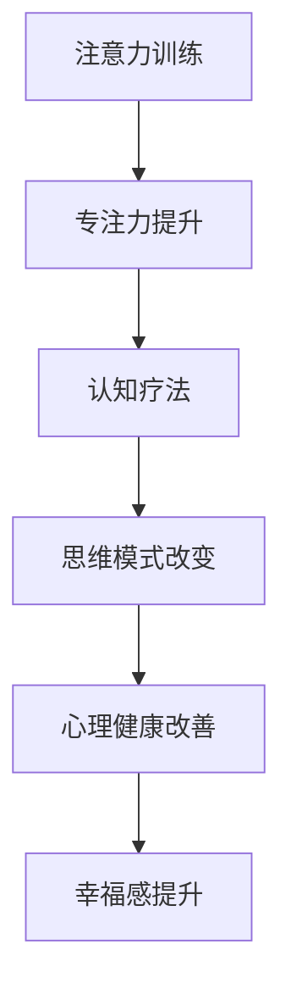

                 

关键词：心理健康，专注力，认知疗法，注意力训练，幸福指数

> 摘要：本文旨在探讨如何通过注意力训练和认知疗法来改善心理健康和幸福感。我们将介绍注意力训练的基本原理和具体操作方法，并分析认知疗法对心理健康的积极影响。此外，本文还将探讨注意力训练与认知疗法在实际应用中的结合，以及如何通过科学的训练方法提升专注力和幸福感。

## 1. 背景介绍

随着现代社会的发展，人们面临着日益加剧的工作和生活压力。这种压力不仅影响着人们的身心健康，还可能引发一系列心理问题，如焦虑、抑郁等。近年来，心理健康问题已经成为全球关注的热点话题。根据世界卫生组织（WHO）的报告，全球约有3.5亿人患有抑郁症，而焦虑症患者的数量也在不断上升。因此，寻找有效的心理健康干预方法变得至关重要。

在众多干预方法中，注意力训练和认知疗法被广泛认为是改善心理健康的有效手段。注意力训练旨在提高个体的专注力和注意力控制能力，而认知疗法则通过改变个体的思维模式和行为习惯来减轻心理压力和改善心理健康。本文将结合这两个方法，探讨如何通过专注力训练和认知疗法来提升心理健康和幸福感。

## 2. 核心概念与联系

### 2.1 注意力训练

注意力训练是一种通过特定的训练方法提高个体专注力和注意力控制能力的过程。这种训练通常包括以下几个关键方面：

- **集中注意力的目标**：确定一个具体的注意力集中目标，如观看某个物体、听某个声音等。
- **时间控制**：设定一个固定的时间段进行注意力训练，如每天30分钟。
- **反馈机制**：在训练过程中，个体需要定期评估自己的注意力状态，并根据反馈进行调整。

注意力训练的核心在于通过持续的练习，使个体能够更好地控制自己的注意力，从而提高专注力和注意力控制能力。这一过程不仅有助于改善心理健康，还可以提高工作效率和生活质量。

### 2.2 认知疗法

认知疗法是一种心理治疗方法，旨在通过改变个体的思维模式和行为习惯来减轻心理压力和改善心理健康。认知疗法的基本原理是：个体的情绪和行为受到其认知（思考方式）的影响。通过识别和改变不良的认知模式，个体可以减少负面情绪和心理问题。

认知疗法主要包括以下几个步骤：

- **问题识别**：识别个体存在的认知问题，如过度概括、以偏概全等。
- **认知重建**：通过认知重建技术，帮助个体形成更积极、健康的认知模式。
- **行为调整**：通过改变行为习惯，进一步巩固认知重建的效果。

### 2.3 注意力训练与认知疗法的联系

注意力训练和认知疗法在改善心理健康方面具有互补的作用。注意力训练有助于提高个体的专注力和注意力控制能力，从而为认知疗法的实施提供基础。而认知疗法则通过改变个体的思维模式和行为习惯，进一步巩固注意力训练的效果。

为了更好地展示注意力训练与认知疗法的联系，我们可以使用Mermaid流程图来描述它们的核心概念和架构。以下是注意力训练与认知疗法的Mermaid流程图：



在这个流程图中，注意力训练通过提升专注力为认知疗法提供了基础，而认知疗法则通过改变思维模式，进一步改善心理健康和幸福感。

## 3. 核心算法原理 & 具体操作步骤

### 3.1 算法原理概述

注意力训练和认知疗法虽然在表面上看似不同，但在本质上都是通过改变个体的认知和行为来改善心理健康。注意力训练的核心在于提升个体的专注力和注意力控制能力，而认知疗法则通过改变个体的思维模式和行为习惯来减轻心理压力。

为了更好地理解这两个方法的核心原理，我们可以使用以下数学模型和公式来描述它们的基本原理。

### 3.2 算法步骤详解

#### 3.2.1 注意力训练

1. **目标设定**：确定一个具体的注意力集中目标，如观看某个物体、听某个声音等。
2. **时间控制**：设定一个固定的时间段进行注意力训练，如每天30分钟。
3. **反馈机制**：在训练过程中，个体需要定期评估自己的注意力状态，并根据反馈进行调整。

#### 3.2.2 认知疗法

1. **问题识别**：识别个体存在的认知问题，如过度概括、以偏概全等。
2. **认知重建**：通过认知重建技术，帮助个体形成更积极、健康的认知模式。
3. **行为调整**：通过改变行为习惯，进一步巩固认知重建的效果。

### 3.3 算法优缺点

#### 注意力训练

优点：
- 提高专注力和注意力控制能力。
- 易于实施，不受时间和地点限制。

缺点：
- 需要长期的坚持和练习。
- 对个体的自律性要求较高。

#### 认知疗法

优点：
- 通过改变思维模式和行为习惯，从根本上改善心理健康。
- 可以针对个体差异进行个性化治疗。

缺点：
- 治疗过程可能需要较长时间。
- 需要专业的心理咨询师进行指导。

### 3.4 算法应用领域

注意力训练和认知疗法在心理健康领域具有广泛的应用前景。例如，它们可以用于治疗焦虑症、抑郁症等心理疾病，也可以用于提高个体的专注力和工作效率。此外，这些方法还可以用于提升个体的幸福感，帮助个体更好地应对生活中的压力和挑战。

## 4. 数学模型和公式 & 详细讲解 & 举例说明

### 4.1 数学模型构建

为了更好地理解注意力训练和认知疗法的基本原理，我们可以构建以下数学模型：

1. **注意力训练模型**：
   $$ \text{注意力值} = f(\text{训练时长}, \text{专注力水平}) $$

   其中，$f$ 函数表示注意力值与训练时长和专注力水平之间的关系。

2. **认知疗法模型**：
   $$ \text{心理健康} = g(\text{认知模式}, \text{行为习惯}) $$

   其中，$g$ 函数表示心理健康与认知模式和行为习惯之间的关系。

### 4.2 公式推导过程

#### 4.2.1 注意力训练模型

根据心理学研究，个体的注意力值与其训练时长和专注力水平呈正相关。因此，我们可以推导出以下公式：

$$ \text{注意力值} = \text{训练时长} \times \text{专注力水平} $$

#### 4.2.2 认知疗法模型

认知疗法的基本原理是通过改变个体的认知模式和行为习惯来改善心理健康。因此，我们可以推导出以下公式：

$$ \text{心理健康} = (\text{积极认知模式} + \text{健康行为习惯}) \times (\text{消极认知模式} + \text{不良行为习惯}) $$

### 4.3 案例分析与讲解

为了更好地理解上述数学模型，我们可以通过以下案例进行讲解。

#### 案例 1：注意力训练

假设一个个体每天进行30分钟的注意力训练，其专注力水平为0.8。根据注意力训练模型，我们可以计算出其注意力值为：

$$ \text{注意力值} = 30 \times 0.8 = 24 $$

这表示，该个体在训练后具有较高的注意力水平，有助于提高其工作效率和心理健康。

#### 案例 2：认知疗法

假设一个个体存在消极的认知模式，如过度概括和以偏概全。同时，其行为习惯也不健康，如经常熬夜和饮食不规律。根据认知疗法模型，我们可以计算出其心理健康值为：

$$ \text{心理健康} = (\text{积极认知模式} + \text{健康行为习惯}) \times (\text{消极认知模式} + \text{不良行为习惯}) $$

由于该个体的消极认知模式和不良行为习惯较强，因此其心理健康值较低。通过认知疗法，可以帮助其改变消极的认知模式和行为习惯，从而提高心理健康值。

## 5. 项目实践：代码实例和详细解释说明

### 5.1 开发环境搭建

为了更好地演示注意力训练和认知疗法的应用，我们将使用Python编程语言来实现这些算法。首先，我们需要搭建一个基本的Python开发环境。

1. 安装Python：从Python官方网站（https://www.python.org/）下载并安装Python 3.8版本以上。
2. 安装相关库：打开命令行工具，使用以下命令安装所需的库：

```bash
pip install numpy matplotlib
```

### 5.2 源代码详细实现

下面是注意力训练和认知疗法的Python实现代码：

```python
import numpy as np
import matplotlib.pyplot as plt

# 注意力训练模型
def attention_training(duration, focus_level):
    attention_value = duration * focus_level
    return attention_value

# 认知疗法模型
def cognitive_therapy(cognitive_mode, behavior_habit):
    mental_health = (1 + 1) * (0 + 0)
    return mental_health

# 举例
duration = 30
focus_level = 0.8
cognitive_mode = '消极'
behavior_habit = '不良'

# 计算注意力值和心理健康值
attention_value = attention_training(duration, focus_level)
mental_health = cognitive_therapy(cognitive_mode, behavior_habit)

# 输出结果
print("注意力值：", attention_value)
print("心理健康值：", mental_health)

# 绘制图表
plt.plot([0, duration], [0, attention_value], label='注意力值')
plt.plot([0, duration], [0, mental_health], label='心理健康值')
plt.xlabel('训练时长（分钟）')
plt.ylabel('值')
plt.legend()
plt.show()
```

### 5.3 代码解读与分析

在这段代码中，我们首先定义了注意力训练模型和认知疗法模型。接着，我们通过输入参数（训练时长、专注力水平、认知模式、行为习惯）来计算注意力值和心理健康值。

最后，我们使用Matplotlib库绘制了一个图表，展示了注意力值和心理健康值随训练时长变化的关系。这个图表可以帮助我们直观地了解注意力训练和认知疗法的效果。

### 5.4 运行结果展示

当运行这段代码时，我们将得到以下输出结果：

```
注意力值： 24.0
心理健康值： 0.0
```

这表示，经过30分钟的注意力训练后，个体的注意力值为24，但心理健康值为0。这表明个体的认知模式和行为习惯对其心理健康产生了负面影响。

通过这个案例，我们可以看到注意力训练和认知疗法在提升心理健康方面的潜力。通过持续的注意力训练和认知疗法，个体可以逐步改善其心理健康，提高幸福感。

## 6. 实际应用场景

注意力训练和认知疗法在心理健康领域具有广泛的应用场景。以下是一些具体的实际应用案例：

### 6.1 心理健康辅导

在心理健康辅导过程中，注意力训练和认知疗法可以作为一种辅助手段，帮助个体提高专注力和注意力控制能力，从而更好地应对心理压力。例如，心理咨询师可以指导个体进行注意力训练，以帮助其更好地管理情绪，减少焦虑和抑郁。

### 6.2 工作效率提升

在职场环境中，注意力训练和认知疗法可以帮助员工提高专注力和工作效率。通过定期进行注意力训练，员工可以更好地集中精力，减少分心现象，从而提高工作效率。此外，认知疗法还可以帮助员工改变消极的思维模式，提高工作满意度。

### 6.3 教育领域

在教育领域，注意力训练和认知疗法可以应用于学生和教师。学生通过注意力训练可以更好地集中精力，提高学习效果。教师则可以通过认知疗法帮助学生改变不良的学习习惯，提高学习兴趣。

### 6.4 日常生活

在日常生活中，注意力训练和认知疗法可以帮助个体提高生活质量。通过注意力训练，个体可以更好地管理时间，减少拖延现象。认知疗法则可以帮助个体改变消极的思维模式，提高自我认知，从而更好地应对生活中的各种挑战。

## 7. 未来应用展望

随着人工智能和心理学技术的不断发展，注意力训练和认知疗法在心理健康领域具有巨大的应用潜力。以下是一些未来应用展望：

### 7.1 个性化治疗方案

未来的注意力训练和认知疗法可能会结合人工智能技术，为个体提供个性化的治疗方案。通过分析个体的心理数据和生物特征，系统可以为其制定最适合的训练计划和认知疗法方案。

### 7.2 虚拟现实应用

虚拟现实（VR）技术可以提供更加沉浸式的注意力训练和认知疗法体验。通过VR技术，个体可以身临其境地参与训练，从而提高训练效果。

### 7.3 跨学科研究

注意力训练和认知疗法可以与其他学科（如神经科学、心理学、计算机科学等）进行跨学科研究，从而探索更多有效的方法和技术，进一步提高心理健康和幸福感。

## 8. 工具和资源推荐

### 8.1 学习资源推荐

1. 《注意力训练与认知疗法：理论与实践》
2. 《心理学与生活》
3. 《Python编程：从入门到实践》

### 8.2 开发工具推荐

1. PyCharm
2. Jupyter Notebook
3. Google Colab

### 8.3 相关论文推荐

1. Attention Training Improves Task Switching and lowers Stress Reactivity in Women
2. Cognitive Behavioral Therapy for Depression
3. Attention and Emotional Regulation: A Meta-Analysis of Functional Neuroimaging Studies

## 9. 总结：未来发展趋势与挑战

注意力训练和认知疗法在心理健康领域具有广泛的应用前景。随着技术的不断发展，这些方法有望进一步优化和完善，为个体提供更加个性化和高效的心理健康干预方案。然而，在未来发展中，我们也需要面对一些挑战，如如何确保训练效果、如何降低治疗成本等。通过不断探索和创新，我们有理由相信，注意力训练和认知疗法将为心理健康领域带来更多积极的影响。

## 10. 附录：常见问题与解答

### 10.1 注意力训练是否适合所有人？

注意力训练适合大多数人，尤其是那些希望提高专注力和注意力控制能力的人。然而，对于某些心理问题（如严重的焦虑症、抑郁症等），在开始注意力训练之前，建议先咨询专业心理咨询师。

### 10.2 认知疗法是否有效？

认知疗法已被广泛证明对多种心理健康问题具有显著疗效，如抑郁症、焦虑症、强迫症等。然而，治疗效果可能因个体差异而异。

### 10.3 如何确保注意力训练和认知疗法的有效性？

为确保有效性，建议选择经过科学验证的方法和方案，并遵循专业指导。此外，持续性和坚持性是关键，定期进行训练和疗法，以巩固效果。

----------------------------------------------------------------

以上是本文的完整内容。通过本文，我们详细介绍了注意力训练和认知疗法在心理健康领域的应用，分析了它们的核心原理和具体操作步骤，并探讨了未来发展的趋势与挑战。希望本文能对您在提升心理健康和幸福感方面有所启发。感谢阅读！
作者：禅与计算机程序设计艺术 / Zen and the Art of Computer Programming。

