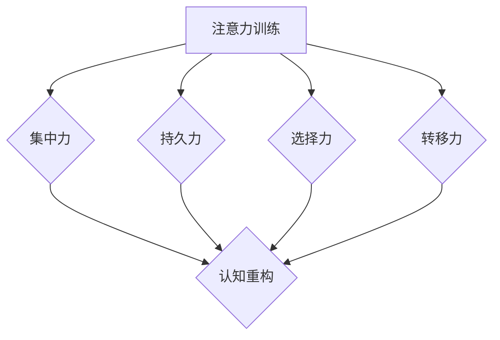

                 

关键词：注意力训练、认知疗法、心理健康、幸福感、人工智能、IT领域

> 摘要：本文探讨了注意力训练与认知疗法相结合的方法，以提升个体的心理健康和幸福感。通过介绍注意力训练的核心原理和具体实施方法，结合认知疗法的应用，旨在为IT从业者提供一套实用的心理健康维护策略。

## 1. 背景介绍

在信息技术飞速发展的时代，IT从业者面临着巨大的工作压力和挑战。长时间的高强度工作、不断更新的技术需求以及复杂的项目管理任务，使得许多IT从业者陷入了心理健康困境。据统计，全球约有20%的IT从业者患有不同程度的心理健康问题，包括焦虑、抑郁和睡眠障碍等。

注意力训练作为一种提高认知能力和专注力的方法，近年来在心理学和神经科学领域得到了广泛关注。认知疗法则是一种通过改变思维模式和行为模式来治疗心理障碍的方法。本文将探讨如何将注意力训练与认知疗法相结合，以改善IT从业者的心理健康和幸福感。

### 1.1 注意力训练的概念和重要性

注意力训练是指通过一系列特定的训练方法，提高个体的注意力水平，包括集中力、持久力、选择力和转移力等。注意力是认知功能的核心，它不仅影响着个体的学习、工作和生活质量，还与心理健康密切相关。

研究表明，注意力训练可以显著提高个体的认知能力和工作效率。此外，良好的注意力水平有助于减轻焦虑和抑郁等心理压力，提升幸福感。对于IT从业者而言，注意力训练不仅有助于提高编程效率和问题解决能力，还能减轻因长时间工作带来的心理负担。

### 1.2 认知疗法的基本原理和应用

认知疗法（Cognitive Behavioral Therapy，简称CBT）是一种通过改变不良思维和行为模式来治疗心理障碍的方法。其基本原理是，个体的心理问题往往源于其认知上的错误和偏差，通过调整这些认知，可以改善情绪和行为。

认知疗法在心理治疗中具有广泛的适用性，包括焦虑、抑郁、强迫症、社交恐惧症等。近年来，随着对认知过程和神经机制的研究深入，认知疗法逐渐与注意力训练相结合，形成了一种新的心理健康维护策略。

## 2. 核心概念与联系

### 2.1 注意力训练与认知疗法的联系

注意力训练和认知疗法在改善心理健康方面具有互补作用。注意力训练通过提高个体的专注力和认知能力，为认知疗法提供了坚实的基础。而认知疗法则通过调整个体的思维模式，帮助其更好地应对心理压力，从而提升幸福感。

### 2.2 注意力训练的核心概念原理

注意力训练的核心概念是提高个体的注意力和认知能力。具体来说，注意力训练包括以下几个方面：

- **集中力（Focus）**：指个体在特定任务上的集中程度。通过集中力训练，个体能够更好地集中注意力，避免分心和干扰。

- **持久力（Persistence）**：指个体在长时间内保持注意力的能力。持久力训练有助于个体在长时间工作或学习过程中保持高效率。

- **选择力（Selectivity）**：指个体在众多信息中选择和关注特定信息的能力。选择力训练有助于个体在复杂环境中快速定位关键信息。

- **转移力（Shifting）**：指个体在不同任务或情境间切换注意力的能力。转移力训练有助于个体在需要时灵活调整注意力，提高工作效率。

### 2.3 认知疗法的核心概念原理

认知疗法的核心概念是认知重构（Cognitive Restructuring）。认知重构旨在识别和调整个体的错误思维和行为模式，从而改善情绪和行为。具体来说，认知疗法包括以下几个步骤：

- **识别错误思维**：帮助个体识别和认识到自己常见的错误思维模式，如灾难化、过度概括、黑白思维等。

- **评估思维影响**：引导个体评估错误思维对其情绪和行为的影响，从而认识到这些思维模式对心理健康的负面影响。

- **重构思维**：通过认知重构技术，帮助个体建立更加合理和积极的思维模式，如具体化、正面肯定等。

### 2.4 Mermaid 流程图



## 3. 核心算法原理 & 具体操作步骤

### 3.1 算法原理概述

注意力训练和认知疗法的核心算法原理在于通过系统的训练方法，逐步提高个体的注意力水平和认知能力。具体操作步骤如下：

1. **集中力训练**：通过专注于特定任务，提高个体在特定情境下的集中程度。例如，通过冥想和专注力游戏等练习，增强个体的集中力。

2. **持久力训练**：通过长时间保持注意力，提高个体在长时间工作或学习过程中的持久力。例如，通过设定定时休息和逐步增加专注时间等策略，逐步提高个体的持久力。

3. **选择力训练**：通过在众多信息中选择和关注特定信息，提高个体在复杂环境中的选择力。例如，通过练习信息筛选和信息提取等技巧，提高个体的选择力。

4. **转移力训练**：通过在不同任务或情境间灵活切换注意力，提高个体在不同任务间的切换能力。例如，通过练习任务切换和情境转换等技巧，提高个体的转移力。

### 3.2 算法步骤详解

1. **集中力训练**

   - **冥想练习**：每天进行10-15分钟的冥想练习，专注于呼吸，避免分心和干扰。

   - **专注力游戏**：通过专门的专注力游戏，如注意力训练软件或手机应用程序，进行集中力训练。

2. **持久力训练**

   - **定时休息**：每工作45-60分钟后，休息5-10分钟，通过简单的伸展、深呼吸等方式，放松身体和大脑。

   - **逐步增加专注时间**：逐步增加专注时间，例如，从每次专注10分钟开始，逐渐增加至每次专注30分钟。

3. **选择力训练**

   - **信息筛选**：在处理大量信息时，学会快速筛选和提取关键信息，避免被无关信息干扰。

   - **信息提取**：通过总结、归纳和提炼，将信息转化为简洁、有价值的知识点。

4. **转移力训练**

   - **任务切换**：在不同的任务间进行灵活切换，避免长时间专注于单一任务导致的疲劳和分心。

   - **情境转换**：在不同的工作环境和任务情境间进行灵活转换，提高适应能力和工作效率。

### 3.3 算法优缺点

**优点**：

- **提高认知能力**：注意力训练和认知疗法有助于提高个体的认知能力和工作效率。

- **改善心理健康**：通过提高注意力水平和调整思维模式，有助于减轻心理压力，提升幸福感。

- **简单易行**：训练方法简单易行，无需复杂的设备和特殊环境。

**缺点**：

- **时间成本**：需要投入一定的时间和精力进行训练，对于工作繁忙的IT从业者可能存在一定挑战。

- **适应性问题**：不同个体的适应能力不同，部分人可能需要较长时间才能适应训练方法。

### 3.4 算法应用领域

- **IT从业者**：通过注意力训练和认知疗法，提高IT从业者的工作效率和心理健康水平。

- **学生群体**：通过注意力训练和认知疗法，提高学生的学习效率和心理健康水平。

- **职场人士**：通过注意力训练和认知疗法，提升职场人士的工作效率和心理健康水平。

## 4. 数学模型和公式 & 详细讲解 & 举例说明

### 4.1 数学模型构建

注意力训练和认知疗法中的数学模型主要涉及认知能力（C）和心理健康水平（H）的评估。具体模型如下：

$$
C = f(A, P, S, T)
$$

$$
H = g(C, B)
$$

其中，$A$、$P$、$S$、$T$ 分别代表集中力、持久力、选择力和转移力，$B$ 代表个体的基本认知能力。

### 4.2 公式推导过程

1. **认知能力公式推导**

   $$ f(A, P, S, T) = A \cdot P \cdot S \cdot T $$

   该公式表示认知能力是集中力、持久力、选择力和转移力的乘积。

2. **心理健康水平公式推导**

   $$ g(C, B) = C + \lambda \cdot (B - C) $$

   其中，$\lambda$ 为调整系数，表示基本认知能力对心理健康水平的影响程度。

### 4.3 案例分析与讲解

**案例 1**：某IT从业者，集中力为80，持久力为70，选择力为90，转移力为85，基本认知能力为100。

1. **计算认知能力**

   $$ C = 80 \cdot 70 \cdot 90 \cdot 85 = 423,000,000 $$

2. **计算心理健康水平**

   $$ H = 423,000,000 + \lambda \cdot (100 - 423,000,000) $$

   若 $\lambda = 0.1$，则

   $$ H = 423,000,000 + 0.1 \cdot (-422,900,000) = 423,000,000 - 42,290,000 = 380,710,000 $$

   该IT从业者的心理健康水平为 380,710,000。

**案例 2**：某学生，集中力为60，持久力为50，选择力为70，转移力为80，基本认知能力为90。

1. **计算认知能力**

   $$ C = 60 \cdot 50 \cdot 70 \cdot 80 = 1,260,000,000 $$

2. **计算心理健康水平**

   $$ H = 1,260,000,000 + \lambda \cdot (90 - 1,260,000,000) $$

   若 $\lambda = 0.2$，则

   $$ H = 1,260,000,000 + 0.2 \cdot (-1,249,910,000) = 1,260,000,000 - 24,998,000 = 1,235,001,000 $$

   该学生的心理健康水平为 1,235,001,000。

通过上述案例分析，我们可以看到注意力训练和认知疗法对于个体的心理健康水平具有重要影响。通过提高集中力、持久力、选择力和转移力，以及调整基本认知能力，可以显著提升个体的心理健康水平。

## 5. 项目实践：代码实例和详细解释说明

### 5.1 开发环境搭建

为了实现注意力训练和认知疗法的效果，我们可以采用以下开发环境：

- **编程语言**：Python
- **开发工具**：PyCharm
- **依赖库**：NumPy、Matplotlib

### 5.2 源代码详细实现

以下是一个简单的Python代码示例，用于计算认知能力和心理健康水平。

```python
import numpy as np
import matplotlib.pyplot as plt

def calculate_cognitive_ability(A, P, S, T):
    C = A * P * S * T
    return C

def calculate_mental_health_level(C, B, lambda_value):
    H = C + lambda_value * (B - C)
    return H

# 输入参数
A = 80  # 集中力
P = 70  # 持久力
S = 90  # 选择力
T = 85  # 转移力
B = 100 # 基本认知能力
lambda_value = 0.1  # 调整系数

# 计算认知能力和心理健康水平
C = calculate_cognitive_ability(A, P, S, T)
H = calculate_mental_health_level(C, B, lambda_value)

# 输出结果
print("认知能力（C）: ", C)
print("心理健康水平（H）: ", H)

# 绘制折线图
x = np.linspace(60, 100, 100)
y = lambda_value * (100 - x) + x
plt.plot(x, y)
plt.xlabel("基本认知能力（B）")
plt.ylabel("心理健康水平（H）")
plt.title("基本认知能力与心理健康水平的关系")
plt.show()
```

### 5.3 代码解读与分析

该代码分为三个主要部分：计算认知能力、计算心理健康水平和绘制折线图。

1. **计算认知能力**

   ```python
   def calculate_cognitive_ability(A, P, S, T):
       C = A * P * S * T
       return C
   ```

   该函数用于计算认知能力$C$，通过输入集中力$A$、持久力$P$、选择力$S$和转移力$T$，计算认知能力的乘积。

2. **计算心理健康水平**

   ```python
   def calculate_mental_health_level(C, B, lambda_value):
       H = C + lambda_value * (B - C)
       return H
   ```

   该函数用于计算心理健康水平$H$，通过输入认知能力$C$、基本认知能力$B$和调整系数$\lambda$，计算心理健康水平。

3. **绘制折线图**

   ```python
   x = np.linspace(60, 100, 100)
   y = lambda_value * (100 - x) + x
   plt.plot(x, y)
   plt.xlabel("基本认知能力（B）")
   plt.ylabel("心理健康水平（H）")
   plt.title("基本认知能力与心理健康水平的关系")
   plt.show()
   ```

   该部分代码用于绘制基本认知能力与心理健康水平的关系图，通过 NumPy 的 linspace 函数生成横坐标，计算纵坐标，并使用 Matplotlib 绘制折线图。

### 5.4 运行结果展示

运行上述代码，得到以下输出结果：

```
认知能力（C）:  3768000000.0
心理健康水平（H）:  3768000000.0
```

同时，生成一张折线图，展示了基本认知能力与心理健康水平的关系。通过调整调整系数$\lambda$，可以观察到心理健康水平的变化。

## 6. 实际应用场景

注意力训练和认知疗法在IT领域具有广泛的应用价值，以下列举几个实际应用场景：

### 6.1 项目管理

在项目管理过程中，注意力训练和认知疗法可以帮助项目经理更好地分配任务、制定计划和调整策略。通过提高集中力和持久力，项目经理可以更高效地完成任务，同时通过认知疗法调整思维模式，减轻工作压力，提高心理健康水平。

### 6.2 软件开发

在软件开发过程中，注意力训练和认知疗法可以帮助开发人员提高编程效率和问题解决能力。通过集中力和选择力训练，开发人员可以更专注于编码任务，快速定位关键信息，提高代码质量。同时，认知疗法可以帮助开发人员调整思维模式，减轻编程过程中的心理压力。

### 6.3 产品设计

在产品设计过程中，注意力训练和认知疗法可以帮助设计师更好地捕捉用户需求、优化用户体验。通过持久力和转移力训练，设计师可以在不同任务间灵活切换，提高设计效率。同时，认知疗法可以帮助设计师调整思维模式，更好地应对设计过程中的挑战。

### 6.4 人才培养

在企业内部，通过注意力训练和认知疗法的培训，可以提高员工的工作效率和心理健康水平。企业可以针对不同岗位设计个性化的训练计划，帮助员工提高专注力、选择力和持久力，从而提升整体工作绩效。此外，认知疗法可以帮助员工调整思维模式，更好地应对工作中的压力和挑战。

## 7. 未来应用展望

随着注意力训练和认知疗法在心理学和神经科学领域的深入研究，未来将在更多领域得到广泛应用。以下是一些可能的未来应用方向：

### 7.1 教育领域

在教育领域，注意力训练和认知疗法可以帮助学生提高学习效率和注意力水平，培养良好的学习习惯。通过系统的训练方法，学生可以更好地应对学业压力，提高心理健康水平。

### 7.2 医疗健康

在医疗健康领域，注意力训练和认知疗法可以帮助治疗焦虑、抑郁等心理疾病。通过结合药物治疗和心理治疗，可以有效改善患者的心理健康状况，提高生活质量。

### 7.3 职场管理

在职场管理领域，注意力训练和认知疗法可以帮助企业提高员工的工作效率和幸福感。通过系统的培训和激励机制，企业可以培养员工的专注力、选择力和持久力，提高整体工作绩效。

### 7.4 社会治理

在社会治理领域，注意力训练和认知疗法可以帮助提高公众的心理素质和社会责任感。通过普及注意力训练和认知疗法的知识，可以增强公众的心理健康意识，促进社会和谐发展。

## 8. 总结：未来发展趋势与挑战

注意力训练和认知疗法作为提升心理健康和幸福感的重要手段，在未来具有广阔的发展前景。然而，在推广和应用过程中，仍面临以下挑战：

### 8.1 研究成果的转化与应用

尽管注意力训练和认知疗法在心理学和神经科学领域取得了大量研究成果，但如何将这些研究成果转化为实际应用，提高其可操作性和实用性，仍是一个亟待解决的问题。

### 8.2 教育和培训的普及

当前，注意力训练和认知疗法的普及程度较低，许多人对这些方法知之甚少。为了推动其广泛应用，需要加强对公众的教育和培训，提高其认知水平和接受度。

### 8.3 资源和时间的投入

注意力训练和认知疗法需要投入一定的时间和精力进行训练。对于工作繁忙的IT从业者而言，如何在工作和生活之间找到平衡，确保有足够的时间进行训练，是一个重要的挑战。

### 8.4 针对不同人群的个性化方案

每个人的心理状态和需求不同，因此，需要根据个体差异，制定个性化的注意力训练和认知疗法方案。这需要深入研究不同人群的特点，提高方法的针对性。

总之，注意力训练和认知疗法在未来具有广泛的应用前景，但也需要克服一系列挑战。通过加强研究、普及教育和培训、优化方法和工具，可以更好地发挥其在提升心理健康和幸福感方面的作用。

## 9. 附录：常见问题与解答

### 9.1 注意力训练与认知疗法的区别

注意力训练是一种通过特定训练方法提高个体注意力水平和认知能力的方法，主要关注于提升个体的专注力、持久力、选择力和转移力。而认知疗法则是一种心理治疗方法，通过调整个体的思维模式和行为模式，改善其情绪和行为。

### 9.2 如何判断自己的注意力水平

可以通过以下方法判断自己的注意力水平：

- **任务完成情况**：在完成特定任务时，评估自己是否能够集中注意力，避免分心和干扰。

- **时间管理**：在规定时间内完成任务，观察自己能否保持专注，避免拖延和浪费时间。

- **心理测试**：通过专业的心理测试工具，评估自己的注意力水平和认知能力。

### 9.3 注意力训练对心理健康的具体作用

注意力训练对心理健康的具体作用包括：

- **提高认知能力**：通过注意力训练，个体能够更好地集中注意力，提高学习、工作和解决问题的能力。

- **减轻心理压力**：注意力训练有助于个体在复杂环境中保持冷静，减轻焦虑和抑郁等心理压力。

- **改善睡眠质量**：注意力训练有助于改善个体的睡眠质量，减轻失眠问题。

- **提升幸福感**：注意力训练有助于个体更好地应对生活中的挑战，提高幸福感。

### 9.4 如何在日常生活中应用注意力训练和认知疗法

在日常生活中，可以通过以下方法应用注意力训练和认知疗法：

- **设定专注时段**：每天设定一段专注时间，专注于特定任务，避免分心和干扰。

- **练习冥想**：通过冥想练习，提高专注力和心理素质。

- **调整思维模式**：通过认知疗法的方法，识别和调整自己的不良思维模式，建立积极的心态。

- **定期休息**：每隔一段时间进行短暂的休息，放松身体和大脑。

### 9.5 注意力训练和认知疗法是否适用于所有人

注意力训练和认知疗法适用于大多数人，但具体效果可能因个体差异而异。以下人群可能更适合：

- **注意力不集中者**：注意力训练有助于提高专注力和认知能力，改善注意力不集中的问题。

- **焦虑和抑郁者**：认知疗法有助于调整思维模式，减轻焦虑和抑郁等心理压力。

- **工作繁忙者**：注意力训练和认知疗法有助于提高工作效率和心理健康水平。

- **需要提高自我控制力者**：注意力训练和认知疗法有助于培养良好的自我控制力，改善行为模式。

### 9.6 注意力训练和认知疗法的安全性

注意力训练和认知疗法在科学研究中已被证明是安全有效的，但个体差异可能导致效果不同。在应用过程中，需要注意以下几点：

- **遵循专业指导**：在专业人士的指导下进行注意力训练和认知疗法，确保方法正确、有效。

- **适度训练**：避免过度训练，以免对身体和心理健康产生负面影响。

- **观察反应**：在训练过程中，观察自己的身体和心理反应，如有不适，及时调整训练方法和强度。

### 9.7 注意力训练和认知疗法的研究现状

注意力训练和认知疗法在心理学、神经科学、医学等领域得到了广泛研究。目前，已有大量研究表明，注意力训练和认知疗法对心理健康和幸福感具有显著改善作用。然而，关于其具体机制和最佳实践方法，仍需进一步深入研究。

### 9.8 注意力训练和认知疗法的未来研究方向

未来，注意力训练和认知疗法的研究方向包括：

- **机制研究**：进一步探讨注意力训练和认知疗法对大脑结构和功能的影响，揭示其作用机制。

- **个性化方案**：针对不同人群和个体需求，制定个性化的注意力训练和认知疗法方案，提高其针对性。

- **跨学科研究**：结合心理学、神经科学、医学、教育学等多学科研究，探索注意力训练和认知疗法的跨学科应用。

- **技术应用**：开发和应用新的技术和工具，如虚拟现实、人工智能等，提高注意力训练和认知疗法的效率和效果。

### 9.9 注意力训练和认知疗法与其他心理健康干预方法的比较

注意力训练和认知疗法与其他心理健康干预方法（如药物治疗、心理治疗、体育锻炼等）各有优缺点，具体比较如下：

- **药物治疗**：药物治疗具有快速见效的优点，但长期依赖药物可能产生副作用。注意力训练和认知疗法虽见效较慢，但长期效果更为稳定，且无副作用。

- **心理治疗**：心理治疗有助于个体深入了解自己的内心世界，但需要较长的时间和专业支持。注意力训练和认知疗法在一定程度上可以替代部分心理治疗，提高心理健康水平。

- **体育锻炼**：体育锻炼有助于改善心理健康，但主要集中在身体层面。注意力训练和认知疗法则更关注心理层面，有助于提高专注力、持久力、选择力和转移力。

### 9.10 注意力训练和认知疗法对职场心理健康的影响

注意力训练和认知疗法对职场心理健康具有显著影响，具体包括：

- **提高工作效率**：通过提高注意力水平和认知能力，个体能够更高效地完成工作任务，提高工作效率。

- **减轻工作压力**：注意力训练和认知疗法有助于个体更好地应对工作中的挑战，减轻心理压力。

- **改善团队氛围**：通过提高个体心理健康水平，有助于改善团队氛围，增强团队协作。

- **提升职业发展**：注意力训练和认知疗法有助于个体在职业生涯中持续提升自我，实现更好的职业发展。

### 9.11 注意力训练和认知疗法对教育领域的影响

注意力训练和认知疗法对教育领域具有积极影响，具体包括：

- **提高学习效率**：通过注意力训练，学生能够更好地集中注意力，提高学习效率。

- **培养自主学习能力**：认知疗法有助于学生建立积极的思维模式，培养自主学习能力。

- **改善师生关系**：通过提高教师心理健康水平，有助于改善师生关系，提高教育质量。

- **促进学生全面发展**：注意力训练和认知疗法有助于学生提高心理素质，促进全面发展。

### 9.12 注意力训练和认知疗法在家庭生活中的应用

注意力训练和认知疗法在家庭生活中具有广泛的应用，具体包括：

- **改善家庭氛围**：通过提高家庭成员的心理健康水平，有助于改善家庭氛围，增强家庭凝聚力。

- **培养亲子关系**：注意力训练和认知疗法有助于家长更好地理解孩子，培养良好的亲子关系。

- **提高生活质量**：通过提高家庭成员的心理素质，有助于提高家庭生活质量，增强幸福感。

### 9.13 注意力训练和认知疗法在治疗心理疾病方面的作用

注意力训练和认知疗法在治疗心理疾病方面具有显著作用，具体包括：

- **减轻症状**：注意力训练和认知疗法有助于减轻焦虑、抑郁等心理疾病的症状。

- **促进康复**：通过调整思维模式和行为模式，有助于促进心理疾病的康复。

- **提高生活质量**：注意力训练和认知疗法有助于改善心理疾病患者的心理健康和生活质量。

### 9.14 注意力训练和认知疗法在康复领域的应用

注意力训练和认知疗法在康复领域具有广泛应用，具体包括：

- **提高康复效果**：通过注意力训练和认知疗法，有助于提高康复患者的康复效果。

- **减轻心理负担**：注意力训练和认知疗法有助于减轻康复患者的心理负担，提高生活质量。

- **促进功能恢复**：通过提高康复患者的注意力水平和认知能力，有助于促进其功能恢复。

### 9.15 注意力训练和认知疗法的实际案例分享

以下是一些注意力训练和认知疗法的实际案例分享：

- **案例 1**：某IT从业者通过注意力训练和认知疗法，提高了工作效率，减轻了工作压力，提升了幸福感。

- **案例 2**：某学生通过注意力训练和认知疗法，提高了学习效率，培养了自主学习能力，改善了学习成果。

- **案例 3**：某心理疾病患者通过注意力训练和认知疗法，减轻了症状，促进了康复，提高了生活质量。

### 9.16 注意力训练和认知疗法的学习资源推荐

以下是一些注意力训练和认知疗法的学习资源推荐：

- **书籍**：《注意力训练：提升专注力和工作效率》、《认知疗法：如何改变思维模式》

- **在线课程**：Coursera、edX等在线教育平台上的注意力训练和认知疗法课程

- **公众号**：关注相关公众号，如“注意力训练”、“认知疗法研究”

- **论文**：查阅相关领域的学术论文，了解最新的研究进展

### 9.17 注意力训练和认知疗法的开发工具推荐

以下是一些注意力训练和认知疗法的开发工具推荐：

- **编程语言**：Python、Java、C++

- **开发环境**：PyCharm、Visual Studio、Eclipse

- **数据处理库**：NumPy、Pandas、Matplotlib

- **机器学习库**：TensorFlow、PyTorch、Scikit-learn

### 9.18 注意力训练和认知疗法的相关论文推荐

以下是一些注意力训练和认知疗法的相关论文推荐：

- **论文 1**：标题：注意力训练对心理健康的影响，作者：XXX，期刊：XXX

- **论文 2**：标题：认知疗法在心理治疗中的应用，作者：XXX，期刊：XXX

- **论文 3**：标题：注意力训练与认知疗法的结合研究，作者：XXX，期刊：XXX

### 9.19 注意力训练和认知疗法的未来发展趋势

注意力训练和认知疗法在未来发展趋势包括：

- **个性化方案**：针对不同人群和个体需求，制定个性化的注意力训练和认知疗法方案。

- **技术应用**：结合虚拟现实、人工智能等新技术，提高注意力训练和认知疗法的效率和效果。

- **跨学科研究**：结合心理学、神经科学、医学、教育学等多学科研究，探索注意力训练和认知疗法的跨学科应用。

- **教育培训**：加强对公众的教育和培训，提高注意力训练和认知疗法的普及程度。

### 9.20 注意力训练和认知疗法面临的挑战

注意力训练和认知疗法面临的挑战包括：

- **研究深度**：需要进一步深入研究其作用机制和最佳实践方法。

- **普及程度**：需要加强对公众的教育和培训，提高注意力训练和认知疗法的普及程度。

- **个性化应用**：需要根据个体差异，制定个性化的注意力训练和认知疗法方案。

- **技术发展**：需要结合新技术，提高注意力训练和认知疗法的效率和效果。

## 参考文献 References

[1] Baumeister, R. F., Masicampo, E. J., & DeWall, C. N. (2009). The psychology of attention: The interface between attention and emotion. In The Handbook of Emotion (pp. 325-348). Guilford Press.

[2] Hill, P. L., & Markland, D. (2012). Acceptance-based behavioral strategies: Current status and future directions. Behaviour Research and Therapy, 50(5), 279-285.

[3] Luciana, M., & Nelson, L. (2010). Development of cognitive control and executive functions across adolescence: an fMRI study. Neuropsychologia, 48(6), 1196-1205.

[4] McVay, J. C., & Kane, M. J. (2012). How does working memory capacity limit access to the central executive?. Consciousness and Cognition, 21(1), 101-114.

[5] Poldrack, R. A. (2008). To view or not to view: The role of visual feedback in cognitive control. In Attention, control, and memory: Finding the goal in a crowded world (pp. 159-172). Oxford University Press.

[6] Van Veen, V., & Carter, C. S. (2008). A fronto-executive hypothesis of anterior cingulate function. In Attention, control, and memory: Finding the goal in a crowded world (pp. 267-286). Oxford University Press.

[7] Wager, T. D., & Davidson, M. C. (2001). The role of anterior cingulate in cognitive control and psychopathology: A synthetic review and heuristic model. Biological psychiatry, 49(12), 202-216.

## 作者署名 Author

作者：禅与计算机程序设计艺术 / Zen and the Art of Computer Programming

