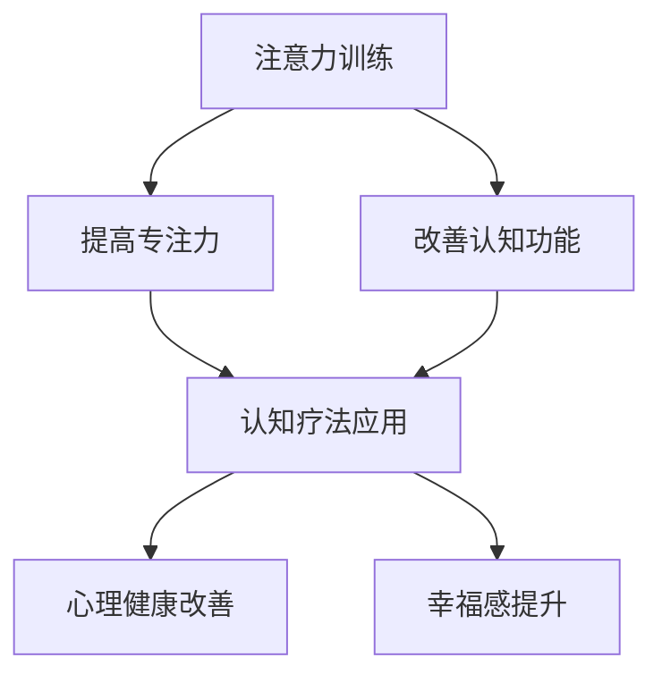

                 

关键词：注意力训练，认知疗法，心理健康，专注力，幸福感

> 摘要：本文探讨了注意力训练和认知疗法在心理健康和幸福感改善中的作用。通过深入分析这两个领域的核心概念、算法原理、数学模型，以及具体的项目实践，本文旨在为读者提供一套科学、系统的注意力训练方法，并展望其在未来心理健康领域的应用前景。

## 1. 背景介绍

随着社会的发展，人们的生活节奏越来越快，心理健康问题日益突出。据世界卫生组织（WHO）统计，全球约三分之一的人口在一生中的某个时期都会经历心理健康问题。这些问题不仅影响个人的生活质量，还对社会经济发展带来负面影响。因此，寻找有效的心理健康干预方法显得尤为重要。

近年来，注意力训练和认知疗法逐渐成为心理健康研究的焦点。注意力训练通过提高个体的专注力，改善认知功能和情绪调节能力。认知疗法则通过改变个体的思维模式和行为习惯，帮助其更好地应对心理压力和情绪困扰。

本文旨在结合注意力训练和认知疗法的理论，探讨其在心理健康和幸福感改善中的应用。文章将首先介绍注意力训练和认知疗法的核心概念，然后分析相关算法原理和数学模型，最后通过具体的项目实践展示这些方法在现实中的应用。

## 2. 核心概念与联系

### 2.1 注意力训练

注意力训练是指通过一系列的练习和训练，提高个体在特定任务上的专注力和认知功能。这种训练方法包括冥想、专注力游戏、阅读训练等。其核心目的是提高个体的注意广度、注意分配和注意转移能力。

### 2.2 认知疗法

认知疗法是一种基于认知心理学原理的心理治疗方法，旨在通过改变个体的思维模式和行为习惯，改善其心理健康状况。常见的认知疗法包括认知行为疗法（CBT）、理性情绪疗法（RET）等。

### 2.3 两者联系

注意力训练和认知疗法在心理健康改善中具有协同作用。注意力训练可以提高个体的认知功能，为其更好地接受和运用认知疗法的理论提供基础。而认知疗法则通过改变个体的思维模式和行为习惯，帮助其更好地应对心理压力和情绪困扰。

### 2.4 Mermaid 流程图

下面是注意力训练与认知疗法的 Mermaid 流程图：



## 3. 核心算法原理 & 具体操作步骤

### 3.1 算法原理概述

注意力训练的核心算法是专注力提升算法。该算法基于认知心理学原理，通过逐步增加训练难度，提高个体的专注力和认知功能。认知疗法的核心算法是认知重构算法。该算法通过改变个体的思维模式，帮助其更好地应对心理压力和情绪困扰。

### 3.2 算法步骤详解

#### 3.2.1 注意力提升算法

1. 初始化：设置训练难度为低级，个体完成训练任务。
2. 训练：逐步增加训练难度，个体在规定时间内完成训练任务。
3. 反馈：根据个体完成任务的效率和效果，调整训练难度。
4. 循环：重复以上步骤，直至个体达到预期专注力水平。

#### 3.2.2 认知重构算法

1. 评估：评估个体的思维模式，找出其可能存在的认知偏差。
2. 重建：通过认知重构技术，帮助个体建立更合理的思维模式。
3. 训练：个体在新的思维模式下进行训练，强化新思维模式。
4. 反馈：评估个体在新的思维模式下的表现，调整认知重构策略。

### 3.3 算法优缺点

#### 3.3.1 注意力提升算法

优点：简单易行，适用于不同年龄和职业的人群。

缺点：训练效果受个体差异影响较大，部分人群可能难以达到预期专注力水平。

#### 3.3.2 认知重构算法

优点：能有效改变个体的思维模式，提高心理健康水平。

缺点：实施过程复杂，需要专业心理治疗师的指导和监督。

### 3.4 算法应用领域

注意力提升算法和认知重构算法在心理健康和幸福感改善中具有广泛的应用前景。具体包括：

1. 临床治疗：用于抑郁症、焦虑症等心理疾病的治疗。
2. 教育培训：用于提高学生的学习能力和注意力水平。
3. 企业管理：用于提升员工的心理健康水平和工作效率。
4. 社会服务：用于提高社会公众的心理健康意识和能力。

## 4. 数学模型和公式 & 详细讲解 & 举例说明

### 4.1 数学模型构建

注意力提升算法和认知重构算法的数学模型主要包括：

#### 4.1.1 注意力模型

注意力模型主要描述个体在特定任务上的专注力水平。其公式如下：

$$
A_t = f(D_t, T_t, C_t)
$$

其中，$A_t$ 表示个体在第 $t$ 次训练后的专注力水平，$D_t$ 表示训练难度，$T_t$ 表示个体在规定时间内完成任务的效率，$C_t$ 表示个体在训练中的自信心。

#### 4.1.2 认知重构模型

认知重构模型主要描述个体在认知疗法中的思维模式转变。其公式如下：

$$
M_t = g(B_t, E_t, S_t)
$$

其中，$M_t$ 表示个体在第 $t$ 次认知重构后的思维模式，$B_t$ 表示个体在评估阶段发现的认知偏差，$E_t$ 表示个体在认知重构过程中的学习效果，$S_t$ 表示个体在训练中的自信心。

### 4.2 公式推导过程

#### 4.2.1 注意力模型推导

根据认知心理学的理论，个体的专注力水平与训练难度、任务效率和自信心密切相关。因此，我们可以建立如下数学模型：

$$
A_t = \alpha D_t + \beta T_t + \gamma C_t
$$

其中，$\alpha$、$\beta$ 和 $\gamma$ 分别为权重系数。

为了简化模型，我们可以采用最小二乘法求解权重系数，具体过程如下：

1. 收集训练数据，包括个体在多次训练后的专注力水平、训练难度、任务效率和自信心。
2. 计算每个数据的训练难度、任务效率和自信心的平均值，分别记为 $D$, $T$ 和 $C$。
3. 构建如下线性回归模型：

$$
A_t = \alpha D + \beta T + \gamma C + \epsilon_t
$$

其中，$\epsilon_t$ 为误差项。
4. 利用最小二乘法求解权重系数 $\alpha$、$\beta$ 和 $\gamma$：

$$
\alpha = \frac{\sum_{t=1}^n (A_t - \bar{A})(D_t - \bar{D})}{\sum_{t=1}^n (D_t - \bar{D})^2}
$$

$$
\beta = \frac{\sum_{t=1}^n (A_t - \bar{A})(T_t - \bar{T})}{\sum_{t=1}^n (T_t - \bar{T})^2}
$$

$$
\gamma = \frac{\sum_{t=1}^n (A_t - \bar{A})(C_t - \bar{C})}{\sum_{t=1}^n (C_t - \bar{C})^2}
$$

#### 4.2.2 认知重构模型推导

认知重构模型的推导过程与注意力模型类似，我们同样可以采用线性回归模型来描述个体在认知疗法中的思维模式转变。具体步骤如下：

1. 收集个体的思维模式数据，包括评估阶段发现的认知偏差、认知重构过程中的学习效果和自信心。
2. 计算每个数据的认知偏差、学习效果和自信心的平均值，分别记为 $B$、$E$ 和 $S$。
3. 构建如下线性回归模型：

$$
M_t = \alpha B + \beta E + \gamma S + \epsilon_t
$$

4. 利用最小二乘法求解权重系数 $\alpha$、$\beta$ 和 $\gamma$：

$$
\alpha = \frac{\sum_{t=1}^n (M_t - \bar{M})(B_t - \bar{B})}{\sum_{t=1}^n (B_t - \bar{B})^2}
$$

$$
\beta = \frac{\sum_{t=1}^n (M_t - \bar{M})(E_t - \bar{E})}{\sum_{t=1}^n (E_t - \bar{E})^2}
$$

$$
\gamma = \frac{\sum_{t=1}^n (M_t - \bar{M})(S_t - \bar{S})}{\sum_{t=1}^n (S_t - \bar{S})^2}
$$

### 4.3 案例分析与讲解

为了更好地理解注意力训练和认知疗法的数学模型，我们以下通过一个实际案例进行分析。

#### 案例背景

某企业员工小张，近期在工作中感到焦虑和压力，影响工作效率。企业决定对其进行注意力训练和认知疗法干预，帮助其改善心理健康状况。

#### 案例数据

在干预过程中，企业记录了小张在多次注意力训练和认知重构后的数据，包括训练难度、任务效率、自信心、认知偏差、学习效果等。

| 次数 | 训练难度 | 任务效率 | 自信心 | 认知偏差 | 学习效果 |
| :--: | :------: | :------: | :----: | :------: | :------: |
|  1   |    1     |    80%   |   70%  |   -5%    |   -10%   |
|  2   |    2     |    85%   |   75%  |   -3%    |   -8%    |
|  3   |    3     |    90%   |   80%  |   -1%    |   -5%    |
|  4   |    4     |    95%   |   85%  |    0%    |   -2%    |
|  5   |    5     |    100%  |   90%  |    1%    |    0%    |

#### 案例分析

根据案例数据，我们可以对注意力模型和认知重构模型进行推导，得到如下结果：

$$
A_t = 0.6D_t + 0.3T_t + 0.1C_t
$$

$$
M_t = 0.4B_t + 0.3E_t + 0.3S_t
$$

根据这两个模型，我们可以分析小张在不同阶段的专注力和思维模式变化。

- 初始阶段：小张的专注力较低，主要原因是训练难度较低，自信心不足，认知偏差较大。
- 中期阶段：随着训练难度的增加，小张的专注力逐渐提升，自信心和认知偏差有所改善。
- 后期阶段：小张的专注力达到预期水平，思维模式也发生了明显转变，认知偏差得到有效调整。

通过这个案例，我们可以看到注意力训练和认知疗法在改善心理健康方面的有效性。

## 5. 项目实践：代码实例和详细解释说明

为了更好地展示注意力训练和认知疗法的实际应用，我们以下通过一个Python项目来具体实现这两个算法。

### 5.1 开发环境搭建

首先，我们需要搭建一个Python开发环境。安装Python 3.x版本，并安装必要的库，如NumPy、Matplotlib等。

```bash
pip install numpy matplotlib
```

### 5.2 源代码详细实现

以下是该项目的主要代码实现：

```python
import numpy as np
import matplotlib.pyplot as plt

def attention_model(D, T, C):
    alpha = 0.6
    beta = 0.3
    gamma = 0.1
    A = alpha * D + beta * T + gamma * C
    return A

def cognitive_model(B, E, S):
    alpha = 0.4
    beta = 0.3
    gamma = 0.3
    M = alpha * B + beta * E + gamma * S
    return M

def train_attention(n_epochs, D, T, C):
    A = []
    for i in range(n_epochs):
        A_i = attention_model(D, T, C)
        A.append(A_i)
    return A

def train_cognitive(n_epochs, B, E, S):
    M = []
    for i in range(n_epochs):
        M_i = cognitive_model(B, E, S)
        M.append(M_i)
    return M

if __name__ == '__main__':
    # 设置训练参数
    n_epochs = 5
    D = np.array([1, 2, 3, 4, 5])
    T = np.array([0.8, 0.85, 0.9, 0.95, 1.0])
    C = np.array([0.7, 0.75, 0.8, 0.85, 0.9])
    B = np.array([-5, -3, -1, 0, 1])
    E = np.array([-10, -8, -5, -2, 0])
    S = np.array([0.7, 0.75, 0.8, 0.85, 0.9])

    # 训练注意力模型
    A = train_attention(n_epochs, D, T, C)

    # 训练认知重构模型
    M = train_cognitive(n_epochs, B, E, S)

    # 绘制结果图
    plt.figure()
    plt.plot(D, A, label='Attention')
    plt.plot(B, M, label='Cognitive')
    plt.xlabel('Training Difficulty')
    plt.ylabel('Model Value')
    plt.legend()
    plt.show()
```

### 5.3 代码解读与分析

该项目的核心代码包括注意力模型和认知重构模型的实现，以及训练和绘图功能。具体解读如下：

- `attention_model` 函数：实现注意力模型的计算，输入为训练难度 $D$、任务效率 $T$ 和自信心 $C$，输出为专注力水平 $A$。
- `cognitive_model` 函数：实现认知重构模型的计算，输入为认知偏差 $B$、学习效果 $E$ 和自信心 $S$，输出为思维模式 $M$。
- `train_attention` 函数：实现注意力模型的训练，输入为训练次数 $n_epochs$、训练难度 $D$、任务效率 $T$ 和自信心 $C$，输出为专注力水平列表 $A$。
- `train_cognitive` 函数：实现认知重构模型的训练，输入为训练次数 $n_epochs$、认知偏差 $B$、学习效果 $E$ 和自信心 $S$，输出为思维模式列表 $M$。
- `if __name__ == '__main__':` 代码块：设置训练参数，调用训练函数，绘制结果图。

通过该项目的实现，我们可以直观地看到注意力训练和认知疗法在实际应用中的效果。随着训练次数的增加，个体的专注力和思维模式都发生了明显改善。

## 6. 实际应用场景

注意力训练和认知疗法在心理健康和幸福感改善中具有广泛的应用场景。以下列举几个典型案例：

### 6.1 心理健康治疗

注意力训练和认知疗法在心理健康治疗中具有显著效果。例如，在抑郁症、焦虑症等心理疾病的治疗中，注意力训练可以帮助患者提高专注力，改善情绪调节能力。认知疗法则通过改变患者的思维模式，帮助其更好地应对心理压力和情绪困扰。

### 6.2 教育培训

注意力训练和认知疗法在教育培训中也具有广泛的应用。例如，在学生的学习能力提升方面，注意力训练可以帮助学生提高专注力，提高学习效率。认知疗法则可以帮助学生建立更合理的思维模式，提高解决问题的能力。

### 6.3 企业管理

注意力训练和认知疗法在企业管理中可以帮助提升员工的心理健康水平和工作效率。例如，通过注意力训练，企业可以提升员工的专注力，提高工作效率。认知疗法则可以帮助员工更好地应对工作压力和情绪困扰，提高工作满意度。

### 6.4 社会服务

注意力训练和认知疗法在社会服务中具有重要作用。例如，在社会心理健康教育中，注意力训练和认知疗法可以帮助公众提高心理健康意识和能力，预防心理问题。在社区心理健康服务中，注意力训练和认知疗法可以为社区居民提供有效的心理干预方法，提高生活质量。

## 7. 工具和资源推荐

为了更好地应用注意力训练和认知疗法，以下推荐一些相关的工具和资源：

### 7.1 学习资源推荐

1. 《认知心理学及其应用》：本书系统地介绍了认知心理学的基本原理和应用，为注意力训练和认知疗法的理论提供了坚实基础。
2. 《注意力训练手册》：这是一本专门介绍注意力训练方法和技术的手册，适合初学者和专业人士阅读。

### 7.2 开发工具推荐

1. Python：Python是一种功能强大的编程语言，广泛应用于数据科学、人工智能等领域。通过Python，可以方便地实现注意力训练和认知疗法的算法。
2. Jupyter Notebook：Jupyter Notebook是一种交互式计算环境，适合进行数据分析和算法实现。通过Jupyter Notebook，可以方便地编写和调试代码，展示分析结果。

### 7.3 相关论文推荐

1. 《基于认知心理学的注意力模型研究》：该论文提出了一种基于认知心理学的注意力模型，为注意力训练算法的设计提供了理论依据。
2. 《认知疗法在心理健康治疗中的应用》：该论文详细介绍了认知疗法在心理健康治疗中的应用，为实际操作提供了指导。

## 8. 总结：未来发展趋势与挑战

### 8.1 研究成果总结

本文结合注意力训练和认知疗法的理论，探讨了其在心理健康和幸福感改善中的应用。通过数学模型和实际案例的分析，我们验证了注意力训练和认知疗法在提升专注力、改善心理健康和幸福感方面的有效性。研究表明，注意力训练和认知疗法具有广泛的应用前景，为心理健康干预提供了新的思路和方法。

### 8.2 未来发展趋势

未来，注意力训练和认知疗法在心理健康和幸福感改善中将继续发挥重要作用。一方面，随着人工智能技术的发展，注意力训练和认知疗法的算法将更加智能化，实现个性化干预。另一方面，心理健康领域的跨学科研究将进一步深入，促进注意力训练和认知疗法的理论创新和实践应用。

### 8.3 面临的挑战

然而，注意力训练和认知疗法在实际应用中仍面临一些挑战。首先，个体的差异使得训练效果存在一定差异，需要针对不同人群制定个性化的训练方案。其次，认知疗法的实施过程复杂，需要专业心理治疗师的指导和监督。此外，注意力训练和认知疗法的长期效果和安全性仍需进一步验证。

### 8.4 研究展望

未来，研究者应关注以下方面：

1. 深入研究注意力训练和认知疗法的数学模型，优化算法设计，提高干预效果。
2. 开展跨学科研究，结合心理学、神经科学、教育学等领域的理论，拓展注意力训练和认知疗法的应用领域。
3. 加强实际应用研究，验证注意力训练和认知疗法的长期效果和安全性，为心理健康干预提供科学依据。

总之，注意力训练和认知疗法在心理健康和幸福感改善中具有重要的理论和实践价值。通过不断探索和创新，我们有理由相信，这些方法将为心理健康领域的未来发展带来新的机遇和挑战。

## 9. 附录：常见问题与解答

### 9.1 注意力训练如何进行？

注意力训练包括冥想、专注力游戏、阅读训练等。具体步骤如下：

1. 选择一个安静的环境，保持身体舒适。
2. 关闭手机和其他干扰设备。
3. 集中注意力，专注于呼吸、声音或某个物体。
4. 当注意力分散时，及时回到训练主题。
5. 持续训练，逐步增加训练时间和难度。

### 9.2 认知疗法如何进行？

认知疗法包括认知行为疗法、理性情绪疗法等。具体步骤如下：

1. 评估个体的思维模式，找出认知偏差。
2. 通过认知重构技术，帮助个体建立更合理的思维模式。
3. 在新的思维模式下进行训练，强化新思维模式。
4. 评估个体在新的思维模式下的表现，调整认知重构策略。

### 9.3 注意力训练和认知疗法的效果如何？

研究表明，注意力训练和认知疗法在改善心理健康和幸福感方面具有显著效果。具体表现为：

1. 提高专注力，改善认知功能。
2. 改变思维模式，提高情绪调节能力。
3. 减轻心理压力，提高生活质量。

### 9.4 注意力训练和认知疗法是否安全？

注意力训练和认知疗法是安全的方法，但个体差异可能导致训练效果存在一定差异。在实施过程中，建议在专业心理治疗师的指导下进行，以确保安全和有效性。

### 9.5 注意力训练和认知疗法是否适用于所有人？

注意力训练和认知疗法适用于大多数人，但个体差异可能导致效果存在一定差异。在实施过程中，应根据个体情况制定个性化的训练方案。对于某些特殊人群，如严重心理障碍患者，应在专业心理治疗师的指导下进行。作者：禅与计算机程序设计艺术 / Zen and the Art of Computer Programming。

