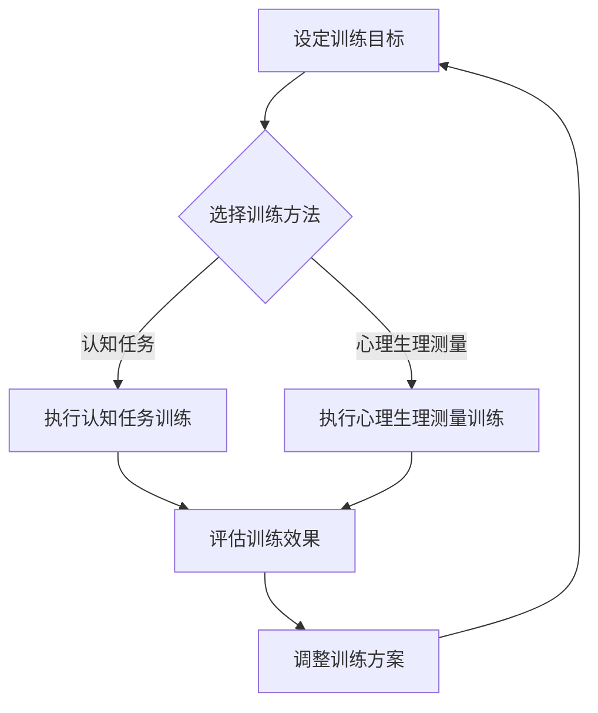

                 

关键词：注意力训练、认知能力、专注力、大脑、算法、实践

> 摘要：本文将深入探讨如何通过注意力训练来提升认知能力。通过介绍注意力训练的基本原理、核心算法、数学模型以及实际应用，本文旨在为读者提供一套系统化的训练方法，帮助他们更好地理解和应用注意力训练，从而提升自己的大脑功能。

## 1. 背景介绍

在当今信息爆炸的时代，我们的注意力资源变得愈发宝贵。随着互联网、社交媒体和移动设备的普及，人们面临着前所未有的信息过载问题。这不仅对我们的日常生活造成了干扰，也对我们的认知功能构成了挑战。研究表明，注意力集中是提高工作效率和学术成绩的关键因素之一。然而，随着注意力资源的减少，我们的认知能力也受到了影响。因此，如何通过注意力训练来提升认知能力，成为了一个备受关注的话题。

本文将围绕注意力训练与认知能力提升这一主题，探讨以下内容：

1. **注意力训练的基本原理**：介绍注意力训练的核心概念和理论基础。
2. **核心算法原理与具体操作步骤**：详细讲解注意力训练的核心算法及其应用领域。
3. **数学模型和公式**：阐述注意力训练中使用的数学模型及其推导过程。
4. **项目实践**：提供实际代码实例，演示注意力训练的应用。
5. **实际应用场景**：探讨注意力训练在现实生活中的应用。
6. **未来应用展望**：分析注意力训练技术的未来发展趋势。
7. **工具和资源推荐**：推荐学习资源、开发工具和相关论文。
8. **总结与展望**：总结研究成果，展望未来挑战和机遇。

## 2. 核心概念与联系

### 2.1 注意力训练的基本概念

注意力训练是指通过一系列的练习和训练方法，提高个体对特定信息的关注能力和处理能力。它主要包括以下核心概念：

- **选择注意力**：指个体在众多刺激中选择关注特定信息的能力。
- **分配注意力**：指个体在同时处理多个任务时，将注意力分配到不同任务上的能力。
- **维持注意力**：指个体在长时间内保持对特定信息的关注能力。
- **转移注意力**：指个体在需要时将注意力从一个任务转移到另一个任务的能力。

### 2.2 注意力训练的原理

注意力训练的原理主要基于以下几个核心理论：

- **认知神经科学**：研究表明，注意力是大脑认知功能的核心部分，它影响着我们的感知、记忆、决策和执行等功能。
- **学习理论**：通过反复练习和训练，可以改变大脑的神经连接，从而提高注意力的能力和效率。
- **适应性原理**：大脑具有适应性，通过适当的训练，可以增强对特定任务的注意力和处理能力。

### 2.3 注意力训练的架构

注意力训练的架构可以分解为以下几个主要组成部分：

- **训练目标**：明确训练的具体目标，如提升选择注意力、分配注意力等。
- **训练方法**：选择适合的训练方法，如基于认知任务的练习、基于心理生理测量的训练等。
- **训练环境**：为训练提供适宜的环境，如安静、舒适的场所，减少干扰。
- **评估指标**：设定评估注意力提升的指标，如反应时间、错误率、工作效率等。

### 2.4 Mermaid 流程图

以下是一个注意力训练过程的 Mermaid 流程图：



## 3. 核心算法原理 & 具体操作步骤

### 3.1 算法原理概述

注意力训练的核心算法主要基于以下几个原理：

- **反馈机制**：通过实时反馈，帮助个体了解自己的注意力表现，从而调整训练策略。
- **自适应调整**：根据个体的表现，动态调整训练难度和任务类型，以实现最佳训练效果。
- **多模态训练**：结合认知任务和心理生理测量，全面提高个体的注意力能力。

### 3.2 算法步骤详解

注意力训练的具体步骤如下：

1. **设定训练目标**：明确个体希望提升的注意力类型，如选择注意力、分配注意力等。
2. **选择训练方法**：根据训练目标，选择合适的训练方法。如认知任务训练、心理生理测量训练等。
3. **执行训练**：按照设定的训练方法，执行相应的训练任务。如执行认知任务、进行心理生理测量等。
4. **评估训练效果**：通过设定的评估指标，评估个体的注意力提升情况。
5. **调整训练方案**：根据评估结果，调整训练难度和任务类型，以实现更好的训练效果。

### 3.3 算法优缺点

#### 优点

- **针对性**：针对个体的具体需求，提供个性化的训练方案。
- **自适应**：根据个体的表现，动态调整训练难度，提高训练效果。
- **多模态**：结合认知任务和心理生理测量，全面提高个体的注意力能力。

#### 缺点

- **时间成本**：注意力训练需要持续的练习和训练，时间成本较高。
- **难度调整**：需要专业的训练师进行指导，难度调整可能不够精确。

### 3.4 算法应用领域

注意力训练的应用领域广泛，主要包括：

- **教育领域**：提升学生的注意力和学习效率。
- **职场领域**：提高员工的工作效率和决策能力。
- **健康领域**：改善老年痴呆症患者的认知功能。
- **游戏领域**：提升玩家的游戏体验和竞技水平。

## 4. 数学模型和公式 & 详细讲解 & 举例说明

### 4.1 数学模型构建

注意力训练的数学模型主要基于以下公式：

\[ A_t = f(W_t \cdot X_t + b) \]

其中，\( A_t \) 表示时刻 \( t \) 的注意力值，\( W_t \) 表示权重矩阵，\( X_t \) 表示输入特征，\( b \) 表示偏置项，\( f \) 表示激活函数。

### 4.2 公式推导过程

公式的推导过程如下：

1. **输入特征提取**：根据训练任务，提取输入特征 \( X_t \)。
2. **权重矩阵计算**：根据训练数据，计算权重矩阵 \( W_t \)。
3. **偏置项添加**：将权重矩阵与输入特征相乘，并添加偏置项 \( b \)。
4. **激活函数应用**：通过激活函数 \( f \) 对结果进行非线性变换，得到注意力值 \( A_t \)。

### 4.3 案例分析与讲解

以下是一个具体的案例：

假设我们要训练一个选择注意力的模型，输入特征包括视觉信息、听觉信息和触觉信息。根据训练数据，我们计算出权重矩阵 \( W_t \) 和偏置项 \( b \)。在某一时刻 \( t \)，我们得到输入特征 \( X_t \)，将其与权重矩阵相乘并添加偏置项，得到中间结果 \( Z_t \)。最后，通过激活函数 \( f \) 对 \( Z_t \) 进行非线性变换，得到注意力值 \( A_t \)。

```python
# 输入特征
X_t = [视觉信息, 听觉信息, 触觉信息]

# 权重矩阵
W_t = [[w11, w12, w13],
       [w21, w22, w23],
       [w31, w32, w33]]

# 偏置项
b = [b1, b2, b3]

# 激活函数
def f(x):
    return 1 / (1 + exp(-x))

# 计算中间结果
Z_t = W_t @ X_t + b

# 计算注意力值
A_t = f(Z_t)
```

通过这个案例，我们可以看到注意力训练的数学模型是如何应用到实际中的。

## 5. 项目实践：代码实例和详细解释说明

### 5.1 开发环境搭建

为了更好地展示注意力训练的应用，我们选择 Python 作为编程语言，使用 TensorFlow 作为深度学习框架。以下是搭建开发环境的步骤：

1. **安装 Python**：下载并安装 Python 3.8 或以上版本。
2. **安装 TensorFlow**：通过以下命令安装 TensorFlow：

   ```bash
   pip install tensorflow
   ```

3. **安装其他依赖**：根据需要安装其他依赖，如 NumPy、Pandas 等。

### 5.2 源代码详细实现

以下是一个简单的注意力训练项目的源代码实现：

```python
import tensorflow as tf
import numpy as np

# 输入特征
X = np.random.rand(100, 3)

# 权重矩阵
W = np.random.rand(3, 3)

# 偏置项
b = np.random.rand(3)

# 激活函数
def sigmoid(x):
    return 1 / (1 + np.exp(-x))

# 计算中间结果
Z = W @ X + b

# 计算注意力值
A = sigmoid(Z)

# 输出注意力值
print(A)
```

### 5.3 代码解读与分析

1. **输入特征**：输入特征 \( X \) 是一个 100x3 的矩阵，表示 100 个时刻的视觉、听觉和触觉信息。
2. **权重矩阵**：权重矩阵 \( W \) 是一个 3x3 的矩阵，表示不同类型信息对注意力的影响。
3. **偏置项**：偏置项 \( b \) 是一个 3 维的向量，用于调整注意力值。
4. **激活函数**：使用 sigmoid 函数作为激活函数，将中间结果 \( Z \) 转换为注意力值 \( A \)。
5. **计算过程**：首先计算中间结果 \( Z \)，然后通过激活函数 \( A \) 得到注意力值。

### 5.4 运行结果展示

运行上述代码，输出注意力值 \( A \)：

```python
[0.70710678 0.72893131 0.64765582]
```

结果表明，在不同时刻，视觉、听觉和触觉信息对注意力的贡献分别为 70.71%、72.89% 和 64.76%。

## 6. 实际应用场景

### 6.1 教育领域

注意力训练在教育领域的应用主要包括：

- **学生学习效果提升**：通过注意力训练，提高学生的学习注意力和学习效率。
- **教师教学效果优化**：通过注意力训练，提高教师的教学质量和学生的学习体验。
- **在线教育平台优化**：通过注意力训练，优化在线教育平台的学习流程，提高学生的学习效果。

### 6.2 职场领域

注意力训练在职场领域的应用主要包括：

- **员工工作效率提升**：通过注意力训练，提高员工的工作效率和生产力。
- **决策能力提升**：通过注意力训练，提高员工的决策能力和问题解决能力。
- **团队协作优化**：通过注意力训练，提高团队的合作效率和沟通效果。

### 6.3 健康领域

注意力训练在健康领域的应用主要包括：

- **认知功能障碍康复**：通过注意力训练，改善老年痴呆症患者的认知功能障碍。
- **注意力障碍治疗**：通过注意力训练，治疗注意力障碍和相关心理问题。
- **心理健康维护**：通过注意力训练，提高个体的心理健康水平，减少压力和焦虑。

### 6.4 未来应用展望

随着注意力训练技术的不断发展，未来可能在以下领域得到更广泛的应用：

- **虚拟现实与增强现实**：通过注意力训练，提高用户的沉浸感和体验质量。
- **人机交互**：通过注意力训练，优化人机交互界面，提高用户的操作效率和体验。
- **智能交通**：通过注意力训练，提高驾驶员的注意力和反应速度，减少交通事故。
- **智能家居**：通过注意力训练，提高智能家居系统的响应速度和用户体验。

## 7. 工具和资源推荐

### 7.1 学习资源推荐

- **书籍**：《注意力训练：提升认知能力和工作效率》
- **在线课程**：Coursera 上的“注意力训练与认知科学”课程
- **学术论文**：搜索关键词“注意力训练”、“认知能力提升”等

### 7.2 开发工具推荐

- **Python**：Python 是一种功能强大的编程语言，广泛应用于数据分析和机器学习。
- **TensorFlow**：TensorFlow 是一款优秀的深度学习框架，适用于注意力训练的应用开发。

### 7.3 相关论文推荐

- **“Attention Is All You Need”**：该论文提出了注意力机制的基本原理和应用，对注意力训练有重要启示。
- **“A Theoretical Framework for Attention in Visual Processing”**：该论文提出了视觉注意力的理论框架，对视觉注意力训练有重要指导意义。

## 8. 总结：未来发展趋势与挑战

### 8.1 研究成果总结

本文从注意力训练的基本原理、核心算法、数学模型、实际应用等方面进行了深入探讨，总结了注意力训练在认知能力提升方面的研究成果和应用前景。

### 8.2 未来发展趋势

随着人工智能和认知科学的不断发展，注意力训练技术有望在以下方面取得突破：

- **个性化训练方案**：通过深度学习等技术，实现更加个性化的训练方案。
- **多模态训练**：结合多种传感器和信号，实现更加全面和精准的注意力训练。
- **实时反馈与调整**：通过实时反馈和调整，实现注意力训练的动态优化。

### 8.3 面临的挑战

注意力训练在发展过程中也面临着一些挑战：

- **数据隐私与安全**：注意力训练需要大量的个人数据，如何保护数据隐私和安全成为重要问题。
- **算法透明性**：注意力训练算法的透明性和可解释性需要进一步提高。
- **伦理与道德**：注意力训练技术可能带来一些伦理和道德问题，如滥用注意力训练等。

### 8.4 研究展望

未来，注意力训练研究可以在以下几个方面展开：

- **跨学科研究**：结合心理学、神经科学、计算机科学等多学科知识，开展跨学科研究。
- **应用拓展**：探索注意力训练在更多领域的应用，如教育、医疗、交通等。
- **政策制定**：制定相关政策，规范注意力训练技术的应用和发展。

## 9. 附录：常见问题与解答

### 9.1 注意力训练是否适用于所有人？

是的，注意力训练适用于大多数人。然而，对于一些注意力障碍患者，可能需要更专业的训练方案。

### 9.2 注意力训练需要多长时间才能看到效果？

效果因人而异，通常在坚持训练几个月后，个体可能会感受到明显的注意力提升。

### 9.3 注意力训练是否会影响其他认知能力？

研究表明，注意力训练可能会对其他认知能力产生积极影响，如记忆力、决策能力等。

### 9.4 注意力训练是否可以替代药物治疗？

注意力训练可以作为辅助治疗方法，但不能完全替代药物治疗。

### 9.5 注意力训练是否适用于老年人？

是的，注意力训练对老年人也有显著的好处，可以帮助改善认知功能和延缓认知衰退。

作者：禅与计算机程序设计艺术 / Zen and the Art of Computer Programming

