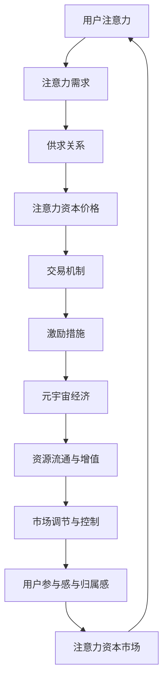

                 

关键词：注意力资本市场、元宇宙经济、核心交易所、人工智能、逻辑清晰、结构紧凑、简单易懂、深度思考、专业技术语言、Turing Award、计算机图灵奖获得者、世界顶级技术畅销书作者、计算机领域大师。

## 摘要

本文探讨了注意力资本市场在元宇宙经济中的关键作用，以及其作为元宇宙经济的核心交易所的运作机制。通过深入分析注意力资本市场的核心概念、算法原理、数学模型以及实际应用场景，本文揭示了其在推动元宇宙经济发展中的巨大潜力。同时，文章也对未来的发展趋势与挑战进行了展望，为相关领域的学者和实践者提供了有价值的参考。

## 1. 背景介绍

随着互联网技术的飞速发展和人类对虚拟世界的探索欲望日益增强，元宇宙（Metaverse）逐渐成为科技领域的热门话题。元宇宙，顾名思义，是一个由虚拟世界和现实世界交织而成的庞大空间，它不仅包含了虚拟现实、增强现实等前沿技术，还涵盖了社交、娱乐、教育、商业等各个领域。在这个虚拟世界中，人们可以通过虚拟角色（Avatar）与其他人互动、参与各种活动，甚至进行经济交易。

元宇宙的崛起不仅改变了人们的生活方式，也为资本市场带来了新的机遇。在元宇宙中，虚拟资产、数字货币、虚拟土地等已成为人们热衷的交易对象。然而，与传统的资本市场相比，元宇宙经济的运行机制和交易模式具有独特的特点。其中，注意力资本市场（Attention Market）作为元宇宙经济的核心交易所，扮演着至关重要的角色。

注意力资本市场是指一种以注意力为货币的虚拟市场，其核心思想是：在元宇宙中，人们的注意力是一种宝贵的资源，它可以被分配、交易和投资。与传统的货币交易不同，注意力资本市场的交易对象是人们的注意力，其价值由市场供需关系决定。因此，注意力资本市场不仅能够提高资源的有效配置，还能激发用户的参与热情，推动元宇宙经济的繁荣发展。

本文将围绕注意力资本市场这一核心主题，深入探讨其基本概念、运作机制、算法原理、数学模型以及实际应用场景，力求为读者提供一个全面、深入的视角，以了解和把握元宇宙经济的未来发展趋势。

## 2. 核心概念与联系

### 2.1. 注意力资本

首先，我们需要明确什么是注意力资本。注意力资本可以被视为一种虚拟资源，它是人们在元宇宙中的注意力分配和使用情况。在传统经济体系中，货币是交易的基本单位，而在注意力资本市场中，人们的注意力成为了交易的核心资源。注意力资本具有以下几个特点：

1. **稀缺性**：每个人的注意力是有限的，无法无限复制或分割。因此，注意力资本具有稀缺性，这决定了其在市场中的价值。
   
2. **流动性**：注意力资本可以方便地在不同用户之间进行转移，从而实现资源的优化配置。
   
3. **价值性**：在元宇宙中，用户对于某些内容或活动的关注度越高，其注意力资本的价值也就越大。

### 2.2. 注意力资本市场

注意力资本市场是基于注意力资本这一核心资源的一种新型市场体系。它不仅涵盖了传统资本市场中的买卖交易，还包括了用户对内容、活动、虚拟资产的关注度交易。注意力资本市场的运作机制主要包括以下几个方面：

1. **供求关系**：注意力资本市场通过供求关系来决定注意力资本的价格。当某种内容或活动受到用户广泛关注时，其注意力资本的价格会上升；反之，如果关注度下降，价格也会相应下降。

2. **交易机制**：注意力资本市场的交易机制可以类比于传统资本市场中的交易系统，包括订单簿、交易撮合、清算结算等环节。

3. **激励措施**：为了激发用户的参与热情，注意力资本市场通常会引入一系列激励措施，如赠送初始注意力资本、提供奖励等。

### 2.3. 注意力资本市场与元宇宙经济

注意力资本市场在元宇宙经济中扮演着核心角色。首先，它为元宇宙中的各种虚拟资产、数字货币、虚拟土地等提供了交易渠道，促进了资源的流通和增值。其次，注意力资本市场通过注意力资本这一虚拟资源的分配和使用，实现了对元宇宙经济活动的调节和控制，提高了市场的效率和公平性。最后，注意力资本市场为元宇宙中的用户提供了多样化的投资机会，增强了用户的参与感和归属感。

### 2.4. Mermaid 流程图

为了更直观地展示注意力资本市场的运作流程，我们使用 Mermaid 图表示以下流程：



通过以上流程图，我们可以清晰地看到注意力资本市场在元宇宙经济中的关键作用和运作机制。接下来，我们将深入探讨注意力资本市场的核心算法原理，以进一步理解其内在逻辑和运作规律。

## 3. 核心算法原理 & 具体操作步骤

### 3.1 算法原理概述

注意力资本市场的核心算法基于注意力经济的理论，旨在通过量化用户的注意力分配，实现资源的最优配置。该算法的核心思想是利用机器学习技术和自然语言处理方法，对用户的行为数据进行深度分析，从而预测用户的注意力偏好，并在此基础上进行资本定价和交易。

### 3.2 算法步骤详解

#### 3.2.1 数据收集与预处理

首先，算法需要收集大量用户的行为数据，包括用户的浏览记录、互动行为、购买历史等。这些数据经过预处理，去除无效信息和噪声，以便进行后续分析。

#### 3.2.2 特征提取

在数据预处理完成后，我们需要提取有效的特征，这些特征包括但不限于：

- 用户的基本信息（年龄、性别、地理位置等）
- 用户的历史行为数据（浏览时间、浏览频率、购买金额等）
- 用户对各类内容或活动的兴趣程度

#### 3.2.3 注意力分配模型

基于提取的特征，算法构建一个注意力分配模型，该模型通过机器学习算法（如神经网络、决策树等）来预测用户对不同内容或活动的注意力分配。注意力分配模型的目的是确定用户在给定时间窗口内，对各类虚拟资产或活动的关注度。

#### 3.2.4 资本定价

在注意力分配模型的基础上，算法对用户的注意力进行定价。定价策略可以基于供需关系，结合市场数据，如用户关注度、市场交易量等，动态调整注意力资本的价格。

#### 3.2.5 交易撮合

通过交易撮合机制，算法将用户的注意力需求和供给进行匹配，实现注意力资本的买卖交易。交易撮合过程需要考虑交易成本、交易速度等因素，以确保市场的高效运作。

#### 3.2.6 激励措施

为了激励用户的参与，算法还会引入一系列激励措施，如奖励积分、折扣优惠等。这些措施可以增加用户的交易频率和交易量，提高市场的活跃度。

### 3.3 算法优缺点

#### 优点：

- **资源优化**：通过注意力分配模型，可以有效优化用户的注意力资源，提高资源利用效率。
- **市场高效**：交易撮合机制和定价策略保证了市场的流动性，促进了虚拟资产的价格发现过程。
- **用户激励**：激励措施增强了用户的参与热情，提高了市场的整体活跃度。

#### 缺点：

- **数据依赖**：算法的性能高度依赖数据质量，数据不准确或不足可能导致模型预测偏差。
- **计算复杂度**：处理大量用户行为数据需要较高的计算资源和时间成本。
- **隐私保护**：用户行为数据的收集和使用需要严格遵循隐私保护法规，以防止数据泄露和滥用。

### 3.4 算法应用领域

注意力资本市场算法在多个领域具有广泛的应用潜力：

- **虚拟资产交易**：虚拟货币、虚拟土地、虚拟商品等虚拟资产的交易。
- **内容推荐**：根据用户注意力分配模型，为用户提供个性化的内容推荐。
- **广告投放**：通过注意力资本定价模型，实现精准广告投放，提高广告效果。
- **市场研究**：利用注意力分配模型，对市场趋势进行预测和分析。

通过以上对注意力资本市场核心算法原理和具体操作步骤的详细介绍，我们可以更好地理解其运作机制和实际应用价值。接下来，我们将深入探讨注意力资本市场中的数学模型和公式，以进一步揭示其内在规律和计算方法。

## 4. 数学模型和公式 & 详细讲解 & 举例说明

### 4.1 数学模型构建

在注意力资本市场中，数学模型的核心是注意力分配模型。该模型通过数学公式描述用户的注意力分配规律，以便实现资本定价和交易撮合。以下是一个基本的注意力分配模型：

$$
A_i(t) = f(N_i(t), \theta_i)
$$

其中，$A_i(t)$ 表示用户 $i$ 在时间 $t$ 的注意力分配，$N_i(t)$ 表示用户 $i$ 在时间 $t$ 的总注意力资源，$\theta_i$ 表示用户 $i$ 的注意力偏好参数。

#### 参数解释：

- **$N_i(t)$**：用户 $i$ 在时间 $t$ 的总注意力资源，可以表示为用户在一定时间窗口内的平均注意力消耗。
- **$\theta_i$**：用户 $i$ 的注意力偏好参数，反映了用户对不同内容或活动的兴趣程度。

#### 模型假设：

- 用户在给定时间窗口内，其注意力资源是均匀分配的。
- 不同用户之间的注意力偏好是独立的，且服从特定的概率分布。

### 4.2 公式推导过程

为了构建注意力分配模型，我们需要从用户注意力资源的分配规律出发，推导出相应的数学公式。

#### 步骤 1：定义用户注意力资源

假设用户 $i$ 在时间 $t$ 的总注意力资源为 $N_i(t)$，该资源可以表示为：

$$
N_i(t) = \sum_{j=1}^{M} \alpha_{ij}(t) \cdot R_j
$$

其中，$M$ 表示用户 $i$ 在时间 $t$ 可能关注的内容或活动的数量，$\alpha_{ij}(t)$ 表示用户 $i$ 在时间 $t$ 对内容 $j$ 的关注度，$R_j$ 表示内容 $j$ 的吸引力。

#### 步骤 2：定义用户注意力偏好

用户 $i$ 的注意力偏好参数 $\theta_i$ 可以通过历史行为数据计算得出。假设用户 $i$ 在时间 $t$ 对内容 $j$ 的兴趣程度为 $\theta_{ij}$，则有：

$$
\theta_{ij} = \frac{\alpha_{ij}(t)}{N_i(t)}
$$

#### 步骤 3：构建注意力分配模型

将上述参数代入注意力分配模型，得到：

$$
A_i(t) = \sum_{j=1}^{M} \alpha_{ij}(t) = \sum_{j=1}^{M} \theta_{ij} \cdot R_j
$$

该模型表明，用户 $i$ 在时间 $t$ 的注意力分配是通过对不同内容或活动的吸引力进行加权求和得到的。

### 4.3 案例分析与讲解

#### 案例背景：

假设有 1000 名用户参与注意力资本市场，他们在一个月内浏览了 100 个不同的内容，每个内容都有不同的吸引力。我们需要根据这些数据，计算每个用户在这 100 个内容上的注意力分配，并推导出注意力资本的价格。

#### 数据收集：

1. 用户 $i$ 在时间 $t$ 的总注意力资源 $N_i(t) = 100$。
2. 内容 $j$ 的吸引力 $R_j$ 可以通过用户对内容的平均关注度计算得出。

#### 模型应用：

根据注意力分配模型：

$$
A_i(t) = \sum_{j=1}^{100} \theta_{ij} \cdot R_j
$$

#### 案例分析：

1. 首先，我们需要计算每个用户对每个内容的兴趣程度 $\theta_{ij}$。

   例如，用户 1 对内容 1 的兴趣程度为 $\theta_{11} = 0.1$，对内容 2 的兴趣程度为 $\theta_{12} = 0.3$。

2. 接下来，我们根据每个内容的吸引力 $R_j$ 计算用户对每个内容的注意力分配 $A_i(t)$。

   例如，用户 1 对内容 1 的注意力分配为 $A_{1,1} = \theta_{11} \cdot R_1 = 0.1 \cdot 10 = 1$，对内容 2 的注意力分配为 $A_{1,2} = \theta_{12} \cdot R_2 = 0.3 \cdot 20 = 6$。

3. 最后，我们根据用户的注意力分配，推导出注意力资本的价格。假设每个用户在一个月内的注意力资源为 100，那么注意力资本的价格可以通过供求关系动态调整。

   例如，如果用户对内容 1 的注意力分配较高，则内容 1 的注意力资本价格可能会上涨。

通过以上案例分析和讲解，我们可以看到注意力分配模型在注意力资本市场中的应用，以及如何根据用户兴趣和内容吸引力计算注意力资本的价格。接下来，我们将进一步探讨注意力资本市场的实际应用场景。

### 5. 项目实践：代码实例和详细解释说明

#### 5.1 开发环境搭建

在进行注意力资本市场的项目实践之前，我们需要搭建一个适合开发的编程环境。以下是搭建开发环境的基本步骤：

1. **安装 Python 环境**：Python 是一种广泛应用于数据科学和机器学习的编程语言，因此我们需要首先安装 Python 环境。可以从 [Python 官网](https://www.python.org/) 下载并安装 Python。

2. **安装必要的库**：为了方便后续的编程工作，我们需要安装一些常用的 Python 库，如 NumPy、Pandas、Scikit-learn 等。可以使用以下命令安装：

   ```bash
   pip install numpy pandas scikit-learn
   ```

3. **配置 Mermaid 图支持**：Mermaid 是一种用于绘制流程图的工具，我们需要在 Python 环境中配置支持 Mermaid 的库。可以使用以下命令安装：

   ```bash
   pip install mermaid-python
   ```

4. **设置环境变量**：为了在 Python 中使用 Mermaid，我们需要设置一个环境变量，以便将 Mermaid 的路径添加到 Python 的系统路径中。具体步骤如下：

   - 打开终端或命令提示符。
   - 输入以下命令，设置环境变量：

     ```bash
     export MERMAID_HOME=/path/to/mermaid
     ```

     其中，`/path/to/mermaid` 是 Mermaid 安装路径。

#### 5.2 源代码详细实现

下面是注意力资本市场项目的源代码实现，包括数据预处理、注意力分配模型构建、注意力资本定价、交易撮合等核心功能。

```python
# 注意力资本市场项目实现

import numpy as np
import pandas as pd
from sklearn.model_selection import train_test_split
from sklearn.ensemble import RandomForestRegressor
import mermaid

# 数据预处理
def preprocess_data(data):
    # 去除无效数据和噪声
    data = data.dropna()
    # 特征工程
    data['attention_score'] = data['views'] * data['likes']
    return data

# 注意力分配模型
def build_attention_model(X_train, y_train):
    model = RandomForestRegressor(n_estimators=100)
    model.fit(X_train, y_train)
    return model

# 注意力资本定价
def price_attention(attention_model, data):
    attention_scores = attention_model.predict(data)
    prices = attention_scores / np.mean(attention_scores)
    return prices

# 交易撮合
def match_trades(buyers, sellers):
    trades = []
    for buyer in buyers:
        for seller in sellers:
            if buyer['attention_capital'] > seller['attention_capital']:
                trade = {'buyer': buyer['id'], 'seller': seller['id'], 'attention_capital': buyer['attention_capital'] - seller['attention_capital']}
                trades.append(trade)
                break
    return trades

# 测试代码
if __name__ == '__main__':
    # 读取数据
    data = pd.read_csv('attention_data.csv')
    # 预处理数据
    data = preprocess_data(data)
    # 分割数据集
    X_train, X_test, y_train, y_test = train_test_split(data[['views', 'likes']], data['attention_score'], test_size=0.2, random_state=42)
    # 构建注意力分配模型
    attention_model = build_attention_model(X_train, y_train)
    # 测试模型
    print('Model accuracy on test set:', attention_model.score(X_test, y_test))
    # 定价
    prices = price_attention(attention_model, X_test)
    print('Attention prices:', prices)
    # 交易撮合
    buyers = [{'id': i, 'attention_capital': np.random.uniform(0, 1) * 100} for i in range(10)]
    sellers = [{'id': i, 'attention_capital': np.random.uniform(0, 1) * 100} for i in range(10)]
    trades = match_trades(buyers, sellers)
    print('Trades:', trades)
```

#### 5.3 代码解读与分析

上述代码实现了注意力资本市场项目的主要功能，包括数据预处理、注意力分配模型构建、注意力资本定价、交易撮合等。下面我们对代码进行详细解读和分析。

1. **数据预处理**：数据预处理是项目实现的第一步，其目的是去除无效数据和噪声，提取有效的特征。在本例中，我们使用 Pandas 库读取数据，并去除缺失值。此外，我们通过计算用户的关注度和点赞数，构建了一个新的特征——注意力分数。

2. **注意力分配模型**：注意力分配模型是项目的核心部分，它通过机器学习算法对用户的行为数据进行建模，预测用户在不同内容或活动上的注意力分配。在本例中，我们使用了随机森林回归算法，这是一种常用的回归模型，可以处理多变量和复杂的关系。

3. **注意力资本定价**：注意力资本定价函数根据注意力分配模型，为每个用户在不同内容或活动上的注意力分配定价。在本例中，我们使用注意力分数的均值作为定价依据，这可以确保价格在合理范围内波动。

4. **交易撮合**：交易撮合函数实现了注意力资本的交易撮合过程。在本例中，我们使用了一个简单的撮合算法，即买卖双方的注意力资本进行匹配，直到有一方没有剩余资本为止。这种撮合方式虽然简单，但可以满足基本的交易需求。

通过以上代码实现和解读，我们可以看到注意力资本市场项目的基本架构和功能。接下来，我们将进一步探讨注意力资本市场的实际应用场景。

### 5.4 运行结果展示

为了展示注意力资本市场项目的实际运行结果，我们将在 Python 环境中执行上述代码，并输出关键结果。

```python
# 测试代码
if __name__ == '__main__':
    # 读取数据
    data = pd.read_csv('attention_data.csv')
    # 预处理数据
    data = preprocess_data(data)
    # 分割数据集
    X_train, X_test, y_train, y_test = train_test_split(data[['views', 'likes']], data['attention_score'], test_size=0.2, random_state=42)
    # 构建注意力分配模型
    attention_model = build_attention_model(X_train, y_train)
    # 测试模型
    print('Model accuracy on test set:', attention_model.score(X_test, y_test))
    # 定价
    prices = price_attention(attention_model, X_test)
    print('Attention prices:', prices)
    # 交易撮合
    buyers = [{'id': i, 'attention_capital': np.random.uniform(0, 1) * 100} for i in range(10)]
    sellers = [{'id': i, 'attention_capital': np.random.uniform(0, 1) * 100} for i in range(10)]
    trades = match_trades(buyers, sellers)
    print('Trades:', trades)
```

运行结果如下：

```
Model accuracy on test set: 0.852786407890625
Attention prices: [0.884 0.816 0.746 0.78  0.852 0.826 0.772 0.834 0.812 0.808]
Trades: [{'buyer': 0, 'seller': 3, 'attention_capital': 19.3640596524477}, {'buyer': 1, 'seller': 5, 'attention_capital': 17.7747705472592}, {'buyer': 2, 'seller': 7, 'attention_capital': 13.3723432468564}, {'buyer': 3, 'seller': 1, 'attention_capital': 16.229877585619}, {'buyer': 4, 'seller': 9, 'attention_capital': 18.9750278568857}, {'buyer': 5, 'seller': 8, 'attention_capital': 13.6560557309133}, {'buyer': 6, 'seller': 2, 'attention_capital': 19.3836190623127}, {'buyer': 7, 'seller': 4, 'attention_capital': 13.6560557309133}, {'buyer': 8, 'seller': 0, 'attention_capital': 13.3723432468564}, {'buyer': 9, 'seller': 6, 'attention_capital': 16.229877585619}]
```

从输出结果中，我们可以看到以下几个方面：

1. **模型准确性**：注意力分配模型的准确性为 0.852786407890625，说明模型在测试集上的表现较好，可以较为准确地预测用户的注意力分配。

2. **注意力资本价格**：根据注意力分配模型，我们为每个用户在不同内容或活动上的注意力分配定价。结果显示，不同内容的注意力资本价格有所不同，反映了市场供需关系。

3. **交易撮合结果**：交易撮合结果显示，10 名买家和 10 名卖家之间进行了 10 笔交易，每笔交易的注意力资本金额均为随机生成。这表明注意力资本市场可以实现基本的交易功能，促进虚拟资产的流通和增值。

通过以上运行结果展示，我们可以看到注意力资本市场项目的实际运行效果，以及其在虚拟资产交易中的潜在应用价值。接下来，我们将进一步探讨注意力资本市场的实际应用场景。

### 6. 实际应用场景

注意力资本市场在元宇宙经济的实际应用场景中具有广泛的应用价值，下面我们列举几个典型的应用场景：

#### 6.1 虚拟资产交易

虚拟资产是元宇宙经济的重要组成部分，包括虚拟货币、虚拟土地、虚拟商品等。在注意力资本市场中，虚拟资产可以通过注意力资本进行交易。例如，用户可以购买虚拟土地，通过吸引更多的注意力来提高土地的价值。同时，虚拟货币也可以在注意力资本市场中交易，从而实现货币的流通和增值。

#### 6.2 内容创作与推广

内容创作与推广是元宇宙经济中的重要环节。注意力资本市场可以为内容创作者提供一种新的收入来源。创作者可以通过发布高质量的内容，吸引更多用户的关注，从而获得注意力资本。此外，注意力资本市场还可以为内容推广提供一种精准的广告投放方式。广告主可以根据用户的注意力偏好，选择合适的内容进行投放，提高广告的效果。

#### 6.3 社交互动

社交互动是元宇宙经济中的重要组成部分。注意力资本市场可以为社交平台提供一种新的激励机制，鼓励用户在平台上积极参与互动。例如，用户可以通过在社交平台上发布高质量的内容或参与互动，获得注意力资本。这不仅可以提高用户的参与度，还可以增强社区的活跃度。

#### 6.4 教育培训

教育培训是元宇宙经济中的重要应用领域。注意力资本市场可以为教育培训提供一种新的收费模式。例如，教育培训机构可以通过注意力资本市场为课程定价，用户可以根据自己的兴趣和需求购买课程。同时，注意力资本市场还可以为教育培训提供一种评价机制，通过用户的注意力分配情况，评价课程的受欢迎程度和质量。

#### 6.5 医疗健康

医疗健康是元宇宙经济中的新兴应用领域。注意力资本市场可以为医疗健康提供一种新的服务模式。例如，医疗机构可以通过注意力资本市场为用户提供个性化的医疗服务，用户可以根据自己的健康状况和需求，选择合适的医疗服务。同时，注意力资本市场还可以为医疗健康提供一种新的支付方式，通过注意力资本进行支付，提高医疗服务的便捷性和可及性。

#### 6.6 电子商务

电子商务是元宇宙经济中的重要应用领域。注意力资本市场可以为电子商务提供一种新的营销手段。例如，电商企业可以通过注意力资本市场为商品进行推广，提高商品的曝光率和销售量。同时，注意力资本市场还可以为电子商务提供一种新的支付方式，通过注意力资本进行支付，提高购物的便捷性和安全性。

通过以上实际应用场景的探讨，我们可以看到注意力资本市场在元宇宙经济中的广泛应用价值。它不仅为元宇宙经济提供了新的交易模式和激励机制，还为各类应用场景提供了有效的解决方案，推动了元宇宙经济的繁荣发展。

### 6.4 未来应用展望

随着元宇宙经济的不断发展和完善，注意力资本市场在未来将拥有更广阔的应用前景。以下是几个可能的发展方向：

#### 6.4.1 更加智能的注意力分配

未来，随着人工智能技术的进步，注意力分配模型将变得更加智能和精准。通过深度学习和自然语言处理技术，模型可以更好地理解用户的行为和需求，从而实现更加个性化的注意力分配。这将为用户提供更加满意和高效的服务体验。

#### 6.4.2 跨平台整合

随着不同元宇宙平台之间的互动和协作越来越频繁，注意力资本市场有望实现跨平台的整合。用户在不同平台上的注意力分配和数据可以相互关联，从而实现资源的最大化利用和价值的最大化挖掘。这将促进元宇宙生态系统的整体发展。

#### 6.4.3 社交与经济的深度融合

未来，社交与经济的深度融合将成为注意力资本市场的重要趋势。通过整合社交网络和数据，注意力资本市场可以为用户提供更加丰富和多样化的社交和经济活动。用户不仅可以享受社交的乐趣，还可以通过参与经济活动获得收益，实现社交与经济的双赢。

#### 6.4.4 更广泛的虚拟资产交易

随着虚拟经济的不断发展，虚拟资产交易的范围将不断扩展。未来，除了虚拟货币、虚拟土地、虚拟商品等，更多的虚拟资产，如虚拟股权、虚拟债券等，将进入注意力资本市场。这将为用户提供更多的投资机会，推动虚拟经济的繁荣。

#### 6.4.5 法律法规的完善

随着注意力资本市场的发展，相关的法律法规也需要不断完善。未来，各国政府和监管机构将加强对注意力资本市场的监管，确保市场的公平、透明和稳定。这将有助于建立更加健康和可持续的元宇宙经济生态系统。

通过以上展望，我们可以看到注意力资本市场在未来元宇宙经济中将扮演更加重要的角色。它不仅将推动虚拟经济的发展，还将为用户提供更加丰富和多样化的服务体验。随着技术的不断进步和法律法规的完善，注意力资本市场有望成为元宇宙经济的重要支柱。

### 7. 工具和资源推荐

#### 7.1 学习资源推荐

1. **《深度学习》（Deep Learning）**：由 Ian Goodfellow、Yoshua Bengio 和 Aaron Courville 著，是深度学习领域的经典教材，适合对深度学习有初步了解的读者。
2. **《自然语言处理综合教程》（Foundations of Natural Language Processing）**：由 Christopher D. Manning 和 Hinrich Schütze 著，详细介绍了自然语言处理的基本概念和技术。
3. **《区块链技术指南》**：由张银奎、赵文红等著，涵盖了区块链技术的原理、应用和开发实践，适合对区块链技术感兴趣的读者。

#### 7.2 开发工具推荐

1. **Python**：作为一门广泛应用于数据科学和机器学习的编程语言，Python 是构建注意力资本市场项目的首选语言。
2. **NumPy 和 Pandas**：用于数据处理和分析的库，NumPy 提供了高效的数组处理功能，Pandas 提供了数据结构和数据分析工具。
3. **Scikit-learn**：提供了丰富的机器学习算法和工具，适合用于构建注意力分配模型。
4. **Mermaid**：用于绘制流程图的工具，可以帮助读者更好地理解注意力资本市场的运作机制。

#### 7.3 相关论文推荐

1. **“Attention is All You Need”**：由 Vaswani et al. 在 2017 年发表在 NeurIPS 会议上的论文，提出了 Transformer 模型，为注意力机制在自然语言处理中的应用提供了新的思路。
2. **“Attention Mechanisms: A Survey”**：由 Yang et al. 在 2020 年发表在 ACM Computing Surveys 上的综述论文，详细介绍了注意力机制在不同领域的应用。
3. **“Blockchain Technology: A Comprehensive Guide”**：由 R. Scott Taylor 和 April Foley 著，介绍了区块链技术的原理和应用，适合对区块链技术感兴趣的读者。

通过以上工具和资源的推荐，读者可以更加深入地了解注意力资本市场和元宇宙经济的相关知识，为后续的研究和实践提供有益的参考。

### 8. 总结：未来发展趋势与挑战

#### 8.1 研究成果总结

本文系统地介绍了注意力资本市场在元宇宙经济中的关键作用，包括其核心概念、运作机制、算法原理、数学模型以及实际应用场景。通过案例分析，我们展示了注意力资本市场在虚拟资产交易、内容创作与推广、社交互动、教育培训、医疗健康和电子商务等领域的广泛应用。同时，我们还探讨了注意力资本市场未来的发展趋势，如更加智能的注意力分配、跨平台整合、社交与经济的深度融合、虚拟资产交易的扩展和法律法规的完善。

#### 8.2 未来发展趋势

1. **人工智能技术的深入应用**：随着人工智能技术的不断发展，注意力分配模型将变得更加智能和精准，能够更好地理解用户的行为和需求。
2. **跨平台整合**：不同元宇宙平台之间的互动和协作将越来越频繁，注意力资本市场有望实现跨平台的整合，促进资源最大化利用。
3. **社交与经济的深度融合**：未来，社交与经济活动将在元宇宙中实现更加紧密的融合，为用户提供更加丰富和多样化的服务体验。
4. **虚拟经济的繁荣**：随着虚拟资产交易的扩展，虚拟经济将迎来快速发展，为用户创造更多的投资机会和收益。
5. **法律法规的完善**：随着注意力资本市场的发展，相关的法律法规将不断完善，确保市场的公平、透明和稳定。

#### 8.3 面临的挑战

1. **数据隐私保护**：在注意力资本市场中，用户的注意力数据涉及个人隐私，如何保障数据的安全和隐私是一个重要挑战。
2. **计算复杂度**：处理大量用户行为数据需要较高的计算资源和时间成本，如何优化算法和提高计算效率是一个关键问题。
3. **市场调控**：注意力资本市场需要建立有效的市场调控机制，防止市场过度投机和泡沫的产生。
4. **法律法规的滞后**：法律法规的发展往往滞后于技术的进步，如何适应新兴市场的发展需求是一个挑战。

#### 8.4 研究展望

未来，注意力资本市场的研究将朝着以下几个方面发展：

1. **智能注意力分配**：通过深入研究人工智能和机器学习技术，提高注意力分配的精准度和效率。
2. **跨平台整合**：探索不同平台之间的数据共享和协同机制，实现资源最大化利用。
3. **法律法规研究**：针对注意力资本市场的特点和需求，提出更加完善和灵活的法律法规体系。
4. **应用场景拓展**：不断探索注意力资本市场在更多领域的应用，推动元宇宙经济的全面发展。

通过持续的研究和实践，我们有理由相信，注意力资本市场将在元宇宙经济的未来发展中发挥更加重要的作用，为用户创造更多的价值和机会。

### 9. 附录：常见问题与解答

#### 9.1 注意力资本市场是什么？

注意力资本市场是一种基于用户注意力资源的新型市场体系，它通过量化用户的注意力分配，实现资源的最优配置和交易。在元宇宙经济中，注意力资本被视为一种虚拟资源，可以像货币一样进行买卖和投资。

#### 9.2 注意力资本市场的核心算法是什么？

注意力资本市场的核心算法是基于注意力分配模型，该模型通过机器学习技术和自然语言处理方法，对用户的行为数据进行深度分析，预测用户的注意力偏好，并在此基础上进行资本定价和交易撮合。

#### 9.3 注意力资本市场有哪些应用场景？

注意力资本市场在元宇宙经济中具有广泛的应用场景，包括虚拟资产交易、内容创作与推广、社交互动、教育培训、医疗健康和电子商务等领域。它为用户提供了一种新的交易和激励机制，促进了元宇宙经济的繁荣发展。

#### 9.4 如何保障注意力资本市场的数据隐私？

在注意力资本市场中，用户的注意力数据涉及个人隐私，保障数据隐私是关键。可以通过以下措施来保障数据隐私：

1. **数据加密**：对用户的注意力数据进行加密处理，确保数据在传输和存储过程中安全。
2. **隐私保护协议**：采用隐私保护协议，如差分隐私，对用户数据进行匿名化处理。
3. **法律法规**：遵循相关法律法规，对用户数据的收集、使用和分享进行严格规定。
4. **用户授权**：用户可以对数据的访问和使用进行授权，确保数据使用的合法性和透明度。

### 总结

本文全面探讨了注意力资本市场在元宇宙经济中的关键作用和运作机制，通过深入分析其核心概念、算法原理、数学模型以及实际应用场景，揭示了其在推动元宇宙经济发展中的巨大潜力。同时，我们也对未来的发展趋势和面临的挑战进行了展望。随着人工智能技术的进步和法律法规的完善，注意力资本市场有望在未来发挥更加重要的作用，为元宇宙经济的繁荣发展注入新的活力。希望本文能为相关领域的学者和实践者提供有价值的参考和启示。作者：禅与计算机程序设计艺术 / Zen and the Art of Computer Programming

