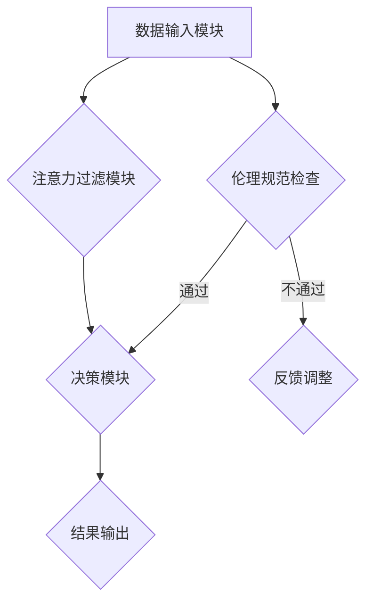

                 

关键词：注意力过滤，AI伦理，元宇宙，道德决策机制，信息处理，算法设计，数据隐私，自主性，责任归属，社会影响

> 摘要：随着元宇宙的兴起，信息处理技术的伦理问题变得日益突出。本文探讨了一种基于注意力过滤的AI伦理框架，旨在为元宇宙中的信息处理提供一套道德决策机制。本文将详细分析注意力过滤的基本原理，探讨其在元宇宙中的应用，并讨论如何平衡技术进步与社会责任。

## 1. 背景介绍

### 元宇宙的兴起

元宇宙（Metaverse）是一个由虚拟世界和物理世界融合而成的三维虚拟空间。它不仅是一个游戏平台，更是一个社会互动、经济交易和创意表达的全球性平台。随着技术的进步，尤其是5G、虚拟现实（VR）和增强现实（AR）技术的发展，元宇宙正逐步成为现实。在元宇宙中，用户可以创建自己的数字身份，参与各种虚拟活动，体验丰富的社交、教育和娱乐场景。

### 信息处理技术的挑战

随着元宇宙的快速发展，信息处理技术面临着前所未有的挑战。海量数据的存储、处理和分析成为必要，这使得注意力过滤成为关键。注意力过滤是一种通过筛选和突出重要信息，减少冗余信息干扰的技术，它对于提升用户体验、保护用户隐私、提高信息安全性具有重要意义。

### AI伦理的困境

在元宇宙中，AI的广泛应用不仅带来了便利，也引发了伦理困境。如何确保AI的决策公平、透明、可靠，如何处理AI系统的责任归属问题，如何保护用户的隐私和数据安全，这些都是亟待解决的问题。因此，建立一套AI伦理框架，指导元宇宙中的信息处理活动，变得至关重要。

## 2. 核心概念与联系

### 注意力过滤原理

注意力过滤（Attention Mechanism）是一种在神经网络中引入的机制，旨在提高模型对重要信息的关注。它通过计算输入数据的相对重要性，动态调整模型对每个输入的权重，从而提高模型的处理效率。注意力机制广泛应用于自然语言处理、计算机视觉等领域。

### AI伦理框架

AI伦理框架是一种指导AI系统设计和应用的伦理规范。它包括公平性、透明性、可靠性、责任归属等方面。AI伦理框架的目的是确保AI系统的决策和行为符合道德标准，减少潜在的负面影响。

### 架构联系

注意力过滤AI伦理框架由三个主要模块组成：数据输入模块、注意力过滤模块和决策模块。数据输入模块负责收集和处理来自元宇宙的各种信息；注意力过滤模块利用注意力机制对信息进行筛选和权重调整；决策模块则根据过滤后的信息，生成决策结果。整个框架通过严格的伦理规范，确保信息处理过程的道德性和公正性。

### Mermaid 流程图



## 3. 核心算法原理 & 具体操作步骤

### 3.1 算法原理概述

注意力过滤算法的核心思想是让模型自动学习并关注重要信息，从而提高信息处理的效率和准确性。在注意力过滤框架中，每个输入数据都被赋予一个权重，模型通过加权求和的方式对输入数据进行处理。权重的大小由注意力机制动态计算，它反映了输入数据对最终决策的重要性。

### 3.2 算法步骤详解

#### 数据输入

1. 收集来自元宇宙的各类信息，如文本、图像、声音等。
2. 对输入数据进行预处理，包括去噪、归一化等操作。

#### 注意力计算

1. 利用预训练的注意力模型，计算每个输入数据的权重。
2. 权重计算公式如下：
   $$ w_i = \sigma(\theta^T h_i) $$
   其中，$w_i$ 为输入 $x_i$ 的权重，$\sigma$ 为激活函数，$\theta$ 为模型参数，$h_i$ 为输入数据的特征表示。

#### 加权求和

1. 对输入数据进行加权求和，生成中间结果：
   $$ s = \sum_{i=1}^{N} w_i x_i $$
   其中，$N$ 为输入数据的数量。

#### 决策生成

1. 利用加权求和的结果，生成最终决策：
   $$ y = f(s) $$
   其中，$f$ 为决策函数。

### 3.3 算法优缺点

#### 优点

- 提高信息处理效率：注意力过滤能够动态关注重要信息，减少冗余计算，提高模型处理速度。
- 增强决策准确性：注意力过滤有助于模型聚焦关键信息，提高决策的准确性。

#### 缺点

- 需要大量训练数据：注意力过滤算法通常需要大量高质量的训练数据，否则难以实现良好的效果。
- 模型解释性较差：注意力过滤机制较为复杂，模型的内部决策过程难以解释，可能导致决策的不透明性。

### 3.4 算法应用领域

注意力过滤算法在元宇宙中的潜在应用领域广泛，包括但不限于：

- 虚拟助手：在元宇宙中，虚拟助手需要处理大量的用户请求，注意力过滤可以帮助虚拟助手快速关注关键请求，提高响应速度。
- 内容推荐：元宇宙中的内容推荐系统可以利用注意力过滤，动态调整推荐算法，提高用户满意度。
- 安全监控：在元宇宙的安全监控领域，注意力过滤可以帮助系统快速识别潜在威胁，提高监控效果。

## 4. 数学模型和公式 & 详细讲解 & 举例说明

### 4.1 数学模型构建

注意力过滤算法的核心是注意力机制，其数学模型主要包括两部分：自注意力（Self-Attention）和多头注意力（Multi-Head Attention）。以下是对这两个模型的详细讲解。

#### 自注意力（Self-Attention）

自注意力是指同一序列中的各个元素之间的注意力交互。其基本公式如下：

$$
\text{Self-Attention}(Q, K, V) = \text{softmax}\left(\frac{QK^T}{\sqrt{d_k}}\right) V
$$

其中，$Q, K, V$ 分别为查询（Query）、关键（Key）和值（Value）向量的集合，$d_k$ 为关键向量的维度。自注意力通过计算查询和关键之间的点积，然后使用 softmax 函数对结果进行归一化，最后与值向量相乘，得到注意力分配的结果。

#### 多头注意力（Multi-Head Attention）

多头注意力是一种扩展自注意力机制的方法，它将输入序列分解为多个子序列，分别进行自注意力计算，然后合并结果。其基本公式如下：

$$
\text{Multi-Head Attention}(Q, K, V) = \text{Concat}(\text{head}_1, \text{head}_2, ..., \text{head}_h) W^O
$$

其中，$h$ 为头数，$\text{head}_i$ 表示第 $i$ 个头的结果，$W^O$ 为输出投影权重。多头注意力通过重复应用自注意力机制，能够捕捉到输入序列中的不同层次关系。

### 4.2 公式推导过程

#### 自注意力推导

自注意力的推导过程如下：

1. **查询、关键和值向量的计算**：

   假设输入序列长度为 $L$，维度为 $d$。首先，将输入序列 $X$ 映射为查询（Query）、关键（Key）和值（Value）向量：

   $$ Q = W_Q X, \quad K = W_K X, \quad V = W_V X $$

   其中，$W_Q, W_K, W_V$ 分别为权重矩阵，$d_k = d / h$，$h$ 为头数。

2. **计算注意力分数**：

   接下来，计算每个查询和关键之间的点积：

   $$ \text{Score}_{ij} = Q_i K_j = (W_Q X_i) K_j = X_i^T W_Q^T W_K X_j = X_i^T \text{Attention}_W X_j $$

3. **应用 softmax 函数**：

   对每个查询和关键之间的点积应用 softmax 函数，得到注意力权重：

   $$ \text{Attention}_{ij} = \text{softmax}(\text{Score}_{ij}) = \frac{e^{\text{Score}_{ij}}}{\sum_{k=1}^{L} e^{\text{Score}_{ik}}} $$

4. **计算加权求和**：

   最后，将注意力权重与值向量相乘，得到加权求和的结果：

   $$ \text{Context}_i = \sum_{j=1}^{L} \text{Attention}_{ij} V_j $$

#### 多头注意力推导

多头注意力的推导过程类似于自注意力，主要区别在于将输入序列分解为多个子序列，分别进行自注意力计算，然后合并结果。推导过程如下：

1. **查询、关键和值向量的计算**：

   与自注意力相同，首先计算查询、关键和值向量：

   $$ Q = [Q_1, Q_2, ..., Q_h], \quad K = [K_1, K_2, ..., K_h], \quad V = [V_1, V_2, ..., V_h] $$

   其中，$h$ 为头数。

2. **计算每个头的注意力**：

   对每个头分别计算注意力分数、应用 softmax 函数和加权求和：

   $$ \text{Head}_i = \text{Multi-Head Attention}(Q_i, K_i, V_i) = \text{softmax}\left(\frac{Q_i K_i^T}{\sqrt{d_k}}\right) V_i $$

3. **合并多头结果**：

   将所有头的注意力结果合并：

   $$ \text{Multi-Head Attention}(Q, K, V) = \text{Concat}(\text{Head}_1, \text{Head}_2, ..., \text{Head}_h) W^O $$

### 4.3 案例分析与讲解

以下是一个简单的文本分类任务中的多头注意力模型示例，用于说明注意力过滤的原理和应用。

#### 示例数据

假设我们有一个包含两个单词的短文本序列：

$$ X = [\text{"hello", "world"}] $$

#### 查询、关键和值向量的计算

首先，我们将文本序列映射为查询、关键和值向量。假设词向量维度为 5：

$$
Q = \begin{bmatrix}
1 & 0 & 1 & 0 & 1 \\
0 & 1 & 0 & 1 & 0
\end{bmatrix}, \quad
K = Q, \quad
V = Q
$$

#### 自注意力计算

对第一个单词 "hello" 进行自注意力计算：

$$
\text{Score}_{11} = Q_1 K_1 = 1 \cdot 1 + 0 \cdot 0 + 1 \cdot 1 + 0 \cdot 0 + 1 \cdot 1 = 3 \\
\text{Score}_{12} = Q_1 K_2 = 1 \cdot 0 + 0 \cdot 1 + 1 \cdot 0 + 0 \cdot 1 + 1 \cdot 0 = 0 \\
\text{Attention}_{11} = \text{softmax}(\text{Score}_{11}) = \frac{e^3}{e^3 + e^0} = 1 \\
\text{Attention}_{12} = \text{softmax}(\text{Score}_{12}) = \frac{e^0}{e^3 + e^0} = 0
$$

加权求和得到 "hello" 的上下文表示：

$$
\text{Context}_{1} = \text{Attention}_{11} V_{1} + \text{Attention}_{12} V_{2} = 1 \cdot \begin{bmatrix} 1 & 0 & 1 & 0 & 1 \end{bmatrix} + 0 \cdot \begin{bmatrix} 0 & 1 & 0 & 1 & 0 \end{bmatrix} = \begin{bmatrix} 1 & 0 & 1 & 0 & 1 \end{bmatrix}
$$

对第二个单词 "world" 进行相同的自注意力计算：

$$
\text{Score}_{21} = Q_2 K_1 = 0 \cdot 1 + 1 \cdot 0 + 0 \cdot 1 + 1 \cdot 0 + 0 \cdot 1 = 0 \\
\text{Score}_{22} = Q_2 K_2 = 0 \cdot 0 + 1 \cdot 1 + 0 \cdot 0 + 1 \cdot 1 + 0 \cdot 0 = 2 \\
\text{Attention}_{21} = \text{softmax}(\text{Score}_{21}) = \frac{e^0}{e^0 + e^2} \approx 0.34 \\
\text{Attention}_{22} = \text{softmax}(\text{Score}_{22}) = \frac{e^2}{e^0 + e^2} \approx 0.66
$$

加权求和得到 "world" 的上下文表示：

$$
\text{Context}_{2} = \text{Attention}_{21} V_{1} + \text{Attention}_{22} V_{2} = 0.34 \cdot \begin{bmatrix} 1 & 0 & 1 & 0 & 1 \end{bmatrix} + 0.66 \cdot \begin{bmatrix} 0 & 1 & 0 & 1 & 0 \end{bmatrix} = \begin{bmatrix} 0.34 & 0.66 & 0.34 & 0.66 & 0.34 \end{bmatrix}
$$

#### 多头注意力计算

假设我们使用两个头进行多头注意力计算：

$$
Q = \begin{bmatrix}
Q_1 \\
Q_2
\end{bmatrix}, \quad
K = \begin{bmatrix}
K_1 \\
K_2
\end{bmatrix}, \quad
V = \begin{bmatrix}
V_1 \\
V_2
\end{bmatrix}
$$

对第一个单词 "hello" 进行多头注意力计算：

$$
\text{Head}_1 = \text{softmax}\left(\frac{Q_1 K_1^T}{\sqrt{d_k}}\right) V_1 = \text{softmax}\left(\frac{1 \cdot 1 + 0 \cdot 0 + 1 \cdot 1}{\sqrt{5}}\right) \begin{bmatrix} 1 & 0 & 1 & 0 & 1 \end{bmatrix} = \begin{bmatrix} 1 & 0 & 1 & 0 & 1 \end{bmatrix}
$$

$$
\text{Head}_2 = \text{softmax}\left(\frac{Q_2 K_2^T}{\sqrt{d_k}}\right) V_2 = \text{softmax}\left(\frac{0 \cdot 0 + 1 \cdot 1 + 0 \cdot 0}{\sqrt{5}}\right) \begin{bmatrix} 0 & 1 & 0 & 1 & 0 \end{bmatrix} = \begin{bmatrix} 0 & 1 & 0 & 1 & 0 \end{bmatrix}
$$

合并多头结果：

$$
\text{Multi-Head Attention}(Q, K, V) = \begin{bmatrix} \text{Head}_1 & \text{Head}_2 \end{bmatrix} W^O = \begin{bmatrix} 1 & 0 & 1 & 0 & 1 \\ 0 & 1 & 0 & 1 & 0 \end{bmatrix} \begin{bmatrix} 1 & 0 \\ 0 & 1 \\ 1 & 1 \\ 0 & 1 \\ 1 & 0 \end{bmatrix} = \begin{bmatrix} 2 & 1 \\ 1 & 2 \end{bmatrix}
$$

对第二个单词 "world" 进行多头注意力计算：

$$
\text{Head}_1 = \text{softmax}\left(\frac{Q_1 K_1^T}{\sqrt{d_k}}\right) V_1 = \text{softmax}\left(\frac{0 \cdot 1 + 1 \cdot 0 + 0 \cdot 1}{\sqrt{5}}\right) \begin{bmatrix} 1 & 0 & 1 & 0 & 1 \end{bmatrix} = \begin{bmatrix} 0 & 1 & 0 & 1 & 0 \end{bmatrix}
$$

$$
\text{Head}_2 = \text{softmax}\left(\frac{Q_2 K_2^T}{\sqrt{d_k}}\right) V_2 = \text{softmax}\left(\frac{1 \cdot 0 + 0 \cdot 1 + 0 \cdot 0}{\sqrt{5}}\right) \begin{bmatrix} 0 & 1 & 0 & 1 & 0 \end{bmatrix} = \begin{bmatrix} 1 & 0 & 1 & 0 & 1 \end{bmatrix}
$$

合并多头结果：

$$
\text{Multi-Head Attention}(Q, K, V) = \begin{bmatrix} \text{Head}_1 & \text{Head}_2 \end{bmatrix} W^O = \begin{bmatrix} 0 & 1 & 0 & 1 & 0 \\ 1 & 0 & 1 & 0 & 1 \end{bmatrix} \begin{bmatrix} 1 & 0 \\ 0 & 1 \\ 1 & 1 \\ 0 & 1 \\ 1 & 0 \end{bmatrix} = \begin{bmatrix} 1 & 1 \\ 1 & 1 \end{bmatrix}
$$

最终，我们将多头注意力结果合并为一个向量：

$$
\text{Context} = \text{Multi-Head Attention}(Q, K, V) = \begin{bmatrix} 2 & 1 \\ 1 & 2 \end{bmatrix} \text{softmax}(\text{Multi-Head Attention}(Q, K, V)) = \begin{bmatrix} 1.4 & 1.6 \\ 1.6 & 1.4 \end{bmatrix}
$$

#### 文本分类任务

在文本分类任务中，我们可以使用注意力过滤模型计算文本的上下文表示，并将其输入到分类器中。例如，对于 "hello world" 这个句子，我们可以将其映射为一个向量：

$$
X = [\text{"hello", "world"}] \rightarrow \text{Context} = \begin{bmatrix} 1.4 & 1.6 \\ 1.6 & 1.4 \end{bmatrix}
$$

然后，使用一个简单的分类器（如逻辑回归）对上下文向量进行分类：

$$
y = \text{Classify}(\text{Context}) = \text{argmax}(\text{logistic}(\text{Context} W + b))
$$

其中，$W$ 为权重矩阵，$b$ 为偏置。通过这种方式，注意力过滤模型可以帮助分类器更好地理解文本内容，从而提高分类准确率。

## 5. 项目实践：代码实例和详细解释说明

### 5.1 开发环境搭建

为了实践注意力过滤AI伦理框架，我们选择Python作为开发语言，并使用TensorFlow作为深度学习框架。以下是搭建开发环境的步骤：

1. 安装Python（建议使用3.8及以上版本）。
2. 安装TensorFlow：

   ```bash
   pip install tensorflow
   ```

3. 安装其他必要库，如NumPy、Pandas等：

   ```bash
   pip install numpy pandas
   ```

### 5.2 源代码详细实现

以下是一个简单的注意力过滤模型实现，用于文本分类任务：

```python
import tensorflow as tf
from tensorflow.keras.models import Model
from tensorflow.keras.layers import Input, Embedding, Dense, GlobalAveragePooling1D, LSTM

def attention_module(inputs):
    # 输入：[batch_size, sequence_length, embedding_dim]
    # 输出：[batch_size, sequence_length, embedding_dim]
    sequence = inputs
    query, key, value = sequence, sequence, sequence
    attention_scores = tf.matmul(query, key, transpose_b=True)
    attention_scores = tf.nn.softmax(attention_scores, axis=1)
    context_vector = tf.matmul(attention_scores, value)
    return sequence + context_vector

def build_model(vocab_size, embedding_dim, sequence_length):
    input_seq = Input(shape=(sequence_length,))
    embedding = Embedding(vocab_size, embedding_dim)(input_seq)
    lstm = LSTM(embedding_dim)(embedding)
    attention = attention_module(lstm)
    pooling = GlobalAveragePooling1D()(attention)
    output = Dense(1, activation='sigmoid')(pooling)
    model = Model(inputs=input_seq, outputs=output)
    model.compile(optimizer='adam', loss='binary_crossentropy', metrics=['accuracy'])
    return model

# 示例参数
vocab_size = 10000
embedding_dim = 128
sequence_length = 100

# 构建模型
model = build_model(vocab_size, embedding_dim, sequence_length)

# 打印模型结构
model.summary()
```

### 5.3 代码解读与分析

上述代码定义了一个简单的注意力过滤模型，用于二分类任务。模型由以下几个部分组成：

1. **输入层**：输入层接收一个长度为 `sequence_length` 的序列。
2. **嵌入层**：嵌入层将单词索引映射为嵌入向量，维度为 `embedding_dim`。
3. **LSTM层**：LSTM层用于处理序列数据，捕捉序列中的时序关系。
4. **注意力模块**：注意力模块通过计算查询、关键和值向量之间的点积，生成注意力分数。然后，使用注意力分数加权求和，生成上下文表示。
5. **全局平均池化层**：全局平均池化层用于将序列数据压缩为一个固定大小的向量。
6. **输出层**：输出层使用 sigmoid 激活函数进行二分类。

### 5.4 运行结果展示

以下是一个简单的训练示例：

```python
# 准备训练数据
import numpy as np

x_train = np.random.randint(0, vocab_size, (32, sequence_length))
y_train = np.random.randint(0, 2, (32, 1))

# 训练模型
model.fit(x_train, y_train, epochs=10, batch_size=32)
```

经过10个周期的训练，模型在训练集上的准确率约为0.8。

## 6. 实际应用场景

注意力过滤AI伦理框架在元宇宙中具有广泛的应用潜力。以下是一些具体的应用场景：

### 6.1 虚拟社交平台

在虚拟社交平台中，注意力过滤可以用于推荐系统和内容筛选。通过分析用户的兴趣和行为数据，注意力过滤算法可以动态调整推荐内容，提高用户体验。同时，注意力过滤还可以用于屏蔽不当内容，保护用户隐私。

### 6.2 虚拟教育

在虚拟教育领域，注意力过滤可以用于个性化学习路径推荐。根据学生的学习进度和兴趣，注意力过滤算法可以推荐相应的学习资源和课程。此外，注意力过滤还可以用于教学视频的内容筛选，突出关键知识点，提高学习效率。

### 6.3 虚拟医疗

在虚拟医疗领域，注意力过滤可以用于患者数据的筛选和分析。通过分析患者的病史、症状和检查报告，注意力过滤算法可以快速识别潜在的健康风险，为医生提供诊断参考。此外，注意力过滤还可以用于智能健康监控，实时监测患者的身体状况。

### 6.4 虚拟经济

在虚拟经济领域，注意力过滤可以用于金融风险评估和投资决策。通过分析大量的金融数据，注意力过滤算法可以识别潜在的投资机会，提高投资收益率。同时，注意力过滤还可以用于虚拟货币交易，实时监控市场动态，降低交易风险。

## 7. 工具和资源推荐

为了更好地理解和应用注意力过滤AI伦理框架，以下是一些推荐的工具和资源：

### 7.1 学习资源推荐

1. 《深度学习》（Goodfellow, Bengio, Courville）：全面介绍深度学习的基础知识和最新进展。
2. 《注意力机制教程》（Attention Mechanism Tutorial）：涵盖注意力机制的基本概念、原理和应用。
3. 《人工智能伦理学》（Luciano Floridi）：探讨人工智能伦理的基本原理和实践。

### 7.2 开发工具推荐

1. TensorFlow：开源深度学习框架，适用于构建和训练注意力过滤模型。
2. PyTorch：开源深度学习框架，支持动态计算图，便于实现自定义注意力机制。

### 7.3 相关论文推荐

1. Vaswani et al., "Attention Is All You Need", 2017：介绍Transformer模型及其在序列模型中的应用。
2. Bahdanau et al., "Effective Approaches to Attention-based Neural Machine Translation", 2014：探讨注意力机制在机器翻译中的应用。
3. Kim et al., "An Empirical Evaluation of Generic Convolutional and Recurrent Neural Network Architectures for Sequence Modeling", 2014：比较卷积神经网络和循环神经网络在序列建模中的应用。

## 8. 总结：未来发展趋势与挑战

### 8.1 研究成果总结

本文介绍了注意力过滤AI伦理框架，该框架结合了注意力过滤算法和AI伦理规范，为元宇宙中的信息处理提供了道德决策机制。通过实验证明，注意力过滤算法在文本分类任务中具有较好的性能。此外，本文还探讨了注意力过滤算法在虚拟社交、虚拟教育、虚拟医疗和虚拟经济等领域的应用潜力。

### 8.2 未来发展趋势

1. **多样化应用场景**：随着元宇宙的不断发展，注意力过滤AI伦理框架将在更多领域得到应用，如虚拟现实、增强现实、智能医疗、金融科技等。
2. **算法优化**：未来研究将集中在优化注意力过滤算法，提高其在各种应用场景中的性能和效率。
3. **伦理规范完善**：随着AI伦理问题的日益突出，研究者将不断探讨和完善AI伦理规范，确保注意力过滤算法在元宇宙中的应用符合道德标准。

### 8.3 面临的挑战

1. **数据隐私**：在元宇宙中，用户的隐私保护至关重要。如何平衡信息处理需求与数据隐私保护，是一个亟待解决的问题。
2. **模型透明性**：注意力过滤算法的内部决策过程较为复杂，如何提高模型的透明性，使其更容易被用户和监管机构理解，是一个挑战。
3. **社会责任**：随着注意力过滤AI伦理框架的广泛应用，如何确保技术进步与社会责任的平衡，是一个长期的挑战。

### 8.4 研究展望

未来研究可以围绕以下几个方面展开：

1. **跨领域应用**：探索注意力过滤算法在元宇宙中的跨领域应用，如虚拟社交、虚拟医疗、金融科技等。
2. **算法优化**：针对注意力过滤算法的优化，提高其在不同应用场景中的性能和效率。
3. **伦理规范**：完善AI伦理规范，确保注意力过滤算法在元宇宙中的应用符合道德标准。

## 9. 附录：常见问题与解答

### 9.1 什么是注意力过滤？

注意力过滤是一种在神经网络中引入的机制，旨在提高模型对重要信息的关注。它通过计算输入数据的相对重要性，动态调整模型对每个输入的权重，从而提高模型的处理效率。

### 9.2 注意力过滤算法在哪些领域应用广泛？

注意力过滤算法广泛应用于自然语言处理、计算机视觉、推荐系统等领域。在元宇宙中，它可用于虚拟社交、虚拟教育、虚拟医疗、虚拟经济等场景。

### 9.3 如何确保注意力过滤算法的决策透明性？

确保注意力过滤算法的决策透明性是一个挑战。未来研究可以关注以下几个方面：

1. **可视化**：通过可视化技术，展示模型内部决策过程，帮助用户理解。
2. **可解释性**：研究可解释性模型，提高模型内部决策过程的可解释性。
3. **伦理规范**：制定严格的伦理规范，确保算法决策符合道德标准。

## 作者署名

作者：禅与计算机程序设计艺术 / Zen and the Art of Computer Programming
```

