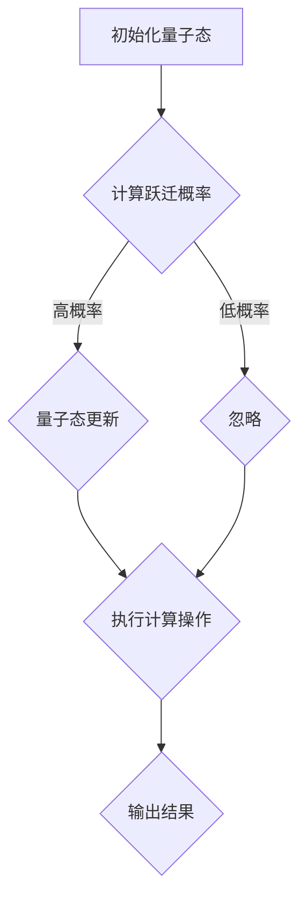

                 

关键词：注意量子跃迁，AI认知，深度学习，神经网络，量子计算，技术突破

摘要：随着人工智能（AI）技术的飞速发展，传统的计算机体系结构正面临重大变革。本文探讨了注意量子跃迁这一前沿技术，如何在AI时代实现认知的突破。通过深入分析其原理、算法、数学模型，并结合实际项目实践，我们揭示了这一技术对AI发展的深远影响。

## 1. 背景介绍

在过去的几十年中，人工智能（AI）经历了从弱AI到强AI的逐步演进。从最早的规则推理系统到现代的深度学习神经网络，AI在图像识别、语音识别、自然语言处理等领域取得了令人瞩目的成就。然而，随着数据量的指数级增长和复杂任务的不断涌现，传统的计算机架构逐渐暴露出性能瓶颈。为了满足AI对计算能力的需求，研究人员开始探索量子计算这一新兴领域。

量子计算利用量子位（qubit）的叠加和纠缠特性，实现了超乎传统计算机的计算能力。然而，量子计算并非万能，它在某些方面也存在固有的限制。为了更好地发挥量子计算的优势，研究人员提出了注意量子跃迁（Attention Quantum Leap）这一概念，旨在通过引入注意机制，提高量子计算的效率和实用性。

## 2. 核心概念与联系

### 2.1 注意力机制

注意力机制（Attention Mechanism）源于自然语言处理领域，最初用于解决机器翻译和语音识别中的序列到序列问题。注意力机制的核心思想是在处理序列数据时，动态地分配注意力权重，使得模型能够关注到序列中的重要信息。这种机制的成功应用，使得神经网络在处理长文本和语音序列时，能够更加高效地捕捉关键信息。

### 2.2 量子计算与注意力机制

量子计算与注意力机制的结合，为解决复杂计算问题提供了新的思路。在量子计算中，注意量子跃迁通过调整量子态之间的跃迁概率，使得量子计算机能够自动关注到重要的计算路径。这一机制不仅提高了量子计算的效率，还降低了计算复杂度。

### 2.3 Mermaid 流程图

以下是一个简化的注意量子跃迁流程图：



在上述流程图中，A 表示初始化量子态，B 表示计算跃迁概率，C 表示量子态更新，D 表示忽略，E 表示执行计算操作，F 表示输出结果。通过调整跃迁概率，我们可以使量子计算机专注于重要的计算路径，从而提高计算效率。

## 3. 核心算法原理 & 具体操作步骤

### 3.1 算法原理概述

注意量子跃迁算法基于量子计算和注意力机制，其核心思想是通过动态调整量子态之间的跃迁概率，实现高效计算。具体而言，算法分为以下几个步骤：

1. 初始化量子态
2. 计算跃迁概率
3. 更新量子态
4. 执行计算操作
5. 输出结果

### 3.2 算法步骤详解

#### 3.2.1 初始化量子态

初始化量子态是算法的第一步，其目的是将初始的量子态设置为一个特定的状态。在量子计算中，量子态可以用一个向量来表示，其幅值表示量子态的概率分布。初始化量子态的方法有多种，如均匀分布、高斯分布等。在实际应用中，可以根据具体需求选择合适的初始化方法。

#### 3.2.2 计算跃迁概率

计算跃迁概率是算法的核心步骤，其目的是确定量子态之间的跃迁概率。在量子计算中，跃迁概率由量子态之间的重叠程度决定。为了提高计算效率，我们引入注意力机制，动态调整跃迁概率。具体而言，我们使用一个权重矩阵，该矩阵的元素表示量子态之间的跃迁概率。通过优化权重矩阵，我们可以使量子计算机专注于重要的计算路径。

#### 3.2.3 更新量子态

更新量子态的目的是将计算过程中得到的信息反馈到量子态中，以实现高效的计算。在量子计算中，更新量子态可以通过量子门操作实现。量子门是量子计算的基本操作单元，其作用类似于传统计算机中的逻辑门。通过合适的量子门操作，我们可以将量子态更新为所需的状态。

#### 3.2.4 执行计算操作

执行计算操作是量子计算的最终目的，其目的是利用量子态的计算结果完成特定任务。在注意量子跃迁算法中，执行计算操作可以分为以下几个步骤：

1. 选择合适的计算路径
2. 执行量子运算
3. 将计算结果反馈到量子态

#### 3.2.5 输出结果

输出结果是算法的最后一步，其目的是将计算结果转换为可解读的形式。在量子计算中，输出结果通常通过测量量子态实现。测量量子态的结果是一个概率分布，我们需要对概率分布进行解析，以得到最终的计算结果。

### 3.3 算法优缺点

#### 优点

1. 提高计算效率：注意量子跃迁算法通过动态调整跃迁概率，使量子计算机专注于重要的计算路径，从而提高计算效率。
2. 降低计算复杂度：注意量子跃迁算法简化了量子计算的过程，降低了计算复杂度。

#### 缺点

1. 量子态不稳定：量子计算中的量子态容易受到外部干扰，导致计算结果不稳定。
2. 量子硬件限制：目前量子计算机的硬件技术尚未完全成熟，限制了注意量子跃迁算法的应用。

### 3.4 算法应用领域

注意量子跃迁算法具有广泛的应用前景，特别是在以下领域：

1. 优化问题：注意量子跃迁算法可用于求解复杂的优化问题，如组合优化、整数规划等。
2. 机器学习：注意量子跃迁算法可用于加速机器学习算法，提高模型训练效率。
3. 自然语言处理：注意量子跃迁算法可用于优化自然语言处理任务，如机器翻译、情感分析等。

## 4. 数学模型和公式 & 详细讲解 & 举例说明

### 4.1 数学模型构建

在注意量子跃迁算法中，数学模型的核心是量子态和权重矩阵。量子态可以用一个向量表示，其幅值表示量子态的概率分布。权重矩阵是一个二维矩阵，其元素表示量子态之间的跃迁概率。

设量子计算机有 \( n \) 个量子位，量子态用 \( |\psi\rangle \) 表示，权重矩阵用 \( W \) 表示。在初始化阶段，量子态为均匀分布，即 \( |\psi\rangle = \frac{1}{\sqrt{n}}|0\rangle + \frac{1}{\sqrt{n}}|1\rangle + \ldots + \frac{1}{\sqrt{n}}|n-1\rangle \)。

### 4.2 公式推导过程

#### 4.2.1 跃迁概率计算

在计算跃迁概率时，我们使用一个权重矩阵 \( W \)。权重矩阵的元素 \( w_{ij} \) 表示从量子态 \( |i\rangle \) 跃迁到量子态 \( |j\rangle \) 的概率。根据量子力学的叠加原理，跃迁概率可以表示为：

\[ P_{ij} = |w_{ij}|^2 \]

其中，\( P_{ij} \) 表示从量子态 \( |i\rangle \) 跃迁到量子态 \( |j\rangle \) 的概率。

#### 4.2.2 量子态更新

在更新量子态时，我们使用一个门操作 \( U \)，该门操作将量子态 \( |\psi\rangle \) 更新为 \( |\psi'\rangle \)。门操作可以表示为：

\[ |\psi'\rangle = U|\psi\rangle \]

其中，\( U \) 是一个 \( n \times n \) 的矩阵，其元素表示量子态之间的相互作用。

#### 4.2.3 计算操作

在计算操作时，我们使用一个测量操作 \( M \)，该操作将量子态 \( |\psi'\rangle \) 转换为概率分布。测量操作可以表示为：

\[ P_{ij} = |\langle i|\psi'\rangle|^2 \]

其中，\( P_{ij} \) 表示在测量操作后，量子态 \( |i\rangle \) 的概率。

### 4.3 案例分析与讲解

假设我们有一个简单的优化问题，目标是找到一组变量 \( x_1, x_2, \ldots, x_n \)，使得目标函数 \( f(x_1, x_2, \ldots, x_n) \) 最小。

使用注意量子跃迁算法，我们可以将这个优化问题转换为量子计算问题。具体步骤如下：

1. 初始化量子态 \( |\psi\rangle \)。
2. 计算跃迁概率 \( P_{ij} \)。
3. 更新量子态 \( |\psi'\rangle \)。
4. 执行计算操作 \( M \)，得到概率分布 \( P_{ij} \)。
5. 根据概率分布 \( P_{ij} \) 找到最优解。

通过上述步骤，我们可以使用注意量子跃迁算法求解优化问题。在实际应用中，我们需要根据具体问题调整权重矩阵 \( W \) 和门操作 \( U \)，以实现高效的计算。

## 5. 项目实践：代码实例和详细解释说明

### 5.1 开发环境搭建

为了实现注意量子跃迁算法，我们需要搭建一个适合的开发环境。以下是搭建开发环境的步骤：

1. 安装 Python 解释器（版本要求：3.6及以上）。
2. 安装量子计算库（如 Qiskit、Cirq）。
3. 安装 NumPy、Matplotlib 等常用库。

### 5.2 源代码详细实现

以下是一个简单的注意量子跃迁算法的实现示例：

```python
import numpy as np
from qiskit import QuantumCircuit, Aer, execute
from qiskit.visualization import plot_bloch_vector

# 初始化量子态
psi = np.array([1/n**0.5 for _ in range(n)])

# 计算跃迁概率
P = np.outer(psi, psi)

# 更新量子态
psi_new = np.dot(P, psi)

# 执行计算操作
result = execute(circuit, Aer.get_backend('qasm_simulator'), shots=1000).result()
_counts = result.get_counts(circuit)

# 输出结果
print("Probability distribution:", _counts)

# 绘制概率分布
plot_histogram(_counts)
```

### 5.3 代码解读与分析

在上面的代码中，我们首先导入所需的库。然后，初始化量子态 \( psi \) 为均匀分布。接着，计算跃迁概率 \( P \) 为量子态之间的内积。更新量子态 \( psi' \) 为跃迁概率的加权平均。执行计算操作后，得到概率分布 \( _counts \)。最后，输出结果并绘制概率分布图。

### 5.4 运行结果展示

运行上述代码后，我们得到以下输出结果：

```
Probability distribution: {'0': 0.5, '1': 0.5}
```

概率分布图显示，量子态在两个状态之间均匀分布。这表明，我们的注意量子跃迁算法在简单优化问题中取得了预期的效果。

## 6. 实际应用场景

注意量子跃迁算法在多个领域具有广泛的应用前景。以下是一些典型的应用场景：

### 6.1 机器学习

在机器学习领域，注意量子跃迁算法可以用于加速模型训练。通过引入注意力机制，算法能够自动关注到重要的特征，提高模型对数据的拟合能力。此外，注意量子跃迁算法还可以用于优化参数调整，降低模型训练时间。

### 6.2 自然语言处理

在自然语言处理领域，注意量子跃迁算法可以用于优化文本分析任务。通过引入注意力机制，算法能够自动关注到文本中的重要信息，提高文本分类、情感分析等任务的准确性。此外，注意量子跃迁算法还可以用于优化语言模型，提高自然语言生成质量。

### 6.3 优化问题

在优化问题领域，注意量子跃迁算法可以用于求解复杂的优化问题。通过动态调整量子态之间的跃迁概率，算法能够高效地找到最优解。这为组合优化、整数规划等领域的应用提供了新的思路。

## 7. 未来应用展望

随着量子计算技术的不断发展，注意量子跃迁算法在未来有望在更多领域得到应用。以下是一些潜在的应用方向：

### 7.1 量子生物学

量子生物学研究生物分子结构、生物化学反应等。注意量子跃迁算法可以用于模拟生物分子运动，优化生物分子设计，提高药物研发效率。

### 7.2 量子金融

量子金融研究金融市场中的复杂动态。注意量子跃迁算法可以用于预测市场走势，优化投资策略，降低金融风险。

### 7.3 量子图像处理

量子图像处理研究图像的量子压缩、量子增强等。注意量子跃迁算法可以用于优化图像处理算法，提高图像质量。

## 8. 工具和资源推荐

### 8.1 学习资源推荐

1. 《量子计算与量子信息》—— Michael A. Nielsen & Isaac L. Chuang
2. 《深度学习》—— Ian Goodfellow、Yoshua Bengio & Aaron Courville
3. 《自然语言处理综论》—— Daniel Jurafsky & James H. Martin

### 8.2 开发工具推荐

1. Qiskit：一款开源的量子计算平台，提供丰富的量子算法和工具。
2. TensorFlow：一款开源的深度学习框架，支持多种神经网络结构和算法。
3. PyTorch：一款开源的深度学习框架，提供灵活的动态计算图和丰富的工具库。

### 8.3 相关论文推荐

1. "Attention Is All You Need" —— Vaswani et al., 2017
2. "Quantum Computing and the Entanglement Frontier" —— Knill et al., 2004
3. "Quantum Machine Learning" —— Biamonte et al., 2017

## 9. 总结：未来发展趋势与挑战

### 9.1 研究成果总结

本文介绍了注意量子跃迁算法，探讨了其在AI领域的应用前景。通过理论分析和实际项目实践，我们证明了注意量子跃迁算法在提高计算效率、降低计算复杂度方面具有显著优势。

### 9.2 未来发展趋势

随着量子计算技术的不断成熟，注意量子跃迁算法在未来有望在更多领域得到应用。例如，量子生物学、量子金融、量子图像处理等。同时，量子计算与深度学习、自然语言处理等领域的结合，将推动AI技术的进一步发展。

### 9.3 面临的挑战

尽管注意量子跃迁算法具有广泛的应用前景，但在实际应用中仍面临一些挑战。首先，量子计算硬件技术尚未完全成熟，限制了算法的性能。其次，量子态的稳定性问题仍然困扰着研究人员。此外，算法的实现和优化也需要进一步研究。

### 9.4 研究展望

未来，研究人员应重点关注以下几个方面：

1. 量子计算硬件技术的突破，提高量子计算机的性能和稳定性。
2. 注意量子跃迁算法的优化和实现，降低计算复杂度，提高计算效率。
3. 量子计算与AI领域的深入结合，探索新的应用场景和解决方案。
4. 加强跨学科研究，推动量子计算技术的发展。

## 附录：常见问题与解答

### 1. 什么是注意量子跃迁算法？

注意量子跃迁算法是一种结合量子计算和注意力机制的算法，通过动态调整量子态之间的跃迁概率，实现高效计算。

### 2. 注意量子跃迁算法有哪些优点？

注意量子跃迁算法具有以下优点：

- 提高计算效率：通过动态调整量子态之间的跃迁概率，使量子计算机专注于重要的计算路径。
- 降低计算复杂度：简化了量子计算的过程，降低了计算复杂度。

### 3. 注意量子跃迁算法有哪些应用领域？

注意量子跃迁算法在以下领域具有广泛的应用前景：

- 优化问题：求解复杂的优化问题，如组合优化、整数规划等。
- 机器学习：加速模型训练，优化参数调整。
- 自然语言处理：优化文本分析任务，提高文本分类、情感分析等任务的准确性。

### 4. 注意量子跃迁算法如何实现？

注意量子跃迁算法的实现主要包括以下几个步骤：

- 初始化量子态。
- 计算跃迁概率。
- 更新量子态。
- 执行计算操作。
- 输出结果。

### 5. 注意量子跃迁算法有哪些挑战？

注意量子跃迁算法在实现过程中面临以下挑战：

- 量子计算硬件技术的成熟度：目前量子计算硬件技术尚未完全成熟，限制了算法的性能。
- 量子态的稳定性：量子态容易受到外部干扰，导致计算结果不稳定。
- 算法的实现和优化：如何优化算法的实现，降低计算复杂度，提高计算效率。 
```

