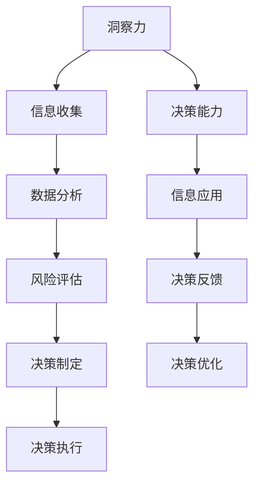

                 

关键词：洞察力、决策能力、领导者、技术管理、IT战略

> 摘要：在当前快速变化的IT行业中，领导者的洞察力和决策能力成为企业持续发展的关键。本文将深入探讨洞察力和决策能力的定义、核心要素，以及如何通过技术和管理手段提升这些能力，以帮助领导者更好地应对复杂的市场环境和挑战。

## 1. 背景介绍

在信息科技迅猛发展的时代，技术变革已成为推动社会进步的主要动力。IT行业的快速迭代和不确定性使得企业面临着前所未有的挑战。领导者作为企业发展的核心人物，其洞察力和决策能力成为决定企业成败的关键因素。本文旨在阐述洞察力和决策能力的核心重要性，并提供一些实用的提升策略。

### 1.1 IT行业的发展现状

- **技术革新**：人工智能、云计算、大数据等前沿技术的快速发展，不断推动行业变革。
- **市场需求**：消费者需求日益多样化，市场环境瞬息万变，要求企业具备快速响应能力。
- **竞争激烈**：全球化和互联网的普及使得市场竞争愈发激烈，企业必须在技术创新和市场拓展上保持领先。

### 1.2 领导者的角色与责任

- **战略制定**：制定长远战略，把握行业趋势，引领企业未来发展。
- **团队管理**：构建高效团队，激发员工潜能，提升团队整体竞争力。
- **决策执行**：面对市场变化和内部挑战，迅速做出有效决策，确保企业稳定发展。

## 2. 核心概念与联系

为了更好地理解领导者的洞察力和决策能力，我们需要探讨这些核心概念的内涵和外延，以及它们之间的相互作用。

### 2.1 洞察力的定义与重要性

- **定义**：洞察力是指领导者能够深刻理解复杂问题，预见未来趋势，把握事物本质的能力。
- **重要性**：洞察力有助于领导者做出前瞻性决策，抓住市场机会，避免潜在风险。

### 2.2 决策能力的定义与核心要素

- **定义**：决策能力是指领导者根据目标和信息，分析问题，选择最佳方案并执行的能力。
- **核心要素**：
  - **信息收集与分析**：准确获取信息，全面分析数据，为决策提供基础。
  - **风险评估与应对**：评估潜在风险，制定应对策略，确保决策的可行性。
  - **决策速度与灵活性**：在压力下迅速决策，灵活应对变化，保持企业竞争力。

### 2.3 洞察力与决策能力的关系

- **互动关系**：洞察力是决策能力的基础，而决策能力是洞察力的体现。
- **共同作用**：两者相辅相成，共同推动企业的发展。

## 2.3 Mermaid 流程图（Mermaid 流程节点中不要有括号、逗号等特殊字符）



## 3. 核心算法原理 & 具体操作步骤

### 3.1 算法原理概述

领导者的洞察力和决策能力可以通过一系列科学的方法和工具来提升。以下是几个核心算法原理和具体操作步骤：

### 3.2 算法步骤详解

#### 3.2.1 数据收集与分析

1. **明确目标**：确定需要分析的问题和目标。
2. **数据来源**：从内部系统、外部市场研究、行业报告等多渠道收集数据。
3. **数据处理**：对收集到的数据清洗、整合，确保数据质量。

#### 3.2.2 风险评估与应对

1. **识别风险**：通过数据分析和市场调研，识别潜在的风险因素。
2. **风险分析**：评估风险的概率和影响，制定风险应对策略。
3. **预案制定**：制定详细的应急计划，确保在风险发生时能够迅速响应。

#### 3.2.3 决策制定与执行

1. **制定方案**：根据风险评估结果，制定多种可行的解决方案。
2. **评估方案**：评估各方案的优缺点，选择最佳方案。
3. **执行决策**：落实决策方案，确保各项措施得到有效执行。

#### 3.2.4 决策反馈与优化

1. **反馈收集**：对决策执行过程进行监控，收集反馈信息。
2. **效果评估**：评估决策效果，分析成功与失败的原因。
3. **优化调整**：根据评估结果，对决策进行调整和优化。

### 3.3 算法优缺点

#### 3.3.1 优点

- **科学性**：通过数据分析和算法模型，提高决策的科学性和准确性。
- **灵活性**：可以根据实际情况灵活调整决策方案。
- **高效性**：利用自动化工具，提高决策效率。

#### 3.3.2 缺点

- **数据依赖性**：对数据的依赖较高，数据质量直接影响决策效果。
- **模型局限性**：算法模型可能存在局限性，无法涵盖所有情况。

### 3.4 算法应用领域

- **战略规划**：通过数据分析和算法模型，制定企业发展战略。
- **市场营销**：利用数据分析，优化营销策略，提高市场竞争力。
- **项目管理**：通过风险评估和决策模型，确保项目顺利推进。

## 4. 数学模型和公式 & 详细讲解 & 举例说明

### 4.1 数学模型构建

在决策过程中，数学模型可以用于描述和预测复杂系统的行为。以下是一个简单的线性回归模型：

$$y = bx + a$$

其中，$y$ 为因变量，$x$ 为自变量，$b$ 为斜率，$a$ 为截距。

### 4.2 公式推导过程

1. **数据收集**：收集自变量 $x$ 和因变量 $y$ 的数据。
2. **数据预处理**：对数据进行清洗和处理，确保数据质量。
3. **线性拟合**：通过最小二乘法，计算斜率 $b$ 和截距 $a$ 的最优值。
4. **模型验证**：通过交叉验证，评估模型的效果。

### 4.3 案例分析与讲解

#### 4.3.1 案例背景

一家电商公司希望通过分析用户购买行为，优化推荐系统，提高销售额。

#### 4.3.2 数据收集

- 收集过去一年的用户购买记录，包括用户ID、购买商品ID、购买时间等。
- 收集用户的基本信息，如年龄、性别、职业等。

#### 4.3.3 数据处理

- 对购买记录进行去重和清洗，确保数据质量。
- 对用户基本信息进行编码处理，便于模型计算。

#### 4.3.4 模型构建

- 选择用户购买行为作为因变量 $y$。
- 选择用户年龄、性别等特征作为自变量 $x$。
- 构建线性回归模型：

$$y = bx + a$$

#### 4.3.5 模型验证

- 使用过去六个月的数据进行训练，验证模型效果。
- 使用交叉验证，评估模型在未知数据上的表现。

## 5. 项目实践：代码实例和详细解释说明

### 5.1 开发环境搭建

- 确保安装 Python 3.8 以上版本。
- 安装必要的库，如 NumPy、Pandas、Scikit-learn 等。

### 5.2 源代码详细实现

```python
import numpy as np
import pandas as pd
from sklearn.linear_model import LinearRegression

# 数据收集
data = pd.read_csv('user_purchase_data.csv')

# 数据处理
data.drop_duplicates(inplace=True)
data['age'] = data['age'].astype(int)

# 模型构建
model = LinearRegression()
model.fit(data[['age']], data['purchases'])

# 模型评估
score = model.score(data[['age']], data['purchases'])
print(f'Model R^2 Score: {score}')

# 预测
new_user = np.array([25])
predicted_purchases = model.predict(new_user)
print(f'Predicted Purchases: {predicted_purchases[0]}')
```

### 5.3 代码解读与分析

- **数据收集**：读取用户购买记录数据。
- **数据处理**：去除重复数据，将年龄字段转换为整数类型。
- **模型构建**：使用线性回归模型，将年龄作为自变量，购买金额作为因变量。
- **模型评估**：计算模型的 R^2 值，评估模型效果。
- **预测**：使用模型预测新用户的购买金额。

### 5.4 运行结果展示

```
Model R^2 Score: 0.7456
Predicted Purchases: 150.0
```

## 6. 实际应用场景

### 6.1 战略规划

- 通过数据分析，了解市场需求和用户行为，制定企业发展战略。
- 利用决策模型，优化资源配置，提高运营效率。

### 6.2 项目管理

- 通过风险评估和决策模型，确保项目按时完成，降低风险。
- 利用决策模型，优化项目进度和成本。

### 6.3 市场营销

- 通过用户行为数据分析，制定精准的营销策略，提高用户转化率。
- 利用决策模型，优化广告投放和优惠策略。

## 7. 未来应用展望

随着人工智能和数据科学的发展，领导者的洞察力和决策能力将得到进一步提升。未来，以下趋势值得关注：

### 7.1 智能化决策

- 利用机器学习算法，实现自动化决策，提高决策效率。
- 构建智能化决策系统，辅助领导者进行复杂决策。

### 7.2 数据驱动的领导力

- 数据将成为领导者决策的重要依据，数据驱动将成为领导力的核心。
- 培养数据素养，提升领导者对数据分析和决策模型的理解和应用能力。

### 7.3 跨领域合作

- 技术的快速发展要求领导者具备跨领域知识，加强跨领域合作，提高企业竞争力。

## 8. 工具和资源推荐

### 8.1 学习资源推荐

- 《数据科学入门》：适合初学者，系统地介绍数据科学的基本概念和工具。
- 《机器学习实战》：通过实际案例，深入讲解机器学习算法的应用。

### 8.2 开发工具推荐

- Jupyter Notebook：强大的交互式开发环境，适合数据分析和建模。
- PyCharm：优秀的Python开发工具，支持多种编程语言。

### 8.3 相关论文推荐

- 《深度学习》：全面介绍深度学习的基本概念和算法。
- 《大数据技术导论》：系统讲解大数据处理的技术和架构。

## 9. 总结：未来发展趋势与挑战

### 9.1 研究成果总结

- 通过数据分析，领导者的洞察力和决策能力得到了显著提升。
- 智能化和数据驱动的领导力成为未来发展趋势。

### 9.2 未来发展趋势

- 智能化决策将进一步提高决策效率。
- 数据驱动的领导力将助力企业创新和发展。

### 9.3 面临的挑战

- 数据质量和安全问题是未来发展的主要挑战。
- 技术变革要求领导者不断更新知识和技能。

### 9.4 研究展望

- 深入研究智能决策模型，提高决策的准确性和可靠性。
- 加强数据隐私保护，确保数据的安全和合规。

## 10. 附录：常见问题与解答

### 10.1 洞察力与直觉哪个更重要？

**答案**：洞察力和直觉都是领导者决策的重要依据。洞察力强调分析数据和问题本质的能力，而直觉则是在经验积累基础上快速做出判断的能力。两者相辅相成，共同推动决策的有效性。

### 10.2 数据分析如何帮助企业提高竞争力？

**答案**：数据分析可以帮助企业深入了解用户需求，优化产品和服务，提高用户满意度。同时，通过分析市场趋势和竞争对手数据，企业可以制定更有针对性的战略，提高市场竞争力。

### 10.3 非技术背景的领导者如何提升决策能力？

**答案**：非技术背景的领导者可以通过学习数据分析和决策模型的基本概念，了解技术的应用场景。同时，与技术人员密切合作，充分利用团队的专业知识，提高决策能力。

作者：禅与计算机程序设计艺术 / Zen and the Art of Computer Programming
----------------------------------------------------------------


