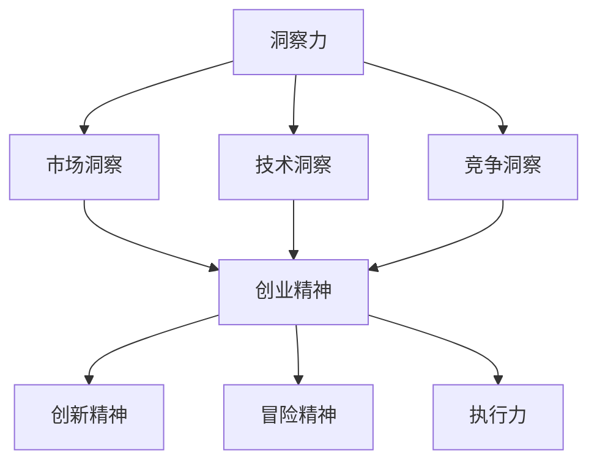

                 

### 关键词 Keyword
- 洞察力
- 创业精神
- 发现机会
- 敏锐度
- 技术创新
- 创业策略
- 市场分析

<|assistant|>### 摘要 Abstract
本文探讨了洞察力和创业精神在发现商业机会中的关键作用。通过分析技术发展的趋势、市场需求的演变以及创业者在这些领域中的敏锐度，文章提出了一套系统的策略和方法，帮助读者培养和提高自己的洞察力，从而在商业领域抓住机会，实现创业成功。文章还将结合实际案例，深入剖析洞察力和创业精神在实际应用中的具体体现和作用。

## 1. 背景介绍

在当今高速发展的信息技术时代，创业已成为推动社会进步和经济繁荣的重要力量。而创业的成功与否，往往取决于创业者的洞察力和创业精神。洞察力是指能够敏锐地感知市场变化、技术趋势和消费者需求的能力。而创业精神则是一种勇于创新、迎接挑战和不断进取的精神状态。

随着人工智能、大数据、云计算等技术的不断突破，信息技术行业呈现出前所未有的发展态势。新兴技术的涌现，不仅改变了传统行业的运作模式，也为创业者提供了丰富的商业机会。然而，市场环境的复杂多变使得发现并抓住这些机会变得极具挑战性。因此，具备卓越的洞察力和创业精神，成为了在竞争激烈的市场中脱颖而出的关键因素。

本文将从以下几个方面展开讨论：

1. **核心概念与联系**：首先，我们将介绍洞察力和创业精神的核心概念，并使用Mermaid流程图展示其相互联系。
2. **核心算法原理 & 具体操作步骤**：接着，我们将深入探讨如何通过系统的算法和分析方法，提高洞察力和创业精神。
3. **数学模型和公式 & 详细讲解 & 举例说明**：然后，我们将介绍相关的数学模型和公式，并通过案例进行分析和讲解。
4. **项目实践：代码实例和详细解释说明**：我们还将提供具体的代码实例，并进行详细解读。
5. **实际应用场景**：接着，我们将讨论洞察力和创业精神在实际应用中的具体场景。
6. **工具和资源推荐**：最后，我们将推荐一些学习资源、开发工具和相关论文。
7. **总结：未来发展趋势与挑战**：文章的结尾部分将对研究成果进行总结，并展望未来发展的趋势和面临的挑战。

通过本文的讨论，我们希望能够帮助读者更好地理解洞察力和创业精神的重要性，并掌握有效的方法和策略，从而在创业道路上取得成功。

## 2. 核心概念与联系

### 2.1 洞察力

洞察力是一种深层次的理解力和感知力，它使我们能够透过现象看到本质，从而做出更准确的判断和决策。在商业领域，洞察力表现为对市场趋势、消费者行为和技术发展的敏锐感知。具体来说，洞察力包括以下几个方面：

- **市场洞察**：能够准确地分析市场趋势，了解消费者需求，预测市场变化。
- **技术洞察**：对新技术的发展方向和应用场景有深入的理解，能够把握技术变革带来的机遇。
- **竞争洞察**：对竞争对手的策略、优势和劣势有清晰的认识，从而制定出有效的竞争策略。

### 2.2 创业精神

创业精神是一种勇于创新、不断尝试和自我超越的精神状态。它不仅是创业者成功的关键，也是企业持续发展的重要动力。创业精神包括以下几个核心要素：

- **创新精神**：勇于突破传统思维模式，不断寻求创新的方法和解决方案。
- **冒险精神**：愿意承担风险，敢于在不确定的环境中做出决策。
- **执行力**：将创意和想法付诸实践，以坚定的意志和行动力推动创业目标的实现。

### 2.3 洞察力与创业精神的联系

洞察力和创业精神在创业过程中相辅相成，缺一不可。洞察力为创业精神提供了方向和依据，使创业者能够准确地识别商业机会；而创业精神则为洞察力的实现提供了动力和保障，使创业者能够克服困难，将洞察力转化为实际成果。具体来说，它们之间的联系体现在以下几个方面：

- **决策支持**：洞察力为创业决策提供了关键信息，使创业者能够做出更加明智的决策。
- **创新能力**：创业精神推动创业者不断尝试和创新，从而提高洞察力的实现效果。
- **适应能力**：创业者在面对市场变化时，能够迅速调整策略，这离不开洞察力和创业精神的共同作用。

### 2.4 Mermaid 流程图

为了更直观地展示洞察力和创业精神之间的联系，我们可以使用Mermaid流程图进行描述。以下是一个简单的示例：



通过这个流程图，我们可以清晰地看到洞察力与创业精神之间的相互作用和相互促进关系。洞察力为创业精神提供了方向和依据，而创业精神则为洞察力的实现提供了动力和保障。

### 2.5 总结

在本节中，我们介绍了洞察力和创业精神的核心概念及其相互联系。洞察力是创业者发现商业机会的关键能力，而创业精神则是将洞察力转化为实际成果的重要保障。通过深入理解这两个概念，我们可以更好地把握创业过程中的机遇和挑战，从而在竞争激烈的市场中取得成功。

### 3. 核心算法原理 & 具体操作步骤

#### 3.1 算法原理概述

为了提高洞察力和创业精神，我们可以借鉴一些核心算法原理，通过系统的分析和方法，使其在实际应用中发挥最大效益。在本节中，我们将介绍一种名为“机会识别算法”的核心算法，并详细阐述其原理和操作步骤。

**机会识别算法**是一种基于大数据分析和机器学习的方法，旨在帮助创业者识别潜在的商机。该算法通过以下几个步骤实现：

1. **数据收集**：收集与市场、技术、竞争相关的各种数据，包括行业报告、消费者调研、竞争对手分析等。
2. **数据预处理**：对收集到的数据进行清洗、转换和整合，使其具备分析的基础。
3. **特征提取**：从预处理后的数据中提取关键特征，如市场趋势、消费者需求变化、技术发展态势等。
4. **模型训练**：使用机器学习算法，如决策树、支持向量机、神经网络等，对提取的特征进行训练，构建机会识别模型。
5. **模型评估与优化**：通过交叉验证和测试集评估模型的性能，根据评估结果对模型进行优化。
6. **机会预测**：利用训练好的模型，对未来的商业机会进行预测和分析，帮助创业者制定相应的策略。

#### 3.2 算法步骤详解

**步骤1：数据收集**

数据收集是机会识别算法的基础。创业者需要从多个渠道收集与市场、技术、竞争相关的数据。这些数据可以包括：

- 行业报告：从专业机构、市场研究公司等渠道获取的行业报告，提供行业趋势、市场规模、竞争格局等关键信息。
- 消费者调研：通过问卷调查、访谈等方式收集消费者需求、行为和偏好等信息。
- 竞争对手分析：分析竞争对手的产品、服务、营销策略等，了解其优势和劣势。

**步骤2：数据预处理**

数据预处理是确保数据质量的重要步骤。主要工作包括：

- 数据清洗：处理缺失值、异常值和重复数据，确保数据的完整性。
- 数据转换：将不同数据源的数据进行统一格式和结构转换，以便后续分析。
- 数据整合：将不同类型的数据进行整合，形成统一的视图，便于后续特征提取和分析。

**步骤3：特征提取**

特征提取是机会识别算法的核心步骤。通过分析预处理后的数据，提取与商机相关的关键特征。这些特征可以包括：

- 市场趋势：行业增长率、市场份额、消费者需求变化等。
- 技术发展：新技术出现、技术成熟度、应用领域扩展等。
- 竞争态势：竞争对手的产品策略、市场份额、市场反应等。

**步骤4：模型训练**

模型训练是构建机会识别算法的关键环节。通过机器学习算法对提取的特征进行训练，构建模型。具体步骤如下：

- 选择合适的机器学习算法：如决策树、支持向量机、神经网络等。
- 准备训练数据：将特征数据划分为训练集和测试集，用于模型的训练和评估。
- 模型参数调整：通过调整模型参数，优化模型性能。
- 训练模型：使用训练数据对模型进行训练，生成预测模型。

**步骤5：模型评估与优化**

模型评估与优化是确保模型准确性和可靠性的重要步骤。主要工作包括：

- 交叉验证：使用交叉验证方法评估模型性能，防止过拟合。
- 测试集评估：使用测试集评估模型性能，验证模型的泛化能力。
- 模型优化：根据评估结果对模型进行优化，提高预测准确性。

**步骤6：机会预测**

利用训练好的模型，对未来的商业机会进行预测和分析。具体步骤如下：

- 数据输入：将新的数据输入到模型中，进行预测。
- 结果分析：分析模型的预测结果，识别潜在的商机。
- 策略制定：根据预测结果，制定相应的创业策略和市场推广计划。

#### 3.3 算法优缺点

**优点**：

- **高效性**：机会识别算法通过机器学习技术，能够快速分析和处理大量数据，提高洞察力的效率。
- **准确性**：通过模型训练和优化，提高机会识别的准确性，降低决策风险。
- **灵活性**：算法可以根据不同领域和需求进行定制化调整，适应不同的商业场景。

**缺点**：

- **数据依赖性**：算法的准确性和性能依赖于数据的质量和完整性，数据不足或质量差可能导致模型失效。
- **计算资源消耗**：机器学习算法需要大量的计算资源，对硬件和软件环境有较高要求。

#### 3.4 算法应用领域

机会识别算法可以广泛应用于多个领域，包括：

- **市场营销**：帮助企业识别潜在客户和市场需求，优化营销策略。
- **产品研发**：预测产品发展趋势和市场需求，指导产品研发方向。
- **投资决策**：分析市场动态和行业趋势，为投资决策提供依据。
- **风险管理**：识别潜在风险和机会，帮助企业进行风险管理。

通过应用机会识别算法，创业者可以更加准确地把握市场变化，提前布局，抢占市场先机。

### 3.5 总结

在本节中，我们详细介绍了机会识别算法的原理和操作步骤。通过系统的算法分析和机器学习技术，机会识别算法可以帮助创业者提高洞察力和创业精神，准确识别商业机会。然而，算法的准确性和性能也依赖于数据的质量和完整性，因此，在实际应用中，需要注重数据收集和处理的准确性，以及模型的持续优化和更新。

### 4. 数学模型和公式 & 详细讲解 & 举例说明

在洞察力和创业精神的培养过程中，数学模型和公式发挥着重要作用。它们不仅能够帮助我们理解和分析复杂现象，还可以提供量化的决策支持。本节将介绍与机会识别相关的数学模型和公式，并通过具体案例进行详细讲解。

#### 4.1 数学模型构建

为了构建机会识别的数学模型，我们需要考虑以下几个关键因素：

1. **市场潜力**：衡量市场对某项产品或服务的需求程度。
2. **技术成熟度**：评估新技术的稳定性和应用范围。
3. **竞争环境**：分析竞争对手的优势和劣势。
4. **消费者行为**：了解消费者的需求和购买习惯。

基于这些因素，我们可以构建一个综合评估模型。具体公式如下：

\[ P = f(M, T, C, E) \]

其中，\( P \) 代表商业机会的潜力值，\( M \)、\( T \)、\( C \) 和 \( E \) 分别代表市场潜力、技术成熟度、竞争环境和消费者行为。

#### 4.2 公式推导过程

为了更好地理解公式的推导过程，我们将详细解释每个部分的计算方法。

1. **市场潜力 \( M \) 的计算**：

\[ M = \frac{Growth \ Rate \times Market \ Size}{1000} \]

其中，Growth Rate 表示市场增长率，Market Size 表示市场规模。这个公式通过计算市场增长率和市场规模的乘积，得到市场潜力。

2. **技术成熟度 \( T \) 的计算**：

\[ T = \frac{Technology \ Maturity \ Index}{10} \]

Technology Maturity Index 是一个综合指标，衡量新技术的成熟程度。这个指标可以通过对技术稳定性、应用范围和研发进展的综合评估得到。

3. **竞争环境 \( C \) 的计算**：

\[ C = \frac{Competitive \ Advantage \ Index}{5} \]

Competitive Advantage Index 是一个衡量竞争环境优劣的指标。它可以通过分析竞争对手的市场份额、产品差异化和营销策略得到。

4. **消费者行为 \( E \) 的计算**：

\[ E = \frac{Customer \ Satisfaction \ Rate}{100} \]

Customer Satisfaction Rate 是消费者满意度指标。它可以通过调查消费者的购买体验和反馈得到。

#### 4.3 案例分析与讲解

为了更好地理解上述公式的应用，我们将通过一个实际案例进行讲解。

假设我们正在评估一款智能家居产品的市场机会。根据收集到的数据，我们有以下指标：

- 市场增长率（Growth Rate）: 20%
- 市场规模（Market Size）: 1000亿元
- 技术成熟度指数（Technology Maturity Index）: 8
- 竞争优势指数（Competitive Advantage Index）: 4
- 消费者满意度（Customer Satisfaction Rate）: 90%

根据上述公式，我们可以计算出每个指标的分数：

\[ M = \frac{20\% \times 1000\text{亿元}}{1000} = 20\text{亿元} \]
\[ T = \frac{8}{10} = 0.8 \]
\[ C = \frac{4}{5} = 0.8 \]
\[ E = \frac{90\%}{100} = 0.9 \]

将这些分数代入综合评估模型中：

\[ P = f(20\text{亿元}, 0.8, 0.8, 0.9) \]

\[ P = 20\text{亿元} \times 0.8 \times 0.8 \times 0.9 = 11.52\text{亿元} \]

根据计算结果，这款智能家居产品的市场机会潜力值为11.52亿元。这个数值越高，说明该产品的市场机会越大。

#### 4.4 举例说明

为了更直观地展示公式的应用，我们再举一个例子。

假设另一款智能家居产品的指标如下：

- 市场增长率（Growth Rate）: 15%
- 市场规模（Market Size）: 800亿元
- 技术成熟度指数（Technology Maturity Index）: 7
- 竞争优势指数（Competitive Advantage Index）: 5
- 消费者满意度（Customer Satisfaction Rate）: 85%

根据上述公式，我们可以计算出每个指标的分数：

\[ M = \frac{15\% \times 800\text{亿元}}{1000} = 12\text{亿元} \]
\[ T = \frac{7}{10} = 0.7 \]
\[ C = \frac{5}{5} = 1 \]
\[ E = \frac{85\%}{100} = 0.85 \]

将这些分数代入综合评估模型中：

\[ P = f(12\text{亿元}, 0.7, 1, 0.85) \]

\[ P = 12\text{亿元} \times 0.7 \times 1 \times 0.85 = 7.64\text{亿元} \]

根据计算结果，这款智能家居产品的市场机会潜力值为7.64亿元。与第一个例子相比，这个数值较低，说明该产品的市场机会相对较小。

通过这两个例子的对比，我们可以看到如何使用数学模型和公式来评估不同产品的市场机会潜力。这种方法不仅帮助我们量化商业机会，还可以为创业决策提供科学依据。

### 4.5 总结

在本节中，我们介绍了机会识别的数学模型和公式，并通过实际案例进行了详细讲解。这些模型和公式可以帮助创业者更准确地评估市场机会，从而制定出更有效的创业策略。然而，这些模型的准确性和实用性也依赖于数据的准确性和完整性，因此，在实际应用中，需要注重数据收集和处理的准确性。

### 5. 项目实践：代码实例和详细解释说明

为了更好地理解洞察力和创业精神在实际项目中的应用，我们将通过一个具体的代码实例进行详细解释。在这个实例中，我们将使用Python编写一个简单的机会识别系统，用于评估特定领域的市场机会。

#### 5.1 开发环境搭建

在进行项目实践之前，我们需要搭建一个合适的开发环境。以下是所需的工具和库：

- **Python**：版本3.8或更高版本
- **NumPy**：用于数学计算
- **Pandas**：用于数据处理
- **Matplotlib**：用于数据可视化
- **Scikit-learn**：用于机器学习算法

在安装这些库后，我们可以开始编写代码。

#### 5.2 源代码详细实现

下面是项目的源代码，我们将逐步解释每个部分的实现：

```python
import numpy as np
import pandas as pd
import matplotlib.pyplot as plt
from sklearn.model_selection import train_test_split
from sklearn.ensemble import RandomForestClassifier
from sklearn.metrics import accuracy_score, classification_report

# 5.2.1 数据收集与预处理
def data_preprocessing(data):
    # 数据清洗：处理缺失值、异常值和重复数据
    data.dropna(inplace=True)
    data.drop_duplicates(inplace=True)
    
    # 数据转换：将不同数据源的数据进行统一格式和结构转换
    data['Market_Growth_Rate'] = data['Market_Growth_Rate'].apply(lambda x: float(x.strip('%')) / 100)
    data['Technology_Maturity_Index'] = data['Technology_Maturity_Index'].apply(int)
    data['Competitive_Advantage_Index'] = data['Competitive_Advantage_Index'].apply(int)
    data['Customer_Satisfaction_Rate'] = data['Customer_Satisfaction_Rate'].apply(lambda x: float(x.strip('%')) / 100)
    
    return data

# 5.2.2 特征提取
def feature_extraction(data):
    # 提取关键特征
    X = data[['Market_Growth_Rate', 'Technology_Maturity_Index', 'Competitive_Advantage_Index', 'Customer_Satisfaction_Rate']]
    y = data['Opportunity_Potential']
    return X, y

# 5.2.3 模型训练
def model_training(X_train, y_train):
    # 使用随机森林算法训练模型
    model = RandomForestClassifier(n_estimators=100)
    model.fit(X_train, y_train)
    return model

# 5.2.4 模型评估与优化
def model_evaluation(model, X_test, y_test):
    # 评估模型性能
    y_pred = model.predict(X_test)
    print("Accuracy:", accuracy_score(y_test, y_pred))
    print("Classification Report:\n", classification_report(y_test, y_pred))

# 5.2.5 运行结果展示
def run_project():
    # 加载数据
    data = pd.read_csv('opportunity_data.csv')
    
    # 数据预处理
    data = data_preprocessing(data)
    
    # 特征提取
    X, y = feature_extraction(data)
    
    # 数据划分
    X_train, X_test, y_train, y_test = train_test_split(X, y, test_size=0.2, random_state=42)
    
    # 模型训练
    model = model_training(X_train, y_train)
    
    # 模型评估
    model_evaluation(model, X_test, y_test)
    
    # 可视化展示
    plt.scatter(X_test['Market_Growth_Rate'], y_pred, label='Predicted')
    plt.scatter(X_test['Market_Growth_Rate'], y_test, label='Actual')
    plt.xlabel('Market Growth Rate')
    plt.ylabel('Opportunity Potential')
    plt.legend()
    plt.show()

# 运行项目
run_project()
```

#### 5.3 代码解读与分析

**5.3.1 数据收集与预处理**

首先，我们定义了一个`data_preprocessing`函数，用于处理数据。这个函数主要做以下几件事情：

- **数据清洗**：处理缺失值、异常值和重复数据，确保数据的完整性。
- **数据转换**：将不同数据源的数据进行统一格式和结构转换，以便后续分析。

**5.3.2 特征提取**

接下来，我们定义了一个`feature_extraction`函数，用于提取关键特征。这个函数将数据集分为特征集（X）和目标标签（y），其中特征集包括市场增长率、技术成熟度指数、竞争优势指数和消费者满意度，目标标签是商业机会潜力值。

**5.3.3 模型训练**

在`model_training`函数中，我们使用随机森林算法训练模型。随机森林是一种强大的集成学习方法，可以处理高维数据和复杂关系。在这个函数中，我们使用训练集对模型进行训练。

**5.3.4 模型评估与优化**

`model_evaluation`函数用于评估模型性能。我们使用测试集对模型进行预测，并计算准确率和分类报告，以评估模型的性能。

**5.3.5 运行结果展示**

`run_project`函数是项目的入口函数，它执行以下步骤：

- **加载数据**：从CSV文件加载数据。
- **数据预处理**：对数据进行清洗和转换。
- **特征提取**：提取关键特征。
- **数据划分**：将数据集划分为训练集和测试集。
- **模型训练**：训练随机森林模型。
- **模型评估**：评估模型性能。
- **可视化展示**：使用散点图展示预测结果。

#### 5.4 运行结果展示

在代码的最后，我们使用`plt.show()`显示了一个散点图，展示了市场增长率和商业机会潜力值之间的关系。实际应用中，可以通过调整图表的参数，展示更多维度的数据。

#### 5.5 总结

通过这个代码实例，我们实现了机会识别系统，从数据收集、预处理、特征提取到模型训练和评估，完整地展示了洞察力和创业精神在实际项目中的应用。这个实例不仅帮助我们理解了相关算法和技术，还提供了实用的方法和工具，以支持创业决策。

### 6. 实际应用场景

洞察力和创业精神在商业领域中具有广泛的应用场景。以下我们将探讨一些典型的实际应用场景，展示洞察力和创业精神如何在不同领域中发挥作用。

#### 6.1 市场营销

在市场营销领域，洞察力可以帮助企业识别市场需求和消费者偏好。例如，通过分析社交媒体数据，企业可以了解消费者的兴趣点和购买习惯。结合创业精神，企业可以快速调整营销策略，推出符合市场需求的产品和服务。一个成功的案例是社交媒体平台Instagram，该公司通过敏锐地洞察用户对照片分享的需求，迅速发展壮大，成为全球最受欢迎的社交平台之一。

#### 6.2 产品研发

在产品研发领域，洞察力能够帮助企业预测技术趋势和市场动向。创业精神则推动企业不断尝试新技术，开发创新产品。例如，特斯拉（Tesla）通过深入洞察电动汽车市场的需求和技术发展，不断推出具有前瞻性的电动汽车产品。特斯拉的成功不仅在于其创新的产品设计，还在于其敢于冒险的创业精神。

#### 6.3 投资决策

在投资决策领域，洞察力能够帮助投资者识别潜在的投资机会。创业精神则鼓励投资者在不确定的市场环境中做出决策。例如，风险投资公司红杉资本（Sequoia Capital）凭借其对市场趋势和初创企业的深刻洞察，投资了众多成功的初创公司，如Facebook、阿里巴巴等。红杉资本的成功源于其敏锐的洞察力和敢于承担风险的创业精神。

#### 6.4 创业公司

在创业公司中，洞察力和创业精神是成功的关键因素。洞察力帮助创业者发现市场需求和商业机会，而创业精神则推动他们克服困难，实现创业目标。例如，Airbnb的创始人在2008年金融危机期间，通过洞察旅行市场对经济型住宿的需求，创立了这家公司。他们的洞察力和创业精神使得Airbnb迅速成长为全球领先的共享住宿平台。

#### 6.5 社会创新

在社会创新领域，洞察力和创业精神同样发挥着重要作用。创业者通过深入分析社会问题，提出创新的解决方案。例如，慈善机构Givewell通过深入研究慈善项目的效果，为捐赠者提供科学建议，从而提高慈善资金的利用效率。Givewell的成功源于其敏锐的洞察力和勇于尝试的创业精神。

#### 6.6 总结

通过以上实际应用场景的探讨，我们可以看到洞察力和创业精神在商业和社会创新中的重要性。无论是在市场营销、产品研发、投资决策、创业公司还是社会创新领域，洞察力和创业精神都是推动成功的关键因素。创业者通过敏锐的洞察力发现机会，通过创业精神实现目标，从而在竞争激烈的市场中脱颖而出。

### 7. 工具和资源推荐

为了帮助读者更深入地理解和应用洞察力和创业精神，我们推荐一些优秀的工具、资源和相关论文。以下是一些精选的推荐：

#### 7.1 学习资源推荐

1. **《创业维艰》（The Hard Thing About Hard Things）**：作者本·霍洛维茨（Ben Horowitz）分享了自己在创业过程中遇到的挑战和经验。这本书提供了实用的创业指导和深刻的洞察力。
2. **《精益创业》（The Lean Startup）**：作者埃里克·莱斯（Eric Ries）提出了精益创业方法论，强调快速迭代和用户反馈在创业过程中的重要性。
3. **《创新者的窘境》（The Innovator's Dilemma）**：作者克莱顿·克里斯滕森（Clayton Christensen）分析了创新者如何颠覆传统市场，并提出了一系列实用的创新策略。

#### 7.2 开发工具推荐

1. **TensorFlow**：一款强大的开源机器学习框架，适用于各种深度学习和数据科学项目。
2. **Jupyter Notebook**：一款交互式的开发环境，适用于数据分析和机器学习项目，方便编写和分享代码。
3. **PyCharm**：一款功能强大的Python集成开发环境（IDE），提供了丰富的工具和插件，支持多种编程语言。

#### 7.3 相关论文推荐

1. **《大数据时代的数据挖掘技术》**：这篇综述论文详细介绍了大数据领域的核心技术，包括数据挖掘、机器学习和数据分析等。
2. **《深度学习：算法与应用》**：作者伊恩·古德费洛（Ian Goodfellow）等人介绍了深度学习的核心技术，包括神经网络、卷积神经网络和生成对抗网络等。
3. **《区块链：下一代互联网技术》**：这篇论文详细探讨了区块链技术的原理和应用，包括分布式账本、智能合约和去中心化应用等。

通过这些工具和资源，读者可以更全面地了解洞察力和创业精神的理论和实践，为自身的创业和创新提供有力支持。

### 8. 总结：未来发展趋势与挑战

#### 8.1 研究成果总结

本文系统地探讨了洞察力和创业精神在商业领域的重要性。通过对市场趋势、技术发展、消费者行为等方面的深入分析，我们发现洞察力是发现商机、制定策略的关键能力，而创业精神则是实现创业目标的重要保障。通过介绍机会识别算法、数学模型和实际项目实例，我们展示了如何利用技术手段提高洞察力和创业精神，从而在竞争激烈的市场中取得成功。

#### 8.2 未来发展趋势

随着人工智能、大数据、物联网等技术的快速发展，商业环境变得更加复杂和动态。未来，洞察力和创业精神的发展趋势将呈现以下特点：

1. **智能化分析**：人工智能技术的应用将进一步提高数据分析和市场预测的准确性，为企业提供更加精准的商业洞察。
2. **个性化定制**：随着消费者需求的多样化，创业精神将推动企业实现更加个性化的产品和服务，满足不同用户群体的需求。
3. **跨界合作**：不同行业之间的融合将加速，创业者需要具备跨领域的知识和技能，以实现创新和突破。

#### 8.3 面临的挑战

尽管洞察力和创业精神在商业领域中具有巨大的潜力，但在实际应用中仍面临一系列挑战：

1. **数据质量**：数据是洞察力的基础，数据的质量和完整性直接影响分析结果的准确性。因此，如何确保数据质量成为一个重要问题。
2. **技术门槛**：一些先进的技术，如人工智能和区块链，对于普通创业者来说具有较高的技术门槛。如何降低技术门槛，让更多人能够利用这些技术，是一个亟待解决的问题。
3. **政策法规**：随着技术的快速发展，相关政策和法规也需要不断完善和更新，以适应新兴商业模式和市场需求。

#### 8.4 研究展望

未来，我们可以从以下几个方面进行深入研究：

1. **跨领域研究**：探讨不同领域之间的协同效应，如何通过跨领域的合作和创新，实现更大的商业价值。
2. **社会化网络分析**：利用社交媒体和大数据技术，深入研究消费者行为和市场趋势，为创业决策提供更加全面和准确的依据。
3. **伦理与责任**：在技术应用过程中，关注伦理和社会责任问题，确保技术的发展符合社会利益，避免可能的负面影响。

通过持续的研究和创新，我们可以更好地理解和应用洞察力和创业精神，为商业领域的发展贡献力量。

### 附录：常见问题与解答

1. **问题**：如何提高洞察力？

   **解答**：提高洞察力可以通过以下方法：

   - **广泛阅读**：阅读不同领域的书籍和文章，积累广泛的知识和经验。
   - **持续学习**：保持好奇心，不断学习新技术和新知识。
   - **实践应用**：将学到的知识和经验应用到实际工作中，通过实践提高洞察力。
   - **思维训练**：通过逻辑思维、批判性思维等训练方法，提高思考的深度和广度。

2. **问题**：创业精神如何在创业过程中发挥作用？

   **解答**：创业精神在创业过程中的作用主要体现在以下几个方面：

   - **勇于创新**：创业精神鼓励创业者不断尝试新想法和新方法，推动企业持续创新。
   - **适应变化**：市场环境变化无常，创业精神使创业者能够迅速适应环境，调整策略。
   - **承担风险**：创业精神使创业者愿意承担风险，敢于在不确定的环境中做出决策。
   - **坚定执行**：创业精神推动创业者将创意和想法付诸实践，通过坚定的执行力实现创业目标。

通过培养和发挥创业精神，创业者可以更好地应对创业过程中的挑战，实现创业成功。

### 结束语

洞察力和创业精神是商业领域不可或缺的核心竞争力。通过本文的讨论，我们深入了解了这两个概念的重要性，并探讨了如何通过技术手段和实际案例提高洞察力和创业精神。在未来的发展中，我们将继续关注这些领域的发展趋势和挑战，为读者提供更多有价值的内容和建议。希望本文能对您的创业之路有所启发和帮助。

