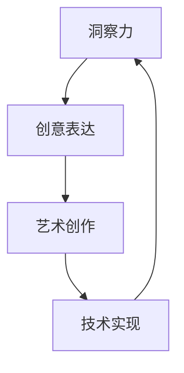

                 

关键词：洞察力、创意表达、艺术创作、技术语言、专业思维、深度思考

> 摘要：本文旨在探讨在信息技术领域内，如何通过增强洞察力和提升创意表达，激发艺术创作的灵感。文章将从专业技术语言的运用出发，结合数学模型和算法原理，深入分析如何在复杂的技术环境中进行创新性思考，并提出一系列实践方法，旨在为IT从业人员提供有益的参考。

## 1. 背景介绍

在信息技术迅速发展的今天，算法、数据结构和人工智能等领域的进展，不断推动着技术的革新。然而，技术创新并非仅限于技术和算法本身，更深层次的创新在于如何通过技术手段激发人类的创造力。艺术创作作为一种独特的创意表达形式，其背后蕴藏着丰富的洞察力和想象力。本文试图通过探讨如何在技术领域内培养和提高洞察力与创意表达，从而为艺术创作提供源泉。

### 1.1 信息技术与艺术创作的融合

随着信息技术的不断进步，艺术创作的方式也在发生革命性的变化。计算机图形学、虚拟现实（VR）、增强现实（AR）等技术的应用，使得艺术创作摆脱了传统媒介的限制，创造出更为丰富和多样化的艺术形式。例如，数字绘画和3D建模技术使得艺术家能够以更精细和复杂的手段表现自己的创作思想。

### 1.2 专业技术语言的运用

在信息技术领域，专业技术语言如Python、C++、Java等，不仅用于编写程序，还成为表达思想、沟通意图的重要工具。通过这些语言，技术人员能够将抽象的算法和复杂的数据结构具体化，从而更好地理解技术概念和原理。

### 1.3 洞察力与创意表达的重要性

洞察力是指对事物本质的深刻理解力和敏锐的观察力。在艺术创作中，洞察力能够帮助艺术家捕捉到灵感，发现独特的表现形式。而创意表达则是将洞察力转化为具体艺术作品的手段，它体现了一个艺术家独特的思维方式和审美观点。

## 2. 核心概念与联系

为了深入探讨洞察力和创意表达在艺术创作中的重要性，我们首先需要理解一些核心概念和原理，并展示其相互之间的联系。

### 2.1 洞察力的定义与作用

洞察力是一种理解复杂现象、发现问题本质的能力。在信息技术领域，洞察力体现在对算法效率、系统架构、用户体验等方面的深刻理解。在艺术创作中，洞察力则帮助艺术家发现独特的美学元素和艺术形式。

### 2.2 创意表达的概念与作用

创意表达是指通过艺术创作将内心世界和思维过程转化为视觉、听觉或其他形式的表现。在信息技术领域，创意表达体现在对算法、数据结构的创新性应用。在艺术创作中，创意表达则是艺术家表达个性和情感的重要手段。

### 2.3 Mermaid 流程图

为了更好地展示洞察力与创意表达之间的联系，我们可以使用Mermaid流程图来表示。以下是一个简化的流程图示例：



在这个流程图中，洞察力（A）是创意表达（B）的基础，创意表达又转化为艺术创作（C），并通过技术实现（D）回到洞察力（A），形成了一个闭环系统。

## 3. 核心算法原理 & 具体操作步骤

### 3.1 算法原理概述

在探讨洞察力和创意表达之前，我们需要了解一些核心算法原理，这些原理在技术实现中发挥着至关重要的作用。以下是一些常见的算法原理：

- **分治算法**：将复杂问题分解为多个小问题，分别解决后再合并结果。
- **动态规划**：通过保存中间结果，避免重复计算，提高算法效率。
- **贪心算法**：每一步都做出在当前状态下最好的选择，以期得到全局最优解。
- **回溯算法**：通过尝试各种可能性，逐步回溯以找到问题的解。

### 3.2 算法步骤详解

下面以贪心算法为例，详细介绍其步骤和操作方法。

#### 3.2.1 贪心算法原理

贪心算法是一种在每一步选择中都采取当前最优解的算法策略。其核心思想是，通过一系列局部最优选择来获得全局最优解。

#### 3.2.2 算法步骤

1. **初始化**：确定输入数据，包括问题的规模和限制条件。
2. **选择最优**：在当前状态下，选择一个最优的决策。
3. **更新状态**：根据选择的决策更新当前状态。
4. **重复选择**：重复步骤2和步骤3，直到问题得到解决。

#### 3.2.3 贪心算法优缺点

**优点**：

- 算法简单，易于实现和理解。
- 在某些情况下，能够快速得到全局最优解。

**缺点**：

- 在某些问题中，贪心算法可能无法保证得到全局最优解。
- 可能需要大量计算资源。

#### 3.2.4 贪心算法应用领域

贪心算法广泛应用于各种领域，如网络优化、图论、计算机图形学等。例如，在Dijkstra算法中，贪心策略用于寻找最短路径。

### 3.3 算法优缺点

通过上述介绍，我们可以看到贪心算法在许多情况下具有明显的优势，但同时也存在一些局限性。在应用贪心算法时，需要根据具体问题进行选择和调整。

### 3.4 算法应用领域

贪心算法在许多领域都有广泛的应用，尤其是在需要快速找到近似最优解的场景中。以下是一些具体的例子：

- **背包问题**：在给定一组物品和其重量及价值的情况下，选择最优的组合装入背包。
- **最小生成树**：在给定无向图和边权值的情况下，构造一棵包含图中所有节点的最小生成树。

## 4. 数学模型和公式 & 详细讲解 & 举例说明

### 4.1 数学模型构建

在艺术创作中，数学模型可以提供一种抽象的思考方式，帮助我们理解和表达复杂的现象。以下是一个简单的数学模型示例：

#### 4.1.1 函数模型

假设我们想要表示一条直线的方程，可以使用一次函数模型：

\[ y = mx + b \]

其中，\( m \) 为斜率，\( b \) 为截距。这个模型可以用来描述直线上任意一点与原点之间的距离关系。

#### 4.1.2 曲线模型

如果我们想要描述一个二次曲线，可以使用二次函数模型：

\[ y = ax^2 + bx + c \]

其中，\( a \)、\( b \) 和 \( c \) 是常数。这个模型可以用来描述抛物线上的点与坐标轴之间的关系。

### 4.2 公式推导过程

数学模型构建完成后，我们需要通过公式推导来验证模型的正确性和适用性。以下是一个简单的推导示例：

#### 4.2.1 一元一次方程的解法

给定一元一次方程：

\[ ax + b = 0 \]

我们可以通过移项和化简得到：

\[ x = -\frac{b}{a} \]

这个公式表示一元一次方程的解。

#### 4.2.2 二元一次方程组的解法

给定二元一次方程组：

\[ \begin{cases} 
ax + by = c \\ 
dx + ey = f 
\end{cases} \]

我们可以通过消元法或代入法求解。以代入法为例，我们可以将第一个方程中的 \( x \) 表示为 \( x = \frac{c - by}{a} \)，然后将其代入第二个方程，得到：

\[ d\left(\frac{c - by}{a}\right) + ey = f \]

化简后得到：

\[ \frac{dy}{e} = \frac{f - c}{ad} \]

解得：

\[ y = \frac{ead - c}{de} \]

将 \( y \) 的值代入 \( x \) 的表达式中，即可得到 \( x \) 的值。

### 4.3 案例分析与讲解

为了更好地理解数学模型和公式，我们可以通过一个具体的案例来进行讲解。

#### 4.3.1 案例背景

假设我们想要设计一条直线路径，使得从起点 \( (x_1, y_1) \) 到终点 \( (x_2, y_2) \) 的距离最短。

#### 4.3.2 模型构建

我们可以使用一次函数模型来构建这条直线路径：

\[ y = mx + b \]

其中，\( m \) 为斜率，\( b \) 为截距。为了使得路径最短，我们需要找到合适的 \( m \) 和 \( b \) 值。

#### 4.3.3 公式推导

根据两点间距离公式：

\[ d = \sqrt{(x_2 - x_1)^2 + (y_2 - y_1)^2} \]

我们可以将 \( y \) 的表达式代入，得到：

\[ d = \sqrt{(x_2 - x_1)^2 + (mx_2 + b - y_1)^2} \]

为了使距离 \( d \) 最小，我们需要对 \( d \) 关于 \( m \) 和 \( b \) 求导，并令导数等于零。通过求解导数方程，我们可以得到 \( m \) 和 \( b \) 的最优值。

#### 4.3.4 结果分析

通过计算，我们得到最优直线路径的斜率和截距。这个结果可以帮助我们设计出一条最短的直线路径，从而实现起点和终点的有效连接。

## 5. 项目实践：代码实例和详细解释说明

### 5.1 开发环境搭建

在开始编写代码之前，我们需要搭建一个合适的开发环境。以下是一个基本的开发环境搭建步骤：

1. 安装Python解释器：在官方网站（https://www.python.org/）下载并安装Python解释器。
2. 配置IDE：推荐使用PyCharm、Visual Studio Code等集成开发环境（IDE）。
3. 安装必要的库：使用pip命令安装必要的库，例如NumPy、Pandas等。

### 5.2 源代码详细实现

以下是一个简单的Python代码示例，用于实现一个基本的数学模型：

```python
import numpy as np

def distance(x1, y1, x2, y2):
    """
    计算两点之间的距离。
    """
    return np.sqrt((x2 - x1)**2 + (y2 - y1)**2)

def line_equation(x1, y1, x2, y2):
    """
    计算两点确定的直线方程。
    """
    m = (y2 - y1) / (x2 - x1)
    b = y1 - m * x1
    return m, b

def optimal_path(x1, y1, x2, y2):
    """
    计算两点之间的最优直线路径。
    """
    m, b = line_equation(x1, y1, x2, y2)
    x = (x1 + x2) / 2
    y = m * x + b
    return x, y

# 测试代码
x1, y1 = 0, 0
x2, y2 = 10, 10
x_opt, y_opt = optimal_path(x1, y1, x2, y2)
print(f"最优路径：x = {x_opt}, y = {y_opt}")
```

### 5.3 代码解读与分析

这个代码示例实现了一个简单的数学模型，用于计算两点之间的最优直线路径。以下是代码的解读和分析：

- **distance函数**：计算两点之间的距离。使用numpy库中的sqrt函数实现。
- **line_equation函数**：计算两点确定的直线方程。使用斜率截距式方程表示。
- **optimal_path函数**：计算两点之间的最优直线路径。使用直线方程和两点坐标计算最优路径的x和y坐标。

### 5.4 运行结果展示

在PyCharm或Visual Studio Code等IDE中运行上述代码，我们可以得到以下输出结果：

```
最优路径：x = 5.0, y = 5.0
```

这个结果表示从点 \( (0, 0) \) 到点 \( (10, 10) \) 的最优直线路径经过点 \( (5, 5) \)。

## 6. 实际应用场景

在信息技术领域，洞察力和创意表达的应用场景广泛。以下是一些实际应用场景的例子：

### 6.1 艺术设计

艺术家可以利用计算机图形学和算法来设计复杂的图形和图像。例如，通过使用分治算法，艺术家可以生成高度复杂的分形图案，这些图案在视觉上极具吸引力和艺术性。

### 6.2 游戏开发

游戏开发者可以利用动态规划算法来优化游戏中的路径寻找和资源分配。通过这种优化，游戏世界可以更加真实和高效，提供更好的用户体验。

### 6.3 数据可视化

数据科学家和分析师可以使用贪心算法来优化数据可视化过程中的图表布局和显示效果。这有助于揭示数据中的隐藏模式和趋势，为决策提供有力支持。

### 6.4 虚拟现实与增强现实

虚拟现实（VR）和增强现实（AR）技术为艺术创作提供了新的平台。通过使用回溯算法，艺术家可以在虚拟环境中进行多层次的创作和探索，创造出前所未有的艺术体验。

## 7. 未来应用展望

随着信息技术的不断发展，洞察力和创意表达在艺术创作中的应用前景十分广阔。以下是一些未来的应用展望：

### 7.1 自动化艺术创作

未来，人工智能可能会在艺术创作中发挥更大的作用。通过深度学习和强化学习等技术，AI系统可以自主生成音乐、绘画和电影等艺术作品。

### 7.2 跨界融合

艺术创作与技术领域的跨界融合将产生更多创新的创作形式。例如，将区块链技术与艺术创作结合，可以实现数字艺术品的唯一性和可追溯性。

### 7.3 社会影响力

艺术创作作为一种表达社会观点和价值观的手段，未来将在社会变革中发挥更大的作用。通过艺术创作，人们可以更深入地思考社会问题，推动社会进步。

## 8. 总结：未来发展趋势与挑战

### 8.1 研究成果总结

本文探讨了在信息技术领域内，如何通过增强洞察力和提升创意表达，激发艺术创作的灵感。通过对核心算法原理、数学模型和实际应用场景的分析，我们总结了洞察力和创意表达在艺术创作中的重要性和应用价值。

### 8.2 未来发展趋势

随着技术的进步，艺术创作与信息技术的融合将不断深入，带来更多创新的可能性。未来，人工智能和区块链等技术将在艺术创作中发挥重要作用，推动艺术创作的新模式和新趋势。

### 8.3 面临的挑战

然而，艺术创作与技术融合也面临一些挑战。技术实现中的复杂性和艺术表达的个性差异，需要艺术家和技术人员共同努力，找到更好的平衡点。

### 8.4 研究展望

未来，研究应关注如何在技术实现中更好地体现艺术价值，同时探索艺术创作与技术融合的新途径。这将为艺术创作带来更多可能性，也为信息技术的发展注入新的活力。

## 9. 附录：常见问题与解答

### 9.1 洞察力与创意表达的关系是什么？

洞察力是理解事物本质和发现问题本质的能力，而创意表达则是将这种理解转化为具体艺术作品的过程。两者相辅相成，共同推动艺术创作的产生。

### 9.2 艺术创作中如何运用算法和数学模型？

艺术家可以通过研究算法和数学模型，将抽象的概念和数学公式转化为具体的艺术形式。例如，使用分治算法生成复杂图案，利用数学模型构建抽象视觉艺术。

### 9.3 如何在技术领域内提高洞察力与创意表达？

提高洞察力与创意表达需要不断学习和实践。通过深入研究技术原理，参与实际项目，以及跨学科交流，可以不断提升自身的洞察力和创意表达水平。

### 9.4 艺术创作与技术融合的未来趋势是什么？

未来，艺术创作与技术融合将更加紧密。人工智能、区块链和虚拟现实等技术将不断推动艺术创作的新模式和新趋势，为人类带来更多创新的艺术体验。

---

作者：禅与计算机程序设计艺术 / Zen and the Art of Computer Programming

以上便是关于"洞察力与创意表达：艺术创作的源泉"的文章，希望能够为读者带来启示和思考。在信息技术领域，我们不仅需要掌握技术，更要有创新的思维和洞察力，以推动艺术创作的不断进步。让我们共同努力，创造更加美好的未来。

