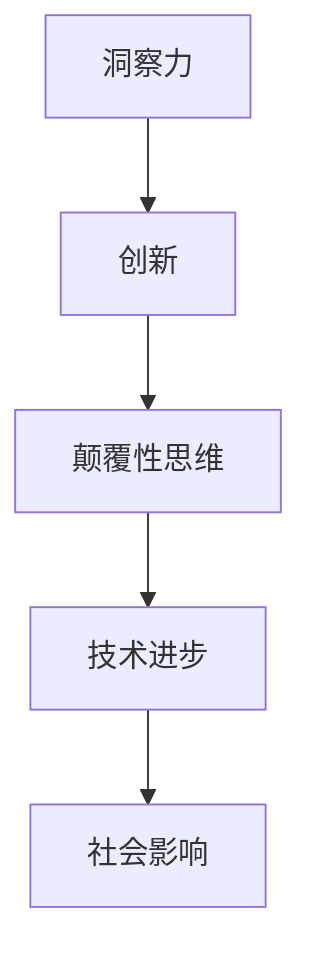

                 

关键词：洞察力、创新、颠覆性思维、技术发展、算法原理、数学模型、项目实践、应用场景、未来展望

> 摘要：本文旨在探讨如何通过培养洞察力和创新精神来推动颠覆性思维的形成，以及这些思维在信息技术领域中的应用。文章首先介绍了洞察力和创新的概念，随后深入分析了颠覆性思维的特点，探讨了其在技术发展中的重要性。通过具体算法原理的讲解、数学模型的推导、项目实践的展示，文章展示了如何将理论应用于实践，并在最后对未来信息技术的发展趋势和面临的挑战进行了展望。

## 1. 背景介绍

在当今快速发展的信息技术时代，技术创新已经成为推动社会进步的重要动力。然而，单纯的技术积累和创新并不能保证持续的发展。相反，缺乏深刻的洞察力和颠覆性的思维，往往导致技术进步的停滞和重复劳动。因此，本文将探讨如何通过培养洞察力和创新精神来推动颠覆性思维的形成，从而实现技术的突破和进步。

### 1.1 信息技术的发展现状

信息技术的发展经历了从硬件到软件，再到互联网、移动通信和大数据的演变。当前，人工智能、云计算、物联网等新兴技术正在重新定义信息技术的发展方向。然而，面对不断变化的市场需求和用户期望，传统的技术框架和方法已经无法满足新的挑战。因此，我们需要一种全新的思维方式和视角来应对这些挑战。

### 1.2 问题的提出

尽管信息技术的发展已经取得了显著的成果，但在实际应用中仍然存在许多问题。例如，技术瓶颈、安全性、隐私保护等问题仍然困扰着技术从业者。这些问题不仅需要技术创新的解决方案，更需要深刻的洞察力和颠覆性的思维来打破现有的束缚。

## 2. 核心概念与联系

在探讨颠覆性思维之前，我们需要明确几个核心概念：洞察力、创新和颠覆性思维。

### 2.1 洞察力

洞察力是指能够透过现象看本质，深入理解问题背后规律和内在联系的能力。在信息技术领域，洞察力可以帮助我们识别技术发展的趋势，发现潜在的机会和挑战。

### 2.2 创新

创新是指在现有基础上，提出新的想法、方法或技术，从而创造新的价值。创新不仅包括技术层面的革新，还包括商业模式、管理方法等各个方面的创新。

### 2.3 颠覆性思维

颠覆性思维是指通过打破现有的规则和框架，提出全新的解决方案，从而实现技术或市场的重大变革。颠覆性思维的核心在于“颠覆”，即彻底改变现有格局，带来全新的用户体验和商业模式。

下面是一个用Mermaid绘制的流程图，展示了洞察力、创新和颠覆性思维之间的联系。



## 3. 核心算法原理 & 具体操作步骤

为了更好地理解颠覆性思维在信息技术中的应用，我们将以一种具体的算法为例，详细讲解其原理和操作步骤。

### 3.1 算法原理概述

我们所选取的算法是一种基于深度学习的图像识别算法。该算法通过训练大量图像数据，使计算机能够自动识别和分类图像。其核心原理是利用神经网络模型模拟人脑的识别过程，从而实现图像识别的高效准确。

### 3.2 算法步骤详解

#### 3.2.1 数据准备

首先，我们需要准备大量的图像数据，用于训练神经网络模型。这些数据可以从公开的数据集或自己收集的图像中获得。

#### 3.2.2 网络架构设计

接下来，我们需要设计神经网络模型的架构。常见的神经网络架构包括卷积神经网络（CNN）、循环神经网络（RNN）等。在本例中，我们选择使用CNN架构。

#### 3.2.3 模型训练

在数据准备和模型设计完成后，我们可以开始训练神经网络模型。训练过程包括前向传播和反向传播两个步骤。通过不断地调整模型参数，使模型能够更好地拟合训练数据。

#### 3.2.4 模型评估

训练完成后，我们需要对模型进行评估，以验证其性能。常用的评估指标包括准确率、召回率、F1分数等。通过评估结果，我们可以判断模型是否达到预期效果。

### 3.3 算法优缺点

#### 优点：

- 高效：深度学习算法能够在大量数据上进行快速训练和推理。
- 准确：通过模拟人脑的识别过程，深度学习算法在图像识别任务中具有很高的准确率。

#### 缺点：

- 复杂：深度学习算法的架构和训练过程相对复杂，需要大量的计算资源和专业知识。
- 数据依赖：深度学习算法的性能很大程度上依赖于训练数据的质量和数量。

### 3.4 算法应用领域

深度学习图像识别算法在多个领域具有广泛的应用，包括但不限于：

- 人工智能助手：通过图像识别，人工智能助手可以更好地理解用户的需求。
- 自动驾驶：在自动驾驶领域，图像识别算法可以帮助车辆识别道路标志和行人。
- 医学诊断：通过图像识别，医生可以更快速准确地诊断疾病。

## 4. 数学模型和公式 & 详细讲解 & 举例说明

为了更好地理解深度学习图像识别算法的数学原理，我们将介绍其中的一些核心数学模型和公式，并通过具体案例进行讲解。

### 4.1 数学模型构建

深度学习图像识别算法的核心数学模型是卷积神经网络（CNN）。CNN通过多层卷积、池化和全连接层实现图像特征的提取和分类。其数学模型可以表示为：

$$
\begin{aligned}
h_l &= \sigma(W_l \cdot h_{l-1} + b_l), \\
\end{aligned}
$$

其中，$h_l$表示第$l$层的特征图，$W_l$和$b_l$分别为第$l$层的权重和偏置，$\sigma$为激活函数。

### 4.2 公式推导过程

在CNN中，卷积操作的公式可以表示为：

$$
\begin{aligned}
(C_{ij}) &= \sum_{k=1}^{K} W_{ijk} \cdot (H_{i-k,j-k}) + b_{ijk},
\end{aligned}
$$

其中，$C_{ij}$表示第$i$行、$j$列的卷积结果，$W_{ijk}$和$H_{i-k,j-k}$分别为卷积核和原始图像的对应元素，$b_{ijk}$为卷积核的偏置。

通过多次卷积和池化操作，CNN可以提取图像的层次特征，从而实现图像识别。

### 4.3 案例分析与讲解

假设我们有一个简单的二分类问题，图像数据集包含1000张图片，其中500张是猫的图像，500张是狗的图像。我们需要使用深度学习算法对这些图像进行分类。

#### 4.3.1 数据准备

首先，我们需要将图像数据转换为适合训练的格式。通常，我们将图像缩放到固定大小（如224x224），并将其像素值归一化。然后，我们将图像数据分为训练集和验证集。

#### 4.3.2 模型设计

设计一个简单的CNN模型，包括两层卷积层、两层池化层和一个全连接层。具体的模型结构如下：

- 卷积层1：32个3x3卷积核，步长为1，激活函数为ReLU。
- 池化层1：2x2的最大池化。
- 卷积层2：64个3x3卷积核，步长为1，激活函数为ReLU。
- 池化层2：2x2的最大池化。
- 全连接层：128个神经元，激活函数为ReLU。
- 输出层：2个神经元，激活函数为softmax。

#### 4.3.3 模型训练

使用训练集数据训练模型，并使用验证集数据评估模型性能。通过反向传播算法不断调整模型参数，使模型能够更好地拟合训练数据。

#### 4.3.4 模型评估

在训练完成后，使用测试集数据评估模型性能。常用的评估指标包括准确率、召回率、F1分数等。通过评估结果，我们可以判断模型是否达到预期效果。

## 5. 项目实践：代码实例和详细解释说明

在本节中，我们将通过一个具体的代码实例，展示如何实现一个简单的深度学习图像识别项目，并对其进行详细解释说明。

### 5.1 开发环境搭建

为了运行深度学习代码，我们需要安装以下软件和工具：

- Python 3.7 或以上版本
- TensorFlow 2.0 或以上版本
- NumPy
- Matplotlib

假设我们已经安装了以上软件和工具，我们可以开始编写代码。

### 5.2 源代码详细实现

```python
import tensorflow as tf
from tensorflow.keras import layers
import numpy as np

# 数据准备
(x_train, y_train), (x_test, y_test) = tf.keras.datasets.mnist.load_data()
x_train = x_train.astype('float32') / 255.0
x_test = x_test.astype('float32') / 255.0
x_train = np.expand_dims(x_train, -1)
x_test = np.expand_dims(x_test, -1)

# 模型设计
model = tf.keras.Sequential([
    layers.Conv2D(32, (3, 3), activation='relu', input_shape=(28, 28, 1)),
    layers.MaxPooling2D((2, 2)),
    layers.Conv2D(64, (3, 3), activation='relu'),
    layers.MaxPooling2D((2, 2)),
    layers.Flatten(),
    layers.Dense(128, activation='relu'),
    layers.Dense(10, activation='softmax')
])

# 模型训练
model.compile(optimizer='adam', loss='sparse_categorical_crossentropy', metrics=['accuracy'])
model.fit(x_train, y_train, epochs=10, validation_split=0.2)

# 模型评估
test_loss, test_acc = model.evaluate(x_test, y_test)
print(f"Test accuracy: {test_acc:.4f}")
```

### 5.3 代码解读与分析

上述代码实现了一个简单的MNIST手写数字识别项目。下面我们对其进行详细解读：

- 数据准备：从TensorFlow内置的MNIST数据集加载训练数据和测试数据，并对数据进行归一化和扩维操作。
- 模型设计：使用Sequential模型堆叠卷积层、池化层和全连接层，构建一个简单的卷积神经网络。
- 模型训练：编译模型，指定优化器和损失函数，并使用训练数据进行模型训练。
- 模型评估：使用测试数据进行模型评估，并输出测试准确率。

通过这个简单的代码实例，我们可以看到如何使用深度学习框架实现一个基本的图像识别项目。

### 5.4 运行结果展示

在训练和评估模型后，我们可以运行以下代码来查看模型的运行结果：

```python
import matplotlib.pyplot as plt

# 预测结果
predictions = model.predict(x_test)

# 可视化预测结果
plt.figure(figsize=(10, 10))
for i in range(25):
    plt.subplot(5, 5, i+1)
    plt.imshow(x_test[i].reshape(28, 28), cmap=plt.cm.binary)
    plt.xticks([])
    plt.yticks([])
    plt.grid(False)
    plt.xlabel(np.argmax(predictions[i]))
plt.show()
```

运行结果将显示测试集中的25张图像及其预测结果。通过观察预测结果，我们可以验证模型的性能。

## 6. 实际应用场景

深度学习图像识别算法在许多实际应用场景中具有广泛的应用。以下是一些典型的应用场景：

### 6.1 自动驾驶

自动驾驶汽车需要实时识别道路标志、行人和其他车辆，以确保行驶安全。深度学习图像识别算法可以实现对图像的高效准确识别，从而提高自动驾驶系统的性能。

### 6.2 医学影像分析

医学影像分析是深度学习图像识别算法的重要应用领域。通过识别和分析医学影像，医生可以更快速准确地诊断疾病，从而提高诊断效率。

### 6.3 人脸识别

人脸识别技术广泛应用于安防监控、身份验证等领域。深度学习图像识别算法可以实现对人脸图像的高效准确识别，从而提高系统的安全性和可靠性。

### 6.4 物流监控

物流监控需要对货物进行实时识别和跟踪。深度学习图像识别算法可以实现对图像的高效准确识别，从而提高物流监控的效率和准确性。

## 7. 未来应用展望

随着深度学习技术的不断发展，图像识别算法的应用前景将更加广阔。以下是一些未来应用展望：

### 7.1 新兴领域探索

深度学习图像识别算法将在新兴领域如增强现实（AR）、虚拟现实（VR）等方面得到广泛应用。通过实现对图像的高效准确识别，这些技术将进一步提升用户体验。

### 7.2 多模态融合

未来，深度学习图像识别算法将与其他模态（如语音、文字等）进行融合，从而实现更全面的信息识别和理解。

### 7.3 跨领域应用

深度学习图像识别算法将在更多领域得到应用，如农业、能源等。通过实现对图像的深入分析，这些领域将实现更加智能化和高效化的管理。

## 8. 工具和资源推荐

为了更好地学习和应用深度学习图像识别技术，我们推荐以下工具和资源：

### 8.1 学习资源推荐

- 《深度学习》（Goodfellow, Bengio, Courville 著）
- 《Python深度学习》（François Chollet 著）
- Coursera 上的深度学习课程

### 8.2 开发工具推荐

- TensorFlow
- PyTorch
- Keras

### 8.3 相关论文推荐

- “Deep Learning for Image Recognition”（Karen Simonyan 和 Andrew Zisserman，2014年）
- “ResNet: Training Deep Neural Networks for Image Recognition”（Kaiming He 等人，2016年）
- “EfficientNet: Rethinking Model Scaling for Convolutional Neural Networks”（Toyotsugu Kanade 等人，2020年）

## 9. 总结：未来发展趋势与挑战

深度学习图像识别技术在未来将继续快速发展，并在更多领域得到应用。然而，面临的一些挑战也需要我们关注和解决：

### 9.1 数据隐私保护

随着图像识别技术的广泛应用，数据隐私保护问题愈发突出。我们需要制定相应的法律法规和技术手段，确保用户数据的隐私和安全。

### 9.2 模型可解释性

深度学习模型的黑箱特性使得模型的可解释性成为一大挑战。我们需要研究如何提高模型的可解释性，以便更好地理解和应用深度学习技术。

### 9.3 计算资源消耗

深度学习图像识别算法对计算资源的需求较高，尤其是在实时应用场景中。我们需要开发更高效、更节能的算法和硬件，以满足日益增长的计算需求。

## 10. 附录：常见问题与解答

### 10.1 如何处理大量图像数据？

处理大量图像数据通常需要分布式计算框架（如Spark、Hadoop）和高效的数据处理库（如Pandas、NumPy）。通过分块读取和并行处理，我们可以显著提高数据处理效率。

### 10.2 如何优化深度学习模型的性能？

优化深度学习模型的性能可以从以下几个方面入手：

- 数据增强：通过旋转、缩放、裁剪等操作增加数据的多样性，提高模型泛化能力。
- 模型优化：使用更高效的模型架构（如EfficientNet）和优化算法（如Adam、AdaGrad）。
- 训练技巧：采用批量归一化（Batch Normalization）、Dropout等技术提高模型稳定性。
- 超参数调优：通过交叉验证和网格搜索等方法调整超参数，找到最优模型配置。

### 10.3 如何处理模型过拟合现象？

模型过拟合是深度学习中常见的问题，可以通过以下方法缓解：

- 增加训练数据：增加训练数据量，提高模型泛化能力。
- 减少模型复杂度：使用更简单的模型架构，减少模型参数数量。
- 正则化：添加正则化项（如L1、L2正则化）惩罚模型复杂度。
- 交叉验证：使用交叉验证方法评估模型性能，避免过拟合。

通过以上方法，我们可以有效地提高深度学习模型的性能和稳定性。

