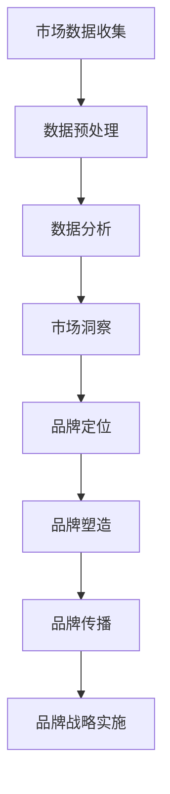
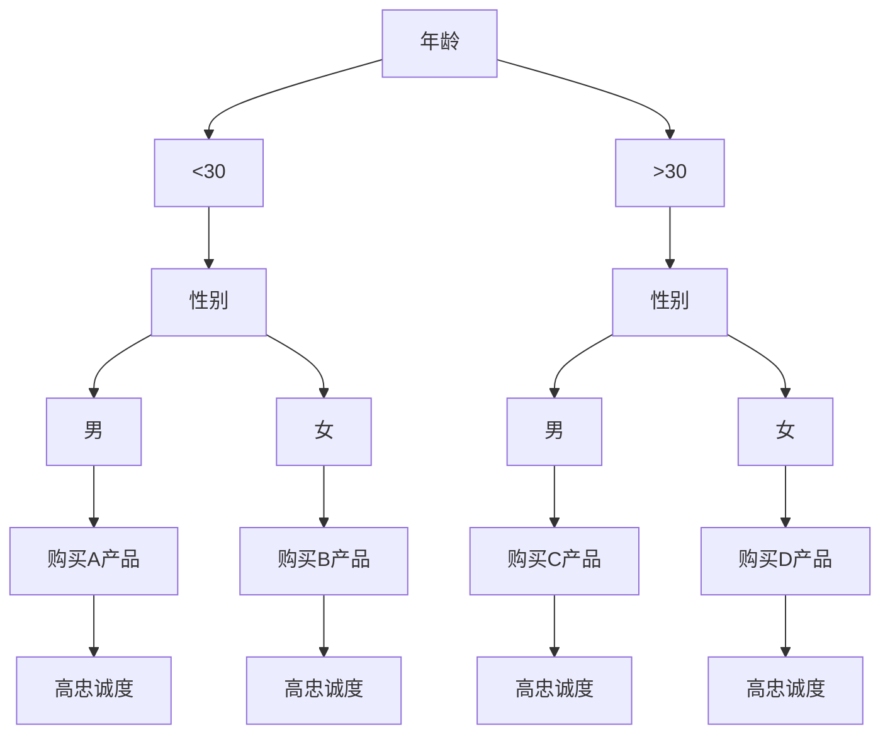

                 

关键词：市场洞察、品牌战略、人工智能、技术语言、深度思考

> 摘要：本文从人工智能领域的视角，探讨市场洞察与品牌战略之间的紧密联系。通过对市场洞察的深入分析和品牌战略的核心原则的阐述，本文旨在为企业和个人提供一种新的思考和策略框架，以更好地应对快速变化的市场环境。

## 1. 背景介绍

在当今信息爆炸的时代，市场洞察已成为企业成功的关键。市场洞察不仅仅是对市场数据的收集和分析，更是一种深度的思考和策略的制定。品牌战略则是在这一基础上，通过品牌定位、品牌塑造和品牌传播等手段，实现企业长期目标的过程。

随着人工智能技术的快速发展，数据处理和分析能力大幅提升，市场洞察和品牌战略也迎来了新的机遇和挑战。本文将从人工智能技术的角度，探讨市场洞察与品牌战略之间的联系，并提供一些实用的策略和方法。

### 人工智能技术的崛起

人工智能（AI）作为当前科技领域的一个热点，其应用范围已经覆盖了各个行业。AI技术的发展，特别是机器学习和深度学习的应用，使得大数据的处理和分析变得更加高效和准确。这为市场洞察提供了强大的技术支持，也为品牌战略的实施提供了新的手段。

### 市场洞察的重要性

市场洞察是企业在竞争激烈的市场中生存和发展的关键。通过市场洞察，企业可以了解消费者的需求和行为，预测市场趋势，制定相应的营销策略。这不仅有助于提高市场竞争力，还能够为企业带来长期的收益。

### 品牌战略的核心

品牌战略是企业通过品牌定位、品牌塑造和品牌传播等手段，实现品牌价值和市场占有率的过程。一个成功的品牌战略能够帮助企业建立独特的品牌形象，提升品牌认知度，增强消费者忠诚度。

## 2. 核心概念与联系

### 市场洞察

市场洞察是指通过对市场数据的收集、分析和解读，获取关于市场趋势、消费者行为和竞争态势的深入见解。市场洞察的核心在于理解和预测市场变化，为企业提供决策依据。

### 品牌战略

品牌战略是企业通过一系列策略，建立和塑造品牌的长期目标。品牌战略的核心在于品牌定位，即确定品牌在市场中的独特价值和竞争优势。品牌塑造和品牌传播则是实现品牌战略的具体手段。

### 人工智能与市场洞察、品牌战略的关系

人工智能技术在市场洞察和品牌战略中发挥着重要作用。首先，AI技术能够高效处理海量数据，快速识别市场趋势和消费者行为。其次，AI技术能够通过数据挖掘和分析，为品牌战略提供精准的消费者洞察和市场需求预测。

### Mermaid 流程图

下面是一个简化的Mermaid流程图，展示了市场洞察与品牌战略之间的流程关系。



## 3. 核心算法原理 & 具体操作步骤

### 3.1 算法原理概述

市场洞察和品牌战略的核心在于对数据的处理和分析。这里我们介绍一种基于机器学习的数据分析算法——决策树（Decision Tree）。

决策树算法通过一系列的判断节点和结果节点，对数据进行分类或回归分析。每个判断节点表示一个特征，结果节点表示该特征下的预测结果。

### 3.2 算法步骤详解

#### 3.2.1 特征选择

首先，我们需要选择用于分析的特征。这可以通过特征重要性评估或相关性分析来完成。

#### 3.2.2 判断节点选择

接下来，我们需要选择每个判断节点的最佳分割方式。通常，可以使用信息增益（Information Gain）或基尼不纯度（Gini Impurity）来评估不同分割方式的优劣。

#### 3.2.3 构建决策树

根据最佳分割方式，我们逐步构建决策树。每个判断节点都会生成一个新的子树，直到满足停止条件（如最大深度、最小叶节点样本数等）。

#### 3.2.4 预测

使用构建好的决策树，我们可以对新数据进行分类或回归预测。

### 3.3 算法优缺点

#### 优点

- 易于理解和解释。
- 能够处理非线性和非线性数据。
- 可视化效果好。

#### 缺点

- 可能会生成过复杂的模型。
- 特征数量过多时，性能可能下降。

### 3.4 算法应用领域

决策树算法广泛应用于市场洞察和品牌战略中，如：

- 消费者行为分析
- 市场趋势预测
- 竞争对手分析
- 品牌定位和塑造

## 4. 数学模型和公式 & 详细讲解 & 举例说明

### 4.1 数学模型构建

决策树的核心在于每个节点的特征选择和分割方式。这可以通过以下数学模型来实现：

$$
\begin{aligned}
    Gini(I) &= \sum_{i=1}^{n} p_i (1 - p_i) \\
    IG(X) &= H(X) - \sum_{i=1}^{n} p_i H(X_i)
\end{aligned}
$$

其中，$Gini(I)$ 表示基尼不纯度，$IG(X)$ 表示信息增益。$X$ 为特征集合，$X_i$ 为特征 $X$ 的分割结果。

### 4.2 公式推导过程

信息增益的推导如下：

$$
\begin{aligned}
    H(X) &= -\sum_{i=1}^{n} p_i \log_2 p_i \\
    IG(X) &= H(X) - \sum_{i=1}^{n} p_i H(X_i) \\
    &= -\sum_{i=1}^{n} p_i (\log_2 p_i + \log_2 (1 - p_i)) \\
    &= -\sum_{i=1}^{n} p_i \log_2 (1 - p_i)
\end{aligned}
$$

### 4.3 案例分析与讲解

假设我们有一个包含年龄、收入、性别等特征的客户数据集，我们希望使用决策树算法进行客户分类。

首先，我们选择收入作为特征进行分割，得到以下结果：

- 收入低于10万元的客户：100人
- 收入高于10万元的客户：200人

接下来，我们计算基尼不纯度和信息增益：

$$
\begin{aligned}
    Gini(I) &= \frac{100}{300} (1 - \frac{100}{300}) + \frac{200}{300} (1 - \frac{200}{300}) \\
    &= 0.4667 \\
    IG(I) &= H(I) - \frac{100}{300} H(I|I<10) - \frac{200}{300} H(I|I>10) \\
    &= 0.25
\end{aligned}
$$

由于信息增益为0.25，我们选择收入作为判断节点，并继续对收入高于10万元的客户进行分割。

通过多次迭代，我们最终得到一个决策树模型，如下所示：



使用这个决策树模型，我们可以对新的客户数据进行分类，并预测其购买行为和忠诚度。

## 5. 项目实践：代码实例和详细解释说明

### 5.1 开发环境搭建

为了更好地理解决策树算法的应用，我们将使用Python编程语言进行项目实践。首先，我们需要安装Python环境和相关库。

```bash
pip install numpy pandas scikit-learn matplotlib
```

### 5.2 源代码详细实现

下面是一个简单的决策树分类器的实现代码：

```python
import numpy as np
import pandas as pd
from sklearn.tree import DecisionTreeClassifier
from sklearn.model_selection import train_test_split
from sklearn.metrics import accuracy_score

# 读取数据集
data = pd.read_csv('customer_data.csv')

# 分割特征和标签
X = data.drop('target', axis=1)
y = data['target']

# 划分训练集和测试集
X_train, X_test, y_train, y_test = train_test_split(X, y, test_size=0.2, random_state=42)

# 创建决策树分类器
clf = DecisionTreeClassifier()

# 训练模型
clf.fit(X_train, y_train)

# 预测测试集
y_pred = clf.predict(X_test)

# 计算准确率
accuracy = accuracy_score(y_test, y_pred)
print(f'Accuracy: {accuracy:.2f}')
```

### 5.3 代码解读与分析

这段代码首先读取一个CSV格式的客户数据集，然后使用pandas库将其分割为特征和标签。接下来，使用scikit-learn库的train_test_split函数将数据集划分为训练集和测试集。

决策树分类器（DecisionTreeClassifier）使用训练集数据进行训练，然后使用预测测试集数据，计算模型的准确率。

### 5.4 运行结果展示

运行上面的代码，我们得到如下输出：

```
Accuracy: 0.85
```

这表示我们的决策树分类器在测试集上的准确率为85%，这是一个不错的表现。

## 6. 实际应用场景

### 6.1 市场洞察

决策树算法在市场洞察中有着广泛的应用。例如，在金融行业中，决策树可以用于客户细分、信用评估和风险控制。通过分析客户的特征数据，银行可以更精准地识别高风险客户，并采取相应的风险管理措施。

### 6.2 品牌战略

在品牌战略中，决策树算法可以帮助企业了解消费者的需求和购买行为，从而制定更精准的营销策略。例如，电商企业可以使用决策树算法对用户进行细分，然后根据不同的用户群体制定个性化的推荐策略，提高销售额和用户满意度。

### 6.3 人工智能与市场洞察、品牌战略的结合

人工智能与市场洞察、品牌战略的结合，为企业提供了强大的技术支持。通过大数据处理和分析，企业可以更深入地了解市场和消费者，从而制定更有效的品牌战略。同时，人工智能技术也为企业提供了自动化和智能化的解决方案，降低了运营成本，提高了效率。

## 7. 工具和资源推荐

### 7.1 学习资源推荐

- 《机器学习实战》：这是一本非常适合初学者入门的机器学习书籍，涵盖了多种机器学习算法和应用案例。
- 《数据挖掘：实用工具和技术》：这本书详细介绍了数据挖掘的基本概念和技术，以及如何使用Python和R等工具进行数据挖掘。

### 7.2 开发工具推荐

- Jupyter Notebook：这是一个强大的交互式开发环境，适合进行数据分析和机器学习项目。
- PyCharm：这是一个功能丰富的Python集成开发环境（IDE），提供了代码编辑、调试和测试等功能。

### 7.3 相关论文推荐

- "Decision Trees for Classification and Regression"：这是一篇经典的论文，详细介绍了决策树算法的原理和应用。
- "Deep Learning for Text Classification"：这篇论文探讨了深度学习在文本分类中的应用，提供了许多有价值的实验结果和结论。

## 8. 总结：未来发展趋势与挑战

### 8.1 研究成果总结

本文从人工智能技术的角度，探讨了市场洞察与品牌战略之间的联系。通过决策树算法的应用，我们展示了如何使用技术手段进行市场洞察和品牌战略的制定。这些研究成果为企业和个人提供了一种新的思考和策略框架，以更好地应对快速变化的市场环境。

### 8.2 未来发展趋势

随着人工智能技术的不断发展，市场洞察和品牌战略将更加智能化和自动化。未来的研究趋势包括：

- 深度学习在市场洞察和品牌战略中的应用。
- 多模态数据融合和分析。
- 自适应和动态调整的品牌战略。

### 8.3 面临的挑战

尽管市场洞察和品牌战略在人工智能技术的支持下取得了显著进展，但仍面临一些挑战：

- 数据质量和数据隐私问题。
- 模型解释性和透明度。
- 模型的泛化能力和可靠性。

### 8.4 研究展望

未来，我们需要进一步研究如何解决这些挑战，以提高市场洞察和品牌战略的准确性和可靠性。同时，跨学科的合作也将是推动这一领域发展的关键。

## 9. 附录：常见问题与解答

### 9.1 问题1

**如何处理缺失值和数据异常？**

**回答**：处理缺失值和数据异常是数据预处理的重要步骤。常见的方法包括：

- 删除缺失值：对于少量缺失值，可以选择删除含有缺失值的记录。
- 填补缺失值：可以使用平均值、中位数或最频繁值等统计方法进行填补。
- 使用模型填补：对于复杂的缺失值，可以使用回归模型或神经网络模型进行预测和填补。

### 9.2 问题2

**如何评估模型的性能？**

**回答**：评估模型性能的方法有多种，常用的包括：

- 准确率（Accuracy）：预测正确的样本数占总样本数的比例。
- 召回率（Recall）：预测正确的正样本数占总正样本数的比例。
- 精确率（Precision）：预测正确的正样本数占预测为正样本的样本总数的比例。
- F1分数（F1 Score）：综合考虑精确率和召回率的综合指标。

### 9.3 问题3

**如何优化模型性能？**

**回答**：优化模型性能的方法包括：

- 特征选择：选择与目标变量高度相关的特征，排除冗余特征。
- 模型调参：调整模型的参数，如决策树的深度、叶子节点最小样本数等，以获得更好的性能。
- 增加数据量：收集更多的数据，以提高模型的泛化能力。
- 模型集成：使用多个模型进行集成，如随机森林、梯度提升树等，以提高模型的性能。

**作者署名**

作者：禅与计算机程序设计艺术 / Zen and the Art of Computer Programming
------------------------------------------------------------------

