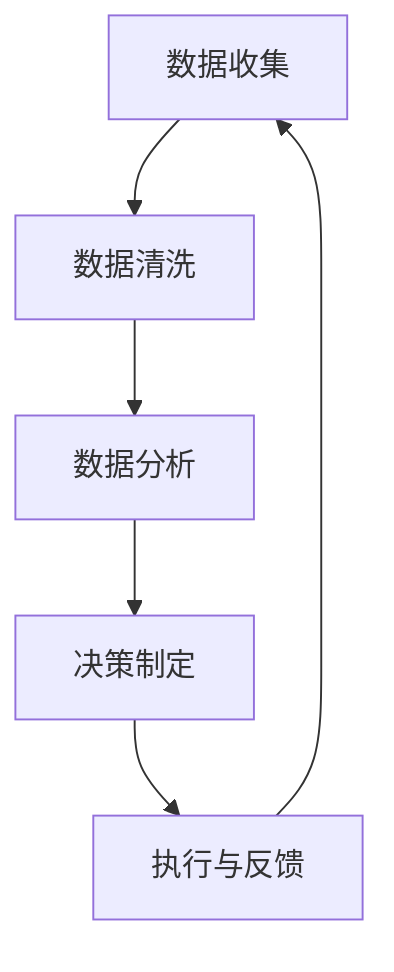

                 

关键词：商业智能，数据驱动，洞察力，决策制定，数据分析，人工智能，技术架构，应用场景

摘要：本文将探讨商业智能的重要性，以及如何通过数据驱动的决策制定来提升企业的洞察力和竞争力。我们将深入分析数据驱动的核心概念，阐述其原理和具体操作步骤，并通过实际案例来展示数据驱动在商业决策中的应用。此外，文章还将讨论数学模型和公式在数据分析中的关键作用，并提供项目实践和运行结果展示。最后，我们将展望数据驱动在未来商业领域的发展趋势和面临的挑战。

## 1. 背景介绍

在当今竞争激烈的市场环境中，企业需要具备强大的洞察力和决策能力来应对快速变化的市场需求。商业智能（Business Intelligence，BI）作为一种先进的信息技术手段，已经成为企业提升竞争力的重要工具。商业智能通过数据收集、分析和可视化，帮助企业从海量数据中发现有价值的信息，从而做出更加明智的决策。

然而，商业智能的应用并不仅仅是数据的简单收集和整理。数据驱动的决策制定（Data-Driven Decision Making）是一种基于数据分析和科学方法来制定决策的流程。它强调数据在决策过程中的核心作用，通过系统的分析和评估来指导决策的制定和执行。数据驱动的决策制定不仅能够提高决策的准确性和效率，还能够降低决策的风险，从而为企业带来更大的商业价值。

本文将围绕数据驱动的决策制定展开讨论，首先介绍其核心概念和原理，然后分析具体操作步骤和算法，接着讨论数学模型和公式在数据分析中的应用，并展示实际案例。最后，我们将探讨数据驱动在商业领域的未来发展趋势和面临的挑战。

### 1.1 商业智能的发展历程

商业智能的概念起源于20世纪90年代，随着计算机技术和数据库技术的快速发展，企业开始意识到数据的价值。最初，商业智能主要关注数据的收集和存储，以及通过报表和图表来展示数据。然而，随着大数据和人工智能技术的崛起，商业智能的应用范围和深度得到了显著提升。

从发展历程来看，商业智能可以分为以下几个阶段：

1. **数据仓库阶段**：企业开始建设数据仓库，集中存储各种业务数据，并通过查询和分析来获取业务洞察。这一阶段的特点是数据量有限，数据质量较差，分析工具相对简单。

2. **数据分析阶段**：随着数据量的爆炸性增长，企业开始采用更加复杂的分析技术，如数据挖掘和机器学习，来发现数据中的模式和关联。这一阶段的特点是数据量庞大，数据质量得到提升，分析工具更加多样和高级。

3. **数据驱动阶段**：企业将数据分析结果应用于决策制定，通过数据驱动的流程来制定和执行决策。这一阶段的特点是决策过程更加科学和系统，数据成为决策的核心驱动力。

### 1.2 数据驱动的决策制定的必要性

在当今的商业环境中，数据已经成为企业的重要资产。数据驱动的决策制定能够充分利用数据的价值，帮助企业实现以下几个方面的优势：

1. **提高决策效率**：通过数据分析和自动化工具，企业可以快速获取决策所需的信息，从而缩短决策周期，提高决策效率。

2. **降低决策风险**：基于数据分析和历史数据的预测，企业可以更加准确地评估不同决策方案的风险和收益，从而降低决策错误的风险。

3. **提升业务洞察力**：通过对数据的深入分析和挖掘，企业可以发现潜在的市场机会和业务问题，从而提升业务洞察力和竞争力。

4. **实现数据驱动文化**：数据驱动的决策制定不仅是一种技术手段，更是一种企业文化和价值观。通过数据驱动，企业可以培养员工的科学思维和数据分析能力，提升整体业务水平。

## 2. 核心概念与联系

### 2.1 核心概念

数据驱动的决策制定涉及多个核心概念，包括数据、分析、决策、算法等。以下是这些概念的基本定义和联系：

- **数据（Data）**：数据是决策制定的基础。数据可以来自企业内部的业务系统，也可以来自外部数据源，如市场调研、社交媒体等。数据的质量和准确性直接影响决策的可靠性。

- **分析（Analysis）**：分析是对数据进行处理、转换和解释的过程。通过分析，企业可以从海量数据中提取有价值的信息，为决策提供支持。

- **决策（Decision）**：决策是基于分析结果进行选择和行动的过程。决策可以是战略性的，如产品定位和市场拓展，也可以是运营性的，如库存管理和供应链优化。

- **算法（Algorithm）**：算法是数据分析过程中使用的一套规则和步骤，用于处理和分析数据，以获得特定的结果。不同的算法适用于不同类型的数据和决策需求。

### 2.2 Mermaid 流程图

为了更好地理解数据驱动的决策制定流程，我们可以使用 Mermaid 流程图来展示各个概念之间的联系。以下是一个简化的 Mermaid 流程图：



- **数据收集**：从内部和外部数据源收集数据，包括业务数据、市场数据等。
- **数据清洗**：对收集到的数据进行清洗和预处理，以确保数据的质量和准确性。
- **数据分析**：使用分析工具和算法对数据进行分析，提取有价值的信息。
- **决策制定**：基于分析结果，制定具体的决策方案。
- **执行与反馈**：执行决策方案，并通过反馈机制对决策效果进行评估和调整。

### 2.3 核心概念之间的联系

数据驱动的决策制定是一个闭环系统，各个环节相互联系、相互影响。以下是核心概念之间的具体联系：

1. **数据与分析**：数据是分析的基础，分析是对数据的处理和解释。高质量的数据能够提高分析的准确性和可靠性。

2. **分析与决策**：分析结果为决策提供支持。通过分析，企业可以识别市场机会、发现业务问题，从而制定更加科学的决策。

3. **决策与执行**：决策是行动的指南，执行是将决策转化为实际行动的过程。有效的决策需要通过执行来验证和调整。

4. **执行与反馈**：执行过程中产生的反馈信息可以用于评估决策效果，为后续的决策提供参考。

5. **反馈与数据**：反馈信息可以用于数据更新和改进，从而提高数据的准确性和分析质量，为下一轮的决策制定提供更好的支持。

通过以上核心概念和联系的分析，我们可以看出数据驱动的决策制定是一个动态、迭代的过程，各个环节相互依赖、相互促进。企业需要建立一个完善的数据驱动体系，以确保决策过程的科学性和有效性。

## 3. 核心算法原理 & 具体操作步骤

### 3.1 算法原理概述

数据驱动的决策制定依赖于一系列算法和技术，其中最核心的算法包括数据挖掘、机器学习和统计分析。这些算法通过不同的方式来处理和分析数据，从而为决策提供支持。

1. **数据挖掘（Data Mining）**：数据挖掘是一种从大量数据中自动发现有趣模式和关联的技术。它利用统计学、机器学习和数据库技术来识别数据中的隐藏规律，帮助企业和决策者发现潜在的市场机会和业务问题。常见的数据挖掘算法包括关联规则挖掘、聚类分析、分类分析和异常检测等。

2. **机器学习（Machine Learning）**：机器学习是一种基于数据驱动的方法，通过构建模型来对数据进行自动学习和预测。机器学习算法可以分为监督学习、无监督学习和强化学习。监督学习通过已知的输入输出数据来训练模型，无监督学习通过探索数据本身的分布和结构，强化学习则通过交互环境来不断优化决策策略。

3. **统计分析（Statistical Analysis）**：统计分析是传统数据分析方法的基础，通过统计方法来描述数据、检验假设和进行预测。常见的统计方法包括描述性统计、推断性统计和回归分析等。

### 3.2 算法步骤详解

数据驱动的决策制定通常包括以下几个关键步骤：

1. **数据收集**：从内部和外部数据源收集数据，包括业务数据、市场数据、用户行为数据等。数据收集的质量直接影响后续分析的效果。

2. **数据预处理**：对收集到的数据进行清洗、转换和归一化等预处理操作，以提高数据的质量和一致性。

3. **特征工程**：从原始数据中提取和构建特征，以增强模型的效果。特征工程是数据挖掘和机器学习中的重要步骤，它涉及特征选择、特征变换和特征组合等操作。

4. **模型选择**：根据分析目标和数据特性选择合适的算法和模型。不同的算法适用于不同类型的数据和决策需求，需要根据实际情况进行选择。

5. **模型训练**：使用预处理后的数据对选定的模型进行训练，以建立预测模型。模型训练是机器学习和统计分析中的核心步骤，其目的是通过数据来学习并优化模型参数。

6. **模型评估**：通过测试数据对训练好的模型进行评估，以确定模型的性能和可靠性。常见的评估指标包括准确率、召回率、F1 分数和 ROC 曲线等。

7. **决策制定**：基于模型预测结果和分析报告，制定具体的决策方案。决策制定需要综合考虑模型预测、业务目标和实际情况，以实现最佳决策。

8. **执行与反馈**：执行决策方案，并通过反馈机制对决策效果进行评估和调整。执行过程中产生的反馈信息可以用于数据更新和模型优化，以提高决策的准确性和有效性。

### 3.3 算法优缺点

1. **数据挖掘**

   - 优点：数据挖掘能够从海量数据中自动发现有趣的模式和关联，为决策提供深刻的洞察。它具有高效率和强大的数据分析能力。
   - 缺点：数据挖掘的结果可能存在过拟合和噪声干扰，需要进一步验证和调整。此外，数据挖掘算法的实现较为复杂，需要专业知识和经验。

2. **机器学习**

   - 优点：机器学习通过构建模型来自动学习和预测，能够处理复杂数据和大规模数据集。它具有较高的预测准确性和适应性。
   - 缺点：机器学习模型的训练过程可能需要大量计算资源和时间。此外，模型的可解释性较差，难以理解模型的内部工作机制。

3. **统计分析**

   - 优点：统计分析方法成熟、可靠，适用于各种类型的数据和假设检验。它具有较高的可解释性和易于理解。
   - 缺点：统计分析方法对数据质量和样本量要求较高，对于大规模数据和复杂数据的处理能力有限。

### 3.4 算法应用领域

数据驱动的决策制定在各个领域都有广泛的应用，以下是几个典型的应用领域：

1. **市场营销**：通过数据挖掘和机器学习算法，企业可以分析用户行为数据，识别潜在客户，制定个性化的营销策略，提高转化率和客户满意度。

2. **金融分析**：在金融领域，数据驱动的方法用于风险评估、投资组合优化和欺诈检测等。通过机器学习和统计分析，可以识别市场趋势、预测股价和评估金融风险。

3. **供应链管理**：通过数据分析和优化算法，企业可以优化供应链流程，提高库存管理效率和降低成本。例如，预测需求、优化运输路径和库存水平等。

4. **医疗健康**：在医疗领域，数据驱动的决策制定用于疾病诊断、治疗方案制定和公共卫生管理。通过数据分析，可以识别疾病风险因素、预测疾病发展轨迹和优化治疗方案。

5. **城市管理**：通过数据分析和智能化手段，城市管理者可以优化城市资源分配、提高公共服务质量和应对突发事件。例如，交通流量分析、环境保护和公共安全管理等。

综上所述，数据驱动的决策制定在各个领域都具有重要的应用价值。通过科学的算法和技术，企业可以更好地利用数据，实现高效、科学的决策，提升竞争力。

## 4. 数学模型和公式 & 详细讲解 & 举例说明

数学模型和公式是数据分析和决策制定的重要工具，它们能够帮助我们从复杂的现实问题中提取关键信息，并对其进行定量分析和评估。在本节中，我们将讨论几个常见的数学模型和公式，并详细讲解它们的构建、推导过程和实际应用。

### 4.1 数学模型构建

构建数学模型是数据分析的基础，它需要我们从现实问题中抽象出关键变量和关系，并使用数学符号和公式来描述。以下是构建数学模型的基本步骤：

1. **确定研究目标**：明确需要解决的问题和目标，例如预测股票价格、优化供应链成本等。

2. **定义变量和参数**：根据研究目标，定义相关的变量和参数。例如，在预测股票价格模型中，可能需要考虑股票的收盘价、交易量等变量。

3. **建立关系式**：使用适当的数学公式和关系式来描述变量之间的关系。例如，使用回归方程来描述因变量和自变量之间的线性关系。

4. **参数估计**：通过收集数据，估计模型中的参数值。例如，通过最小二乘法来估计线性回归模型的参数。

5. **模型验证和优化**：使用验证数据集来评估模型的性能，并通过调整模型参数来优化模型。

### 4.2 公式推导过程

在数据分析中，公式的推导过程是理解和应用公式的重要环节。以下是一个简单的线性回归公式推导示例：

假设我们有两个变量 \(X\) 和 \(Y\)，我们希望找到它们之间的线性关系。线性回归模型可以表示为：

$$ Y = \beta_0 + \beta_1 X + \epsilon $$

其中，\(\beta_0\) 是截距，\(\beta_1\) 是斜率，\(\epsilon\) 是误差项。

1. **最小二乘法估计**：

   为了估计 \(\beta_0\) 和 \(\beta_1\)，我们可以使用最小二乘法。最小二乘法的目标是使实际观测值与模型预测值之间的误差平方和最小。

   首先，计算误差项 \(\epsilon\) 的平方和：

   $$ \sum_{i=1}^{n} (\hat{y}_i - y_i)^2 $$

   其中，\(\hat{y}_i\) 是模型预测的 \(Y\) 值，\(y_i\) 是实际观测的 \(Y\) 值，\(n\) 是数据点的数量。

   接下来，我们使用偏导数来最小化上述误差平方和：

   $$ \frac{\partial}{\partial \beta_0} \sum_{i=1}^{n} (\hat{y}_i - y_i)^2 = 0 $$

   $$ \frac{\partial}{\partial \beta_1} \sum_{i=1}^{n} (\hat{y}_i - y_i)^2 = 0 $$

   通过求解上述偏导数方程，我们可以得到 \(\beta_0\) 和 \(\beta_1\) 的估计值。

2. **线性回归方程**：

   通过最小二乘法，我们得到线性回归方程：

   $$ \hat{y} = \beta_0 + \beta_1 X $$

   其中，\(\hat{y}\) 是预测的 \(Y\) 值，\(X\) 是自变量，\(\beta_0\) 是截距，\(\beta_1\) 是斜率。

### 4.3 案例分析与讲解

为了更好地理解数学模型和公式的应用，我们来看一个实际案例：预测某个城市的月均降雨量。

1. **数据收集**：

   收集了过去 10 年的月均降雨量数据，包括每个月的降雨量和对应的月份。

2. **数据预处理**：

   对数据进行清洗和转换，确保数据的质量和一致性。例如，处理缺失值、异常值和季节性因素等。

3. **特征工程**：

   构建特征变量，如月份、季节、平均温度等。这些特征变量可以影响降雨量，并作为回归模型的输入。

4. **模型构建**：

   使用线性回归模型来构建降雨量预测模型：

   $$ 降雨量 = \beta_0 + \beta_1 \times 月份 + \beta_2 \times 季节 + \beta_3 \times 平均温度 + \epsilon $$

   其中，\(\beta_0\) 是截距，\(\beta_1\)、\(\beta_2\) 和 \(\beta_3\) 是系数，\(\epsilon\) 是误差项。

5. **模型训练与验证**：

   使用过去的数据来训练模型，并通过交叉验证来评估模型的性能。通过调整模型参数，优化模型效果。

6. **模型应用**：

   使用训练好的模型来预测未来的月均降雨量，为城市的防洪和水资源管理提供科学依据。

### 4.4 数学模型与实际应用

数学模型在数据分析中具有广泛的应用，不仅用于预测和分析，还可以用于优化和决策制定。以下是一些实际应用场景：

1. **金融市场预测**：使用时间序列分析模型来预测股票价格、汇率等金融市场指标，为投资决策提供支持。

2. **客户行为分析**：使用聚类分析模型来分析客户行为数据，识别客户群体，制定个性化的营销策略。

3. **供应链优化**：使用优化算法来优化供应链流程，如库存管理、运输路线规划等，降低成本、提高效率。

4. **医疗诊断**：使用机器学习模型来分析医学影像和生物数据，辅助医生进行疾病诊断和治疗方案制定。

5. **城市规划**：使用地理信息系统（GIS）模型来分析城市交通、环境、人口等数据，优化城市资源分配和规划。

通过以上案例和应用，我们可以看到数学模型和公式在数据分析中的重要作用。它们不仅能够帮助我们更好地理解和解释数据，还可以为实际决策提供科学依据，从而提升企业的竞争力和创新能力。

## 5. 项目实践：代码实例和详细解释说明

### 5.1 开发环境搭建

在进行数据驱动的决策制定项目实践之前，首先需要搭建合适的开发环境。以下是一个简单的步骤指南：

1. **安装 Python**：Python 是一种广泛应用于数据分析的编程语言。确保安装最新版本的 Python，可以在 [Python 官网](https://www.python.org/) 下载。

2. **安装依赖库**：Python 中有许多用于数据分析和机器学习的库，如 NumPy、Pandas、Scikit-learn 和 Matplotlib。可以通过以下命令安装这些库：

   ```bash
   pip install numpy pandas scikit-learn matplotlib
   ```

3. **环境配置**：在 PyCharm 或 Jupyter Notebook 中创建一个新的 Python 项目，配置相应的虚拟环境，以便管理和依赖库。

### 5.2 源代码详细实现

以下是一个简单的数据驱动决策制定项目的示例代码，包括数据收集、数据预处理、模型构建和预测等步骤。

```python
# 导入依赖库
import numpy as np
import pandas as pd
from sklearn.model_selection import train_test_split
from sklearn.linear_model import LinearRegression
import matplotlib.pyplot as plt

# 5.2.1 数据收集
# 假设数据已存储为 CSV 文件，包含自变量 X 和因变量 Y
data = pd.read_csv('data.csv')

# 5.2.2 数据预处理
# 清洗和转换数据
data.dropna(inplace=True)  # 删除缺失值
data['X'] = data['X'].astype(float)  # 转换数据类型
data['Y'] = data['Y'].astype(float)

# 5.2.3 特征工程
# 构建特征变量，例如添加月份和季节
data['Month'] = data['Date'].dt.month
data['Season'] = data['Date'].dt.quarter

# 5.2.4 模型构建
# 分割数据集
X = data[['X', 'Month', 'Season']]
y = data['Y']
X_train, X_test, y_train, y_test = train_test_split(X, y, test_size=0.2, random_state=42)

# 创建线性回归模型
model = LinearRegression()
model.fit(X_train, y_train)

# 5.2.5 模型预测
# 预测测试集结果
y_pred = model.predict(X_test)

# 5.2.6 代码解读与分析
# 查看模型参数
print(model.coef_)
print(model.intercept_)

# 绘制预测结果
plt.scatter(X_test['X'], y_test, color='blue', label='实际值')
plt.plot(X_test['X'], y_pred, color='red', label='预测值')
plt.xlabel('X')
plt.ylabel('Y')
plt.legend()
plt.show()
```

### 5.3 代码解读与分析

1. **数据收集**：
   - 数据通过 `pd.read_csv()` 函数从 CSV 文件中读取，其中包含自变量 `X` 和因变量 `Y`。

2. **数据预处理**：
   - 使用 `dropna()` 函数删除缺失值，确保数据质量。
   - 使用 `astype(float)` 函数转换数据类型，确保数值计算的正确性。

3. **特征工程**：
   - 添加新的特征变量，如月份和季节，这些变量可能对因变量产生影响。
   - 使用 `dt.month` 和 `dt.quarter` 方法提取日期信息，构建特征变量。

4. **模型构建**：
   - 使用 `train_test_split()` 函数将数据集分为训练集和测试集，以评估模型性能。
   - 创建 `LinearRegression()` 模型，并使用 `fit()` 函数训练模型。

5. **模型预测**：
   - 使用 `predict()` 函数对测试集进行预测，获得预测结果。
   - 使用 `plt.scatter()` 和 `plt.plot()` 函数绘制实际值和预测值，进行可视化分析。

6. **代码解读与分析**：
   - 模型参数通过 `print(model.coef_)` 和 `print(model.intercept_)` 输出，便于分析和理解模型。
   - 可视化分析可以帮助我们直观地理解模型性能和预测效果。

### 5.4 运行结果展示

通过运行上述代码，我们可以在屏幕上看到预测结果的散点图，其中红色线条表示模型预测值，蓝色点表示实际观测值。通过对比预测值和实际值，我们可以评估模型的性能和准确性。此外，模型参数的输出可以帮助我们进一步理解模型的工作原理和预测机制。

通过以上项目实践，我们可以看到数据驱动的决策制定在实际应用中的具体实现过程。通过科学的数据收集、预处理、特征工程和模型训练，我们能够构建有效的预测模型，为企业提供科学的决策支持。

## 6. 实际应用场景

数据驱动的决策制定在各个行业和领域都有广泛的应用，下面我们将探讨几个典型的实际应用场景，展示数据驱动如何在实践中发挥关键作用。

### 6.1 市场营销

在市场营销领域，数据驱动的决策制定可以帮助企业更好地了解客户需求，优化营销策略，提高转化率和客户满意度。以下是一个具体案例：

**案例：电商平台个性化推荐**

某电商平台希望通过个性化推荐系统来提升用户购买体验和销售额。他们利用用户的历史购买数据、浏览记录和行为数据，通过数据挖掘和机器学习算法构建推荐模型。具体步骤如下：

1. **数据收集**：收集用户的历史购买记录、浏览记录、搜索关键词等数据。

2. **数据预处理**：清洗数据，处理缺失值和异常值，并进行数据归一化。

3. **特征工程**：提取用户行为特征，如购买频率、购买品类、浏览时长等，构建特征矩阵。

4. **模型构建**：使用协同过滤算法（如矩阵分解、K-近邻推荐等）来预测用户对商品的偏好，构建推荐模型。

5. **模型优化**：通过交叉验证和模型调整来优化推荐效果，提高推荐的准确性和相关性。

6. **推荐系统部署**：将训练好的推荐模型部署到线上系统，为用户实时生成个性化推荐。

通过上述步骤，电商平台能够为每个用户生成个性化的商品推荐，从而提高用户满意度和转化率。同时，通过分析推荐系统的效果，企业可以进一步优化推荐策略，提升整体营销效果。

### 6.2 供应链管理

在供应链管理领域，数据驱动的决策制定可以帮助企业优化库存管理、运输路径和供应链流程，提高供应链效率和降低成本。以下是一个具体案例：

**案例：零售企业库存优化**

某大型零售企业希望通过数据驱动的方法来优化库存管理，减少库存成本和缺货风险。他们采用以下步骤：

1. **数据收集**：收集销售数据、库存数据、市场趋势数据等。

2. **数据预处理**：清洗和整理数据，进行数据归一化和特征提取。

3. **需求预测**：使用时间序列分析模型（如ARIMA、LSTM等）来预测未来的销售需求。

4. **库存优化**：基于需求预测结果，使用优化算法（如线性规划、遗传算法等）来计算最优的库存水平，以最小化库存成本和缺货风险。

5. **供应链协调**：通过供应链协同系统，将库存优化策略与供应商、物流提供商共享，实现供应链的协同优化。

6. **实时监控与调整**：实时监控库存水平和销售数据，根据实际情况调整库存策略，以确保供应链的高效运作。

通过数据驱动的库存优化，企业能够更好地平衡库存水平和市场需求，减少库存积压和缺货情况，提高供应链的整体效率和响应速度。

### 6.3 医疗健康

在医疗健康领域，数据驱动的决策制定可以帮助医生进行疾病诊断、治疗方案制定和公共卫生管理。以下是一个具体案例：

**案例：智能医疗诊断系统**

某医疗科技公司开发了一款智能医疗诊断系统，通过数据驱动的算法来辅助医生进行疾病诊断。具体步骤如下：

1. **数据收集**：收集患者的医学影像数据、生物数据、病历数据等。

2. **数据预处理**：清洗和整理数据，进行数据归一化和特征提取。

3. **模型训练**：使用深度学习算法（如卷积神经网络、循环神经网络等）对医疗数据进行训练，构建诊断模型。

4. **疾病预测**：基于训练好的模型，对新的病例数据进行疾病预测，提供诊断建议。

5. **治疗方案推荐**：结合患者的病史和临床数据，推荐个性化的治疗方案。

6. **效果评估与优化**：通过实际病例的反馈，不断优化诊断模型和治疗方案，提高系统的准确性和可靠性。

通过智能医疗诊断系统，医生能够更准确地诊断疾病，提高诊疗效率，同时为患者提供更加个性化的治疗方案，从而改善医疗质量和患者体验。

### 6.4 金融服务

在金融服务领域，数据驱动的决策制定可以帮助银行和金融机构进行风险评估、投资组合优化和欺诈检测。以下是一个具体案例：

**案例：银行信贷风险评估**

某银行希望通过数据驱动的决策制定来优化信贷风险评估模型，提高信贷审批的准确性和效率。具体步骤如下：

1. **数据收集**：收集借款人的信用历史、收入水平、工作状况、家庭背景等数据。

2. **数据预处理**：清洗和整理数据，进行数据归一化和特征提取。

3. **风险评估**：使用统计分析方法（如逻辑回归、决策树等）和机器学习方法（如随机森林、支持向量机等）来构建风险评估模型。

4. **模型优化**：通过交叉验证和模型调整来优化风险评估模型的性能。

5. **信贷审批**：将风险评估模型应用于新的借款申请，进行信贷审批。

6. **实时监控与调整**：实时监控信贷风险，根据市场变化和借款人行为调整风险评估模型，提高审批效率和准确性。

通过数据驱动的信贷风险评估，银行能够更准确地评估借款人的信用风险，减少信贷损失，同时提高客户满意度和市场竞争力。

综上所述，数据驱动的决策制定在市场营销、供应链管理、医疗健康、金融服务等多个领域都有广泛应用。通过科学的数据分析和算法应用，企业能够更好地理解业务需求，优化决策过程，提高整体运营效率和竞争力。

## 7. 工具和资源推荐

在数据驱动的决策制定过程中，选择合适的工具和资源对于提升工作效率和项目质量至关重要。以下是一些建议的实用工具和资源，涵盖学习资源、开发工具和推荐论文等方面。

### 7.1 学习资源推荐

1. **在线课程**：
   - Coursera 的 "数据科学专业"：由顶尖大学和机构提供的系统性数据科学课程，涵盖数据预处理、数据分析、机器学习等多个方面。
   - edX 的 "深度学习专项课程"：由 Andrew Ng 教授主讲，深入讲解深度学习的基础知识和应用。

2. **书籍**：
   - 《Python数据分析基础教程》：详细介绍了Python在数据分析中的应用，适合初学者。
   - 《机器学习实战》：通过实际案例展示机器学习算法的应用，适合有一定编程基础的学习者。

3. **网站和博客**：
   - Kaggle：一个数据科学竞赛平台，提供丰富的数据集和教程，是学习和实践数据科学的好地方。
   - towardsdatascience：一个面向数据科学领域的学习和分享平台，发布大量高质量的文章和教程。

### 7.2 开发工具推荐

1. **编程环境**：
   - Jupyter Notebook：一个强大的交互式计算环境，适合编写和运行数据分析脚本。
   - PyCharm：一款功能丰富的Python IDE，提供代码编辑、调试和版本控制等功能。

2. **数据分析库**：
   - NumPy：用于高性能数值计算的库，适用于数据处理和数学运算。
   - Pandas：提供数据结构 Dataframe，适合数据处理和统计分析。
   - Scikit-learn：提供丰富的机器学习算法和工具，适用于模型训练和预测。

3. **可视化工具**：
   - Matplotlib：用于生成高质量统计图表。
   - Seaborn：基于 Matplotlib 的可视化库，提供更多高级和精美的图表样式。
   - Plotly：提供交互式图表，支持多种前端和后端语言。

### 7.3 相关论文推荐

1. **经典论文**：
   - "Theorem Proving in Data Analysis"：提供了一种基于定理证明的数据分析方法，为复杂数据提供了可靠的处理框架。
   - "Data Mining: Concepts and Techniques"：详细介绍了数据挖掘的基本概念和技术，是数据挖掘领域的经典著作。

2. **近期研究**：
   - "Deep Learning for Business Intelligence"：探讨了深度学习在商业智能中的应用，展示了其在预测和分析方面的潜力。
   - "Data-Driven Business Models: Strategy and Analytics"：研究了数据驱动商业模式的构建方法，为企业的战略规划提供了新的视角。

通过以上工具和资源的推荐，可以帮助数据科学从业者提升专业知识和技能，更好地应用于数据驱动的决策制定。无论是初学者还是经验丰富的专业人士，都能从中受益并找到适合自己的学习路径。

## 8. 总结：未来发展趋势与挑战

### 8.1 研究成果总结

随着大数据、人工智能和云计算等技术的快速发展，数据驱动的决策制定在各个领域都取得了显著的成果。通过数据挖掘、机器学习和统计分析等算法，企业能够从海量数据中提取有价值的信息，实现精准营销、供应链优化和智能医疗等应用。数据驱动的决策制定不仅提高了决策的效率和质量，还为企业带来了显著的商业价值。

同时，研究成果还表明，数据驱动的决策制定具有以下优点：

- **提高决策准确性**：通过科学的数据分析和预测模型，企业能够更加准确地评估不同决策方案的风险和收益，减少决策失误。
- **降低决策风险**：基于历史数据和模型预测，企业能够提前识别潜在的市场风险和业务问题，采取预防措施，降低决策风险。
- **提升业务洞察力**：通过深入分析业务数据和市场趋势，企业能够发现潜在的市场机会和业务问题，从而制定更加科学的战略和运营计划。
- **实现数据驱动文化**：数据驱动的决策制定不仅是一种技术手段，更是一种企业文化和价值观。通过培养数据意识和数据分析能力，企业可以提升整体业务水平和竞争力。

### 8.2 未来发展趋势

随着技术的不断进步和应用的深入，数据驱动的决策制定在未来将继续呈现以下发展趋势：

1. **智能化与自动化**：随着人工智能技术的不断发展，数据驱动的决策制定将变得更加智能化和自动化。通过深度学习和强化学习等算法，企业可以实现自动化的决策流程，提高决策效率。

2. **跨界融合**：数据驱动的决策制定将与其他技术领域（如物联网、区块链、云计算等）进行深度融合，形成跨领域的数据驱动解决方案。这将为企业带来更多的创新机会和商业价值。

3. **实时决策**：随着数据采集和传输技术的进步，企业能够实现实时数据分析和决策。通过实时数据的动态分析，企业可以快速响应市场变化，调整决策策略，提升业务竞争力。

4. **个性化与定制化**：基于用户行为数据和个人偏好，数据驱动的决策制定将更加注重个性化与定制化。通过个性化推荐、定制化服务和精准营销，企业能够更好地满足用户需求，提升用户满意度。

5. **全球协同**：随着全球化的发展，数据驱动的决策制定将实现全球范围内的协同与合作。企业可以通过数据共享和协同分析，实现全球业务的协同优化，提高整体运营效率。

### 8.3 面临的挑战

尽管数据驱动的决策制定具有巨大的潜力和优势，但在实际应用过程中仍面临以下挑战：

1. **数据质量问题**：数据是决策的基础，但当前很多企业的数据质量存在较大问题，如数据缺失、不一致、噪声等。提高数据质量是数据驱动决策制定的关键。

2. **算法复杂性与解释性**：随着算法的复杂性和多样性增加，如何选择合适的算法、优化算法性能并保证模型的可解释性成为一个挑战。特别是在面对复杂数据和决策问题时，如何平衡算法的复杂性和解释性仍需深入研究。

3. **数据隐私与安全**：随着数据量的增加，数据隐私和安全问题日益突出。如何保护用户隐私、防止数据泄露和滥用成为数据驱动决策制定的重要挑战。

4. **技术普及与人才短缺**：数据驱动的决策制定需要大量的技术人才，但当前技术人才供给不足。如何培养和引进高素质的数据科学人才，提升企业整体技术能力是一个重要课题。

5. **决策者的认知与技术接受度**：尽管数据驱动的决策制定具有明显优势，但部分决策者对新技术和方法的接受度较低，存在认知和技术障碍。如何提高决策者的数据意识和技能水平，推动数据驱动的决策文化成为企业面临的一大挑战。

### 8.4 研究展望

针对以上挑战，未来研究可以从以下几个方面展开：

1. **数据质量管理与治理**：加强对数据质量的管理和治理，建立数据质量控制机制，提升数据质量。

2. **算法优化与解释性研究**：优化现有算法，提高算法性能和可解释性，确保模型的可靠性和透明度。

3. **数据隐私保护技术**：研究数据隐私保护技术，如差分隐私、联邦学习等，确保数据的安全和隐私。

4. **数据科学人才培养**：加强数据科学教育和培训，培养高素质的数据科学人才，满足市场需求。

5. **决策支持系统的构建**：构建智能化的决策支持系统，提高决策者的数据意识和技能水平，推动数据驱动的决策文化。

通过以上研究和实践，我们有望进一步提升数据驱动的决策制定能力，实现更加科学、高效和智能的决策，为企业的持续发展和竞争力提升提供有力支持。

## 9. 附录：常见问题与解答

### 9.1 数据驱动的决策制定是什么？

数据驱动的决策制定是一种基于数据分析和科学方法来制定决策的流程。它强调数据在决策过程中的核心作用，通过系统的分析和评估来指导决策的制定和执行。

### 9.2 数据驱动的决策制定有哪些优点？

数据驱动的决策制定具有以下几个优点：

- 提高决策效率：通过数据分析和自动化工具，企业可以快速获取决策所需的信息，从而缩短决策周期。
- 降低决策风险：基于数据分析和历史数据的预测，企业可以更加准确地评估不同决策方案的风险和收益。
- 提升业务洞察力：通过对数据的深入分析和挖掘，企业可以发现潜在的市场机会和业务问题。
- 实现数据驱动文化：数据驱动不仅是一种技术手段，更是一种企业文化和价值观，通过数据驱动，企业可以培养员工的科学思维和数据分析能力。

### 9.3 数据驱动的决策制定有哪些应用场景？

数据驱动的决策制定在多个领域都有广泛应用，包括：

- 市场营销：个性化推荐、精准营销、客户细分等。
- 供应链管理：库存优化、供应链协同、运输路径优化等。
- 医疗健康：疾病诊断、治疗方案推荐、公共卫生管理等。
- 金融服务：风险评估、投资组合优化、欺诈检测等。

### 9.4 如何提高数据驱动的决策质量？

提高数据驱动的决策质量可以从以下几个方面着手：

- **数据质量**：确保数据质量，包括数据完整性、准确性、一致性和及时性。
- **算法选择**：根据业务需求和数据特性，选择合适的算法和模型。
- **模型优化**：通过交叉验证和模型调整，优化模型性能和可解释性。
- **决策支持系统**：构建智能化的决策支持系统，提高决策者的数据意识和技能水平。
- **持续监控与反馈**：实时监控决策效果，收集反馈信息，不断调整和优化决策流程。

### 9.5 数据驱动的决策制定面临哪些挑战？

数据驱动的决策制定面临以下挑战：

- **数据质量问题**：数据缺失、不一致、噪声等问题影响决策的准确性。
- **算法复杂性与解释性**：如何平衡算法的复杂性和解释性，确保模型的可靠性和透明度。
- **数据隐私与安全**：数据隐私和安全问题日益突出。
- **技术普及与人才短缺**：技术人才供给不足，企业整体技术能力提升困难。
- **决策者的认知与技术接受度**：决策者对新技术和方法的接受度较低，存在认知和技术障碍。

通过以上常见问题的解答，我们希望能够帮助读者更好地理解和应用数据驱动的决策制定，提升企业的决策能力和竞争力。作者：禅与计算机程序设计艺术 / Zen and the Art of Computer Programming。

