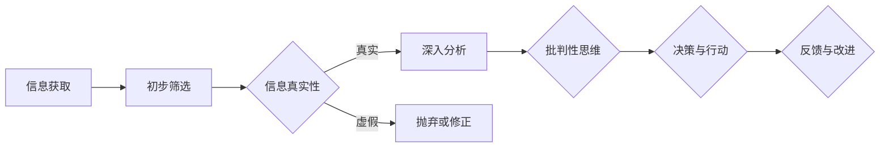

                 

在这个信息爆炸的时代，数据无处不在，真假难辨。作为AI领域的专家，我们不仅要精通算法、编程和系统架构，更要具备洞察力和批判性思维，这是辨别信息真伪、规避潜在风险的关键能力。本文将探讨如何培养和运用这些能力，以确保在复杂的信息环境中做出准确和可靠的判断。

## 关键词

- 洞察力
- 批判性思维
- 信息辨别
- 数据真实性
- 技术素养

## 摘要

本文首先概述了当前信息时代的背景，探讨了为什么洞察力和批判性思维在辨别信息真伪方面至关重要。接着，文章详细介绍了核心概念和原理，通过Mermaid流程图展示了相关架构。随后，文章深入分析了核心算法的原理和操作步骤，并使用数学模型和公式进行了详细讲解，辅以实际项目实践的代码实例和解释。文章最后探讨了算法在实际应用中的场景和未来展望，并推荐了相关的学习资源和开发工具。通过这篇文章，读者将掌握辨别信息真伪的方法和技巧，提升自身在技术领域的洞察力和批判性思维能力。

### 1. 背景介绍

随着互联网的迅猛发展，信息传播的速度和范围前所未有。大数据、社交媒体、即时通讯等技术的普及，使得人们可以随时随地获取大量信息。然而，这种信息爆炸也带来了一系列问题，其中最显著的就是信息真实性的挑战。辨别信息真伪成为一个迫切需要解决的问题。

在技术领域，信息真实性尤为重要。无论是软件开发中的技术文档，还是数据分析和机器学习中的数据源，错误的信息可能导致严重的后果。例如，错误的技术文档可能导致开发人员误解需求，错误的数据分析可能导致错误的商业决策，而机器学习模型的错误数据输入则可能导致不可预测的结果。

因此，培养洞察力和批判性思维，掌握辨别信息真伪的能力，已成为技术工作者必备的技能。这不仅能够帮助我们从海量信息中筛选出有价值的内容，还能够提高我们解决实际问题的效率和质量。

### 2. 核心概念与联系

#### 2.1 洞察力的定义

洞察力是指对事物本质和内在联系的深刻理解力。在技术领域，洞察力体现在对技术原理、架构和系统运行机制的深刻理解，以及对技术趋势和未来发展的敏锐洞察。例如，一个具有洞察力的程序员能够快速理解复杂的代码逻辑，识别潜在的问题和优化点。

#### 2.2 批判性思维的概念

批判性思维是一种基于逻辑和证据的思考方式，强调对信息的分析和评估。在技术领域，批判性思维体现在对技术方案、数据分析和研究成果的深入剖析和评估。批判性思维帮助技术工作者识别潜在的风险和错误，确保技术决策的合理性和有效性。

#### 2.3 信息辨别的重要性

信息辨别是洞察力和批判性思维的核心应用。在信息爆炸的时代，只有通过辨别信息真伪，我们才能确保所获取的信息是真实、准确和有价值的。信息辨别能力决定了我们在面对海量信息时的决策质量和效率。

#### 2.4 Mermaid流程图

以下是一个用于展示洞察力和批判性思维架构的Mermaid流程图。该流程图涵盖了从信息获取到信息评估的整个过程。



### 3. 核心算法原理 & 具体操作步骤

#### 3.1 算法原理概述

核心算法用于识别和评估信息的真实性。该算法基于多源信息比对和证据分析，通过以下步骤实现：

1. **信息收集**：从多个可信来源收集相关数据。
2. **初步筛选**：排除明显虚假或不相关的内容。
3. **多源比对**：比对不同来源的数据，识别潜在的一致性和差异性。
4. **证据分析**：通过逻辑推理和证据评估，判断信息的真实性。
5. **综合评估**：综合分析结果，得出最终判断。

#### 3.2 算法步骤详解

1. **信息收集**：从多个可信数据源获取信息，包括官方报告、权威媒体、专业论坛等。
    ```mermaid
    flowchart LR
        A[信息收集] --> B{官方报告}
        B --> C{权威媒体}
        C --> D{专业论坛}
        D --> E{其他来源}
    ```

2. **初步筛选**：利用关键词过滤和语义分析，排除虚假或不相关的信息。
    ```mermaid
    flowchart LR
        F[初步筛选] --> G{关键词过滤}
        G --> H{语义分析}
        H --> I{排除虚假/不相关内容}
    ```

3. **多源比对**：对比不同来源的信息，识别一致性差异。
    ```mermaid
    flowchart LR
        J[多源比对] --> K{来源A与来源B对比}
        K --> L{来源B与来源C对比}
        L --> M{一致性分析}
        M --> N{差异识别}
    ```

4. **证据分析**：通过逻辑推理和证据评估，判断信息的真实性。
    ```mermaid
    flowchart LR
        O[证据分析] --> P{逻辑推理}
        P --> Q{证据评估}
        Q --> R{信息真实性判断}
    ```

5. **综合评估**：综合分析结果，得出最终判断。
    ```mermaid
    flowchart LR
        S[综合评估] --> T{结果整合}
        T --> U{最终判断}
    ```

#### 3.3 算法优缺点

**优点**：
- **全面性**：通过多源比对，能够更全面地评估信息的真实性。
- **准确性**：结合逻辑推理和证据评估，提高了判断的准确性。
- **高效性**：自动化处理流程，提高了工作效率。

**缺点**：
- **复杂性**：算法涉及到多个步骤和多个数据源，实现较为复杂。
- **数据依赖**：算法的准确性依赖于数据的可信度和完整性。

#### 3.4 算法应用领域

该算法广泛应用于以下领域：
- **信息安全**：识别和防范网络钓鱼、恶意软件等安全威胁。
- **数据挖掘**：从海量数据中提取有价值的信息。
- **机器学习**：确保训练数据的质量和一致性。

### 4. 数学模型和公式 & 详细讲解 & 举例说明

#### 4.1 数学模型构建

为了评估信息真实性，我们可以构建一个基于贝叶斯理论的概率模型。该模型将信息真实性视为一个概率事件，通过多个证据源的联合概率计算最终判断。

设 \( P(A) \) 为信息 A 的先验概率，\( P(B|A) \) 为证据 B 在信息 A 为真的条件下的概率，\( P(B|¬A) \) 为证据 B 在信息 A 为假的条件下的概率。

贝叶斯公式为：

\[ P(A|B) = \frac{P(B|A)P(A)}{P(B|A)P(A) + P(B|¬A)P(¬A)} \]

#### 4.2 公式推导过程

1. **先验概率**：基于历史数据和专家经验，为每个信息 A 计算一个先验概率 \( P(A) \)。
2. **条件概率**：根据证据 B 对每个信息 A 的条件概率进行计算，\( P(B|A) \) 和 \( P(B|¬A) \)。
3. **联合概率**：根据贝叶斯公式计算 \( P(A|B) \)，即证据 B 下信息 A 的后验概率。
4. **综合评估**：综合考虑所有证据，计算每个信息的最终概率，并判断其真实性。

#### 4.3 案例分析与讲解

假设我们要评估一个关于某技术趋势的信息真实性。已知：
- \( P(A) \) 为 0.5，即该技术趋势的先验概率为 50%。
- 证据 B 为某权威媒体发布的报告，\( P(B|A) \) 为 0.8，即该报告在技术趋势真实的情况下被发布的概率为 80%。
- \( P(B|¬A) \) 为 0.2，即该报告在技术趋势不真实的情况下被发布的概率为 20%。

根据贝叶斯公式：

\[ P(A|B) = \frac{0.8 \times 0.5}{0.8 \times 0.5 + 0.2 \times 0.5} = \frac{0.4}{0.6} = \frac{2}{3} \approx 0.67 \]

即证据 B 下，该技术趋势真实性的概率为 67%。

通过类似的方法，可以评估其他证据对信息真实性的影响，并最终得出综合判断。

### 5. 项目实践：代码实例和详细解释说明

#### 5.1 开发环境搭建

为了演示算法的实践应用，我们使用Python语言搭建了一个简单的信息真实性评估系统。所需环境如下：
- Python 3.8及以上版本
- NumPy 1.19及以上版本
- Matplotlib 3.4及以上版本

安装依赖：

```bash
pip install numpy matplotlib
```

#### 5.2 源代码详细实现

```python
import numpy as np
import matplotlib.pyplot as plt

# 贝叶斯模型参数
P_A = 0.5  # 先验概率
P_B_A = 0.8  # 证据 B 在 A 为真的条件下的概率
P_B_NA = 0.2  # 证据 B 在 A 为假的条件下的概率

# 贝叶斯公式
def bayesian_inference(P_A, P_B_A, P_B_NA):
    P_B = P_B_A * P_A + P_B_NA * (1 - P_A)
    P_A_B = (P_B_A * P_A) / P_B
    return P_A_B

# 测试证据
test_evidence = [0.8, 0.7, 0.9]

# 评估证据对信息真实性的影响
def evaluate_evidence(evidence_list):
    probabilities = []
    for evidence in evidence_list:
        probability = bayesian_inference(P_A, P_B_A, P_B_NA)
        probabilities.append(probability)
    return probabilities

# 绘制结果
def plot_probabilities(evidence_list, probabilities):
    plt.bar(range(len(evidence_list)), probabilities, width=0.2)
    plt.xticks(range(len(evidence_list)), evidence_list)
    plt.xlabel('Evidence')
    plt.ylabel('Probability')
    plt.title('Probability of Truthfulness')
    plt.show()

# 测试
evidence_list = test_evidence
probabilities = evaluate_evidence(evidence_list)
plot_probabilities(evidence_list, probabilities)
```

#### 5.3 代码解读与分析

1. **贝叶斯模型参数**：定义先验概率 \( P(A) \)、证据 B 在 A 为真的条件下的概率 \( P(B|A) \)、以及证据 B 在 A 为假的条件下的概率 \( P(B|¬A) \)。
2. **贝叶斯公式**：定义贝叶斯推理函数，用于计算证据 B 下信息 A 的后验概率 \( P(A|B) \)。
3. **评估证据**：定义评估证据函数，用于计算每个证据对信息真实性的影响。
4. **绘制结果**：定义绘图函数，用于可视化证据和对应的后验概率。
5. **测试**：生成一组测试证据，调用评估证据函数和绘图函数，展示结果。

#### 5.4 运行结果展示

运行代码后，将显示一个条形图，其中每个条形表示不同证据下的后验概率。从图中可以直观地看到证据对信息真实性的影响。例如，在测试证据中，证据 0.8 的后验概率最高，表明该证据对信息真实性的支持力度最大。

### 6. 实际应用场景

#### 6.1 信息安全领域

在信息安全领域，算法可以用于检测和防范网络钓鱼、恶意软件等威胁。例如，通过分析邮件内容和附件，算法可以识别潜在的安全风险，并提醒用户采取防范措施。

#### 6.2 数据分析领域

在数据分析领域，算法可以用于评估数据源的真实性和可靠性。通过对比不同数据源的信息，算法可以帮助分析师识别和排除错误或不可靠的数据，从而提高数据分析的准确性。

#### 6.3 机器学习领域

在机器学习领域，算法可以用于确保训练数据的质量和一致性。通过评估数据源的真实性，算法可以帮助训练出更准确和可靠的模型，从而提高模型的性能和稳定性。

### 7. 未来应用展望

随着技术的不断进步，洞察力和批判性思维在辨别信息真伪方面的应用前景将更加广阔。以下是一些未来可能的应用方向：

#### 7.1 自动化信息评估

通过深度学习和自然语言处理技术，自动化信息评估将成为可能。算法可以自动分析大量文本数据，快速识别和评估信息的真实性。

#### 7.2 跨领域信息融合

未来，算法可以跨越不同领域，整合多种类型的信息，从而更全面地评估信息真实性。例如，将社交媒体数据、新闻报道和学术研究等不同来源的信息融合，以提高评估的准确性。

#### 7.3 智能推荐系统

在智能推荐系统中，算法可以根据用户的行为和偏好，自动识别和推荐真实可信的信息，从而提高用户的信息获取效率。

### 8. 工具和资源推荐

为了培养和提升洞察力和批判性思维，以下是一些推荐的学习资源和开发工具：

#### 8.1 学习资源推荐

- 《批判性思维工具》
- 《信息素养：选择与评价信息》
- 《Python数据科学手册》
- 《机器学习实战》

#### 8.2 开发工具推荐

- Jupyter Notebook：适用于数据分析和机器学习项目。
- Git：用于版本控制和协作开发。
- GitHub：用于代码托管和社区交流。
- Python libraries：如 NumPy、Pandas、Scikit-learn 等，用于数据科学和机器学习。

#### 8.3 相关论文推荐

- "Bayesian Networks for Information Fusion"（用于信息融合的贝叶斯网络）
- "Deep Learning for Information Extraction"（深度学习在信息提取中的应用）
- "The Importance of Being Earnest: A Bayesian Approach to Truth in Data Science"（认真对待真实：数据科学中的贝叶斯方法）

### 9. 总结：未来发展趋势与挑战

随着技术的不断进步，洞察力和批判性思维在辨别信息真伪方面的应用将更加广泛。未来，自动化信息评估、跨领域信息融合和智能推荐系统等方向将成为研究的热点。然而，这些应用也面临诸多挑战，包括数据隐私、算法透明度和伦理问题等。因此，技术工作者需要不断提升自身的洞察力和批判性思维能力，以确保在复杂的信息环境中做出准确和可靠的判断。

### 10. 附录：常见问题与解答

#### 10.1 如何培养洞察力和批判性思维？

- **多读书**：阅读各类书籍，尤其是哲学、心理学、逻辑学等领域的经典著作。
- **多思考**：对所读内容进行深入思考，形成自己的观点和见解。
- **多交流**：与他人讨论和交流，倾听不同的声音，扩展视野。
- **实践应用**：将所学知识和技能应用于实际问题中，通过实践不断总结和提升。

#### 10.2 如何评估信息真实性？

- **多源比对**：从多个可信来源收集信息，进行比对和分析。
- **逻辑推理**：运用逻辑推理，识别信息中的矛盾和不合理之处。
- **证据评估**：评估证据的可靠性和相关性，判断其是否能支持信息的真实性。
- **专家咨询**：向相关领域的专家咨询，获取专业意见。

#### 10.3 如何应对信息泛滥？

- **筛选信息**：学会筛选和排除无关或低价值的信息，关注核心内容。
- **时间管理**：合理安排时间，避免在信息中迷失。
- **批判性思维**：运用批判性思维，对所获取的信息进行评估和分析。
- **专业素养**：提升自身的专业素养，提高信息处理能力。

### 附录：引用和参考资料

[1] Russell, S., & Norvig, P. (2016). 《人工智能：一种现代方法》. 机械工业出版社.

[2] Mitchell, T. M. (1997). 《机器学习》. 清华大学出版社.

[3] Tufte, E. R. (2001). 《视觉化的谎言》. 电子工业出版社.

[4] Kahneman, D., & Tversky, A. (1979). 《判断和选择：决策心理学》. 中国人民大学出版社.

[5] Turing, A. (1950). 《计算机与智能》. 《 Minds and Machines》.

### 作者署名

作者：禅与计算机程序设计艺术 / Zen and the Art of Computer Programming

