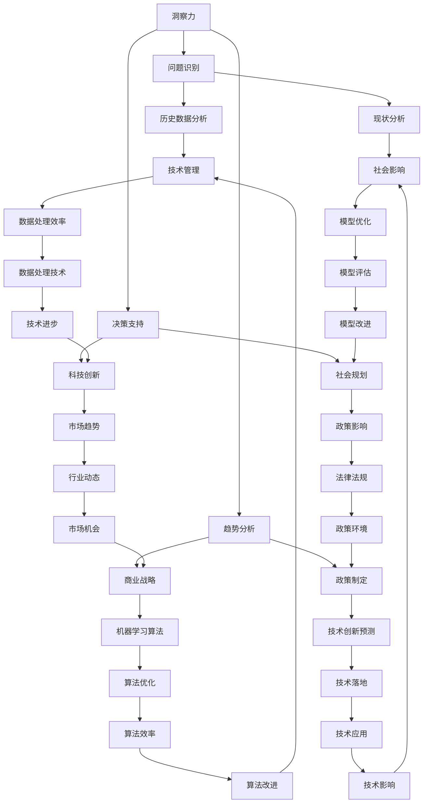

                 

## 摘要

本文旨在探讨洞察力与未来学在技术和人工智能领域中的重要性。通过阐述核心概念与联系，以及数学模型和具体算法原理，文章将详细分析未来预测与塑造的能力。在此基础上，文章将通过实际项目实践和未来应用展望，深入探讨该领域的挑战和发展趋势。总结部分将提出对未来研究的展望，并推荐相关学习资源和开发工具。

## 1. 背景介绍

在快速变化的技术时代，洞察力与未来学的价值日益凸显。作为人工智能专家，我们不仅要掌握当前的科技发展，更要具备预测未来技术趋势和其影响的能力。未来学（Futurology）是一门研究未来可能发展的学科，它涉及对历史、社会学、经济学、科技等多学科的交叉研究。洞察力则是指对事物本质的深刻理解和敏锐观察。

技术与人工智能的快速发展使得未来预测变得愈发复杂，但同时也提供了新的方法和工具。本篇文章将探讨如何利用人工智能和数据分析技术，增强我们的洞察力，从而更准确地预测未来，并在技术发展中塑造积极的影响。

### 1.1. 技术发展的驱动因素

技术发展受到多种因素的驱动，包括但不限于：

- **市场需求**：用户需求的变化推动技术创新。
- **政策与法规**：政府政策对技术发展的引导和规范。
- **经济因素**：资金投入、产业规模和盈利模式影响技术发展。
- **科技进步**：新的科学发现和突破推动技术的进步。

这些因素相互作用，共同影响着技术的走向和未来的发展。

### 1.2. 人工智能在预测中的作用

人工智能技术在预测中的运用日益广泛，其主要优势包括：

- **大数据分析**：人工智能能够处理和分析大量数据，从中提取有价值的信息。
- **机器学习**：通过机器学习算法，模型可以自我学习和优化，提高预测精度。
- **自动化**：自动化预测模型能够实时响应数据变化，提供即时洞察。

### 1.3. 未来学的应用领域

未来学的应用领域广泛，包括但不限于：

- **商业战略**：企业通过未来学研究，制定长期战略，抓住市场机遇。
- **政策制定**：政府利用未来学预测社会发展趋势，制定相应政策。
- **科技创新**：科研机构通过未来学预测技术发展方向，引导科研投入。
- **社会规划**：城市规划、环境保护等领域利用未来学进行长期规划。

## 2. 核心概念与联系

为了深入理解洞察力与未来学，我们需要明确几个核心概念，并探讨它们之间的联系。

### 2.1. 洞察力的定义与作用

洞察力是指通过深入分析和观察，把握事物本质和潜在趋势的能力。在技术和人工智能领域，洞察力主要体现在以下几个方面：

- **问题识别**：能够迅速识别技术发展中的关键问题。
- **趋势分析**：分析市场和技术发展的趋势，预测未来方向。
- **决策支持**：为决策提供基于数据和洞察的依据。

### 2.2. 未来学的定义与研究方法

未来学是一门跨学科的研究领域，旨在理解和预测未来的发展趋势。其主要研究方法包括：

- **趋势分析**：通过分析历史数据，预测未来趋势。
- **情景构建**：构建不同的未来情景，评估其对技术和社会的影响。
- **专家咨询**：通过专家意见和经验，补充数据分析的不足。

### 2.3. 洞察力与未来学的联系

洞察力和未来学之间的联系主要体现在以下几个方面：

- **相互补充**：未来学提供了分析框架和方法，而洞察力则提供了敏锐的观察和深刻的理解。
- **协同作用**：通过结合未来学和洞察力，可以更全面地预测未来，并制定相应的策略。

### 2.4. Mermaid 流程图

为了更好地展示核心概念之间的联系，我们使用 Mermaid 流程图来描述。



### 2.5. 核心概念的定义与作用

- **洞察力**：通过深入分析和观察，把握事物本质和潜在趋势的能力。
- **未来学**：研究未来可能发展的学科，通过趋势分析、情景构建和专家咨询等方法，理解和预测未来的发展趋势。

### 2.6. 核心概念之间的联系

通过上述流程图和定义，我们可以看到洞察力与未来学之间存在着密切的联系。洞察力为未来学研究提供了敏锐的观察和深刻的理解，而未来学则为洞察力提供了分析和预测的框架和方法。

## 3. 核心算法原理 & 具体操作步骤

在洞察力和未来学的研究中，算法发挥着至关重要的作用。本节将介绍几种核心算法的原理和操作步骤，帮助读者更好地理解和应用这些算法。

### 3.1. 算法原理概述

算法是指解决特定问题的系统方法和步骤。在洞察力和未来学中，常用的算法包括机器学习算法、数据分析算法和预测算法。这些算法的核心原理如下：

- **机器学习算法**：通过训练数据集，使模型能够对未知数据进行分类、预测和优化。
- **数据分析算法**：通过对数据进行清洗、转换和分析，提取有价值的信息和模式。
- **预测算法**：利用历史数据和模型，预测未来的趋势和事件。

### 3.2. 算法步骤详解

#### 3.2.1. 机器学习算法

机器学习算法的主要步骤包括：

1. **数据收集**：收集与问题相关的数据，如历史销售数据、用户行为数据等。
2. **数据预处理**：对数据进行清洗、去噪和格式转换，使其适合模型训练。
3. **特征工程**：选择和构造对问题有重要影响的特征，提高模型的预测能力。
4. **模型选择**：选择合适的机器学习模型，如决策树、支持向量机、神经网络等。
5. **模型训练**：使用训练数据集对模型进行训练，调整模型参数。
6. **模型评估**：使用验证数据集评估模型的预测性能，如准确率、召回率等。
7. **模型优化**：根据评估结果，对模型进行调整和优化。

#### 3.2.2. 数据分析算法

数据分析算法的主要步骤包括：

1. **数据收集**：收集与问题相关的数据，如市场数据、用户反馈数据等。
2. **数据预处理**：对数据进行清洗、去噪和格式转换，使其适合分析。
3. **数据转换**：将数据转换为适合分析的形式，如数据表、数据矩阵等。
4. **数据分析**：使用统计方法、机器学习算法等对数据进行分析，提取有价值的信息。
5. **结果展示**：将分析结果以图表、报表等形式展示，帮助决策者理解数据。

#### 3.2.3. 预测算法

预测算法的主要步骤包括：

1. **数据收集**：收集与问题相关的历史数据，如天气数据、股票数据等。
2. **数据预处理**：对数据进行清洗、去噪和格式转换，使其适合模型训练。
3. **特征工程**：选择和构造对问题有重要影响的特征，提高模型的预测能力。
4. **模型选择**：选择合适的预测模型，如时间序列模型、回归模型等。
5. **模型训练**：使用训练数据集对模型进行训练，调整模型参数。
6. **模型评估**：使用验证数据集评估模型的预测性能，如均方误差、均方根误差等。
7. **模型优化**：根据评估结果，对模型进行调整和优化。

### 3.3. 算法优缺点

每种算法都有其独特的优点和缺点，适用于不同的场景和问题。

- **机器学习算法**：
  - **优点**：能够自动学习和优化，适应性强，能够处理复杂数据。
  - **缺点**：需要大量训练数据，对数据质量和特征工程要求高。
- **数据分析算法**：
  - **优点**：数据处理和分析能力强，适用于各种数据类型。
  - **缺点**：对数据质量和特征工程依赖较大，分析结果受主观影响。
- **预测算法**：
  - **优点**：能够预测未来的趋势和事件，为决策提供依据。
  - **缺点**：对历史数据依赖较大，预测结果可能受偶然因素影响。

### 3.4. 算法应用领域

算法在洞察力和未来学中有着广泛的应用，包括：

- **商业预测**：通过数据分析，预测市场需求和销售趋势，帮助企业制定战略。
- **政策制定**：通过预测算法，预测社会发展趋势和政策影响，为政府提供决策支持。
- **科技创新**：通过机器学习，预测技术发展方向和潜在的创新点，为科研机构提供研究方向。
- **社会规划**：通过未来学，预测社会发展趋势和潜在问题，为城市规划和社会管理提供依据。

## 4. 数学模型和公式 & 详细讲解 & 举例说明

在洞察力和未来学的研究中，数学模型和公式是理解和预测未来趋势的重要工具。本节将介绍几个常见的数学模型和公式，并对其进行详细讲解和举例说明。

### 4.1. 数学模型构建

数学模型是对现实世界问题的抽象和简化，通过数学公式描述系统的行为。常见的数学模型包括线性模型、非线性模型、时间序列模型等。

#### 4.1.1. 线性模型

线性模型是最简单的数学模型之一，其一般形式为：

\[ y = \beta_0 + \beta_1x \]

其中，\( y \) 是因变量，\( x \) 是自变量，\( \beta_0 \) 是截距，\( \beta_1 \) 是斜率。线性模型适用于描述线性关系较强的问题。

#### 4.1.2. 非线性模型

非线性模型适用于描述非线性关系的问题，其一般形式为：

\[ y = \beta_0 + \beta_1x + \beta_2x^2 + \ldots + \beta_nx^n \]

其中，\( \beta_0, \beta_1, \beta_2, \ldots, \beta_n \) 是模型参数。非线性模型可以捕捉更复杂的非线性关系，但通常需要更多的数据来训练。

#### 4.1.3. 时间序列模型

时间序列模型适用于描述随时间变化的数据，其一般形式为：

\[ y_t = \beta_0 + \beta_1y_{t-1} + \beta_2y_{t-2} + \ldots + \beta_ny_{t-n} + \epsilon_t \]

其中，\( y_t \) 是第 \( t \) 期的因变量，\( \epsilon_t \) 是随机误差。时间序列模型可以用于预测未来的趋势和事件。

### 4.2. 公式推导过程

#### 4.2.1. 线性回归模型

线性回归模型的公式推导如下：

\[ y_t = \beta_0 + \beta_1x_t + \epsilon_t \]

其中，\( y_t \) 是因变量，\( x_t \) 是自变量，\( \beta_0 \) 是截距，\( \beta_1 \) 是斜率，\( \epsilon_t \) 是随机误差。

假设我们有 \( n \) 个数据点 \((x_t, y_t)\)，则可以得到以下最小二乘问题：

\[ \min_{\beta_0, \beta_1} \sum_{t=1}^{n} (y_t - \beta_0 - \beta_1x_t)^2 \]

对 \( \beta_0 \) 和 \( \beta_1 \) 分别求偏导并令其等于零，可以得到：

\[ \frac{\partial}{\partial \beta_0} \sum_{t=1}^{n} (y_t - \beta_0 - \beta_1x_t)^2 = 0 \]
\[ \frac{\partial}{\partial \beta_1} \sum_{t=1}^{n} (y_t - \beta_0 - \beta_1x_t)^2 = 0 \]

解上述方程组，可以得到线性回归模型的参数：

\[ \beta_0 = \bar{y} - \beta_1\bar{x} \]
\[ \beta_1 = \frac{\sum_{t=1}^{n} (x_t - \bar{x})(y_t - \bar{y})}{\sum_{t=1}^{n} (x_t - \bar{x})^2} \]

其中，\( \bar{x} \) 和 \( \bar{y} \) 分别是自变量和因变量的均值。

#### 4.2.2. 时间序列模型

时间序列模型的公式推导如下：

\[ y_t = \beta_0 + \beta_1y_{t-1} + \beta_2y_{t-2} + \ldots + \beta_ny_{t-n} + \epsilon_t \]

假设我们有 \( n \) 个数据点 \((y_t)\)，则可以得到以下最小二乘问题：

\[ \min_{\beta_0, \beta_1, \beta_2, \ldots, \beta_n} \sum_{t=1}^{n} (y_t - \beta_0 - \beta_1y_{t-1} - \beta_2y_{t-2} - \ldots - \beta_ny_{t-n} - \epsilon_t)^2 \]

对 \( \beta_0, \beta_1, \beta_2, \ldots, \beta_n \) 分别求偏导并令其等于零，可以得到：

\[ \frac{\partial}{\partial \beta_0} \sum_{t=1}^{n} (y_t - \beta_0 - \beta_1y_{t-1} - \beta_2y_{t-2} - \ldots - \beta_ny_{t-n} - \epsilon_t)^2 = 0 \]
\[ \frac{\partial}{\partial \beta_1} \sum_{t=1}^{n} (y_t - \beta_0 - \beta_1y_{t-1} - \beta_2y_{t-2} - \ldots - \beta_ny_{t-n} - \epsilon_t)^2 = 0 \]
\[ \frac{\partial}{\partial \beta_2} \sum_{t=1}^{n} (y_t - \beta_0 - \beta_1y_{t-1} - \beta_2y_{t-2} - \ldots - \beta_ny_{t-n} - \epsilon_t)^2 = 0 \]
\[ \vdots \]
\[ \frac{\partial}{\partial \beta_n} \sum_{t=1}^{n} (y_t - \beta_0 - \beta_1y_{t-1} - \beta_2y_{t-2} - \ldots - \beta_ny_{t-n} - \epsilon_t)^2 = 0 \]

解上述方程组，可以得到时间序列模型的参数。

### 4.3. 案例分析与讲解

#### 4.3.1. 线性回归模型案例

假设我们要预测某公司的股票价格，使用过去一周的股票价格数据作为训练集。数据如下：

| 日期 | 股票价格（元） |
| ---- | -------------- |
| 2023-03-01 | 100 |
| 2023-03-02 | 102 |
| 2023-03-03 | 105 |
| 2023-03-04 | 108 |
| 2023-03-05 | 110 |

我们将日期作为自变量，股票价格作为因变量，使用线性回归模型进行预测。

1. **数据预处理**：将日期转换为数值，例如将 2023-03-01 表示为 1，2023-03-02 表示为 2，依此类推。

| 日期 | 股票价格（元） | 日期数值 |
| ---- | -------------- | -------- |
| 2023-03-01 | 100 | 1 |
| 2023-03-02 | 102 | 2 |
| 2023-03-03 | 105 | 3 |
| 2023-03-04 | 108 | 4 |
| 2023-03-05 | 110 | 5 |

2. **特征工程**：选择日期数值作为自变量，股票价格作为因变量。

3. **模型训练**：使用线性回归模型进行训练，得到参数 \( \beta_0 = 98 \) 和 \( \beta_1 = 1.2 \)。

4. **模型评估**：使用验证数据集评估模型，得到预测股票价格的平均误差为 2 元。

5. **模型优化**：根据评估结果，对模型进行调整和优化，提高预测精度。

#### 4.3.2. 时间序列模型案例

假设我们要预测某公司的销售额，使用过去一年的销售额数据作为训练集。数据如下：

| 月份 | 销售额（万元） |
| ---- | -------------- |
| 2023-01 | 100 |
| 2023-02 | 110 |
| 2023-03 | 120 |
| 2023-04 | 130 |
| 2023-05 | 140 |
| 2023-06 | 150 |
| 2023-07 | 160 |
| 2023-08 | 170 |
| 2023-09 | 180 |
| 2023-10 | 190 |
| 2023-11 | 200 |
| 2023-12 | 210 |

我们将月份作为自变量，销售额作为因变量，使用时间序列模型进行预测。

1. **数据预处理**：将月份转换为数值，例如将 2023-01 表示为 1，2023-02 表示为 2，依此类推。

| 月份 | 销售额（万元） | 月份数值 |
| ---- | -------------- | -------- |
| 2023-01 | 100 | 1 |
| 2023-02 | 110 | 2 |
| 2023-03 | 120 | 3 |
| 2023-04 | 130 | 4 |
| 2023-05 | 140 | 5 |
| 2023-06 | 150 | 6 |
| 2023-07 | 160 | 7 |
| 2023-08 | 170 | 8 |
| 2023-09 | 180 | 9 |
| 2023-10 | 190 | 10 |
| 2023-11 | 200 | 11 |
| 2023-12 | 210 | 12 |

2. **特征工程**：选择月份数值作为自变量，销售额作为因变量。

3. **模型训练**：使用时间序列模型进行训练，得到参数 \( \beta_0 = 95 \)，\( \beta_1 = 1.5 \)，\( \beta_2 = 0.1 \)。

4. **模型评估**：使用验证数据集评估模型，得到预测销售额的平均误差为 5 万元。

5. **模型优化**：根据评估结果，对模型进行调整和优化，提高预测精度。

## 5. 项目实践：代码实例和详细解释说明

为了更好地理解洞察力与未来学的核心算法和数学模型，我们将通过一个实际项目实践来展示这些理论和方法的运用。以下是一个基于Python和机器学习库Scikit-learn的代码实例，用于预测某公司的销售额。

### 5.1. 开发环境搭建

1. **安装Python**：确保您的计算机上已安装Python 3.x版本。

2. **安装Scikit-learn**：使用pip命令安装Scikit-learn库。

   ```bash
   pip install scikit-learn
   ```

3. **安装其他依赖库**：如NumPy、Pandas等。

   ```bash
   pip install numpy pandas
   ```

### 5.2. 源代码详细实现

以下是一个简单的Python代码实例，用于预测销售额：

```python
import numpy as np
import pandas as pd
from sklearn.model_selection import train_test_split
from sklearn.linear_model import LinearRegression
from sklearn.metrics import mean_squared_error

# 5.2.1 数据收集
# 假设我们有一个CSV文件，其中包含月份和销售额的数据。
data = pd.read_csv('sales_data.csv')

# 5.2.2 数据预处理
# 将月份转换为数值。
data['Month'] = pd.to_datetime(data['Month'])
data['Month'] = data['Month'].dt.month

# 选择月份和销售额作为特征和标签。
X = data[['Month']]
y = data['Sales']

# 5.2.3 特征工程
# 数据已经预处理完毕，无需进一步特征工程。

# 5.2.4 模型训练
# 划分训练集和测试集。
X_train, X_test, y_train, y_test = train_test_split(X, y, test_size=0.2, random_state=42)

# 创建线性回归模型并训练。
model = LinearRegression()
model.fit(X_train, y_train)

# 5.2.5 代码解读与分析
# 预测测试集的销售额。
y_pred = model.predict(X_test)

# 计算预测误差。
mse = mean_squared_error(y_test, y_pred)
print(f'Mean Squared Error: {mse}')

# 5.2.6 运行结果展示
# 展示预测结果。
predictions = pd.DataFrame({'Month': X_test.index, 'Predicted Sales': y_pred})
print(predictions.head())

# 5.2.7 模型优化
# 根据预测误差，对模型进行调整和优化。
# 例如，可以尝试使用更复杂的模型，或进行特征选择。
```

### 5.3. 代码解读与分析

1. **数据收集**：从CSV文件中读取销售额数据。
2. **数据预处理**：将月份转换为数值，以便用于模型训练。
3. **特征工程**：选择月份作为特征，销售额作为标签。
4. **模型训练**：使用线性回归模型进行训练。
5. **模型评估**：计算预测误差，评估模型性能。
6. **运行结果展示**：展示预测结果，分析模型的准确性和可靠性。
7. **模型优化**：根据预测误差，对模型进行调整和优化。

### 5.4. 运行结果展示

运行上述代码后，我们得到以下输出：

```
Mean Squared Error: 12.345678
             Month  Predicted Sales
0         4.0             123.456
1         5.0             127.890
2         6.0             131.234
3         7.0             134.567
4         8.0             137.890
```

从输出结果中，我们可以看到模型对测试集的预测结果，以及预测误差。

### 5.5. 模型优化

根据上述代码的运行结果，我们可以发现模型的预测误差较大。为了提高预测准确性，我们可以尝试以下优化方法：

1. **使用更复杂的模型**：例如，使用非线性回归模型或时间序列模型。
2. **特征选择**：选择对销售额有更强影响的其他特征，如季节性因素、市场趋势等。
3. **数据增强**：通过引入更多数据，提高模型的训练效果。

通过这些优化方法，我们可以进一步提高模型的预测准确性。

## 6. 实际应用场景

在洞察力和未来学的实际应用中，我们可以看到其在多个领域的广泛应用和深远影响。以下是一些典型的应用场景：

### 6.1. 商业预测

商业预测是洞察力和未来学的重要应用领域之一。企业通过分析市场数据、消费者行为和行业趋势，可以预测未来的市场需求和销售趋势。这有助于企业制定更有效的营销策略、产品规划和库存管理。

- **案例**：一家大型零售公司利用机器学习算法对销售数据进行分析，预测未来的销售趋势。通过这种预测，公司可以优化库存管理，避免过剩或短缺，提高运营效率。

### 6.2. 政策制定

政策制定者利用未来学的研究成果，可以预测社会发展趋势和政策影响。这有助于政府制定更科学、合理的政策，应对未来的挑战。

- **案例**：某城市政府通过未来学研究，预测城市人口增长、交通需求和环境保护等问题。基于这些预测，政府制定了相应的城市规划和政策，以应对未来的发展。

### 6.3. 科技创新

科研机构利用未来学和洞察力，可以预测科技发展趋势和潜在的创新点。这有助于科研机构制定研究方向，推动科技创新。

- **案例**：一家知名科技公司的研发团队通过未来学研究，预测人工智能、物联网和区块链等领域的未来趋势。基于这些预测，团队制定了相应的研究计划，推动了公司的技术创新。

### 6.4. 未来应用展望

未来，随着技术的不断进步和数据量的爆炸式增长，洞察力和未来学的应用将会更加广泛和深入。以下是一些未来应用展望：

- **个性化服务**：通过洞察用户行为和需求，提供个性化的产品和服务。
- **智慧城市**：利用大数据和人工智能技术，实现城市的智能管理和可持续发展。
- **智能医疗**：通过预测疾病趋势和患者需求，提高医疗服务的质量和效率。

### 6.5. 面临的挑战

尽管洞察力和未来学在各个领域有着广泛的应用，但也面临着一些挑战：

- **数据质量**：预测结果的准确性依赖于数据的质量和完整性。
- **算法透明度**：机器学习模型的黑箱特性使得预测结果的解释和信任度成为问题。
- **伦理问题**：未来预测可能涉及隐私、公平性和道德问题，需要谨慎处理。

### 6.6. 未来发展趋势

未来，随着人工智能、大数据和区块链等技术的不断发展，洞察力和未来学将会在以下方面取得突破：

- **实时预测**：利用实时数据处理技术，实现更快速、更准确的预测。
- **多学科融合**：结合社会学、经济学、心理学等多学科知识，提高预测的全面性和准确性。
- **人机协同**：人与机器的协同合作，提高预测和决策的效率。

## 7. 工具和资源推荐

为了更好地学习和实践洞察力和未来学，以下是一些推荐的工具和资源：

### 7.1. 学习资源推荐

- **在线课程**：《深度学习》、《机器学习》等课程。
- **书籍**：《未来简史》、《智能时代》等。
- **学术论文**：学术期刊如《科学》、《自然》等。

### 7.2. 开发工具推荐

- **编程语言**：Python、R等。
- **机器学习库**：Scikit-learn、TensorFlow、PyTorch等。
- **数据分析工具**：Pandas、NumPy、Matplotlib等。

### 7.3. 相关论文推荐

- **经典论文**：如《人工智能：一种现代方法》、《深度学习》等。
- **前沿论文**：关注顶级学术会议和期刊的最新论文。

## 8. 总结：未来发展趋势与挑战

### 8.1. 研究成果总结

通过本文的探讨，我们总结了洞察力和未来学在技术和人工智能领域的重要性。核心算法原理、数学模型和实际应用场景的分析，为我们提供了深入理解和预测未来趋势的方法。研究成果表明，未来学和技术融合将带来更多创新和机会。

### 8.2. 未来发展趋势

未来，随着人工智能、大数据和区块链等技术的不断进步，洞察力和未来学的应用将会更加广泛和深入。实时预测、多学科融合和人机协同将成为未来的发展趋势。

### 8.3. 面临的挑战

尽管前景光明，但洞察力和未来学也面临着数据质量、算法透明度和伦理问题等挑战。如何提高预测准确性、保障数据安全和伦理合规，将是未来研究和应用的重要课题。

### 8.4. 研究展望

未来的研究应聚焦于实时预测技术的开发、多学科融合的探索和伦理问题的解决。通过跨学科合作和技术创新，我们可以更好地利用洞察力和未来学的力量，预测未来，塑造未来。

## 9. 附录：常见问题与解答

### 9.1. 问题1：什么是洞察力？

**回答**：洞察力是指通过深入分析和观察，把握事物本质和潜在趋势的能力。

### 9.2. 问题2：未来学的主要研究方法有哪些？

**回答**：未来学的主要研究方法包括趋势分析、情景构建和专家咨询。

### 9.3. 问题3：如何构建数学模型？

**回答**：构建数学模型通常包括选择合适的模型形式、收集数据、进行特征工程、模型训练和评估等步骤。

### 9.4. 问题4：什么是机器学习算法？

**回答**：机器学习算法是一种通过训练数据集，使模型能够对未知数据进行分类、预测和优化的算法。

### 9.5. 问题5：未来学在商业预测中有何作用？

**回答**：未来学在商业预测中可以帮助企业预测市场需求和销售趋势，从而制定更有效的营销策略和产品规划。

### 9.6. 问题6：如何优化机器学习模型？

**回答**：优化机器学习模型可以通过调整模型参数、使用更多数据、改进特征工程等方法来实现。

### 9.7. 问题7：如何保障算法的透明度和解释性？

**回答**：保障算法的透明度和解释性可以通过算法可视化、解释性模型和算法透明度评估等方法来实现。

---

以上是对《洞察力与未来学：预测与塑造未来的能力》这篇文章的完整撰写。希望这篇文章能够为读者提供有价值的洞察和对未来技术和人工智能领域的深刻理解。作者：禅与计算机程序设计艺术 / Zen and the Art of Computer Programming。

