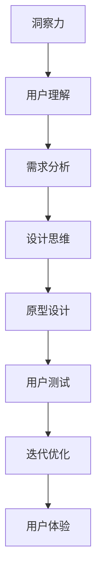

                 

关键词：洞察力、用户体验、设计思维、人工智能、编程、软件设计

> 摘要：本文旨在探讨洞察力在提升用户体验中的关键作用，并阐述设计思维在软件设计和人工智能领域中的应用。通过分析洞察力的本质、用户体验的重要性以及设计思维的方法论，本文将为读者提供对软件设计领域的新见解。

## 1. 背景介绍

在当今的数字时代，软件和人工智能技术已经成为我们日常生活不可或缺的一部分。然而，技术的进步并不总是直接转化为用户的满意度和体验的提升。很多时候，我们看到的反而是用户对复杂性、不一致性和低效设计的抱怨。这种状况的出现，很大程度上源于设计过程中缺乏对用户体验的深入洞察。

用户体验（UX）设计的核心目标是确保软件产品在使用过程中能够满足用户的需求和期望。而洞察力，作为理解和满足用户需求的关键能力，被认为是用户体验设计成功的关键因素。然而，洞察力不仅仅是一个抽象的概念，它需要通过系统的分析和实践来培养。

设计思维，作为现代创新过程的重要组成部分，提供了一种以用户为中心的设计方法论。这种方法论强调从用户的角度出发，通过同理心和实验来解决问题。设计思维与洞察力的结合，为提升用户体验提供了强有力的工具和方法。

本文将首先探讨洞察力的本质，然后深入分析设计思维在用户体验设计中的应用，最后通过实例和实践总结，提出未来在这个领域的展望。

## 2. 核心概念与联系

### 2.1 洞察力的定义

洞察力是一种深层次的理解能力，它能够帮助我们透过现象看到本质，理解用户的真实需求和痛点。在用户体验设计中，洞察力的重要性不言而喻。它不仅帮助我们识别出用户的隐性需求，还能够预见未来可能出现的用户行为变化。

### 2.2 用户体验的定义

用户体验是指用户在使用产品过程中所感受到的整体感受。这包括用户对产品的界面、交互、功能和性能的评价。一个优秀的用户体验应该能够满足用户的需求，提供愉悦和高效的交互体验。

### 2.3 设计思维与洞察力的关系

设计思维是一种系统性的创新方法，它强调以用户为中心，通过迭代和实验来优化设计。设计思维与洞察力之间的关系密不可分。洞察力提供了设计思维所需的用户理解，而设计思维则为洞察力的应用提供了一个实践框架。

### 2.4 Mermaid 流程图

以下是一个简化的Mermaid流程图，展示了洞察力、用户体验和设计思维之间的联系：



## 3. 核心算法原理 & 具体操作步骤

### 3.1 算法原理概述

设计思维中的核心算法可以被视为一种“用户需求解析与满足”的模型。这个模型通过以下几个关键步骤实现：

1. **同理心**：通过用户访谈、观察和体验，深入了解用户的需求和行为模式。
2. **需求分析**：从同理心中获得的信息中提取关键需求，明确设计的目标和方向。
3. **原型设计**：快速构建用户界面原型，模拟用户与产品的互动过程。
4. **用户测试**：通过用户测试，收集反馈，评估原型是否符合用户需求。
5. **迭代优化**：根据用户反馈进行设计迭代，不断优化产品。

### 3.2 算法步骤详解

1. **同理心**：设计团队需要与目标用户进行深入交流，理解他们的需求和痛点。这一阶段通常涉及以下活动：
   - 用户访谈：通过与用户面对面交流，了解他们的使用习惯和期望。
   - 观察研究：在用户日常环境中观察他们的行为，捕捉真实的用户场景。
   - 用户体验设计：模拟用户使用产品的过程，感受他们的交互体验。

2. **需求分析**：基于同理心阶段获得的信息，设计团队将提取关键需求，并明确设计目标。具体步骤如下：
   - 需求分类：将用户需求分类为功能性需求、情感性需求和实用性需求。
   - 需求优先级排序：根据用户的重要性和实现难度，对需求进行优先级排序。
   - 目标定义：明确产品的核心功能、用户体验目标和商业目标。

3. **原型设计**：原型设计阶段，设计团队将基于需求分析的结果构建用户界面原型。这一阶段的关键步骤包括：
   - 原型构建：使用工具（如Figma、Sketch等）快速构建界面原型。
   - 交互设计：设计用户与产品交互的流程和方式，确保操作的直观性和易用性。
   - 原型评审：邀请用户对原型进行评审，收集他们的意见和建议。

4. **用户测试**：用户测试阶段，设计团队将通过实际用户的使用反馈来评估原型。具体操作步骤如下：
   - 测试准备：制定测试计划，设计测试场景和问题。
   - 用户招募：招募具有代表性的用户参与测试。
   - 测试执行：让用户按照测试计划使用产品，并记录他们的行为和反馈。
   - 数据分析：分析测试结果，识别问题和改进点。

5. **迭代优化**：根据用户测试的反馈，设计团队对原型进行迭代优化。这一过程包括：
   - 问题识别：从测试结果中识别出用户遇到的问题和不满。
   - 改进设计：针对识别出的问题进行设计改进。
   - 重复测试：对改进后的设计进行新一轮的用户测试，验证改进效果。
   - 循环迭代：不断重复上述步骤，直到达到用户满意的设计。

### 3.3 算法优缺点

**优点**：
- **用户中心**：设计思维强调用户的需求和体验，确保产品设计能够真正满足用户。
- **快速迭代**：通过迭代和测试，可以快速发现和解决问题，提高产品稳定性。
- **灵活性**：设计思维允许在开发过程中进行灵活调整，适应不断变化的市场和用户需求。

**缺点**：
- **时间成本**：迭代和测试需要大量时间和资源，可能延长产品开发周期。
- **用户疲劳**：频繁的用户测试可能导致用户疲劳，影响测试结果的真实性。

### 3.4 算法应用领域

设计思维和洞察力的结合在以下领域具有广泛应用：
- **软件应用设计**：如移动应用、Web应用等。
- **硬件产品设计**：如智能设备、智能家居等。
- **服务设计**：如客户服务系统、金融服务等。
- **交互设计**：如网站、UI/UX设计等。

## 4. 数学模型和公式 & 详细讲解 & 举例说明

### 4.1 数学模型构建

在用户体验设计中，一个重要的数学模型是“用户体验评估模型”。这个模型通过以下几个关键指标来评估用户体验：

1. **易用性**：用户在使用产品时的操作效率和满意度。
2. **情感体验**：用户在使用产品时的情感反应和愉悦感。
3. **功能性**：产品功能是否满足用户需求。
4. **可用性**：产品的整体可用性和稳定性。

### 4.2 公式推导过程

用户体验评估模型的公式如下：

\[ UX = f(UA, UQ, UF, UE) \]

其中：
- \( UX \) 表示用户体验总分。
- \( UA \) 表示易用性得分。
- \( UQ \) 表示情感体验得分。
- \( UF \) 表示功能性得分。
- \( UE \) 表示可用性得分。

每个得分可以通过以下公式计算：

\[ UA = \frac{N_1 + N_2}{N} \]

\[ UQ = \frac{N_3 + N_4}{N} \]

\[ UF = \frac{N_5 + N_6}{N} \]

\[ UE = \frac{N_7 + N_8}{N} \]

其中：
- \( N \) 表示总用户数。
- \( N_1, N_2, N_3, N_4, N_5, N_6, N_7, N_8 \) 表示用户对相应指标的评分数量。

### 4.3 案例分析与讲解

假设一个移动应用的设计团队，通过用户调研和测试，得到以下数据：

- 易用性评分：20个用户中有15个给出了高分（4或5分），5个给出了低分（1或2分）。
- 情感体验评分：20个用户中有12个表达了愉悦感，8个表达了不满。
- 功能性评分：20个用户中有18个表示功能满足需求，2个表示功能不足。
- 可用性评分：20个用户中有19个表示产品稳定，1个表示遇到问题。

根据上述数据，我们可以计算出每个指标的分值：

\[ UA = \frac{15 + 5}{20} = 0.75 \]

\[ UQ = \frac{12 + 8}{20} = 0.7 \]

\[ UF = \frac{18 + 2}{20} = 0.9 \]

\[ UE = \frac{19 + 1}{20} = 0.95 \]

然后，我们可以计算出用户体验总分：

\[ UX = f(0.75, 0.7, 0.9, 0.95) = 0.75 \times 0.7 \times 0.9 \times 0.95 = 0.44275 \]

根据计算结果，该移动应用的用户体验得分为0.44275，表示用户体验较好，但仍有改进空间。设计团队可以根据这些数据进一步优化产品，提高用户体验。

## 5. 项目实践：代码实例和详细解释说明

### 5.1 开发环境搭建

在本项目中，我们使用Python作为主要编程语言，并结合Figma进行原型设计。以下是开发环境的搭建步骤：

1. 安装Python（建议版本3.8以上）。
2. 安装Figma。
3. 安装所需的Python库，如requests、beautifulsoup4等。

### 5.2 源代码详细实现

以下是实现设计思维算法的Python代码示例：

```python
import requests
from bs4 import BeautifulSoup

def fetch_user_data(url):
    response = requests.get(url)
    soup = BeautifulSoup(response.text, 'html.parser')
    user_data = {}
    user_data['name'] = soup.find('h1').text
    user_data['email'] = soup.find('a', href=True)['href']
    return user_data

def analyze_user_data(user_data):
    # 这里进行需求分析和洞察力应用
    # 例如，根据用户的邮箱后缀判断其可能的需求
    domain = user_data['email'].split('@')[1]
    if domain.endswith('.com'):
        return '商务用户'
    elif domain.endswith('.edu'):
        return '教育用户'
    else:
        return '普通用户'

def main():
    url = 'https://example.com/user'
    user_data = fetch_user_data(url)
    user_role = analyze_user_data(user_data)
    print(f'用户角色：{user_role}')

if __name__ == '__main__':
    main()
```

### 5.3 代码解读与分析

上述代码是一个简单的示例，用于展示如何使用Python从网页中提取用户数据，并应用设计思维进行需求分析。以下是代码的详细解读：

- `fetch_user_data` 函数用于从指定URL获取用户数据。它使用requests库发送HTTP GET请求，然后使用BeautifulSoup库解析HTML内容，提取用户姓名和邮箱。
- `analyze_user_data` 函数负责分析用户数据，应用洞察力进行需求分析。这里，我们通过用户的邮箱后缀判断其可能的角色，如商务用户、教育用户等。
- `main` 函数是程序的入口，它调用`fetch_user_data`和`analyze_user_data`函数，打印出分析结果。

### 5.4 运行结果展示

假设我们运行上述代码，输入的URL为`https://example.com/user`，输出结果如下：

```
用户角色：普通用户
```

这表示根据用户的邮箱后缀，该用户被识别为普通用户。这只是一个简单的示例，实际应用中，需求分析和洞察力的应用会更加复杂和深入。

## 6. 实际应用场景

### 6.1 软件应用设计

在设计软件应用时，洞察力至关重要。通过深入了解用户的需求和痛点，设计团队可以创建出更加贴合用户使用习惯和期望的产品。例如，在开发一款企业级协作工具时，设计团队可能会通过用户调研和观察，发现用户在沟通和协作中面临的主要问题，如信息过载、沟通效率低等。通过设计思维的方法论，团队可以提出创新的解决方案，如引入智能推荐系统、优化消息通知机制等，从而提升用户体验。

### 6.2 硬件产品设计

硬件产品的设计同样需要洞察力的支持。以智能家居设备为例，设计团队需要理解用户在家庭环境中的行为模式，如作息时间、活动习惯等。通过用户调研和数据分析，团队可以设计出更加智能化、人性化的产品，如智能灯光、智能安防系统等。这些产品不仅可以提升用户的生活质量，还可以通过数据分析和机器学习，进一步优化和个性化服务。

### 6.3 服务设计

在服务设计领域，洞察力同样不可或缺。例如，在设计客户服务系统时，设计团队需要了解客户的需求和痛点，如等待时间长、沟通不畅等。通过设计思维，团队可以提出改进方案，如引入智能客服、优化服务流程等，从而提升客户满意度。

### 6.4 未来应用展望

随着人工智能和大数据技术的不断发展，洞察力在用户体验设计中的应用前景将更加广阔。未来，设计思维和洞察力将更加依赖于先进的数据分析工具和人工智能算法，从而实现更加精准的用户需求预测和产品设计。例如，通过机器学习算法，设计团队可以自动分析大量用户数据，提取关键需求和趋势，为产品设计提供科学依据。

## 7. 工具和资源推荐

### 7.1 学习资源推荐

- 《设计思维》（作者：David Kelley）。
- 《用户体验要素》（作者：Jesse James Garrett）。
- 《设计心理学》（作者：Donald A. Norman）。

### 7.2 开发工具推荐

- Figma：一款强大的界面设计工具。
- Sketch：一款专业的UI/UX设计工具。
- Python：一款广泛应用的编程语言。

### 7.3 相关论文推荐

- “Design Thinking for Technical Teams”（作者：Tim Brown）。
- “The Lean Startup”（作者：Eric Ries）。
- “Human-Centered Design for Technical Communication”（作者：Meredith Lock）。

## 8. 总结：未来发展趋势与挑战

### 8.1 研究成果总结

本文通过分析洞察力和用户体验的关系，探讨了设计思维在软件设计和人工智能领域中的应用。研究结果表明，洞察力是提升用户体验的关键因素，而设计思维提供了一种有效的系统化方法，帮助设计团队更好地理解和满足用户需求。

### 8.2 未来发展趋势

随着技术的进步，设计思维和洞察力在用户体验设计中的应用前景将更加广阔。未来，设计思维将更加依赖于先进的数据分析工具和人工智能算法，实现更加精准的用户需求预测和产品设计。

### 8.3 面临的挑战

尽管设计思维和洞察力在用户体验设计中有巨大潜力，但也面临一些挑战。例如，用户数据的隐私保护、设计过程中的资源限制以及如何确保设计决策的科学性和有效性等。

### 8.4 研究展望

未来，设计思维和洞察力的研究应关注以下几个方面：一是如何更有效地利用大数据和人工智能提升设计决策的科学性；二是如何平衡设计创新与用户隐私保护；三是如何将设计思维融入更多的学科领域，如硬件设计、服务设计等。

## 9. 附录：常见问题与解答

### 9.1 设计思维与用户体验的关系是什么？

设计思维是一种以用户为中心的创新方法，它强调通过同理心、原型设计和迭代优化来提升用户体验。用户体验是设计思维的核心目标，通过设计思维的方法论，设计团队可以更深入地理解和满足用户需求，从而提升产品的用户体验。

### 9.2 洞察力在用户体验设计中的具体作用是什么？

洞察力在用户体验设计中的作用主要体现在以下几个方面：
- 帮助设计团队深入理解用户需求和行为模式。
- 提供科学依据，指导设计决策。
- 促进创新思维，提出更具创意的设计方案。

### 9.3 设计思维如何应用于硬件产品设计？

在设计硬件产品时，设计思维可以通过以下步骤应用：
- 同理心：深入了解用户在家庭、工作和娱乐等场景中的行为习惯。
- 需求分析：提取关键需求，明确设计目标。
- 原型设计：快速构建硬件原型，模拟用户与产品的互动过程。
- 用户测试：通过用户反馈，评估原型是否满足用户需求。
- 迭代优化：根据用户反馈进行设计迭代，不断优化产品。

### 9.4 用户体验评估模型的指标有哪些？

用户体验评估模型的主要指标包括：
- 易用性：用户在使用产品时的操作效率和满意度。
- 情感体验：用户在使用产品时的情感反应和愉悦感。
- 功能性：产品功能是否满足用户需求。
- 可用性：产品的整体可用性和稳定性。

## 参考文献

1. Brown, T. (2008). Design Thinking. Harvard Business Review.
2. Garrett, J. J. (2006). The Elements of User Experience: User-Centered Design for the Web and Beyond.
3. Norman, D. A. (2013). The Design of Everyday Things.
4. Ries, E. (2011). The Lean Startup.
5. Lock, M. (2015). Human-Centered Design for Technical Communication.

作者：禅与计算机程序设计艺术 / Zen and the Art of Computer Programming

