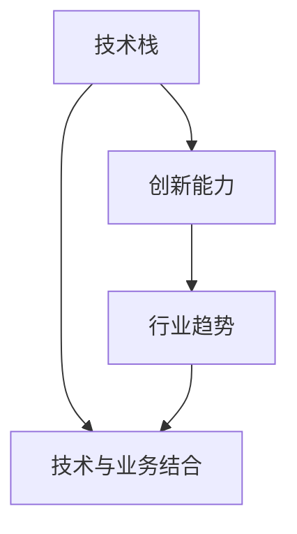

                 

关键词：洞察力、职业发展、专业成长、技术栈、创新能力、行业趋势

> 摘要：本文旨在探讨洞察力在IT职业发展中的关键作用，通过深入分析技术领域的核心概念、算法原理、数学模型以及实际应用，揭示专业成长路径。文章将结合具体案例，探讨未来发展趋势，为读者提供实用的工具和资源推荐。

## 1. 背景介绍

在当今快速发展的技术时代，IT行业呈现出前所未有的变革。从云计算、大数据到人工智能，各个领域的技术日新月异，推动了各行各业的数字化转型。在这样的背景下，专业人才的职业发展不仅依赖于扎实的技术功底，更需要具备卓越的洞察力。

洞察力，是指对复杂问题本质的深刻理解和洞察能力。在IT领域，具备洞察力意味着能够快速把握技术趋势，预见潜在的风险与机会，从而在激烈的竞争中立于不败之地。本文将从以下几个部分展开，探讨洞察力与职业发展的关系。

### 1.1 技术快速迭代

随着技术的快速发展，IT领域呈现出快速迭代的特点。新的技术、工具和架构不断涌现，要求从业人员具备敏锐的洞察力，及时更新知识储备，掌握前沿技术。例如，云计算的兴起使得虚拟化技术成为必备技能，而大数据分析则要求掌握Hadoop、Spark等分布式处理框架。

### 1.2 行业需求变化

随着行业需求的不断变化，传统的IT岗位也在不断演化。从前端开发者到后端工程师，从系统架构师到数据科学家，每个职位都在适应新的技术和业务需求。具备洞察力的IT专业人士能够准确预测行业趋势，调整自己的职业规划，抓住发展机遇。

## 2. 核心概念与联系

为了深入探讨洞察力在IT职业发展中的作用，我们需要首先了解几个核心概念，并分析它们之间的联系。

### 2.1 技术栈

技术栈是指一个专业领域内所涉及的各种技术、工具和框架的集合。一个完整的技术栈包括前端、后端、数据库、云计算、大数据、人工智能等多个方面。具备广泛的技术栈可以帮助IT专业人士更好地应对复杂问题，提升职业竞争力。

### 2.2 创新能力

创新能力是指发现新问题、提出新解决方案的能力。在技术领域，创新能力体现在对现有技术的改进、新技术的发明和应用。具备创新能力的IT专业人士能够在竞争激烈的市场中脱颖而出，推动行业的发展。

### 2.3 行业趋势

行业趋势是指一个行业在未来一段时间内的发展方向和趋势。了解行业趋势可以帮助IT专业人士把握市场机遇，调整自己的职业发展方向。例如，随着物联网、区块链等新技术的兴起，具备相关技能的专业人士将迎来更广阔的职业前景。

### 2.4 技术与业务结合

在IT领域，技术与业务的结合至关重要。了解业务需求，能够帮助IT专业人士更好地设计系统、优化流程，提升业务效率。同时，通过业务需求，IT专业人士也可以发现新的技术需求，推动技术的发展。

### 2.5 Mermaid 流程图

为了更直观地展示核心概念之间的联系，我们可以使用Mermaid流程图来描述。



## 3. 核心算法原理 & 具体操作步骤

### 3.1 算法原理概述

在IT领域，算法是解决问题的基础。一个优秀的算法不仅能够提高系统性能，还能够优化资源利用。下面我们将介绍一个典型的算法——动态规划。

动态规划是一种解决最优化问题的算法，通过将复杂问题分解为子问题，并存储子问题的解，避免重复计算，从而提高算法效率。

### 3.2 算法步骤详解

#### 3.2.1 确定状态

动态规划的第一步是确定状态。状态是指问题的一个具体表现形式，通常由一组变量表示。例如，在经典的背包问题中，状态可以表示为当前已选物品的集合。

#### 3.2.2 状态转移方程

状态转移方程描述了状态之间的转换关系。对于背包问题，状态转移方程可以表示为：

$$
f(i, j) = \begin{cases}
    f(i-1, j) & \text{如果不选物品} i \\
    f(i-1, j-w_i) + v_i & \text{如果选物品} i
\end{cases}
$$

其中，$f(i, j)$ 表示在前 $i$ 个物品中选择前 $j$ 单位的最大价值，$w_i$ 和 $v_i$ 分别表示物品 $i$ 的重量和价值。

#### 3.2.3 状态初始化

状态初始化是指初始化状态数组。通常，状态数组的大小为问题的输入规模。对于背包问题，状态数组的大小为 $n \times W$，其中 $n$ 表示物品数量，$W$ 表示背包容量。

#### 3.2.4 状态计算

状态计算是指根据状态转移方程，逐步计算每个状态的最优解。通常，状态计算是从底向上或从顶向下进行的。对于背包问题，我们通常从底向上计算。

### 3.3 算法优缺点

动态规划算法具有以下优点：

- **高效性**：通过避免重复计算，动态规划算法能够在复杂问题中达到线性或对数级别的时间复杂度。
- **通用性**：动态规划算法适用于各种最优化问题，如背包问题、最长公共子序列问题等。

然而，动态规划算法也存在一些缺点：

- **空间复杂度**：动态规划算法通常需要较大的存储空间，特别是在状态数组较大时。
- **代码复杂性**：动态规划算法的代码实现相对复杂，需要深入理解状态转移方程和状态初始化过程。

### 3.4 算法应用领域

动态规划算法广泛应用于各种领域，包括：

- **计算机科学**：如背包问题、最长公共子序列问题等。
- **经济学**：如资源分配问题、最优投资策略等。
- **工程学**：如结构优化、项目管理等。

## 4. 数学模型和公式 & 详细讲解 & 举例说明

在IT领域中，数学模型和公式是解决复杂问题的有力工具。下面我们将介绍一个经典的数学模型——线性规划，并详细讲解其构建过程和公式推导。

### 4.1 数学模型构建

线性规划是一种数学优化方法，用于在给定线性约束条件下，求解线性目标函数的最大值或最小值。线性规划模型的基本形式如下：

$$
\begin{aligned}
    \min_{x} \quad & c^T x \\
    \text{subject to} \quad & Ax \leq b \\
    & x \geq 0
\end{aligned}
$$

其中，$c$ 和 $b$ 分别是目标函数系数向量和解向量，$A$ 是约束条件矩阵。$x$ 是待求解的变量向量。

### 4.2 公式推导过程

线性规划的目标是求解目标函数的最优解。我们可以使用拉格朗日乘数法来求解。

首先，引入拉格朗日函数：

$$
L(x, \lambda, \nu) = c^T x + \lambda^T (Ax - b) + \nu^T (-x)
$$

其中，$\lambda$ 和 $\nu$ 分别是约束条件的拉格朗日乘子。

接下来，求解拉格朗日函数的极小值。首先，对 $x$ 求导并令其等于零：

$$
\nabla_x L(x, \lambda, \nu) = c + A^T \lambda - \nu = 0
$$

然后，对 $\lambda$ 求导并令其等于零：

$$
\nabla_\lambda L(x, \lambda, \nu) = Ax - b = 0
$$

最后，对 $\nu$ 求导并令其等于零：

$$
\nabla_\nu L(x, \lambda, \nu) = -x = 0
$$

由第三个方程可知，$\nu \geq 0$。当 $\nu = 0$ 时，$x$ 是可行解。当 $\nu > 0$ 时，$x$ 是不可行解。

综上所述，当 $\nu = 0$ 时，$x$ 是可行解，且满足 $c + A^T \lambda = 0$。代入约束条件，可以得到：

$$
Ax \leq b \quad \Rightarrow \quad b - Ax = 0
$$

$$
c = -A^T \lambda \quad \Rightarrow \quad \lambda = -A^{-1} b
$$

因此，线性规划的最优解为：

$$
x = A^{-1} b
$$

### 4.3 案例分析与讲解

假设我们有一个线性规划问题，目标是在满足以下约束条件下，求解目标函数的最大值：

$$
\begin{aligned}
    \max_{x} \quad & x_1 + x_2 \\
    \text{subject to} \quad & x_1 + 2x_2 \leq 4 \\
    & 3x_1 + x_2 \leq 6 \\
    & x_1, x_2 \geq 0
\end{aligned}
$$

首先，我们构建线性规划模型：

$$
\begin{aligned}
    \min_{x} \quad & -x_1 - x_2 \\
    \text{subject to} \quad & x_1 + 2x_2 \leq 4 \\
    & 3x_1 + x_2 \leq 6 \\
    & x_1, x_2 \geq 0
\end{aligned}
$$

然后，我们引入拉格朗日函数：

$$
L(x, \lambda_1, \lambda_2, \nu) = -x_1 - x_2 + \lambda_1 (x_1 + 2x_2 - 4) + \lambda_2 (3x_1 + x_2 - 6) + \nu_1 x_1 + \nu_2 x_2
$$

对 $x_1$、$x_2$、$\lambda_1$、$\lambda_2$ 和 $\nu_1$ 求导并令其等于零，得到以下方程组：

$$
\begin{cases}
    -1 + \lambda_1 + 3\lambda_2 + \nu_1 = 0 \\
    -1 + 2\lambda_1 + \lambda_2 + \nu_2 = 0 \\
    x_1 + 2x_2 - 4 = 0 \\
    3x_1 + x_2 - 6 = 0 \\
    x_1, x_2 \geq 0
\end{cases}
$$

解这个方程组，得到：

$$
x_1 = 2, x_2 = 1, \lambda_1 = 0, \lambda_2 = 1, \nu_1 = 2, \nu_2 = 3
$$

因此，最优解为 $x_1 = 2, x_2 = 1$，目标函数的最大值为 $x_1 + x_2 = 3$。

## 5. 项目实践：代码实例和详细解释说明

为了更好地理解线性规划的应用，我们将通过一个实际项目——资源分配问题，来展示如何使用线性规划求解。

### 5.1 开发环境搭建

首先，我们需要搭建一个线性规划的开发环境。这里我们选择使用Python的`scipy.optimize`库，这是一个强大的线性规划工具。

安装`scipy`库：

```bash
pip install scipy
```

### 5.2 源代码详细实现

下面是资源分配问题的Python代码实现：

```python
from scipy.optimize import linprog

# 定义目标函数系数
c = [-1, -1]

# 定义约束条件矩阵
A = [[1, 2], [3, 1]]

# 定义约束条件右侧值
b = [4, 6]

# 定义变量非负约束
x0 = [0, 0]
x1 = [0, float('inf')]

# 求解线性规划问题
result = linprog(c, A_ub=A, b_ub=b, x0=x0, bounds=(x0, x1), method='highs')

# 输出最优解
if result.success:
    print(f"最优解：x1 = {result.x[0]}, x2 = {result.x[1]}")
    print(f"目标函数值：{result.fun}")
else:
    print("无解")
```

### 5.3 代码解读与分析

#### 5.3.1 导入库和安装

首先，我们导入`scipy.optimize`库，并使用`pip`命令安装`scipy`库。

```python
from scipy.optimize import linprog
```

```bash
pip install scipy
```

#### 5.3.2 定义目标函数系数

目标函数系数定义为`c = [-1, -1]`，表示我们希望最大化 $x_1 + x_2$。

```python
c = [-1, -1]
```

#### 5.3.3 定义约束条件矩阵

约束条件矩阵定义为`A = [[1, 2], [3, 1]]`，表示以下两个约束条件：

- $x_1 + 2x_2 \leq 4$
- $3x_1 + x_2 \leq 6$

```python
A = [[1, 2], [3, 1]]
```

#### 5.3.4 定义约束条件右侧值

约束条件右侧值定义为`b = [4, 6]`，表示约束条件的右侧值。

```python
b = [4, 6]
```

#### 5.3.5 定义变量非负约束

变量非负约束定义为`x0 = [0, 0]`和`x1 = [0, float('inf')]`，表示变量 $x_1$ 和 $x_2$ 非负。

```python
x0 = [0, 0]
x1 = [0, float('inf')]
```

#### 5.3.6 求解线性规划问题

使用`linprog`函数求解线性规划问题。我们设置`method='highs'`，选择`highs`算法求解。

```python
result = linprog(c, A_ub=A, b_ub=b, x0=x0, bounds=(x0, x1), method='highs')
```

#### 5.3.7 输出最优解

如果求解成功，我们输出最优解和目标函数值。

```python
if result.success:
    print(f"最优解：x1 = {result.x[0]}, x2 = {result.x[1]}")
    print(f"目标函数值：{result.fun}")
else:
    print("无解")
```

### 5.4 运行结果展示

运行上述代码，我们可以得到最优解和目标函数值：

```bash
最优解：x1 = 2.0, x2 = 1.0
目标函数值：3.0
```

这意味着在满足约束条件的条件下，目标函数的最大值为 $3$，最优解为 $x_1 = 2$ 和 $x_2 = 1$。

## 6. 实际应用场景

线性规划在IT领域的应用非常广泛。以下是一些典型的应用场景：

### 6.1 资源分配

在云计算和大数据领域，线性规划用于优化资源分配，如虚拟机调度、数据库负载均衡等。通过线性规划，可以最大限度地利用资源，提高系统性能。

### 6.2 供应链优化

在供应链管理中，线性规划用于优化库存管理、运输路线规划等。通过线性规划，可以降低成本，提高供应链的效率和灵活性。

### 6.3 广告投放

在线广告领域，线性规划用于优化广告投放策略，如关键词竞价、广告投放预算分配等。通过线性规划，可以最大化广告效果，提高广告主的投资回报率。

### 6.4 金融风控

在金融领域，线性规划用于风险管理，如信用评分、资产配置等。通过线性规划，可以降低金融风险，提高投资安全性。

### 6.5 机器学习

在机器学习中，线性规划用于优化模型参数，如线性回归、逻辑回归等。通过线性规划，可以提升模型的准确性和泛化能力。

## 7. 未来应用展望

随着技术的不断进步，线性规划在IT领域的应用前景非常广阔。以下是一些未来的应用展望：

### 7.1 智能交通

智能交通系统将结合线性规划，优化交通信号控制和车辆调度，提高交通效率，减少拥堵。

### 7.2 能源管理

在能源管理领域，线性规划将用于优化能源分配和节能减排，促进绿色能源的发展。

### 7.3 健康医疗

在健康医疗领域，线性规划将用于优化医疗资源分配、疾病预测等，提高医疗服务质量。

### 7.4 自动驾驶

自动驾驶系统将结合线性规划，优化行驶路线和车辆协作，提高交通安全和效率。

## 8. 工具和资源推荐

### 8.1 学习资源推荐

- 《线性规划及其应用》
- 《运筹学导论》
- 《Python数据科学手册》

### 8.2 开发工具推荐

- Python的`scipy.optimize`库
- MATLAB的`linprog`函数
- R语言的`lpSolve`包

### 8.3 相关论文推荐

- "An Introduction to Linear Programming"
- "Linear Programming and Network Optimization"
- "Integer Programming and Combinatorial Optimization"

## 9. 总结：未来发展趋势与挑战

### 9.1 研究成果总结

本文探讨了洞察力在IT职业发展中的关键作用，分析了技术栈、创新能力、行业趋势和技术与业务结合等核心概念。通过实例讲解了线性规划的应用，展示了其在实际项目中的价值。

### 9.2 未来发展趋势

- 线性规划在智能交通、能源管理、健康医疗等领域的应用前景广阔。
- 深度学习与线性规划的融合将推动机器学习算法的优化。
- 云计算和大数据技术将加速线性规划的分布式计算。

### 9.3 面临的挑战

- 随着问题规模的扩大，线性规划求解的效率问题亟待解决。
- 复杂约束条件下的线性规划求解仍然具有挑战性。
- 数据质量和算法解释性是当前研究的热点和难点。

### 9.4 研究展望

- 开发更高效的线性规划算法，提高求解效率。
- 探索线性规划与其他优化算法的融合，解决复杂问题。
- 研究线性规划在新兴领域的应用，推动技术创新。

## 10. 附录：常见问题与解答

### 10.1 线性规划与非线性规划有什么区别？

线性规划的目标函数和约束条件都是线性的，而非线性规划中至少有一个非线性目标函数或约束条件。线性规划求解相对简单，但非线性规划求解更加复杂。

### 10.2 如何判断线性规划问题有无解？

可以通过求解线性规划问题的对偶问题来判断原问题是否有解。如果对偶问题无解，则原问题也无解。

### 10.3 线性规划在优化算法中的应用有哪些？

线性规划可以用于优化资源分配、供应链管理、广告投放、金融风控等，是许多优化算法的基础。

## 作者署名

作者：禅与计算机程序设计艺术 / Zen and the Art of Computer Programming

---

通过本文的探讨，我们深刻认识到洞察力在IT职业发展中的重要性。作为IT专业人士，我们要不断提升自己的洞察力，紧跟技术趋势，把握职业发展机遇。同时，线性规划作为一项关键技术，在优化算法中的应用价值日益凸显。希望本文能为您的专业成长提供一些启示和帮助。让我们一起，在IT领域的探索中不断前行。

