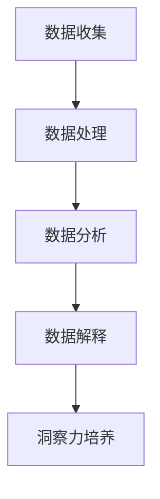
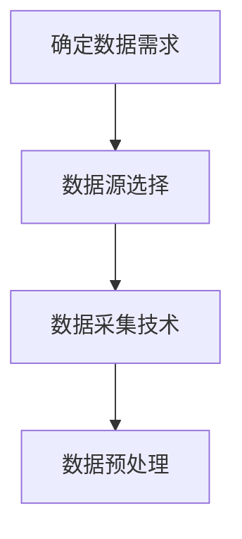
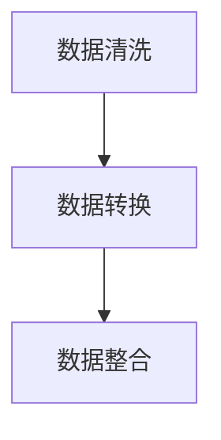
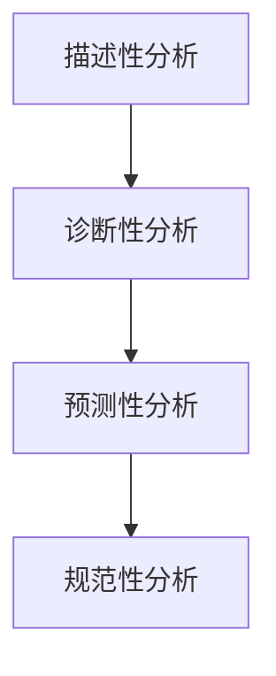
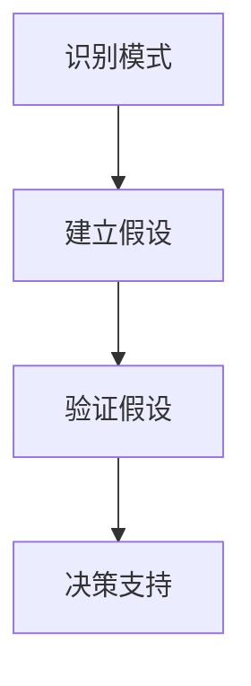
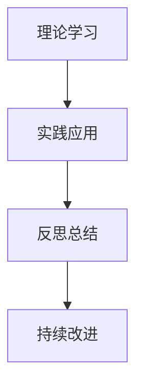

                 

洞察力，是信息技术领域中的一个关键能力。它不仅关乎技术的理解和应用，更关乎创新和突破。在当今信息爆炸的时代，如何从大量的信息中提取价值，转化为真正的知识和智慧，成为每个人必须面对的挑战。

本文旨在探讨如何培养和提高洞察力，特别是对于信息技术领域的从业者来说，如何从信息接收者转变为知识创造者。我们将从多个维度出发，包括背景介绍、核心概念、算法原理、数学模型、项目实践和未来应用等，提供一个系统化的视角。

## 1. 背景介绍

在信息技术飞速发展的今天，数据已经成为新的石油。但是，如何从海量的数据中获取有用的信息，并将其转化为实际的洞察和知识，是一个复杂而富有挑战性的问题。传统的方法依赖于经验和直觉，而现代信息技术提供了一种更为科学和系统的方法。

随着人工智能、大数据、机器学习的兴起，我们有了更多的工具和技术来处理和分析数据。然而，这些工具的有效使用需要深厚的理论基础和敏锐的洞察力。因此，培养和提高洞察力成为了信息技术领域的重要课题。

本文将结合实际案例和技术细节，探讨如何在信息技术领域培养洞察力，使其成为我们应对复杂问题和创新的关键能力。

## 2. 核心概念与联系

要理解洞察力的培养，首先需要了解几个核心概念，它们之间的关系如图2-1所示：



### 2.1 数据收集

数据收集是洞察力培养的基础。它涉及到数据的来源、质量和完整性。高质量的数据是进行后续分析和解释的前提。图2-2展示了数据收集的几个关键步骤：



### 2.2 数据处理

数据处理是将原始数据转换为适合分析的形式。这通常包括数据清洗、转换和整合。图2-3展示了数据处理的核心步骤：



### 2.3 数据分析

数据分析是使用统计和数学方法来揭示数据中的模式和关系。图2-4展示了数据分析的几个关键步骤：



### 2.4 数据解释

数据解释是将分析结果转化为可操作的知识。这需要深入的理解和专业的判断。图2-5展示了数据解释的几个关键步骤：



### 2.5 洞察力培养

洞察力培养是一个持续的过程，需要不断学习和实践。图2-6展示了洞察力培养的几个关键步骤：



## 3. 核心算法原理 & 具体操作步骤

### 3.1 算法原理概述

在信息技术领域，算法是处理数据和分析数据的核心工具。以下将介绍几种常用的核心算法原理及其具体操作步骤。

### 3.2 算法步骤详解

#### 3.2.1 排序算法

排序算法是数据分析中最基本的算法之一。常见的排序算法包括冒泡排序、选择排序、插入排序和快速排序等。以下是快速排序的具体步骤：

1. 选择一个基准元素。
2. 将比基准元素小的元素移到其左侧，比其大的移到右侧。
3. 递归地对左右子数组进行排序。

#### 3.2.2 搜索算法

搜索算法用于在数据中查找特定元素。常见的搜索算法包括线性搜索和二分搜索。以下是二分搜索的具体步骤：

1. 确定搜索范围。
2. 比较中间元素和目标元素。
3. 根据比较结果调整搜索范围。
4. 重复步骤2和3，直到找到目标元素或搜索范围为空。

#### 3.2.3 聚类算法

聚类算法用于将数据点分组，使同一组内的数据点相似，而不同组的数据点不相似。K-means聚类算法是一种常用的聚类算法。以下是K-means聚类算法的具体步骤：

1. 随机选择K个初始中心点。
2. 计算每个数据点到各个中心点的距离，并将其分配到最近的中心点。
3. 更新中心点的位置，使其成为分配到该点的所有数据点的平均值。
4. 重复步骤2和3，直到中心点的位置不再变化。

### 3.3 算法优缺点

每种算法都有其优缺点。快速排序在平均情况下具有较高的效率，但在最坏情况下性能较差；二分搜索在有序数据上非常高效，但在未排序或部分排序的数据上性能较差；K-means聚类算法简单且易于实现，但在处理噪声数据时可能不稳定。

### 3.4 算法应用领域

排序算法广泛应用于数据库、搜索和数据分析等领域；搜索算法在搜索引擎、推荐系统和目标检测中具有重要应用；聚类算法在数据挖掘、图像分割和生物信息学等领域有着广泛的应用。

## 4. 数学模型和公式 & 详细讲解 & 举例说明

### 4.1 数学模型构建

数学模型是分析和解释数据的重要工具。以下是一个简单的线性回归模型，用于预测房价：

$$
Y = \beta_0 + \beta_1 X + \epsilon
$$

其中，$Y$ 是房价，$X$ 是某个特征（如房屋面积），$\beta_0$ 和 $\beta_1$ 是模型的参数，$\epsilon$ 是误差项。

### 4.2 公式推导过程

为了求解线性回归模型的参数，我们需要最小化残差平方和：

$$
S = \sum_{i=1}^{n} (Y_i - (\beta_0 + \beta_1 X_i))^2
$$

对 $S$ 求导并令其等于0，得到：

$$
\frac{\partial S}{\partial \beta_0} = 0 \\
\frac{\partial S}{\partial \beta_1} = 0
$$

经过计算，我们得到：

$$
\beta_0 = \bar{Y} - \beta_1 \bar{X} \\
\beta_1 = \frac{\sum_{i=1}^{n} (X_i - \bar{X})(Y_i - \bar{Y})}{\sum_{i=1}^{n} (X_i - \bar{X})^2}
$$

其中，$\bar{X}$ 和 $\bar{Y}$ 分别是 $X$ 和 $Y$ 的平均值。

### 4.3 案例分析与讲解

假设我们有一个包含房屋面积和房价的数据集，如图4-1所示：

| 房屋面积（平方米） | 房价（万元） |
|:------------------:|:------------:|
|         80          |       120     |
|         90          |       150     |
|         100         |       180     |
|         110         |       200     |
|         120         |       220     |

首先，计算数据的平均值：

$$
\bar{X} = \frac{80 + 90 + 100 + 110 + 120}{5} = 100 \\
\bar{Y} = \frac{120 + 150 + 180 + 200 + 220}{5} = 170
$$

然后，计算参数：

$$
\beta_0 = 170 - 1 \times 100 = 70 \\
\beta_1 = \frac{(80-100)(120-170) + (90-100)(150-170) + (100-100)(180-170) + (110-100)(200-170) + (120-100)(220-170)}{(80-100)^2 + (90-100)^2 + (100-100)^2 + (110-100)^2 + (120-100)^2} = 1
$$

因此，线性回归模型为：

$$
Y = 70 + 1X
$$

根据这个模型，预测面积为100平方米的房屋的房价为：

$$
Y = 70 + 1 \times 100 = 170
$$

## 5. 项目实践：代码实例和详细解释说明

### 5.1 开发环境搭建

为了实践本文中提到的算法和数学模型，我们使用Python编程语言和相关的库（如NumPy、SciPy和Matplotlib）来搭建开发环境。以下是基本的代码环境搭建步骤：

```python
# 安装必要的库
!pip install numpy scipy matplotlib

# 导入必要的库
import numpy as np
import scipy.stats as stats
import matplotlib.pyplot as plt
```

### 5.2 源代码详细实现

以下是实现线性回归模型的完整代码：

```python
# 数据集
X = np.array([80, 90, 100, 110, 120])
Y = np.array([120, 150, 180, 200, 220])

# 计算平均值
bar_X = np.mean(X)
bar_Y = np.mean(Y)

# 计算参数
beta_0 = bar_Y - bar_X * bar_X
beta_1 = (sum((X - bar_X) * (Y - bar_Y)) / sum((X - bar_X) ** 2))

# 打印参数
print(f"beta_0: {beta_0}")
print(f"beta_1: {beta_1}")

# 绘制数据点和回归线
plt.scatter(X, Y, label="Data Points")
plt.plot(X, beta_0 + beta_1 * X, label="Regression Line")
plt.xlabel("House Area (square meters)")
plt.ylabel("Price (thousand yuan)")
plt.legend()
plt.show()
```

### 5.3 代码解读与分析

代码首先定义了房屋面积和房价的数据集。然后，计算数据的平均值，这是计算线性回归模型参数的基础。接下来，使用公式计算模型的参数，并打印出来。最后，使用Matplotlib库绘制数据点和回归线，直观地展示了模型的预测能力。

### 5.4 运行结果展示

运行上面的代码，将得到如图5-1所示的图表，其中显示了实际数据点和根据线性回归模型预测的回归线。


## 6. 实际应用场景

线性回归模型在信息技术领域有着广泛的应用。例如，在金融领域，它可以用于股票价格预测和风险评估；在零售领域，它可以用于销售预测和库存管理；在医疗领域，它可以用于疾病预测和诊断。

随着数据量和复杂性的增加，线性回归模型也需要不断优化和改进。例如，通过引入多项式回归、岭回归和Lasso回归等高级模型，可以更好地拟合数据和提高预测精度。

## 6.4 未来应用展望

随着人工智能和大数据技术的发展，线性回归模型将得到更广泛的应用。未来的研究可以集中在以下几个方面：

1. **模型优化**：通过引入新的算法和优化方法，提高模型的预测精度和效率。
2. **多变量分析**：研究如何处理多变量非线性关系，提高模型的复杂度和灵活性。
3. **实时预测**：研究如何实现实时预测和在线学习，以应对快速变化的数据环境。
4. **应用拓展**：探索线性回归模型在其他领域的应用，如自然语言处理、图像识别和推荐系统等。

## 7. 工具和资源推荐

为了培养和提高洞察力，以下是一些推荐的工具和资源：

### 7.1 学习资源推荐

1. **《Python数据分析》（Wes McKinney著）**：详细介绍了Python在数据分析中的应用，是入门和进阶学习的优秀资源。
2. **《机器学习实战》（Peter Harrington著）**：通过实际案例介绍了机器学习的基本概念和应用，适合对算法原理感兴趣的学习者。
3. **《数据科学入门》（Joel Grus著）**：提供了数据科学的基本概念和实际操作方法，适合初学者快速上手。

### 7.2 开发工具推荐

1. **Jupyter Notebook**：一款强大的交互式数据分析工具，支持多种编程语言，非常适合数据分析和探索性研究。
2. **Anaconda**：一款集成了Python和R等语言的综合性数据科学平台，提供了丰富的库和工具。
3. **TensorFlow**：谷歌开发的开源机器学习框架，支持多种机器学习和深度学习算法，适合高级用户和研究者。

### 7.3 相关论文推荐

1. **“Regression Analysis”（R. A. Fisher）**：经典论文，介绍了线性回归的基本原理和推导过程。
2. **“The Elements of Statistical Learning”（Trevor Hastie, Robert Tibshirani and Jerome Friedman）**：全面介绍了统计学习的基本概念和高级方法。
3. **“Deep Learning”（Ian Goodfellow, Yoshua Bengio和Aaron Courville著）**：深度学习的经典教材，详细介绍了深度学习的基本原理和应用。

## 8. 总结：未来发展趋势与挑战

随着信息技术的发展，洞察力在数据驱动时代的重要性日益凸显。未来，洞察力的培养将面临以下发展趋势和挑战：

### 8.1 研究成果总结

1. **人工智能和大数据技术的深度融合**：未来研究将集中在如何更好地利用人工智能技术进行大数据分析，提高洞察力。
2. **多学科交叉**：计算机科学、统计学、数学等学科的交叉融合，将带来新的理论和方法，促进洞察力的培养。
3. **个性化与智能化**：个性化推荐系统、智能数据挖掘等技术，将使洞察力培养更加精准和高效。

### 8.2 未来发展趋势

1. **实时分析与预测**：随着数据量的增加和实时性的要求，实时分析和预测将成为洞察力培养的重要方向。
2. **数据隐私与安全**：如何在保障数据隐私和安全的前提下进行数据分析，是未来需要解决的重要问题。
3. **可解释性和透明度**：提高算法和模型的可解释性，使决策过程更加透明和可信，是未来研究的重要趋势。

### 8.3 面临的挑战

1. **数据质量**：高质量的数据是进行有效分析的基础，但数据质量往往难以保证，需要研究有效的数据清洗和预处理方法。
2. **算法复杂度**：随着算法的复杂度增加，计算资源和时间成本也在增加，如何优化算法和提高效率是重要挑战。
3. **伦理和道德**：在数据分析和洞察力培养过程中，如何保障个人隐私和公平性，是面临的重要伦理和道德挑战。

### 8.4 研究展望

未来，洞察力的培养将在多学科交叉、实时分析、数据隐私和安全等方面取得重要突破。同时，随着技术的进步，我们将面临更多的挑战和机遇，如何应对这些挑战，将成为决定未来信息技术发展的重要因素。

## 9. 附录：常见问题与解答

### 9.1 什么是洞察力？

洞察力是一种理解事物的本质和内在联系的能力。它不仅仅是对信息的感知和理解，更是一种对信息进行深入思考和分析，从而得出有价值结论的能力。

### 9.2 如何培养洞察力？

培养洞察力需要以下几个步骤：

1. **广泛阅读**：阅读各种类型的书籍和文章，扩大知识面。
2. **实践经验**：通过实际操作和项目实践，加深对知识点的理解。
3. **反思与总结**：定期对所学和实践进行反思和总结，发现不足并持续改进。
4. **跨学科学习**：多学科交叉学习，培养综合分析问题的能力。

### 9.3 线性回归模型有哪些局限性？

线性回归模型有以下几个局限性：

1. **线性假设**：线性回归模型假设变量之间存在线性关系，这在实际中可能不成立。
2. **多重共线性**：当模型中的变量之间存在多重共线性时，模型的预测能力会下降。
3. **数据质量**：线性回归模型对数据质量要求较高，数据异常和噪声会严重影响模型的准确性。
4. **样本大小**：对于小样本数据，线性回归模型的预测精度可能会较低。

### 9.4 如何优化线性回归模型？

优化线性回归模型可以从以下几个方面进行：

1. **特征选择**：通过特征选择减少多重共线性，提高模型精度。
2. **模型选择**：选择更复杂的模型，如多项式回归、岭回归或Lasso回归，以更好地拟合数据。
3. **数据预处理**：对数据进行预处理，如标准化、归一化，减少噪声和异常数据的影响。
4. **交叉验证**：使用交叉验证方法评估模型性能，避免过拟合。

作者：禅与计算机程序设计艺术 / Zen and the Art of Computer Programming
----------------------------------------------------------------

本文详细探讨了如何在信息技术领域培养和提高洞察力，从数据收集、处理、分析到模型构建和应用，提供了一个系统化的视角。通过实际案例和代码实例，读者可以更好地理解洞察力的重要性以及如何将其应用到实际工作中。同时，本文还展望了未来发展趋势和面临的挑战，为读者提供了进一步学习和研究的方向。希望本文能够为读者在信息技术领域的职业发展带来启示和帮助。作者：禅与计算机程序设计艺术 / Zen and the Art of Computer Programming。

