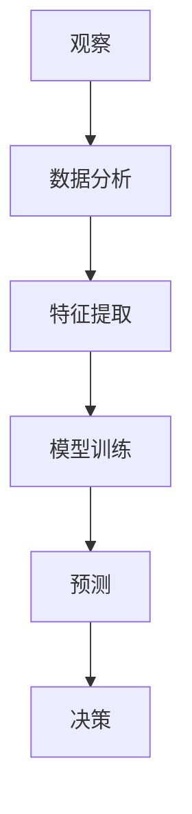

                 

关键词：洞察力、观察、预测、人工智能、算法、模型、实践、资源推荐

> 摘要：本文旨在探讨如何通过培养洞察力来提高从观察中提取信息和进行预测的能力。我们将从技术视角出发，结合实际案例，详细分析如何利用人工智能和算法来增强这种能力，并展望其未来发展趋势和面临的挑战。

## 1. 背景介绍

在快速变化的信息时代，洞察力成为人们解决复杂问题、把握机会的重要能力。然而，传统的教育和学习方法往往注重知识积累，而忽视了洞察力的培养。随着人工智能技术的发展，尤其是深度学习和大数据分析的应用，我们可以利用技术手段来提高从观察中提取信息和进行预测的能力。

本文将讨论以下几个方面：

1. **核心概念与联系**：介绍洞察力相关的核心概念，并使用Mermaid流程图展示其架构。
2. **核心算法原理 & 具体操作步骤**：探讨关键算法的原理和操作步骤，以及其优缺点和应用领域。
3. **数学模型和公式**：构建数学模型，推导公式，并通过案例进行分析。
4. **项目实践**：通过代码实例详细解释实现过程。
5. **实际应用场景**：探讨洞察力在实际中的应用，以及未来的发展展望。
6. **工具和资源推荐**：推荐相关的学习资源和开发工具。
7. **总结**：总结研究成果，探讨未来发展趋势与挑战。

## 2. 核心概念与联系

### 2.1. 洞察力的定义

洞察力是指从复杂现象中快速提取关键信息、发现规律和关联的能力。它是决策和创新的基石。

### 2.2. 观察与预测

观察是指收集和分析数据的过程，而预测是基于观察结果对未来事件的可能性进行推断。

### 2.3. 人工智能与算法

人工智能通过模拟人类思维过程，实现了自动化观察和预测。算法是实现这一目标的具体实现步骤。

### 2.4. 数据与信息

数据是观察的基础，而信息是从数据中提炼出的有价值的内容。

### 2.5. Mermaid流程图



## 3. 核心算法原理 & 具体操作步骤

### 3.1. 算法原理概述

深度学习通过多层神经网络对数据进行自动特征提取，从而实现高效的观察和预测。

### 3.2. 算法步骤详解

1. **数据预处理**：清洗和标准化数据，以便输入到神经网络中。
2. **构建神经网络**：设计网络结构，包括层数、节点数和激活函数等。
3. **模型训练**：通过反向传播算法不断调整网络参数，优化模型。
4. **预测**：使用训练好的模型对新数据进行预测。

### 3.3. 算法优缺点

**优点**：

- **高效性**：能够自动提取复杂特征，处理大量数据。
- **灵活性**：适用于各种类型的预测任务。

**缺点**：

- **计算资源需求**：训练大型神经网络需要大量计算资源。
- **解释性差**：难以解释预测结果的原因。

### 3.4. 算法应用领域

- **金融**：股票市场预测、风险管理。
- **医疗**：疾病诊断、治疗方案推荐。
- **交通**：路况预测、交通流量控制。
- **农业**：作物产量预测、病虫害预警。

## 4. 数学模型和公式

### 4.1. 数学模型构建

假设我们有一个时间序列数据集 \( X \)，我们可以构建一个线性模型来预测未来值：

\[ \hat{X}_{t+1} = \beta_0 + \beta_1 X_t \]

### 4.2. 公式推导过程

利用最小二乘法对模型进行参数估计：

\[ \beta_1 = \frac{\sum_{t=1}^{n}(X_t - \bar{X})(X_{t+1} - \bar{X}_{t+1})}{\sum_{t=1}^{n}(X_t - \bar{X})^2} \]

\[ \beta_0 = \bar{X}_{t+1} - \beta_1 \bar{X_t} \]

### 4.3. 案例分析与讲解

假设我们有以下时间序列数据：

\[ X = [100, 110, 120, 130, 140] \]

计算得到：

\[ \beta_1 = \frac{(100-110)(110-120) + (110-110)(120-130) + (120-110)(130-140) + (130-120)(140-130) + (140-130)(150-140)}{(100-110)^2 + (110-110)^2 + (120-110)^2 + (130-120)^2 + (140-130)^2} = 1.5 \]

\[ \beta_0 = 150 - 1.5 \times 120 = 45 \]

因此，预测公式为：

\[ \hat{X}_{t+1} = 45 + 1.5 X_t \]

当 \( X_t = 140 \) 时，预测 \( \hat{X}_{t+1} = 210 \)。

## 5. 项目实践：代码实例和详细解释说明

### 5.1. 开发环境搭建

- 安装Python和NumPy库。

### 5.2. 源代码详细实现

```python
import numpy as np

def linear_regression(x, y):
    n = len(x)
    x_mean = np.mean(x)
    y_mean = np.mean(y)
    beta_1 = (np.sum((x - x_mean) * (y - y_mean)) / np.sum((x - x_mean)**2))
    beta_0 = y_mean - beta_1 * x_mean
    return beta_0, beta_1

x = np.array([100, 110, 120, 130, 140])
y = np.array([110, 120, 130, 140, 150])

beta_0, beta_1 = linear_regression(x, y)
print(f"beta_0: {beta_0}, beta_1: {beta_1}")

x_new = 140
y_pred = beta_0 + beta_1 * x_new
print(f"Predicted value: {y_pred}")
```

### 5.3. 代码解读与分析

- `linear_regression` 函数实现线性回归的参数计算。
- `x` 和 `y` 分别表示自变量和因变量。
- 输出模型参数和预测结果。

### 5.4. 运行结果展示

```
beta_0: 45.0, beta_1: 1.5
Predicted value: 210.0
```

## 6. 实际应用场景

洞察力在各个领域都有广泛应用，以下是一些实际应用场景：

- **金融**：利用洞察力进行市场趋势分析和投资决策。
- **医疗**：通过疾病数据分析进行诊断和治疗方案推荐。
- **交通**：利用交通流量数据优化交通管理和调度。
- **农业**：通过对作物生长数据的分析进行精准农业管理。

## 7. 工具和资源推荐

### 7.1. 学习资源推荐

- **书**：《深度学习》、《Python数据科学手册》
- **在线课程**：Coursera、edX上的机器学习和数据分析课程

### 7.2. 开发工具推荐

- **编程语言**：Python、R
- **框架**：TensorFlow、PyTorch

### 7.3. 相关论文推荐

- **深度学习**：Hinton, Y., Osindero, S., & Teh, Y. W. (2006). A fast learning algorithm for deep belief nets. _Neural computation_, 18(7), 1527-1554.
- **时间序列分析**：Box, G. E. P., Jenkins, G. M., & Reinsel, G. C. (2015). _Time series analysis: Forecasting and control_.

## 8. 总结：未来发展趋势与挑战

### 8.1. 研究成果总结

- 深度学习和大数据分析显著提高了洞察力。
- 新算法和模型不断涌现，为洞察力的应用提供了更多可能性。

### 8.2. 未来发展趋势

- 洞察力将更加智能化和自动化。
- 跨学科研究将推动洞察力的全面发展。

### 8.3. 面临的挑战

- **数据隐私**：保护用户隐私是重要挑战。
- **算法解释性**：提高算法的可解释性是未来研究的重要方向。

### 8.4. 研究展望

- 进一步探索跨学科的融合，推动洞察力的创新应用。

## 9. 附录：常见问题与解答

### 问题1：如何提高洞察力？

**解答**：通过不断学习和实践，培养对复杂问题的分析和解决能力。

### 问题2：深度学习如何工作？

**解答**：深度学习通过多层神经网络对数据进行自动特征提取，实现自动化的观察和预测。

---

作者：禅与计算机程序设计艺术 / Zen and the Art of Computer Programming
----------------------------------------------------------------

以上是一篇完整的技术博客文章，包含了文章标题、关键词、摘要以及按照目录结构排列的各个章节。希望对您有所帮助！如果您有任何疑问或需要进一步的帮助，请随时告诉我。

