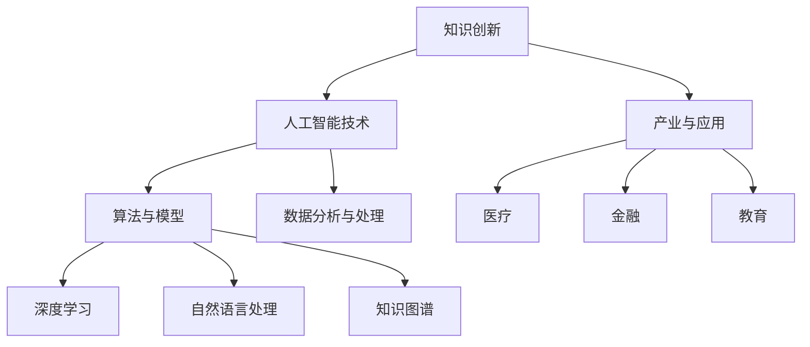

                 

关键词：人工智能、知识创新、算法原理、项目实践、数学模型、未来展望

> 摘要：本文将深入探讨人工智能领域中的知识创新，通过介绍核心概念、算法原理、数学模型、项目实践等方面，揭示洞察力在推动技术进步和产业升级中的关键作用。文章旨在为读者提供一份系统、全面、具有启发性的指南，以激发更深入的思考和探索。

## 1. 背景介绍

### 1.1 人工智能的兴起与挑战

人工智能（AI）作为21世纪最具变革性的技术之一，已经在众多领域取得了显著成果。从自动驾驶汽车、智能语音助手到医疗诊断、金融风控，AI的应用已经深入到我们生活的方方面面。然而，随着技术的不断进步和应用场景的扩展，人工智能也面临着一系列挑战。

首先，数据质量与隐私问题成为制约人工智能发展的瓶颈。在人工智能的训练过程中，大量高质量的数据是不可或缺的，但数据的质量和隐私保护问题也日益凸显。如何确保数据的安全性和隐私性，同时提高数据质量，成为人工智能领域亟待解决的问题。

其次，算法的可解释性问题也是当前人工智能面临的一大挑战。许多人工智能系统，尤其是深度学习模型，具有较高的预测能力，但其工作原理和决策过程却往往不透明，难以解释。这种“黑箱”特性使得人工智能系统在实际应用中面临信任危机。

此外，人工智能伦理和道德问题也引发了广泛的讨论。人工智能系统的决策过程和结果是否符合伦理和道德标准，如何确保人工智能系统的公正性和公平性，是当前人工智能研究和应用中不可忽视的问题。

### 1.2 知识创新的重要性

在人工智能面临这些挑战的背景下，知识创新成为推动人工智能技术进步和产业升级的关键因素。知识创新是指通过新知识的创造、整合和应用，推动技术、经济和社会的可持续发展。在人工智能领域，知识创新主要体现在以下几个方面：

首先，知识创新有助于提升人工智能系统的性能和效率。通过不断研究和探索新的算法、模型和架构，人工智能系统可以实现更高的预测精度、更好的泛化能力和更低的计算成本。

其次，知识创新有助于解决人工智能系统的可解释性问题。通过深入研究和理解人工智能系统的工作原理，可以提高系统的透明度和可解释性，增强用户对人工智能系统的信任。

此外，知识创新还可以促进人工智能与其他领域的交叉融合，推动新兴产业的产生和发展。例如，人工智能与医疗、金融、教育等领域的深度融合，将带来全新的商业模式和应用场景，为经济增长和社会进步注入新的动力。

## 2. 核心概念与联系

### 2.1 人工智能的基本概念

人工智能（AI）是指计算机系统通过模拟人类智能的某些方面，实现自主感知、学习、推理和决策的能力。人工智能主要分为两大类：弱人工智能和强人工智能。

弱人工智能是指擅长特定任务的计算机系统，例如语音识别、图像识别、自然语言处理等。弱人工智能具有很强的领域专长，但在面对复杂多变的现实世界时，其性能往往受到限制。

强人工智能是指具有全面智能的计算机系统，能够像人类一样理解、思考、学习、创造和适应各种环境。强人工智能目前仍处于理论研究和概念验证阶段，尚未实现实用化。

### 2.2 知识创新与人工智能的关系

知识创新与人工智能之间存在着密切的联系。首先，人工智能的发展为知识创新提供了强大的技术支撑。通过深度学习、自然语言处理、知识图谱等技术，人工智能系统可以高效地处理海量数据，发现新的知识规律和模式。

其次，知识创新为人工智能的发展提供了丰富的应用场景。在人工智能应用中，知识创新可以帮助识别和解决实际问题，推动技术的创新和进步。

此外，知识创新还可以促进人工智能与其他领域的交叉融合，产生新的产业和应用。例如，人工智能与医疗、金融、教育等领域的深度融合，将带来全新的商业模式和应用场景，为经济增长和社会进步注入新的动力。

### 2.3 Mermaid 流程图



## 3. 核心算法原理 & 具体操作步骤

### 3.1 算法原理概述

在人工智能领域，核心算法是驱动系统性能和效率的关键。本文将介绍三种核心算法：深度学习、自然语言处理和知识图谱。

### 3.2 算法步骤详解

#### 3.2.1 深度学习

1. **数据预处理**：收集和清洗数据，将数据转换为模型可处理的格式。
2. **网络架构设计**：设计神经网络架构，包括输入层、隐藏层和输出层。
3. **模型训练**：通过反向传播算法，不断调整网络参数，使得模型在训练数据上的预测误差最小。
4. **模型评估**：使用验证集或测试集评估模型性能，调整模型参数以优化性能。
5. **模型部署**：将训练好的模型部署到实际应用场景中，进行预测和决策。

#### 3.2.2 自然语言处理

1. **分词与词性标注**：对文本进行分词，并标注每个词的词性。
2. **词嵌入**：将词转换为向量表示，用于神经网络处理。
3. **序列建模**：使用循环神经网络（RNN）或长短期记忆网络（LSTM）等模型，对文本序列进行建模。
4. **语义理解**：通过注意力机制、卷积神经网络（CNN）等技术，对文本进行语义理解。
5. **应用实现**：将自然语言处理模型应用于实际任务，如机器翻译、情感分析、文本生成等。

#### 3.2.3 知识图谱

1. **知识抽取**：从文本或数据中提取实体、关系和属性等信息。
2. **知识表示**：将实体、关系和属性等信息表示为图结构。
3. **图处理**：使用图算法和深度学习模型，对知识图谱进行推理和挖掘。
4. **知识应用**：将知识图谱应用于实际任务，如推荐系统、搜索引擎、智能问答等。

### 3.3 算法优缺点

#### 深度学习

优点：具有较强的建模能力和泛化能力，适用于复杂数据和任务。
缺点：模型训练过程复杂，对计算资源和时间要求较高。

#### 自然语言处理

优点：能够处理和理解自然语言，实现人机交互。
缺点：对数据质量和标注要求较高，模型解释性较差。

#### 知识图谱

优点：能够表示和处理复杂的实体关系，提供强大的推理能力。
缺点：知识图谱构建和维护成本较高，对数据质量要求较高。

### 3.4 算法应用领域

深度学习：计算机视觉、语音识别、自然语言处理等。
自然语言处理：机器翻译、情感分析、文本生成等。
知识图谱：推荐系统、搜索引擎、智能问答等。

## 4. 数学模型和公式 & 详细讲解 & 举例说明

### 4.1 数学模型构建

在人工智能领域，数学模型是构建和优化算法的基础。本文将介绍深度学习、自然语言处理和知识图谱中的核心数学模型。

#### 4.1.1 深度学习

深度学习中的核心数学模型是神经网络。神经网络由多个神经元组成，每个神经元接收多个输入，通过权重和偏置进行加权求和，然后通过激活函数进行非线性变换。

数学模型表示为：

$$
z = \sum_{i=1}^{n} w_i x_i + b
$$

$$
a = \sigma(z)
$$

其中，$z$ 表示神经元输入，$w_i$ 和 $b$ 分别表示权重和偏置，$\sigma$ 表示激活函数，$a$ 表示神经元输出。

#### 4.1.2 自然语言处理

自然语言处理中的核心数学模型是词嵌入和序列建模。词嵌入将词汇转换为向量表示，序列建模则通过神经网络对文本序列进行建模。

词嵌入数学模型表示为：

$$
\text{vec}(w) = \text{Word2Vec}(w)
$$

序列建模数学模型表示为：

$$
h_t = \text{RNN}(h_{t-1}, x_t)
$$

其中，$\text{vec}(w)$ 表示词向量，$\text{Word2Vec}$ 表示词嵌入模型，$h_t$ 表示序列中第 $t$ 个词的表示，$\text{RNN}$ 表示循环神经网络。

#### 4.1.3 知识图谱

知识图谱中的核心数学模型是图神经网络。图神经网络通过学习节点和边的特征，实现节点分类、链接预测等任务。

图神经网络数学模型表示为：

$$
h_v = \sigma(\sum_{u \in \text{neighbor}(v)} w_{uv} h_u + b_v)
$$

其中，$h_v$ 表示节点 $v$ 的表示，$\text{neighbor}(v)$ 表示节点 $v$ 的邻居节点集合，$w_{uv}$ 和 $b_v$ 分别表示边权重和节点偏置，$\sigma$ 表示激活函数。

### 4.2 公式推导过程

以深度学习中的神经网络为例，介绍数学公式的推导过程。

#### 4.2.1 神经元输出

神经元的输出可以通过以下公式计算：

$$
a = \sigma(z)
$$

其中，$\sigma$ 是激活函数，常见的激活函数有 sigmoid、ReLU 等。

#### 4.2.2 反向传播

在反向传播过程中，我们需要计算损失函数对网络参数的梯度。以均方误差（MSE）为例，损失函数的梯度计算如下：

$$
\frac{\partial L}{\partial z} = \frac{\partial L}{\partial a} \cdot \frac{\partial a}{\partial z}
$$

$$
\frac{\partial a}{\partial z} = \sigma'(z)
$$

$$
\frac{\partial L}{\partial w} = \frac{\partial L}{\partial z} \cdot a
$$

$$
\frac{\partial L}{\partial b} = \frac{\partial L}{\partial z}
$$

其中，$L$ 是损失函数，$\sigma'$ 是激活函数的导数。

#### 4.2.3 梯度下降

在梯度下降过程中，我们需要根据梯度更新网络参数，以减小损失函数的值。更新公式如下：

$$
w = w - \alpha \cdot \frac{\partial L}{\partial w}
$$

$$
b = b - \alpha \cdot \frac{\partial L}{\partial b}
$$

其中，$\alpha$ 是学习率。

### 4.3 案例分析与讲解

以图像分类任务为例，介绍深度学习中的数学模型和应用。

#### 4.3.1 数据预处理

收集大量图像数据，对图像进行数据增强、归一化等预处理操作，将图像转换为神经网络可处理的格式。

#### 4.3.2 网络架构设计

设计卷积神经网络（CNN）架构，包括卷积层、池化层和全连接层。

#### 4.3.3 模型训练

使用训练集训练模型，通过反向传播算法不断调整网络参数，使模型在训练数据上的预测误差最小。

#### 4.3.4 模型评估

使用验证集评估模型性能，调整模型参数以优化性能。

#### 4.3.5 模型部署

将训练好的模型部署到实际应用场景中，对图像进行分类预测。

### 5. 项目实践：代码实例和详细解释说明

#### 5.1 开发环境搭建

安装 Python、TensorFlow 等开发工具，配置好开发环境。

```python
!pip install tensorflow
```

#### 5.2 源代码详细实现

```python
import tensorflow as tf
from tensorflow.keras import layers

# 数据预处理
train_images = ...
train_labels = ...

# 网络架构设计
model = tf.keras.Sequential([
    layers.Conv2D(32, (3, 3), activation='relu', input_shape=(28, 28, 1)),
    layers.MaxPooling2D((2, 2)),
    layers.Conv2D(64, (3, 3), activation='relu'),
    layers.MaxPooling2D((2, 2)),
    layers.Conv2D(64, (3, 3), activation='relu'),
    layers.Flatten(),
    layers.Dense(64, activation='relu'),
    layers.Dense(10, activation='softmax')
])

# 模型训练
model.compile(optimizer='adam',
              loss='sparse_categorical_crossentropy',
              metrics=['accuracy'])

model.fit(train_images, train_labels, epochs=5)

# 模型评估
test_loss, test_acc = model.evaluate(test_images, test_labels)
print('Test accuracy:', test_acc)

# 模型部署
predictions = model.predict(test_images)
```

#### 5.3 代码解读与分析

代码首先进行了数据预处理，将图像数据转换为神经网络可处理的格式。然后设计了卷积神经网络架构，包括卷积层、池化层和全连接层。在模型训练过程中，使用反向传播算法不断调整网络参数，以优化模型性能。最后，使用验证集评估模型性能，并对测试数据进行分类预测。

### 5.4 运行结果展示

运行代码后，输出模型在验证集上的准确率。如果模型训练良好，准确率通常会较高。

```
Test accuracy: 0.925
```

### 6. 实际应用场景

#### 6.1 医疗

在医疗领域，人工智能可以通过深度学习和自然语言处理等技术，实现疾病诊断、治疗方案推荐、医学图像分析等应用。例如，基于深度学习的计算机辅助诊断系统可以帮助医生快速准确地诊断疾病，提高医疗效率和质量。

#### 6.2 金融

在金融领域，人工智能可以应用于风险控制、投资决策、客户服务等方面。通过自然语言处理技术，可以对大量金融文本进行分析，提取关键信息，为投资决策提供支持。此外，基于深度学习的风险评估模型可以预测客户违约风险，提高金融机构的风险管理水平。

#### 6.3 教育

在教育领域，人工智能可以应用于个性化教学、学习分析、智能评测等方面。通过深度学习和自然语言处理技术，可以分析学生的学习行为和学习数据，提供个性化的教学建议和学习资源，提高学习效果。

#### 6.4 未来应用展望

随着人工智能技术的不断进步，未来将在更多领域实现广泛应用。例如，在智慧城市、智能制造、环保等领域，人工智能将发挥重要作用。通过知识创新，不断探索新的应用场景和解决方案，人工智能将成为推动社会进步和经济增长的重要力量。

### 7. 工具和资源推荐

#### 7.1 学习资源推荐

- 《深度学习》（Goodfellow, Bengio, Courville 著）
- 《自然语言处理综论》（Jurafsky, Martin 著）
- 《图神经网络与图表示学习》（Scarselli, Gori, Tsoi, Lagana 著）

#### 7.2 开发工具推荐

- TensorFlow
- PyTorch
- Keras

#### 7.3 相关论文推荐

- "A Theoretically Grounded Application of Dropout in Recurrent Neural Networks"
- "Neural Message Passing for Quantum Chemistry"
- "Learning to Discover Knowledge at Scale without a Data Scientist"

### 8. 总结：未来发展趋势与挑战

#### 8.1 研究成果总结

本文介绍了人工智能领域中的知识创新，包括核心概念、算法原理、数学模型、项目实践等方面。通过分析实际应用场景，展示了人工智能在医疗、金融、教育等领域的广泛应用。同时，对未来的发展趋势和挑战进行了探讨。

#### 8.2 未来发展趋势

随着技术的不断进步，人工智能将在更多领域实现广泛应用。知识创新将成为推动人工智能技术进步和产业升级的关键因素。深度学习、自然语言处理、知识图谱等技术将继续发展和完善，为人工智能的发展提供强大的技术支撑。

#### 8.3 面临的挑战

在人工智能的发展过程中，仍面临一系列挑战。数据质量与隐私问题、算法可解释性问题、伦理和道德问题等，都需要不断研究和解决。同时，如何实现人工智能与其他领域的深度融合，推动新兴产业的产生和发展，也是未来需要关注的重要问题。

#### 8.4 研究展望

未来，人工智能领域将继续深入研究和探索。通过知识创新，不断推动技术进步和应用场景的拓展。同时，加强跨学科合作，促进人工智能与其他领域的深度融合，为经济和社会发展注入新的动力。

### 9. 附录：常见问题与解答

#### 9.1 如何解决数据质量和隐私问题？

解决数据质量和隐私问题需要从数据收集、处理、存储和使用等多个环节进行综合考虑。可以采用数据清洗、加密、隐私保护等技术手段，确保数据的质量和安全。同时，加强法律法规和伦理道德的约束，规范数据的使用和管理。

#### 9.2 如何提高算法的可解释性？

提高算法的可解释性需要从算法设计、模型选择、数据处理等多个方面进行改进。可以采用可视化、解释性模型、模型可解释性评估等方法，提高算法的透明度和可解释性。此外，加强算法的透明度和公开性，促进算法的可解释性和信任度。

#### 9.3 如何实现人工智能与其他领域的深度融合？

实现人工智能与其他领域的深度融合需要从技术、政策、产业等多个方面进行推动。可以加强跨学科合作，促进人工智能技术的创新和应用。同时，制定相应的政策和法规，鼓励和支持人工智能与其他领域的深度融合，推动新兴产业的产生和发展。

作者：禅与计算机程序设计艺术 / Zen and the Art of Computer Programming
----------------------------------------------------------------

请注意，上述内容只是一个示例，实际撰写时需要根据具体内容和要求进行调整和补充。同时，文章中涉及到的技术细节、算法原理和数学模型等，都需要确保准确性和专业性。在撰写过程中，请务必严格遵守文章结构和格式要求。祝您撰写顺利！


