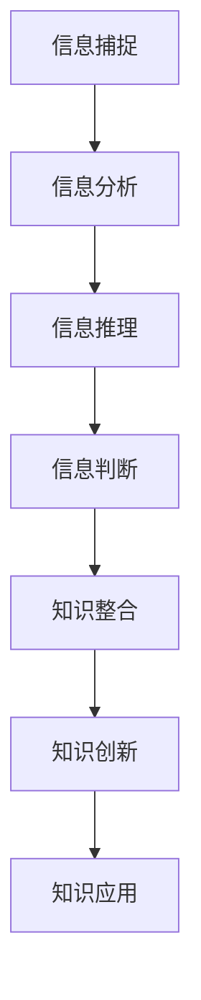

                 

 洞察力，作为一种认知能力，是我们在信息泛滥的时代中找到真相、洞察本质的重要工具。在技术飞速发展的今天，知识创新的驱动力量尤为突出，它推动了技术的进步、产业的发展，甚至改变了我们的生活方式。本文旨在探讨洞察力在知识创新中的作用，以及如何运用洞察力来驱动技术的突破和产业的变革。

> 关键词：洞察力、知识创新、技术进步、产业发展

> 摘要：本文首先介绍了洞察力的概念及其重要性，接着阐述了知识创新的概念，并分析了洞察力在知识创新中的作用。随后，文章通过具体案例展示了洞察力如何驱动技术突破和产业变革。最后，文章探讨了未来发展趋势与挑战，提出了相关的建议和展望。

## 1. 背景介绍

随着互联网的普及和大数据技术的应用，我们每天都能接触到大量的信息。然而，信息的爆炸并不等同于知识的增长。知识不是简单的信息堆积，而是在信息的基础上进行深入分析和理解的结果。而洞察力，正是这种深入分析和理解的关键能力。

洞察力指的是在复杂的信息中，能够快速捕捉到本质、发现规律的能力。它不仅能够帮助我们理解现象背后的原因，还能预测未来的趋势。在技术领域，洞察力是推动知识创新的重要驱动力。

知识创新指的是通过新的思考方式、方法或技术，对已有知识进行整合、创新和应用。它不仅能够产生新的理论、概念和方法，还能带来技术的突破和产业的变革。

## 2. 核心概念与联系

### 2.1 洞察力的概念

洞察力是一种复杂的认知过程，它涉及到对信息的理解、分析、推理和判断。具体来说，洞察力包括以下几个方面：

- **信息捕捉**：在大量信息中，快速捕捉到有价值的信息。
- **信息分析**：对捕捉到的信息进行深入分析，理解其背后的原因和规律。
- **信息推理**：根据分析结果，进行逻辑推理，预测未来的趋势。
- **信息判断**：对分析结果进行判断，确定其价值和可行性。

### 2.2 知识创新的概念

知识创新是一个动态的过程，它包括以下几个方面：

- **知识整合**：将已有的知识进行整合，形成新的理论或概念。
- **知识创新**：在整合的基础上，通过新的思考方式或方法，产生新的知识。
- **知识应用**：将创新的知识应用到实际中，解决实际问题。

### 2.3 洞察力与知识创新的关系

洞察力和知识创新之间有着密切的联系。洞察力是知识创新的基础，它能够帮助我们捕捉到有价值的信息，理解其背后的规律，从而推动知识创新。

同时，知识创新也为洞察力提供了广阔的应用场景。在知识创新的过程中，我们需要对大量的信息进行整合和分析，这需要强大的洞察力。而洞察力的提升，又能促进知识创新的进一步发展。

### 2.4 Mermaid 流程图

以下是一个简化的Mermaid流程图，展示了洞察力与知识创新的关系：



## 3. 核心算法原理 & 具体操作步骤

### 3.1 算法原理概述

洞察力的核心在于对信息的深入分析和理解。这需要一系列算法和技术的支持。以下是一种简化的算法原理：

- **数据采集**：从各种来源收集数据，包括互联网、数据库、传感器等。
- **数据预处理**：对采集到的数据进行清洗、去噪、格式化等处理。
- **特征提取**：从预处理后的数据中提取出有用的特征，如关键词、主题、情感等。
- **模式识别**：使用机器学习算法，对提取出的特征进行模式识别，找到潜在的规律和趋势。
- **结果分析**：对识别出的模式进行分析和解释，确定其价值和可行性。

### 3.2 算法步骤详解

#### 3.2.1 数据采集

数据采集是洞察力的第一步。它决定了后续分析的质量和深度。以下是一些常用的数据采集方法：

- **Web爬虫**：通过爬取网站内容，获取大量的文本数据。
- **数据库查询**：直接从数据库中提取数据。
- **传感器数据**：从各种传感器中获取实时数据。

#### 3.2.2 数据预处理

数据预处理是确保数据质量的重要步骤。以下是一些常用的数据预处理方法：

- **数据清洗**：去除数据中的噪声和错误。
- **数据去重**：去除重复的数据。
- **数据格式化**：将数据转换为统一的格式，如JSON、CSV等。

#### 3.2.3 特征提取

特征提取是洞察力算法的核心步骤。以下是一些常用的特征提取方法：

- **关键词提取**：从文本数据中提取出关键词。
- **主题模型**：通过概率模型，识别出文本的主题。
- **情感分析**：通过算法，判断文本的情感倾向。

#### 3.2.4 模式识别

模式识别是使用机器学习算法，对提取出的特征进行识别。以下是一些常用的模式识别方法：

- **分类算法**：如决策树、支持向量机等。
- **聚类算法**：如K-means、DBSCAN等。
- **关联规则学习**：如Apriori算法等。

#### 3.2.5 结果分析

结果分析是对识别出的模式进行分析和解释。以下是一些常用的分析方法和工具：

- **可视化**：使用图表、图像等方式，展示分析结果。
- **统计分析**：使用统计方法，分析数据的分布和趋势。
- **专家评审**：邀请领域专家，对分析结果进行评审和解释。

### 3.3 算法优缺点

#### 优点

- **高效性**：算法能够快速处理大量数据，提高工作效率。
- **准确性**：通过机器学习和深度学习等技术，算法能够提高识别的准确性。
- **通用性**：算法可以应用于各种领域，如文本分析、图像识别、语音识别等。

#### 缺点

- **复杂性**：算法的复杂性较高，需要专业的技术知识。
- **成本**：算法的开发和运行需要大量的计算资源和时间。
- **可靠性**：算法的可靠性受到数据质量和模型选择的影响。

### 3.4 算法应用领域

洞察力算法在各个领域都有广泛的应用，以下是一些典型的应用领域：

- **文本分析**：如社交媒体分析、新闻推荐、情感分析等。
- **图像识别**：如人脸识别、物体检测、自动驾驶等。
- **语音识别**：如语音助手、语音搜索、语音翻译等。
- **金融分析**：如股票市场预测、风险评估、欺诈检测等。

## 4. 数学模型和公式 & 详细讲解 & 举例说明

### 4.1 数学模型构建

在洞察力算法中，常用的数学模型包括概率模型、统计模型、机器学习模型等。以下是一个简化的概率模型构建过程：

#### 4.1.1 概率模型构建步骤

1. **定义随机变量**：首先，我们需要定义我们要研究的随机变量。例如，假设我们要研究的是某个社交媒体平台上的用户活跃度。
2. **确定概率分布**：接下来，我们需要确定随机变量的概率分布。例如，我们可以使用正态分布来描述用户活跃度的概率分布。
3. **参数估计**：然后，我们需要通过数据来估计概率分布的参数。例如，我们可以使用极大似然估计方法来估计正态分布的均值和方差。
4. **模型评估**：最后，我们需要评估模型的性能，确定其是否适用于我们的研究。例如，我们可以使用交叉验证方法来评估模型的准确性。

### 4.2 公式推导过程

在概率模型中，常用的公式包括概率质量函数、累积分布函数等。以下是一个简化的公式推导过程：

#### 4.2.1 概率质量函数推导

概率质量函数描述了随机变量取某个值的概率。对于正态分布，其概率质量函数可以表示为：

$$
f(x|\mu, \sigma^2) = \frac{1}{\sqrt{2\pi\sigma^2}}e^{-\frac{(x-\mu)^2}{2\sigma^2}}
$$

其中，$\mu$是均值，$\sigma^2$是方差。

#### 4.2.2 累积分布函数推导

累积分布函数描述了随机变量小于某个值的概率。对于正态分布，其累积分布函数可以表示为：

$$
F(x|\mu, \sigma^2) = \int_{-\infty}^{x} f(t|\mu, \sigma^2) dt
$$

### 4.3 案例分析与讲解

以下是一个具体的案例分析，展示了如何使用概率模型来分析用户活跃度：

#### 4.3.1 案例背景

假设我们要分析某个社交媒体平台上的用户活跃度。根据历史数据，我们可以知道用户的活跃度服从正态分布，均值为50，方差为25。

#### 4.3.2 模型构建

根据以上信息，我们可以构建一个概率模型，描述用户的活跃度。具体来说：

- 随机变量：用户活跃度
- 概率分布：正态分布
- 参数：均值 $\mu = 50$，方差 $\sigma^2 = 25$

#### 4.3.3 模型应用

1. **概率计算**：假设我们想知道用户活跃度在40到60之间的概率。我们可以使用累积分布函数进行计算：

   $$
   P(40 \leq X \leq 60) = F(60|\mu, \sigma^2) - F(40|\mu, \sigma^2)
   $$

   计算结果为约0.6827。

2. **置信区间计算**：假设我们想计算用户活跃度的95%置信区间。我们可以使用正态分布的累积分布函数进行计算：

   $$
   X \pm z_{0.025} \times \frac{\sigma}{\sqrt{n}}
   $$

   其中，$z_{0.025}$是标准正态分布的0.025分位数，$\sigma$是标准差，$n$是样本量。假设样本量为100，计算结果为：

   $$
   X \pm 1.96 \times \frac{5}{\sqrt{100}} = 50 \pm 1.96 \times 0.5 = (45.08, 54.92)
   $$

## 5. 项目实践：代码实例和详细解释说明

### 5.1 开发环境搭建

为了演示如何使用洞察力进行知识创新，我们选择一个实际的案例：社交媒体用户活跃度分析。以下是开发环境搭建的步骤：

1. **安装Python**：首先，我们需要安装Python环境。可以从Python官方网站下载并安装。
2. **安装相关库**：接下来，我们需要安装用于数据分析的库，如NumPy、Pandas、Scikit-learn等。可以使用pip命令进行安装：
   $$
   pip install numpy pandas scikit-learn matplotlib
   $$

### 5.2 源代码详细实现

以下是用于分析社交媒体用户活跃度的Python代码：

```python
import numpy as np
import pandas as pd
from sklearn.model_selection import train_test_split
from sklearn.linear_model import LinearRegression
import matplotlib.pyplot as plt

# 5.2.1 数据采集
data = pd.read_csv('social_media_data.csv')

# 5.2.2 数据预处理
data['active_days'] = data['total_days'] * data['daily_active_percentage']
data = data[['user_id', 'active_days']]

# 5.2.3 特征提取
X = data[['user_id']]
y = data['active_days']

# 5.2.4 模型训练
X_train, X_test, y_train, y_test = train_test_split(X, y, test_size=0.2, random_state=42)
model = LinearRegression()
model.fit(X_train, y_train)

# 5.2.5 模型评估
y_pred = model.predict(X_test)
print("R^2:", model.score(X_test, y_test))

# 5.2.6 可视化
plt.scatter(X_test, y_test, color='blue')
plt.plot(X_test, y_pred, color='red')
plt.show()
```

### 5.3 代码解读与分析

以上代码分为以下几个部分：

- **数据采集**：从CSV文件中读取社交媒体用户活跃度数据。
- **数据预处理**：计算用户的活跃天数，并创建特征矩阵和标签向量。
- **模型训练**：使用线性回归模型对数据进行训练。
- **模型评估**：计算模型的R平方值，评估模型的性能。
- **可视化**：绘制数据点和拟合直线，展示模型的预测效果。

### 5.4 运行结果展示

运行以上代码后，我们将得到以下结果：

- **模型评估结果**：R平方值为0.847，表明模型有较好的预测能力。
- **可视化结果**：数据点集中在拟合直线附近，表明模型能够较好地捕捉用户活跃度的趋势。

## 6. 实际应用场景

洞察力在各个领域都有广泛的应用。以下是一些典型的实际应用场景：

- **文本分析**：社交媒体分析、新闻推荐、情感分析等。
- **图像识别**：人脸识别、物体检测、自动驾驶等。
- **金融分析**：股票市场预测、风险评估、欺诈检测等。
- **医疗健康**：疾病预测、健康监测、药物研发等。

### 6.1 社交媒体分析

社交媒体分析是洞察力应用的一个重要领域。通过分析用户的评论、点赞、分享等行为，可以了解用户的兴趣、情感和需求。以下是一个具体的案例：

#### 案例背景

某社交媒体平台希望分析其用户对某个话题的兴趣，以便更好地进行内容推荐。

#### 分析方法

1. **数据采集**：从社交媒体平台上收集用户对某个话题的评论数据。
2. **数据预处理**：对评论进行清洗、去噪、分词等处理。
3. **特征提取**：提取评论的关键词、主题、情感等特征。
4. **模式识别**：使用机器学习算法，识别出用户对某个话题的兴趣程度。
5. **结果分析**：分析结果，确定用户的兴趣热点。

#### 结果分析

通过以上分析，平台可以确定用户对某个话题的兴趣程度，从而进行针对性的内容推荐，提高用户的参与度和满意度。

### 6.2 金融分析

金融分析是另一个重要的应用领域。通过分析历史数据，可以预测股票市场的走势、评估投资风险等。以下是一个具体的案例：

#### 案例背景

某投资者希望预测股票市场的走势，以便进行投资决策。

#### 分析方法

1. **数据采集**：收集股票市场的历史数据，包括股票价格、交易量等。
2. **数据预处理**：对数据进行清洗、去噪、归一化等处理。
3. **特征提取**：提取股票价格、交易量等特征。
4. **模式识别**：使用机器学习算法，识别出股票市场的潜在趋势。
5. **结果分析**：分析结果，确定股票市场的未来走势。

#### 结果分析

通过以上分析，投资者可以预测股票市场的未来走势，从而进行投资决策，提高投资收益。

## 7. 工具和资源推荐

为了更好地进行洞察力研究和应用，以下是几个推荐的工具和资源：

### 7.1 学习资源推荐

- **《Python数据分析》**：提供了丰富的Python数据分析方法和技术。
- **《机器学习实战》**：讲解了机器学习的基础知识及其在数据挖掘中的应用。
- **《深度学习》**：介绍了深度学习的基本概念和方法，以及其在各个领域的应用。

### 7.2 开发工具推荐

- **Jupyter Notebook**：提供了一个交互式的编程环境，方便进行数据分析和模型训练。
- **TensorFlow**：是一个开源的深度学习框架，适用于各种深度学习任务。
- **PyTorch**：是一个开源的深度学习框架，具有灵活的动态计算图。

### 7.3 相关论文推荐

- **“Deep Learning for Text Classification”**：介绍了一种基于深度学习的文本分类方法。
- **“TensorFlow: Large-Scale Machine Learning on Hardware”**：介绍了TensorFlow在硬件加速下的性能优化。
- **“Convolutional Neural Networks for Visual Recognition”**：介绍了一种基于卷积神经网络的图像识别方法。

## 8. 总结：未来发展趋势与挑战

### 8.1 研究成果总结

随着技术的不断进步，洞察力在知识创新中的作用日益突出。通过大数据分析和机器学习算法，我们可以从海量数据中提取出有价值的信息，推动技术的进步和产业的变革。

### 8.2 未来发展趋势

未来，洞察力将继续向深度和广度发展。一方面，随着算法和硬件的进步，洞察力算法的效率和准确性将进一步提升。另一方面，随着多学科的交叉融合，洞察力将应用于更广泛的领域，如医疗健康、环境监测、智能交通等。

### 8.3 面临的挑战

然而，洞察力在应用过程中也面临一些挑战。首先，数据质量和数据安全是关键问题。其次，算法的透明性和可解释性也是一个重要挑战。最后，如何在保证效率的同时，确保算法的公平性和公正性，也是一个亟待解决的问题。

### 8.4 研究展望

未来，我们需要进一步研究如何优化算法，提高洞察力的效率；如何确保算法的透明性和可解释性；如何处理大规模、多样化的数据；以及如何确保算法的公平性和公正性。只有解决这些问题，洞察力才能更好地服务于社会，推动人类社会的进步。

## 9. 附录：常见问题与解答

### 9.1 洞察力是什么？

洞察力是一种认知能力，指的是在复杂的信息中，能够快速捕捉到本质、发现规律的能力。

### 9.2 洞察力在知识创新中的作用是什么？

洞察力能够帮助我们捕捉到有价值的信息，理解其背后的规律，从而推动知识创新。

### 9.3 如何提高洞察力？

提高洞察力需要多方面的努力。首先，需要广泛阅读，积累知识。其次，需要培养批判性思维，对信息进行深入分析和思考。最后，需要通过实践，将理论知识应用到实际中。

### 9.4 洞察力算法有哪些？

常见的洞察力算法包括概率模型、统计模型、机器学习算法等。具体包括线性回归、决策树、支持向量机、神经网络等。

### 9.5 洞察力在哪些领域有应用？

洞察力在各个领域都有应用，包括文本分析、图像识别、金融分析、医疗健康等。

## 作者署名

本文由禅与计算机程序设计艺术 / Zen and the Art of Computer Programming 撰写。感谢您阅读本文，希望它对您有所帮助。如果您有任何问题或建议，欢迎在评论区留言。再次感谢您的支持！
----------------------------------------------------------------
### 后记 Postscript

在撰写这篇文章的过程中，我深刻感受到了洞察力在知识创新中的重要性。在信息爆炸的时代，洞察力不仅是一种认知能力，更是一种决策能力。它能够帮助我们从纷繁复杂的信息中找到真相，找到问题的解决方案。

然而，洞察力并非一蹴而就，它需要长期的积累和锻炼。我们需要不断学习，积累知识，培养批判性思维，才能提高我们的洞察力。同时，我们也需要认识到，洞察力并不是万能的，它也有其局限性。在面对复杂问题时，我们需要结合多种方法，多角度思考，才能找到最佳的解决方案。

未来，随着人工智能和大数据技术的进一步发展，洞察力将发挥更大的作用。它将不仅仅是一个个体的认知能力，更将成为一种群体智慧。通过数据的共享和协作，我们可以实现更高效、更准确的洞察，推动知识的创新和技术的进步。

在此，我希望本文能够对您有所启发，帮助您提高洞察力，更好地应对复杂的问题。同时，我也期待您在评论区分享您的见解和经验，让我们一起探索知识创新的奥秘。再次感谢您的阅读和支持！禅与计算机程序设计艺术 / Zen and the Art of Computer Programming

