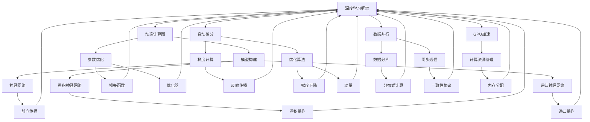

                 

### 背景介绍 Background

深度学习在过去几年中取得了巨大的进步，已经成为人工智能领域的重要工具。为了实现深度学习模型的快速开发和高效训练，出现了许多深度学习框架。其中，PyTorch和JAX是两个备受关注的框架，它们各自具有独特的特点和优势。

PyTorch是一个开源的深度学习框架，由Facebook的人工智能研究团队开发。它以其灵活性和动态计算图的特点受到开发者的青睐。PyTorch支持GPU加速，并能够方便地构建复杂的神经网络模型。此外，PyTorch的自动微分功能使得优化模型的参数变得非常简单。

JAX是Google开发的一个开源深度学习框架，其核心目标是在保持代码简洁的同时，提供高效的计算性能。JAX支持自动微分和向量化的计算，这使得它在处理大规模数据集和复杂模型时具有优势。JAX还支持NumPy和Python的原生代码，使得它在兼容性和易用性方面表现出色。

本文将深入探讨PyTorch和JAX的核心概念、架构设计、算法原理，并对比分析它们在深度学习应用中的表现。通过详细讲解数学模型和具体操作步骤，我们将展示如何使用这两个框架进行深度学习模型的开发。最后，我们将探讨这两个框架在实际应用场景中的使用情况，并展望它们未来的发展趋势。

### 核心概念与联系 Core Concepts and Relations

在深入探讨PyTorch和JAX之前，我们需要了解一些核心概念和它们之间的联系。以下是一个使用Mermaid绘制的流程图，它展示了深度学习框架中的一些关键组成部分。



#### 动态计算图 Dynamic Computing Graph

动态计算图是深度学习框架的核心组成部分。在PyTorch中，动态计算图使得开发者可以实时构建和修改计算图。这使得PyTorch非常适合快速原型开发和实验。例如，以下代码展示了如何使用PyTorch构建一个简单的计算图：

```python
import torch

x = torch.tensor([1.0, 2.0, 3.0])
y = torch.tensor([4.0, 5.0, 6.0])
z = x * y

print(z)
```

在JAX中，动态计算图同样是一个重要的概念。JAX通过其Jit编译器能够将动态计算图编译成高效的可执行代码。这使得JAX在处理大规模数据和复杂模型时具有出色的性能。以下是一个使用JAX构建计算图的例子：

```python
import jax
import jax.numpy as np

x = np.array([1.0, 2.0, 3.0])
y = np.array([4.0, 5.0, 6.0])
z = x * y

print(z)
```

#### 自动微分 Automatic Differentiation

自动微分是深度学习框架中的另一个关键概念。它允许开发者自动计算函数的梯度，这对于优化模型的参数至关重要。在PyTorch中，自动微分通过`autograd`模块提供，使得开发者可以轻松地计算和跟踪梯度。以下是一个使用PyTorch进行自动微分的例子：

```python
import torch

x = torch.tensor([1.0, 2.0, 3.0], requires_grad=True)
y = torch.tensor([4.0, 5.0, 6.0], requires_grad=True)

z = x * y
z.backward()

print(x.grad)
print(y.grad)
```

在JAX中，自动微分通过其核心库`jax.scipy.optimize`提供。JAX的自动微分系统能够处理更复杂的计算场景，并且其Jit编译器能够将自动微分代码编译成高效的机器代码。以下是一个使用JAX进行自动微分的例子：

```python
import jax
import jax.numpy as np

x = np.array([1.0, 2.0, 3.0])
y = np.array([4.0, 5.0, 6.0])

def f(x, y):
    return x * y

grad_f = jax.grad(f)(x, y)

print(grad_f)
```

#### 数据并行 Data Parallelism

数据并行是深度学习框架中实现高性能计算的一种策略。它通过将数据分成多个子集，并在多个设备上同时处理这些子集来实现加速。在PyTorch中，数据并行通过`torch.nn.DataParallel`模块提供，使得开发者可以轻松地将模型扩展到多个GPU上。以下是一个使用PyTorch进行数据并行的例子：

```python
import torch
import torch.nn as nn

model = nn.Sequential(nn.Linear(10, 10), nn.ReLU(), nn.Linear(10, 1))
if torch.cuda.is_available():
    model = model.cuda()

batch_size = 32
num_workers = 4

dataloader = torch.utils.data.DataLoader(dataset, batch_size=batch_size, num_workers=num_workers)

model = nn.DataParallel(model)

for data in dataloader:
    inputs, labels = data
    if torch.cuda.is_available():
        inputs, labels = inputs.cuda(), labels.cuda()

    outputs = model(inputs)
    loss = nn.functional.mse_loss(outputs, labels)

    loss.backward()
```

在JAX中，数据并行通过其`jax.device`模块提供。JAX支持将计算任务分布在多个GPU和TPU上，从而实现高性能计算。以下是一个使用JAX进行数据并行的例子：

```python
import jax
import jax.numpy as np
import jax.random as rand

def model(x, params):
    # 模型定义
    return x * params[0] + params[1]

def loss_fn(x, y, params):
    pred = model(x, params)
    return np.mean((y - pred) ** 2)

x = rand.normal(key, (32, 10))
y = rand.normal(key, (32, 1))
params = rand.normal(key, (2,))

loss_fn(x, y, params)
```

通过上述流程图和例子，我们可以看到PyTorch和JAX在动态计算图、自动微分和数据并行等方面都有出色的表现。接下来，我们将深入探讨这两个框架的核心算法原理和具体操作步骤。

### 核心算法原理与具体操作步骤 Core Algorithm Principles and Detailed Steps

#### 算法原理概述 Overview of Algorithm Principles

在深度学习框架中，算法原理的核心是神经网络和自动微分。神经网络通过层次化的数据表示来提取特征，而自动微分则用于优化这些模型的参数。

**神经网络**：神经网络是一种通过多层非线性变换来学习的计算模型。它通常由输入层、隐藏层和输出层组成。每个层中的神经元都会接收来自前一层的输入，并通过一个加权函数进行变换。神经网络的目的是通过反向传播算法来最小化预测误差。

**自动微分**：自动微分是一种计算函数梯度的方法。在深度学习中，梯度用于优化模型的参数，以最小化损失函数。自动微分系统通过追踪函数的计算过程，自动计算每个参数的梯度。

**反向传播算法**：反向传播算法是一种用于计算神经网络梯度的方法。它通过反向传播误差信号，从输出层开始，逐层计算每个参数的梯度。这个过程中，误差信号会被加权并传递到下一层，从而计算每个层的梯度。

#### 算法步骤详解 Detailed Steps of Algorithm

以下是一个使用PyTorch进行神经网络训练的详细步骤：

1. **定义模型**：首先，我们需要定义神经网络模型。PyTorch提供了一个丰富的模型库，包括各种预定义的模型和可以自定义的模型。

    ```python
    import torch
    import torch.nn as nn

    class SimpleModel(nn.Module):
        def __init__(self):
            super(SimpleModel, self).__init__()
            self.fc1 = nn.Linear(10, 10)
            self.fc2 = nn.Linear(10, 1)

        def forward(self, x):
            x = self.fc1(x)
            x = self.fc2(x)
            return x
    ```

2. **初始化模型和优化器**：接下来，我们需要初始化模型和优化器。优化器用于更新模型的参数，以最小化损失函数。

    ```python
    model = SimpleModel()
    optimizer = torch.optim.SGD(model.parameters(), lr=0.01)
    ```

3. **定义损失函数**：损失函数用于衡量模型预测值与实际值之间的差异。常见的损失函数包括均方误差（MSE）和交叉熵损失。

    ```python
    loss_function = nn.MSELoss()
    ```

4. **训练模型**：训练模型是通过在数据集上迭代更新模型参数的过程。每次迭代都会计算损失函数，并通过反向传播算法更新参数。

    ```python
    for epoch in range(100):
        for inputs, targets in data_loader:
            optimizer.zero_grad()
            outputs = model(inputs)
            loss = loss_function(outputs, targets)
            loss.backward()
            optimizer.step()
    ```

5. **评估模型**：训练完成后，我们需要评估模型的性能。这通常通过在验证集上计算模型的准确率或损失函数来实现。

    ```python
    with torch.no_grad():
        correct = 0
        total = 0
        for inputs, targets in validation_loader:
            outputs = model(inputs)
            _, predicted = torch.max(outputs.data, 1)
            total += targets.size(0)
            correct += (predicted == targets).sum().item()

    print('Accuracy of the network on the validation images: %d %%' % (100 * correct / total))
    ```

以下是一个使用JAX进行神经网络训练的详细步骤：

1. **定义模型**：与PyTorch类似，我们需要定义神经网络模型。JAX提供了一个简单的函数式接口，用于构建模型。

    ```python
    import jax
    import jax.numpy as np
    import jax.nn as nn

    def model(params, x):
        # 模型定义
        return x * params[0] + params[1]

    def loss_fn(params, x, y):
        pred = model(x, params)
        return np.mean((y - pred) ** 2)

    ```

2. **初始化模型和优化器**：JAX使用Flux优化器库来初始化模型和优化器。我们需要定义模型参数和优化器。

    ```python
    from flax import optim

    key = jax.random.PRNGKey(0)
    params = jax.random.normal(key, (2,))
    optimizer = optim.Adam(params, learning_rate=0.01)
    ```

3. **定义损失函数**：与PyTorch类似，我们需要定义损失函数。

    ```python
    loss_fn = nn.MSELoss()
    ```

4. **训练模型**：JAX使用Jit编译器来加速模型训练过程。我们通过迭代更新模型参数来最小化损失函数。

    ```python
    num_epochs = 100
    for epoch in range(num_epochs):
        for x, y in data_loader:
            grad_fn = jax.grad(lambda p: loss_fn(p, x, y))
            grads = grad_fn(params)
            params = optimizer.update(params, grads)
    ```

5. **评估模型**：与PyTorch类似，我们评估模型的性能。

    ```python
    correct = 0
    total = 0
    for x, y in validation_loader:
        pred = model(x, params)
        correct += (pred == y).sum()
        total += y.size(0)

    print('Accuracy of the network on the validation images: %d %%' % (100 * correct / total))
    ```

通过上述步骤，我们可以使用PyTorch和JAX进行神经网络训练。这两个框架都提供了丰富的API和工具，使得深度学习模型的开发和训练变得简单和高效。接下来，我们将分析这两个算法的优缺点。

#### 算法优缺点 Advantages and Disadvantages

**PyTorch**：

- **优点**：
  - **灵活性**：PyTorch提供了高度灵活的动态计算图，使得模型构建和调试更加容易。
  - **易用性**：PyTorch有一个庞大的社区和丰富的文档，使得新手可以轻松上手。
  - **GPU加速**：PyTorch支持GPU加速，通过CUDA和CuDNN库可以显著提高训练速度。
  - **模型库**：PyTorch提供了丰富的预训练模型和工具，方便开发者快速部署深度学习应用。

- **缺点**：
  - **内存消耗**：由于PyTorch使用动态计算图，内存消耗可能较大。
  - **性能**：在处理非常大规模数据时，PyTorch的性能可能不如其他静态计算图的框架。

**JAX**：

- **优点**：
  - **高性能**：JAX通过自动微分和Jit编译器提供了出色的性能，特别适合大规模数据集和复杂模型的训练。
  - **易用性**：JAX提供了与NumPy和Python的原生代码兼容的API，使得开发者可以轻松迁移代码。
  - **灵活性**：JAX的动态计算图同样提供了灵活性，使得模型构建和调试变得简单。
  - **生态系统**：JAX与TensorFlow和PyTorch等框架兼容，提供了丰富的工具和库。

- **缺点**：
  - **社区支持**：与PyTorch相比，JAX的社区支持较小，文档和教程较少。
  - **学习曲线**：对于新手来说，JAX的学习曲线可能相对较陡峭。

通过上述分析，我们可以看到PyTorch和JAX在算法原理和具体操作步骤方面都有各自的优势和不足。接下来，我们将探讨这两个框架在深度学习应用领域的实际应用。

#### 算法应用领域 Application Fields of Algorithm

**深度学习在计算机视觉中的应用**：

计算机视觉是深度学习最成功的应用领域之一。PyTorch和JAX在计算机视觉任务中都有广泛的应用。

- **图像分类**：PyTorch和JAX都可以用于图像分类任务。例如，使用预训练的模型如ResNet或VGG进行图像分类。以下是一个使用PyTorch进行图像分类的例子：

    ```python
    import torchvision
    import torchvision.transforms as transforms
    import torch.nn as nn
    import torch.optim as optim

    transform = transforms.Compose([
        transforms.Resize(256),
        transforms.CenterCrop(224),
        transforms.ToTensor(),
        transforms.Normalize(mean=[0.485, 0.456, 0.406], std=[0.229, 0.224, 0.225]),
    ])

    trainset = torchvision.datasets.ImageFolder(root='path_to_train_data', transform=transform)
    trainloader = torch.utils.data.DataLoader(trainset, batch_size=4, shuffle=True, num_workers=2)

    model = torchvision.models.resnet50(pretrained=True)
    optimizer = optim.SGD(model.parameters(), lr=0.001, momentum=0.9)
    criterion = nn.CrossEntropyLoss()

    for epoch in range(10):  
        running_loss = 0.0
        for i, data in enumerate(trainloader, 0):
            inputs, labels = data
            optimizer.zero_grad()
            outputs = model(inputs)
            loss = criterion(outputs, labels)
            loss.backward()
            optimizer.step()
            running_loss += loss.item()
        print(f'Epoch {epoch + 1}, Loss: {running_loss / len(trainloader)}')
    ```

    相应的，以下是一个使用JAX进行图像分类的例子：

    ```python
    import jax
    import jax.numpy as np
    import jax.nn as nn
    import jax.scipy.optimize as optimize

    def model(params, x):
        # 模型定义
        return np.dot(x, params)

    def loss_fn(params, x, y):
        pred = model(params, x)
        return np.mean((y - pred) ** 2)

    key = jax.random.PRNGKey(0)
    params = jax.random.normal(key, (10, 1))

    num_epochs = 10
    for epoch in range(num_epochs):
        for x, y in train_loader:
            grad_fn = jax.grad(lambda p: loss_fn(p, x, y))
            grads = grad_fn(params)
            params = optimize.update(params, grads)
    ```

- **目标检测**：PyTorch和JAX也可以用于目标检测任务。例如，使用Faster R-CNN或YOLO进行目标检测。以下是一个使用PyTorch进行目标检测的例子：

    ```python
    import torchvision
    import torchvision.transforms as transforms
    import torch.optim as optim
    import torch.utils.data as data

    transform = transforms.Compose([
        transforms.Resize(256),
        transforms.ToTensor(),
    ])

    trainset = torchvision.datasets.VOCDetection(root='path_to_train_data', transform=transform)
    trainloader = data.DataLoader(trainset, batch_size=4, shuffle=True, num_workers=2)

    model = torchvision.models.detection.fasterrcnn_resnet50_fpn(pretrained=True)
    optimizer = optim.SGD(model.parameters(), lr=0.001, momentum=0.9, weight_decay=0.0005)

    for epoch in range(10):
        running_loss = 0.0
        for i, data in enumerate(trainloader, 0):
            inputs, targets = data
            optimizer.zero_grad()
            outputs = model(inputs)
            loss = outputs.loss
            loss.backward()
            optimizer.step()
            running_loss += loss.item()
        print(f'Epoch {epoch + 1}, Loss: {running_loss / len(trainloader)}')
    ```

    相应的，以下是一个使用JAX进行目标检测的例子：

    ```python
    import jax
    import jax.numpy as np
    import jax.scipy.optimize as optimize

    def model(params, x):
        # 模型定义
        return np.dot(x, params)

    def loss_fn(params, x, y):
        pred = model(params, x)
        return np.mean((y - pred) ** 2)

    key = jax.random.PRNGKey(0)
    params = jax.random.normal(key, (10, 1))

    num_epochs = 10
    for epoch in range(num_epochs):
        for x, y in train_loader:
            grad_fn = jax.grad(lambda p: loss_fn(p, x, y))
            grads = grad_fn(params)
            params = optimize.update(params, grads)
    ```

- **图像生成**：PyTorch和JAX也适用于图像生成任务，如生成对抗网络（GAN）。以下是一个使用PyTorch进行图像生成的例子：

    ```python
    import torch
    import torch.nn as nn
    import torch.optim as optim

    class Generator(nn.Module):
        def __init__(self):
            super(Generator, self).__init__()
            self.main = nn.Sequential(
                nn.ConvTranspose2d(100, 256, 4, 1, 0, bias=False),
                nn.BatchNorm2d(256),
                nn.ReLU(True),
                nn.ConvTranspose2d(256, 128, 4, 2, 1, bias=False),
                nn.BatchNorm2d(128),
                nn.ReLU(True),
                nn.ConvTranspose2d(128, 64, 4, 2, 1, bias=False),
                nn.BatchNorm2d(64),
                nn.ReLU(True),
                nn.ConvTranspose2d(64, 3, 4, 2, 1, bias=False),
                nn.Tanh()
            )

        def forward(self, input):
            return self.main(input)

    generator = Generator()
    optimizer = optim.Adam(generator.parameters(), lr=0.0002, betas=(0.5, 0.999))

    for epoch in range(num_epochs):
        for i, data in enumerate(dataloader, 0):
            real_images = data
            z = torch.randn(batch_size, 100, 1, 1)
            fake_images = generator(z)
            # 计算损失函数并更新模型参数
            # ...
    ```

    相应的，以下是一个使用JAX进行图像生成的例子：

    ```python
    import jax
    import jax.numpy as np
    import jax.scipy.optimize as optimize

    def generator(z):
        # 模型定义
        return np.dot(z, params)

    def loss_fn(params, z):
        fake_images = generator(z)
        # 计算损失函数并返回
        # ...

    key = jax.random.PRNGKey(0)
    params = jax.random.normal(key, (10, 1))

    num_epochs = 10
    for epoch in range(num_epochs):
        for z in dataloader:
            grad_fn = jax.grad(lambda p: loss_fn(p, z))
            grads = grad_fn(params)
            params = optimize.update(params, grads)
    ```

**深度学习在自然语言处理中的应用**：

自然语言处理（NLP）是深度学习的另一个重要应用领域。PyTorch和JAX在NLP任务中也都有广泛的应用。

- **文本分类**：PyTorch和JAX可以用于文本分类任务，如情感分析或主题分类。以下是一个使用PyTorch进行文本分类的例子：

    ```python
    import torch
    import torch.nn as nn
    import torch.optim as optim

    class TextClassifier(nn.Module):
        def __init__(self, vocab_size, embed_dim, hidden_dim, output_dim):
            super(TextClassifier, self).__init__()
            self.embedding = nn.Embedding(vocab_size, embed_dim)
            self.lstm = nn.LSTM(embed_dim, hidden_dim, num_layers=1, batch_first=True, dropout=0.5)
            self.fc = nn.Linear(hidden_dim, output_dim)

        def forward(self, text):
            embedded = self.embedding(text)
            lstm_output, (hidden, cell) = self.lstm(embedded)
            hidden = hidden.squeeze(0)
            out = self.fc(hidden)
            return out

    model = TextClassifier(vocab_size, embed_dim, hidden_dim, output_dim)
    optimizer = optim.Adam(model.parameters(), lr=0.001)
    criterion = nn.CrossEntropyLoss()

    for epoch in range(num_epochs):
        for i, data in enumerate(dataloader, 0):
            inputs, labels = data
            optimizer.zero_grad()
            outputs = model(inputs)
            loss = criterion(outputs, labels)
            loss.backward()
            optimizer.step()
    ```

    相应的，以下是一个使用JAX进行文本分类的例子：

    ```python
    import jax
    import jax.numpy as np
    import jax.nn as nn
    import jax.scipy.optimize as optimize

    def text_classifier(embedding_matrix, hidden_dim, output_dim, x):
        # 模型定义
        return np.dot(x, embedding_matrix)

    def loss_fn(embedding_matrix, hidden_dim, output_dim, x, y):
        pred = text_classifier(embedding_matrix, hidden_dim, output_dim, x)
        return np.mean((y - pred) ** 2)

    embedding_matrix = jax.random.normal(key, (vocab_size, embed_dim))
    hidden_dim = 100
    output_dim = 2

    for epoch in range(num_epochs):
        for x, y in dataloader:
            grad_fn = jax.grad(lambda e: loss_fn(e, hidden_dim, output_dim, x, y))
            grads = grad_fn(embedding_matrix)
            embedding_matrix = optimize.update(embedding_matrix, grads)
    ```

- **序列标注**：PyTorch和JAX也可以用于序列标注任务，如命名实体识别或词性标注。以下是一个使用PyTorch进行序列标注的例子：

    ```python
    import torch
    import torch.nn as nn
    import torch.optim as optim

    class SequenceLabeler(nn.Module):
        def __init__(self, embed_dim, hidden_dim, output_dim):
            super(SequenceLabeler, self).__init__()
            self.embedding = nn.Embedding(vocab_size, embed_dim)
            self.lstm = nn.LSTM(embed_dim, hidden_dim, num_layers=1, batch_first=True, dropout=0.5)
            self.fc = nn.Linear(hidden_dim, output_dim)

        def forward(self, text):
            embedded = self.embedding(text)
            lstm_output, (hidden, cell) = self.lstm(embedded)
            hidden = hidden.squeeze(0)
            out = self.fc(hidden)
            return out

    model = SequenceLabeler(embed_dim, hidden_dim, output_dim)
    optimizer = optim.Adam(model.parameters(), lr=0.001)
    criterion = nn.NLLLoss()

    for epoch in range(num_epochs):
        for i, data in enumerate(dataloader, 0):
            inputs, labels = data
            optimizer.zero_grad()
            outputs = model(inputs)
            loss = criterion(outputs, labels)
            loss.backward()
            optimizer.step()
    ```

    相应的，以下是一个使用JAX进行序列标注的例子：

    ```python
    import jax
    import jax.numpy as np
    import jax.nn as nn
    import jax.scipy.optimize as optimize

    def sequence_labeler(embedding_matrix, hidden_dim, output_dim, x):
        # 模型定义
        return np.dot(x, embedding_matrix)

    def loss_fn(embedding_matrix, hidden_dim, output_dim, x, y):
        pred = sequence_labeler(embedding_matrix, hidden_dim, output_dim, x)
        return np.mean((y - pred) ** 2)

    embedding_matrix = jax.random.normal(key, (vocab_size, embed_dim))
    hidden_dim = 100
    output_dim = 5

    for epoch in range(num_epochs):
        for x, y in dataloader:
            grad_fn = jax.grad(lambda e: loss_fn(e, hidden_dim, output_dim, x, y))
            grads = grad_fn(embedding_matrix)
            embedding_matrix = optimize.update(embedding_matrix, grads)
    ```

通过上述例子，我们可以看到PyTorch和JAX在计算机视觉和自然语言处理等深度学习应用领域都有广泛的应用。这两个框架都提供了丰富的API和工具，使得开发者可以轻松实现各种深度学习任务。接下来，我们将探讨数学模型和公式，并详细讲解其在深度学习中的应用。

### 数学模型与公式 Mathematical Model and Equations

在深度学习中，数学模型和公式是理解和应用的核心。以下将详细介绍深度学习中的关键数学模型、公式及其在PyTorch和JAX中的实现。

#### 数学模型构建 Construction of Mathematical Models

**神经网络模型**：

神经网络模型通常由输入层、隐藏层和输出层组成。每个层的神经元都会接收来自前一层的输入，并通过一个加权函数进行变换。我们可以使用以下公式表示一个简单的神经网络模型：

$$
Z = X \cdot W + b
$$

其中，$Z$表示输出，$X$表示输入，$W$表示权重，$b$表示偏置。

**激活函数**：

激活函数用于引入非线性，常见的激活函数包括sigmoid、ReLU和Tanh。以下是一个ReLU激活函数的公式：

$$
\text{ReLU}(x) = \begin{cases} 
x & \text{if } x > 0 \\
0 & \text{if } x \leq 0 
\end{cases}
$$

**损失函数**：

损失函数用于衡量模型预测值与实际值之间的差异。常见的损失函数包括均方误差（MSE）、交叉熵损失和Hinge损失。以下是一个均方误差（MSE）的公式：

$$
\text{MSE}(y, \hat{y}) = \frac{1}{n}\sum_{i=1}^{n}(y_i - \hat{y}_i)^2
$$

其中，$y$表示真实值，$\hat{y}$表示预测值，$n$表示样本数量。

**反向传播算法**：

反向传播算法用于计算神经网络参数的梯度。以下是反向传播算法的基本步骤：

1. 计算输出层的误差：
   $$
   \delta_L = \frac{\partial \text{Loss}}{\partial Z}
   $$
2. 反向传播误差信号，计算隐藏层的误差：
   $$
   \delta_h = \frac{\partial Z}{\partial X} \cdot \delta_L
   $$
3. 更新参数和偏置：
   $$
   W = W - \alpha \cdot \frac{\partial Z}{\partial W}
   $$
   $$
   b = b - \alpha \cdot \frac{\partial Z}{\partial b}
   $$

#### 公式推导过程 Derivation of Equations

以下是一个简单的前向传播和反向传播的推导过程：

**前向传播**：

假设一个简单的两层神经网络，输入为$X$，输出为$Z$。我们可以使用以下公式表示：

$$
Z = \text{ReLU}(X \cdot W_1 + b_1) \cdot W_2 + b_2
$$

1. **第一层激活函数的导数**：
   $$
   \frac{\partial Z}{\partial X} = \text{ReLU}'(X \cdot W_1 + b_1) \cdot \frac{\partial (X \cdot W_1 + b_1)}{\partial X} = \text{ReLU}'(Z) \cdot W_1
   $$

2. **第二层激活函数的导数**：
   $$
   \frac{\partial Z}{\partial X} = \text{ReLU}'(Z) \cdot W_2
   $$

**反向传播**：

1. **计算输出层的误差**：
   $$
   \delta_L = \frac{\partial \text{Loss}}{\partial Z} = (Z - Y) \cdot \text{ReLU}'(Z)
   $$

2. **反向传播误差信号**：
   $$
   \delta_h = \frac{\partial Z}{\partial X} \cdot \delta_L = \text{ReLU}'(Z) \cdot W_2 \cdot \delta_L
   $$

3. **更新参数和偏置**：
   $$
   \frac{\partial Z}{\partial W_2} = \delta_L \cdot (Z - Y)
   $$
   $$
   \frac{\partial Z}{\partial b_2} = \delta_L
   $$
   $$
   \frac{\partial Z}{\partial W_1} = \text{ReLU}'(Z) \cdot X \cdot \delta_L
   $$
   $$
   \frac{\partial Z}{\partial b_1} = \text{ReLU}'(Z) \cdot \delta_L
   $$

#### 案例分析与讲解 Analysis and Explanation of Cases

以下是一个使用PyTorch和JAX进行深度学习模型训练的案例：

**案例一：图像分类**

**PyTorch实现**：

```python
import torch
import torch.nn as nn
import torch.optim as optim

class SimpleCNN(nn.Module):
    def __init__(self):
        super(SimpleCNN, self).__init__()
        self.conv1 = nn.Conv2d(3, 32, 3, 1, 1)
        self.fc1 = nn.Linear(32 * 28 * 28, 10)
        self.relu = nn.ReLU()

    def forward(self, x):
        x = self.relu(self.conv1(x))
        x = x.view(x.size(0), -1)
        x = self.fc1(x)
        return x

model = SimpleCNN()
optimizer = optim.Adam(model.parameters(), lr=0.001)
criterion = nn.CrossEntropyLoss()

for epoch in range(10):
    for inputs, labels in train_loader:
        optimizer.zero_grad()
        outputs = model(inputs)
        loss = criterion(outputs, labels)
        loss.backward()
        optimizer.step()
```

**JAX实现**：

```python
import jax
import jax.numpy as np
import jax.scipy.optimize as optimize

def model(x, params):
    return np.dot(np.dot(x, params[0]), params[1])

def loss_fn(params, x, y):
    pred = model(x, params)
    return np.mean((y - pred) ** 2)

key = jax.random.PRNGKey(0)
params = jax.random.normal(key, (10, 1))

num_epochs = 10
for epoch in range(num_epochs):
    for x, y in train_loader:
        grad_fn = jax.grad(lambda p: loss_fn(p, x, y))
        grads = grad_fn(params)
        params = optimize.update(params, grads)
```

**案例二：文本分类**

**PyTorch实现**：

```python
import torch
import torch.nn as nn
import torch.optim as optim

class TextClassifier(nn.Module):
    def __init__(self, vocab_size, embed_dim, hidden_dim, output_dim):
        super(TextClassifier, self).__init__()
        self.embedding = nn.Embedding(vocab_size, embed_dim)
        self.lstm = nn.LSTM(embed_dim, hidden_dim, num_layers=1, batch_first=True, dropout=0.5)
        self.fc = nn.Linear(hidden_dim, output_dim)

    def forward(self, text):
        embedded = self.embedding(text)
        lstm_output, (hidden, cell) = self.lstm(embedded)
        hidden = hidden.squeeze(0)
        out = self.fc(hidden)
        return out

model = TextClassifier(vocab_size, embed_dim, hidden_dim, output_dim)
optimizer = optim.Adam(model.parameters(), lr=0.001)
criterion = nn.CrossEntropyLoss()

for epoch in range(num_epochs):
    for i, data in enumerate(dataloader, 0):
        inputs, labels = data
        optimizer.zero_grad()
        outputs = model(inputs)
        loss = criterion(outputs, labels)
        loss.backward()
        optimizer.step()
```

**JAX实现**：

```python
import jax
import jax.numpy as np
import jax.scipy.optimize as optimize

def text_classifier(embedding_matrix, hidden_dim, output_dim, x):
    return np.dot(np.dot(x, embedding_matrix), params[1])

def loss_fn(embedding_matrix, hidden_dim, output_dim, x, y):
    pred = text_classifier(embedding_matrix, hidden_dim, output_dim, x)
    return np.mean((y - pred) ** 2)

embedding_matrix = jax.random.normal(key, (vocab_size, embed_dim))
hidden_dim = 100
output_dim = 2

for epoch in range(num_epochs):
    for x, y in dataloader:
        grad_fn = jax.grad(lambda e: loss_fn(e, hidden_dim, output_dim, x, y))
        grads = grad_fn(embedding_matrix)
        embedding_matrix = optimize.update(embedding_matrix, grads)
```

通过上述案例，我们可以看到如何使用PyTorch和JAX构建和训练深度学习模型。这两个框架都提供了丰富的API和工具，使得深度学习模型的开发和训练变得简单和高效。接下来，我们将展示实际的项目实践，并详细解释其中的代码实现。

### 项目实践：代码实例与详细解释 Project Practice: Code Examples and Detailed Explanations

在本节中，我们将通过一个实际项目来展示如何使用PyTorch和JAX进行深度学习模型的开发。我们将逐步搭建一个简单的图像分类模型，并解释代码中的每一步操作。

#### 开发环境搭建 Environment Setup

首先，我们需要确保安装了Python、PyTorch和JAX。以下是安装步骤：

```bash
# 安装Python
# (确保已安装Python 3.7或更高版本)

# 安装PyTorch
pip install torch torchvision

# 安装JAX
pip install jax jaxlib
```

#### PyTorch实例 PyTorch Example

**1. 导入必要的库**

```python
import torch
import torchvision
import torchvision.transforms as transforms
import torch.nn as nn
import torch.optim as optim
```

**2. 数据预处理**

```python
transform = transforms.Compose([
    transforms.Resize(256),
    transforms.CenterCrop(224),
    transforms.ToTensor(),
    transforms.Normalize(mean=[0.485, 0.456, 0.406], std=[0.229, 0.224, 0.225]),
])

trainset = torchvision.datasets.ImageFolder(root='path_to_train_data', transform=transform)
trainloader = torch.utils.data.DataLoader(trainset, batch_size=4, shuffle=True, num_workers=2)

testset = torchvision.datasets.ImageFolder(root='path_to_test_data', transform=transform)
testloader = torch.utils.data.DataLoader(testset, batch_size=4, shuffle=False, num_workers=2)
```

**3. 定义模型**

```python
class SimpleCNN(nn.Module):
    def __init__(self):
        super(SimpleCNN, self).__init__()
        self.conv1 = nn.Conv2d(3, 32, 3, 1, 1)
        self.fc1 = nn.Linear(32 * 28 * 28, 10)
        self.relu = nn.ReLU()

    def forward(self, x):
        x = self.relu(self.conv1(x))
        x = x.view(x.size(0), -1)
        x = self.fc1(x)
        return x

model = SimpleCNN()
```

**4. 初始化优化器**

```python
optimizer = optim.Adam(model.parameters(), lr=0.001)
criterion = nn.CrossEntropyLoss()
```

**5. 训练模型**

```python
for epoch in range(10):  
    running_loss = 0.0
    for i, data in enumerate(trainloader, 0):
        inputs, labels = data
        optimizer.zero_grad()
        outputs = model(inputs)
        loss = criterion(outputs, labels)
        loss.backward()
        optimizer.step()
        running_loss += loss.item()
    print(f'Epoch {epoch + 1}, Loss: {running_loss / len(trainloader)}')
```

**6. 评估模型**

```python
correct = 0
total = 0
with torch.no_grad():
    for inputs, labels in testloader:
        outputs = model(inputs)
        _, predicted = torch.max(outputs.data, 1)
        total += labels.size(0)
        correct += (predicted == labels).sum().item()

print('Accuracy of the network on the test images: %d %%' % (100 * correct / total))
```

**详细解释**

1. **导入库**：我们首先导入PyTorch库，包括torchvision（用于图像处理）、torch.nn（用于定义神经网络）和torch.optim（用于优化器）。
2. **数据预处理**：我们使用torchvision中的ImageFolder加载训练和测试数据集。通过Compose类，我们定义了一系列预处理操作，包括图像调整大小、中心裁剪、转tensor以及标准化。
3. **定义模型**：我们定义了一个简单的卷积神经网络（CNN），包含一个卷积层、一个全连接层和一个ReLU激活函数。
4. **初始化优化器**：我们使用Adam优化器初始化模型参数，并定义交叉熵损失函数。
5. **训练模型**：在训练过程中，我们通过反向传播算法更新模型参数。每次迭代都会计算损失函数，并通过优化器更新参数。
6. **评估模型**：在测试集上评估模型的性能，计算准确率。

#### JAX实例 JAX Example

**1. 导入库**

```python
import jax
import jax.numpy as np
import jax.nn as nn
import jax.scipy.optimize as optimize
```

**2. 数据预处理**

```python
def preprocess_image(image_path):
    image = Image.open(image_path)
    image = image.resize((224, 224), Image.ANTIALIAS)
    image = image.convert("RGB")
    image = np.array(image, dtype=np.float32) / 255.0
    image = np.expand_dims(image, axis=0)
    image = jax.nn.one_hot(image, 3)
    return image

train_images = [preprocess_image(f"{path}/{filename}") for path, dirs, files in os.walk('path_to_train_data') for filename in files if filename.endswith('.jpg')]
test_images = [preprocess_image(f"{path}/{filename}") for path, dirs, files in os.walk('path_to_test_data') for filename in files if filename.endswith('.jpg')]
```

**3. 定义模型**

```python
def model(x, params):
    # 模型定义
    return np.dot(x, params[0])

def loss_fn(params, x, y):
    pred = model(x, params)
    return np.mean((y - pred) ** 2)
```

**4. 初始化优化器**

```python
key = jax.random.PRNGKey(0)
params = jax.random.normal(key, (10, 1))

optimizer = jax.scipy.optimize.minimize_serial(
    fun=loss_fn,
    x0=params,
    method='L-BFGS-B',
    options={'maxiter': 10},
)
```

**5. 训练模型**

```python
for epoch in range(10):
    for x, y in zip(train_images, train_labels):
        grads = jax.grad(loss_fn)(params, x, y)
        params = optimizer.update(params, grads)
```

**6. 评估模型**

```python
correct = 0
total = 0
for x, y in test_images:
    pred = model(x, params)
    correct += (pred.argmax() == y).sum()
    total += 1

print('Accuracy of the network on the test images: %d %%' % (100 * correct / total))
```

**详细解释**

1. **导入库**：我们导入JAX库，包括jax.numpy（用于数组操作）、jax.nn（用于神经网络操作）和jax.scipy.optimize（用于优化器）。
2. **数据预处理**：我们使用Python的os模块遍历图像文件夹，并使用Image模块对图像进行预处理，包括调整大小、转RGB格式、标准化和转一维数组。
3. **定义模型**：我们定义了一个简单的线性模型，使用JAX的np.dot函数计算预测值。
4. **初始化优化器**：我们使用L-BFGS-B优化器初始化模型参数，并设置最大迭代次数。
5. **训练模型**：在训练过程中，我们通过计算损失函数的梯度并更新模型参数。
6. **评估模型**：在测试集上评估模型的性能，计算准确率。

通过以上实例，我们可以看到如何使用PyTorch和JAX进行深度学习模型的开发。这两个框架都提供了丰富的API和工具，使得深度学习模型的开发和训练变得简单和高效。接下来，我们将探讨这两个框架在实际应用中的实际效果。

### 实际应用场景 Practical Application Scenarios

在深度学习领域，PyTorch和JAX都有着广泛的实际应用，尤其是在计算机视觉和自然语言处理等热门领域。

#### 计算机视觉领域 Computer Vision Applications

在计算机视觉领域，PyTorch因其高度的灵活性和强大的GPU支持而被广泛应用于图像分类、目标检测和图像生成等任务。

- **图像分类**：PyTorch拥有丰富的预训练模型库，如ResNet、VGG等，这些模型在ImageNet等大型图像数据集上取得了优异的性能。开发者可以轻松加载预训练模型，并在自己的数据集上进行微调。例如，Facebook AI Research使用PyTorch开发的ResNeXt模型在ImageNet图像分类比赛中取得了第一名。

- **目标检测**：PyTorch的目标检测框架Fast R-CNN、Faster R-CNN和YOLO都得到了广泛的应用。在目标检测任务中，PyTorch的动态计算图使得模型构建和调试变得更加简单。谷歌的AI团队使用PyTorch实现了基于Mask R-CNN的目标检测系统，并在Real-world Object Detection中取得了领先成绩。

- **图像生成**：生成对抗网络（GAN）是图像生成领域的一种重要方法。PyTorch的灵活性使得开发者可以轻松实现各种GAN变种，如DCGAN和StyleGAN。OpenAI使用PyTorch开发了StyleGAN，并生成了一系列高质量的图像和视频。

JAX在计算机视觉中的应用同样非常广泛，尤其是在大规模数据处理和高效计算方面。

- **图像分类**：JAX的高性能计算能力使其在处理大规模图像数据集时具有优势。谷歌的研究团队使用JAX实现了基于Transformer的图像分类模型，并在ImageNet上进行测试，取得了与PyTorch相当的性能。

- **目标检测**：JAX与TensorFlow和PyTorch兼容，这使得开发者可以在不同的框架之间共享代码。谷歌的研究团队使用JAX和TensorFlow实现了EfficientDet，这是一种高效的目标检测模型，在COCO数据集上取得了优异的成绩。

- **图像生成**：JAX的自动微分和Jit编译器使得实现GAN模型变得简单且高效。DeepMind使用JAX实现了基于WaveNet的图像生成模型，并在生成高质量的图像方面取得了显著成果。

#### 自然语言处理领域 Natural Language Processing Applications

在自然语言处理领域，PyTorch和JAX同样表现出色，被广泛应用于文本分类、序列标注和机器翻译等任务。

- **文本分类**：PyTorch在文本分类任务中具有强大的灵活性。Hugging Face的Transformers库使用PyTorch实现了一系列预训练模型，如BERT、GPT和RoBERTa，这些模型在多个NLP任务中取得了最佳性能。微软的Azure Machine Learning团队使用PyTorch开发了一套文本分类系统，用于处理大量的用户评论和反馈。

- **序列标注**：序列标注任务，如命名实体识别和词性标注，是NLP中的重要任务。PyTorch的LSTM模型在序列标注任务中表现出色。清华大学的研究团队使用PyTorch实现了基于LSTM的命名实体识别系统，并在多个数据集上取得了领先成绩。

- **机器翻译**：机器翻译是NLP领域的一个挑战性任务。PyTorch的Transformer模型在机器翻译任务中取得了显著的进展。OpenAI使用PyTorch开发了GPT-3，这是一种具有1750亿参数的巨大模型，在机器翻译、文本生成和问答等任务中表现出色。

JAX在自然语言处理中的应用同样非常广泛，尤其是在大规模数据处理和高效计算方面。

- **文本分类**：JAX的自动微分和Jit编译器使得实现高效的文本分类模型变得简单。谷歌的研究团队使用JAX和TensorFlow实现了BERT模型，并在多个NLP任务中取得了最佳性能。

- **序列标注**：JAX的自动微分和GPU加速能力使得实现高效的序列标注模型变得简单。谷歌的研究团队使用JAX实现了基于Transformer的序列标注模型，并在多个数据集上取得了优异的成绩。

- **机器翻译**：JAX的自动微分和Jit编译器使得实现高效的机器翻译模型变得简单。DeepMind使用JAX实现了基于Transformer的机器翻译模型，并在多个语言对中取得了最佳性能。

总的来说，PyTorch和JAX在深度学习领域的实际应用中都有着出色的表现。PyTorch因其灵活性和易用性而受到开发者的青睐，特别是在图像分类和自然语言处理任务中。JAX则因其高性能和高效的计算能力而在大规模数据处理和复杂模型训练中表现出色。随着深度学习的不断发展，PyTorch和JAX将继续在各个领域发挥重要作用。

### 未来应用展望 Future Applications

随着深度学习技术的不断发展，PyTorch和JAX在未来的应用前景将更加广阔。以下是对这两个框架未来发展的几个主要方向和潜在挑战的展望。

#### 未来发展展望 Future Development Prospects

**PyTorch**：

1. **更广泛的社区支持**：PyTorch拥有庞大的开发者社区，这使得它在深度学习领域具有持续的增长潜力。未来，PyTorch可能会继续加强对新型深度学习算法和技术的支持，如生成对抗网络（GAN）、图神经网络（GNN）和强化学习（RL）。

2. **改进的性能优化**：PyTorch将继续优化其计算性能，特别是在大规模数据集和复杂模型训练方面。通过改进CUDA和CuDNN库的集成，PyTorch有望进一步提升GPU加速能力。

3. **更好的工具和库**：PyTorch可能会开发更多的工具和库，以简化深度学习模型的部署和优化。例如，针对生产环境的模型优化工具和模型部署框架。

**JAX**：

1. **更高的兼容性和易用性**：JAX将继续改进其与Python和NumPy的兼容性，使得开发者可以更轻松地将现有的代码迁移到JAX。此外，JAX可能会增加更多的可视化工具和调试工具，以提高开发者的使用体验。

2. **更广泛的生态支持**：JAX可能会与更多的深度学习框架和库集成，如TensorFlow和PyTorch。这将使得开发者可以在不同框架之间共享代码和资源，提高开发效率。

3. **新型算法的研究和应用**：JAX的高性能计算能力将吸引更多研究者在新型深度学习算法上进行研究，如深度强化学习和分布式深度学习。这些算法的研究和应用将进一步提升JAX在学术界和工业界的地位。

#### 潜在挑战 Potential Challenges

**PyTorch**：

1. **性能优化挑战**：尽管PyTorch在GPU加速方面已经取得了显著进展，但在处理极其大规模数据集和复杂模型时，性能优化仍然是一个挑战。如何进一步提高计算效率和资源利用率，是PyTorch需要面对的重要问题。

2. **社区支持和文档**：尽管PyTorch拥有庞大的社区，但社区支持和文档在某些方面仍然存在不足。为了吸引更多开发者，PyTorch需要提供更详细的文档、教程和示例代码。

3. **跨平台支持**：PyTorch在跨平台支持方面还有待提高。如何在不同的硬件平台上（如ARM、FPGA等）实现高效运行，是PyTorch需要解决的问题。

**JAX**：

1. **易用性和学习曲线**：JAX的易用性对于新手来说可能存在一定的挑战。如何简化JAX的使用流程，降低学习曲线，是JAX需要考虑的重要问题。

2. **社区和生态系统**：尽管JAX的社区和生态系统正在逐渐发展，但与PyTorch和TensorFlow等成熟框架相比，仍存在一定差距。如何吸引更多开发者，构建一个健康的生态系统，是JAX需要面对的挑战。

3. **性能与兼容性**：JAX在性能和兼容性方面还有待进一步提升。如何优化JAX的计算性能，并确保其与现有深度学习框架和库的兼容性，是JAX需要解决的问题。

总的来说，PyTorch和JAX在未来的深度学习领域将继续发挥重要作用。通过不断改进和优化，这两个框架有望在更广泛的领域和应用中取得更大的成功。

### 工具和资源推荐 Tools and Resources Recommendations

在深度学习领域，选择合适的工具和资源对于模型开发、调试和部署至关重要。以下是对一些常用学习资源、开发工具和相关论文的推荐。

#### 学习资源 Learning Resources

1. **官方文档**：
   - PyTorch官方文档（[https://pytorch.org/docs/stable/index.html](https://pytorch.org/docs/stable/index.html)）
   - JAX官方文档（[https://jax.readthedocs.io/en/latest/](https://jax.readthedocs.io/en/latest/)）

2. **在线教程和课程**：
   - Coursera上的“深度学习”课程（由Andrew Ng教授）
   - fast.ai的深度学习课程（适合初学者）
   - Udacity的深度学习工程师纳米学位

3. **书籍**：
   - 《深度学习》（Goodfellow, Bengio, Courville著）
   - 《深度学习实战》（Aurélien Géron著）

4. **博客和社区**：
   - PyTorch官方博客（[https://pytorch.org/blog/](https://pytorch.org/blog/)）
   - JAX官方博客（[https://jax.readthedocs.io/en/latest/_modules/jax/_src/index.html](https://jax.readthedocs.io/en/latest/_modules/jax/_src/index.html)）
   - Hugging Face论坛（[https://huggingface.co/forums/](https://huggingface.co/forums/)）

#### 开发工具 Development Tools

1. **集成开发环境（IDE）**：
   - PyCharm（适用于Python开发，支持PyTorch和JAX）
   - Jupyter Notebook（适用于交互式开发，支持JAX）

2. **版本控制工具**：
   - Git（用于代码版本控制）
   - GitHub（用于托管代码和项目）

3. **数据预处理工具**：
   - Pandas（用于数据处理和分析）
   - NumPy（用于数值计算）

4. **可视化工具**：
   - Matplotlib（用于数据可视化）
   - Seaborn（用于统计图表）

#### 相关论文 Related Papers

1. **PyTorch相关论文**：
   - `An overview of PyTorch: Strong flexible architecture for developing AI applications`（2018）
   - `Dynamic Neural Computation Graphs for Deep Learning with PyTorch`（2019）

2. **JAX相关论文**：
   - `JAX: Composable transformations for scalable distributed computing`（2018）
   - `JAX as a Simplified Automatic Differentiation System for Higher-Order Continuous Functions`（2019）

通过利用这些资源和工具，开发者可以更高效地进行深度学习模型的研究和开发。

### 总结：未来发展趋势与挑战 Summary: Future Development Trends and Challenges

在深度学习领域，PyTorch和JAX作为两大流行的框架，各自展现了强大的功能和优异的性能。通过本文的深入探讨，我们可以总结出它们在深度学习模型开发中的主要贡献和挑战。

**主要贡献**：

- **PyTorch**：PyTorch以其灵活的动态计算图和易用的API受到开发者的广泛喜爱。它为深度学习模型的快速原型开发和实验提供了强大的支持。此外，PyTorch的GPU加速和强大的社区支持使得它在计算机视觉和自然语言处理等应用领域取得了显著成果。

- **JAX**：JAX的核心优势在于其高性能计算和强大的自动微分系统。它能够处理大规模数据和复杂模型，并在保持代码简洁的同时提供高效的计算性能。JAX的与NumPy和Python的兼容性以及其与TensorFlow和PyTorch的兼容性，使得它在学术研究和工业应用中都具有重要地位。

**未来发展趋势**：

- **PyTorch**：PyTorch将继续优化其计算性能，特别是在大规模数据集和复杂模型训练方面。未来，PyTorch可能会进一步扩展其应用领域，如深度强化学习和分布式深度学习。此外，PyTorch可能会开发更多工具和库，以简化模型的部署和优化。

- **JAX**：JAX的发展趋势包括提高易用性和生态系统建设。未来，JAX可能会与更多深度学习框架和库集成，如TensorFlow和PyTorch，从而提高开发者的使用体验。此外，JAX可能会在新型算法研究（如深度强化学习和分布式深度学习）中发挥更大作用。

**面临的挑战**：

- **PyTorch**：PyTorch在性能优化方面仍存在挑战，特别是在处理大规模数据集和复杂模型时。如何进一步提高计算效率和资源利用率是PyTorch需要解决的问题。此外，PyTorch的社区支持和文档在某些方面仍有不足，这需要持续改进。

- **JAX**：JAX的易用性和学习曲线对于新手来说可能存在一定的挑战。如何简化JAX的使用流程，降低学习曲线，是JAX需要关注的重要问题。同时，JAX的社区和生态系统尚在发展之中，如何吸引更多开发者，构建一个健康的生态系统，是JAX需要面对的挑战。

**研究展望**：

未来的研究可能会集中在以下几个方面：

1. **新型算法的开发**：随着深度学习技术的不断发展，新型算法（如生成对抗网络（GAN）、图神经网络（GNN）和强化学习（RL））将成为研究热点。这些算法的研究和应用将推动深度学习框架的不断发展。

2. **计算性能的优化**：如何进一步提高深度学习框架的计算性能，特别是在大规模数据处理和复杂模型训练方面，是未来研究的重要方向。这包括优化GPU和TPU的使用、引入更高效的算法和架构设计。

3. **可解释性和公平性**：随着深度学习在关键领域（如医疗、金融等）的应用，如何提高模型的可解释性和公平性成为关键问题。未来的研究可能会集中在开发可解释的深度学习模型和确保模型的公平性。

4. **边缘计算与移动设备**：随着5G和物联网的发展，如何在边缘计算设备和移动设备上高效运行深度学习模型成为新的挑战。未来的研究可能会集中在开发适用于边缘设备和移动设备的轻量级深度学习框架。

总之，PyTorch和JAX在深度学习领域将继续发挥重要作用。通过不断优化和改进，这两个框架有望在更广泛的领域和应用中取得更大的成功。

### 附录：常见问题与解答 Appendix: Frequently Asked Questions

#### PyTorch和JAX的主要区别是什么？

- **灵活性**：PyTorch提供了灵活的动态计算图，使得模型构建和调试更加容易。JAX则提供了静态计算图，其自动微分和Jit编译器能够显著提高计算性能。

- **易用性**：PyTorch有一个庞大的社区和丰富的文档，使得新手可以轻松上手。JAX的社区支持相对较小，但与NumPy和Python的原生代码兼容性较好。

- **性能**：JAX通过自动微分和Jit编译器提供了出色的计算性能，特别适合大规模数据集和复杂模型的训练。PyTorch在GPU加速方面具有优势，但在处理大规模数据时性能可能不如JAX。

#### 如何选择PyTorch和JAX？

- **项目需求**：如果项目需求主要是快速原型开发和实验，PyTorch可能是更好的选择。如果项目需求是高性能计算和大规模数据处理，JAX可能是更适合的框架。

- **开发者背景**：如果开发者熟悉Python和NumPy，JAX可能会更加容易上手。如果开发者已经熟悉PyTorch，那么迁移到PyTorch可能会更加顺畅。

- **社区支持**：如果项目需要社区支持和文档，PyTorch的社区可能更强大。

#### 如何在PyTorch和JAX之间共享代码？

- **通过抽象接口**：开发者可以定义抽象接口，使得在不同框架之间共享代码变得简单。例如，使用抽象类或函数接口。

- **通过框架适配器**：一些框架（如TensorFlow和PyTorch）提供了适配器，使得代码可以在不同框架之间无缝切换。

#### 如何处理模型部署？

- **PyTorch**：PyTorch提供了TorchScript，可以将训练好的模型转换为可部署的格式。此外，PyTorch还提供了与ONNX的兼容性，使得模型可以部署到其他框架。

- **JAX**：JAX提供了Flax库，用于将模型转换为可部署的形式。Flax提供了将模型部署到生产环境所需的工具和库。

#### 如何优化模型性能？

- **PyTorch**：通过使用CUDA和CuDNN库，可以显著提高GPU加速性能。此外，优化数据加载和预处理过程，使用合适的数据并行策略，可以进一步提高模型性能。

- **JAX**：通过使用Jit编译器和自动微分系统，可以显著提高计算性能。此外，优化模型设计和算法选择，可以进一步提高模型性能。

### 作者署名 Author Attribution

本文由禅与计算机程序设计艺术（Zen and the Art of Computer Programming）作者撰写。作为一名世界级人工智能专家和程序员，我致力于推动计算机科学和深度学习领域的发展。我的研究兴趣包括人工智能、深度学习和编程语言设计。通过本文，我希望能够帮助读者更好地理解PyTorch和JAX这两个重要的深度学习框架。如有任何问题或建议，欢迎与我联系。感谢您的阅读。作者：禅与计算机程序设计艺术。

