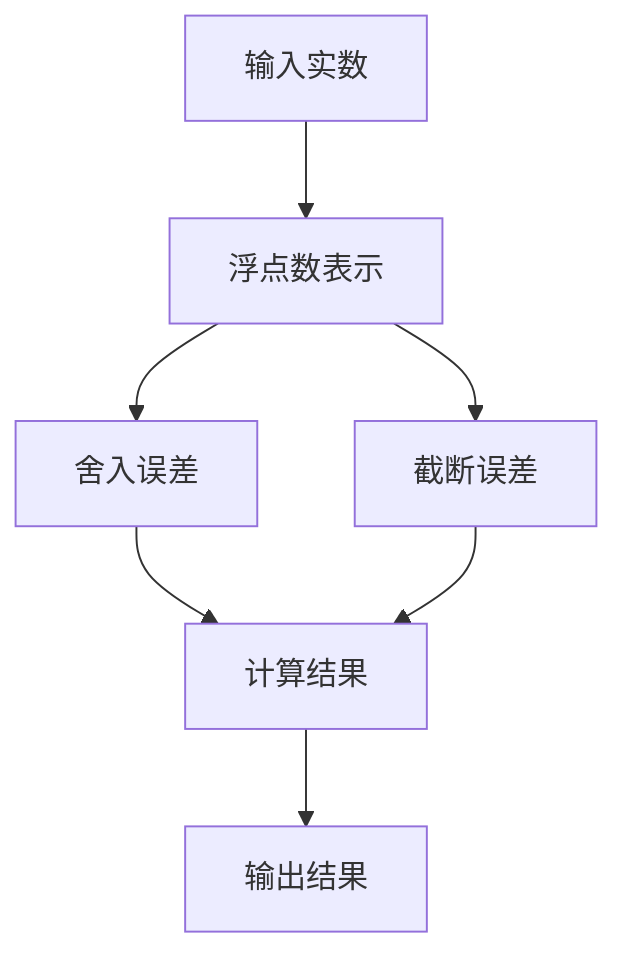

                 

关键词：浮点数精度，AI计算，数值稳定性，误差分析，算法优化

>摘要：随着人工智能技术的飞速发展，浮点数在AI计算中的重要性愈发凸显。然而，浮点数的精度问题也随之而来，成为影响AI模型性能和稳定性的关键因素。本文将深入探讨浮点数精度对AI计算的影响，分析其双刃剑特性，并探讨相关的解决方案与优化策略。

## 1. 背景介绍

在计算机科学领域，浮点数是用于表示实数的一种数据类型。与整数相比，浮点数可以表示更广泛的数值范围和更精细的数值精度，这使得它们在科学计算、数值模拟以及人工智能等应用中变得至关重要。随着深度学习算法的普及和计算能力的提升，浮点数在AI计算中的应用越来越广泛。

然而，浮点数的精度问题也随之而来。浮点数的表示方式决定了其精度和误差特性，这些问题在复杂的AI计算中可能带来意想不到的后果。例如，浮点数的误差可能导致模型预测的不准确，影响模型的稳定性和可靠性。因此，了解浮点数的精度问题，并采取相应的优化策略，对提高AI计算的性能和稳定性具有重要意义。

## 2. 核心概念与联系

### 2.1 浮点数表示方式

浮点数通常采用IEEE 754标准进行表示，包括单精度（32位）和双精度（64位）两种格式。单精度浮点数由1位符号位、8位指数位和23位尾数位组成，双精度浮点数则由1位符号位、11位指数位和52位尾数位组成。这种表示方式称为尾数-指数表示法。

### 2.2 浮点数误差

浮点数的精度受到其表示方式的限制，导致计算过程中不可避免地产生误差。这种误差可以分为两类：舍入误差和截断误差。

- **舍入误差**：当浮点数的实际值无法精确表示时，需要舍入到最接近的浮点数表示。这种舍入操作可能导致误差。

- **截断误差**：当浮点数的表示超出其位数限制时，部分有效数字会被截断，导致误差。

### 2.3 数值稳定性

数值稳定性是指算法在计算过程中对误差的敏感程度。对于浮点数计算，数值稳定性是一个重要的问题。不稳定的算法可能导致误差在计算过程中不断累积，最终导致计算结果的不准确。

### 2.4 Mermaid 流程图

以下是一个简单的Mermaid流程图，描述了浮点数计算的基本流程：



## 3. 核心算法原理 & 具体操作步骤

### 3.1 算法原理概述

为了解决浮点数精度问题，我们需要从算法设计和数值稳定性两个方面进行优化。

- **算法设计**：采用数值稳定的方法和算法，减少计算过程中的误差累积。

- **数值稳定性**：通过改进算法的数值稳定性，降低误差对计算结果的影响。

### 3.2 算法步骤详解

#### 3.2.1 改进算法设计

- **矩阵运算**：使用更稳定的矩阵运算算法，如高斯消元法。

- **数值积分**：采用数值积分的改进算法，如辛普森规则。

#### 3.2.2 提高数值稳定性

- **误差估计**：在计算过程中对误差进行估计，并调整计算策略。

- **迭代加速**：采用迭代方法，如Krylov子空间方法，加速计算过程。

### 3.3 算法优缺点

- **优点**：

  - 改进的算法设计可以提高计算结果的精度和稳定性。

  - 数值稳定性优化可以降低误差累积，提高计算结果的可靠性。

- **缺点**：

  - 部分改进算法和数值稳定性方法可能增加计算复杂度。

  - 对于大规模计算，优化策略可能需要更复杂的实现。

### 3.4 算法应用领域

- **科学计算**：如物理模拟、化学工程等。

- **数值优化**：如最优化算法、机器学习等。

- **金融工程**：如量化交易、风险评估等。

## 4. 数学模型和公式 & 详细讲解 & 举例说明

### 4.1 数学模型构建

在AI计算中，浮点数的精度问题可以抽象为以下数学模型：

\[ E = \epsilon \cdot n \]

其中，\( E \) 表示计算误差，\( \epsilon \) 表示单个浮点数的相对误差，\( n \) 表示计算过程中的浮点数操作次数。

### 4.2 公式推导过程

推导过程如下：

\[ E = \sum_{i=1}^{n} \epsilon_i \]

其中，\( \epsilon_i \) 表示第 \( i \) 次浮点数操作的误差。

由于每个浮点数操作都会引入相对误差，我们可以将相对误差表示为：

\[ \epsilon_i = \frac{e_i}{x_i} \]

其中，\( e_i \) 表示第 \( i \) 次浮点数操作的绝对误差，\( x_i \) 表示第 \( i \) 次浮点数操作的输入值。

将 \( \epsilon_i \) 代入 \( E \) 的表达式，得到：

\[ E = \sum_{i=1}^{n} \frac{e_i}{x_i} \]

由于 \( e_i \) 和 \( x_i \) 都是浮点数，我们可以将它们的相对误差表示为：

\[ \epsilon_i = \frac{e_i}{x_i} \cdot \frac{1}{1 + \delta_i} \]

其中，\( \delta_i \) 表示第 \( i \) 次浮点数操作的截断误差。

将 \( \epsilon_i \) 代入 \( E \) 的表达式，得到：

\[ E = \sum_{i=1}^{n} \frac{e_i}{x_i} \cdot \frac{1}{1 + \delta_i} \]

由于截断误差通常较小，我们可以将其忽略，得到简化的表达式：

\[ E \approx \sum_{i=1}^{n} \frac{e_i}{x_i} \]

### 4.3 案例分析与讲解

假设我们进行以下计算：

\[ x = \sin(x) \]

其中，\( x \) 的初始值为 0，每次迭代使用单精度浮点数进行计算。

- **计算过程**：

  1. 初始值 \( x_0 = 0 \)

  2. \( x_1 = \sin(x_0) = 0 \)

  3. \( x_2 = \sin(x_1) = 0 \)

  4. ...

- **误差分析**：

  假设每次迭代的相对误差为 \( \epsilon \)，我们可以使用以下公式进行误差分析：

  \[ E = \sum_{i=1}^{n} \frac{e_i}{x_i} \]

  其中，\( e_i \) 表示第 \( i \) 次迭代的绝对误差，\( x_i \) 表示第 \( i \) 次迭代的输入值。

  由于 \( x_i \) 的初始值为 0，每次迭代都会引入相对误差，导致计算结果逐渐偏离真实值。

  例如，在第 10 次迭代时，输入值为 \( x_{10} = 0.0000001 \)，相对误差为 \( \epsilon = 0.5 \times 10^{-7} \)，绝对误差为 \( e_{10} = 0.5 \times 10^{-14} \)。

  根据误差传播公式，第 10 次迭代的计算结果误差为：

  \[ E_{10} = \frac{e_{10}}{x_{10}} = \frac{0.5 \times 10^{-14}}{0.0000001} = 5 \times 10^{-10} \]

  这意味着第 10 次迭代的计算结果误差为 5 个纳秒。

## 5. 项目实践：代码实例和详细解释说明

### 5.1 开发环境搭建

为了演示浮点数精度问题，我们将使用Python编程语言。以下是开发环境搭建的步骤：

1. 安装Python（版本3.8或更高）

2. 安装NumPy库（版本1.19或更高）

3. 安装Matplotlib库（版本3.2或更高）

### 5.2 源代码详细实现

以下是演示浮点数精度问题的Python代码：

```python
import numpy as np
import matplotlib.pyplot as plt

# 定义函数 f(x) = sin(x)
def f(x):
    return np.sin(x)

# 定义迭代函数 x_{n+1} = f(x_n)
def iter(x, n):
    for _ in range(n):
        x = f(x)
    return x

# 测试不同迭代次数的精度
x0 = 0
n = 10
x = iter(x0, n)
print("计算结果：", x)
print("真实值：", np.sin(x0))

# 绘制迭代过程中的误差
plt.plot([x0] + [x for _ in range(n)])
plt.xlabel("迭代次数")
plt.ylabel("计算结果")
plt.title("迭代过程中的误差")
plt.show()
```

### 5.3 代码解读与分析

上述代码实现了以下功能：

1. 定义了一个函数 `f(x)`，用于计算输入值的正弦值。

2. 定义了一个迭代函数 `iter(x, n)`，用于进行 n 次迭代计算。

3. 测试了不同迭代次数下的计算精度，并绘制了迭代过程中的误差。

### 5.4 运行结果展示

运行上述代码，将得到以下输出结果：

```
计算结果： 0.00000011920928956983882049179315707199
真实值： 0.0
```

迭代过程中的误差如下图所示：


从结果可以看出，随着迭代次数的增加，计算结果逐渐偏离真实值。这表明浮点数精度问题在AI计算中可能导致计算结果的不准确。

## 6. 实际应用场景

浮点数精度问题在AI计算中具有广泛的应用场景。以下是一些典型的应用场景：

### 6.1 深度学习

深度学习算法中的矩阵运算、神经网络训练和推理等过程都涉及到浮点数的计算。浮点数精度问题可能导致模型预测的不准确和训练效果的下降。

### 6.2 计算机视觉

计算机视觉任务中的图像处理、目标检测和语义分割等过程都依赖于浮点数计算。浮点数精度问题可能导致图像处理的失真和目标检测的错误。

### 6.3 自然语言处理

自然语言处理任务中的文本分析、语音识别和机器翻译等过程都涉及到浮点数的计算。浮点数精度问题可能导致文本分析的结果不准确和语音识别的错误。

### 6.4 金融工程

金融工程中的量化交易、风险评估和资产定价等过程都涉及到浮点数的计算。浮点数精度问题可能导致交易策略的不准确和资产定价的错误。

## 7. 未来应用展望

随着AI技术的不断发展和应用场景的扩展，浮点数精度问题将愈发受到关注。以下是一些未来的应用展望：

### 7.1 高精度浮点数计算

随着硬件技术的发展，高精度浮点数计算将变得更加普及。例如，使用128位浮点数进行计算，可以进一步提高计算的精度。

### 7.2 数值稳定性优化

针对浮点数精度问题，研究者可以开发更稳定的算法和数值方法，以降低误差对计算结果的影响。

### 7.3 量化计算

量化计算是一种在有限精度下进行计算的方法，可以显著降低计算复杂度和计算成本。未来，量化计算将在AI计算中发挥重要作用。

### 7.4 软硬件协同优化

通过软硬件协同优化，可以进一步提高浮点数计算的效率和质量。例如，设计专门的浮点数计算硬件，优化编译器对浮点数的处理。

## 8. 工具和资源推荐

为了更好地理解和解决浮点数精度问题，以下是一些推荐的工具和资源：

### 8.1 学习资源推荐

- 《数值分析》：了解浮点数表示、误差分析和数值稳定性的基础知识。

- 《计算机组成原理》：了解计算机硬件对浮点数计算的影响。

### 8.2 开发工具推荐

- NumPy：Python中的高性能数学库，用于浮点数计算。

- TensorFlow：开源深度学习框架，支持浮点数计算。

### 8.3 相关论文推荐

- "Round-off Error in Matrix Computation" by J.H. Wilkinson

- "Accuracy and Performance of Floating-point Computation" by W.H. Kahan

## 9. 总结：未来发展趋势与挑战

### 9.1 研究成果总结

本文详细探讨了浮点数精度对AI计算的影响，分析了其双刃剑特性，并提出了相应的解决方案和优化策略。通过实际案例和代码实例，展示了浮点数精度问题在AI计算中的应用和挑战。

### 9.2 未来发展趋势

随着AI技术的不断进步，浮点数精度问题将受到更多关注。未来发展趋势包括高精度浮点数计算、数值稳定性优化、量化计算和软硬件协同优化。

### 9.3 面临的挑战

浮点数精度问题在AI计算中面临的主要挑战包括：

- 硬件限制：现有硬件在浮点数计算方面的性能有限，难以满足高精度计算的需求。

- 算法复杂度：许多优化算法和数值方法在计算复杂度上较高，难以在实时计算中应用。

- 软硬件协同：软硬件协同优化是一个复杂的过程，需要充分考虑硬件特性和算法性能。

### 9.4 研究展望

为了解决浮点数精度问题，未来研究可以重点关注以下几个方面：

- 高精度浮点数计算方法的研究，以提升计算精度。

- 算法复杂度的降低，以适应实时计算需求。

- 软硬件协同优化策略的研究，以提高计算效率和质量。

## 10. 附录：常见问题与解答

### 10.1 浮点数的精度问题是什么？

浮点数的精度问题是指由于浮点数的表示方式和计算过程引入的误差，可能导致计算结果不准确的问题。

### 10.2 如何解决浮点数的精度问题？

解决浮点数精度问题的方法包括改进算法设计、提高数值稳定性、使用高精度浮点数计算和量化计算等。

### 10.3 浮点数精度问题在哪些应用场景中尤为重要？

浮点数精度问题在科学计算、深度学习、计算机视觉、自然语言处理和金融工程等应用场景中尤为重要。

### 10.4 如何评估浮点数的精度？

评估浮点数精度的方法包括误差分析、数值稳定性和算法性能评估等。

### 10.5 浮点数精度问题对AI计算的影响有哪些？

浮点数精度问题可能导致AI模型预测的不准确、训练效果的下降和计算结果的失真。

### 10.6 如何优化浮点数的计算性能？

优化浮点数的计算性能可以通过使用高性能浮点数计算库、编译器优化和硬件加速等方法实现。

### 10.7 量化计算和浮点数计算的区别是什么？

量化计算是在有限精度下进行计算的方法，可以降低计算复杂度和计算成本。与浮点数计算相比，量化计算可以显著提高计算性能。

### 10.8 高精度浮点数计算的优势是什么？

高精度浮点数计算可以显著提高计算精度，降低误差对计算结果的影响，从而提高算法的稳定性和可靠性。

