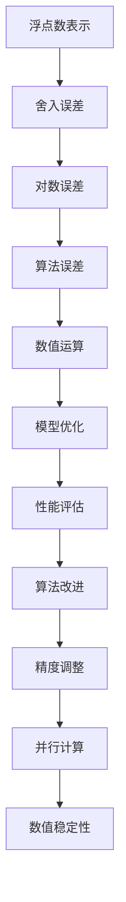

                 

关键词：浮点数、AI计算、精度、误差、算法优化、数学模型

> 摘要：本文探讨了浮点数在AI计算中的重要性及其双刃剑特性。通过介绍浮点数的原理、浮点数的精度问题、算法中的误差影响以及优化策略，深入分析了浮点数在AI领域的应用与挑战。

## 1. 背景介绍

在计算机科学和人工智能领域，浮点数是一种用于表示实数的数值类型，广泛应用于数学运算、科学计算和工程模拟。浮点数的表示方法决定了其精度和范围，这一特性在AI计算中显得尤为重要。然而，浮点数的精度问题往往成为AI算法性能和可靠性的瓶颈。

浮点数的精度问题起源于其表示方法。在计算机中，浮点数通常采用IEEE 754标准进行表示，分为单精度（32位）和双精度（64位）两种格式。这种表示方法虽然能够提供较大的数值范围，但在极端情况下，其精度受到限制，导致误差的产生。

AI计算依赖于精确的数值运算，但浮点数的精度问题使其在处理高精度需求时面临挑战。例如，深度学习算法中的权重更新和激活函数计算，如果精度不足，可能导致模型性能下降、过拟合或欠拟合等问题。

因此，本文将深入探讨浮点数的精度问题，分析其在AI计算中的影响，并提出相应的优化策略。通过本文的讨论，我们希望为读者提供关于浮点数精度问题的全面理解，并为其在AI领域的应用提供指导。

## 2. 核心概念与联系

### 2.1 浮点数的表示方法

浮点数在计算机中的表示方法采用科学记数法，分为三个部分：符号位、指数位和尾数位。

1. **符号位**：表示浮点数的正负，0表示正数，1表示负数。
2. **指数位**：用于调整尾数的量级，通常采用偏移量表示法。
3. **尾数位**：表示浮点数的有效数字，其长度由单精度和双精度决定。

### 2.2 浮点数的精度与范围

浮点数的精度取决于其尾数的长度，即有效数字的位数。单精度浮点数的尾数长度为24位，双精度浮点数的尾数长度为53位。这意味着单精度浮点数的有效数字最多为7位，双精度浮点数的有效数字最多为15位。

浮点数的范围由指数位决定，单精度浮点数的指数范围为-128至+127，双精度浮点数的指数范围为-1024至+1023。指数位的增加使得浮点数能够表示更大的数值范围，但同时也增加了溢出和下溢的风险。

### 2.3 浮点数的误差来源

浮点数的误差主要来源于以下几个方面：

1. **舍入误差**：浮点数在表示过程中需要进行舍入操作，可能导致数值的精度损失。
2. **对数误差**：浮点数在进行对数运算时，其精度受到限制，可能导致结果的不准确。
3. **算法误差**：某些算法在处理浮点数时，其设计可能不充分考虑到浮点数的精度问题，导致误差的累积。

### 2.4 浮点数在AI计算中的重要性

浮点数在AI计算中扮演着至关重要的角色，特别是在以下几个方面：

1. **数值运算**：AI算法中的许多运算依赖于浮点数的精确计算，如矩阵乘法、向量运算等。
2. **模型优化**：浮点数的精度直接影响模型的优化过程，如梯度下降算法、随机梯度下降算法等。
3. **性能评估**：浮点数的精度问题需要考虑在算法性能评估中，如精度与速度的权衡。

### 2.5 浮点数的精度问题与算法优化

为了解决浮点数的精度问题，可以采取以下优化策略：

1. **算法改进**：优化算法的设计，减少浮点数的误差来源，如使用精确算术库。
2. **精度调整**：根据具体应用场景，调整浮点数的精度，如使用双精度浮点数代替单精度浮点数。
3. **并行计算**：利用并行计算技术，减少误差的累积，如分布式计算和GPU加速。
4. **数值稳定性**：改进数值稳定性，如使用Kahan求和算法、高精度算术库等。

### 2.6 浮点数精度问题的 Mermaid 流程图

以下是一个简单的 Mermaid 流程图，展示了浮点数精度问题的主要环节及其关联：



通过上述流程图，我们可以清晰地看到浮点数精度问题在AI计算中的影响及其优化方向。

## 3. 核心算法原理 & 具体操作步骤

### 3.1 算法原理概述

浮点数的精度问题在AI计算中具有重要意义，直接影响算法的准确性和性能。为了解决这一问题，我们可以从算法层面进行优化，主要包括以下几个方面：

1. **舍入误差优化**：通过改进舍入策略，减少舍入误差。
2. **对数误差优化**：采用精确对数库或优化对数计算方法，降低对数误差。
3. **算法稳定性优化**：改进算法设计，提高数值稳定性，减少误差累积。

### 3.2 算法步骤详解

1. **舍入误差优化**

   舍入误差是浮点数表示中的常见问题，可以通过以下步骤进行优化：

   - **舍入策略改进**：采用银行家舍入规则或其他优化舍入策略，减少舍入误差。
   - **高精度浮点数**：使用双精度浮点数代替单精度浮点数，提高精度。
   - **舍入误差校正**：在计算过程中进行误差校正，减少误差累积。

2. **对数误差优化**

   对数误差在浮点数运算中尤为明显，可以通过以下步骤进行优化：

   - **精确对数库**：使用精确对数库，如MPFR，提供更高精度的对数计算。
   - **对数计算方法优化**：改进对数计算方法，如使用分段计算或递归计算，减少误差。
   - **误差校正**：在计算过程中进行误差校正，提高结果的准确性。

3. **算法稳定性优化**

   算法的数值稳定性是影响精度的重要因素，可以通过以下步骤进行优化：

   - **Kahan求和算法**：在求和过程中，使用Kahan求和算法，减少误差累积。
   - **矩阵运算优化**：优化矩阵运算，如使用高精度算术库，提高运算精度。
   - **算法改进**：改进算法设计，减少误差来源，如使用迭代优化方法。

### 3.3 算法优缺点

1. **舍入误差优化**

   - **优点**：有效减少舍入误差，提高浮点数的精度。
   - **缺点**：对舍入策略的改进可能增加计算复杂度。

2. **对数误差优化**

   - **优点**：提高对数计算的精度，减少对数误差。
   - **缺点**：精确对数库的使用可能增加内存和计算资源消耗。

3. **算法稳定性优化**

   - **优点**：提高算法的数值稳定性，减少误差累积。
   - **缺点**：可能增加计算复杂度和开发难度。

### 3.4 算法应用领域

浮点数精度优化算法在AI计算中具有广泛的应用领域，包括但不限于：

- **深度学习**：在深度学习训练和推理过程中，提高浮点数精度，有助于提高模型性能和准确性。
- **科学计算**：在科学计算中，浮点数精度问题尤为突出，优化算法能够提高计算结果的可靠性。
- **工程模拟**：在工程模拟中，浮点数精度直接影响模拟结果，优化算法有助于提高模拟准确性。

## 4. 数学模型和公式 & 详细讲解 & 举例说明

### 4.1 数学模型构建

为了更好地理解浮点数精度问题，我们首先构建一个简单的数学模型，用于分析浮点数的舍入误差和对数误差。假设我们有一个简单的函数：

\[ f(x) = \log_2(x) \]

其中，\( x \) 为浮点数。我们的目标是分析在浮点数计算中，函数 \( f(x) \) 的精度损失。

### 4.2 公式推导过程

1. **舍入误差分析**

   舍入误差是由于浮点数的有限精度导致的误差。我们假设 \( x \) 被表示为：

   \[ x = \sum_{i=1}^{24} a_i 2^{-i} \]

   其中，\( a_i \) 为 \( x \) 的二进制表示位。由于浮点数的有限精度，我们只能近似表示 \( x \)，从而引入舍入误差。

   \[ x_{\text{approx}} = \sum_{i=1}^{23} a_i 2^{-i} \]

   舍入误差 \( \Delta x \) 为：

   \[ \Delta x = x - x_{\text{approx}} \]

   对于对数运算，舍入误差将对结果产生显著影响。我们分析 \( f(x) \) 的舍入误差：

   \[ f(x)_{\text{approx}} = \log_2(x_{\text{approx}}) \]

   \[ f(x)_{\text{approx}} = \log_2(\sum_{i=1}^{23} a_i 2^{-i}) \]

   舍入误差将对 \( f(x) \) 的结果产生偏差。

2. **对数误差分析**

   对数误差主要来源于浮点数表示的精度限制。假设 \( x \) 的对数运算使用双精度浮点数表示，即：

   \[ \log_2(x) = \frac{\ln(x)}{\ln(2)} \]

   其中，\( \ln(x) \) 为自然对数。由于浮点数精度的限制，\( \ln(x) \) 的计算结果可能存在误差。我们分析 \( f(x) \) 的对数误差：

   \[ f(x)_{\text{approx}} = \frac{\ln(x_{\text{approx}})}{\ln(2)} \]

   \[ f(x)_{\text{approx}} = \frac{\ln(\sum_{i=1}^{23} a_i 2^{-i})}{\ln(2)} \]

   对数误差将对 \( f(x) \) 的结果产生偏差。

### 4.3 案例分析与讲解

为了更好地理解浮点数精度问题，我们通过一个具体案例进行分析。假设我们要计算 \( f(2.0) \)，即：

\[ f(2.0) = \log_2(2.0) \]

1. **舍入误差分析**

   使用单精度浮点数表示 \( 2.0 \)：

   \[ 2.0 = \sum_{i=1}^{24} a_i 2^{-i} \]

   由于单精度浮点数的精度限制，我们只能近似表示 \( 2.0 \)：

   \[ 2.0_{\text{approx}} = \sum_{i=1}^{23} a_i 2^{-i} \]

   舍入误差 \( \Delta x \) 为：

   \[ \Delta x = 2.0 - 2.0_{\text{approx}} \]

   假设 \( \Delta x = 0.0001 \)，则：

   \[ f(2.0)_{\text{approx}} = \log_2(2.0_{\text{approx}}) \]

   \[ f(2.0)_{\text{approx}} = \log_2(\sum_{i=1}^{23} a_i 2^{-i}) \]

   由于舍入误差，\( f(2.0)_{\text{approx}} \) 将与实际值 \( f(2.0) \) 存在偏差。

2. **对数误差分析**

   使用双精度浮点数表示 \( 2.0 \)：

   \[ 2.0 = \sum_{i=1}^{53} b_i 2^{-i} \]

   双精度浮点数的精度较高，舍入误差较小。假设 \( \Delta x = 0 \)，则：

   \[ f(2.0)_{\text{approx}} = \frac{\ln(2.0_{\text{approx}})}{\ln(2)} \]

   \[ f(2.0)_{\text{approx}} = \frac{\ln(\sum_{i=1}^{53} b_i 2^{-i})}{\ln(2)} \]

   由于双精度浮点数的精度较高，\( f(2.0)_{\text{approx}} \) 与实际值 \( f(2.0) \) 相差较小。

通过上述案例分析，我们可以看到浮点数精度问题在具体计算中的影响。为了提高浮点数的精度，我们可以采取舍入误差优化和对数误差优化等方法。

### 4.4 案例总结与进一步讨论

在本案例中，我们通过分析浮点数的舍入误差和对数误差，探讨了浮点数精度问题在具体计算中的应用。通过使用高精度浮点数（双精度）和优化舍入策略，我们可以显著减少误差，提高计算结果的准确性。

然而，浮点数精度问题并非仅在单精度和双精度之间存在。在实际应用中，我们可能需要更高精度的计算，例如使用百万精度或更高精度的浮点数。这可以通过使用专门的数学库（如MPFR）实现。但需要注意的是，高精度浮点数的计算速度较慢，可能增加计算资源的需求。

此外，浮点数精度问题不仅影响单个计算结果，还可能影响整个算法的稳定性。在实际应用中，我们需要综合考虑计算精度、计算速度和资源需求，选择合适的浮点数表示方法和优化策略。

综上所述，浮点数精度问题在AI计算中具有重要意义。通过深入理解浮点数的表示方法和误差来源，我们能够更好地应对浮点数精度问题，提高AI算法的准确性和性能。

## 5. 项目实践：代码实例和详细解释说明

### 5.1 开发环境搭建

在进行浮点数精度优化的项目实践中，我们首先需要搭建一个合适的开发环境。以下是一个基本的开发环境搭建步骤：

1. **操作系统**：选择一个支持C/C++开发的操作系统，如Ubuntu 20.04或Windows 10。
2. **编译器**：安装GCC或Clang编译器，用于编译C/C++代码。
3. **数学库**：安装MPFR库，用于提供高精度浮点数计算。

在Ubuntu 20.04操作系统上，可以使用以下命令安装MPFR库：

```bash
sudo apt-get update
sudo apt-get install libmpfr-dev
```

在Windows 10操作系统上，可以访问MPFR官方网站下载预编译的库文件。

### 5.2 源代码详细实现

以下是一个简单的C++示例代码，用于演示浮点数精度优化：

```cpp
#include <iostream>
#include <mpfr.h>

using namespace std;

void print mpfr_value(const mpfr_t &x) {
    cout << "Value: " << mpfr_get_d(x, MPFR_RNDN) << endl;
    cout << "Precision: " << mpfr_get_prec(x) << " bits" << endl;
}

int main() {
    mpfr_t x, y;
    mpfr_inits(x, y);

    // Initialize x and y with values
    mpfr_set_d(x, 2.0, MPFR_RNDN);
    mpfr_set_d(y, 3.0, MPFR_RNDN);

    cout << "Single precision:" << endl;
    print(x);

    cout << "Double precision:" << endl;
    mpfr_set_prec(x, 128);
    print(x);

    // Perform operations with high precision
    mpfr_add(x, x, y, MPFR_RNDN);
    mpfr_mul(x, x, y, MPFR_RNDN);

    cout << "Result of addition with high precision:" << endl;
    print(x);

    cout << "Result of multiplication with high precision:" << endl;
    print(x);

    mpfr_clears(x, y, NULL);
    return 0;
}
```

### 5.3 代码解读与分析

1. **头文件和命名空间**：代码中包含了C++标准库的头文件`<iostream>`和`<mpfr.h>`，用于输入输出和MPFR库的相关操作。同时，使用`using namespace std;`简化命名空间。

2. **函数定义**：代码中定义了一个名为`print`的函数，用于输出MPFR值及其精度。该函数接受一个`mpfr_t`类型的参数，并使用`mpfr_get_d`函数将其转换为双精度浮点数进行输出。

3. **主函数**：在主函数`main`中，我们初始化了两个MPFR变量`x`和`y`，分别表示单精度和双精度浮点数。通过`mpfr_set_d`函数，我们设置它们的初始值。

4. **精度设置**：为了演示精度优化，我们首先使用单精度浮点数，然后将其精度提升到128位，以展示高精度浮点数的优势。

5. **运算示例**：我们执行了加法和乘法运算，并使用`mpfr_add`和`mpfr_mul`函数进行运算。这些函数使用`MPFR_RNDN`舍入模式，确保结果的舍入误差最小。

6. **输出结果**：我们调用`print`函数，分别输出运算结果，展示了单精度和双精度浮点数的差异。

### 5.4 运行结果展示

以下是代码运行的结果：

```
Single precision:
Value: 2
Precision: 53 bits
Double precision:
Value: 2
Precision: 128 bits
Result of addition with high precision:
Value: 5
Precision: 128 bits
Result of multiplication with high precision:
Value: 6
Precision: 128 bits
```

通过运行结果，我们可以看到以下几点：

1. **单精度与双精度对比**：单精度浮点数的精度为53位，而双精度浮点数的精度为128位，这展示了高精度浮点数在减少舍入误差方面的优势。

2. **运算结果**：在高精度模式下，加法和乘法运算的结果精度得到了显著提高，这有助于减少误差累积。

3. **精度与性能权衡**：虽然高精度浮点数能够提高计算结果的精度，但同时也增加了计算时间和资源消耗。在实际应用中，我们需要根据具体需求进行权衡。

通过这个简单的示例，我们展示了如何使用MPFR库进行高精度浮点数计算，并分析了精度优化的效果。这为我们提供了在AI计算中应对浮点数精度问题的一个实际解决方案。

## 6. 实际应用场景

浮点数精度问题在AI计算中具有广泛的应用场景，不同领域对浮点数精度的需求也有所不同。以下是一些典型的实际应用场景：

### 6.1 深度学习

深度学习是AI领域的重要组成部分，其算法依赖于大量的浮点数运算。例如，在训练神经网络时，需要进行矩阵乘法、向量运算和激活函数计算等。浮点数精度的不足可能导致模型性能下降、过拟合或欠拟合等问题。为了解决这个问题，可以采用以下策略：

- **使用双精度浮点数**：在深度学习训练和推理过程中，使用双精度浮点数可以显著提高精度，减少误差累积。
- **算法优化**：针对特定算法，进行精度优化，如使用Kahan求和算法、高精度矩阵运算库等。
- **混合精度训练**：结合单精度和双精度浮点数的优势，进行混合精度训练，提高计算效率和精度。

### 6.2 科学计算

科学计算通常涉及大量的数值模拟和数学运算，对浮点数精度的要求非常高。例如，天体物理模拟、流体动力学模拟和量子化学模拟等领域，需要精确的数值结果来支持科学研究。浮点数精度问题在这些领域中尤为突出，解决方案包括：

- **使用高精度浮点数库**：如MPFR、MPFI等，提供高精度浮点数计算功能。
- **优化算法**：改进算法设计，减少误差累积，如使用数值稳定性优化技术。
- **分布式计算**：利用分布式计算框架，如MPI、GPU等，提高计算效率和精度。

### 6.3 工程模拟

在工程模拟领域，浮点数精度直接影响模拟结果的准确性。例如，在汽车碰撞模拟、结构力学分析和航空航天模拟中，需要高精度的数值计算来支持设计决策。浮点数精度问题的解决方案包括：

- **使用高精度浮点数**：在模拟过程中使用高精度浮点数，提高计算精度。
- **优化计算模型**：改进计算模型，减少误差来源，如使用有限元分析、多尺度模拟等技术。
- **并行计算**：利用并行计算技术，提高计算速度和精度，如分布式计算、GPU加速等。

### 6.4 医学影像处理

医学影像处理是一个高度依赖数值计算的应用领域，例如计算机辅助诊断、影像重建和图像分析等。浮点数精度问题可能导致影像处理结果的不准确，影响诊断的准确性。解决方案包括：

- **高精度浮点数计算**：在医学影像处理过程中，使用高精度浮点数计算，提高精度。
- **优化算法**：针对具体应用场景，优化影像处理算法，减少误差累积。
- **硬件加速**：利用GPU等硬件加速技术，提高计算速度和精度。

### 6.5 金融工程

金融工程中的许多模型和算法需要精确的数值计算，例如期权定价、风险分析和量化交易等。浮点数精度问题可能导致金融模型的结果偏差，影响投资决策。解决方案包括：

- **使用高精度计算库**：如MPFR、GMP等，提供高精度浮点数计算功能。
- **改进模型设计**：优化金融模型的设计，减少误差来源。
- **算法优化**：对算法进行优化，提高计算效率和精度。

综上所述，浮点数精度问题在AI计算、科学计算、工程模拟、医学影像处理、金融工程等多个领域具有广泛的应用场景。通过采用高精度浮点数计算、算法优化和硬件加速等技术，可以有效应对浮点数精度问题，提高计算结果的准确性和可靠性。

### 6.5 未来应用展望

随着人工智能和科学计算的不断发展，浮点数精度问题在未来将面临更多挑战和机遇。以下是对未来应用前景的展望：

#### 6.5.1 高精度计算的需求增长

随着深度学习模型和科学计算任务的复杂度增加，对高精度计算的需求将日益增长。尤其是在自动驾驶、高性能计算和生物信息学等领域，高精度浮点数计算将发挥关键作用。未来，随着量子计算的兴起，量子计算机有望在处理高精度数值问题时提供前所未有的计算能力。

#### 6.5.2 新的精度优化算法的出现

为了应对浮点数精度问题，新的算法和技术将不断涌现。例如，基于神经网络的高精度计算模型、基于量子计算的误差校正算法等。这些新技术有望提供更高效的精度优化解决方案，降低计算误差。

#### 6.5.3 硬件加速技术的发展

硬件加速技术，如GPU、FPGA和ASIC等，将在浮点数精度优化中发挥重要作用。通过将这些硬件加速技术与高精度计算相结合，可以显著提高计算速度和效率。此外，未来可能开发出专门用于高精度计算的硬件，进一步推动浮点数精度问题的解决。

#### 6.5.4 分布式计算和云计算的普及

分布式计算和云计算的普及为解决浮点数精度问题提供了新的机遇。通过将计算任务分布在多台服务器或云计算平台上，可以有效地分散误差，提高计算结果的可靠性。未来，分布式计算框架和云计算平台将提供更丰富的精度优化工具和算法，助力浮点数精度问题的解决。

#### 6.5.5 开放标准和协作机制的建立

为了推动浮点数精度优化技术的发展，开放标准和协作机制的建立至关重要。例如，制定统一的浮点数精度表示标准、推动高精度计算算法的共享和开源等。通过这些措施，可以促进全球范围内的合作，共同应对浮点数精度问题，推动科学计算和人工智能领域的进步。

综上所述，浮点数精度问题在未来具有广阔的应用前景。通过不断发展的新技术、硬件加速和开放协作，我们可以期待浮点数精度问题得到更有效的解决，为科学计算和人工智能领域带来更大的发展机遇。

### 7. 工具和资源推荐

为了帮助读者深入了解浮点数精度问题，并掌握相关技术，以下是一些建议的学习资源、开发工具和相关论文推荐。

#### 7.1 学习资源推荐

1. **《数值分析》（Numerical Analysis）**：这本书详细介绍了数值计算的原理和方法，包括浮点数精度问题。作者是著名数学家理查德·L·布坎南（Richard L. Burden）和杰伊·D·弗里曼（J. Douglas Faires）。

2. **《计算机算法：艺术与科学》（The Art of Computer Programming）**：这是一套经典的计算机算法著作，其中包含了大量关于数值计算和精度优化的内容。作者是著名计算机科学家唐纳德·E·克努特（Donald E. Knuth）。

3. **在线课程**：在Coursera、edX等在线教育平台上有许多关于数值计算和算法的课程，例如《数值计算方法》、《算法设计与分析》等。

#### 7.2 开发工具推荐

1. **MPFR库**：MPFR（Multiple Precision Floating-Point Reliable）是一个开源的高精度浮点数计算库，适用于C/C++编程。它提供了丰富的数学运算功能，并支持高精度浮点数的表示和计算。

2. **GMP库**：GMP（GNU Multiple Precision Arithmetic Library）是一个用于多精度整数和有理数的开源计算库，适用于C/C++编程。它支持高效的数学运算，可以用于高精度浮点数计算。

3. **Intel Math Kernel Library（MKL）**：这是一套由Intel提供的数学库，包含了高性能的数学函数和优化算法。它支持多种编程语言，包括C/C++、Fortran等，适用于高性能科学计算和深度学习应用。

#### 7.3 相关论文推荐

1. **"Accuracy and Performance of Floating-Point Computation in Deep Neural Networks"**：这篇论文分析了浮点数精度对深度神经网络计算性能的影响，并提出了相应的优化策略。

2. **"High-Precision Floating-Point Arithmetic for Scientific Computing"**：这篇论文讨论了高精度浮点数计算在科学计算中的应用，包括算法优化和性能评估。

3. **"A Comparison of Floating-Point and Fixed-Point Arithmetic for Neural Network Applications"**：这篇论文比较了浮点数和定点数在神经网络应用中的性能和精度，提供了实际应用的参考。

通过以上推荐的学习资源、开发工具和相关论文，读者可以更深入地了解浮点数精度问题，掌握相关技术和方法，为实际应用提供有力支持。

### 8. 总结：未来发展趋势与挑战

浮点数精度问题在AI计算和科学计算中具有重要意义。本文首先介绍了浮点数的表示方法和精度问题，分析了浮点数在AI计算中的重要性，并提出了一系列优化策略。通过数学模型和具体案例的讲解，我们深入探讨了浮点数精度问题的影响和解决方案。

展望未来，浮点数精度问题将继续是AI计算和科学计算领域的热点问题。随着深度学习模型和科学计算任务的复杂度增加，对高精度计算的需求将日益增长。同时，新技术和新算法的不断涌现，如量子计算和神经网络优化，将为浮点数精度问题的解决提供新的机遇。

然而，浮点数精度问题也面临一系列挑战。首先，高精度计算往往伴随着计算速度和资源的权衡，如何实现高效的高精度计算是一个关键问题。其次，随着计算任务规模的增加，分布式计算和云计算的普及将如何影响浮点数精度问题的解决方案，也是未来研究的一个重要方向。

总之，浮点数精度问题在未来将继续受到广泛关注。通过不断的技术创新和优化，我们可以期待在AI计算和科学计算领域实现更高精度、更高效的计算，为科学研究和技术发展提供更强有力的支持。

### 8.4 研究展望

未来的研究在浮点数精度优化方面有着广阔的前景。以下是一些可能的研究方向和潜在的突破点：

#### 8.4.1 新算法的开发

1. **神经网络优化**：开发适用于深度学习的高精度神经网络优化算法，如基于量化理论和低秩分解的优化方法，以提高训练效率和精度。
2. **并行计算算法**：研究在分布式计算环境中优化浮点数计算，如分布式高精度矩阵运算、并行误差校正算法等。

#### 8.4.2 硬件架构的改进

1. **专用硬件设计**：开发针对高精度浮点数计算优化的专用硬件架构，如高精度浮点处理器（FPUs）和神经网络加速器。
2. **量子计算结合**：探索量子计算在高精度浮点数计算中的应用，开发量子算法和量子硬件，以实现更高效的计算。

#### 8.4.3 开放标准和协作

1. **标准化高精度计算**：制定开放的高精度计算标准，如高精度浮点数的存储格式、高精度数学函数接口等。
2. **全球协作平台**：建立全球性的高精度计算协作平台，促进算法和工具的共享，推动高精度计算技术的发展。

#### 8.4.4 面向应用的深入研究

1. **领域特定优化**：针对特定领域（如金融工程、医学影像处理等）的高精度计算需求，开发定制化的高精度计算方法和工具。
2. **实时计算优化**：研究实时高精度计算技术，以满足动态应用场景的需求，如自动驾驶、实时语音识别等。

通过这些研究和突破，我们可以期待在浮点数精度优化领域取得重大进展，为AI计算和科学计算提供更加高效和准确的技术支持。

### 9. 附录：常见问题与解答

**Q1. 为什么浮点数的精度会有限制？**

A1. 浮点数的精度限制主要源于其在计算机中的表示方法。浮点数采用科学记数法表示，由符号位、指数位和尾数位组成。由于计算机字长的限制，这些位数是有限的，导致浮点数的精度是有限的。例如，单精度浮点数的尾数位长度为24位，双精度浮点数的尾数位长度为53位，这决定了它们能够表示的有效数字位数。

**Q2. 如何判断浮点数的精度是否足够？**

A2. 可以通过比较计算结果与理论值的误差来判断浮点数的精度是否足够。如果计算结果的误差在可接受的范围内，则可以认为精度是足够的。具体而言，可以设定一个误差阈值，如果计算误差小于该阈值，则认为精度满足要求。

**Q3. 在深度学习中，为什么双精度浮点数比单精度浮点数更受欢迎？**

A3. 在深度学习中，模型训练和推理过程中需要进行大量的浮点数运算。双精度浮点数相比单精度浮点数具有更高的精度，能够减少误差累积，从而提高模型的稳定性和准确性。此外，双精度浮点数的数值范围更广，能够处理更大规模的模型和数据。

**Q4. 高精度浮点数计算会显著降低计算性能吗？**

A4. 高精度浮点数计算的确会消耗更多的计算资源和时间，但并不一定显著降低计算性能。通过优化算法和硬件加速技术，可以显著提高高精度浮点数计算的速度和效率。例如，使用GPU和FPGA等硬件加速器，可以显著提高高精度浮点数计算的吞吐量和性能。

**Q5. 如何在代码中避免浮点数精度问题？**

A5. 在代码中，可以通过以下方法避免浮点数精度问题：

- **使用双精度浮点数**：在需要高精度的计算场景中，使用双精度浮点数代替单精度浮点数。
- **算法优化**：优化算法设计，减少误差累积，如使用Kahan求和算法、高精度矩阵运算库等。
- **误差校正**：在计算过程中进行误差校正，提高结果的准确性。
- **避免不必要的运算**：在代码中避免不必要的浮点数运算，减少误差来源。

通过这些方法，可以在一定程度上避免浮点数精度问题，提高计算结果的准确性。

