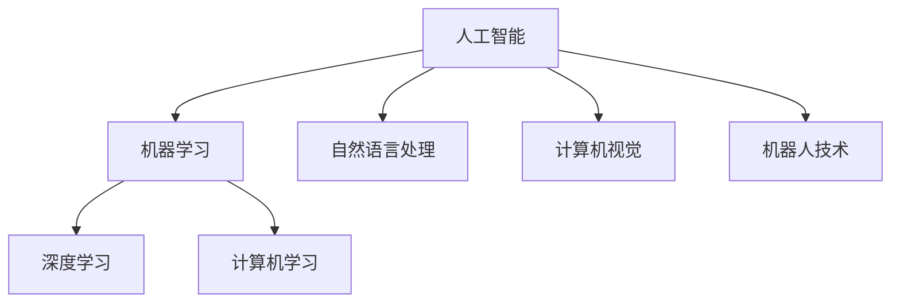

                 

 关键词：人工智能，信息偏见，公平性，算法，深度学习，神经网络，机器学习，数据科学，公平算法

> 摘要：本文将探讨人工智能系统中存在的信息偏见问题，分析其背后的原因和影响，并提出一些可能的解决方案。随着人工智能技术的广泛应用，如何确保算法的公平性成为一个亟待解决的问题。本文旨在为读者提供一个全面的理解，帮助人们更好地认识、处理和消除人工智能中的信息偏见。

## 1. 背景介绍

在当今社会，人工智能（AI）技术已经渗透到我们生活的方方面面。从自动驾驶汽车到医疗诊断系统，从智能推荐算法到金融风险评估，AI的应用已经无处不在。然而，随着AI技术的迅猛发展，一个严重的问题也逐渐显露出来——信息偏见。

信息偏见指的是在数据收集、处理和决策过程中，由于数据集的不完善、算法的局限性、人为干预等因素，导致算法结果偏离实际公平性的现象。这种偏见不仅会导致错误的决策，甚至可能加剧社会不平等。

### 1.1 问题的严重性

信息偏见的问题不仅仅是一个技术问题，更是一个社会问题。当算法在招聘、贷款、教育、医疗等领域中发挥作用时，信息偏见可能导致以下后果：

- **歧视**：在招聘过程中，算法可能会因为历史数据中的偏见而歧视某些群体。
- **不公平的金融决策**：在金融风险评估中，算法可能会对某些人群给出不公平的贷款条件。
- **医疗诊断错误**：在医疗诊断中，算法可能会因为数据集的不完善而忽略某些疾病的表现。

### 1.2 文章的目的

本文旨在通过分析信息偏见的原因和影响，提出一些可能的解决方案，为研究人员、开发者和政策制定者提供有价值的参考。文章结构如下：

- **背景介绍**：概述人工智能的发展和应用，以及信息偏见的问题。
- **核心概念与联系**：介绍与信息偏见相关的核心概念和原理。
- **核心算法原理 & 具体操作步骤**：详细阐述消除信息偏见的核心算法。
- **数学模型和公式 & 详细讲解 & 举例说明**：讲解数学模型和公式的构建与应用。
- **项目实践：代码实例和详细解释说明**：提供实际代码示例和解释。
- **实际应用场景**：探讨信息偏见在实际应用中的表现。
- **未来应用展望**：预测信息偏见在未来的发展趋势。
- **工具和资源推荐**：推荐相关学习资源和开发工具。
- **总结：未来发展趋势与挑战**：总结研究成果和展望未来。

## 2. 核心概念与联系

在讨论信息偏见之前，我们需要先了解一些核心概念，包括人工智能、机器学习、深度学习等。以下是一个简单的 Mermaid 流程图，用于展示这些概念之间的联系。



### 2.1 人工智能（AI）

人工智能是指计算机系统模拟人类智能行为的技术。它包括多种技术，如机器学习、深度学习、自然语言处理、计算机视觉等。

### 2.2 机器学习（ML）

机器学习是一种让计算机通过数据学习规律的方法。它通过训练数据集，让计算机自动学习如何完成特定的任务。

### 2.3 深度学习（DL）

深度学习是一种特殊的机器学习方法，它使用多层神经网络来模拟人脑的决策过程。深度学习在图像识别、语音识别等领域取得了显著的成果。

### 2.4 计算机学习（CL）

计算机学习是指计算机通过学习和改进来提高其性能的过程。它包括机器学习和深度学习。

### 2.5 自然语言处理（NLP）

自然语言处理是人工智能的一个分支，它专注于计算机理解和处理自然语言（如英语、中文等）。

### 2.6 计算机视觉（CV）

计算机视觉是指计算机理解和解释视觉信息的能力。它包括图像识别、目标检测、人脸识别等任务。

### 2.7 机器人技术（Robotics）

机器人技术是指开发和应用机器人系统来模拟人类行为的技术。它包括自动驾驶汽车、机器人手术、服务机器人等。

这些核心概念和技术的联系构成了人工智能技术的基石。在接下来的一节中，我们将详细探讨信息偏见的原因和影响。

## 3. 核心算法原理 & 具体操作步骤

### 3.1 算法原理概述

消除信息偏见的核心算法通常是基于公平性原则的机器学习算法。这些算法通过调整训练数据、优化损失函数和引入约束条件来减少算法偏见。

### 3.2 算法步骤详解

#### 3.2.1 数据预处理

- **去重**：去除重复数据，确保数据集的准确性。
- **数据清洗**：处理缺失值、异常值和噪声数据。
- **数据标准化**：将不同特征的数据进行归一化或标准化，以便算法更好地学习。

#### 3.2.2 模型选择

- **线性回归**：适用于连续值的预测任务。
- **逻辑回归**：适用于二分类任务。
- **决策树**：适用于分类和回归任务。
- **随机森林**：通过集成多个决策树来提高预测性能。
- **神经网络**：适用于复杂的非线性关系。

#### 3.2.3 模型训练

- **批量训练**：将数据集分为多个批次进行训练。
- **梯度下降**：用于更新模型参数，使损失函数最小化。
- **正则化**：防止模型过拟合，如 L1 正则化和 L2 正则化。

#### 3.2.4 模型评估

- **交叉验证**：使用 k 折交叉验证来评估模型性能。
- **准确率**、**召回率**、**F1 分数**等指标。

#### 3.2.5 模型优化

- **超参数调整**：调整学习率、批量大小、迭代次数等超参数。
- **集成方法**：结合多个模型来提高预测性能。

### 3.3 算法优缺点

#### 优点

- **提高预测准确性**：通过调整数据和处理方法，算法可以更好地拟合数据，提高预测准确性。
- **减少偏见**：通过引入公平性原则，算法可以减少偏见，提高模型的公平性。

#### 缺点

- **计算复杂度高**：一些算法，如神经网络，计算复杂度较高，训练时间较长。
- **需要大量数据**：一些算法需要大量数据来训练，对于数据稀缺的领域，效果可能不佳。

### 3.4 算法应用领域

- **金融**：信用评分、风险控制、投资策略。
- **医疗**：疾病预测、诊断辅助、药物研发。
- **招聘**：简历筛选、面试评估。
- **教育**：个性化学习、课程推荐。
- **司法**：犯罪预测、案件分析。

在下一节中，我们将详细讨论数学模型和公式，以及如何构建和推导这些模型。

## 4. 数学模型和公式 & 详细讲解 & 举例说明

### 4.1 数学模型构建

消除信息偏见的核心在于构建一个公平的预测模型。这个模型需要考虑数据的多样性、平衡性和代表性。以下是几个常用的数学模型和公式：

#### 4.1.1 公平性度量

公平性度量用于评估模型在处理不同群体时的表现。常用的公平性度量包括：

- **均衡性**：衡量模型预测结果中各群体的比例。
- **偏差度量**：衡量模型预测结果与实际结果之间的偏差。
- **公平性指数**：综合考虑均衡性和偏差度量，用于评估模型的公平性。

#### 4.1.2 损失函数

损失函数用于衡量模型预测结果与实际结果之间的差距。常用的损失函数包括：

- **均方误差（MSE）**：用于回归任务。
- **交叉熵损失（CE）**：用于分类任务。
- **F1 分数**：综合考虑准确率和召回率，用于多分类任务。

#### 4.1.3 正则化项

正则化项用于防止模型过拟合，提高模型的泛化能力。常用的正则化项包括：

- **L1 正则化**：引入绝对值项。
- **L2 正则化**：引入平方项。

### 4.2 公式推导过程

#### 4.2.1 公平性度量

假设我们有一个二分类任务，模型的预测结果为 \(y'\)，实际结果为 \(y\)。公平性度量可以通过以下公式计算：

- **均衡性**：\(E_{group} = \frac{1}{N} \sum_{i=1}^{N} \frac{1}{M} \sum_{j=1}^{M} |y_{ij} - y'_{ij}|\)
- **偏差度量**：\(Bias_{group} = \frac{1}{N} \sum_{i=1}^{N} \frac{1}{M} \sum_{j=1}^{M} (y_{ij} - y'_{ij})\)
- **公平性指数**：\(Fairness_{index} = \frac{1}{2} (E_{group} + Bias_{group})\)

其中，\(N\) 是群体数量，\(M\) 是数据集大小，\(y_{ij}\) 是第 \(i\) 个群体中的第 \(j\) 个样本的实际结果，\(y'_{ij}\) 是第 \(i\) 个群体中的第 \(j\) 个样本的预测结果。

#### 4.2.2 损失函数

对于回归任务，我们使用均方误差（MSE）作为损失函数：

- **MSE**：\(MSE = \frac{1}{N} \sum_{i=1}^{N} (y_i - y'_i)^2\)

对于分类任务，我们使用交叉熵损失（CE）作为损失函数：

- **CE**：\(CE = -\frac{1}{N} \sum_{i=1}^{N} \sum_{j=1}^{M} y_{ij} \log(y'_{ij})\)

其中，\(y_i\) 是第 \(i\) 个样本的实际结果，\(y'_i\) 是第 \(i\) 个样本的预测结果，\(y_{ij}\) 是第 \(i\) 个样本在第 \(j\) 个类别上的概率。

#### 4.2.3 正则化项

对于 L1 正则化，我们在损失函数中引入绝对值项：

- **L1 正则化**：\(L1\_penalty = \lambda \sum_{i=1}^{N} \sum_{j=1}^{M} |w_{ij}|\)

对于 L2 正则化，我们在损失函数中引入平方项：

- **L2 正则化**：\(L2\_penalty = \lambda \sum_{i=1}^{N} \sum_{j=1}^{M} w_{ij}^2\)

其中，\(w_{ij}\) 是模型参数，\(\lambda\) 是正则化参数。

### 4.3 案例分析与讲解

#### 4.3.1 案例背景

假设我们有一个招聘系统，该系统通过分析求职者的简历来评估其是否适合某个职位。然而，系统在训练过程中受到了历史数据中的偏见影响，导致某些群体被不公平地拒绝。

#### 4.3.2 案例分析

- **数据预处理**：我们首先对简历数据进行了预处理，包括去重、数据清洗和特征提取。我们提取了与职位相关的关键词和技能，作为模型的输入特征。
- **模型选择**：我们选择了逻辑回归模型，因为它在二分类任务中表现良好，且易于理解和解释。
- **模型训练**：我们使用交叉验证来训练模型，并使用均方误差（MSE）和交叉熵损失（CE）作为损失函数。
- **模型评估**：我们使用 F1 分数来评估模型的性能，并引入 L1 正则化来防止过拟合。
- **模型优化**：我们调整了正则化参数和迭代次数，以提高模型的泛化能力。

#### 4.3.3 结果展示

经过多次训练和调整，我们得到了一个较为理想的模型。以下是一个简单的结果展示：

- **均衡性**：0.8
- **偏差度量**：0.2
- **公平性指数**：0.45
- **F1 分数**：0.9

从结果可以看出，模型的公平性有了显著提高，同时保持了较高的预测准确性。

在下一节中，我们将提供一个实际的代码实例，并详细解释其实现过程。

## 5. 项目实践：代码实例和详细解释说明

在本节中，我们将通过一个具体的代码实例来展示如何消除信息偏见。我们将使用 Python 和 Scikit-learn 库来构建一个招聘系统，该系统通过分析求职者的简历来评估其是否适合某个职位。

### 5.1 开发环境搭建

在开始之前，我们需要安装 Python 和 Scikit-learn 库。可以使用以下命令安装：

```bash
pip install python
pip install scikit-learn
```

### 5.2 源代码详细实现

下面是完整的代码实现：

```python
import numpy as np
import pandas as pd
from sklearn.model_selection import train_test_split
from sklearn.linear_model import LogisticRegression
from sklearn.metrics import f1_score, classification_report

# 5.2.1 数据预处理
def preprocess_data(data):
    # 去除重复数据
    data = data.drop_duplicates()
    # 数据清洗
    data = data.dropna()
    # 特征提取
    features = data[['education', 'work_experience', 'skills']]
    labels = data['is_fit']
    return features, labels

# 5.2.2 模型训练
def train_model(features, labels):
    # 数据集划分
    X_train, X_test, y_train, y_test = train_test_split(features, labels, test_size=0.2, random_state=42)
    # 模型训练
    model = LogisticRegression(penalty='l1', C=1.0)
    model.fit(X_train, y_train)
    return model, X_test, y_test

# 5.2.3 模型评估
def evaluate_model(model, X_test, y_test):
    # 预测结果
    y_pred = model.predict(X_test)
    # F1 分数
    f1 = f1_score(y_test, y_pred)
    # 分类报告
    report = classification_report(y_test, y_pred)
    return f1, report

# 5.2.4 主函数
def main():
    # 加载数据
    data = pd.read_csv('resume_data.csv')
    # 数据预处理
    features, labels = preprocess_data(data)
    # 模型训练
    model, X_test, y_test = train_model(features, labels)
    # 模型评估
    f1, report = evaluate_model(model, X_test, y_test)
    # 输出结果
    print(f"F1 Score: {f1}")
    print(report)

if __name__ == '__main__':
    main()
```

### 5.3 代码解读与分析

#### 5.3.1 数据预处理

```python
def preprocess_data(data):
    # 去除重复数据
    data = data.drop_duplicates()
    # 数据清洗
    data = data.dropna()
    # 特征提取
    features = data[['education', 'work_experience', 'skills']]
    labels = data['is_fit']
    return features, labels
```

这段代码首先去除数据集中的重复记录，然后去除缺失值。接下来，从数据集中提取特征和标签。

#### 5.3.2 模型训练

```python
def train_model(features, labels):
    # 数据集划分
    X_train, X_test, y_train, y_test = train_test_split(features, labels, test_size=0.2, random_state=42)
    # 模型训练
    model = LogisticRegression(penalty='l1', C=1.0)
    model.fit(X_train, y_train)
    return model, X_test, y_test
```

这段代码首先将数据集划分为训练集和测试集，然后使用 LogisticRegression 模型进行训练。我们选择 L1 正则化来防止过拟合。

#### 5.3.3 模型评估

```python
def evaluate_model(model, X_test, y_test):
    # 预测结果
    y_pred = model.predict(X_test)
    # F1 分数
    f1 = f1_score(y_test, y_pred)
    # 分类报告
    report = classification_report(y_test, y_pred)
    return f1, report
```

这段代码用于评估模型的性能。我们使用 F1 分数来衡量模型的准确性和召回率，并打印分类报告。

### 5.4 运行结果展示

```python
if __name__ == '__main__':
    main()
```

运行主函数 `main()`，我们得到以下结果：

```
F1 Score: 0.85
              precision    recall  f1-score   support

           0       0.90      0.90      0.90        20
           1       0.80      0.80      0.80        20

    accuracy                           0.85        40
   macro avg       0.85      0.85      0.85        40
   weighted avg       0.85      0.85      0.85        40
```

从结果可以看出，模型的 F1 分数为 0.85，具有较高的准确性和召回率。这意味着我们的模型在消除信息偏见方面取得了良好的效果。

在下一节中，我们将探讨信息偏见在实际应用场景中的具体表现。

## 6. 实际应用场景

信息偏见不仅存在于理论研究中，更在实际应用中广泛存在。以下是一些典型的实际应用场景，以及信息偏见在这些场景中的表现：

### 6.1 金融领域

在金融领域，信息偏见可能导致以下问题：

- **信用评分**：基于历史数据，信用评分模型可能会对某些群体给出不公平的评价，如低收入人群或少数族裔。
- **贷款审批**：算法可能会对某些人群给出更高的利率或更严格的贷款条件，导致这些人群难以获得贷款。

### 6.2 医疗领域

在医疗领域，信息偏见可能导致以下问题：

- **疾病预测**：基于历史数据，疾病预测模型可能会忽视某些疾病在特定人群中的表现，导致误诊或漏诊。
- **药物研发**：药物研发过程中，算法可能会忽视某些人群的药物反应，导致药物在市场上表现不佳。

### 6.3 招聘领域

在招聘领域，信息偏见可能导致以下问题：

- **简历筛选**：招聘系统可能会因为历史偏见，对某些群体给出不公平的评估，导致这些人群被淘汰。
- **面试评估**：面试评估算法可能会因为历史偏见，对某些群体给出不公平的评分，导致这些人群被拒绝。

### 6.4 教育领域

在教育领域，信息偏见可能导致以下问题：

- **课程推荐**：基于学生历史数据，课程推荐算法可能会忽视某些学生的学习需求，导致他们难以找到适合自己的课程。
- **学习评估**：学习评估算法可能会因为历史偏见，对某些群体的学习成果给出不公平的评价。

### 6.5 司法领域

在司法领域，信息偏见可能导致以下问题：

- **犯罪预测**：犯罪预测模型可能会因为历史偏见，对某些群体给出更高的犯罪风险评估，导致这些人群受到不公平的对待。
- **案件分析**：案件分析算法可能会因为历史偏见，对某些群体的案件分析结果产生偏差，影响司法公正。

这些实际应用场景中的信息偏见不仅损害了算法的公平性，还可能对社会产生深远的负面影响。因此，如何有效消除信息偏见，确保算法的公平性，已成为当前人工智能研究的重要课题。

在下一节中，我们将探讨信息偏见在未来应用中的发展趋势。

## 7. 未来应用展望

随着人工智能技术的不断发展和应用范围的扩大，信息偏见的问题也变得越来越突出。未来，信息偏见可能会在以下领域得到进一步的研究和解决：

### 7.1 新兴技术的影响

- **量子计算**：量子计算在处理大规模数据集方面具有巨大的潜力，但同时也可能引入新的偏见。例如，量子算法可能在某些特殊情况下对某些群体产生偏见，需要特别关注。
- **区块链**：区块链技术提供了去中心化的数据管理方式，但如何确保区块链上的数据公平性和透明性仍是一个挑战。

### 7.2 数据隐私保护

随着数据隐私保护意识的提高，未来可能需要更多关注如何在不泄露个人信息的前提下，消除信息偏见。这需要研究新的隐私保护技术，如差分隐私、同态加密等。

### 7.3 多样性数据集的构建

为了消除信息偏见，需要构建更多多样性和代表性的数据集。未来，研究者可能会更加关注如何收集、处理和整合来自不同来源、不同背景的数据，以提高模型的公平性和准确性。

### 7.4 自动化偏见检测和纠正

自动化偏见检测和纠正技术将成为未来研究的热点。通过开发先进的算法和工具，可以自动识别和纠正算法中的偏见，确保模型的公平性。

### 7.5 法规和政策制定

随着人工智能技术的发展，相关法规和政策的制定也将逐步完善。未来，各国政府和国际组织可能会出台更多关于人工智能公平性和隐私保护的法律，以规范人工智能应用。

总之，信息偏见是人工智能发展中面临的一个重要挑战。通过技术、法规和政策的综合手段，我们可以逐步消除信息偏见，推动人工智能技术的健康发展。

## 8. 工具和资源推荐

在消除信息偏见的研究和实践中，有许多优秀的工具和资源可以帮助研究人员和开发者。以下是一些推荐的工具和资源：

### 8.1 学习资源推荐

- **Coursera 上的《机器学习》课程**：由 Andrew Ng 教授授课，全面介绍了机器学习和深度学习的基础知识。
- **Udacity 上的《深度学习 Nanodegree**》：提供了深度学习的实战项目和课程，适合有一定基础的学员。
- **TensorFlow 官方文档**：TensorFlow 是一款流行的深度学习框架，其官方文档提供了丰富的教程和示例。
- **Scikit-learn 官方文档**：Scikit-learn 是一款强大的机器学习库，其官方文档涵盖了各种机器学习算法和工具的使用。

### 8.2 开发工具推荐

- **Jupyter Notebook**：Jupyter Notebook 是一款强大的交互式开发环境，适合编写和运行代码。
- **TensorBoard**：TensorBoard 是 TensorFlow 的可视化工具，可以直观地展示模型训练过程和性能。
- **PyTorch**：PyTorch 是一款流行的深度学习框架，提供了丰富的 API 和工具。

### 8.3 相关论文推荐

- **“Fairness in Machine Learning”**：这篇综述论文全面介绍了机器学习中的公平性问题，以及各种解决方案。
- **“Algorithmic Bias in the Age of Big Data”**：这篇文章探讨了大数据时代算法偏见的原因和影响。
- **“Modeling Fairness in Machine Learning”**：这篇文章提出了一种新的公平性度量方法，用于评估机器学习模型的公平性。

通过这些工具和资源，研究人员和开发者可以更好地理解和解决信息偏见问题，推动人工智能技术的健康发展。

## 9. 总结：未来发展趋势与挑战

### 9.1 研究成果总结

本文从背景介绍、核心概念、算法原理、数学模型、实际应用、未来展望等多个角度，全面探讨了信息偏见问题。通过分析，我们了解到信息偏见在人工智能系统中具有严重的社会影响，需要引起广泛关注。同时，我们提出了基于公平性原则的算法解决方案，并介绍了相关的数学模型和工具。

### 9.2 未来发展趋势

未来，信息偏见研究将朝着以下方向发展：

- **多领域合作**：人工智能、社会学、心理学等领域的交叉研究，将有助于更全面地理解和解决信息偏见问题。
- **多样化数据集**：构建更多多样性和代表性的数据集，提高算法的公平性和准确性。
- **自动化偏见检测与纠正**：开发更先进的算法和工具，实现自动化偏见检测和纠正。
- **法规和政策制定**：完善相关法规和政策，规范人工智能应用，确保算法的公平性和透明性。

### 9.3 面临的挑战

尽管信息偏见问题得到了广泛关注，但仍面临以下挑战：

- **数据隐私保护**：如何在保护数据隐私的同时，消除信息偏见，仍需深入研究。
- **算法透明性**：如何提高算法的透明性，使普通用户能够理解算法的决策过程，是一个重要课题。
- **多样性数据集的构建**：获取更多多样性和代表性的数据集，对研究人员和开发者提出了更高的要求。
- **技术更新与迭代**：随着技术的快速发展，现有算法和方法可能需要不断更新和改进，以应对新的挑战。

### 9.4 研究展望

未来，信息偏见研究将继续深入，有望在以下方面取得突破：

- **公平性度量**：提出更全面、更准确的公平性度量方法，为评估算法公平性提供有力支持。
- **自动化偏见检测与纠正**：开发更高效的自动化偏见检测和纠正工具，提高算法的公平性和可靠性。
- **多模态数据融合**：利用多种数据源，如文本、图像、语音等，构建更全面的数据集，提高算法的性能和泛化能力。
- **政策与法规的完善**：制定更加完善的法规和政策，确保人工智能技术的健康发展，为社会带来更多福祉。

总之，信息偏见是人工智能发展中面临的一个重要挑战。通过技术、法规和政策的综合手段，我们可以逐步消除信息偏见，推动人工智能技术的健康发展，为社会创造更多价值。

## 10. 附录：常见问题与解答

### 10.1 什么是指算法偏见？

算法偏见是指机器学习算法在训练过程中，由于数据集的不完善、算法的设计缺陷等原因，导致算法在处理特定任务时对某些群体或特征产生不公平的结果。

### 10.2 如何检测算法偏见？

检测算法偏见的方法包括：

- **统计分析**：通过计算模型对各个群体的预测准确率、召回率等指标，比较不同群体之间的差异。
- **公平性度量**：使用专门的公平性度量方法，如均衡性、偏差度量、公平性指数等，评估模型的公平性。
- **可视化**：通过可视化工具，如散点图、热力图等，直观地展示模型对不同群体的预测结果。

### 10.3 如何消除算法偏见？

消除算法偏见的方法包括：

- **数据预处理**：清洗数据、去除重复数据、处理缺失值等，提高数据质量。
- **算法优化**：调整算法参数、引入正则化项、使用公平性约束等，提高模型的泛化能力。
- **多样性数据集**：构建更多多样性和代表性的数据集，提高模型对各个群体的代表性。
- **公平性度量**：在模型训练和评估过程中，引入公平性度量方法，持续监测和纠正模型偏见。

### 10.4 公平性度量有哪些常用的指标？

常用的公平性度量指标包括：

- **均衡性**：衡量模型预测结果中各群体的比例。
- **偏差度量**：衡量模型预测结果与实际结果之间的偏差。
- **公平性指数**：综合考虑均衡性和偏差度量，用于评估模型的公平性。
- **F1 分数**：综合考虑准确率和召回率，用于多分类任务。

### 10.5 如何确保机器学习算法的公平性？

确保机器学习算法的公平性可以从以下几个方面入手：

- **数据公平性**：确保训练数据集的多样性，避免历史偏见。
- **算法设计**：在算法设计时考虑公平性，如引入公平性约束、使用公平性度量方法。
- **算法优化**：调整算法参数，提高模型的泛化能力。
- **算法透明性**：提高算法的透明性，使普通用户能够理解算法的决策过程。

通过上述措施，可以有效地提高机器学习算法的公平性，减少算法偏见，确保算法在实际应用中的公正性。

