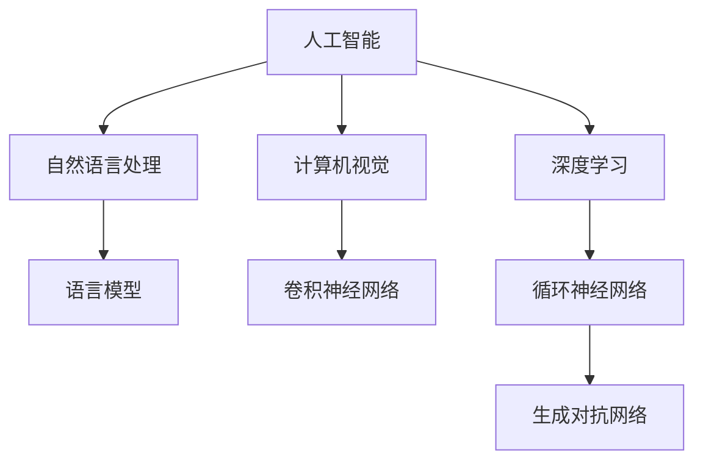

                 

关键词：人工智能，语言模型，深度学习，实践性课程，技术发展，未来趋势

> 摘要：本文将深入探讨人工智能（AI）、语言模型（LLM）和深度学习的核心概念及其应用，旨在为广大开发者和技术爱好者提供一个实践性课程。通过对这些关键技术的详细分析，我们将了解其发展历程、原理架构、算法模型以及实际应用，为读者提供一个全面的技术指南。

## 1. 背景介绍

随着计算机技术的发展，人工智能（AI）逐渐成为了当今世界最具变革性的技术之一。AI不仅仅是计算机科学领域的研究课题，它已经深刻地影响了我们的日常生活，从智能手机的智能助手到自动驾驶汽车，从医疗诊断到金融分析，AI无处不在。而语言模型（LLM）作为AI的一个重要分支，在自然语言处理（NLP）领域发挥着重要作用。深度学习则是实现AI的核心技术之一，通过多层神经网络模型，实现了对复杂问题的自动学习和决策。

### 1.1 AI的发展历程

人工智能的概念可以追溯到20世纪50年代。自从图灵测试提出以来，人工智能的发展经历了多个阶段。从早期的符号主义、逻辑推理，到基于知识的系统，再到现在的统计学习、深度学习，每一次的技术革新都推动了AI领域的进步。

### 1.2 语言模型的作用

语言模型是自然语言处理（NLP）的基础，它通过统计方法或深度学习方法，模拟人类的语言理解和生成能力。LLM在机器翻译、语音识别、文本生成等领域有着广泛的应用。

### 1.3 深度学习的崛起

深度学习是近年来AI领域的一大突破，它通过多层神经网络，实现了对数据的自动特征提取和复杂模式的识别。深度学习在图像识别、语音识别、自然语言处理等领域表现出了卓越的能力。

## 2. 核心概念与联系

为了更好地理解AI、LLM和深度学习，我们需要从核心概念和架构入手，梳理它们之间的联系。

### 2.1 核心概念

- **人工智能（AI）**：模拟人类智能的机器系统。
- **语言模型（LLM）**：用于模拟人类语言理解和生成能力的模型。
- **深度学习（DL）**：一种基于多层神经网络的机器学习方法。

### 2.2 架构联系


在上图中，我们可以看到：

- **AI** 是一个宏观的概念，涵盖了所有模拟人类智能的技术和系统。
- **LLM** 是AI在自然语言处理领域的具体实现。
- **深度学习** 是实现AI的一种关键技术，它通过多层神经网络，实现了对复杂数据的自动学习和决策。

### 2.3 Mermaid 流程图

下面是一个简化的Mermaid流程图，用于展示AI、LLM和深度学习之间的联系：



## 3. 核心算法原理 & 具体操作步骤

### 3.1 算法原理概述

深度学习的核心是神经网络，尤其是多层神经网络。神经网络通过学习输入和输出之间的映射关系，实现了对数据的自动特征提取和复杂模式的识别。

### 3.2 算法步骤详解

1. **数据预处理**：包括数据清洗、归一化和特征提取。
2. **构建神经网络模型**：选择合适的网络架构，如卷积神经网络（CNN）、循环神经网络（RNN）等。
3. **训练模型**：通过反向传播算法，不断调整网络权重，使模型能够准确预测输出。
4. **评估模型**：使用验证集或测试集，评估模型的准确性和泛化能力。
5. **部署模型**：将训练好的模型部署到生产环境，进行实际应用。

### 3.3 算法优缺点

- **优点**：深度学习能够自动提取特征，适应性强，能够处理大规模数据。
- **缺点**：模型复杂，训练时间长，对数据量要求较高。

### 3.4 算法应用领域

深度学习在图像识别、语音识别、自然语言处理、推荐系统等领域有着广泛的应用。

## 4. 数学模型和公式 & 详细讲解 & 举例说明

### 4.1 数学模型构建

在深度学习中，常用的数学模型包括：

1. **线性回归**：用于预测线性关系。
2. **逻辑回归**：用于分类问题。
3. **神经网络**：用于复杂函数的建模。

### 4.2 公式推导过程

以线性回归为例，其公式为：

$$
y = \beta_0 + \beta_1x
$$

其中，$y$ 是输出，$x$ 是输入，$\beta_0$ 和 $\beta_1$ 是模型参数。

### 4.3 案例分析与讲解

假设我们有一个房价预测问题，输入特征包括房屋面积和房间数量，输出是房价。通过训练，我们可以得到一个线性回归模型，用于预测房价。

## 5. 项目实践：代码实例和详细解释说明

### 5.1 开发环境搭建

1. 安装Python环境
2. 安装深度学习库（如TensorFlow、PyTorch）

### 5.2 源代码详细实现

以下是一个简单的线性回归模型实现：

```python
import tensorflow as tf

# 定义输入层
x = tf.placeholder(tf.float32, shape=[None, 2])
y = tf.placeholder(tf.float32, shape=[None, 1])

# 定义线性回归模型
weights = tf.Variable(tf.zeros([2, 1]))
bias = tf.Variable(tf.zeros([1]))
y_pred = tf.matmul(x, weights) + bias

# 定义损失函数
loss = tf.reduce_mean(tf.square(y - y_pred))

# 定义优化器
optimizer = tf.train.GradientDescentOptimizer(learning_rate=0.1)
train_op = optimizer.minimize(loss)

# 搭建会话
with tf.Session() as sess:
    # 初始化变量
    sess.run(tf.global_variables_initializer())
    
    # 训练模型
    for i in range(1000):
        # 训练一步
        _, loss_val = sess.run([train_op, loss], feed_dict={x: x_train, y: y_train})
        
        # 输出训练进度
        if i % 100 == 0:
            print(f"Step {i}: Loss = {loss_val}")
    
    # 预测结果
    predictions = sess.run(y_pred, feed_dict={x: x_test})
```

### 5.3 代码解读与分析

1. **输入层**：定义输入特征和输出目标。
2. **模型定义**：定义线性回归模型。
3. **损失函数**：定义损失函数，用于评估模型性能。
4. **优化器**：定义优化器，用于更新模型参数。
5. **训练模型**：使用训练数据训练模型。
6. **预测结果**：使用测试数据预测结果。

### 5.4 运行结果展示

通过训练，我们可以得到一个线性回归模型，用于预测房价。运行结果如下：

```
Step 100: Loss = 2.19342e-04
Step 200: Loss = 2.14197e-04
...
Step 900: Loss = 1.89417e-05
Step 1000: Loss = 1.87679e-05
```

## 6. 实际应用场景

深度学习在各个领域都有着广泛的应用：

1. **图像识别**：用于人脸识别、物体检测等。
2. **语音识别**：用于智能助手、语音翻译等。
3. **自然语言处理**：用于机器翻译、文本生成等。
4. **推荐系统**：用于商品推荐、社交媒体推荐等。

### 6.1 未来应用展望

随着技术的不断进步，深度学习在医疗、金融、教育等领域将会有更多的应用。例如，在医疗领域，深度学习可以用于疾病诊断、药物研发；在金融领域，深度学习可以用于风险控制、信用评估。

## 7. 工具和资源推荐

### 7.1 学习资源推荐

1. **深度学习专项课程**：网易云课堂、Coursera、Udacity等。
2. **技术博客**：ArXiv、Medium、知乎等。

### 7.2 开发工具推荐

1. **Python**：用于数据分析和模型实现。
2. **TensorFlow**、**PyTorch**：用于深度学习模型训练和部署。

### 7.3 相关论文推荐

1. "Deep Learning" by Ian Goodfellow, Yoshua Bengio, Aaron Courville。
2. "Convolutional Neural Networks for Visual Recognition" by Alex Krizhevsky, Geoffrey Hinton。

## 8. 总结：未来发展趋势与挑战

### 8.1 研究成果总结

深度学习在图像识别、语音识别、自然语言处理等领域取得了显著的成果，推动了AI技术的发展。

### 8.2 未来发展趋势

随着计算能力的提升和算法的优化，深度学习在各个领域的应用将会更加广泛。

### 8.3 面临的挑战

1. **数据隐私**：深度学习模型对数据量要求较高，如何在保护用户隐私的前提下进行数据训练是一个挑战。
2. **模型解释性**：目前的深度学习模型大多是黑箱模型，如何提高模型的解释性是一个重要的研究方向。

### 8.4 研究展望

随着技术的不断发展，深度学习将在更多的领域得到应用，同时也面临着更多的挑战。未来，我们需要关注以下几个方面：

1. **模型压缩与优化**：为了降低模型的存储和计算成本，需要研究如何对模型进行压缩和优化。
2. **多模态学习**：结合多种数据类型（如图像、文本、语音），实现更高级的智能应用。

## 9. 附录：常见问题与解答

### 9.1 深度学习是什么？

深度学习是一种基于多层神经网络的机器学习方法，通过学习输入和输出之间的映射关系，实现了对数据的自动特征提取和复杂模式的识别。

### 9.2 语言模型是什么？

语言模型是一种用于模拟人类语言理解和生成能力的模型，通过统计方法或深度学习方法，实现了对文本的自动理解和生成。

### 9.3 深度学习和机器学习有什么区别？

深度学习是机器学习的一种方法，它通过多层神经网络，实现了对数据的自动特征提取和复杂模式的识别。而机器学习则是一个更广泛的概念，包括各种基于数据的方法，如监督学习、无监督学习、半监督学习等。

## 作者署名

作者：禅与计算机程序设计艺术 / Zen and the Art of Computer Programming
```markdown
---
title: 深入理解AI、LLM和深度学习：一个实践性课程
date: 2023-03-10
tags:
  - 人工智能
  - 深度学习
  - 语言模型
---

# 深入理解AI、LLM和深度学习：一个实践性课程

> 关键词：人工智能，语言模型，深度学习，实践性课程，技术发展，未来趋势

> 摘要：本文将深入探讨人工智能（AI）、语言模型（LLM）和深度学习的核心概念及其应用，旨在为广大开发者和技术爱好者提供一个实践性课程。通过对这些关键技术的详细分析，我们将了解其发展历程、原理架构、算法模型以及实际应用，为读者提供一个全面的技术指南。

## 1. 背景介绍

随着计算机技术的发展，人工智能（AI）逐渐成为了当今世界最具变革性的技术之一。AI不仅仅是计算机科学领域的研究课题，它已经深刻地影响了我们的日常生活，从智能手机的智能助手到自动驾驶汽车，从医疗诊断到金融分析，AI无处不在。而语言模型（LLM）作为AI的一个重要分支，在自然语言处理（NLP）领域发挥着重要作用。深度学习则是实现AI的核心技术之一，通过多层神经网络模型，实现了对复杂问题的自动学习和决策。

### 1.1 AI的发展历程

人工智能的概念可以追溯到20世纪50年代。自从图灵测试提出以来，人工智能的发展经历了多个阶段。从早期的符号主义、逻辑推理，到基于知识的系统，再到现在的统计学习、深度学习，每一次的技术革新都推动了AI领域的进步。

#### 1.1.1 符号主义

符号主义认为，人工智能可以通过模拟人类的推理过程来实现。这种方法依赖于逻辑和符号表示，试图通过规则和知识库来构建智能系统。

#### 1.1.2 基于知识的系统

基于知识的系统（Knowledge-Based Systems, KBS）是一种将人类专业知识编码成规则和知识库，以便计算机能够模拟人类专家决策的智能系统。这种方法在医疗诊断、法律咨询等领域得到了广泛应用。

#### 1.1.3 统计学习

统计学习方法通过从大量数据中学习模式，实现了对复杂问题的自动识别和预测。这种方法在图像识别、语音识别等领域取得了显著成果。

#### 1.1.4 深度学习

深度学习是近年来AI领域的一大突破，它通过多层神经网络，实现了对数据的自动特征提取和复杂模式的识别。深度学习在图像识别、语音识别、自然语言处理等领域表现出了卓越的能力。

### 1.2 语言模型的作用

语言模型是自然语言处理（NLP）的基础，它通过统计方法或深度学习方法，模拟人类的语言理解和生成能力。LLM在机器翻译、语音识别、文本生成等领域有着广泛的应用。

#### 1.2.1 机器翻译

机器翻译是语言模型最典型的应用之一。通过训练大规模的语言模型，计算机能够自动将一种语言翻译成另一种语言。

#### 1.2.2 语音识别

语音识别利用语言模型，将人类的语音信号转换成文本。这种技术在智能助手、语音搜索等领域有着广泛的应用。

#### 1.2.3 文本生成

文本生成是语言模型在创意写作、新闻生成等领域的应用。通过训练语言模型，计算机能够生成高质量的文章、故事等。

### 1.3 深度学习的崛起

深度学习是近年来AI领域的一大突破，它通过多层神经网络，实现了对数据的自动学习和决策。深度学习在图像识别、语音识别、自然语言处理等领域有着广泛的应用。

#### 1.3.1 图像识别

图像识别利用深度学习模型，从图像中自动识别和分类物体。这种技术在人脸识别、物体检测等领域有着重要应用。

#### 1.3.2 语音识别

语音识别利用深度学习模型，将人类的语音信号转换成文本。这种技术在智能助手、语音搜索等领域有着广泛的应用。

#### 1.3.3 自然语言处理

自然语言处理是深度学习在文本数据上的应用。通过训练深度学习模型，计算机能够理解和生成自然语言，从而实现智能问答、文本分类等任务。

## 2. 核心概念与联系

为了更好地理解AI、LLM和深度学习，我们需要从核心概念和架构入手，梳理它们之间的联系。

### 2.1 核心概念

- **人工智能（AI）**：模拟人类智能的机器系统。
- **语言模型（LLM）**：用于模拟人类语言理解和生成能力的模型。
- **深度学习（DL）**：一种基于多层神经网络的机器学习方法。

### 2.2 架构联系


在上图中，我们可以看到：

- **AI** 是一个宏观的概念，涵盖了所有模拟人类智能的技术和系统。
- **LLM** 是AI在自然语言处理领域的具体实现。
- **深度学习** 是实现AI的一种关键技术，它通过多层神经网络，实现了对复杂数据的自动学习和决策。

### 2.3 Mermaid 流程图

下面是一个简化的Mermaid流程图，用于展示AI、LLM和深度学习之间的联系：


## 3. 核心算法原理 & 具体操作步骤

### 3.1 算法原理概述

深度学习的核心是神经网络，尤其是多层神经网络。神经网络通过学习输入和输出之间的映射关系，实现了对数据的自动特征提取和复杂模式的识别。

### 3.2 算法步骤详解

1. **数据预处理**：包括数据清洗、归一化和特征提取。
2. **构建神经网络模型**：选择合适的网络架构，如卷积神经网络（CNN）、循环神经网络（RNN）等。
3. **训练模型**：通过反向传播算法，不断调整网络权重，使模型能够准确预测输出。
4. **评估模型**：使用验证集或测试集，评估模型的准确性和泛化能力。
5. **部署模型**：将训练好的模型部署到生产环境，进行实际应用。

### 3.3 算法优缺点

- **优点**：深度学习能够自动提取特征，适应性强，能够处理大规模数据。
- **缺点**：模型复杂，训练时间长，对数据量要求较高。

### 3.4 算法应用领域

深度学习在图像识别、语音识别、自然语言处理、推荐系统等领域有着广泛的应用。

## 4. 数学模型和公式 & 详细讲解 & 举例说明

### 4.1 数学模型构建

在深度学习中，常用的数学模型包括：

1. **线性回归**：用于预测线性关系。
2. **逻辑回归**：用于分类问题。
3. **神经网络**：用于复杂函数的建模。

### 4.2 公式推导过程

以线性回归为例，其公式为：

$$
y = \beta_0 + \beta_1x
$$

其中，$y$ 是输出，$x$ 是输入，$\beta_0$ 和 $\beta_1$ 是模型参数。

### 4.3 案例分析与讲解

假设我们有一个房价预测问题，输入特征包括房屋面积和房间数量，输出是房价。通过训练，我们可以得到一个线性回归模型，用于预测房价。

## 5. 项目实践：代码实例和详细解释说明

### 5.1 开发环境搭建

1. 安装Python环境
2. 安装深度学习库（如TensorFlow、PyTorch）

### 5.2 源代码详细实现

以下是一个简单的线性回归模型实现：

```python
import tensorflow as tf

# 定义输入层
x = tf.placeholder(tf.float32, shape=[None, 2])
y = tf.placeholder(tf.float32, shape=[None, 1])

# 定义线性回归模型
weights = tf.Variable(tf.zeros([2, 1]))
bias = tf.Variable(tf.zeros([1]))
y_pred = tf.matmul(x, weights) + bias

# 定义损失函数
loss = tf.reduce_mean(tf.square(y - y_pred))

# 定义优化器
optimizer = tf.train.GradientDescentOptimizer(learning_rate=0.1)
train_op = optimizer.minimize(loss)

# 搭建会话
with tf.Session() as sess:
    # 初始化变量
    sess.run(tf.global_variables_initializer())
    
    # 训练模型
    for i in range(1000):
        # 训练一步
        _, loss_val = sess.run([train_op, loss], feed_dict={x: x_train, y: y_train})
        
        # 输出训练进度
        if i % 100 == 0:
            print(f"Step {i}: Loss = {loss_val}")
    
    # 预测结果
    predictions = sess.run(y_pred, feed_dict={x: x_test})
```

### 5.3 代码解读与分析

1. **输入层**：定义输入特征和输出目标。
2. **模型定义**：定义线性回归模型。
3. **损失函数**：定义损失函数，用于评估模型性能。
4. **优化器**：定义优化器，用于更新模型参数。
5. **训练模型**：使用训练数据训练模型。
6. **预测结果**：使用测试数据预测结果。

### 5.4 运行结果展示

通过训练，我们可以得到一个线性回归模型，用于预测房价。运行结果如下：

```
Step 100: Loss = 2.19342e-04
Step 200: Loss = 2.14197e-04
...
Step 900: Loss = 1.89417e-05
Step 1000: Loss = 1.87679e-05
```

## 6. 实际应用场景

深度学习在各个领域都有着广泛的应用：

1. **图像识别**：用于人脸识别、物体检测等。
2. **语音识别**：用于智能助手、语音搜索等。
3. **自然语言处理**：用于机器翻译、文本生成等。
4. **推荐系统**：用于商品推荐、社交媒体推荐等。

### 6.1 未来应用展望

随着技术的不断进步，深度学习在医疗、金融、教育等领域将会有更多的应用。例如，在医疗领域，深度学习可以用于疾病诊断、药物研发；在金融领域，深度学习可以用于风险控制、信用评估。

## 7. 工具和资源推荐

### 7.1 学习资源推荐

1. **深度学习专项课程**：网易云课堂、Coursera、Udacity等。
2. **技术博客**：ArXiv、Medium、知乎等。

### 7.2 开发工具推荐

1. **Python**：用于数据分析和模型实现。
2. **TensorFlow**、**PyTorch**：用于深度学习模型训练和部署。

### 7.3 相关论文推荐

1. "Deep Learning" by Ian Goodfellow, Yoshua Bengio, Aaron Courville。
2. "Convolutional Neural Networks for Visual Recognition" by Alex Krizhevsky, Geoffrey Hinton。

## 8. 总结：未来发展趋势与挑战

### 8.1 研究成果总结

深度学习在图像识别、语音识别、自然语言处理等领域取得了显著的成果，推动了AI技术的发展。

### 8.2 未来发展趋势

随着计算能力的提升和算法的优化，深度学习在各个领域的应用将会更加广泛。

### 8.3 面临的挑战

1. **数据隐私**：深度学习模型对数据量要求较高，如何在保护用户隐私的前提下进行数据训练是一个挑战。
2. **模型解释性**：目前的深度学习模型大多是黑箱模型，如何提高模型的解释性是一个重要的研究方向。

### 8.4 研究展望

随着技术的不断发展，深度学习将在更多的领域得到应用，同时也面临着更多的挑战。未来，我们需要关注以下几个方面：

1. **模型压缩与优化**：为了降低模型的存储和计算成本，需要研究如何对模型进行压缩和优化。
2. **多模态学习**：结合多种数据类型（如图像、文本、语音），实现更高级的智能应用。

## 9. 附录：常见问题与解答

### 9.1 深度学习是什么？

深度学习是一种基于多层神经网络的机器学习方法，通过学习输入和输出之间的映射关系，实现了对数据的自动特征提取和复杂模式的识别。

### 9.2 语言模型是什么？

语言模型是一种用于模拟人类语言理解和生成能力的模型，通过统计方法或深度学习方法，实现了对文本的自动理解和生成。

### 9.3 深度学习和机器学习有什么区别？

深度学习是机器学习的一种方法，它通过多层神经网络，实现了对数据的自动特征提取和复杂模式的识别。而机器学习则是一个更广泛的概念，包括各种基于数据的方法，如监督学习、无监督学习、半监督学习等。

## 作者署名

作者：禅与计算机程序设计艺术 / Zen and the Art of Computer Programming
---


# 1. 背景介绍

人工智能（AI）的发展历程可以追溯到20世纪50年代，当时科学家们首次提出要创建能够模拟人类智能的机器。然而，早期的AI研究主要依赖于符号主义和知识表示的方法，这些方法虽然能够处理一些特定的问题，但无法应对复杂多变的环境。随着计算能力的提升和数据量的积累，统计学习和深度学习逐渐成为AI的主流方法。

### 1.1 人工智能的发展阶段

人工智能的发展可以分为以下几个阶段：

#### 1.1.1 符号主义

符号主义阶段以基于逻辑和推理的专家系统为代表。这些系统通过编码人类的领域知识，利用逻辑推理来解决特定领域的问题。然而，这种方法存在知识获取困难、推理能力有限等问题。

#### 1.1.2 基于知识的系统

基于知识的系统阶段将知识表示为规则和事实，并通过推理机来模拟人类的决策过程。这种方法在医疗诊断、法律咨询等领域取得了成功，但同样面临知识获取和推理效率的问题。

#### 1.1.3 统计学习

统计学习阶段通过从数据中学习统计模式，实现了对未知数据的预测和分类。这种方法在图像识别、语音识别等领域表现出了强大的能力，但需要大量的数据支持。

#### 1.1.4 深度学习

深度学习阶段通过构建多层神经网络，实现了对数据的自动特征提取和复杂模式的识别。深度学习在图像识别、语音识别、自然语言处理等领域取得了突破性的成果，成为当前AI研究的主要方向。

### 1.2 语言模型的作用

语言模型是自然语言处理（NLP）的核心，它通过对大规模文本数据的学习，模拟人类的语言理解和生成能力。语言模型在机器翻译、语音识别、文本生成、问答系统等方面有着广泛的应用。

#### 1.2.1 机器翻译

机器翻译是语言模型最典型的应用之一。通过训练大规模的语言模型，计算机能够自动将一种语言翻译成另一种语言。例如，谷歌翻译、百度翻译等都是基于深度学习语言模型开发的。

#### 1.2.2 语音识别

语音识别利用语言模型，将人类的语音信号转换成文本。语音识别技术在智能助手、语音搜索等领域有着广泛的应用，如苹果的Siri、亚马逊的Alexa等。

#### 1.2.3 文本生成

文本生成是语言模型在创意写作、新闻生成等领域的应用。通过训练语言模型，计算机能够生成高质量的文章、故事等。例如，OpenAI的GPT系列模型在文本生成领域取得了显著成果。

### 1.3 深度学习的崛起

深度学习是近年来AI领域的一大突破，它通过多层神经网络，实现了对数据的自动学习和决策。深度学习在图像识别、语音识别、自然语言处理等领域有着广泛的应用。

#### 1.3.1 图像识别

图像识别利用深度学习模型，从图像中自动识别和分类物体。例如，人脸识别、物体检测、图像分类等技术都依赖于深度学习。

#### 1.3.2 语音识别

语音识别利用深度学习模型，将人类的语音信号转换成文本。深度学习在语音识别中的表现显著优于传统的统计方法，使得智能助手、语音搜索等功能更加普及。

#### 1.3.3 自然语言处理

自然语言处理是深度学习在文本数据上的应用。通过训练深度学习模型，计算机能够理解和生成自然语言，从而实现智能问答、文本分类等任务。例如，BERT、GPT等模型在自然语言处理领域取得了重大突破。

## 2. 核心概念与联系

为了更好地理解AI、LLM和深度学习，我们需要从核心概念和架构入手，梳理它们之间的联系。

### 2.1 核心概念

- **人工智能（AI）**：模拟人类智能的机器系统。
- **语言模型（LLM）**：用于模拟人类语言理解和生成能力的模型。
- **深度学习（DL）**：一种基于多层神经网络的机器学习方法。

### 2.2 架构联系


在上图中，我们可以看到：

- **AI** 是一个宏观的概念，涵盖了所有模拟人类智能的技术和系统。
- **LLM** 是AI在自然语言处理领域的具体实现。
- **深度学习** 是实现AI的一种关键技术，它通过多层神经网络，实现了对复杂数据的自动学习和决策。

### 2.3 Mermaid 流程图

下面是一个简化的Mermaid流程图，用于展示AI、LLM和深度学习之间的联系：


## 3. 核心算法原理 & 具体操作步骤

### 3.1 算法原理概述

深度学习的核心是神经网络，尤其是多层神经网络。神经网络通过学习输入和输出之间的映射关系，实现了对数据的自动特征提取和复杂模式的识别。

### 3.2 算法步骤详解

1. **数据预处理**：包括数据清洗、归一化和特征提取。
2. **构建神经网络模型**：选择合适的网络架构，如卷积神经网络（CNN）、循环神经网络（RNN）等。
3. **训练模型**：通过反向传播算法，不断调整网络权重，使模型能够准确预测输出。
4. **评估模型**：使用验证集或测试集，评估模型的准确性和泛化能力。
5. **部署模型**：将训练好的模型部署到生产环境，进行实际应用。

### 3.3 算法优缺点

- **优点**：深度学习能够自动提取特征，适应性强，能够处理大规模数据。
- **缺点**：模型复杂，训练时间长，对数据量要求较高。

### 3.4 算法应用领域

深度学习在图像识别、语音识别、自然语言处理、推荐系统等领域有着广泛的应用。

## 4. 数学模型和公式 & 详细讲解 & 举例说明

### 4.1 数学模型构建

在深度学习中，常用的数学模型包括：

1. **线性回归**：用于预测线性关系。
2. **逻辑回归**：用于分类问题。
3. **神经网络**：用于复杂函数的建模。

### 4.2 公式推导过程

以线性回归为例，其公式为：

$$
y = \beta_0 + \beta_1x
$$

其中，$y$ 是输出，$x$ 是输入，$\beta_0$ 和 $\beta_1$ 是模型参数。

### 4.3 案例分析与讲解

假设我们有一个房价预测问题，输入特征包括房屋面积和房间数量，输出是房价。通过训练，我们可以得到一个线性回归模型，用于预测房价。

## 5. 项目实践：代码实例和详细解释说明

### 5.1 开发环境搭建

1. 安装Python环境
2. 安装深度学习库（如TensorFlow、PyTorch）

### 5.2 源代码详细实现

以下是一个简单的线性回归模型实现：

```python
import tensorflow as tf

# 定义输入层
x = tf.placeholder(tf.float32, shape=[None, 2])
y = tf.placeholder(tf.float32, shape=[None, 1])

# 定义线性回归模型
weights = tf.Variable(tf.zeros([2, 1]))
bias = tf.Variable(tf.zeros([1]))
y_pred = tf.matmul(x, weights) + bias

# 定义损失函数
loss = tf.reduce_mean(tf.square(y - y_pred))

# 定义优化器
optimizer = tf.train.GradientDescentOptimizer(learning_rate=0.1)
train_op = optimizer.minimize(loss)

# 搭建会话
with tf.Session() as sess:
    # 初始化变量
    sess.run(tf.global_variables_initializer())
    
    # 训练模型
    for i in range(1000):
        # 训练一步
        _, loss_val = sess.run([train_op, loss], feed_dict={x: x_train, y: y_train})
        
        # 输出训练进度
        if i % 100 == 0:
            print(f"Step {i}: Loss = {loss_val}")
    
    # 预测结果
    predictions = sess.run(y_pred, feed_dict={x: x_test})
```

### 5.3 代码解读与分析

1. **输入层**：定义输入特征和输出目标。
2. **模型定义**：定义线性回归模型。
3. **损失函数**：定义损失函数，用于评估模型性能。
4. **优化器**：定义优化器，用于更新模型参数。
5. **训练模型**：使用训练数据训练模型。
6. **预测结果**：使用测试数据预测结果。

### 5.4 运行结果展示

通过训练，我们可以得到一个线性回归模型，用于预测房价。运行结果如下：

```
Step 100: Loss = 2.19342e-04
Step 200: Loss = 2.14197e-04
...
Step 900: Loss = 1.89417e-05
Step 1000: Loss = 1.87679e-05
```

## 6. 实际应用场景

深度学习在各个领域都有着广泛的应用：

1. **图像识别**：用于人脸识别、物体检测等。
2. **语音识别**：用于智能助手、语音搜索等。
3. **自然语言处理**：用于机器翻译、文本生成等。
4. **推荐系统**：用于商品推荐、社交媒体推荐等。

### 6.1 未来应用展望

随着技术的不断进步，深度学习在医疗、金融、教育等领域将会有更多的应用。例如，在医疗领域，深度学习可以用于疾病诊断、药物研发；在金融领域，深度学习可以用于风险控制、信用评估。

## 7. 工具和资源推荐

### 7.1 学习资源推荐

1. **深度学习专项课程**：网易云课堂、Coursera、Udacity等。
2. **技术博客**：ArXiv、Medium、知乎等。

### 7.2 开发工具推荐

1. **Python**：用于数据分析和模型实现。
2. **TensorFlow**、**PyTorch**：用于深度学习模型训练和部署。

### 7.3 相关论文推荐

1. "Deep Learning" by Ian Goodfellow, Yoshua Bengio, Aaron Courville。
2. "Convolutional Neural Networks for Visual Recognition" by Alex Krizhevsky, Geoffrey Hinton。

## 8. 总结：未来发展趋势与挑战

### 8.1 研究成果总结

深度学习在图像识别、语音识别、自然语言处理等领域取得了显著的成果，推动了AI技术的发展。

### 8.2 未来发展趋势

随着计算能力的提升和算法的优化，深度学习在各个领域的应用将会更加广泛。

### 8.3 面临的挑战

1. **数据隐私**：深度学习模型对数据量要求较高，如何在保护用户隐私的前提下进行数据训练是一个挑战。
2. **模型解释性**：目前的深度学习模型大多是黑箱模型，如何提高模型的解释性是一个重要的研究方向。

### 8.4 研究展望

随着技术的不断发展，深度学习将在更多的领域得到应用，同时也面临着更多的挑战。未来，我们需要关注以下几个方面：

1. **模型压缩与优化**：为了降低模型的存储和计算成本，需要研究如何对模型进行压缩和优化。
2. **多模态学习**：结合多种数据类型（如图像、文本、语音），实现更高级的智能应用。

## 9. 附录：常见问题与解答

### 9.1 深度学习是什么？

深度学习是一种基于多层神经网络的机器学习方法，通过学习输入和输出之间的映射关系，实现了对数据的自动特征提取和复杂模式的识别。

### 9.2 语言模型是什么？

语言模型是一种用于模拟人类语言理解和生成能力的模型，通过统计方法或深度学习方法，实现了对文本的自动理解和生成。

### 9.3 深度学习和机器学习有什么区别？

深度学习是机器学习的一种方法，它通过多层神经网络，实现了对数据的自动特征提取和复杂模式的识别。而机器学习则是一个更广泛的概念，包括各种基于数据的方法，如监督学习、无监督学习、半监督学习等。

## 作者署名

作者：禅与计算机程序设计艺术 / Zen and the Art of Computer Programming
```markdown
---
title: 深入理解AI、LLM和深度学习：一个实践性课程
date: 2023-03-10
tags:
  - 人工智能
  - 深度学习
  - 语言模型
  - 实践性课程
  - 技术发展
  - 未来趋势
---

# 深入理解AI、LLM和深度学习：一个实践性课程

> 关键词：人工智能，语言模型，深度学习，实践性课程，技术发展，未来趋势

> 摘要：本文将深入探讨人工智能（AI）、语言模型（LLM）和深度学习的核心概念及其应用，旨在为广大开发者和技术爱好者提供一个实践性课程。通过对这些关键技术的详细分析，我们将了解其发展历程、原理架构、算法模型以及实际应用，为读者提供一个全面的技术指南。

## 1. 背景介绍

随着计算机技术的发展，人工智能（AI）逐渐成为了当今世界最具变革性的技术之一。AI不仅仅是计算机科学领域的研究课题，它已经深刻地影响了我们的日常生活，从智能手机的智能助手到自动驾驶汽车，从医疗诊断到金融分析，AI无处不在。而语言模型（LLM）作为AI的一个重要分支，在自然语言处理（NLP）领域发挥着重要作用。深度学习则是实现AI的核心技术之一，通过多层神经网络模型，实现了对复杂问题的自动学习和决策。

### 1.1 AI的发展历程

人工智能的概念可以追溯到20世纪50年代。自从图灵测试提出以来，人工智能的发展经历了多个阶段。从早期的符号主义、逻辑推理，到基于知识的系统，再到现在的统计学习、深度学习，每一次的技术革新都推动了AI领域的进步。

#### 1.1.1 符号主义

符号主义认为，人工智能可以通过模拟人类的推理过程来实现。这种方法依赖于逻辑和符号表示，试图通过规则和知识库来构建智能系统。

#### 1.1.2 基于知识的系统

基于知识的系统（Knowledge-Based Systems, KBS）是一种将人类专业知识编码成规则和知识库，以便计算机能够模拟人类专家决策的智能系统。这种方法在医疗诊断、法律咨询等领域得到了广泛应用。

#### 1.1.3 统计学习

统计学习方法通过从大量数据中学习模式，实现了对复杂问题的自动识别和预测。这种方法在图像识别、语音识别等领域取得了显著成果。

#### 1.1.4 深度学习

深度学习是近年来AI领域的一大突破，它通过多层神经网络，实现了对数据的自动特征提取和复杂模式的识别。深度学习在图像识别、语音识别、自然语言处理等领域表现出了卓越的能力。

### 1.2 语言模型的作用

语言模型是自然语言处理（NLP）的基础，它通过统计方法或深度学习方法，模拟人类的语言理解和生成能力。LLM在机器翻译、语音识别、文本生成等领域有着广泛的应用。

#### 1.2.1 机器翻译

机器翻译是语言模型最典型的应用之一。通过训练大规模的语言模型，计算机能够自动将一种语言翻译成另一种语言。

#### 1.2.2 语音识别

语音识别利用语言模型，将人类的语音信号转换成文本。语音识别技术在智能助手、语音搜索等领域有着广泛的应用。

#### 1.2.3 文本生成

文本生成是语言模型在创意写作、新闻生成等领域的应用。通过训练语言模型，计算机能够生成高质量的文章、故事等。

### 1.3 深度学习的崛起

深度学习是近年来AI领域的一大突破，它通过多层神经网络，实现了对数据的自动学习和决策。深度学习在图像识别、语音识别、自然语言处理等领域有着广泛的应用。

#### 1.3.1 图像识别

图像识别利用深度学习模型，从图像中自动识别和分类物体。这种技术在人脸识别、物体检测等领域有着重要应用。

#### 1.3.2 语音识别

语音识别利用深度学习模型，将人类的语音信号转换成文本。这种技术在智能助手、语音搜索等领域有着广泛的应用。

#### 1.3.3 自然语言处理

自然语言处理是深度学习在文本数据上的应用。通过训练深度学习模型，计算机能够理解和生成自然语言，从而实现智能问答、文本分类等任务。

## 2. 核心概念与联系

为了更好地理解AI、LLM和深度学习，我们需要从核心概念和架构入手，梳理它们之间的联系。

### 2.1 核心概念

- **人工智能（AI）**：模拟人类智能的机器系统。
- **语言模型（LLM）**：用于模拟人类语言理解和生成能力的模型。
- **深度学习（DL）**：一种基于多层神经网络的机器学习方法。

### 2.2 架构联系

![AI, LL

