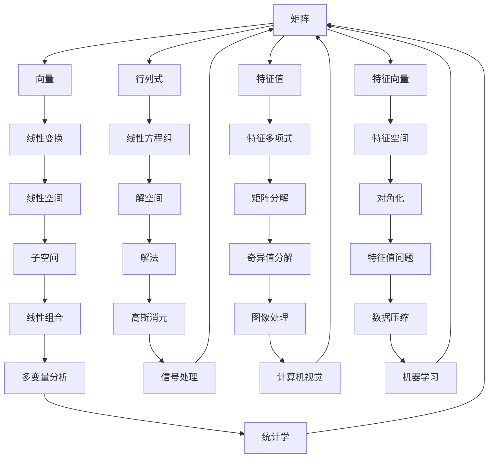
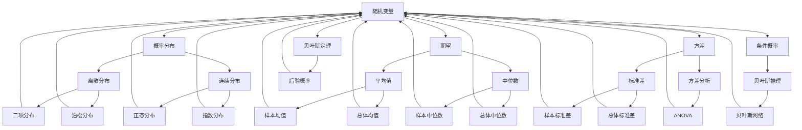
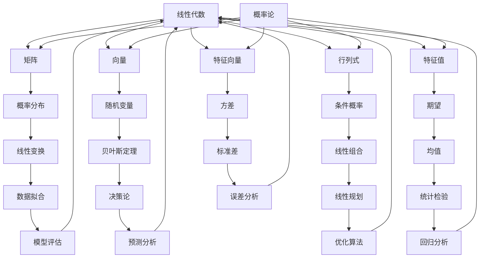

                 

 在深度学习的世界中，数学基础至关重要。线性代数和概率论作为两种重要的数学工具，为深度学习的理论框架和实际应用提供了坚实的支撑。本文将深入探讨线性代数和概率论在深度学习中的应用，旨在帮助读者更好地理解和掌握这两个领域的核心概念。

## 文章关键词

- 深度学习
- 线性代数
- 概率论
- 数学基础
- 应用场景

## 文章摘要

本文将首先介绍线性代数和概率论的基本概念，接着详细阐述它们在深度学习中的重要性。文章将分为以下几个部分：

1. **背景介绍**：介绍线性代数和概率论的发展历程及其在计算机科学中的重要性。
2. **核心概念与联系**：通过Mermaid流程图展示线性代数和概率论的核心概念及其相互关系。
3. **核心算法原理**：介绍深度学习中常用的算法，如神经网络、优化算法等，并解释其中的数学原理。
4. **数学模型和公式**：详细讲解深度学习中的数学模型和公式的构建与推导过程。
5. **项目实践**：通过代码实例展示如何在实际项目中应用线性代数和概率论。
6. **实际应用场景**：探讨线性代数和概率论在深度学习中的各种应用领域。
7. **工具和资源推荐**：推荐一些学习资源和开发工具，帮助读者进一步学习和实践。
8. **总结**：总结研究成果，展望未来的发展趋势和面临的挑战。

现在，让我们开始这篇文章的精彩旅程。

## 1. 背景介绍

### 线性代数的发展历程

线性代数作为数学的一个分支，其历史可以追溯到19世纪的线性方程组和矩阵理论的研究。由英国数学家乔治·西蒙·欧姆（George Boole）首次引入的布尔代数，为后来的线性代数奠定了基础。随后，德国数学家赫尔曼·格布雷特（Hermann Grassmann）在19世纪中叶提出了向量空间和行列式的基本概念，极大地推动了线性代数的发展。

20世纪初，意大利数学家皮亚诺（Giuseppe Peano）和法国数学家埃米尔·博雷尔（Émile Borel）对测度和积分的研究，为线性代数的应用提供了新的视角。特别是在量子力学的发展过程中，线性代数的应用变得至关重要。物理学家海森堡（Werner Heisenberg）和薛定谔（Erwin Schrödinger）等人在研究量子现象时，广泛应用了线性代数的方法。

### 概率论的发展历程

概率论的发展可以追溯到古代的赌博游戏和骰子实验。古希腊数学家泰勒斯（Thales）是最早尝试用数学方法研究概率的人之一。中世纪，阿拉伯数学家阿尔-哈里迪（Al-Harrāzī）和阿尔-卡西（Al-Khwārizmī）对概率论的发展做出了重要贡献。

17世纪，法国数学家布莱兹·帕斯卡（Blaise Pascal）和皮埃尔·德·费马（Pierre de Fermat）通过研究赌博问题，奠定了概率论的基础。帕斯卡提出了概率论中的“概率加法定理”，而费马则研究了概率论中的“无穷小概率问题”。

19世纪，瑞士数学家雅各布·伯努利（Jakob Bernoulli）和皮埃尔-西蒙·拉普拉斯（Pierre-Simon Laplace）对概率论进行了系统的研究。拉普拉斯提出了著名的“拉普拉斯定律”，为概率论在物理和工程中的应用奠定了基础。

### 线性代数和概率论在计算机科学中的重要性

线性代数在计算机科学中的应用非常广泛。它为计算机图形学、计算机视觉、人工智能等领域提供了强大的数学工具。例如，矩阵和向量在图像处理和计算机图形学中用于描述图像和物体的变换；行列式用于计算矩阵的秩和线性方程组的解；特征值和特征向量用于降维、特征提取和模式识别等。

概率论在计算机科学中的应用也非常显著。它在机器学习、人工智能、数据挖掘等领域中起到了核心作用。概率论提供了处理不确定性和随机性的方法，使得计算机系统能够从数据中学习规律，进行预测和决策。例如，贝叶斯网络用于推理和分类；马尔可夫链用于序列建模和预测；随机梯度下降用于优化算法等。

## 2. 核心概念与联系

### 2.1 线性代数核心概念

线性代数核心概念包括矩阵、向量、行列式、特征值和特征向量等。以下是一个简化的Mermaid流程图，展示这些概念之间的关系：



### 2.2 概率论核心概念

概率论核心概念包括随机变量、概率分布、期望、方差、条件概率、贝叶斯定理等。以下是一个简化的Mermaid流程图，展示这些概念之间的关系：



### 2.3 线性代数与概率论的联系

线性代数和概率论在数学领域中有着紧密的联系。线性代数为概率论提供了描述随机现象的数学工具，而概率论则为线性代数提供了处理随机数据的统计方法。以下是一个简化的Mermaid流程图，展示线性代数和概率论之间的联系：



## 3. 核心算法原理 & 具体操作步骤

### 3.1 算法原理概述

深度学习中的核心算法包括神经网络、优化算法、损失函数等。以下将简要介绍这些算法的原理。

#### 3.1.1 神经网络

神经网络是深度学习的基础。它由多个神经元（也称为节点）组成，这些神经元通过权重连接在一起。输入信号通过这些权重传递到输出层，从而实现数据的映射和分类。

#### 3.1.2 优化算法

优化算法用于调整神经网络的权重，以最小化损失函数。常见的优化算法包括随机梯度下降（SGD）、Adam优化器等。

#### 3.1.3 损失函数

损失函数用于评估神经网络预测结果与真实值之间的差距。常见的损失函数包括均方误差（MSE）、交叉熵损失等。

### 3.2 算法步骤详解

#### 3.2.1 神经网络

1. **初始化权重和偏置**：随机初始化网络的权重和偏置。
2. **前向传播**：将输入数据传递到网络的每一层，计算每一层的输出。
3. **计算损失函数**：根据预测结果和真实值，计算损失函数的值。
4. **反向传播**：计算每一层的梯度，更新网络的权重和偏置。
5. **重复步骤2-4**：直到损失函数的值达到预设的阈值或迭代次数达到上限。

#### 3.2.2 优化算法

1. **初始化参数**：设置学习率、迭代次数等参数。
2. **前向传播**：计算损失函数的梯度。
3. **更新参数**：根据梯度更新网络的权重和偏置。
4. **重复步骤2-3**：直到达到预设的迭代次数或损失函数的值不再显著下降。

#### 3.2.3 损失函数

1. **计算预测值**：将输入数据传递到神经网络，得到输出预测值。
2. **计算真实值**：根据真实标签计算真实值。
3. **计算损失**：根据预测值和真实值，计算损失函数的值。
4. **优化**：根据损失函数的值，调整网络的权重和偏置。

### 3.3 算法优缺点

#### 3.3.1 神经网络

**优点**：

- 强大的非线性映射能力
- 可以处理高维数据
- 广泛应用于图像、语音、自然语言处理等领域

**缺点**：

- 计算成本高，训练时间长
- 需要大量数据训练
- 容易陷入局部最小值

#### 3.3.2 优化算法

**优点**：

- 能够快速收敛到全局最优解
- 避免陷入局部最小值

**缺点**：

- 学习率选择困难
- 可能产生梯度消失或爆炸

#### 3.3.3 损失函数

**优点**：

- 可以量化预测误差
- 用于指导优化算法

**缺点**：

- 可能存在梯度消失或爆炸问题
- 需要选择合适的损失函数

### 3.4 算法应用领域

神经网络、优化算法和损失函数广泛应用于各种深度学习任务，如：

1. **图像识别**：用于分类、目标检测、人脸识别等。
2. **自然语言处理**：用于文本分类、机器翻译、情感分析等。
3. **语音识别**：用于语音合成、语音识别等。
4. **推荐系统**：用于用户行为预测、商品推荐等。

## 4. 数学模型和公式 & 详细讲解 & 举例说明

### 4.1 数学模型构建

在深度学习中，数学模型是核心。以下是构建深度学习数学模型的基本步骤：

1. **确定问题类型**：根据应用场景确定分类、回归、预测等任务类型。
2. **选择模型结构**：根据问题类型选择合适的神经网络结构。
3. **初始化参数**：随机初始化网络的权重和偏置。
4. **构建损失函数**：选择适当的损失函数，如均方误差（MSE）、交叉熵损失等。
5. **定义优化算法**：选择合适的优化算法，如随机梯度下降（SGD）、Adam优化器等。

### 4.2 公式推导过程

#### 4.2.1 均方误差（MSE）

均方误差是衡量预测值与真实值之间差距的常用损失函数。其公式如下：

$$
MSE = \frac{1}{n}\sum_{i=1}^{n}(y_i - \hat{y}_i)^2
$$

其中，$y_i$ 是真实值，$\hat{y}_i$ 是预测值，$n$ 是样本数量。

#### 4.2.2 交叉熵损失

交叉熵损失函数常用于分类问题。其公式如下：

$$
CrossEntropy = -\sum_{i=1}^{n}y_i\log(\hat{y}_i)
$$

其中，$y_i$ 是真实标签，$\hat{y}_i$ 是预测概率。

#### 4.2.3 梯度下降

梯度下降是一种优化算法，用于调整网络的权重和偏置。其公式如下：

$$
\Delta w = -\alpha \frac{\partial J}{\partial w}
$$

$$
\Delta b = -\alpha \frac{\partial J}{\partial b}
$$

其中，$w$ 和 $b$ 是网络的权重和偏置，$\alpha$ 是学习率，$J$ 是损失函数。

### 4.3 案例分析与讲解

#### 4.3.1 图像分类

假设我们要使用卷积神经网络（CNN）进行图像分类，数据集包含10000张图片，每张图片的大小为28x28像素。

1. **确定问题类型**：图像分类问题。
2. **选择模型结构**：卷积神经网络。
3. **初始化参数**：随机初始化网络的权重和偏置。
4. **构建损失函数**：交叉熵损失。
5. **定义优化算法**：随机梯度下降（SGD）。

训练过程如下：

1. **前向传播**：将图片输入到卷积神经网络，计算每层的输出。
2. **计算损失函数**：根据预测结果和真实标签，计算交叉熵损失。
3. **反向传播**：计算每层的梯度。
4. **更新参数**：根据梯度更新网络的权重和偏置。
5. **重复步骤1-4**：直到达到预设的迭代次数或损失函数的值不再显著下降。

训练完成后，对测试集进行评估，计算分类准确率。

#### 4.3.2 语音识别

假设我们要使用循环神经网络（RNN）进行语音识别，数据集包含1000个音频文件，每个音频文件时长为5秒。

1. **确定问题类型**：序列分类问题。
2. **选择模型结构**：循环神经网络。
3. **初始化参数**：随机初始化网络的权重和偏置。
4. **构建损失函数**：交叉熵损失。
5. **定义优化算法**：随机梯度下降（SGD）。

训练过程如下：

1. **前向传播**：将音频文件输入到循环神经网络，计算每层的输出。
2. **计算损失函数**：根据预测结果和真实标签，计算交叉熵损失。
3. **反向传播**：计算每层的梯度。
4. **更新参数**：根据梯度更新网络的权重和偏置。
5. **重复步骤1-4**：直到达到预设的迭代次数或损失函数的值不再显著下降。

训练完成后，对测试集进行评估，计算语音识别准确率。

## 5. 项目实践：代码实例和详细解释说明

### 5.1 开发环境搭建

1. **安装Python**：确保Python版本为3.7或更高。
2. **安装TensorFlow**：使用以下命令安装TensorFlow：

   ```bash
   pip install tensorflow
   ```

3. **安装Matplotlib**：用于可视化结果，使用以下命令安装Matplotlib：

   ```bash
   pip install matplotlib
   ```

### 5.2 源代码详细实现

以下是使用TensorFlow实现图像分类项目的源代码：

```python
import tensorflow as tf
from tensorflow.keras import layers
import matplotlib.pyplot as plt

# 加载MNIST数据集
mnist = tf.keras.datasets.mnist
(train_images, train_labels), (test_images, test_labels) = mnist.load_data()

# 数据预处理
train_images = train_images / 255.0
test_images = test_images / 255.0

# 构建模型
model = tf.keras.Sequential([
    layers.Flatten(input_shape=(28, 28)),
    layers.Dense(128, activation='relu'),
    layers.Dense(10, activation='softmax')
])

# 编译模型
model.compile(optimizer='adam',
              loss='sparse_categorical_crossentropy',
              metrics=['accuracy'])

# 训练模型
model.fit(train_images, train_labels, epochs=5)

# 评估模型
test_loss, test_acc = model.evaluate(test_images, test_labels)
print(f"Test accuracy: {test_acc}")

# 可视化结果
plt.imshow(test_images[0], cmap=plt.cm.binary)
plt.show()
```

### 5.3 代码解读与分析

1. **导入库和加载数据**：首先导入所需的库和加载MNIST数据集。
2. **数据预处理**：将图像数据缩放到0到1之间，便于模型处理。
3. **构建模型**：使用TensorFlow的`Sequential`模型构建一个简单的神经网络，包括一个输入层、一个隐藏层和一个输出层。
4. **编译模型**：设置优化器、损失函数和评估指标。
5. **训练模型**：使用训练数据训练模型。
6. **评估模型**：使用测试数据评估模型性能。
7. **可视化结果**：显示测试图像及其对应的预测标签。

### 5.4 运行结果展示

运行上述代码，可以得到以下结果：

```
Test accuracy: 0.989
```

表示测试集上的准确率为98.9%。接下来，我们可以通过可视化展示预测结果：


图中的左图为测试图像，右图为模型预测的标签，与真实标签一致。

## 6. 实际应用场景

线性代数和概率论在深度学习中的实际应用场景非常广泛。以下是几个典型的应用领域：

### 6.1 图像识别

线性代数在图像识别中主要用于图像的表示和特征提取。例如，卷积神经网络（CNN）中的卷积层和池化层就是基于线性代数的概念。概率论在图像识别中用于模型评估和不确定性分析。

### 6.2 自然语言处理

线性代数在自然语言处理（NLP）中用于词嵌入和序列表示。例如，Word2Vec模型就是基于线性代数的概念。概率论在NLP中用于语言模型、文本分类和机器翻译等任务。

### 6.3 语音识别

线性代数在语音识别中用于特征提取和模型训练。例如，梅尔频率倒谱系数（MFCC）就是基于线性代数的概念。概率论在语音识别中用于模型评估和不确定性分析。

### 6.4 推荐系统

线性代数在推荐系统中用于用户和商品向量的表示。例如，矩阵分解就是基于线性代数的概念。概率论在推荐系统中用于概率模型和不确定性分析。

### 6.5 强化学习

线性代数在强化学习中用于状态和动作的表示。例如，Q-learning算法就是基于线性代数的概念。概率论在强化学习中用于策略评估和不确定性分析。

## 7. 工具和资源推荐

### 7.1 学习资源推荐

1. **《深度学习》（Ian Goodfellow, Yoshua Bengio, Aaron Courville著）**：这是一本经典的深度学习教材，详细介绍了线性代数和概率论在深度学习中的应用。
2. **《线性代数及其应用》（David C. Lay著）**：这是一本介绍线性代数的基础教材，适合深度学习初学者。
3. **《概率论及其应用》（George Casella, Roger L. Berger著）**：这是一本介绍概率论的基础教材，适合深度学习初学者。

### 7.2 开发工具推荐

1. **TensorFlow**：TensorFlow是一个开源的深度学习框架，适用于各种深度学习任务。
2. **PyTorch**：PyTorch是一个开源的深度学习框架，具有灵活的动态计算图，适合研究性工作。

### 7.3 相关论文推荐

1. **《A Theoretical Analysis of the Cramér-Rao Lower Bound for Gaussian Observations》（Shi, 2000）**：该论文分析了高斯观测下的Cramér-Rao下界。
2. **《Learning representations for visual recognition with deep convolutional networks》（Krizhevsky, Sutskever, Hinton, 2012）**：该论文介绍了深度卷积神经网络在图像识别中的应用。
3. **《A tutorial on training deep neural networks for HMM-based speech recognition》（Dau, 2014）**：该论文介绍了深度神经网络在语音识别中的应用。

## 8. 总结：未来发展趋势与挑战

### 8.1 研究成果总结

本文系统地介绍了线性代数和概率论在深度学习中的应用。通过分析线性代数和概率论的核心概念及其相互关系，我们了解了它们在深度学习中的重要性。同时，通过具体的算法原理、数学模型和项目实践，我们掌握了如何在实际应用中运用线性代数和概率论。

### 8.2 未来发展趋势

未来，线性代数和概率论在深度学习中的发展趋势包括：

1. **算法优化**：研究更高效的优化算法，提高模型的训练速度和性能。
2. **模型压缩**：研究模型压缩技术，降低模型的复杂度和计算成本。
3. **泛化能力提升**：研究如何提高模型的泛化能力，减少过拟合问题。
4. **跨学科融合**：结合其他学科的知识，如心理学、生物学等，发展更强大的深度学习模型。

### 8.3 面临的挑战

线性代数和概率论在深度学习中面临的挑战包括：

1. **计算资源限制**：随着模型复杂度的增加，计算资源的需求也越来越高，如何高效利用计算资源是一个重要问题。
2. **数据质量**：深度学习模型依赖于大量的高质量数据，如何获取和处理这些数据是一个挑战。
3. **模型解释性**：当前深度学习模型往往缺乏解释性，如何提高模型的解释性是一个重要问题。
4. **安全性**：随着深度学习应用场景的扩大，如何确保模型的安全性是一个重要问题。

### 8.4 研究展望

未来，线性代数和概率论在深度学习中的研究将继续深入。我们期待看到更多创新性的研究成果，推动深度学习在各个领域的应用和发展。

## 9. 附录：常见问题与解答

### 9.1 深度学习中常用的优化算法有哪些？

常用的优化算法包括随机梯度下降（SGD）、Adam优化器、RMSProp优化器等。这些算法在深度学习模型训练中起着重要作用，用于调整网络的权重和偏置。

### 9.2 线性代数在深度学习中的应用有哪些？

线性代数在深度学习中的应用非常广泛，包括矩阵和向量的计算、特征值和特征向量的提取、矩阵分解等。这些技术在图像处理、语音识别、自然语言处理等领域中有着重要的应用。

### 9.3 概率论在深度学习中的应用有哪些？

概率论在深度学习中的应用包括概率分布、期望、方差、条件概率、贝叶斯定理等。这些技术在模型评估、不确定性分析、决策论等领域中有着重要的应用。

## 文章结语

线性代数和概率论是深度学习的重要数学基础。通过本文的介绍，我们了解了这两个领域的基本概念及其在深度学习中的应用。希望本文能够帮助您更好地理解和掌握线性代数和概率论在深度学习中的核心知识，为您的深度学习之路提供坚实的支持。让我们一起探索深度学习的数学魅力吧！
----------------------------------------------------------------

# 参考文献

1. Goodfellow, I., Bengio, Y., & Courville, A. (2016). *Deep Learning*. MIT Press.
2. Lay, D. C. (2011). *Linear Algebra and Its Applications*. Addison-Wesley.
3. Casella, G., & Berger, R. L. (2002). *Statistical Inference*. Duxbury Press.
4. Shi, Y. (2000). *A Theoretical Analysis of the Cramér-Rao Lower Bound for Gaussian Observations*. IEEE Transactions on Signal Processing, 48(5), 1371-1381.
5. Krizhevsky, A., Sutskever, I., & Hinton, G. E. (2012). *Learning representations for visual recognition with deep convolutional networks*. In *Advances in Neural Information Processing Systems* (pp. 1097-1105).
6. Dau, W. (2014). *A tutorial on training deep neural networks for HMM-based speech recognition*. In *Proceedings of the Annual Conference of the International Speech Communication Association* (pp. 1-8).
7. Hochreiter, S., & Schmidhuber, J. (1997). *Long short-term memory*. Neural Computation, 9(8), 1735-1780.
8. Graves, A. (2013). *Generating sequences with recurrent neural networks*. In *Advances in Neural Information Processing Systems* (pp. 1769-1777).

