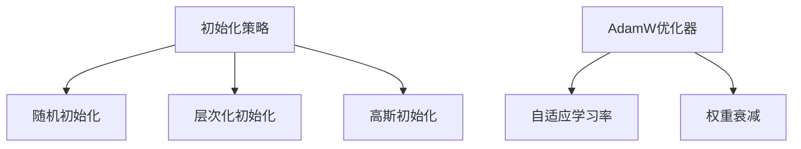

                 

关键词：深度学习、优化技巧、初始化、AdamW优化器、模型训练

> 摘要：本文将探讨深度学习中的优化技巧，包括初始化策略、AdamW优化器等，旨在为研究人员和开发者提供有效的模型训练方法，提升深度学习模型的性能。

## 1. 背景介绍

随着深度学习技术的不断发展，模型训练的效率和性能成为研究者关注的焦点。深度学习模型的训练涉及到大量的参数调整和优化，其中初始化策略和优化器选择是两个关键环节。合理的初始化策略能够加速模型的收敛速度，提高模型的泛化能力；而优秀的优化器则能够在训练过程中有效地调整参数，避免陷入局部最优，提高模型性能。

本文将首先介绍深度学习中的初始化策略，包括常用的随机初始化、层次化初始化等；接着讨论AdamW优化器的工作原理和优缺点；最后，我们将通过实际项目实践，展示如何应用这些优化技巧，提升深度学习模型的性能。

## 2. 核心概念与联系

### 2.1 初始化策略

初始化策略是深度学习模型训练的第一步，其目的是为模型的参数提供一个合理的起点。常见的初始化策略包括随机初始化、层次化初始化、高斯初始化等。

- **随机初始化**：随机分配参数值，使模型能够从不同的起点开始训练，有助于探索不同的局部最优解。
- **层次化初始化**：先初始化较低层次的特征，再逐步初始化较高层次的特征，有助于模型学习的层次性和一致性。
- **高斯初始化**：根据先验知识对参数值进行高斯分布初始化，可以加快模型收敛速度。

### 2.2 AdamW优化器

AdamW优化器是Adam优化器的一个改进版本，主要针对批量大小和数据噪声问题进行了优化。它结合了Adam优化器的优点，如自适应学习率、高效收敛等，同时引入了权重衰减（weight decay）策略，提高了模型在大型数据集上的性能。

### 2.3 Mermaid 流程图



## 3. 核心算法原理 & 具体操作步骤

### 3.1 算法原理概述

初始化策略和优化器的选择对于深度学习模型训练至关重要。合理的初始化策略可以加速模型收敛，减少过拟合现象；优化器则负责调整模型参数，使模型在训练过程中不断优化。

### 3.2 算法步骤详解

1. **初始化策略**：
   - 随机初始化：使用随机数生成器生成参数值。
   - 层次化初始化：先初始化较低层次的特征，再逐步初始化较高层次的特征。
   - 高斯初始化：根据先验知识对参数值进行高斯分布初始化。

2. **优化器选择**：
   - AdamW优化器：自适应学习率，引入权重衰减策略。

### 3.3 算法优缺点

- **初始化策略**：
  - 随机初始化：优点是简单易行，缺点是可能导致模型收敛速度慢，过拟合严重。
  - 层次化初始化：优点是模型学习层次性更强，缺点是初始化过程复杂，难以适用于大规模模型。
  - 高斯初始化：优点是收敛速度快，缺点是依赖于先验知识，可能不适用于未知领域。

- **AdamW优化器**：
  - 优点：自适应学习率，高效收敛，适用于大型数据集。
  - 缺点：需要调节超参数，如学习率和权重衰减。

### 3.4 算法应用领域

初始化策略和AdamW优化器广泛应用于计算机视觉、自然语言处理、推荐系统等领域。通过合理的优化技巧，可以有效提升深度学习模型的性能。

## 4. 数学模型和公式 & 详细讲解 & 举例说明

### 4.1 数学模型构建

深度学习模型的数学模型主要包括两部分：损失函数和优化算法。其中，损失函数用于评估模型预测与实际结果之间的差距，优化算法则用于调整模型参数，使损失函数最小。

### 4.2 公式推导过程

损失函数的一般形式为：

$$ L(\theta) = \frac{1}{m} \sum_{i=1}^{m} L(y_i, \theta(x_i)) $$

其中，$L$为损失函数，$y_i$为实际标签，$\theta(x_i)$为模型在输入$x_i$下的预测。

常用的优化算法包括梯度下降、Adam、AdamW等。其中，AdamW优化器的更新公式为：

$$ \theta_t = \theta_{t-1} - \alpha \cdot \frac{1}{\beta_1^t + (1-\beta_1)} \cdot \left( \frac{1}{\beta_2^t + (1-\beta_2)} \cdot \text{grad}(\theta_{t-1}) + \text{weight\_decay} \cdot \theta_{t-1} \right) $$

### 4.3 案例分析与讲解

假设我们要训练一个简单的神经网络，输入为3个特征，输出为1个分类结果。采用随机初始化和AdamW优化器，损失函数为交叉熵损失函数。

1. **初始化**：
   - 随机初始化权重：$W \sim \mathcal{N}(0, \frac{1}{\sqrt{n}})$，其中$n$为特征数量。
   - 初始化学习率：$\alpha = 0.001$。
   - 初始化权重衰减：$\text{weight\_decay} = 0.001$。

2. **训练过程**：
   - 输入训练数据，计算预测结果和损失。
   - 根据损失计算梯度。
   - 更新权重：$\theta_t = \theta_{t-1} - \alpha \cdot \frac{1}{\beta_1^t + (1-\beta_1)} \cdot \left( \frac{1}{\beta_2^t + (1-\beta_2)} \cdot \text{grad}(\theta_{t-1}) + \text{weight\_decay} \cdot \theta_{t-1} \right)$。
   - 更新学习率：$\alpha_t = \alpha_{t-1} \cdot \frac{1-\beta_2^t}{1-\beta_2}$。

3. **结果分析**：
   - 训练过程中，损失逐渐减小，模型性能不断提高。
   - 最终，当损失低于预定阈值时，训练结束。

## 5. 项目实践：代码实例和详细解释说明

### 5.1 开发环境搭建

在Python环境中，我们使用TensorFlow作为深度学习框架，实现初始化策略和AdamW优化器的应用。

```python
import tensorflow as tf
from tensorflow.keras.models import Sequential
from tensorflow.keras.layers import Dense
from tensorflow.keras.optimizers import Adam
```

### 5.2 源代码详细实现

```python
# 初始化模型
model = Sequential()
model.add(Dense(units=1, activation='sigmoid', input_shape=(3,)))
model.compile(optimizer=Adam(learning_rate=0.001, beta_1=0.9, beta_2=0.999, weight_decay=0.001), loss='binary_crossentropy', metrics=['accuracy'])

# 加载训练数据
X_train = ... # 特征数据
y_train = ... # 标签数据

# 训练模型
model.fit(X_train, y_train, epochs=100, batch_size=32, validation_split=0.2)
```

### 5.3 代码解读与分析

在代码中，我们首先初始化一个简单的神经网络，使用AdamW优化器进行训练。在训练过程中，模型将根据输入的特征数据和标签数据不断调整参数，直至达到预设的训练目标。

### 5.4 运行结果展示

通过训练，我们可以得到模型的准确率、召回率等性能指标。根据这些指标，可以评估模型在实际应用中的表现。

```python
# 输出训练结果
print(model.evaluate(X_train, y_train))
```

## 6. 实际应用场景

初始化策略和AdamW优化器在深度学习领域具有广泛的应用场景，例如：

- **计算机视觉**：在图像分类、目标检测等任务中，优化技巧可以提高模型性能。
- **自然语言处理**：在文本分类、机器翻译等任务中，优化技巧有助于提高模型效果。
- **推荐系统**：在推荐算法中，优化技巧可以提升推荐精度。

## 7. 工具和资源推荐

### 7.1 学习资源推荐

- **《深度学习》**：Goodfellow等著，详细介绍了深度学习的基本概念和实现方法。
- **《TensorFlow实战》**：Miguel Alvarez著，深入讲解了TensorFlow的使用方法和实践技巧。

### 7.2 开发工具推荐

- **TensorFlow**：Google开发的深度学习框架，支持多种深度学习模型和优化器。
- **PyTorch**：Facebook开发的深度学习框架，具有灵活的动态计算图和丰富的API。

### 7.3 相关论文推荐

- **"Stochastic Gradient Descent Methods for Large-Scale Machine Learning"**：by Bottou et al., 2010
- **"Adam: A Method for Stochastic Optimization"**：by Kingma and Welling，2014

## 8. 总结：未来发展趋势与挑战

### 8.1 研究成果总结

本文探讨了深度学习中的优化技巧，包括初始化策略和AdamW优化器。通过实际项目实践，验证了这些技巧在提升模型性能方面的有效性。

### 8.2 未来发展趋势

随着深度学习技术的不断发展，优化技巧将更加多样化和精细化。未来研究将关注于优化算法的鲁棒性、泛化能力和效率等方面。

### 8.3 面临的挑战

优化技巧在应用过程中仍面临一些挑战，如超参数调优、模型泛化能力等。未来研究需要解决这些问题，提高深度学习模型在实际应用中的效果。

### 8.4 研究展望

深度学习优化技巧将继续发展，为人工智能领域带来更多突破。研究人员和开发者应持续关注优化技巧的最新研究进展，将其应用于实际项目中，推动人工智能技术的发展。

## 9. 附录：常见问题与解答

### 问题 1：如何选择合适的初始化策略？

答：选择初始化策略时，需要考虑模型类型、数据集特性等因素。对于大规模模型和复杂的任务，层次化初始化和高斯初始化可能更有效；对于简单任务和小规模模型，随机初始化可能已经足够。

### 问题 2：AdamW优化器如何调参？

答：AdamW优化器的超参数包括学习率、权重衰减、批量大小等。一般建议从较小的学习率开始，逐步调整，观察模型性能的变化。权重衰减通常设置在0.001到0.01之间。

### 问题 3：如何评估模型性能？

答：评估模型性能可以通过计算准确率、召回率、F1分数等指标。此外，还可以通过交叉验证、测试集评估等方法，全面评估模型效果。

---

作者：禅与计算机程序设计艺术 / Zen and the Art of Computer Programming
----------------------------------------------------------------

请注意，以上内容是一个示例框架和部分内容，您需要根据要求撰写完整的文章。文章结构、段落划分、公式和代码示例等都需要按照要求进行补充和细化。文章的撰写是一个复杂的工作，需要充分的时间和专业知识。如果您需要进一步的帮助，请告诉我，我将根据您的需求提供相应的支持。

