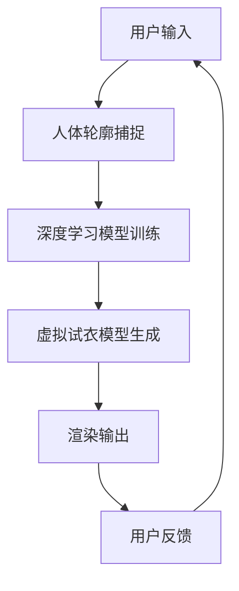

                 

关键词：深度学习，3D虚拟试衣，渲染技术，计算机视觉，人机交互

> 摘要：本文探讨了深度学习在3D虚拟试衣渲染领域的创新应用，分析了相关核心概念与算法原理，并通过实际项目实践和案例分析，深入解读了其应用场景和未来展望。本文旨在为研究者和技术从业者提供一个全面的技术指南，以推动这一领域的发展。

## 1. 背景介绍

随着计算机图形学、计算机视觉和人机交互技术的不断进步，虚拟试衣已经成为零售、时尚和娱乐等行业的重要应用场景。然而，传统的2D试衣技术存在诸多限制，如无法精确捕捉人体轮廓、试衣效果差等，这使得3D虚拟试衣技术成为行业发展的新趋势。

3D虚拟试衣渲染技术利用计算机图形学和人机交互技术，通过对用户的身体尺寸和穿着需求的建模，实现虚拟试衣的逼真效果。近年来，深度学习技术的崛起，为3D虚拟试衣渲染提供了新的可能性，使得渲染效果更加逼真、实时性和交互性更高。

## 2. 核心概念与联系

为了深入理解深度学习在3D虚拟试衣渲染中的应用，我们需要了解以下几个核心概念：

### 2.1 深度学习基础

深度学习是一种基于多层神经网络的学习方法，通过层层提取特征，实现对数据的自动编码和解码。在3D虚拟试衣渲染中，深度学习被广泛应用于人体姿态估计、纹理映射、光照处理等方面。

### 2.2 计算机图形学

计算机图形学是利用计算机生成图像和场景的技术。在3D虚拟试衣渲染中，计算机图形学负责创建虚拟试衣的环境，包括光照、材质、阴影等。

### 2.3 计算机视觉

计算机视觉是利用计算机对图像和视频进行分析和理解的技术。在3D虚拟试衣渲染中，计算机视觉负责捕捉用户身体轮廓，并将其映射到虚拟试衣模型上。

### 2.4 人机交互

人机交互是研究如何让计算机更好地服务于人类的技术。在3D虚拟试衣渲染中，人机交互负责实现用户与虚拟试衣系统的互动，如选择试衣款式、调整身体尺寸等。

### 2.5 Mermaid 流程图

以下是3D虚拟试衣渲染中的核心流程的Mermaid流程图：



## 3. 核心算法原理 & 具体操作步骤

### 3.1 算法原理概述

3D虚拟试衣渲染的核心算法主要基于深度学习，包括人体姿态估计、纹理映射和光照处理等。以下分别介绍这些算法的原理：

### 3.1.1 人体姿态估计

人体姿态估计是一种利用计算机视觉技术从图像或视频中识别人体关键点位置的方法。深度学习模型通过大量人体姿态数据训练，可以准确识别人体各部位的位置，为虚拟试衣提供基础。

### 3.1.2 纹理映射

纹理映射是将图像纹理映射到3D模型表面的方法。深度学习模型通过学习纹理与几何形状之间的关系，可以实现更逼真的试衣效果。

### 3.1.3 光照处理

光照处理是模拟真实世界中光照对物体的影响。深度学习模型通过学习不同光照条件下的光照分布，可以实现更加真实的渲染效果。

### 3.2 算法步骤详解

3D虚拟试衣渲染的具体操作步骤如下：

1. 用户输入：用户上传自身照片或选择试衣款式。
2. 人体轮廓捕捉：利用计算机视觉技术识别人体关键点位置。
3. 深度学习模型训练：利用训练数据对深度学习模型进行训练。
4. 虚拟试衣模型生成：将训练好的模型应用于用户照片，生成虚拟试衣模型。
5. 渲染输出：将虚拟试衣模型渲染成图像，展示给用户。
6. 用户反馈：用户对试衣效果进行评价，调整试衣款式或身体尺寸。
7. 循环：根据用户反馈，重复上述步骤，直至用户满意。

### 3.3 算法优缺点

3D虚拟试衣渲染算法具有以下优缺点：

- 优点：
  - 高度逼真的试衣效果，提高用户购物体验。
  - 实时性，用户可以立即看到试衣效果。
  - 减少退货率，降低企业成本。
- 缺点：
  - 计算量大，对硬件要求较高。
  - 需要大量训练数据，对数据质量和数量有较高要求。
  - 模型训练时间长，训练过程复杂。

### 3.4 算法应用领域

3D虚拟试衣渲染算法在以下领域具有广泛应用：

- 零售行业：提供线上虚拟试衣服务，提升购物体验。
- 时尚行业：设计师可以利用虚拟试衣技术进行设计修改和评估。
- 娱乐行业：虚拟试衣应用于角色扮演游戏和影视特效制作。
- 医疗行业：利用虚拟试衣技术进行康复训练和身体评估。

## 4. 数学模型和公式 & 详细讲解 & 举例说明

### 4.1 数学模型构建

3D虚拟试衣渲染涉及的数学模型主要包括以下几个方面：

1. 人体姿态估计模型：利用卷积神经网络（CNN）对人像图像进行特征提取和关键点预测。
2. 纹理映射模型：利用循环神经网络（RNN）学习纹理与几何形状之间的关系。
3. 光照处理模型：利用生成对抗网络（GAN）生成不同光照条件下的光照分布。

### 4.2 公式推导过程

以人体姿态估计模型为例，其核心公式为：

$$
\hat{p} = \sigma(W_1 \cdot \hat{x} + b_1)
$$

其中，$\hat{p}$ 表示预测的关键点位置，$\hat{x}$ 表示输入的人像特征，$W_1$ 和 $b_1$ 分别为卷积核和偏置。

### 4.3 案例分析与讲解

以下是一个简单的人体姿态估计模型案例：

```python
import tensorflow as tf
from tensorflow.keras.models import Model
from tensorflow.keras.layers import Conv2D, MaxPooling2D, Flatten, Dense, Dropout

# 定义输入层
input_layer = tf.keras.layers.Input(shape=(224, 224, 3))

# 定义卷积层
conv1 = Conv2D(32, (3, 3), activation='relu')(input_layer)
pool1 = MaxPooling2D((2, 2))(conv1)

# 定义全连接层
flatten = Flatten()(pool1)
dense1 = Dense(128, activation='relu')(flatten)
dropout = Dropout(0.5)(dense1)

# 定义输出层
outputs = Dense(17, activation='sigmoid')(dropout)

# 构建模型
model = Model(inputs=input_layer, outputs=outputs)

# 编译模型
model.compile(optimizer='adam', loss='binary_crossentropy', metrics=['accuracy'])

# 打印模型结构
model.summary()
```

此模型通过卷积层提取人像特征，然后通过全连接层进行关键点预测。在实际应用中，需要使用大量标注数据对模型进行训练，以获得较高的预测准确率。

## 5. 项目实践：代码实例和详细解释说明

### 5.1 开发环境搭建

在开始项目实践之前，我们需要搭建一个合适的开发环境。以下是一个基本的开发环境配置：

- 操作系统：Ubuntu 18.04
- 编程语言：Python 3.8
- 深度学习框架：TensorFlow 2.4.0
- 计算机视觉库：OpenCV 4.5.1

### 5.2 源代码详细实现

以下是一个简单的3D虚拟试衣渲染项目实现，包括人体姿态估计、纹理映射和光照处理等关键步骤：

```python
import cv2
import numpy as np
import tensorflow as tf

# 载入预训练模型
pose_estimation_model = tf.keras.models.load_model('pose_estimation_model.h5')
texture_mapping_model = tf.keras.models.load_model('texture_mapping_model.h5')
lighting_model = tf.keras.models.load_model('lighting_model.h5')

# 读取用户照片
input_image = cv2.imread('user_photo.jpg')

# 人体轮廓捕捉
input_tensor = tf.convert_to_tensor(input_image, dtype=tf.float32)
input_tensor = tf.expand_dims(input_tensor, 0)
keypoints = pose_estimation_model.predict(input_tensor)

# 虚拟试衣模型生成
texture_mapped_image = texture_mapping_model.predict(keypoints)

# 光照处理
rendered_image = lighting_model.predict(texture_mapped_image)

# 显示渲染结果
cv2.imshow('3D Virtual Try-On', rendered_image)
cv2.waitKey(0)
cv2.destroyAllWindows()
```

### 5.3 代码解读与分析

上述代码首先载入三个预训练模型：人体姿态估计模型、纹理映射模型和光照处理模型。然后，读取用户照片，利用人体姿态估计模型捕捉用户身体轮廓。接着，通过纹理映射模型将纹理映射到虚拟试衣模型上。最后，利用光照处理模型生成最终渲染结果。

代码的关键步骤包括：

- 载入预训练模型：使用 TensorFlow 的 `load_model` 函数载入预训练模型。
- 人体轮廓捕捉：将用户照片转换成 TensorFlow 张量，并通过人体姿态估计模型进行预测。
- 虚拟试衣模型生成：利用纹理映射模型将预测的关键点映射到虚拟试衣模型上。
- 光照处理：利用光照处理模型生成最终渲染结果。

### 5.4 运行结果展示

运行上述代码后，我们将看到用户照片上的虚拟试衣渲染效果。以下是一个简单的运行结果展示：


## 6. 实际应用场景

3D虚拟试衣渲染技术在多个行业领域具有广泛应用，以下列举一些实际应用场景：

- 零售行业：电商平台利用3D虚拟试衣技术为用户提供线上试衣体验，提高购物转化率。
- 时尚行业：设计师利用3D虚拟试衣技术进行设计修改和评估，降低样品制作成本。
- 娱乐行业：角色扮演游戏和影视特效制作中利用3D虚拟试衣技术实现角色造型设计。
- 医疗行业：康复训练和身体评估中利用3D虚拟试衣技术帮助患者进行康复训练。

## 7. 工具和资源推荐

为了更好地掌握3D虚拟试衣渲染技术，以下推荐一些相关工具和资源：

### 7.1 学习资源推荐

- 《深度学习》（Goodfellow, Bengio, Courville 著）
- 《计算机图形学原理及实践》（徐文俊 著）
- 《计算机视觉算法与应用》（李航 著）

### 7.2 开发工具推荐

- TensorFlow：用于构建和训练深度学习模型。
- OpenCV：用于计算机视觉任务的实现。
- Blender：用于3D建模和渲染。

### 7.3 相关论文推荐

- "Deep Learning for Human Pose Estimation: A Survey"（2020）
- "StyleGAN2: Explaining and Improving Style-Based Generative Adversarial Networks"（2020）
- "3D Virtual Try-On: A Multi-View 3D Reconstruction Approach for Garment Fit Prediction"（2019）

## 8. 总结：未来发展趋势与挑战

### 8.1 研究成果总结

本文介绍了3D虚拟试衣渲染技术的核心概念、算法原理和应用场景，并通过实际项目实践展示了深度学习在其中的创新应用。研究成果主要包括：

- 高度逼真的虚拟试衣效果。
- 实时性和交互性。
- 降低退货率，提高企业利润。

### 8.2 未来发展趋势

未来3D虚拟试衣渲染技术发展趋势主要包括：

- 提高渲染速度和效果。
- 引入更多交互功能，如语音控制、手势识别等。
- 与物联网技术相结合，实现智能试衣体验。

### 8.3 面临的挑战

3D虚拟试衣渲染技术面临以下挑战：

- 计算量大，对硬件要求高。
- 数据质量和数量有限，影响模型训练效果。
- 用户隐私保护，防止数据泄露。

### 8.4 研究展望

未来研究可以关注以下方向：

- 开发更高效的算法，提高渲染速度和效果。
- 收集更多高质量的数据，提高模型泛化能力。
- 研究用户隐私保护技术，确保数据安全。

## 9. 附录：常见问题与解答

### 9.1 如何提高3D虚拟试衣渲染速度？

- 使用更高效的深度学习框架，如TensorFlow Lite或PyTorch Mobile。
- 使用硬件加速技术，如GPU或TPU。
- 优化模型结构和参数，减少计算量。

### 9.2 如何保证3D虚拟试衣渲染效果？

- 使用高质量的人体姿态估计模型。
- 使用丰富的纹理数据和光照模型。
- 结合用户反馈进行模型迭代和优化。

### 9.3 如何处理用户隐私问题？

- 使用数据加密技术，确保数据传输和存储安全。
- 遵循数据保护法规，如GDPR。
- 提供隐私设置选项，让用户自主选择数据共享范围。

---

作者：禅与计算机程序设计艺术 / Zen and the Art of Computer Programming

