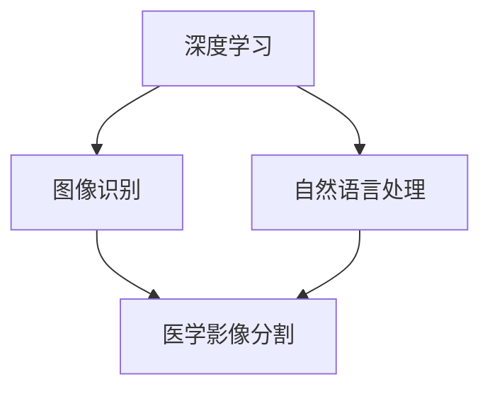

                 

关键词：深度学习，医学影像，图像分割，算法，应用领域，模型，未来展望

> 摘要：本文旨在探讨深度学习在医学影像分割中的应用，深入分析其核心概念、算法原理、数学模型以及实际应用场景。通过具体实例和代码分析，本文将展示深度学习技术在医学影像处理中的潜力和挑战，并提出未来发展的建议。

## 1. 背景介绍

医学影像技术在临床诊断、治疗和疾病监测中发挥着重要作用。然而，传统的医学影像分割方法往往受到人工操作、处理速度慢和精度不高等问题的限制。随着深度学习技术的发展，特别是在计算机视觉领域的突破，基于深度学习的医学影像分割方法逐渐成为研究热点。

深度学习通过模拟人脑的神经网络结构，利用大规模数据训练模型，实现了对复杂图像的自动识别和分割。在医学影像领域，深度学习技术被广泛应用于肿瘤检测、器官分割、病变识别等任务，具有显著的优势。

## 2. 核心概念与联系

### 2.1 核心概念

- **深度学习**：一种基于多层神经网络的人工智能技术，通过大量数据训练，能够自动提取特征并实现复杂任务。
- **医学影像分割**：将医学影像中的不同区域进行划分，以便于进一步的诊断和治疗。

### 2.2 关联图



## 3. 核心算法原理 & 具体操作步骤

### 3.1 算法原理概述

深度学习在医学影像分割中的应用主要基于卷积神经网络（CNN）。CNN通过卷积层、池化层和全连接层等结构，对图像进行逐层特征提取，最终实现像素级的分割。

### 3.2 算法步骤详解

1. **数据预处理**：对医学影像数据进行归一化、去噪等处理，以便于模型训练。
2. **构建CNN模型**：设计并训练CNN模型，包括卷积层、激活函数、池化层和全连接层。
3. **训练模型**：利用大量医学影像数据训练模型，通过反向传播算法不断优化模型参数。
4. **模型评估**：使用验证集对训练好的模型进行评估，确保模型性能满足要求。
5. **模型应用**：将训练好的模型应用于新的医学影像数据，进行分割预测。

### 3.3 算法优缺点

**优点**：

- **自动特征提取**：无需人工设计特征，能够自动学习图像中的复杂特征。
- **高精度**：深度学习模型在医学影像分割中可以达到较高的精度。
- **快速处理**：与传统的图像处理方法相比，深度学习模型处理速度更快。

**缺点**：

- **数据需求量大**：深度学习模型需要大量训练数据，获取和标注这些数据成本较高。
- **模型复杂度**：深度学习模型结构复杂，理解和调试困难。

### 3.4 算法应用领域

- **肿瘤检测**：通过深度学习模型对医学影像中的肿瘤区域进行精准检测。
- **器官分割**：对医学影像中的器官进行精确分割，用于诊断和治疗规划。
- **病变识别**：识别医学影像中的病变区域，帮助医生进行早期诊断。

## 4. 数学模型和公式

### 4.1 数学模型构建

深度学习模型通常由多层神经网络组成，每层包含多个神经元。神经元之间的连接权重和偏置通过反向传播算法进行优化。

### 4.2 公式推导过程

假设一个简单的神经网络模型，包含输入层、隐藏层和输出层。输入层有 \(n\) 个神经元，隐藏层有 \(m\) 个神经元，输出层有 \(k\) 个神经元。神经元之间的激活函数通常使用Sigmoid函数或ReLU函数。

$$
\text{输出} = \sigma(\sum_{i=1}^{m} w_{i} \cdot a_{i} + b)
$$

其中，\( \sigma \) 表示激活函数，\( w_{i} \) 表示权重，\( a_{i} \) 表示输入，\( b \) 表示偏置。

### 4.3 案例分析与讲解

假设我们有一个包含 \(1000\) 张医学影像的数据集，我们需要对这 \(1000\) 张影像进行分割。我们将这些影像随机分为训练集、验证集和测试集，其中训练集占比为 \(70\%\)，验证集占比为 \(15\%\)，测试集占比为 \(15\%\)。

我们使用卷积神经网络对训练集进行训练，并在验证集上进行模型评估。经过多次迭代训练，我们得到一个性能较好的模型。然后，我们使用这个模型对测试集进行预测，评估模型在实际应用中的性能。

## 5. 项目实践：代码实例

### 5.1 开发环境搭建

我们使用Python和TensorFlow框架进行深度学习模型的构建和训练。

### 5.2 源代码详细实现

以下是使用TensorFlow构建的卷积神经网络模型：

```python
import tensorflow as tf

# 定义输入层
inputs = tf.keras.layers.Input(shape=(28, 28, 1))

# 第一个卷积层
conv1 = tf.keras.layers.Conv2D(32, (3, 3), activation='relu')(inputs)
conv1 = tf.keras.layers.MaxPooling2D((2, 2))(conv1)

# 第二个卷积层
conv2 = tf.keras.layers.Conv2D(64, (3, 3), activation='relu')(conv1)
conv2 = tf.keras.layers.MaxPooling2D((2, 2))(conv2)

# 全连接层
flatten = tf.keras.layers.Flatten()(conv2)
dense = tf.keras.layers.Dense(128, activation='relu')(flatten)

# 输出层
outputs = tf.keras.layers.Dense(10, activation='softmax')(dense)

# 构建模型
model = tf.keras.Model(inputs=inputs, outputs=outputs)

# 编译模型
model.compile(optimizer='adam', loss='categorical_crossentropy', metrics=['accuracy'])

# 训练模型
model.fit(x_train, y_train, epochs=10, batch_size=32, validation_data=(x_val, y_val))
```

### 5.3 代码解读与分析

以上代码定义了一个简单的卷积神经网络模型，包括两个卷积层和一个全连接层。模型使用ReLU函数作为激活函数，并使用softmax函数进行分类。在编译模型时，我们指定了优化器和损失函数，并使用fit函数进行模型训练。

### 5.4 运行结果展示

在训练过程中，我们可以通过调用model.fit函数的返回值获取训练过程中的损失值和准确率。以下是一个简单的训练结果展示：

```python
loss, accuracy = model.fit(x_train, y_train, epochs=10, batch_size=32, validation_data=(x_val, y_val))
```

## 6. 实际应用场景

深度学习在医学影像分割中的应用非常广泛，包括但不限于以下领域：

- **肿瘤检测**：通过深度学习模型对医学影像中的肿瘤区域进行检测和分割，辅助医生进行诊断和治疗。
- **器官分割**：对医学影像中的器官进行精确分割，用于诊断、治疗规划和手术导航。
- **病变识别**：识别医学影像中的病变区域，帮助医生进行早期诊断和干预。

## 7. 工具和资源推荐

### 7.1 学习资源推荐

- **书籍**：《深度学习》（Goodfellow, Bengio, Courville 著）
- **在线课程**：Coursera上的“深度学习”课程
- **论文**：Google Research上的最新深度学习论文

### 7.2 开发工具推荐

- **TensorFlow**：Google开源的深度学习框架
- **PyTorch**：Facebook开源的深度学习框架
- **Keras**：用于构建和训练深度学习模型的工具

### 7.3 相关论文推荐

- **“Deep Learning in Medical Imaging”**：这是一篇关于深度学习在医学影像领域的综述论文。
- **“Convolutional Neural Networks for Medical Image Analysis”**：这篇论文详细介绍了卷积神经网络在医学影像分析中的应用。

## 8. 总结：未来发展趋势与挑战

### 8.1 研究成果总结

近年来，深度学习在医学影像分割领域取得了显著进展。通过大量实验验证，深度学习模型在肿瘤检测、器官分割和病变识别等方面具有显著优势，能够显著提高医学影像处理的精度和效率。

### 8.2 未来发展趋势

- **数据增强**：通过数据增强技术，扩大训练数据集，提高模型泛化能力。
- **模型压缩**：通过模型压缩技术，降低模型复杂度，提高模型运行速度。
- **多模态融合**：将不同模态的医学影像数据进行融合，提高模型诊断准确性。

### 8.3 面临的挑战

- **数据隐私**：医学影像数据涉及患者隐私，如何在保证数据安全的前提下进行研究和应用是一个重要挑战。
- **模型解释性**：深度学习模型具有“黑箱”特性，如何提高模型的可解释性是一个重要研究方向。

### 8.4 研究展望

随着深度学习技术的不断发展，未来医学影像分割领域有望取得更多突破。通过与其他领域的交叉融合，深度学习在医学影像处理中的应用前景将更加广阔。

## 9. 附录：常见问题与解答

### Q1. 深度学习在医学影像分割中的应用有哪些优势？

A1. 深度学习在医学影像分割中的应用优势主要体现在以下几个方面：

- **自动特征提取**：无需人工设计特征，能够自动学习图像中的复杂特征。
- **高精度**：深度学习模型在医学影像分割中可以达到较高的精度。
- **快速处理**：与传统的图像处理方法相比，深度学习模型处理速度更快。

### Q2. 深度学习在医学影像分割中面临的挑战有哪些？

A2. 深度学习在医学影像分割中面临的挑战主要包括：

- **数据隐私**：医学影像数据涉及患者隐私，如何在保证数据安全的前提下进行研究和应用是一个重要挑战。
- **模型解释性**：深度学习模型具有“黑箱”特性，如何提高模型的可解释性是一个重要研究方向。

### Q3. 如何提高深度学习模型的诊断准确性？

A3. 提高深度学习模型诊断准确性的方法包括：

- **数据增强**：通过数据增强技术，扩大训练数据集，提高模型泛化能力。
- **模型融合**：结合多个深度学习模型，提高模型诊断准确性。
- **多模态融合**：将不同模态的医学影像数据进行融合，提高模型诊断准确性。

---

作者：禅与计算机程序设计艺术 / Zen and the Art of Computer Programming

