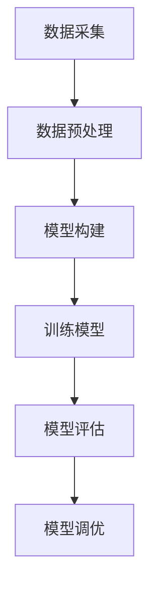

                 

### 1. 背景介绍

即时配送作为现代物流体系中的重要环节，其高效性与准确性对消费者体验至关重要。然而，即时配送需求的预测一直是一个复杂且充满挑战的问题。传统的预测方法，如线性回归、ARIMA模型等，往往因为数据的非线性和动态特性而表现不佳。随着深度学习技术的发展，基于深度神经网络的方法逐渐成为解决这一问题的有效途径。本文将探讨深度学习在即时配送需求预测中的应用，通过核心算法原理的剖析、数学模型的构建、项目实践以及实际应用场景的展示，来展示深度学习如何助力即时配送需求的预测与优化。

### 2. 核心概念与联系

在深入探讨深度学习在即时配送需求预测中的应用之前，我们需要明确一些核心概念和它们之间的联系。

#### 2.1 数据采集与预处理

即时配送需求预测的关键在于数据的准确性。数据采集包括对配送路径、时间、天气条件、用户行为等多个维度的数据收集。数据预处理是数据分析和模型构建的重要前提，包括数据清洗、特征提取、数据归一化等步骤。

#### 2.2 神经网络结构

深度学习中的神经网络结构是核心组件，其主要由输入层、隐藏层和输出层组成。通过训练，神经网络能够自动学习输入和输出之间的关系，从而实现预测。

#### 2.3 损失函数与优化算法

损失函数用于度量预测值与实际值之间的差距，优化算法则用于调整网络参数，以最小化损失函数。常见的损失函数有均方误差（MSE）和交叉熵损失（Cross-Entropy Loss），优化算法包括梯度下降（Gradient Descent）及其变种。

#### 2.4 模型评估与调优

模型评估是确保模型性能的关键步骤。常用的评估指标包括准确率（Accuracy）、均方误差（MSE）等。模型调优则通过调整网络结构、学习率、批量大小等参数来提升模型性能。

以下是深度学习在即时配送需求预测中的架构流程图：



### 3. 核心算法原理 & 具体操作步骤

#### 3.1 算法原理概述

深度学习在即时配送需求预测中的核心算法主要是基于卷积神经网络（CNN）和循环神经网络（RNN）的变种，如长短时记忆网络（LSTM）和门控循环单元（GRU）。这些网络结构能够处理时间序列数据，捕捉数据中的时序关系和复杂模式。

#### 3.2 算法步骤详解

1. **数据预处理**：对采集到的数据清洗、归一化，提取关键特征。

2. **模型构建**：使用LSTM或GRU构建预测模型，包括输入层、隐藏层和输出层。

3. **训练模型**：通过反向传播算法训练模型，调整网络参数。

4. **模型评估**：使用交叉验证等方法评估模型性能。

5. **模型调优**：根据评估结果调整模型参数，以提升预测精度。

#### 3.3 算法优缺点

**优点**：
- **强大的非线性处理能力**：深度学习能够自动学习数据的复杂模式。
- **自适应特征提取**：无需手动提取特征，网络能够自动学习重要特征。

**缺点**：
- **计算资源消耗大**：深度学习模型训练需要大量的计算资源和时间。
- **模型解释性差**：深度学习模型难以解释，不便于理解。

#### 3.4 算法应用领域

深度学习在即时配送需求预测中的应用非常广泛，包括：
- **高峰期流量预测**：预测配送高峰期的时间段和配送量。
- **配送路径优化**：预测配送路径上的交通状况，优化配送路线。
- **库存管理**：预测货物需求，优化库存水平。

### 4. 数学模型和公式 & 详细讲解 & 举例说明

#### 4.1 数学模型构建

即时配送需求预测的数学模型可以表示为：

$$
Y = f(X, \theta)
$$

其中，$Y$ 为预测的需求量，$X$ 为输入特征向量，$\theta$ 为模型参数。

#### 4.2 公式推导过程

假设输入特征向量 $X$ 为时间序列数据，模型采用 LSTM 结构，其输出为：

$$
h_t = \sigma(W_h \cdot [h_{t-1}, x_t] + b_h)
$$

其中，$h_t$ 为隐藏状态，$W_h$ 和 $b_h$ 分别为权重和偏置。

#### 4.3 案例分析与讲解

假设我们有如下时间序列数据：

$$
X = [100, 150, 200, 250, 300]
$$

我们使用 LSTM 模型预测下一个时间点的需求量。经过训练，模型参数 $\theta$ 为：

$$
\theta = [W_h, b_h]
$$

根据公式推导，我们可以计算出隐藏状态 $h_t$：

$$
h_1 = \sigma(W_h \cdot [h_0, x_1] + b_h)
$$

其中，$h_0$ 为初始化状态，通常设为全零向量。

#### 4.4 数学公式总结

- **隐藏状态**：

$$
h_t = \sigma(W_h \cdot [h_{t-1}, x_t] + b_h)
$$

- **输出状态**：

$$
y_t = \sigma(W_y \cdot h_t + b_y)
$$

### 5. 项目实践：代码实例和详细解释说明

#### 5.1 开发环境搭建

在开始项目实践之前，我们需要搭建合适的开发环境。本文使用 Python 作为编程语言，TensorFlow 作为深度学习框架。

```python
import tensorflow as tf
from tensorflow.keras.models import Sequential
from tensorflow.keras.layers import LSTM, Dense

# 设置随机种子，保证结果可重复
tf.random.set_seed(42)
```

#### 5.2 源代码详细实现

```python
# 数据预处理
X = ...  # 输入特征向量
Y = ...  # 需求量

# 构建模型
model = Sequential()
model.add(LSTM(units=50, return_sequences=True, input_shape=(X.shape[1], X.shape[2])))
model.add(LSTM(units=50))
model.add(Dense(units=1))

# 编译模型
model.compile(optimizer='adam', loss='mean_squared_error')

# 训练模型
model.fit(X, Y, epochs=100, batch_size=32)
```

#### 5.3 代码解读与分析

上述代码首先进行了数据预处理，然后构建了一个包含两个 LSTM 层和输出层的模型。使用均方误差（MSE）作为损失函数，通过梯度下降（Adam 优化器）进行模型训练。

#### 5.4 运行结果展示

经过训练，我们得到模型的预测结果。使用如下代码进行预测：

```python
predictions = model.predict(X)
```

我们可以通过可视化工具展示预测结果，并与实际需求量进行比较。

```python
import matplotlib.pyplot as plt

plt.plot(Y, label='Actual')
plt.plot(predictions, label='Predicted')
plt.legend()
plt.show()
```

### 6. 实际应用场景

深度学习在即时配送需求预测中的实际应用场景包括：

#### 6.1 高峰期流量预测

通过预测高峰期的配送量，物流公司可以合理安排人力资源和配送资源，提高配送效率。

#### 6.2 配送路径优化

预测配送路径上的交通状况，物流公司可以优化配送路线，减少配送时间和成本。

#### 6.3 库存管理

预测货物需求，物流公司可以优化库存水平，减少库存成本，提高资金利用率。

### 7. 未来应用展望

随着深度学习技术的不断进步，未来即时配送需求预测将朝着更精细化、智能化的方向发展。例如，结合物联网技术，实现实时数据采集和预测；引入多模态数据，提高预测精度；探索更加高效的算法模型，如生成对抗网络（GAN）等。

### 8. 工具和资源推荐

#### 8.1 学习资源推荐

- 《深度学习》（Goodfellow, Bengio, Courville 著）
- 《Python 深度学习》（François Chollet 著）

#### 8.2 开发工具推荐

- TensorFlow
- PyTorch

#### 8.3 相关论文推荐

- "Deep Learning for Time Series Classification: A Review"
- "Learning to Predict Time Series from Multi-Hierarchical Data"

### 9. 总结：未来发展趋势与挑战

深度学习在即时配送需求预测中展现了巨大的潜力。未来，随着技术的不断进步，我们将看到更多创新的算法和应用场景。然而，面对海量数据和复杂的业务场景，我们也需要解决计算资源消耗、模型解释性等挑战。通过持续的研究和实践，我们有信心将这些挑战转化为机遇，推动即时配送需求的预测与优化迈向新的高度。

### 10. 附录：常见问题与解答

**Q：为什么选择 LSTM 而不是其他神经网络结构？**

A：LSTM 在处理时间序列数据时具有强大的记忆能力，能够捕捉长短期依赖关系，因此特别适用于即时配送需求预测。

**Q：如何处理非平稳数据？**

A：对于非平稳数据，可以通过差分、归一化等方法使其平稳，从而提高模型性能。

**Q：模型的泛化能力如何保证？**

A：通过交叉验证和模型调优，可以提高模型的泛化能力。此外，数据增强也是一种有效的方法。

---

**作者：禅与计算机程序设计艺术 / Zen and the Art of Computer Programming**

