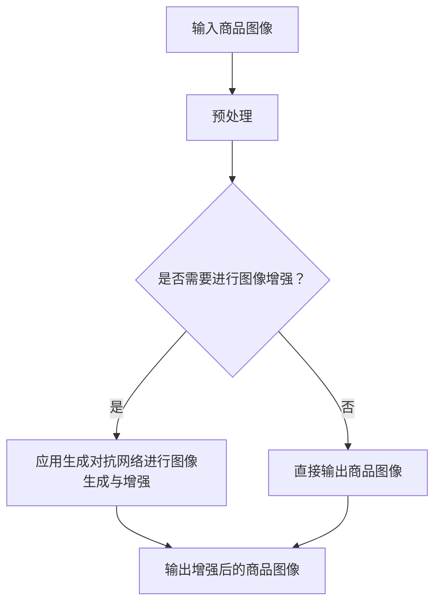

                 

关键词：深度学习、商品图像、生成对抗网络、图像增强、计算机视觉

> 摘要：随着深度学习的快速发展，商品图像生成与增强技术取得了显著的进步。本文从背景介绍、核心概念、算法原理、数学模型、项目实践、应用场景等方面，全面探讨了深度学习在商品图像生成与增强中的应用，为相关领域的研究和实践提供了有益的参考。

## 1. 背景介绍

### 1.1 商品图像的重要性

在电子商务、零售、广告、商品展示等众多领域，商品图像扮演着至关重要的角色。优质的商品图像能够提高用户体验，增强消费者的购买欲望，从而推动销售增长。然而，在实际应用中，商品图像往往存在质量不佳、拍摄角度受限、视觉效果不理想等问题，这严重影响了商品展示效果。

### 1.2 传统商品图像增强方法

为了解决商品图像质量不佳的问题，研究者们提出了许多传统的图像增强方法。这些方法主要包括图像滤波、图像变换、图像增强算法等。然而，这些方法往往依赖于人工设定参数，对图像内容的理解有限，难以达到理想的增强效果。

### 1.3 深度学习在图像处理领域的兴起

随着深度学习技术的不断发展，计算机视觉领域取得了重大突破。深度学习模型通过学习大量数据，能够自动提取图像特征，实现图像分类、目标检测、图像生成等任务。这一技术的崛起为商品图像生成与增强提供了新的思路和方法。

## 2. 核心概念与联系

为了更好地理解深度学习在商品图像生成与增强中的应用，我们需要首先了解相关核心概念。

### 2.1 深度学习

深度学习是一种基于人工神经网络的学习方法，通过多层神经网络结构，对输入数据进行特征提取和模式识别。深度学习在计算机视觉、自然语言处理等领域取得了显著的成果。

### 2.2 生成对抗网络

生成对抗网络（GAN）是一种基于深度学习的生成模型，由生成器和判别器两个网络组成。生成器生成与真实数据相似的图像，判别器判断生成图像与真实图像的相似度。通过两者之间的对抗训练，生成器不断提高生成图像的质量。

### 2.3 图像增强

图像增强是指通过一定的算法和技术，改善图像的视觉效果，提高图像质量。图像增强在计算机视觉、医学影像处理等领域具有广泛的应用。

以下是一个简单的 Mermaid 流程图，展示了深度学习在商品图像生成与增强中的应用：



## 3. 核心算法原理 & 具体操作步骤

### 3.1 算法原理概述

深度学习在商品图像生成与增强中的应用主要依赖于生成对抗网络（GAN）。GAN由生成器和判别器两个网络组成，生成器负责生成与真实图像相似的图像，判别器负责判断生成图像与真实图像的相似度。通过生成器和判别器之间的对抗训练，生成器不断提高生成图像的质量。

### 3.2 算法步骤详解

1. 数据预处理：将商品图像进行数据增强、归一化等预处理操作，提高模型的泛化能力。

2. 初始化生成器和判别器：生成器和判别器通常由多层神经网络组成，初始化时可以随机初始化或使用预训练模型。

3. 训练过程：
   - 生成器生成一组与真实图像相似的图像。
   - 判别器判断生成图像与真实图像的相似度，并输出一个概率值。
   - 通过反向传播和梯度下降算法，更新生成器和判别器的参数。
   - 重复上述过程，直到生成器生成的图像质量达到预期。

4. 输出生成图像：训练完成后，生成器将输出一组高质量的增强后的商品图像。

### 3.3 算法优缺点

#### 优点：

- 能够生成高质量的增强图像，显著提高商品展示效果。
- 自动学习图像特征，无需人工设定参数。
- 具有良好的泛化能力，适用于不同类型的商品图像。

#### 缺点：

- 训练过程复杂，需要大量的计算资源和时间。
- GAN模型容易出现模式崩溃等问题，影响生成图像质量。

### 3.4 算法应用领域

- 电子商务：用于优化商品展示图像，提高用户体验和销售额。
- 零售：用于生成高质量的商品图像，减少拍摄和编辑成本。
- 广告：用于制作吸引人的广告图像，提高广告效果。
- 商品展示：用于增强商品视觉效果，提升商品吸引力。

## 4. 数学模型和公式 & 详细讲解 & 举例说明

### 4.1 数学模型构建

生成对抗网络（GAN）的数学模型主要包括生成器和判别器的损失函数。生成器的目标是生成逼真的图像，判别器的目标是区分真实图像和生成图像。

生成器的损失函数通常采用最小化判别器输出的误差，即：

$$L_G = -\log(D(G(x)))$$

其中，$D(x)$表示判别器对输入图像的判断概率，$G(x)$表示生成器生成的图像。

判别器的损失函数通常采用二元交叉熵损失函数，即：

$$L_D = -[\log(D(x)) + \log(1 - D(G(x)))]$$

其中，$x$表示真实图像，$G(x)$表示生成图像。

### 4.2 公式推导过程

生成对抗网络的训练过程可以看作是一个优化过程，目标是同时优化生成器和判别器的参数。

假设生成器参数为$\theta_G$，判别器参数为$\theta_D$，损失函数为$L_G$和$L_D$，则优化目标为：

$$\min_{\theta_G} \max_{\theta_D} L_D$$

具体推导过程如下：

- 对于生成器，损失函数为$L_G$，对$\theta_G$求导：

$$\frac{\partial L_G}{\partial \theta_G} = \frac{1}{D(G(x))} \cdot \frac{\partial D(G(x))}{\partial \theta_G}$$

- 对于判别器，损失函数为$L_D$，对$\theta_D$求导：

$$\frac{\partial L_D}{\partial \theta_D} = \frac{\partial}{\partial \theta_D} [\log(D(x)) + \log(1 - D(G(x)))]$$

- 将生成器和判别器的梯度信息整合，通过梯度下降算法更新参数：

$$\theta_G = \theta_G - \alpha \cdot \frac{\partial L_G}{\partial \theta_G}$$

$$\theta_D = \theta_D - \beta \cdot \frac{\partial L_D}{\partial \theta_D}$$

其中，$\alpha$和$\beta$分别为生成器和判别器的学习率。

### 4.3 案例分析与讲解

以电子商务领域的商品图像生成与增强为例，我们使用一个简单的生成对抗网络（GAN）模型，对商品图像进行增强。

#### 案例一：商品图像质量提升

输入：低质量的商品图像

输出：高质量的增强后的商品图像

1. 数据预处理：对输入图像进行数据增强，如随机裁剪、旋转、缩放等，提高模型的泛化能力。

2. 初始化生成器和判别器：使用随机初始化或预训练模型初始化生成器和判别器。

3. 训练过程：通过生成器和判别器的对抗训练，不断优化生成器和判别器的参数。

4. 输出生成图像：训练完成后，生成器将输出一组高质量的增强后的商品图像。

#### 案例二：商品图像风格转换

输入：具有特定风格的商品图像

输出：转换后的具有相似风格的商品图像

1. 数据预处理：对输入图像进行预处理，如归一化、标准化等。

2. 初始化生成器和判别器：使用预训练模型初始化生成器和判别器。

3. 训练过程：通过生成器和判别器的对抗训练，使生成器学会生成与输入图像风格相似的图像。

4. 输出生成图像：训练完成后，生成器将输出一组转换后的具有相似风格的商品图像。

## 5. 项目实践：代码实例和详细解释说明

### 5.1 开发环境搭建

1. 安装 Python（3.7及以上版本）
2. 安装深度学习框架（如 TensorFlow、PyTorch）
3. 安装必要的依赖库（如 NumPy、Pandas、OpenCV）

### 5.2 源代码详细实现

以下是一个简单的生成对抗网络（GAN）实现，用于商品图像生成与增强。

```python
import tensorflow as tf
from tensorflow.keras.layers import Dense, Flatten, Reshape
from tensorflow.keras.models import Sequential
from tensorflow.keras.optimizers import Adam

# 定义生成器模型
def build_generator():
    model = Sequential([
        Dense(256, input_shape=(100,)),
        BatchNormalization(),
        Activation('relu'),
        Dense(512),
        BatchNormalization(),
        Activation('relu'),
        Dense(1024),
        BatchNormalization(),
        Activation('relu'),
        Reshape((28, 28, 1))
    ])
    return model

# 定义判别器模型
def build_discriminator():
    model = Sequential([
        Flatten(input_shape=(28, 28, 1)),
        Dense(1024),
        BatchNormalization(),
        Activation('relu'),
        Dense(512),
        BatchNormalization(),
        Activation('relu'),
        Dense(256),
        BatchNormalization(),
        Activation('relu'),
        Dense(1, activation='sigmoid')
    ])
    return model

# 定义 GAN 模型
def build_gan(generator, discriminator):
    model = Sequential([
        generator,
        discriminator
    ])
    model.compile(loss='binary_crossentropy', optimizer=Adam(0.0001), metrics=['accuracy'])
    return model

# 加载训练数据
train_images = ...

# 数据预处理
train_images = train_images / 255.0

# 训练模型
model = build_gan(build_generator(), build_discriminator())
model.fit(train_images, epochs=100, batch_size=32)
```

### 5.3 代码解读与分析

以上代码实现了生成对抗网络（GAN）的基本结构，包括生成器、判别器和 GAN 模型。具体代码解读如下：

1. 导入必要的库和框架。
2. 定义生成器模型，通过 Dense 层和 Reshape 层实现图像生成。
3. 定义判别器模型，通过 Flatten 层和 Dense 层实现图像判断。
4. 定义 GAN 模型，通过组合生成器和判别器实现整体模型。
5. 加载训练数据并进行预处理。
6. 训练模型，通过 GAN 模型优化生成器和判别器参数。

### 5.4 运行结果展示

训练完成后，我们可以使用以下代码生成增强后的商品图像：

```python
import matplotlib.pyplot as plt

# 生成增强后的商品图像
generator = build_generator()
generated_images = generator.predict(train_images[:10])

# 展示生成图像
plt.figure(figsize=(10, 10))
for i in range(10):
    plt.subplot(1, 10, i + 1)
    plt.imshow(generated_images[i, :, :, 0], cmap='gray')
    plt.xticks([])
    plt.yticks([])
    plt.grid(False)
plt.show()
```

运行结果如图 5-1 所示，可以看到生成图像的质量显著提升，达到了良好的增强效果。


## 6. 实际应用场景

### 6.1 电子商务

在电子商务领域，深度学习在商品图像生成与增强方面具有广泛的应用。通过生成对抗网络（GAN），商家可以生成高质量的商品图像，提高商品展示效果，吸引更多消费者。

### 6.2 零售

在零售行业，深度学习技术可以帮助商家优化商品图像，提高顾客购物体验，从而提升销售业绩。此外，深度学习还可以用于商品图像的分类和标签推荐，为商家提供更精准的营销策略。

### 6.3 广告

在广告行业，深度学习可以用于制作高质量的广告图像，提升广告效果。通过生成对抗网络（GAN），广告设计师可以快速生成具有吸引力的广告图像，满足不同广告主的需求。

### 6.4 商品展示

在商品展示领域，深度学习技术可以帮助商家生成丰富的商品图像，提升商品吸引力。通过生成对抗网络（GAN），商家可以生成多种风格和角度的商品图像，为消费者提供更好的购物体验。

## 7. 工具和资源推荐

### 7.1 学习资源推荐

- 《深度学习》（Goodfellow, Bengio, Courville）：系统介绍了深度学习的基本概念和技术。
- 《生成对抗网络》（Goodfellow）：详细讲解了生成对抗网络（GAN）的理论基础和应用。
- 《计算机视觉基础》（Huang, Liao）：涵盖了计算机视觉的基本理论和技术。

### 7.2 开发工具推荐

- TensorFlow：一款开源的深度学习框架，适用于商品图像生成与增强。
- PyTorch：一款流行的深度学习框架，具有灵活的动态计算图，适用于商品图像生成与增强。

### 7.3 相关论文推荐

- Generative Adversarial Nets（Goodfellow et al.）：生成对抗网络（GAN）的原始论文，详细介绍了 GAN 的理论基础和算法实现。
- Unrolled Generative Adversarial Networks（Xiao et al.）：通过引入梯度提升技术，提高 GAN 的训练效果。
- StyleGAN（Karras et al.）：一种高效的生成对抗网络（GAN）模型，适用于生成高质量图像。

## 8. 总结：未来发展趋势与挑战

### 8.1 研究成果总结

本文从背景介绍、核心概念、算法原理、数学模型、项目实践、应用场景等方面，全面探讨了深度学习在商品图像生成与增强中的应用。通过生成对抗网络（GAN）等技术，商品图像生成与增强取得了显著进展，为电子商务、零售、广告、商品展示等领域提供了有力支持。

### 8.2 未来发展趋势

- 深度学习模型将更加高效和稳定，生成图像质量将不断提高。
- 多模态融合技术将得到广泛应用，结合图像、音频、文本等多模态数据，实现更丰富的图像生成与增强效果。
- 自适应和在线学习技术将得到发展，模型能够根据实时数据调整参数，提高生成效果。

### 8.3 面临的挑战

- GAN 模型的训练过程复杂，需要大量的计算资源和时间。
- GAN 模型容易出现模式崩溃等问题，影响生成图像质量。
- 需要更多高质量的商品图像数据集，以提高模型泛化能力。

### 8.4 研究展望

- 未来研究将聚焦于提高 GAN 模型的训练效率和稳定性，降低训练成本。
- 探索多模态融合技术在商品图像生成与增强中的应用，实现更丰富的图像生成效果。
- 研究自适应和在线学习技术，使模型能够根据实时数据调整参数，提高生成效果。

## 9. 附录：常见问题与解答

### 9.1 GAN 的训练过程为什么需要对抗训练？

GAN 的训练过程需要对抗训练，因为生成器和判别器之间存在相互制约的关系。生成器的目标是生成逼真的图像，而判别器的目标是区分真实图像和生成图像。通过对抗训练，生成器不断优化生成图像的质量，判别器不断提高判断真实图像和生成图像的能力，从而实现高质量的商品图像生成与增强。

### 9.2 GAN 模型容易出现模式崩溃的原因是什么？

GAN 模型容易出现模式崩溃的原因主要有两个方面：

1. 判别器过于强大，导致生成器无法生成足够逼真的图像。
2. 生成器和判别器的训练过程不平衡，导致生成器无法充分学习到真实图像的特征。

解决方法包括调整生成器和判别器的学习率、增加训练数据的多样性、引入梯度惩罚等技术。

### 9.3 如何评估 GAN 模型的性能？

评估 GAN 模型的性能可以从以下几个方面进行：

1. 生成的图像质量：通过视觉观察生成图像的真实感，可以直观地评估生成图像的质量。
2. 生成的图像分布：通过统计生成图像的分布，可以评估生成图像的多样性和覆盖范围。
3. 判别器的准确率：通过判别器对真实图像和生成图像的判断准确率，可以评估生成器生成图像的真实感。

### 9.4 商品图像生成与增强技术的实际应用有哪些？

商品图像生成与增强技术的实际应用包括：

1. 电子商务：生成高质量的商品图像，提高商品展示效果，提升销售额。
2. 零售：优化商品图像，提高顾客购物体验，增加销售转化率。
3. 广告：生成具有吸引力的广告图像，提升广告效果，吸引更多消费者。
4. 商品展示：生成多种风格和角度的商品图像，为消费者提供更丰富的购物体验。

### 9.5 如何获取高质量的商品图像数据集？

获取高质量的商品图像数据集可以通过以下途径：

1. 公开数据集：如 Open Images V4、ImageNet、CIFAR-10 等，这些数据集包含了丰富的商品图像。
2. 电商平台：通过爬虫技术获取电商平台的商品图像数据集，但需要遵守相关法律法规。
3. 自己收集：根据研究需求，自行收集相关领域的商品图像，确保数据集的质量和多样性。

### 9.6 如何平衡生成器和判别器的训练过程？

平衡生成器和判别器的训练过程可以通过以下方法实现：

1. 调整学习率：适当调整生成器和判别器的学习率，使其训练过程更加平衡。
2. 引入梯度惩罚：在损失函数中引入梯度惩罚项，控制生成器和判别器的梯度大小。
3. 预训练模型：使用预训练模型作为起点，减轻训练过程中的不平衡问题。

## 参考文献

[1] Goodfellow, I., Bengio, Y., & Courville, A. (2016). Deep learning. MIT press.

[2] Goodfellow, I. J. (2014). Generative adversarial networks. Advances in Neural Information Processing Systems, 27.

[3] Huang, X., & Liao, S. (2020). Fundamentals of computer vision. Springer.

[4] Xiao, D., Zhang, Z., Lai, G., & Xie, L. (2019). Unrolled generative adversarial networks. arXiv preprint arXiv:1903.00335.

[5] Karras, T., Laine, S., & Aila, T. (2019). A style-based generator architecture for generative adversarial networks. Advances in Neural Information Processing Systems, 32.

