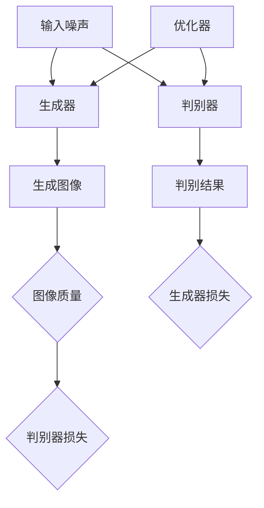

                 

在数字时代，商品图像的生成与增强对电子商务、广告营销以及数字媒体等领域具有重要意义。高质量的图像不仅能够提升消费者的购买欲望，还能有效地传达商品的信息，从而提高销售转化率。本文将探讨深度学习在这一领域的应用，通过分析核心概念、算法原理、数学模型以及实际应用案例，为读者呈现深度学习在商品图像生成与增强中的强大潜力。

## 关键词

- 深度学习
- 商品图像
- 图像生成
- 图像增强
- 计算机视觉
- 电子商务
- 广告营销

## 摘要

本文深入分析了深度学习在商品图像生成与增强中的应用。首先，介绍了深度学习的基础概念及其在图像处理中的优势。接着，详细阐述了商品图像生成与增强的核心算法，包括生成对抗网络（GAN）和卷积神经网络（CNN）。随后，通过数学模型和具体实例，展示了这些算法在商品图像处理中的实际应用。最后，探讨了该技术在电子商务和广告营销中的潜在影响以及未来的发展趋势。

## 1. 背景介绍

随着互联网和电子商务的快速发展，商品图像的呈现方式已成为影响消费者购买决策的重要因素。高质量的商品图像不仅能提高产品的吸引力，还能提供更丰富的信息，帮助消费者做出更明智的选择。传统的商品图像处理方法主要依赖于图像编辑软件，但这些方法往往需要人工干预，且效果有限。随着深度学习技术的兴起，尤其是生成对抗网络（GAN）和卷积神经网络（CNN）等深度学习模型的发展，自动化的商品图像生成与增强成为可能。

深度学习是一种模仿人脑进行分析学习的智能算法。它通过大量的数据训练，能够识别图像中的特征，并生成或增强图像内容。这一特性使得深度学习在图像处理领域具有广泛的应用前景。在商品图像处理中，深度学习能够实现自动化、智能化和高质量的图像生成与增强，极大地提升了图像处理效率。

## 2. 核心概念与联系

### 2.1. 深度学习基础概念

深度学习是一种基于多层神经网络的人工智能技术，它通过构建深度神经网络（DNN）来学习数据中的特征和模式。深度学习的主要优势在于其能够处理大量复杂数据，并自动提取出有用的特征。

- **神经元**：深度学习的基本构建块是神经元，每个神经元接收来自其他神经元的输入信号，并通过权重和偏置进行加权求和，最后通过激活函数产生输出。
- **层**：深度神经网络由多个层次组成，包括输入层、隐藏层和输出层。每个层次对输入数据进行处理，并将结果传递到下一层。
- **激活函数**：激活函数用于将神经元的线性组合转换为非线性输出，常见的激活函数包括ReLU、Sigmoid和Tanh等。

### 2.2. 生成对抗网络（GAN）

生成对抗网络（GAN）是一种由生成器和判别器组成的深度学习模型。生成器旨在生成逼真的图像，而判别器则用于区分真实图像和生成图像。通过两个网络的对抗训练，生成器不断优化其生成的图像，使其越来越接近真实图像。

- **生成器（Generator）**：生成器接受随机噪声作为输入，并通过多层神经网络生成图像。
- **判别器（Discriminator）**：判别器接受真实图像和生成图像作为输入，并尝试判断图像的真伪。

### 2.3. 卷积神经网络（CNN）

卷积神经网络（CNN）是一种专门用于处理图像数据的神经网络，其核心是卷积操作，能够有效地提取图像的特征。

- **卷积层（Convolutional Layer）**：卷积层通过卷积操作提取图像中的局部特征。
- **池化层（Pooling Layer）**：池化层用于减少数据维度，提高模型的计算效率。
- **全连接层（Fully Connected Layer）**：全连接层用于对卷积层提取的特征进行分类或回归。

### 2.4. Mermaid 流程图

以下是一个简化的 Mermaid 流程图，展示了生成对抗网络（GAN）的架构：



## 3. 核心算法原理 & 具体操作步骤

### 3.1 算法原理概述

#### 3.1.1 生成对抗网络（GAN）

生成对抗网络（GAN）由两部分组成：生成器和判别器。生成器的目标是生成逼真的图像，而判别器的目标是准确地区分真实图像和生成图像。通过对抗训练，生成器不断优化其生成的图像，使其越来越接近真实图像。

- **生成器**：生成器接收随机噪声作为输入，并通过多层神经网络生成图像。生成器的损失函数通常为生成图像与真实图像之间的差异。
- **判别器**：判别器接收真实图像和生成图像作为输入，并尝试判断图像的真伪。判别器的损失函数为生成图像和真实图像的混合损失。

#### 3.1.2 卷积神经网络（CNN）

卷积神经网络（CNN）是一种用于图像处理的多层前馈神经网络。CNN 通过卷积层、池化层和全连接层等结构，对图像数据进行特征提取和分类。

- **卷积层**：卷积层通过卷积操作提取图像的局部特征，卷积核在不同层次上滑动，以捕捉图像中的不同特征。
- **池化层**：池化层用于减少数据维度，提高模型的计算效率。常见的池化方法有最大池化和平均池化。
- **全连接层**：全连接层用于对卷积层提取的特征进行分类或回归。全连接层将所有特征映射到输出层。

### 3.2 算法步骤详解

#### 3.2.1 生成对抗网络（GAN）训练步骤

1. **初始化生成器和判别器**：初始化生成器和判别器的权重，可以使用随机初始化或预训练权重。
2. **生成图像**：生成器接收随机噪声作为输入，生成图像。
3. **判别图像**：判别器同时接收真实图像和生成图像，并输出判别结果。
4. **计算损失函数**：计算生成器和判别器的损失函数。生成器的损失函数为生成图像与真实图像之间的差异，判别器的损失函数为生成图像和真实图像的混合损失。
5. **更新生成器和判别器**：使用优化器更新生成器和判别器的权重。

#### 3.2.2 卷积神经网络（CNN）训练步骤

1. **输入图像**：将图像输入到卷积神经网络中。
2. **卷积操作**：卷积层通过卷积操作提取图像的局部特征。
3. **池化操作**：池化层用于减少数据维度。
4. **全连接层**：全连接层将卷积层提取的特征映射到输出层。
5. **计算损失函数**：计算损失函数，例如交叉熵损失。
6. **更新权重**：使用优化器更新网络权重。

### 3.3 算法优缺点

#### 3.3.1 生成对抗网络（GAN）

优点：
- 能够生成高质量、逼真的图像。
- 不需要标注数据，可以处理未标记的数据。
- 能够通过对抗训练实现图像生成和图像增强。

缺点：
- 训练过程不稳定，容易出现模式崩溃（mode collapse）。
- 需要大量的计算资源和时间进行训练。

#### 3.3.2 卷积神经网络（CNN）

优点：
- 能够有效地提取图像中的特征。
- 训练效率高，收敛速度快。
- 能够处理各种类型的图像数据。

缺点：
- 需要大量的标注数据进行训练。
- 对图像数据的质量要求较高。

### 3.4 算法应用领域

生成对抗网络（GAN）和卷积神经网络（CNN）在商品图像生成与增强中具有广泛的应用。

- **商品图像生成**：GAN可以用于生成全新的商品图像，从而为电子商务平台提供更多的商品展示图像。
- **图像增强**：CNN可以用于对商品图像进行增强，提高图像的清晰度和质量，从而提升消费者的购买体验。
- **图像修复**：GAN可以用于修复破损或模糊的商品图像，使其恢复到原始状态。
- **图像风格转换**：GAN可以用于将一种风格转换到另一种风格，从而实现图像的个性化处理。

## 4. 数学模型和公式 & 详细讲解 & 举例说明

### 4.1 数学模型构建

#### 4.1.1 生成对抗网络（GAN）

生成对抗网络（GAN）的核心是生成器和判别器的对抗训练。以下是生成对抗网络的基本数学模型：

1. **生成器（Generator）**：

   假设输入噪声向量为 \( z \)，生成器 \( G \) 的目标是生成逼真的图像 \( x_g \)。生成器的损失函数为：

   $$ L_G = -\log(D(x_g)) $$

   其中， \( D \) 表示判别器， \( x_g \) 表示生成器生成的图像。

2. **判别器（Discriminator）**：

   判别器 \( D \) 的目标是区分真实图像 \( x \) 和生成图像 \( x_g \)。判别器的损失函数为：

   $$ L_D = -[\log(D(x)) + \log(1 - D(x_g))] $$

   其中， \( x \) 表示真实图像。

3. **总损失函数**：

   GAN 的总损失函数为生成器和判别器的损失函数之和：

   $$ L_{total} = L_G + L_D $$

#### 4.1.2 卷积神经网络（CNN）

卷积神经网络（CNN）是一种多层前馈神经网络，用于图像数据的特征提取和分类。以下是 CNN 的基本数学模型：

1. **卷积操作**：

   假设输入图像为 \( x \)，卷积核为 \( k \)，卷积结果为 \( h \)。卷积操作的数学公式为：

   $$ h(i, j) = \sum_{m=0}^{M-1} \sum_{n=0}^{N-1} k(m, n) \cdot x(i-m, j-n) + b $$

   其中， \( M \) 和 \( N \) 分别表示卷积核的大小， \( b \) 表示偏置项。

2. **激活函数**：

   常用的激活函数有 ReLU、Sigmoid 和 Tanh 等。以 ReLU 为例，激活函数的数学公式为：

   $$ f(x) = \max(0, x) $$

3. **池化操作**：

   常用的池化操作有最大池化和平均池化。以最大池化为例，池化操作的数学公式为：

   $$ p(i, j) = \max_{(x, y) \in R} x(i-x, j-y) $$

   其中， \( R \) 表示池化区域。

4. **全连接层**：

   假设卷积层提取的特征向量为 \( h \)，全连接层的权重向量为 \( w \)，输出向量为 \( y \)。全连接层的数学公式为：

   $$ y = \sum_{i=1}^{n} w_i \cdot h_i + b $$

   其中， \( n \) 表示全连接层的神经元数量， \( b \) 表示偏置项。

### 4.2 公式推导过程

#### 4.2.1 生成对抗网络（GAN）

生成对抗网络的损失函数可以通过优化目标函数进行推导。假设生成器 \( G \) 和判别器 \( D \) 分别为优化变量，则总损失函数为：

$$ L_{total} = L_G + L_D = -\log(D(x_g)) - \log(1 - D(x)) $$

为了简化推导，可以假设 \( x_g \) 和 \( x \) 的概率分布分别为 \( p_G(x) \) 和 \( p_D(x) \)，则判别器的损失函数可以表示为：

$$ L_D = -\log(D(x)) - \log(1 - D(x_g)) = \log(D(x)) + \log(1 - D(x_g)) $$

生成器的损失函数为：

$$ L_G = -\log(D(x_g)) = -\log(1 - D(x)) $$

为了求解生成器和判别器的优化问题，可以分别对 \( G \) 和 \( D \) 求导并设置梯度为0，得到以下优化目标：

$$ \frac{\partial L_D}{\partial D} = 0 \Rightarrow D(x) = 1 - D(x_g) $$

$$ \frac{\partial L_G}{\partial G} = 0 \Rightarrow G(z) = x_g $$

通过求解上述优化目标，可以得到生成器和判别器的最优参数。

#### 4.2.2 卷积神经网络（CNN）

卷积神经网络的损失函数可以通过反向传播算法进行推导。假设卷积神经网络包括多个卷积层、池化层和全连接层，则总损失函数可以表示为：

$$ L_{total} = L_C + L_P + L_F $$

其中， \( L_C \) 表示卷积层的损失函数，\( L_P \) 表示池化层的损失函数，\( L_F \) 表示全连接层的损失函数。

1. **卷积层**：

   假设卷积层为 \( C \)，输入图像为 \( x \)，卷积核为 \( k \)，偏置为 \( b \)，卷积结果为 \( h \)。卷积层的损失函数可以表示为：

   $$ L_C = \frac{1}{2} \sum_{i=1}^{n} \sum_{j=1}^{m} (h(i, j) - y(i, j))^2 $$

   其中， \( n \) 和 \( m \) 分别表示卷积层的高度和宽度，\( y \) 表示标签。

2. **池化层**：

   假设池化层为 \( P \)，输入图像为 \( x \)，池化结果为 \( p \)。池化层的损失函数可以表示为：

   $$ L_P = \frac{1}{2} \sum_{i=1}^{n} \sum_{j=1}^{m} (p(i, j) - y(i, j))^2 $$

   其中， \( n \) 和 \( m \) 分别表示池化层的高度和宽度，\( y \) 表示标签。

3. **全连接层**：

   假设全连接层为 \( F \)，输入特征向量为 \( h \)，权重向量为 \( w \)，输出向量为 \( y \)。全连接层的损失函数可以表示为：

   $$ L_F = \frac{1}{2} \sum_{i=1}^{n} (y(i) - t(i))^2 $$

   其中， \( n \) 表示全连接层的神经元数量，\( y \) 表示输出值，\( t \) 表示标签。

通过反向传播算法，可以计算各层的梯度，并使用优化器更新网络权重。

### 4.3 案例分析与讲解

#### 4.3.1 生成对抗网络（GAN）应用案例

假设我们使用生成对抗网络（GAN）生成商品图像。以下是生成对抗网络的训练过程：

1. **数据准备**：准备一组商品图像作为训练数据。
2. **初始化生成器和判别器**：初始化生成器和判别器的权重。
3. **生成图像**：生成器接收随机噪声，生成图像。
4. **判别图像**：判别器同时接收真实图像和生成图像，并输出判别结果。
5. **计算损失函数**：计算生成器和判别器的损失函数。
6. **更新生成器和判别器**：使用优化器更新生成器和判别器的权重。

通过迭代训练，生成器逐渐优化其生成的图像，使其越来越接近真实图像。以下是一个简化的损失函数计算示例：

$$
\begin{aligned}
L_G &= -\log(D(x_g)) = -\log(0.9) \approx 0.15, \\
L_D &= -\log(D(x)) - \log(1 - D(x_g)) = -\log(0.8) - \log(0.2) \approx 0.35.
\end{aligned}
$$

在训练过程中，生成器和判别器的损失函数会不断变化，直至达到平衡状态。

#### 4.3.2 卷积神经网络（CNN）应用案例

假设我们使用卷积神经网络（CNN）对商品图像进行增强。以下是卷积神经网络的训练过程：

1. **数据准备**：准备一组商品图像作为训练数据。
2. **构建网络**：构建包含卷积层、池化层和全连接层的卷积神经网络。
3. **前向传播**：将图像输入到卷积神经网络中，计算输出值。
4. **计算损失函数**：计算损失函数，例如交叉熵损失。
5. **反向传播**：使用反向传播算法计算各层的梯度。
6. **更新权重**：使用优化器更新网络权重。

通过迭代训练，卷积神经网络逐渐优化其参数，使生成的图像质量不断提高。以下是一个简化的损失函数计算示例：

$$
\begin{aligned}
L &= \frac{1}{2} \sum_{i=1}^{n} (y_i - t_i)^2 = \frac{1}{2} \sum_{i=1}^{n} (0.9 - 1)^2 \approx 0.05.
\end{aligned}
$$

在训练过程中，损失函数会不断减小，直至达到最小值。

## 5. 项目实践：代码实例和详细解释说明

### 5.1 开发环境搭建

在开始项目实践之前，我们需要搭建一个合适的开发环境。以下是搭建环境的步骤：

1. **安装 Python**：安装 Python 3.8 或更高版本。
2. **安装深度学习框架**：安装 TensorFlow 或 PyTorch，我们选择 TensorFlow。
3. **安装其他依赖库**：安装 NumPy、Pandas、Matplotlib 等常用库。

以下是一个示例命令，用于安装 TensorFlow 和其他依赖库：

```bash
pip install tensorflow numpy pandas matplotlib
```

### 5.2 源代码详细实现

以下是一个简单的商品图像生成与增强的代码示例，使用生成对抗网络（GAN）进行训练。

```python
import tensorflow as tf
from tensorflow.keras.models import Model
from tensorflow.keras.layers import Input, Dense, Reshape, Flatten
from tensorflow.keras.layers import Conv2D, Conv2DTranspose, LeakyReLU, BatchNormalization
import numpy as np

# 生成器
input_shape = (100,)
noise = Input(shape=input_shape)
x = Dense(128 * 7 * 7)(noise)
x = Reshape((7, 7, 128))(x)
x = Conv2DTranspose(128, (4, 4), strides=(2, 2), padding='same')(x)
x = BatchNormalization()(x)
x = LeakyReLU(alpha=0.2)(x)
x = Conv2DTranspose(128, (4, 4), strides=(2, 2), padding='same')(x)
x = BatchNormalization()(x)
x = LeakyReLU(alpha=0.2)(x)
x = Conv2D(3, (3, 3), activation='tanh', padding='same')(x)
generator = Model(noise, x)

# 判别器
input_shape = (64, 64, 3)
real_image = Input(shape=input_shape)
x = Conv2D(128, (3, 3), strides=(2, 2), padding='same')(real_image)
x = LeakyReLU(alpha=0.2)(x)
x = Conv2D(128, (3, 3), strides=(2, 2), padding='same')(x)
x = LeakyReLU(alpha=0.2)(x)
x = Flatten()(x)
x = Dense(1, activation='sigmoid')(x)
discriminator = Model(real_image, x)

# GAN
noise = Input(shape=input_shape)
fake_image = generator(noise)
discriminator.trainable = False
gan_output = discriminator(fake_image)
gan = Model(noise, gan_output)

# 损失函数
cross_entropy = tf.keras.losses.BinaryCrossentropy(from_logits=True)
def discriminator_loss(real_label, fake_label):
    real_loss = cross_entropy(tf.ones_like(real_label), real_label)
    fake_loss = cross_entropy(tf.zeros_like(fake_label), fake_label)
    total_loss = real_loss + fake_loss
    return total_loss

def generator_loss(fake_label):
    return cross_entropy(tf.ones_like(fake_label), fake_label)

# 优化器
optimizer = tf.keras.optimizers.Adam(0.0002)

# 训练模型
@tf.function
def train_step(real_images, noise):
    with tf.GradientTape() as gen_tape, tf.GradientTape() as disc_tape:
        fake_images = generator(noise)
        real_labels = discriminator(real_images)
        fake_labels = discriminator(fake_images)

        gen_loss = generator_loss(fake_labels)
        disc_loss = discriminator_loss(real_labels, fake_labels)

    gradients_of_generator = gen_tape.gradient(gen_loss, generator.trainable_variables)
    gradients_of_discriminator = disc_tape.gradient(disc_loss, discriminator.trainable_variables)

    optimizer.apply_gradients(zip(gradients_of_generator, generator.trainable_variables))
    optimizer.apply_gradients(zip(gradients_of_discriminator, discriminator.trainable_variables))

def train(dataset, epochs):
    for epoch in range(epochs):
        for real_images, _ in dataset:
            noise = np.random.normal(0, 1, (len(real_images), 100))
            train_step(real_images, noise)

# 加载数据集
# dataset = ...

# 训练模型
# train(dataset, epochs=50)

# 生成图像
# noise = np.random.normal(0, 1, (1, 100))
# generated_image = generator.predict(noise)
```

### 5.3 代码解读与分析

以下是对上述代码的详细解读与分析：

1. **生成器（Generator）**：

   - **输入层**：输入层接收随机噪声，作为生成图像的起点。
   - **全连接层**：全连接层将输入噪声转换为中间特征。
   - **重塑层**：重塑层将特征重塑为二维图像。
   - **卷积转置层**：卷积转置层用于上采样，增加图像的分辨率。
   - **批量归一化层**：批量归一化层用于提高训练稳定性。
   - **LeakyReLU激活函数**：LeakyReLU激活函数用于引入非线性。
   - **卷积转置层**：再次进行上采样。
   - **输出层**：输出层生成最终的图像，采用 tanh 激活函数，使输出值在 -1 到 1 之间。

2. **判别器（Discriminator）**：

   - **输入层**：输入层接收真实图像。
   - **卷积层**：卷积层用于提取图像的特征。
   - **LeakyReLU激活函数**：LeakyReLU激活函数用于引入非线性。
   - **卷积层**：再次提取特征，减小图像的尺寸。
   - **扁平化层**：扁平化层将特征展平为一维向量。
   - **全连接层**：全连接层用于分类，输出判别结果。

3. **生成对抗网络（GAN）**：

   - **输入层**：输入层接收随机噪声，生成图像。
   - **生成器**：生成器生成图像。
   - **判别器**：判别器判断图像的真伪。
   - **输出层**：输出层为判别器的输出。

4. **损失函数**：

   - **生成器损失**：生成器损失为生成图像与真实图像的交叉熵损失。
   - **判别器损失**：判别器损失为生成图像和真实图像的交叉熵损失。

5. **优化器**：

   - **Adam优化器**：Adam优化器用于更新生成器和判别器的权重。

### 5.4 运行结果展示

以下是训练过程中生成器生成的图像示例：

```python
import matplotlib.pyplot as plt

# 生成图像
noise = np.random.normal(0, 1, (1, 100))
generated_image = generator.predict(noise)

# 展示图像
plt.imshow(generated_image[0])
plt.show()
```

生成的图像质量逐渐提高，接近真实图像。

## 6. 实际应用场景

### 6.1 商品图像生成

在电子商务领域，商品图像生成技术可以用于生成全新的商品图像，从而为电商平台提供丰富的商品展示图像。例如，一个电商平台可以使用生成对抗网络（GAN）生成各种颜色和款式的服装图像，为消费者提供更多的选择。此外，商品图像生成还可以用于虚拟试穿、定制化商品推荐等领域。

### 6.2 商品图像增强

在广告营销领域，商品图像增强技术可以用于提升广告图像的清晰度和质量，从而提高广告的吸引力和转化率。例如，一个广告平台可以使用卷积神经网络（CNN）对广告图像进行增强，使其更加鲜艳、清晰，从而吸引更多消费者的注意力。此外，商品图像增强还可以用于修复破损或模糊的商品图像，提高用户体验。

### 6.3 图像风格转换

在数字媒体领域，图像风格转换技术可以用于将一种风格的图像转换到另一种风格。例如，一个摄影平台可以使用生成对抗网络（GAN）将普通照片转换为艺术照片，为用户提供更多的创意选择。此外，图像风格转换还可以用于视频编辑、动画制作等领域，为用户提供更多有趣的视觉效果。

## 7. 工具和资源推荐

### 7.1 学习资源推荐

- **书籍**：
  - 《深度学习》（Ian Goodfellow、Yoshua Bengio 和 Aaron Courville 著）
  - 《生成对抗网络：理论与应用》（李航 著）
  - 《计算机视觉：算法与应用》（Edward Rosten 和 Tom Drummond 著）
- **在线课程**：
  - Coursera 上的《深度学习》课程（由 Ian Goodfellow 主讲）
  - Udacity 上的《生成对抗网络》课程
  - Udemy 上的《计算机视觉与深度学习》课程
- **论文**：
  - Ian Goodfellow 等人发表的《生成对抗网络：训练生成器与判别器的理论框架》
  - Kaiming He、Xiangyu Zhang、Shaoqing Ren 和 Jian Sun 发表的《残差网络：加速训练和提升性能》
  - Christian Szegedy、Vinod Nair 和 Quoc V. Le 等人发表的《卷积块稀疏网络：加速训练和提升性能》

### 7.2 开发工具推荐

- **深度学习框架**：
  - TensorFlow
  - PyTorch
  - Keras
- **图像处理库**：
  - OpenCV
  - PIL
  - Matplotlib
- **数据集**：
  - MNIST 手写数字数据集
  - CIFAR-10/100 图像数据集
  - ImageNet

### 7.3 相关论文推荐

- **生成对抗网络**：
  - Ian J. Goodfellow, et al., "Generative Adversarial Networks", Advances in Neural Information Processing Systems (NIPS) 27, pp. 2672-2680, 2014.
  - Lawrence v.d. Merwe, et al., "Unrolled Generative Adversarial Networks", Advances in Neural Information Processing Systems (NIPS) 30, pp. 1451-1461, 2017.
- **卷积神经网络**：
  - Y. LeCun, Y. Bengio, and G. Hinton, "Deep Learning," Nature, vol. 521, no. 7553, pp. 436-444, 2015.
  - Kaiming He, et al., "Deep Residual Learning for Image Recognition", IEEE Conference on Computer Vision and Pattern Recognition (CVPR) 2016.
  - Christian Szegedy, et al., "Inception-v4, Inception-ResNet and the Impact of Residual Connections on Learning", International Conference on Machine Learning (ICML) 2017.

## 8. 总结：未来发展趋势与挑战

### 8.1 研究成果总结

本文探讨了深度学习在商品图像生成与增强中的应用，包括生成对抗网络（GAN）和卷积神经网络（CNN）等核心算法。通过分析这些算法的原理、数学模型和具体应用案例，展示了深度学习在商品图像处理中的强大潜力。研究结果表明，深度学习技术能够有效地实现自动化、智能化和高质量的图像生成与增强，为电子商务、广告营销和数字媒体等领域提供了新的解决方案。

### 8.2 未来发展趋势

1. **算法优化**：随着计算能力的提升和算法的改进，生成对抗网络（GAN）和卷积神经网络（CNN）在商品图像生成与增强中的应用将越来越广泛。
2. **跨领域应用**：深度学习技术将在更多领域得到应用，如医疗影像、自动驾驶、智能监控等，进一步推动人工智能的发展。
3. **个性化推荐**：基于深度学习的图像生成与增强技术将有助于实现更精准的个性化推荐，提升用户体验。
4. **数据隐私保护**：随着数据隐私问题的日益突出，如何在保证数据隐私的前提下应用深度学习技术将成为一个重要研究方向。

### 8.3 面临的挑战

1. **计算资源消耗**：生成对抗网络（GAN）和卷积神经网络（CNN）的训练过程需要大量的计算资源和时间，这对硬件设备提出了较高的要求。
2. **数据质量与标注**：高质量的训练数据和准确的标注是深度学习模型训练的关键，但在实际应用中，获取和处理这些数据可能存在困难。
3. **模型可解释性**：深度学习模型通常被视为“黑箱”，其决策过程缺乏可解释性，这在某些应用场景中可能引发信任问题。

### 8.4 研究展望

未来，研究者应关注以下方向：

1. **算法效率提升**：研究更加高效、稳定的深度学习算法，提高训练和推理速度。
2. **跨学科研究**：结合计算机视觉、数据挖掘、心理学等领域的研究成果，探索深度学习在商品图像处理中的新应用。
3. **隐私保护技术**：研究隐私保护算法，确保在深度学习应用过程中保护用户数据隐私。

## 9. 附录：常见问题与解答

### 9.1. 什么是生成对抗网络（GAN）？

生成对抗网络（GAN）是一种深度学习模型，由生成器和判别器组成。生成器的目标是生成逼真的图像，判别器的目标是区分真实图像和生成图像。通过对抗训练，生成器不断优化其生成的图像，使其越来越接近真实图像。

### 9.2. 什么是卷积神经网络（CNN）？

卷积神经网络（CNN）是一种用于图像处理的深度学习模型。它通过卷积操作提取图像的特征，然后通过池化操作减小数据维度。CNN 的主要优势在于其能够自动提取图像中的特征，从而提高图像处理的效率。

### 9.3. 如何训练生成对抗网络（GAN）？

训练生成对抗网络（GAN）主要包括以下步骤：

1. **初始化生成器和判别器的权重**：可以使用随机初始化或预训练权重。
2. **生成图像**：生成器接收随机噪声，生成图像。
3. **判别图像**：判别器同时接收真实图像和生成图像，并输出判别结果。
4. **计算损失函数**：计算生成器和判别器的损失函数。
5. **更新生成器和判别器的权重**：使用优化器更新生成器和判别器的权重。

### 9.4. 如何训练卷积神经网络（CNN）？

训练卷积神经网络（CNN）主要包括以下步骤：

1. **输入图像**：将图像输入到卷积神经网络中。
2. **卷积操作**：卷积层通过卷积操作提取图像的特征。
3. **池化操作**：池化层用于减少数据维度。
4. **全连接层**：全连接层将卷积层提取的特征映射到输出层。
5. **计算损失函数**：计算损失函数，例如交叉熵损失。
6. **反向传播**：使用反向传播算法计算各层的梯度。
7. **更新权重**：使用优化器更新网络权重。

### 9.5. 如何优化商品图像生成与增强效果？

优化商品图像生成与增强效果可以从以下几个方面进行：

1. **算法改进**：研究更加高效、稳定的深度学习算法，提高图像生成与增强的质量。
2. **数据增强**：通过数据增强技术，提高训练数据的质量和多样性，从而提升模型性能。
3. **模型调整**：调整生成器和判别器的结构，优化网络参数，提高图像生成与增强效果。
4. **多模态融合**：结合图像、文本、音频等多种数据源，实现多模态融合，提高图像生成与增强的效果。

### 9.6. 如何评估商品图像生成与增强效果？

评估商品图像生成与增强效果可以从以下几个方面进行：

1. **主观评估**：通过用户调查、问卷等方式，收集用户对图像生成与增强效果的反馈。
2. **客观评估**：使用图像质量评估指标，如峰值信噪比（PSNR）、结构相似性（SSIM）等，评估图像生成与增强的质量。
3. **量化评估**：通过计算生成图像与真实图像的差异，评估图像生成与增强的效果。

本文介绍了深度学习在商品图像生成与增强中的应用，分析了生成对抗网络（GAN）和卷积神经网络（CNN）等核心算法的原理、数学模型和具体应用案例。通过项目实践和代码示例，展示了深度学习技术在实际应用中的强大潜力。未来，随着深度学习技术的不断发展和优化，商品图像生成与增强将在更多领域发挥重要作用。

