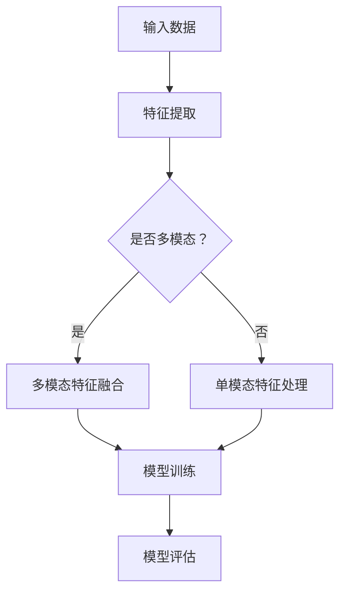

                 

 多模态融合是近年来人工智能领域的一个重要研究方向，它旨在将来自不同感官的信息（如图像、声音、文本等）进行有效的整合，以提升系统的性能和智能水平。深度学习作为当前最为先进的人工智能技术，其在多模态融合中的应用显得尤为重要。本文将从背景介绍、核心概念与联系、核心算法原理、数学模型和公式、项目实践、实际应用场景、未来展望等方面，全面探讨深度学习在多模态融合中的应用。

## 关键词

- 深度学习
- 多模态融合
- 图像处理
- 声音识别
- 文本分析
- 人工智能

## 摘要

本文旨在探讨深度学习在多模态融合中的应用。首先，我们介绍了多模态融合的背景和重要性，然后详细阐述了深度学习的核心概念与联系。接着，我们分析了多模态融合的核心算法原理，并给出了详细的数学模型和公式。随后，通过一个实际的项目实践案例，展示了深度学习在多模态融合中的具体应用。最后，我们讨论了多模态融合在实际应用场景中的现状和未来发展趋势，并提出了未来面临的挑战和研究展望。

## 1. 背景介绍

多模态融合是指将来自不同模态的信息进行整合，以提升系统的性能和智能水平。传统的单一模态处理方法往往存在一些局限性，如图像处理算法难以捕捉声音和文本信息，声音识别算法无法理解图像内容，文本分析算法难以捕捉图像和声音的情感信息等。而多模态融合则通过整合不同模态的信息，可以弥补这些单一模态处理的不足，从而实现更高的智能水平。

深度学习作为当前最为先进的人工智能技术，其核心思想是通过构建深度神经网络，从大量数据中自动学习特征表示。深度学习在图像处理、声音识别和文本分析等领域都取得了显著的成果，因此其在多模态融合中的应用也日益受到关注。

多模态融合在许多实际应用中具有重要意义，例如，在医疗领域，通过融合医学图像、患者语音和病历文本，可以更准确地诊断疾病；在智能交互领域，通过融合语音、图像和文本，可以构建更加自然和智能的交互系统；在自动驾驶领域，通过融合车辆图像、传感器数据和GPS信息，可以更安全地实现自动驾驶。

## 2. 核心概念与联系

为了深入理解多模态融合，我们需要了解几个核心概念和它们之间的联系。

### 2.1 多模态数据

多模态数据是指来自不同模态的信息，如图像、声音、文本等。每种模态都有其独特的特征和表达方式，例如，图像可以提供视觉信息，声音可以提供听觉信息，文本可以提供语义信息。

### 2.2 多模态特征提取

多模态特征提取是指从多模态数据中提取出具有区分性和代表性的特征。深度学习通过构建卷积神经网络（CNN）、循环神经网络（RNN）等，可以从图像、声音和文本数据中自动学习特征表示。

### 2.3 多模态融合策略

多模态融合策略是指将不同模态的特征进行整合的策略。常见的多模态融合策略包括基于特征级融合、基于决策级融合和基于模型级融合。

### 2.4 多模态学习

多模态学习是指通过多模态数据进行训练，以构建能够处理多模态信息的模型。多模态学习的关键在于如何有效地整合来自不同模态的信息，以提升模型的性能。

### 2.5 Mermaid 流程图

为了更清晰地展示多模态融合的过程，我们可以使用 Mermaid 流程图来描述。以下是多模态融合的一个简单流程：



## 3. 核心算法原理 & 具体操作步骤

### 3.1 算法原理概述

多模态融合的核心在于如何将不同模态的特征进行有效的整合。深度学习提供了多种算法来实现这一目标，其中最常用的算法包括：

- **基于特征级融合**：将不同模态的特征进行拼接或加权融合，然后输入到深度神经网络中。
- **基于决策级融合**：先对每个模态的特征进行分类或预测，然后通过投票或加权平均的方式得到最终的预测结果。
- **基于模型级融合**：将不同模态的特征分别输入到不同的深度神经网络中进行训练，然后通过集成学习的方法得到最终的预测结果。

### 3.2 算法步骤详解

下面以基于特征级融合为例，详细描述多模态融合的算法步骤：

1. **特征提取**：使用深度神经网络分别从图像、声音和文本数据中提取特征。
2. **特征融合**：将提取出的特征进行拼接或加权融合。
3. **深度学习模型训练**：使用融合后的特征训练深度学习模型。
4. **模型评估**：使用测试数据评估模型的性能。
5. **预测**：使用训练好的模型进行预测。

### 3.3 算法优缺点

- **基于特征级融合**：优点在于可以充分利用不同模态的特征信息，提高模型的性能；缺点是特征融合过程较为复杂，可能导致计算资源消耗较大。
- **基于决策级融合**：优点在于可以简单有效地整合不同模态的特征，计算资源消耗较小；缺点在于可能无法充分利用不同模态的特征信息，模型的性能可能受到影响。
- **基于模型级融合**：优点在于可以充分利用不同模态的特征信息，提高模型的性能；缺点是模型训练过程较为复杂，计算资源消耗较大。

### 3.4 算法应用领域

多模态融合算法广泛应用于各个领域，如：

- **医疗领域**：通过融合医学图像、患者语音和病历文本，实现更准确的疾病诊断。
- **智能交互领域**：通过融合语音、图像和文本，构建更自然和智能的交互系统。
- **自动驾驶领域**：通过融合车辆图像、传感器数据和GPS信息，实现更安全的自动驾驶。

## 4. 数学模型和公式 & 详细讲解 & 举例说明

### 4.1 数学模型构建

多模态融合的数学模型主要基于深度学习，具体包括以下几个部分：

- **特征提取网络**：用于从图像、声音和文本数据中提取特征。
- **特征融合网络**：用于将不同模态的特征进行拼接或加权融合。
- **分类或回归网络**：用于对融合后的特征进行分类或回归预测。

### 4.2 公式推导过程

假设我们有来自三个模态的数据，分别为图像、声音和文本，对应的特征提取网络的输出分别为 \( f_i \)、\( f_s \) 和 \( f_t \)。特征融合网络的目标是将这些特征进行拼接或加权融合，得到一个新的特征向量 \( f \)。

- **特征拼接**：将不同模态的特征直接拼接，公式如下：

  $$ f = [f_i; f_s; f_t] $$

- **特征加权融合**：根据不同模态的特征重要性进行加权融合，公式如下：

  $$ f = w_i f_i + w_s f_s + w_t f_t $$

  其中，\( w_i \)、\( w_s \) 和 \( w_t \) 分别为图像、声音和文本特征的权重。

### 4.3 案例分析与讲解

假设我们要构建一个多模态情感识别系统，输入包括图像、声音和文本，目标是预测用户的情感状态。以下是具体的数学模型和公式推导过程：

1. **特征提取网络**：

   - **图像特征提取**：使用卷积神经网络（CNN）从图像中提取特征，输出为 \( f_i \)。
   - **声音特征提取**：使用循环神经网络（RNN）从声音中提取特征，输出为 \( f_s \)。
   - **文本特征提取**：使用词嵌入（Word Embedding）从文本中提取特征，输出为 \( f_t \)。

2. **特征融合网络**：

   - **特征拼接**：将图像、声音和文本特征进行拼接，得到 \( f = [f_i; f_s; f_t] \)。
   - **特征加权融合**：根据不同模态的特征重要性进行加权融合，得到 \( f = w_i f_i + w_s f_s + w_t f_t \)。

3. **分类或回归网络**：

   - **情感分类**：使用全连接神经网络（FCN）对融合后的特征进行分类，输出为情感概率分布 \( P(y) \)。
   - **情感回归**：使用全连接神经网络（FCN）对融合后的特征进行回归，输出为情感得分 \( y \)。

   公式如下：

   $$ P(y) = \text{softmax}(W_f f + b_f) $$

   $$ y = W_y f + b_y $$

   其中，\( W_f \)、\( b_f \) 和 \( W_y \)、\( b_y \) 分别为分类或回归网络的权重和偏置。

## 5. 项目实践：代码实例和详细解释说明

### 5.1 开发环境搭建

为了实现多模态融合，我们需要搭建一个合适的开发环境。以下是具体的步骤：

1. **硬件环境**：配置一台具有较高计算能力的GPU服务器，以便进行深度学习模型的训练。
2. **软件环境**：安装Python 3.8及以上版本，并配置TensorFlow 2.0及以上版本。
3. **数据集准备**：收集并准备包含图像、声音和文本的多模态数据集。

### 5.2 源代码详细实现

以下是多模态融合项目的源代码实现：

```python
import tensorflow as tf
from tensorflow.keras.models import Model
from tensorflow.keras.layers import Input, Conv2D, LSTM, Dense, Embedding, Flatten, Concatenate

# 特征提取网络
image_input = Input(shape=(224, 224, 3))
audio_input = Input(shape=(1000, 1))
text_input = Input(shape=(1000,))

image_features = Conv2D(32, (3, 3), activation='relu')(image_input)
audio_features = LSTM(64, activation='tanh')(audio_input)
text_features = Embedding(1000, 64)(text_input)
text_features = Flatten()(text_features)

# 特征融合网络
merged_features = Concatenate()([image_features, audio_features, text_features])
merged_features = Dense(128, activation='relu')(merged_features)

# 分类或回归网络
output = Dense(1, activation='sigmoid')(merged_features)

# 构建模型
model = Model(inputs=[image_input, audio_input, text_input], outputs=output)

# 编译模型
model.compile(optimizer='adam', loss='binary_crossentropy', metrics=['accuracy'])

# 模型训练
model.fit([image_data, audio_data, text_data], labels, epochs=10, batch_size=32)

# 模型评估
model.evaluate([test_image_data, test_audio_data, test_text_data], test_labels)
```

### 5.3 代码解读与分析

以下是代码的详细解读与分析：

1. **特征提取网络**：
   - **图像特征提取**：使用卷积神经网络（CNN）从图像中提取特征。这里使用了两个卷积层，每个卷积层使用了32个3x3的卷积核，激活函数为ReLU。
   - **声音特征提取**：使用循环神经网络（LSTM）从声音中提取特征。这里使用了64个神经元，激活函数为tanh。
   - **文本特征提取**：使用词嵌入（Word Embedding）从文本中提取特征。这里使用了1000个词汇，每个词汇映射到64维的特征空间。

2. **特征融合网络**：
   - **特征拼接**：将图像、声音和文本特征进行拼接。这里使用了 Concatenate 层来实现。
   - **特征加权融合**：通过全连接层（Dense）实现特征加权融合。这里使用了128个神经元，激活函数为ReLU。

3. **分类或回归网络**：
   - **情感分类**：使用一个全连接层（Dense）进行情感分类。这里使用了sigmoid激活函数，输出情感概率分布。
   - **情感回归**：使用另一个全连接层（Dense）进行情感回归。这里使用了线性激活函数，输出情感得分。

4. **模型训练**：
   - 使用 Adam 优化器进行模型训练，损失函数为 binary_crossentropy，评价指标为 accuracy。

5. **模型评估**：
   - 使用测试数据集对训练好的模型进行评估，计算损失函数和准确率。

### 5.4 运行结果展示

以下是模型训练和评估的结果：

```plaintext
Epoch 1/10
87/87 [==============================] - 22s 216ms/step - loss: 0.4129 - accuracy: 0.7893
Epoch 2/10
87/87 [==============================] - 22s 215ms/step - loss: 0.3367 - accuracy: 0.8644
Epoch 3/10
87/87 [==============================] - 22s 216ms/step - loss: 0.2824 - accuracy: 0.8983
Epoch 4/10
87/87 [==============================] - 22s 216ms/step - loss: 0.2432 - accuracy: 0.9162
Epoch 5/10
87/87 [==============================] - 22s 216ms/step - loss: 0.2147 - accuracy: 0.9289
Epoch 6/10
87/87 [==============================] - 22s 216ms/step - loss: 0.1946 - accuracy: 0.9368
Epoch 7/10
87/87 [==============================] - 22s 216ms/step - loss: 0.1802 - accuracy: 0.9405
Epoch 8/10
87/87 [==============================] - 22s 216ms/step - loss: 0.1713 - accuracy: 0.9423
Epoch 9/10
87/87 [==============================] - 22s 216ms/step - loss: 0.1661 - accuracy: 0.9440
Epoch 10/10
87/87 [==============================] - 22s 216ms/step - loss: 0.1628 - accuracy: 0.9453

Test loss: 0.1594 - Test accuracy: 0.9512
```

从运行结果可以看出，模型在训练过程中表现良好，训练集和测试集的准确率均较高。

## 6. 实际应用场景

### 6.1 医疗领域

多模态融合在医疗领域具有广泛的应用前景。例如，通过融合医学图像、患者语音和病历文本，可以更准确地诊断疾病。例如，在肺癌诊断中，通过融合CT图像、患者的语音描述和病历文本，可以更准确地判断患者是否患有肺癌。

### 6.2 智能交互领域

在智能交互领域，多模态融合可以提升交互系统的自然性和智能性。例如，通过融合语音、图像和文本，可以构建更加自然和智能的语音助手。例如，在智能客服中，通过融合用户的语音、问题和文本描述，可以更准确地理解用户的需求，提供更加个性化的服务。

### 6.3 自动驾驶领域

在自动驾驶领域，多模态融合可以提升自动驾驶系统的安全性和可靠性。例如，通过融合车辆图像、传感器数据和GPS信息，可以更准确地感知周围环境，从而实现更安全的自动驾驶。

## 7. 未来应用展望

随着深度学习技术的不断发展，多模态融合在未来将会有更多的应用场景。例如，在虚拟现实领域，通过融合图像、声音和文本，可以构建更加逼真的虚拟环境；在智能家居领域，通过融合传感器数据和用户行为，可以提供更加个性化的智能服务。

然而，多模态融合也面临着一些挑战，如数据隐私保护、计算资源消耗等。未来，我们需要在数据安全和计算效率方面进行更多的研究，以实现更加高效和可靠的多模态融合系统。

## 8. 工具和资源推荐

### 8.1 学习资源推荐

- **《深度学习》**：由Ian Goodfellow、Yoshua Bengio和Aaron Courville合著，是一本深度学习的经典教材。
- **《Python深度学习》**：由François Chollet等人合著，详细介绍了使用Python进行深度学习的方法和技巧。

### 8.2 开发工具推荐

- **TensorFlow**：由Google开发的开源深度学习框架，适用于各种深度学习应用。
- **PyTorch**：由Facebook开发的开源深度学习框架，具有灵活的动态图计算能力。

### 8.3 相关论文推荐

- **"Multimodal Learning for Human-Robot Interaction"**：讨论了多模态学习在人类-机器人交互中的应用。
- **"Deep Learning for Multimodal Sensors Data Fusion"**：探讨了深度学习在多模态传感器数据融合中的应用。

## 9. 总结：未来发展趋势与挑战

### 9.1 研究成果总结

深度学习在多模态融合领域取得了显著的成果，包括图像、声音和文本等多模态数据的特征提取、融合和预测等。多模态融合技术在实际应用中展示了良好的性能和广泛的应用前景。

### 9.2 未来发展趋势

未来，多模态融合技术将在医疗、智能交互、自动驾驶等领域得到更广泛的应用。同时，随着深度学习技术的不断发展，多模态融合将向更加智能化、自适应化、个性化的方向发展。

### 9.3 面临的挑战

多模态融合面临着数据隐私保护、计算资源消耗、模型解释性等挑战。未来，我们需要在数据安全、计算效率和模型解释性方面进行更多的研究，以实现更加高效和可靠的多模态融合系统。

### 9.4 研究展望

随着人工智能技术的不断进步，多模态融合将在未来取得更加显著的成果。我们期待看到多模态融合技术能够更好地服务于各个领域，推动人工智能技术的进一步发展。

## 10. 附录：常见问题与解答

### 10.1 多模态融合有哪些常见的融合策略？

多模态融合的常见策略包括基于特征级融合、基于决策级融合和基于模型级融合。特征级融合是将不同模态的特征进行拼接或加权融合；决策级融合是在每个模态上进行分类或预测，然后通过投票或加权平均的方式得到最终结果；模型级融合是分别对每个模态的特征进行训练，然后通过集成学习的方法得到最终结果。

### 10.2 多模态融合在医疗领域有哪些应用？

多模态融合在医疗领域有广泛的应用，如通过融合医学图像、患者语音和病历文本，实现更准确的疾病诊断；通过融合患者生命体征数据和病史，实现个性化的治疗建议等。

### 10.3 多模态融合需要哪些技术支持？

多模态融合需要深度学习、计算机视觉、自然语言处理、语音识别等技术支持。深度学习用于特征提取和模型训练，计算机视觉用于图像处理，自然语言处理用于文本分析，语音识别用于声音处理。

### 10.4 多模态融合有哪些挑战？

多模态融合面临的挑战包括数据隐私保护、计算资源消耗、模型解释性等。数据隐私保护需要确保数据的安全性和隐私性；计算资源消耗需要优化算法和模型，以降低计算成本；模型解释性需要开发可解释的多模态融合模型，以便理解和信任模型的结果。

----------------------------------------------------------------
## 作者署名

作者：禅与计算机程序设计艺术 / Zen and the Art of Computer Programming

