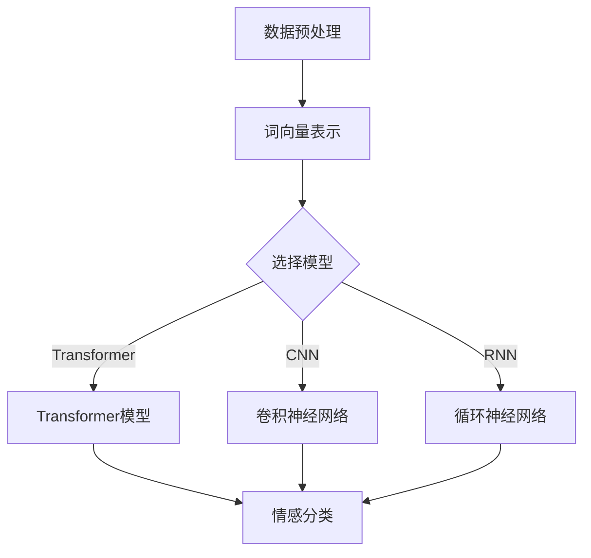

                 

关键词：深度学习，情感分析，自然语言处理，神经网络，文本分类，情感识别，前沿技术

> 摘要：本文旨在探讨深度学习在情感分析领域的最新进展与应用，分析当前前沿技术的原理、实现与应用场景，展望未来发展的趋势与挑战。文章将涵盖从基础概念到具体算法实现，再到实际应用的全面介绍。

## 1. 背景介绍

### 1.1 情感分析的定义与应用

情感分析（Sentiment Analysis）是一种自然语言处理技术，旨在识别和提取文本中的主观信息，通常用来判断文本是积极的、消极的，还是中性的。情感分析在商业、媒体、社交网络等领域有着广泛的应用，如舆情监测、客户满意度分析、市场趋势预测等。

### 1.2 深度学习的发展历程

深度学习作为人工智能的重要分支，自2012年AlexNet在ImageNet竞赛中取得突破性成绩以来，取得了飞速发展。深度学习模型，如卷积神经网络（CNN）、循环神经网络（RNN）、长短期记忆网络（LSTM）和Transformer等，已经在图像识别、语音识别、自然语言处理等多个领域取得了显著的成果。

## 2. 核心概念与联系

### 2.1 自然语言处理与情感分析

自然语言处理（NLP）是使计算机能够理解、解释和生成人类语言的技术。情感分析作为NLP的一个重要子领域，需要结合词向量表示、语言模型、文本分类等技术。

### 2.2 情感分析中的深度学习模型

深度学习模型在情感分析中发挥着关键作用。以下是一些常见的深度学习模型：

- **卷积神经网络（CNN）**：通过卷积层捕捉文本中的局部特征，适用于处理序列数据。
- **循环神经网络（RNN）**：特别是LSTM和GRU，能够处理变长的序列数据，捕捉文本中的长距离依赖关系。
- **Transformer模型**：引入了自注意力机制，能够在处理长文本时保持较高的性能。

### 2.3 Mermaid 流程图

以下是一个简化的Mermaid流程图，展示了情感分析中的主要步骤和深度学习模型的应用：



## 3. 核心算法原理 & 具体操作步骤

### 3.1 算法原理概述

情感分析的核心在于将文本转换为数字表示，然后使用机器学习模型进行分类。以下是一些常见的算法：

- **词袋模型（Bag of Words, BOW）**：将文本表示为单词的集合，不考虑单词的顺序。
- **TF-IDF**：考虑单词在文本中的频率和它在整个语料库中的重要性。
- **深度学习模型**：如CNN、RNN、Transformer，用于捕捉文本的深层特征。

### 3.2 算法步骤详解

1. 数据预处理：包括文本清洗、分词、去除停用词等。
2. 词向量表示：将单词转换为向量表示，如使用Word2Vec、GloVe等方法。
3. 模型选择：根据任务特点选择合适的深度学习模型。
4. 训练模型：使用标注数据进行训练。
5. 情感分类：将新的文本输入模型，得到情感分类结果。

### 3.3 算法优缺点

- **词袋模型**：简单高效，但忽略了单词顺序。
- **TF-IDF**：考虑了单词的重要性，但同样忽略了单词顺序。
- **深度学习模型**：能够捕捉复杂的文本特征，但训练时间较长。

### 3.4 算法应用领域

深度学习在情感分析中有着广泛的应用，包括但不限于：

- **社交媒体分析**：分析用户评论、微博等文本数据，了解公众情绪。
- **客户满意度分析**：通过分析客户反馈，了解客户对产品的满意度。
- **市场趋势预测**：分析新闻、报告等文本数据，预测市场趋势。

## 4. 数学模型和公式 & 详细讲解 & 举例说明

### 4.1 数学模型构建

情感分析通常涉及以下数学模型：

- **卷积神经网络（CNN）**：输入为词向量矩阵，输出为情感分类结果。
- **循环神经网络（RNN）**：输入为序列数据，输出为情感分类结果。

### 4.2 公式推导过程

以卷积神经网络为例，其基本公式如下：

\[ h^{(l)} = \sigma(W^{(l)} \cdot h^{(l-1)} + b^{(l)}) \]

其中，\( h^{(l)} \) 为第 \( l \) 层的激活值，\( W^{(l)} \) 和 \( b^{(l)} \) 分别为权重和偏置。

### 4.3 案例分析与讲解

假设我们有一个简单的文本数据集，包含以下两句话：

1. "I love this product."
2. "This product is terrible."

我们使用Word2Vec模型将文本转换为词向量，然后输入到CNN中进行情感分类。假设我们选择的CNN模型如下：

\[ \text{Input}:\text{ [w1, w2, w3, ..., wn]} \]
\[ \text{Output}:\text{ [pos, neu, neg]} \]

经过多层的卷积和池化操作，我们最终得到情感分类结果。

## 5. 项目实践：代码实例和详细解释说明

### 5.1 开发环境搭建

本文使用Python编程语言，结合TensorFlow库实现情感分析模型。首先，我们需要安装相关的依赖：

```bash
pip install tensorflow numpy matplotlib
```

### 5.2 源代码详细实现

以下是一个简单的情感分析模型实现：

```python
import tensorflow as tf
from tensorflow.keras.models import Sequential
from tensorflow.keras.layers import Conv1D, MaxPooling1D, Flatten, Dense

# 模型定义
model = Sequential([
    Conv1D(filters=128, kernel_size=5, activation='relu', input_shape=(max_features, embedding_dim)),
    MaxPooling1D(pool_size=5),
    Flatten(),
    Dense(units=128, activation='relu'),
    Dense(units=3, activation='softmax')
])

# 模型编译
model.compile(optimizer='adam', loss='categorical_crossentropy', metrics=['accuracy'])

# 模型训练
model.fit(X_train, y_train, epochs=10, batch_size=32, validation_data=(X_val, y_val))
```

### 5.3 代码解读与分析

上述代码定义了一个简单的卷积神经网络模型，用于情感分类。首先，我们定义了一个顺序模型（Sequential），然后添加了卷积层（Conv1D）、池化层（MaxPooling1D）、展平层（Flatten）和全连接层（Dense）。接下来，我们编译模型并使用训练数据对其进行训练。

### 5.4 运行结果展示

在训练完成后，我们可以使用测试数据集来评估模型的性能。以下是一个简单的示例：

```python
test_loss, test_acc = model.evaluate(X_test, y_test)
print(f"Test accuracy: {test_acc}")
```

## 6. 实际应用场景

### 6.1 社交媒体情感分析

社交媒体平台（如Twitter、微博）上的情感分析可以帮助企业了解公众对其品牌和产品的态度，从而进行市场策略调整。

### 6.2 客户满意度分析

通过分析客户反馈，企业可以了解客户对其产品或服务的满意度，从而改进产品质量和客户服务。

### 6.3 市场趋势预测

通过分析新闻报道、市场报告等文本数据，投资者可以预测市场趋势，做出更明智的投资决策。

## 7. 工具和资源推荐

### 7.1 学习资源推荐

- 《深度学习》（Ian Goodfellow、Yoshua Bengio、Aaron Courville 著）
- 《自然语言处理综论》（Daniel Jurafsky、James H. Martin 著）
- 《Python深度学习》（François Chollet 著）

### 7.2 开发工具推荐

- TensorFlow：用于构建和训练深度学习模型的强大工具。
- Keras：基于TensorFlow的简单高效的深度学习框架。
- NLTK：用于自然语言处理的Python库。

### 7.3 相关论文推荐

- "Deep Learning for Text Classification"（Kouame et al., 2017）
- "Convolutional Neural Networks for Sentence Classification"（Kim, 2014）
- "Recurrent Neural Networks for Sentence Classification"（Lai et al., 2015）

## 8. 总结：未来发展趋势与挑战

### 8.1 研究成果总结

深度学习在情感分析领域取得了显著的成果，包括模型性能的提升、应用场景的扩展等。未来，深度学习将继续在这一领域发挥重要作用。

### 8.2 未来发展趋势

- **多模态情感分析**：结合文本、图像、语音等多模态数据，提高情感分析的准确性和全面性。
- **自适应情感分析**：根据用户的反馈动态调整情感分析模型，提高用户体验。

### 8.3 面临的挑战

- **数据标注成本**：高质量的数据标注是深度学习模型训练的基础，但标注过程成本高、耗时。
- **模型解释性**：深度学习模型的“黑盒”特性使其难以解释，这限制了其在某些领域的应用。

### 8.4 研究展望

随着深度学习技术的不断发展，未来情感分析将更加精准、高效，为各行业提供更强大的数据支持。

## 9. 附录：常见问题与解答

### 9.1 情感分析中的“情感”具体指什么？

“情感”通常指文本中的主观倾向，包括积极情感（如喜爱、满意）、消极情感（如厌恶、不满意）和中性情感。

### 9.2 深度学习模型在情感分析中的优势是什么？

深度学习模型能够自动从大量数据中学习特征，具有较强的泛化能力，能够处理复杂的文本数据。

### 9.3 如何解决情感分析中的数据标注问题？

可以通过半监督学习、迁移学习等技术，减少对高质量标注数据的依赖。

作者：禅与计算机程序设计艺术 / Zen and the Art of Computer Programming
----------------------------------------------------------------

