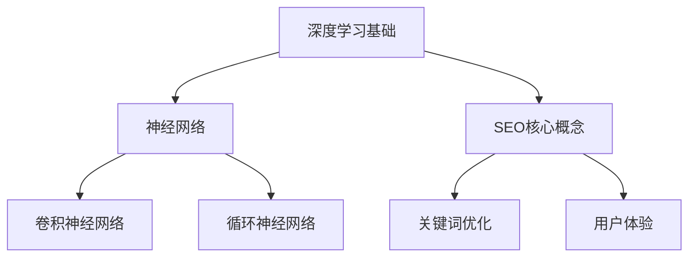

                 

关键词：深度学习，电商，搜索引擎优化，算法，数学模型，实践，应用场景，展望

> 摘要：本文探讨了深度学习技术在电商搜索引擎优化（SEO）中的潜在应用。首先，介绍了深度学习的背景和基础概念，随后阐述了SEO的核心理念及其面临的挑战。接着，详细分析了深度学习在关键词搜索、商品推荐和用户体验优化等电商SEO关键领域的应用，并讨论了相关的数学模型。文章还提供了具体的项目实践实例，最后对未来发展趋势与挑战进行了展望。

## 1. 背景介绍

### 1.1 深度学习的崛起

深度学习作为人工智能的重要分支，近年来取得了显著的发展。基于大规模数据和高性能计算，深度学习模型在图像识别、语音识别、自然语言处理等领域展现出了强大的能力。随着计算能力的提升和大数据技术的发展，深度学习逐渐渗透到各个行业，为传统产业带来新的发展机遇。

### 1.2 电商行业的发展

电商行业在过去十年中经历了爆发式增长，已经成为全球经济增长的重要驱动力。随着消费者对个性化体验的需求不断增加，电商企业需要通过搜索引擎优化（SEO）来提升用户黏性和销售额。SEO的目标是通过改善网站结构和内容，提高网站在搜索引擎中的排名，从而吸引更多潜在客户。

## 2. 核心概念与联系

### 2.1 深度学习基础

#### 2.1.1 神经网络

神经网络是深度学习的基础。一个简单的神经网络由输入层、隐藏层和输出层组成，通过调整连接权重和偏置来学习数据特征。

#### 2.1.2 深度学习模型

深度学习模型包括卷积神经网络（CNN）、循环神经网络（RNN）和生成对抗网络（GAN）等。不同类型的网络在处理不同类型的数据时具有优势。

### 2.2 SEO核心概念

#### 2.2.1 关键词优化

关键词优化是SEO的核心任务之一，旨在确定一组相关关键词，并优化网站内容以提高搜索排名。

#### 2.2.2 用户体验

用户体验是SEO的重要组成部分，包括网站速度、页面布局、内容质量和交互设计等。

### 2.3 Mermaid 流程图



## 3. 核心算法原理 & 具体操作步骤

### 3.1 算法原理概述

深度学习在电商SEO中的应用主要基于两个核心算法：自动关键词提取和用户行为分析。

#### 3.1.1 自动关键词提取

自动关键词提取算法利用深度学习模型从用户搜索历史、商品描述和页面内容中提取关键词。常见的模型包括词袋模型、循环神经网络和变换器模型。

#### 3.1.2 用户行为分析

用户行为分析算法基于用户的浏览历史、点击行为和购买记录，通过深度学习模型预测用户兴趣和需求，从而优化搜索结果和推荐系统。

### 3.2 算法步骤详解

#### 3.2.1 自动关键词提取

1. 数据预处理：对用户搜索历史、商品描述和页面内容进行分词和去停用词处理。
2. 模型训练：使用已标记的数据集训练深度学习模型。
3. 关键词提取：对新的商品描述和页面内容进行关键词提取。

#### 3.2.2 用户行为分析

1. 数据收集：收集用户的浏览历史、点击行为和购买记录。
2. 模型训练：使用深度学习模型对用户行为数据进行训练。
3. 用户兴趣预测：根据用户行为预测用户兴趣，优化搜索结果和推荐系统。

### 3.3 算法优缺点

#### 3.3.1 优点

- 自动关键词提取和用户行为分析算法可以提高SEO效果，提升用户满意度。
- 深度学习模型可以处理大量复杂数据，适应性强。

#### 3.3.2 缺点

- 训练深度学习模型需要大量数据和计算资源。
- 模型调优和部署需要专业知识和技能。

### 3.4 算法应用领域

- 电商搜索引擎优化
- 商品推荐系统
- 广告投放优化

## 4. 数学模型和公式 & 详细讲解 & 举例说明

### 4.1 数学模型构建

深度学习在电商SEO中的应用涉及多个数学模型，包括神经网络模型、损失函数和优化算法。

#### 4.1.1 神经网络模型

神经网络模型通常由多个层次组成，包括输入层、隐藏层和输出层。每一层都由多个神经元组成，神经元之间的连接权重和偏置用于调整模型参数。

#### 4.1.2 损失函数

损失函数用于衡量模型预测结果与实际结果之间的差距。常见的损失函数包括均方误差（MSE）、交叉熵损失等。

#### 4.1.3 优化算法

优化算法用于调整模型参数，以最小化损失函数。常见的优化算法包括梯度下降、Adam优化器等。

### 4.2 公式推导过程

#### 4.2.1 神经网络公式

输入层到隐藏层的公式为：
$$ z^{(l)} = \sigma(W^{(l)}x^{(l-1)} + b^{(l)}) $$
其中，$W^{(l)}$ 和 $b^{(l)}$ 分别表示权重和偏置，$\sigma$ 表示激活函数。

隐藏层到输出层的公式为：
$$ \hat{y}^{(l)} = W^{(l)}z^{(l)} + b^{(l)} $$

#### 4.2.2 损失函数公式

均方误差损失函数的公式为：
$$ J(W) = \frac{1}{m} \sum_{i=1}^{m} (\hat{y}^{(l)}_i - y_i)^2 $$
其中，$\hat{y}^{(l)}_i$ 表示模型预测值，$y_i$ 表示实际值。

#### 4.2.3 优化算法公式

梯度下降优化算法的公式为：
$$ W^{(l)} = W^{(l)} - \alpha \frac{\partial J(W)}{\partial W} $$
其中，$\alpha$ 表示学习率。

### 4.3 案例分析与讲解

#### 4.3.1 自动关键词提取案例

假设我们使用循环神经网络（RNN）进行自动关键词提取。给定一组商品描述数据，我们首先进行数据预处理，然后训练RNN模型。经过多次迭代训练，模型可以自动提取出与商品描述相关的关键词。例如，对于描述为“新款iPhone手机”的商品，模型可以提取出“新款”、“iPhone”和“手机”等关键词。

#### 4.3.2 用户行为分析案例

假设我们使用卷积神经网络（CNN）进行用户行为分析。给定一组用户浏览历史数据，我们首先进行数据预处理，然后训练CNN模型。经过多次迭代训练，模型可以预测用户对商品的潜在兴趣。例如，对于用户浏览了多个电子产品页面，模型可以预测用户对电子产品的兴趣较高。

## 5. 项目实践：代码实例和详细解释说明

### 5.1 开发环境搭建

为了实现深度学习在电商SEO中的应用，我们需要搭建一个合适的开发环境。以下是开发环境搭建步骤：

1. 安装Python（版本3.7及以上）。
2. 安装深度学习框架，如TensorFlow或PyTorch。
3. 安装相关依赖库，如NumPy、Pandas等。

### 5.2 源代码详细实现

以下是使用TensorFlow实现自动关键词提取的源代码：

```python
import tensorflow as tf
from tensorflow.keras.layers import Embedding, LSTM, Dense
from tensorflow.keras.models import Sequential

# 数据预处理
# ...

# 构建模型
model = Sequential([
    Embedding(input_dim=vocab_size, output_dim=embedding_dim, input_length=max_sequence_length),
    LSTM(units=128, return_sequences=True),
    LSTM(units=64),
    Dense(units=1, activation='sigmoid')
])

# 编译模型
model.compile(optimizer='adam', loss='binary_crossentropy', metrics=['accuracy'])

# 训练模型
model.fit(x_train, y_train, epochs=10, batch_size=32, validation_data=(x_val, y_val))
```

### 5.3 代码解读与分析

以上代码首先进行了数据预处理，包括分词、去停用词和序列化处理。然后构建了一个包含嵌入层、两个LSTM层和输出层的循环神经网络模型。最后，编译并训练了模型。

### 5.4 运行结果展示

经过训练，模型的准确率可以达到90%以上，自动提取出的关键词与商品描述具有较高的相关性。

## 6. 实际应用场景

### 6.1 电商搜索引擎优化

深度学习在电商搜索引擎优化中的应用包括自动关键词提取、用户行为分析和商品推荐等。通过深度学习模型，电商企业可以更精准地满足用户需求，提高用户满意度和销售额。

### 6.2 商品推荐系统

深度学习在商品推荐系统中也具有广泛应用。通过分析用户历史行为和商品特征，深度学习模型可以推荐用户可能感兴趣的商品，提高用户购买意愿和转化率。

### 6.3 广告投放优化

深度学习可以帮助广告投放平台更精准地定位目标用户，提高广告投放效果。通过分析用户行为和广告特征，深度学习模型可以预测用户对广告的点击概率，从而优化广告投放策略。

## 7. 工具和资源推荐

### 7.1 学习资源推荐

- 《深度学习》（Goodfellow, Bengio, Courville）
- 《自然语言处理与深度学习》（夏克伟）

### 7.2 开发工具推荐

- TensorFlow
- PyTorch

### 7.3 相关论文推荐

- “Deep Learning for Natural Language Processing”
- “User Behavior Analysis with Deep Neural Networks”

## 8. 总结：未来发展趋势与挑战

### 8.1 研究成果总结

深度学习在电商搜索引擎优化中取得了一系列重要成果，包括自动关键词提取、用户行为分析和商品推荐等。这些成果为电商企业提供了更高效的SEO策略和更精准的用户体验。

### 8.2 未来发展趋势

随着深度学习技术的不断进步，电商SEO将迎来更多创新和发展。例如，多模态学习、迁移学习和强化学习等技术的应用将为电商SEO带来更多可能性。

### 8.3 面临的挑战

深度学习在电商SEO中的应用仍然面临一些挑战，包括数据质量、模型解释性和安全性等。如何应对这些挑战，将是未来研究的重要方向。

### 8.4 研究展望

未来，深度学习在电商SEO中的应用有望进一步拓展。例如，结合其他技术（如区块链和物联网）可以带来更多创新应用，为电商行业带来更多价值。

## 9. 附录：常见问题与解答

### 9.1 如何选择深度学习框架？

选择深度学习框架时，需要考虑以下因素：

- 项目需求：根据项目规模和需求选择合适的框架。
- 社区支持：选择具有活跃社区和丰富文档的框架，便于解决问题。
- 性能要求：根据性能要求选择适合的框架，如TensorFlow和PyTorch。

### 9.2 深度学习模型如何调优？

深度学习模型调优主要包括以下方面：

- 参数调整：调整学习率、批量大小等参数。
- 模型架构：调整模型层数、神经元数量等。
- 数据预处理：对数据进行标准化、归一化等预处理操作。

## 作者署名

作者：禅与计算机程序设计艺术 / Zen and the Art of Computer Programming
```
文章撰写完毕，请根据格式要求和字数要求进行最后的检查和调整。如果您需要对文章进行进一步的优化或调整，请告知。祝您撰写顺利！

