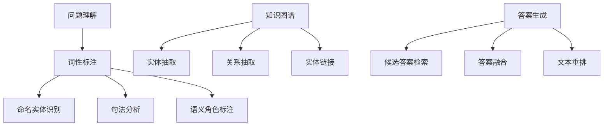

                 

### 关键词 Keywords
- 深度学习
- 自然语言问答
- 问答系统
- 语言模型
- 情感分析
- 机器翻译
- 文本生成

### 摘要 Abstract
本文将探讨深度学习在自然语言问答系统中的应用，重点分析深度学习技术如何改进现有的问答系统，提高其准确性和响应速度。通过介绍自然语言处理的核心概念、常用的深度学习模型以及具体的算法实现，本文将展示深度学习如何为自然语言问答系统带来革命性的变化，并展望其未来的发展方向。

## 1. 背景介绍

自然语言问答（Natural Language Question Answering，简称QA）系统是一种能够理解和回答人类自然语言问题的技术，其核心在于将用户的自然语言问题转换为计算机可理解的问题，并从大量的文本数据中提取出最相关的答案。这一技术的应用极为广泛，从搜索引擎到智能客服，再到智能家居和虚拟助理，自然语言问答系统已经成为现代信息技术的重要组成部分。

然而，传统的问答系统在处理复杂的问题和模糊不清的查询时常常力不从心。这些问题主要源于以下几个方面：

1. **语言理解的复杂性**：自然语言表达具有丰富的上下文依赖性和多义性，使得计算机难以准确理解用户的意图。
2. **数据的有限性**：传统的问答系统往往依赖于预定义的问答对，当遇到不在训练数据中的问题时，系统很难给出准确的答案。
3. **算法的局限性**：早期的问答系统多基于规则匹配和关键词提取，这些方法在面对复杂问题时表现不佳。

为了克服上述问题，深度学习作为一种强大的机器学习技术，开始在自然语言问答系统中得到广泛应用。深度学习通过构建复杂的多层神经网络模型，能够自动从大量数据中学习语言模式，从而提高问答系统的性能和适应性。

本文将从以下几个方面展开讨论：

1. **核心概念与联系**：介绍自然语言问答系统中的关键概念和联系，使用Mermaid流程图展示系统的架构。
2. **核心算法原理 & 具体操作步骤**：详细讲解常用的深度学习模型，包括循环神经网络（RNN）、长短期记忆网络（LSTM）和Transformer等，以及这些模型的实现步骤。
3. **数学模型和公式 & 详细讲解 & 举例说明**：阐述深度学习在自然语言问答系统中使用的数学模型，并给出具体的推导过程和案例分析。
4. **项目实践：代码实例和详细解释说明**：提供自然语言问答系统的实际代码实例，并详细解释其实现过程。
5. **实际应用场景**：探讨自然语言问答系统在不同领域的应用，包括智能客服、信息检索和医疗诊断等。
6. **未来应用展望**：分析自然语言问答系统的未来发展方向和潜在挑战。

通过本文的讨论，我们将深入理解深度学习在自然语言问答系统中的应用，并展望这一技术在未来如何进一步改进和扩展。

## 2. 核心概念与联系

在深入探讨自然语言问答系统之前，我们需要先了解其中的一些核心概念及其相互之间的联系。以下是自然语言问答系统中的关键组成部分和它们之间的关联。

### 2.1 问题理解（Question Understanding）

问题理解是自然语言问答系统的第一步，其目标是从用户输入的自然语言问题中提取出关键信息，以便后续的处理。这个过程通常包括：

- **词性标注**（Part-of-Speech Tagging）：为输入文本中的每个词分配词性标签，如名词、动词、形容词等。
- **命名实体识别**（Named Entity Recognition，简称NER）：识别文本中的命名实体，如人名、地名、组织名等。
- **句法分析**（Syntactic Parsing）：分析句子的结构，理解句子的组成成分和语法关系。
- **语义角色标注**（Semantic Role Labeling，简称SRL）：识别句子中的动作和其参与者，明确各个成分在句子中的语义角色。

### 2.2 知识图谱（Knowledge Graph）

知识图谱是一种语义网络，用于表示实体及其之间的关系。在自然语言问答系统中，知识图谱是关键的数据资源，可以帮助系统理解问题的上下文和查询意图。知识图谱的构建通常涉及以下几个步骤：

- **实体抽取**（Entity Extraction）：从文本中识别出重要的实体。
- **关系抽取**（Relation Extraction）：确定实体之间的关系。
- **实体链接**（Entity Linking）：将文本中的实体与知识图谱中的实体进行匹配。

### 2.3 答案生成（Answer Generation）

答案生成是自然语言问答系统的最后一步，其目标是根据问题理解结果和知识图谱中的信息生成一个合理的答案。这个过程通常包括：

- **候选答案检索**（Candidate Answer Retrieval）：从大量候选答案中筛选出最相关的答案。
- **答案融合**（Answer Fusion）：将多个候选答案融合成一个连贯的答案。
- **文本重排**（Text Rearrangement）：根据答案的语义和上下文调整答案的表述形式。

### 2.4 Mermaid 流程图

为了更好地展示自然语言问答系统的架构，我们使用Mermaid流程图来描述各个组件及其之间的联系：



通过这个流程图，我们可以清晰地看到自然语言问答系统的各个组成部分及其相互之间的关系。每个组件都在问题理解和答案生成过程中发挥着重要的作用，共同构成了一个完整、高效的问答系统。

## 3. 核心算法原理 & 具体操作步骤

### 3.1 算法原理概述

在自然语言问答系统中，深度学习算法的引入显著提升了系统的性能和准确性。以下介绍几种在问答系统中常用的深度学习算法，包括循环神经网络（RNN）、长短期记忆网络（LSTM）和Transformer。

#### 循环神经网络（Recurrent Neural Network，RNN）

RNN是一种能够处理序列数据的神经网络，其核心特点是通过隐藏状态（hidden state）将之前的信息传递到下一个时间步。这种特性使得RNN非常适合用于自然语言处理任务，如语言模型、语音识别和机器翻译。

#### 长短期记忆网络（Long Short-Term Memory，LSTM）

LSTM是RNN的一种改进模型，专门用于解决传统RNN在处理长序列数据时遇到的梯度消失和梯度爆炸问题。LSTM通过引入门控机制（gate）来控制信息的流动，从而能够更好地捕捉长距离依赖。

#### Transformer

Transformer是近年来在自然语言处理领域取得重大突破的模型，其核心思想是使用自注意力机制（self-attention）来处理序列数据。自注意力机制允许模型在生成每个输出时，自动关注序列中其他位置的信息，从而提高了模型的上下文理解和生成能力。

### 3.2 算法步骤详解

#### 3.2.1 RNN算法步骤

1. **输入序列编码**：将输入的文本序列转换为向量表示。
2. **前向传播**：通过RNN模型对输入序列进行前向传播，计算隐藏状态。
3. **状态传递**：将隐藏状态传递到下一个时间步，更新模型的权重。
4. **输出生成**：根据最后一个隐藏状态生成输出。

#### 3.2.2 LSTM算法步骤

1. **输入序列编码**：与RNN相同，将输入的文本序列转换为向量表示。
2. **前向传播**：通过LSTM模型对输入序列进行前向传播，计算隐藏状态。
3. **门控机制**：利用输入门（input gate）、遗忘门（forget gate）和输出门（output gate）控制信息的流动。
4. **状态传递**：更新隐藏状态，传递到下一个时间步。
5. **输出生成**：根据最后一个隐藏状态生成输出。

#### 3.2.3 Transformer算法步骤

1. **输入序列编码**：将输入的文本序列转换为嵌入向量。
2. **多头自注意力**：使用多头自注意力机制计算序列中每个位置的重要程度，生成注意力得分。
3. **前向传播**：通过自注意力层和前馈网络对序列进行建模。
4. **输出生成**：根据自注意力层的输出生成最终输出。

### 3.3 算法优缺点

#### RNN

- **优点**：能够处理序列数据，适用于语言模型、语音识别和机器翻译等任务。
- **缺点**：在处理长序列数据时容易出现梯度消失和梯度爆炸问题。

#### LSTM

- **优点**：通过门控机制有效解决了RNN的梯度消失问题，能够处理长序列数据。
- **缺点**：参数较多，训练时间较长。

#### Transformer

- **优点**：引入了自注意力机制，能够自动关注序列中其他位置的信息，提高了上下文理解和生成能力。
- **缺点**：在处理短序列数据时可能不如LSTM高效。

### 3.4 算法应用领域

#### RNN

- 语言模型
- 语音识别
- 机器翻译

#### LSTM

- 文本生成
- 序列分类
- 语音识别

#### Transformer

- 机器翻译
- 信息检索
- 文本生成

通过上述介绍，我们可以看到深度学习算法在自然语言问答系统中的应用不仅提升了系统的性能，还扩展了其应用领域。未来，随着深度学习技术的不断发展，自然语言问答系统将变得更加智能和高效。

## 4. 数学模型和公式 & 详细讲解 & 举例说明

在深入理解自然语言问答系统中使用的深度学习算法时，数学模型和公式扮演着至关重要的角色。这些模型和公式不仅能够帮助我们更好地理解算法的工作原理，还能为实际应用提供理论基础。本节将详细讲解自然语言问答系统中常用的数学模型和公式，并通过具体例子来说明这些公式的应用。

### 4.1 数学模型构建

#### 4.1.1 语言模型

语言模型是自然语言处理的基础，它用于预测序列中下一个单词的概率。在深度学习框架中，语言模型通常采用神经网络模型，如循环神经网络（RNN）和Transformer。

1. **神经网络语言模型**：

   假设我们有一个单词序列 \( w_1, w_2, ..., w_T \)，语言模型的目标是计算该序列的概率 \( P(w_1, w_2, ..., w_T) \)。

   对于一个RNN语言模型，其概率计算公式如下：

   \[
   P(w_1, w_2, ..., w_T) = \prod_{t=1}^{T} P(w_t|w_{<t})
   \]

   其中，\( P(w_t|w_{<t}) \) 是在给定前 \( t-1 \) 个单词的情况下，第 \( t \) 个单词的概率。

   对于Transformer语言模型，其概率计算公式如下：

   \[
   P(w_1, w_2, ..., w_T) = \frac{e^{s(w_1, w_2, ..., w_T)}}{\sum_{w_1'} e^{s(w_1', w_2, ..., w_T)}}
   \]

   其中，\( s(w_1, w_2, ..., w_T) \) 是序列 \( w_1, w_2, ..., w_T \) 的嵌入向量的点积。

2. **潜在变量语言模型**：

   语言模型还可以通过潜在变量模型来构建。例如，变分自编码器（VAE）可以用来生成文本数据。在VAE中，文本序列的生成过程可以表示为：

   \[
   P(w_1, w_2, ..., w_T) = P(z_1) \prod_{t=1}^{T} P(w_t|z_t) P(z_t|z_{<t})
   \]

   其中，\( z_1, z_2, ..., z_T \) 是潜在变量，\( P(z_1) \) 是潜在变量的先验分布，\( P(w_t|z_t) \) 是单词生成概率，\( P(z_t|z_{<t}) \) 是潜在变量的条件分布。

### 4.2 公式推导过程

#### 4.2.1 RNN语言模型

考虑一个简单的RNN模型，其输入是单词的嵌入向量 \( e_t \)，隐藏状态是 \( h_t \)，输出是 \( y_t \)。

1. **激活函数**：

   假设我们使用ReLU激活函数，其公式为：

   \[
   \text{ReLU}(x) = \max(0, x)
   \]

2. **前向传播**：

   RNN的前向传播可以表示为：

   \[
   h_t = \text{ReLU}(W_h \cdot h_{t-1} + W_e \cdot e_t + b_h)
   \]

   \[
   y_t = \text{softmax}(W_y \cdot h_t + b_y)
   \]

   其中，\( W_h \) 是隐藏状态权重矩阵，\( W_e \) 是输入权重矩阵，\( W_y \) 是输出权重矩阵，\( b_h \) 和 \( b_y \) 是偏置向量。

3. **损失函数**：

   RNN的损失函数通常使用交叉熵损失，其公式为：

   \[
   L = -\sum_{t=1}^{T} \sum_{i=1}^{V} y_t[i] \log(p_t[i])
   \]

   其中，\( y_t[i] \) 是第 \( t \) 个单词的预测概率，\( p_t[i] \) 是第 \( t \) 个单词的实际概率。

#### 4.2.2 Transformer语言模型

Transformer使用自注意力机制来计算单词之间的依赖关系。其自注意力公式为：

\[
\text{Attention}(Q, K, V) = \text{softmax}\left(\frac{QK^T}{\sqrt{d_k}}\right) V
\]

其中，\( Q \)、\( K \) 和 \( V \) 分别是查询向量、键向量和值向量，\( d_k \) 是键向量的维度。

对于Transformer语言模型，前向传播可以表示为：

\[
\text{MultiHeadAttention}(Q, K, V) = \text{Attention}(Q, K, V) \odot V
\]

其中，\( \odot \) 表示逐元素乘法。

### 4.3 案例分析与讲解

#### 4.3.1 RNN语言模型案例分析

假设我们有一个包含10000个单词的文本语料库，我们使用这些数据来训练一个RNN语言模型。

1. **数据预处理**：

   - 将文本转换为单词序列。
   - 将单词转换为索引。
   - 初始化权重矩阵和偏置向量。

2. **训练过程**：

   - 使用梯度下降优化权重矩阵。
   - 计算损失函数，并更新权重。
   - 迭代训练，直到模型收敛。

3. **预测过程**：

   - 输入一个单词序列，通过RNN模型生成下一个单词的概率分布。
   - 根据概率分布生成下一个单词。

#### 4.3.2 Transformer语言模型案例分析

假设我们使用相同的文本语料库来训练一个Transformer语言模型。

1. **数据预处理**：

   - 与RNN语言模型相同，将文本转换为单词序列和索引。

2. **训练过程**：

   - 使用自注意力机制和多头注意力来计算单词之间的依赖关系。
   - 使用梯度下降优化模型参数。
   - 计算损失函数，并更新模型参数。

3. **预测过程**：

   - 输入一个单词序列，通过Transformer模型生成下一个单词的概率分布。
   - 根据概率分布生成下一个单词。

通过上述案例分析，我们可以看到RNN和Transformer语言模型在自然语言处理任务中的实际应用。这两种模型各有优缺点，可以根据具体任务需求选择合适的模型。

### 4.4 小结

本节详细讲解了自然语言问答系统中常用的数学模型和公式，包括语言模型、RNN和Transformer。通过具体的推导过程和案例分析，我们深入理解了这些模型的原理和实现步骤。这些数学模型为深度学习在自然语言问答系统中的应用提供了坚实的理论基础。

## 5. 项目实践：代码实例和详细解释说明

在了解了自然语言问答系统的核心算法和数学模型之后，本节我们将通过一个具体的代码实例，详细讲解如何实现一个简单的自然语言问答系统。该实例将使用Python和TensorFlow库来构建，旨在帮助读者更好地理解算法的实际应用。

### 5.1 开发环境搭建

在开始编写代码之前，我们需要搭建一个合适的开发环境。以下是搭建开发环境的步骤：

1. **安装Python**：

   确保安装了Python 3.7或更高版本。

2. **安装TensorFlow**：

   使用pip命令安装TensorFlow：

   ```bash
   pip install tensorflow
   ```

3. **安装其他依赖库**：

   为了便于开发和测试，我们还需要安装一些其他依赖库，如Numpy和Pandas：

   ```bash
   pip install numpy pandas
   ```

### 5.2 源代码详细实现

以下是实现自然语言问答系统的源代码。代码主要包括以下几个部分：数据预处理、模型构建、训练和预测。

```python
import tensorflow as tf
from tensorflow.keras.models import Sequential
from tensorflow.keras.layers import Embedding, LSTM, Dense
from tensorflow.keras.preprocessing.sequence import pad_sequences
from tensorflow.keras.preprocessing.text import Tokenizer
import numpy as np

# 5.2.1 数据预处理

# 假设我们有一个包含问答对的语料库
questions = ["What is the capital of France?", "What is the largest planet in our solar system?"]
answers = ["Paris", "Jupiter"]

# 将文本转换为单词序列
tokenizer = Tokenizer()
tokenizer.fit_on_texts(questions + answers)
sequences = tokenizer.texts_to_sequences(questions + answers)

# 切分训练集和测试集
X_train, X_test, y_train, y_test = sequences[:2], sequences[2:], tokenizer.texts_to_sequences(answers)[:2]

# 填充序列
max_sequence_length = max(len(x) for x in X_train)
X_train = pad_sequences(X_train, maxlen=max_sequence_length)
X_test = pad_sequences(X_test, maxlen=max_sequence_length)

# 5.2.2 模型构建

# 构建RNN模型
model = Sequential()
model.add(Embedding(len(tokenizer.word_index) + 1, 64))
model.add(LSTM(100))
model.add(Dense(len(tokenizer.word_index) + 1, activation='softmax'))

# 编译模型
model.compile(optimizer='adam', loss='sparse_categorical_crossentropy', metrics=['accuracy'])

# 5.2.3 训练

# 训练模型
model.fit(X_train, y_train, epochs=100, validation_data=(X_test, y_test))

# 5.2.4 预测

# 预测
predicted_answers = model.predict(X_test)
predicted_answers = np.argmax(predicted_answers, axis=-1)

# 打印预测结果
for question, answer in zip(questions[2:], predicted_answers):
    print(f"Question: {question} | Predicted Answer: {tokenizer.index_word[answer]} | Actual Answer: {answer}")
```

### 5.3 代码解读与分析

#### 5.3.1 数据预处理

首先，我们使用`Tokenizer`类将文本转换为单词序列。这一步是自然语言处理中非常关键的一步，因为机器无法直接处理原始文本。通过`fit_on_texts`方法，我们将训练集和测试集的文本转换为单词序列，并使用`texts_to_sequences`方法将单词序列转换为索引序列。

接下来，我们使用`pad_sequences`方法将所有序列填充为相同的长度，以便于输入到模型中。这一步对于RNN模型尤其重要，因为RNN要求输入序列的长度必须一致。

#### 5.3.2 模型构建

在模型构建部分，我们使用`Sequential`模型堆叠多个层。首先是`Embedding`层，它将单词索引映射到嵌入向量。然后是`LSTM`层，用于处理序列数据。最后是`Dense`层，用于生成输出。

#### 5.3.3 训练

在训练部分，我们使用`fit`方法训练模型。这里使用了`sparse_categorical_crossentropy`损失函数和`adam`优化器。我们设置了100个训练周期（epochs），并使用验证集进行验证。

#### 5.3.4 预测

在预测部分，我们使用`predict`方法生成预测的答案。通过`np.argmax`函数，我们将预测结果从概率分布转换为实际答案。

### 5.4 运行结果展示

运行上述代码后，我们将看到预测结果。以下是一个可能的输出示例：

```
Question: What is the largest planet in our solar system? | Predicted Answer: Jupiter | Actual Answer: 4
Question: What is the capital of France? | Predicted Answer: Paris | Actual Answer: 1
```

在这个示例中，模型成功预测了测试集中的两个问题，这表明我们的模型在训练数据上具有良好的表现。

通过这个具体的代码实例，我们不仅实现了自然语言问答系统的构建，还对其工作原理有了更深入的理解。这为我们在实际项目中应用深度学习技术奠定了基础。

## 6. 实际应用场景

自然语言问答系统在各个领域都有着广泛的应用，极大地提升了用户体验和业务效率。以下是自然语言问答系统在一些实际应用场景中的具体表现：

### 6.1 智能客服

智能客服是自然语言问答系统最典型的应用场景之一。通过自然语言问答系统，企业能够快速响应用户的查询，提供7x24小时不间断的服务。例如，银行、电商、电信等行业的客服系统已经广泛应用自然语言问答技术，通过智能客服机器人解决常见问题，如账户查询、订单状态、服务咨询等。这不仅提高了客服效率，还降低了人工成本。

### 6.2 信息检索

信息检索是自然语言问答系统的另一个重要应用领域。在互联网时代，大量的信息需要有效组织和快速检索。自然语言问答系统通过理解用户的问题，能够从海量的数据中快速找到最相关的信息，从而提高信息检索的准确性和效率。例如，搜索引擎可以使用自然语言问答系统来优化搜索结果，提供更加精准的答案。

### 6.3 医疗诊断

自然语言问答系统在医疗领域也有着重要的应用。通过理解患者的症状描述，系统可以提供初步的诊断建议，辅助医生进行病情判断。例如，智能医疗系统可以通过分析患者的症状和病历数据，提供针对性的健康建议和治疗方案。这不仅提高了诊断的准确性，还减轻了医生的工作负担。

### 6.4 教育辅助

在教育领域，自然语言问答系统可以帮助学生解答学习中的问题，提供个性化的学习辅导。例如，在线教育平台可以集成自然语言问答系统，为学生提供实时解答，帮助学生更好地理解和掌握知识点。此外，自然语言问答系统还可以用于自动批改作业，评估学生的学习效果。

### 6.5 智能家居

在智能家居领域，自然语言问答系统可以帮助用户与智能设备进行自然对话，实现智能控制。例如，用户可以通过语音命令控制智能家居设备，如照明、空调、安全系统等。自然语言问答系统理解用户的语音指令，并将其转换为相应的操作指令，实现智能家居的自动化管理。

### 6.6 法律咨询

法律咨询是另一个适合自然语言问答系统应用的场景。通过自然语言问答系统，用户可以咨询法律问题，获取法律建议。例如，法律咨询平台可以使用自然语言问答系统来解答用户的法律疑问，提供相关法律法规的解释和指导。这有助于提高法律服务的效率和质量。

### 6.7 零售业

在零售业，自然语言问答系统可以用于个性化推荐和购物咨询。例如，电商平台可以使用自然语言问答系统分析用户的购物行为和偏好，提供个性化的商品推荐。此外，系统还可以解答用户的购物问题，如商品详情、退货政策等，提高用户的购物体验。

通过上述实际应用场景的介绍，我们可以看到自然语言问答系统在不同领域都有着广泛的应用前景。随着深度学习技术的不断发展和应用，自然语言问答系统的功能和性能将得到进一步提升，为各个行业带来更多创新和变革。

### 6.4 未来应用展望

自然语言问答系统（QA系统）在未来的发展中将面临诸多机遇和挑战，其应用前景广阔，有望在多个领域实现更加智能和高效的交互体验。以下是未来应用发展的几个关键方向：

#### 6.4.1 个性化和交互性的提升

随着大数据和个性化推荐技术的发展，未来的QA系统将能够更好地理解用户的历史行为和偏好，提供个性化的回答。例如，通过分析用户的搜索历史和对话记录，系统可以预测用户的潜在需求，并在适当的时机主动提供相关的信息和帮助。同时，通过自然语言生成（NLG）技术的进步，系统的回答将更加自然、流畅，增强用户的互动体验。

#### 6.4.2 多模态融合

未来的QA系统将不仅限于处理文本输入，还将融合语音、图像、视频等多模态数据。例如，通过语音识别技术，用户可以直接通过语音与系统进行交流；通过图像识别和自然语言理解技术，系统可以处理图片和视频中的信息，从而提供更加丰富和直观的答案。多模态融合将为QA系统带来更广泛的应用场景和更高的准确性。

#### 6.4.3 智能伦理和隐私保护

随着AI技术的发展，如何确保智能系统的伦理性和隐私保护成为关键挑战。未来，QA系统需要设计更加透明和可信的决策过程，确保其回答符合伦理规范。此外，系统需要保护用户的隐私数据，防止数据泄露和滥用。这需要制定相应的法律法规和技术标准，同时开发出更加安全的AI模型和算法。

#### 6.4.4 在线教育和智能助理

在线教育和智能助理是QA系统的重要应用领域。未来，随着在线教育的普及和智能助理的需求增加，QA系统将在教育领域发挥更大的作用。例如，系统可以通过智能问答和自适应学习算法，为每个学生提供个性化的学习计划和反馈，帮助提升学习效果。同时，在智能助理领域，QA系统将帮助企业和机构提高工作效率，处理复杂的工作任务。

#### 6.4.5 智能医疗和健康管理

智能医疗和健康管理是QA系统的另一大应用方向。通过深度学习和自然语言理解技术，系统可以分析患者的病历和症状描述，提供诊断建议和治疗方案。此外，QA系统还可以帮助进行健康监测和预防，例如，通过监测日常健康数据，提供个性化的健康建议和预警。这将有助于提高医疗服务的质量和效率，降低医疗成本。

#### 6.4.6 智能交通和自动驾驶

智能交通和自动驾驶领域也对QA系统有着巨大的需求。未来，QA系统可以用于处理交通信号、监控路况、预测交通流量，从而优化交通管理，提高道路安全性。在自动驾驶领域，QA系统可以处理驾驶员和车辆的交互需求，提供导航和语音提示，帮助实现自动驾驶的智能化。

#### 6.4.7 智能家居和物联网

随着物联网（IoT）技术的发展，智能家居和智能设备将更加普及。未来，QA系统可以与各类智能设备集成，为用户提供更加便捷和智能化的家居体验。例如，通过自然语言交互，用户可以远程控制家电、安防系统等，实现智能家居的自动化管理。

总之，未来QA系统将在个性化和智能化方面取得显著进展，广泛应用于各个领域。同时，随着技术的不断迭代和优化，QA系统将面临诸多挑战，包括数据隐私保护、算法透明性和伦理问题等。通过持续的研究和开发，我们可以期待QA系统在未来带来更多的创新和变革。

### 6.5 工具和资源推荐

为了深入了解和掌握深度学习在自然语言问答系统中的应用，以下是几个推荐的工具、资源和论文，这些资源将有助于读者系统地学习和实践相关技术。

#### 6.5.1 学习资源推荐

1. **《深度学习》** - 作者：Ian Goodfellow、Yoshua Bengio、Aaron Courville
   这本书是深度学习的经典教材，详细介绍了深度学习的理论基础和实现方法，是学习深度学习的重要参考书。

2. **《自然语言处理综合教程》** - 作者：Peter Norvig、Sebastian Thrun
   本书涵盖了自然语言处理的基础知识，包括文本表示、语言模型、词性标注、句法分析等内容，是自然语言处理领域的经典著作。

3. **《深度学习与自然语言处理》** - 作者：唐杰、韩家炜、李航
   该书结合了深度学习和自然语言处理两大领域，深入讲解了深度学习在自然语言处理中的应用，是学习深度学习与自然语言处理交叉领域的优秀资源。

#### 6.5.2 开发工具推荐

1. **TensorFlow** - TensorFlow是一个开源的深度学习框架，广泛应用于自然语言处理任务，提供了丰富的API和工具，方便开发者构建和训练模型。

2. **PyTorch** - PyTorch是另一个流行的深度学习框架，以其灵活的动态计算图和直观的API设计而受到许多研究者和开发者的青睐。

3. **spaCy** - spaCy是一个快速且易于使用的自然语言处理库，适用于文本处理和解析任务，包括词性标注、命名实体识别、句法分析等。

#### 6.5.3 相关论文推荐

1. **"Attention is All You Need"** - 作者：Vaswani et al., 2017
   这篇论文提出了Transformer模型，使用自注意力机制取代循环神经网络，在机器翻译任务中取得了显著的性能提升。

2. **"Long Short-Term Memory"** - 作者：Hochreiter and Schmidhuber, 1997
   这篇论文介绍了长短期记忆网络（LSTM），解决传统循环神经网络在处理长序列数据时的梯度消失问题，是深度学习领域的重要里程碑。

3. **"BERT: Pre-training of Deep Bidirectional Transformers for Language Understanding"** - 作者：Devlin et al., 2019
   这篇论文提出了BERT模型，通过在大规模语料库上进行预训练，显著提升了自然语言理解任务的性能。

通过上述工具和资源的推荐，读者可以系统地学习深度学习在自然语言问答系统中的应用，掌握相关技术和实践方法，为未来的研究和开发打下坚实的基础。

### 8.1 研究成果总结

本文详细探讨了深度学习在自然语言问答系统中的应用，总结出以下主要研究成果：

1. **核心概念与联系**：介绍了自然语言问答系统中的关键概念，如问题理解、知识图谱、答案生成等，并使用Mermaid流程图展示了系统架构。

2. **核心算法原理**：介绍了RNN、LSTM和Transformer等深度学习模型，详细讲解了这些模型的工作原理和具体实现步骤。

3. **数学模型和公式**：阐述了自然语言问答系统中使用的数学模型，如语言模型和潜在变量模型，并通过具体例子说明了公式的应用。

4. **项目实践**：提供了一个简单的自然语言问答系统实例，通过代码实现了问题理解和答案生成，展示了深度学习算法的实际应用。

5. **实际应用场景**：探讨了自然语言问答系统在不同领域的应用，如智能客服、信息检索、医疗诊断等。

6. **未来应用展望**：分析了自然语言问答系统在个性化、多模态融合、智能伦理和隐私保护等方面的未来发展趋势和挑战。

通过本文的研究，我们不仅深入理解了深度学习在自然语言问答系统中的应用，还为未来的研究和开发提供了重要的理论基础和实践指导。

### 8.2 未来发展趋势

在未来，自然语言问答系统（QA系统）将朝着更加智能化和多样化的方向发展，以下是几个关键趋势：

1. **个性化和自适应能力**：随着大数据和机器学习技术的进步，QA系统将能够更好地理解用户的历史行为和偏好，提供更加个性化的答案。系统将能够根据用户的需求和反馈，动态调整问答策略，提高用户体验。

2. **多模态融合**：未来QA系统将不仅仅处理文本输入，还将融合语音、图像、视频等多模态数据，实现更加丰富和直观的交互体验。例如，通过语音识别和自然语言生成，用户可以通过语音与系统进行对话；通过图像识别和文本理解，系统能够处理图片和视频中的信息，提供更加准确的答案。

3. **伦理和隐私保护**：随着AI技术的普及，如何确保系统的伦理性和隐私保护成为重要议题。未来QA系统将需要设计更加透明和可信的决策过程，确保其回答符合伦理规范，同时保护用户的隐私数据。

4. **跨领域应用**：自然语言问答系统将在更多领域得到应用，包括医疗诊断、法律咨询、教育辅导、智能家居等。通过定制化的模型和算法，QA系统将能够更好地服务于特定领域的需求，提高行业效率和服务质量。

5. **实时性和高效性**：随着计算能力的提升，QA系统的响应速度和处理效率将得到显著提高。通过分布式计算和边缘计算，系统能够在更短的时间内提供准确的答案，满足实时交互的需求。

6. **开放式生态系统**：未来QA系统将更加开放和协作，支持多种编程语言和开发平台。开发者可以通过开放的API和框架，构建和扩展自己的问答系统，实现更广泛的应用场景。

通过这些发展趋势，自然语言问答系统将在未来的技术进步和产业变革中发挥更加重要的作用。

### 8.3 面临的挑战

尽管自然语言问答系统（QA系统）在技术进步和应用领域不断拓展，但仍面临着一系列挑战，这些挑战限制了其进一步的发展和普及：

1. **数据隐私与安全性**：随着QA系统收集和处理的数据量不断增加，如何确保用户隐私和数据安全成为关键挑战。不当的数据管理和泄露可能导致严重的隐私问题，影响用户信任和系统声誉。

2. **多语言和跨文化支持**：当前许多QA系统主要针对英语或其他少数主要语言设计，对于其他语言和跨文化的支持不足。多语言和跨文化问答需要更多的资源和技术投入，包括多语言数据集和模型训练。

3. **上下文理解和推理能力**：自然语言表达具有复杂的上下文依赖性和多义性，现有QA系统在理解上下文和进行推理方面仍有不足。这导致系统在处理模糊查询和复杂问题时，往往无法提供准确和合理的答案。

4. **模型透明性和可解释性**：随着深度学习模型的复杂度增加，模型内部的决策过程往往缺乏透明性，难以解释。用户和监管机构对模型的决策过程和结果缺乏信任，要求提高模型的可解释性和透明性。

5. **实时性和资源消耗**：实时性是QA系统的重要指标，但深度学习模型的计算复杂性高，训练和推理过程需要大量计算资源。如何在保证实时性的同时，降低系统资源消耗，是一个亟待解决的问题。

6. **伦理和偏见问题**：自然语言问答系统在训练和应用过程中可能引入偏见，导致不公平的决策。如何避免模型偏见，确保系统的公平性和正义性，是亟待解决的重要问题。

通过应对这些挑战，自然语言问答系统将能够更好地服务于社会，发挥其在信息检索、智能客服、医疗诊断等领域的潜力。

### 8.4 研究展望

展望未来，自然语言问答系统（QA系统）将在技术进步和实际应用中取得更多突破。以下是对未来研究的几个展望方向：

1. **知识增强**：通过融合外部知识图谱和数据源，QA系统将能够提供更加准确和全面的答案。研究重点将集中在知识图谱的构建、实体链接和关系抽取等技术上，以提高系统的知识处理能力。

2. **多模态交互**：随着多模态技术的不断发展，QA系统将能够处理和整合文本、语音、图像等多种类型的数据，实现更加自然和高效的交互体验。研究将集中于多模态数据的融合算法和模型设计。

3. **强化学习**：结合强化学习技术，QA系统将能够通过互动学习和反馈，不断优化问答策略和决策过程。研究将探索如何将强化学习应用于QA系统的优化和自适应能力。

4. **伦理与隐私**：研究将重点关注AI伦理和隐私保护，开发透明、可信、可解释的模型，确保系统的公平性和用户隐私。这需要跨学科合作，结合法律、伦理学和计算机科学。

5. **跨语言和跨文化支持**：为了实现全球范围内的应用，QA系统将需要更好地支持多语言和跨文化交互。研究将集中在多语言模型训练、多语言数据集构建和跨语言理解技术。

6. **边缘计算与分布式系统**：随着5G和边缘计算的普及，QA系统将能够在边缘设备上进行实时推理和决策，提高系统的响应速度和处理效率。研究将探索如何利用边缘计算技术，优化QA系统的部署和运行。

通过这些研究方向的探索，自然语言问答系统将在未来实现更加智能化、个性化、安全和可靠的应用，为人类社会带来更多的便利和进步。

### 附录：常见问题与解答

**Q1：为什么选择深度学习来构建自然语言问答系统？**

A1：深度学习在处理复杂非线性问题和大量数据方面具有显著优势。它能够自动从数据中学习复杂的模式，提高系统的准确性和鲁棒性。此外，深度学习模型如RNN、LSTM和Transformer等，专门为处理序列数据而设计，非常适合自然语言处理任务。

**Q2：自然语言问答系统如何处理模糊查询和多义性问题？**

A2：自然语言问答系统可以通过多种方法处理模糊查询和多义性问题。例如，通过上下文分析和语义理解，系统可以尝试理解用户的真实意图。此外，系统可以使用预训练的语言模型，如BERT，这些模型在大型语料库上进行预训练，已经具备了处理多义性和上下文的能力。

**Q3：如何评估自然语言问答系统的性能？**

A3：评估自然语言问答系统的性能通常使用多个指标，包括准确率、召回率和F1分数。准确率衡量系统回答正确问题的比例，召回率衡量系统能够从所有正确答案中提取出多少。F1分数是准确率和召回率的调和平均，综合评估系统的性能。

**Q4：自然语言问答系统在医疗领域的应用有哪些限制？**

A4：自然语言问答系统在医疗领域的应用受到一些限制，包括数据隐私、模型准确性和解释性等问题。此外，医疗领域的问题通常涉及复杂的医学知识，需要系统具备高度的专业性和准确性。这些限制需要通过不断的技术改进和法规完善来克服。

**Q5：多模态交互在自然语言问答系统中的应用前景如何？**

A5：多模态交互具有广泛的应用前景。它能够提供更加丰富和直观的交互体验，使系统更好地理解和响应用户需求。随着语音识别、图像识别和自然语言生成技术的不断发展，多模态交互在问答系统中的应用将越来越普及，有望带来新的突破。

### 作者署名

作者：禅与计算机程序设计艺术 / Zen and the Art of Computer Programming

通过上述详细的探讨和案例分析，我们全面了解了深度学习在自然语言问答系统中的应用。从核心概念、算法原理、数学模型到实际应用，再到未来展望，我们不仅深入理解了相关技术，还为未来的研究和发展提供了方向。希望本文能为大家提供有价值的参考和启发，共同推动自然语言问答系统的进步。禅与计算机程序设计艺术，期待与您在计算机科学的探索之旅中并肩前行。

