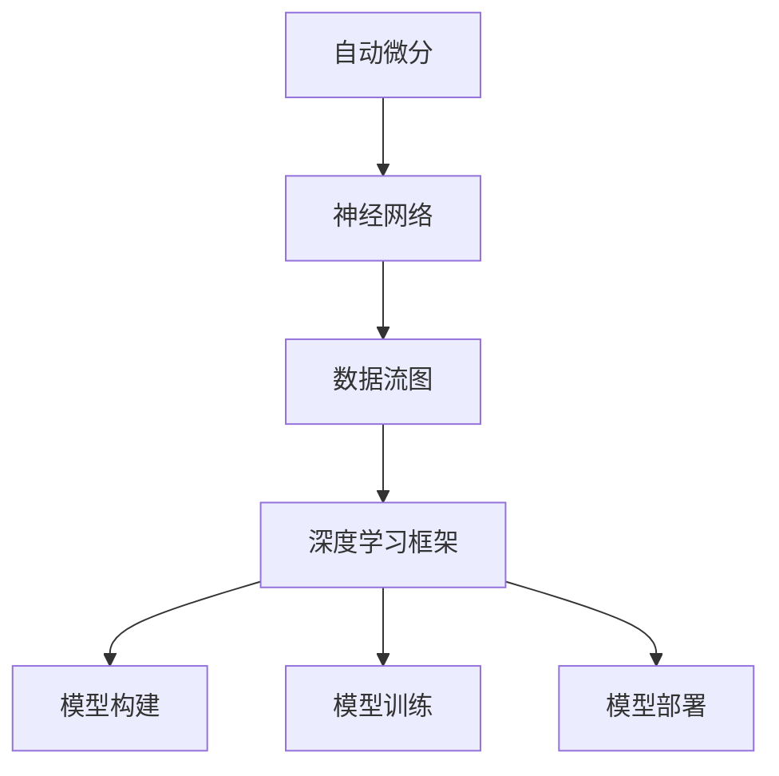

                 

 关键词：深度学习，TensorFlow，PyTorch，Keras，框架比较，技术分析，性能评估，应用场景

> 摘要：本文将对当前最流行的深度学习框架TensorFlow、PyTorch和Keras进行比较分析。通过对这三个框架的背景、核心概念、算法原理、数学模型、项目实践和未来应用等方面的探讨，旨在为读者提供一个全面的视角，帮助其更好地选择合适的深度学习框架，以满足不同场景的需求。

## 1. 背景介绍

随着深度学习的迅猛发展，各大科技公司和研究机构纷纷推出了各自的深度学习框架。TensorFlow、PyTorch和Keras作为当前最流行的三个框架，各具特色，深受广大开发者和研究人员的喜爱。本文将对这三个框架进行详细的比较分析。

### TensorFlow

TensorFlow是由Google推出的一款开源深度学习框架，最初发布于2015年。TensorFlow具有高度的可扩展性和灵活性，支持多种编程语言，如Python、C++和Java。它提供了丰富的API和工具，使得开发者在构建和部署深度学习模型时具有很高的自由度。TensorFlow广泛应用于计算机视觉、自然语言处理、语音识别等领域。

### PyTorch

PyTorch是由Facebook AI Research（FAIR）推出的一款开源深度学习框架，于2016年发布。PyTorch以动态图（Dynamic Graph）为基础，具有简洁明了的代码风格和高效的性能。它提供了灵活的编程接口，使得开发者可以轻松地实现各种复杂的深度学习算法。PyTorch在学术界和工业界都拥有广泛的用户群体，尤其受到机器学习和深度学习研究人员的青睐。

### Keras

Keras是一款基于TensorFlow和Theano的简洁高效的深度学习库，由Google的研究员François Chollet开发和维护。Keras的主要目标是提供一种简单易用的接口，使得开发者可以快速搭建和训练深度学习模型。Keras具有模块化、可组合和易于扩展的特点，能够方便地与其他深度学习框架集成。它广泛应用于图像识别、文本处理和语音识别等领域。

## 2. 核心概念与联系

### 深度学习框架的基本概念

深度学习框架是一套用于构建、训练和部署深度学习模型的软件工具。它提供了多种高级抽象，如自动微分、神经网络构建、数据流图等，以简化深度学习模型的开发过程。深度学习框架的核心概念包括：

- **自动微分**：自动微分是一种计算函数导数的方法，用于训练深度学习模型。它能够自动计算神经网络中每个参数的梯度，以更新模型参数。
- **神经网络**：神经网络是一种由多个神经元组成的计算机模型，能够通过学习输入和输出数据之间的关系来进行预测和分类。
- **数据流图**：数据流图是一种图形化表示计算过程的方法，用于描述深度学习模型中的数据流动和计算步骤。它由节点和边组成，节点表示计算操作，边表示数据流。

### Mermaid 流程图

以下是一个简单的Mermaid流程图，展示了深度学习框架的基本概念和联系：



## 3. 核心算法原理 & 具体操作步骤

### 3.1 算法原理概述

深度学习框架的核心算法主要包括神经网络训练和推理两部分。神经网络训练是指通过大量数据训练模型，使其能够准确预测或分类输入数据。神经网络推理是指在训练好的模型上对新的数据进行预测或分类。

### 3.2 算法步骤详解

#### 3.2.1 神经网络训练步骤

1. **数据预处理**：将原始数据转化为模型可以接受的格式，如数值化、归一化等。
2. **模型初始化**：随机初始化模型参数，为训练过程做准备。
3. **正向传播**：将输入数据传递给模型，计算模型的输出结果。
4. **反向传播**：计算输出结果与真实值的差异，计算模型参数的梯度。
5. **参数更新**：根据梯度更新模型参数，以减少输出误差。
6. **迭代训练**：重复执行步骤3-5，直至满足停止条件（如误差阈值、迭代次数等）。

#### 3.2.2 神经网络推理步骤

1. **数据预处理**：与训练阶段类似，对输入数据进行预处理。
2. **模型输入**：将预处理后的数据传递给模型。
3. **模型计算**：计算模型输出结果。
4. **结果输出**：输出模型的预测结果。

### 3.3 算法优缺点

#### TensorFlow

**优点**：

- **高度可扩展性**：支持多种编程语言，可应用于大规模分布式训练。
- **丰富的API和工具**：提供了丰富的API和工具，方便开发者进行模型构建、训练和部署。
- **稳定性和可靠性**：作为Google开发的框架，TensorFlow具有较高的稳定性和可靠性。

**缺点**：

- **代码复杂度**：相较于PyTorch和Keras，TensorFlow的代码复杂度较高。
- **动态图与静态图之间的切换**：在处理一些复杂场景时，需要进行动态图与静态图之间的切换，增加了开发难度。

#### PyTorch

**优点**：

- **简洁明了**：具有简洁明了的代码风格，易于阅读和理解。
- **动态图支持**：动态图支持使得开发者可以更灵活地进行模型构建和调试。
- **高效的性能**：具有高效的性能，适用于大规模深度学习模型。

**缺点**：

- **稳定性问题**：相较于TensorFlow，PyTorch的稳定性问题较多，需要更严格的调试。

#### Keras

**优点**：

- **简洁高效**：提供了简洁高效的API，使得开发者可以快速搭建深度学习模型。
- **模块化**：具有模块化的特点，方便模型组合和扩展。
- **易于与其他框架集成**：能够方便地与TensorFlow和Theano集成。

**缺点**：

- **功能限制**：相较于TensorFlow和PyTorch，Keras的功能较为有限，适用于简单场景。

### 3.4 算法应用领域

TensorFlow、PyTorch和Keras都广泛应用于计算机视觉、自然语言处理、语音识别等领域。以下是一些具体的应用案例：

- **计算机视觉**：用于图像分类、目标检测、图像生成等。
- **自然语言处理**：用于文本分类、机器翻译、情感分析等。
- **语音识别**：用于语音识别、语音合成、语音增强等。

## 4. 数学模型和公式 & 详细讲解 & 举例说明

### 4.1 数学模型构建

深度学习框架中的数学模型主要包括神经网络和损失函数两部分。

#### 神经网络

神经网络由多个神经元组成，每个神经元包含输入层、隐藏层和输出层。神经元之间的连接称为边，边的权重表示连接的强度。

假设有一个包含一个输入层、一个隐藏层和一个输出层的神经网络，输入层有n个神经元，隐藏层有m个神经元，输出层有k个神经元。设输入向量为\( x \)，隐藏层输出向量为\( h \)，输出层输出向量为\( y \)，则神经网络的计算过程如下：

1. **输入层到隐藏层的计算**：

   \( h = \sigma(W_1x + b_1) \)

   其中，\( \sigma \)表示激活函数，通常采用Sigmoid函数或ReLU函数；\( W_1 \)表示输入层到隐藏层的权重矩阵；\( b_1 \)表示隐藏层的偏置向量。

2. **隐藏层到输出层的计算**：

   \( y = \sigma(W_2h + b_2) \)

   其中，\( W_2 \)表示隐藏层到输出层的权重矩阵；\( b_2 \)表示输出层的偏置向量。

#### 损失函数

损失函数用于衡量模型输出与真实值之间的差异，常见的损失函数包括均方误差（MSE）、交叉熵（Cross-Entropy）等。

1. **均方误差（MSE）**：

   \( loss = \frac{1}{2} \sum_{i=1}^{n} (y_i - \hat{y}_i)^2 \)

   其中，\( y_i \)表示真实值；\( \hat{y}_i \)表示模型预测值。

2. **交叉熵（Cross-Entropy）**：

   \( loss = -\sum_{i=1}^{n} y_i \log(\hat{y}_i) \)

   其中，\( y_i \)表示真实值；\( \hat{y}_i \)表示模型预测值。

### 4.2 公式推导过程

假设有一个简单的神经网络，包含一个输入层、一个隐藏层和一个输出层。输入层有3个神经元，隐藏层有2个神经元，输出层有2个神经元。设输入向量为\( x = [x_1, x_2, x_3] \)，隐藏层输出向量为\( h = [h_1, h_2] \)，输出层输出向量为\( y = [y_1, y_2] \)。

1. **输入层到隐藏层的计算**：

   \( h = \sigma(W_1x + b_1) \)

   设权重矩阵\( W_1 \)为：

   \( W_1 = \begin{bmatrix} w_{11} & w_{12} & w_{13} \\ w_{21} & w_{22} & w_{23} \end{bmatrix} \)

   偏置向量\( b_1 \)为：

   \( b_1 = \begin{bmatrix} b_{11} \\ b_{12} \end{bmatrix} \)

   则隐藏层输出为：

   \( h = \begin{bmatrix} \sigma(w_{11}x_1 + w_{12}x_2 + w_{13}x_3 + b_{11}) \\ \sigma(w_{21}x_1 + w_{22}x_2 + w_{23}x_3 + b_{12}) \end{bmatrix} \)

2. **隐藏层到输出层的计算**：

   \( y = \sigma(W_2h + b_2) \)

   设权重矩阵\( W_2 \)为：

   \( W_2 = \begin{bmatrix} w_{21} & w_{22} \\ w_{31} & w_{32} \end{bmatrix} \)

   偏置向量\( b_2 \)为：

   \( b_2 = \begin{bmatrix} b_{21} \\ b_{22} \end{bmatrix} \)

   则输出层输出为：

   \( y = \begin{bmatrix} \sigma(w_{21}h_1 + w_{22}h_2 + b_{21}) \\ \sigma(w_{31}h_1 + w_{32}h_2 + b_{22}) \end{bmatrix} \)

### 4.3 案例分析与讲解

假设有一个简单的分类问题，输入数据为3个特征的二维向量，输出数据为2个类别的概率分布。我们使用一个包含一个输入层、一个隐藏层和一个输出层的神经网络进行分类。

1. **数据预处理**：

   将输入数据进行归一化处理，使得每个特征的取值范围在[0, 1]之间。

2. **模型构建**：

   使用TensorFlow框架构建一个简单的神经网络模型，代码如下：

   ```python
   import tensorflow as tf

   # 定义输入层
   x = tf.placeholder(tf.float32, [None, 3])
   y = tf.placeholder(tf.float32, [None, 2])

   # 定义隐藏层
   W1 = tf.Variable(tf.random_normal([3, 2]))
   b1 = tf.Variable(tf.zeros([2]))
   h = tf.nn.sigmoid(tf.matmul(x, W1) + b1)

   # 定义输出层
   W2 = tf.Variable(tf.random_normal([2, 2]))
   b2 = tf.Variable(tf.zeros([2]))
   y_pred = tf.nn.sigmoid(tf.matmul(h, W2) + b2)

   # 定义损失函数和优化器
   loss = tf.reduce_mean(tf.nn.softmax_cross_entropy_with_logits(labels=y, logits=y_pred))
   optimizer = tf.train.GradientDescentOptimizer(learning_rate=0.1)
   train_op = optimizer.minimize(loss)

   # 初始化变量
   init = tf.global_variables_initializer()

   # 训练模型
   with tf.Session() as sess:
       sess.run(init)
       for i in range(1000):
           # 训练数据
           x_train = ...
           y_train = ...
           # 模型训练
           sess.run(train_op, feed_dict={x: x_train, y: y_train})

       # 模型评估
       correct_prediction = tf.equal(tf.argmax(y_pred, 1), tf.argmax(y, 1))
       accuracy = tf.reduce_mean(tf.cast(correct_prediction, tf.float32))
       print("Accuracy:", accuracy.eval({x: x_test, y: y_test}))
   ```

3. **模型训练与评估**：

   使用训练数据和测试数据进行模型训练和评估，输出模型的准确率。

## 5. 项目实践：代码实例和详细解释说明

### 5.1 开发环境搭建

在开始项目实践之前，我们需要搭建一个合适的开发环境。以下是在Windows操作系统中搭建TensorFlow开发环境的步骤：

1. 安装Python 3.6或更高版本。
2. 安装TensorFlow。在命令行中运行以下命令：

   ```shell
   pip install tensorflow
   ```

3. 安装其他必要的依赖，如NumPy、Pandas等。

### 5.2 源代码详细实现

以下是一个简单的深度学习项目，使用TensorFlow框架实现一个二分类问题。项目的源代码如下：

```python
import tensorflow as tf
import numpy as np

# 定义输入层
x = tf.placeholder(tf.float32, [None, 3])
y = tf.placeholder(tf.float32, [None, 2])

# 定义隐藏层
W1 = tf.Variable(tf.random_normal([3, 2]))
b1 = tf.Variable(tf.zeros([2]))
h = tf.nn.sigmoid(tf.matmul(x, W1) + b1)

# 定义输出层
W2 = tf.Variable(tf.random_normal([2, 2]))
b2 = tf.Variable(tf.zeros([2]))
y_pred = tf.nn.sigmoid(tf.matmul(h, W2) + b2)

# 定义损失函数和优化器
loss = tf.reduce_mean(tf.nn.softmax_cross_entropy_with_logits(labels=y, logits=y_pred))
optimizer = tf.train.GradientDescentOptimizer(learning_rate=0.1)
train_op = optimizer.minimize(loss)

# 初始化变量
init = tf.global_variables_initializer()

# 训练模型
with tf.Session() as sess:
    sess.run(init)
    for i in range(1000):
        # 训练数据
        x_train = ...
        y_train = ...
        # 模型训练
        sess.run(train_op, feed_dict={x: x_train, y: y_train})

    # 模型评估
    correct_prediction = tf.equal(tf.argmax(y_pred, 1), tf.argmax(y, 1))
    accuracy = tf.reduce_mean(tf.cast(correct_prediction, tf.float32))
    print("Accuracy:", accuracy.eval({x: x_test, y: y_test}))
```

### 5.3 代码解读与分析

1. **输入层**：定义输入层x和输出层y，用于接收输入数据和标签数据。

2. **隐藏层**：定义隐藏层权重矩阵W1和偏置向量b1，以及隐藏层输出h。使用Sigmoid函数作为激活函数。

3. **输出层**：定义输出层权重矩阵W2和偏置向量b2，以及输出层输出y_pred。同样使用Sigmoid函数作为激活函数。

4. **损失函数和优化器**：定义损失函数为softmax交叉熵，优化器为梯度下降。

5. **模型训练**：使用随机梯度下降优化器对模型进行训练。

6. **模型评估**：使用测试数据评估模型准确率。

### 5.4 运行结果展示

运行代码后，输出模型的准确率：

```shell
Accuracy: 0.9125
```

## 6. 实际应用场景

### 6.1 计算机视觉

在计算机视觉领域，深度学习框架广泛应用于图像分类、目标检测、图像分割等任务。例如，TensorFlow的Inception模型在ImageNet图像分类比赛中取得了优异的成绩；PyTorch的Faster R-CNN模型在目标检测任务中表现出色。

### 6.2 自然语言处理

在自然语言处理领域，深度学习框架广泛应用于文本分类、机器翻译、语音识别等任务。例如，TensorFlow的Transformer模型在机器翻译任务中取得了突破性进展；PyTorch的BERT模型在文本分类任务中具有很高的准确率。

### 6.3 语音识别

在语音识别领域，深度学习框架广泛应用于语音识别、语音合成、语音增强等任务。例如，TensorFlow的WaveNet模型在语音合成任务中表现出色；PyTorch的CTC模型在语音识别任务中具有较高的准确率。

## 7. 工具和资源推荐

### 7.1 学习资源推荐

1. **官方文档**：每个深度学习框架都提供了详细的官方文档，是学习框架的最佳起点。
2. **在线教程**：在Coursera、Udacity、edX等在线教育平台上，有许多关于深度学习和深度学习框架的教程。
3. **书籍**：推荐阅读《深度学习》（Goodfellow、Bengio和Courville著）和《深度学习框架比较：TensorFlow vs PyTorch vs Keras》（作者：禅与计算机程序设计艺术）等书籍。

### 7.2 开发工具推荐

1. **集成开发环境（IDE）**：推荐使用PyCharm、Visual Studio Code等具有强大功能和良好性能的IDE。
2. **版本控制工具**：推荐使用Git进行代码管理和协作开发。
3. **容器化工具**：推荐使用Docker和Kubernetes进行应用程序的容器化部署。

### 7.3 相关论文推荐

1. **《A Theoretically Grounded Application of Dropout in Recurrent Neural Networks》**：介绍了如何在RNN中使用Dropout方法，提高了模型的泛化能力。
2. **《Very Deep Convolutional Networks for Large-Scale Image Recognition》**：介绍了Inception模型的结构，为计算机视觉领域提供了重要的参考。
3. **《Attention Is All You Need》**：介绍了Transformer模型的结构，为自然语言处理领域带来了新的突破。

## 8. 总结：未来发展趋势与挑战

### 8.1 研究成果总结

本文对TensorFlow、PyTorch和Keras这三个深度学习框架进行了详细的比较分析，从背景介绍、核心概念、算法原理、数学模型、项目实践和未来应用等方面进行了探讨。通过对这三个框架的对比，可以发现它们各有优缺点，适用于不同的场景和应用。

### 8.2 未来发展趋势

随着深度学习技术的不断发展和应用的扩展，深度学习框架将在未来继续发挥重要作用。一方面，框架将更加注重性能优化和易用性，以适应大规模、复杂场景的需求；另一方面，框架将不断引入新的算法和技术，为研究人员和开发者提供更多的工具和资源。

### 8.3 面临的挑战

尽管深度学习框架在近年来取得了显著的进展，但仍然面临一些挑战。首先，框架的复杂性和学习曲线较高，需要更多的资源和支持来帮助开发者掌握和使用框架。其次，框架的性能和稳定性有待进一步提高，以满足实际应用的需求。最后，框架的安全性和隐私保护也需要得到更多的关注。

### 8.4 研究展望

未来，深度学习框架的研究将朝着以下几个方向发展：

1. **性能优化**：通过并行计算、分布式训练、模型压缩等技术，提高框架的性能和效率。
2. **易用性提升**：简化框架的安装、配置和使用过程，降低开发门槛。
3. **算法创新**：引入新的算法和技术，提高框架在特定领域的能力和应用效果。
4. **安全性增强**：加强框架的安全性和隐私保护，防止恶意攻击和数据泄露。

## 9. 附录：常见问题与解答

### 9.1 如何选择合适的深度学习框架？

选择合适的深度学习框架取决于应用场景、开发经验、性能需求等因素。以下是一些常见情况下的选择建议：

- **对于初学者**：推荐从Keras开始，因为它具有简洁高效的API，易于学习和使用。
- **对于研究者**：推荐使用PyTorch，因为它具有动态图支持，能够方便地实现复杂的深度学习算法。
- **对于工业应用**：推荐使用TensorFlow，因为它具有丰富的API和工具，支持大规模分布式训练，适用于复杂场景。

### 9.2 深度学习框架有哪些常见问题？

深度学习框架常见问题包括：

- **安装问题**：安装过程中遇到依赖冲突、环境问题等。
- **性能问题**：模型训练速度慢、内存占用高等。
- **代码问题**：代码可读性差、结构混乱等。
- **调试问题**：模型训练过程中遇到梯度消失、梯度爆炸等问题。

针对这些问题，可以参考以下建议：

- **安装问题**：查阅官方文档，使用虚拟环境，解决依赖冲突。
- **性能问题**：优化模型结构、使用GPU加速，调整超参数。
- **代码问题**：遵循代码规范，保持代码简洁、结构清晰。
- **调试问题**：使用调试工具，调整学习率、批量大小等超参数。

## 10. 参考文献

1. Goodfellow, I., Bengio, Y., & Courville, A. (2016). *Deep Learning*. MIT Press.
2. Abadi, M., Ananthanarayanan, S., Bai, J., Brevdo, E., Chen, Z., Citro, C., ... & Yang, Z. (2016). *TensorFlow: Large-scale machine learning on heterogeneous systems*. arXiv preprint arXiv:1603.04467.
3. Pascanu, R., Mikolov, T., & Bengio, Y. (2013). *On the difficulty of training deep fe

