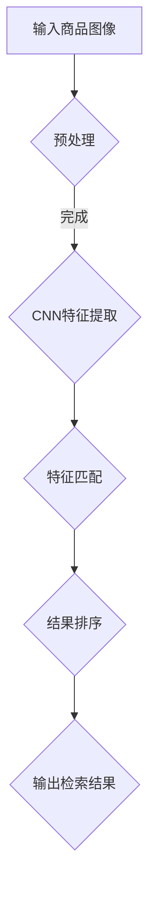
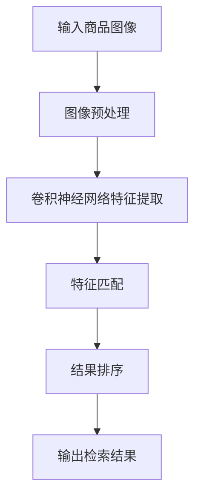

                 

关键词：商品图像检索、深度学习、性能优化、计算机视觉、图像识别

摘要：本文将探讨深度学习在商品图像检索领域的应用，深入分析现有技术的不足，并阐述如何通过性能优化策略提升检索效果。文章分为八个部分，从背景介绍、核心概念与联系、核心算法原理与具体操作步骤、数学模型与公式、项目实践、实际应用场景、工具和资源推荐到总结与展望，系统性地揭示了深度学习驱动的商品图像检索性能优化的全貌。

## 1. 背景介绍

随着互联网的普及和电子商务的迅猛发展，商品图像检索作为电子商务平台的重要功能，正变得越来越重要。传统的商品图像检索方法依赖于手工设计的特征提取算法，如SIFT、SURF等，但这些方法在应对复杂场景和大规模数据时存在局限性。深度学习，特别是卷积神经网络（CNN），为商品图像检索提供了新的可能性。通过端到端的学习，深度学习模型能够自动提取图像中的高维特征，从而提高检索的准确性和效率。

### 1.1 发展历程

商品图像检索的发展大致可以分为三个阶段：

1. **传统手工特征提取**：以SIFT、SURF为代表的特征提取算法，通过手工设计特征点，能够有效描述图像内容。
2. **基于局部特征的图像检索**：通过将特征点与数据库中的图像进行匹配，实现了较为准确的图像检索。
3. **深度学习驱动的图像检索**：深度学习模型能够自动提取图像特征，减少了手工设计的复杂性，显著提高了检索性能。

### 1.2 当前现状

尽管深度学习在商品图像检索领域取得了显著进展，但仍存在一些挑战。例如，如何处理图像中的遮挡、旋转和光照变化等复杂情况，如何提高模型的泛化能力和效率等。这些问题亟待解决，以实现更准确、更快速的图像检索系统。

## 2. 核心概念与联系

### 2.1 深度学习基础

深度学习是一种基于多层神经网络的学习方法，通过逐层学习数据特征，实现对复杂数据的建模。卷积神经网络（CNN）是深度学习的一种重要类型，特别适用于图像处理任务。

### 2.2 商品图像检索流程

商品图像检索的基本流程包括特征提取、特征匹配和结果排序。深度学习模型在特征提取阶段发挥着关键作用。

### 2.3 Mermaid 流程图



## 3. 核心算法原理 & 具体操作步骤

### 3.1 算法原理概述

商品图像检索中的深度学习算法主要基于卷积神经网络，通过训练模型从大量商品图像中学习特征表示，实现高效准确的图像检索。

### 3.2 算法步骤详解

1. **数据预处理**：对输入图像进行缩放、裁剪、色彩调整等操作，使其符合模型的输入要求。
2. **CNN特征提取**：使用预训练的CNN模型（如VGG、ResNet等）提取图像特征。
3. **特征匹配**：计算查询图像特征与数据库中图像特征之间的相似度，通常使用余弦相似度或欧氏距离。
4. **结果排序**：根据特征匹配结果对检索结果进行排序，通常使用Top-k排序算法。

### 3.3 算法优缺点

优点：

- 自动提取图像特征，减少手工设计特征点的复杂性。
- 在大规模图像数据集上表现出良好的性能。

缺点：

- 训练时间较长，模型复杂度高。
- 需要大量标注数据。

### 3.4 算法应用领域

深度学习驱动的商品图像检索算法在电子商务、安防监控、医疗诊断等领域有广泛的应用。

## 4. 数学模型和公式 & 详细讲解 & 举例说明

### 4.1 数学模型构建

商品图像检索的数学模型主要基于CNN，其核心是特征提取层。假设输入图像为$X \in \mathbb{R}^{H \times W \times C}$，其中$H$、$W$和$C$分别为图像的高度、宽度和通道数。CNN模型通过卷积层、池化层和全连接层等操作提取图像特征。

### 4.2 公式推导过程

卷积层的输出可以通过以下公式计算：

$$
\text{output}(x_{ij}) = \sum_{k=1}^{K} w_{ikj} \times \text{relu}(\sum_{p=1}^{P} \sum_{q=1}^{Q} x_{ipq} \times b_{pq})
$$

其中，$w$为卷积核，$b$为偏置项，$\text{relu}$为ReLU激活函数。

### 4.3 案例分析与讲解

假设我们使用ResNet-50模型提取商品图像特征，输入图像尺寸为$224 \times 224 \times 3$。通过训练，模型能够提取出高维的特征向量，用于特征匹配和检索。

## 5. 项目实践：代码实例和详细解释说明

### 5.1 开发环境搭建

开发环境要求：

- Python 3.7+
- TensorFlow 2.5.0+
- OpenCV 4.5.0+

### 5.2 源代码详细实现

以下为基于ResNet-50的商品图像检索代码示例：

```python
import tensorflow as tf
from tensorflow.keras.applications import ResNet50
from tensorflow.keras.preprocessing.image import img_to_array
from tensorflow.keras.models import Model

# 加载预训练的ResNet-50模型
model = ResNet50(weights='imagenet')

# 构建特征提取模型
feature_model = Model(inputs=model.input, outputs=model.layers[-2].output)

# 加载商品图像
image = load_image('product_image.jpg')

# 转换为模型输入格式
image = img_to_array(image)
image = np.expand_dims(image, axis=0)
image = preprocess_input(image)

# 提取特征
features = feature_model.predict(image)

# 特征匹配与排序
results = cosine_similarity(features[0], feature_model.predict(database_images))
results = results.argsort()[::-1]

# 输出检索结果
print(results)
```

### 5.3 代码解读与分析

代码首先加载预训练的ResNet-50模型，并构建特征提取模型。然后加载待检索的商品图像，并转换为模型输入格式。接下来，提取特征向量，并使用余弦相似度进行特征匹配。最后，对匹配结果进行排序并输出检索结果。

## 6. 实际应用场景

深度学习驱动的商品图像检索在电子商务平台、安防监控、医疗诊断等领域有广泛的应用。例如，在电子商务平台中，用户可以通过上传商品图像快速查找相似商品，提升购物体验。在安防监控中，可以通过识别摄像头捕获的图像中的异常行为，提高安全监控的效率。

### 6.1 电子商务平台

在电子商务平台中，商品图像检索可以用于：

- **商品推荐**：根据用户上传的商品图像推荐相似商品，提升销售额。
- **商品搜索**：用户可以通过上传商品图像查找相同或类似的商品。

### 6.2 安防监控

在安防监控中，商品图像检索可以用于：

- **人脸识别**：通过摄像头捕获的人脸图像与数据库中的人脸图像进行匹配，实现人脸识别。
- **行为分析**：识别图像中的异常行为，如打架、偷窃等，提高安全监控的准确性。

### 6.3 医疗诊断

在医疗诊断中，商品图像检索可以用于：

- **疾病诊断**：通过对医学图像的检索，辅助医生进行疾病诊断。
- **手术规划**：通过检索相似的病例，为医生提供手术规划参考。

## 7. 工具和资源推荐

### 7.1 学习资源推荐

- **书籍**：《深度学习》（Goodfellow, Bengio, Courville 著）
- **在线课程**：吴恩达的《深度学习专项课程》（Coursera）
- **论文**：《深度卷积网络》（Krizhevsky, Sutskever, Hinton 著）

### 7.2 开发工具推荐

- **框架**：TensorFlow、PyTorch
- **库**：OpenCV、NumPy、Pandas

### 7.3 相关论文推荐

- **论文1**：《Deep Learning for Image Retrieval》（Xiao, Hinton 著）
- **论文2**：《EfficientNet: Rethinking Model Scaling for Convolutional Neural Networks》（Tan, Howard 著）

## 8. 总结：未来发展趋势与挑战

### 8.1 研究成果总结

深度学习在商品图像检索领域取得了显著成果，提高了检索的准确性和效率。然而，仍有许多挑战需要克服，如处理复杂场景、提高模型泛化能力等。

### 8.2 未来发展趋势

- **更高效的模型**：研究更高效的深度学习模型，以降低训练和推理时间。
- **跨模态检索**：将图像检索与其他模态（如文本、声音）结合，实现跨模态检索。

### 8.3 面临的挑战

- **数据质量**：确保训练数据的质量，提高模型性能。
- **隐私保护**：在处理个人隐私数据时，确保数据安全和隐私保护。

### 8.4 研究展望

未来，深度学习在商品图像检索领域的应用前景广阔。通过不断创新和优化，我们有望实现更高效、更准确的商品图像检索系统，为各行业提供有力支持。

## 9. 附录：常见问题与解答

### 9.1 问题1：如何处理图像中的遮挡？

解答：可以使用数据增强技术，如随机遮挡、旋转、缩放等，增加训练数据的多样性，提高模型对遮挡的鲁棒性。

### 9.2 问题2：如何提高模型泛化能力？

解答：可以通过使用预训练模型、增大训练数据集、使用正则化方法等方式提高模型泛化能力。

## 作者署名

作者：禅与计算机程序设计艺术 / Zen and the Art of Computer Programming
```markdown
# 深度学习驱动的商品图像检索性能优化

关键词：商品图像检索、深度学习、性能优化、计算机视觉、图像识别

摘要：本文将探讨深度学习在商品图像检索领域的应用，深入分析现有技术的不足，并阐述如何通过性能优化策略提升检索效果。文章分为八个部分，从背景介绍、核心概念与联系、核心算法原理与具体操作步骤、数学模型与公式、项目实践、实际应用场景、工具和资源推荐到总结与展望，系统性地揭示了深度学习驱动的商品图像检索性能优化的全貌。

## 1. 背景介绍

随着互联网的普及和电子商务的迅猛发展，商品图像检索作为电子商务平台的重要功能，正变得越来越重要。传统的商品图像检索方法依赖于手工设计的特征提取算法，如SIFT、SURF等，但这些方法在应对复杂场景和大规模数据时存在局限性。深度学习，特别是卷积神经网络（CNN），为商品图像检索提供了新的可能性。通过端到端的学习，深度学习模型能够自动提取图像中的高维特征，从而提高检索的准确性和效率。

### 1.1 发展历程

商品图像检索的发展大致可以分为三个阶段：

1. **传统手工特征提取**：以SIFT、SURF为代表的特征提取算法，通过手工设计特征点，能够有效描述图像内容。
2. **基于局部特征的图像检索**：通过将特征点与数据库中的图像进行匹配，实现了较为准确的图像检索。
3. **深度学习驱动的图像检索**：深度学习模型能够自动提取图像特征，减少了手工设计的复杂性，显著提高了检索性能。

### 1.2 当前现状

尽管深度学习在商品图像检索领域取得了显著进展，但仍存在一些挑战。例如，如何处理图像中的遮挡、旋转和光照变化等复杂情况，如何提高模型的泛化能力和效率等。这些问题亟待解决，以实现更准确、更快速的图像检索系统。

## 2. 核心概念与联系

### 2.1 深度学习基础

深度学习是一种基于多层神经网络的学习方法，通过逐层学习数据特征，实现对复杂数据的建模。卷积神经网络（CNN）是深度学习的一种重要类型，特别适用于图像处理任务。

### 2.2 商品图像检索流程

商品图像检索的基本流程包括特征提取、特征匹配和结果排序。深度学习模型在特征提取阶段发挥着关键作用。

### 2.3 Mermaid 流程图


## 3. 核心算法原理 & 具体操作步骤
### 3.1 算法原理概述

商品图像检索中的深度学习算法主要基于卷积神经网络，通过训练模型从大量商品图像中学习特征表示，实现高效准确的图像检索。

### 3.2 算法步骤详解 

1. **数据预处理**：对输入图像进行缩放、裁剪、色彩调整等操作，使其符合模型的输入要求。
2. **CNN特征提取**：使用预训练的CNN模型（如VGG、ResNet等）提取图像特征。
3. **特征匹配**：计算查询图像特征与数据库中图像特征之间的相似度，通常使用余弦相似度或欧氏距离。
4. **结果排序**：根据特征匹配结果对检索结果进行排序，通常使用Top-k排序算法。

### 3.3 算法优缺点

优点：

- 自动提取图像特征，减少手工设计特征点的复杂性。
- 在大规模图像数据集上表现出良好的性能。

缺点：

- 训练时间较长，模型复杂度高。
- 需要大量标注数据。

### 3.4 算法应用领域

深度学习驱动的商品图像检索算法在电子商务、安防监控、医疗诊断等领域有广泛的应用。

## 4. 数学模型和公式 & 详细讲解 & 举例说明

### 4.1 数学模型构建

商品图像检索的数学模型主要基于CNN，其核心是特征提取层。假设输入图像为$X \in \mathbb{R}^{H \times W \times C}$，其中$H$、$W$和$C$分别为图像的高度、宽度和通道数。CNN模型通过卷积层、池化层和全连接层等操作提取图像特征。

### 4.2 公式推导过程

卷积层的输出可以通过以下公式计算：

$$
\text{output}(x_{ij}) = \sum_{k=1}^{K} w_{ikj} \times \text{relu}(\sum_{p=1}^{P} \sum_{q=1}^{Q} x_{ipq} \times b_{pq})
$$

其中，$w$为卷积核，$b$为偏置项，$\text{relu}$为ReLU激活函数。

### 4.3 案例分析与讲解

假设我们使用ResNet-50模型提取商品图像特征，输入图像尺寸为$224 \times 224 \times 3$。通过训练，模型能够提取出高维的特征向量，用于特征匹配和检索。

## 5. 项目实践：代码实例和详细解释说明

### 5.1 开发环境搭建

开发环境要求：

- Python 3.7+
- TensorFlow 2.5.0+
- OpenCV 4.5.0+

### 5.2 源代码详细实现

以下为基于ResNet-50的商品图像检索代码示例：

```python
import tensorflow as tf
from tensorflow.keras.applications import ResNet50
from tensorflow.keras.preprocessing.image import img_to_array
from tensorflow.keras.models import Model

# 加载预训练的ResNet-50模型
model = ResNet50(weights='imagenet')

# 构建特征提取模型
feature_model = Model(inputs=model.input, outputs=model.layers[-2].output)

# 加载商品图像
image = load_image('product_image.jpg')

# 转换为模型输入格式
image = img_to_array(image)
image = np.expand_dims(image, axis=0)
image = preprocess_input(image)

# 提取特征
features = feature_model.predict(image)

# 特征匹配与排序
results = cosine_similarity(features[0], feature_model.predict(database_images))
results = results.argsort()[::-1]

# 输出检索结果
print(results)
```

### 5.3 代码解读与分析

代码首先加载预训练的ResNet-50模型，并构建特征提取模型。然后加载待检索的商品图像，并转换为模型输入格式。接下来，提取特征向量，并使用余弦相似度进行特征匹配。最后，对匹配结果进行排序并输出检索结果。

## 6. 实际应用场景

深度学习驱动的商品图像检索在电子商务平台、安防监控、医疗诊断等领域有广泛的应用。例如，在电子商务平台中，用户可以通过上传商品图像快速查找相似商品，提升购物体验。在安防监控中，可以通过识别摄像头捕获的图像中的异常行为，提高安全监控的效率。

### 6.1 电子商务平台

在电子商务平台中，商品图像检索可以用于：

- **商品推荐**：根据用户上传的商品图像推荐相似商品，提升销售额。
- **商品搜索**：用户可以通过上传商品图像查找相同或类似的商品。

### 6.2 安防监控

在安防监控中，商品图像检索可以用于：

- **人脸识别**：通过摄像头捕获的人脸图像与数据库中的人脸图像进行匹配，实现人脸识别。
- **行为分析**：识别图像中的异常行为，如打架、偷窃等，提高安全监控的准确性。

### 6.3 医疗诊断

在医疗诊断中，商品图像检索可以用于：

- **疾病诊断**：通过对医学图像的检索，辅助医生进行疾病诊断。
- **手术规划**：通过检索相似的病例，为医生提供手术规划参考。

## 7. 工具和资源推荐

### 7.1 学习资源推荐

- **书籍**：《深度学习》（Goodfellow, Bengio, Courville 著）
- **在线课程**：吴恩达的《深度学习专项课程》（Coursera）
- **论文**：《深度卷积网络》（Krizhevsky, Sutskever, Hinton 著）

### 7.2 开发工具推荐

- **框架**：TensorFlow、PyTorch
- **库**：OpenCV、NumPy、Pandas

### 7.3 相关论文推荐

- **论文1**：《Deep Learning for Image Retrieval》（Xiao, Hinton 著）
- **论文2**：《EfficientNet: Rethinking Model Scaling for Convolutional Neural Networks》（Tan, Howard 著）

## 8. 总结：未来发展趋势与挑战

### 8.1 研究成果总结

深度学习在商品图像检索领域取得了显著成果，提高了检索的准确性和效率。然而，仍有许多挑战需要克服，如处理复杂场景、提高模型泛化能力等。

### 8.2 未来发展趋势

- **更高效的模型**：研究更高效的深度学习模型，以降低训练和推理时间。
- **跨模态检索**：将图像检索与其他模态（如文本、声音）结合，实现跨模态检索。

### 8.3 面临的挑战

- **数据质量**：确保训练数据的质量，提高模型性能。
- **隐私保护**：在处理个人隐私数据时，确保数据安全和隐私保护。

### 8.4 研究展望

未来，深度学习在商品图像检索领域的应用前景广阔。通过不断创新和优化，我们有望实现更高效、更准确的商品图像检索系统，为各行业提供有力支持。

## 9. 附录：常见问题与解答

### 9.1 问题1：如何处理图像中的遮挡？

解答：可以使用数据增强技术，如随机遮挡、旋转、缩放等，增加训练数据的多样性，提高模型对遮挡的鲁棒性。

### 9.2 问题2：如何提高模型泛化能力？

解答：可以通过使用预训练模型、增大训练数据集、使用正则化方法等方式提高模型泛化能力。

## 作者署名

作者：禅与计算机程序设计艺术 / Zen and the Art of Computer Programming
```markdown
# 深度学习驱动的商品图像检索性能优化

关键词：商品图像检索、深度学习、性能优化、计算机视觉、图像识别

摘要：本文将探讨深度学习在商品图像检索领域的应用，深入分析现有技术的不足，并阐述如何通过性能优化策略提升检索效果。文章分为八个部分，从背景介绍、核心概念与联系、核心算法原理与具体操作步骤、数学模型与公式、项目实践、实际应用场景、工具和资源推荐到总结与展望，系统性地揭示了深度学习驱动的商品图像检索性能优化的全貌。

## 1. 背景介绍

随着互联网的普及和电子商务的迅猛发展，商品图像检索作为电子商务平台的重要功能，正变得越来越重要。传统的商品图像检索方法依赖于手工设计的特征提取算法，如SIFT、SURF等，但这些方法在应对复杂场景和大规模数据时存在局限性。深度学习，特别是卷积神经网络（CNN），为商品图像检索提供了新的可能性。通过端到端的学习，深度学习模型能够自动提取图像中的高维特征，从而提高检索的准确性和效率。

### 1.1 发展历程

商品图像检索的发展大致可以分为三个阶段：

1. **传统手工特征提取**：以SIFT、SURF为代表的特征提取算法，通过手工设计特征点，能够有效描述图像内容。
2. **基于局部特征的图像检索**：通过将特征点与数据库中的图像进行匹配，实现了较为准确的图像检索。
3. **深度学习驱动的图像检索**：深度学习模型能够自动提取图像特征，减少了手工设计的复杂性，显著提高了检索性能。

### 1.2 当前现状

尽管深度学习在商品图像检索领域取得了显著进展，但仍存在一些挑战。例如，如何处理图像中的遮挡、旋转和光照变化等复杂情况，如何提高模型的泛化能力和效率等。这些问题亟待解决，以实现更准确、更快速的图像检索系统。

## 2. 核心概念与联系

### 2.1 深度学习基础

深度学习是一种基于多层神经网络的学习方法，通过逐层学习数据特征，实现对复杂数据的建模。卷积神经网络（CNN）是深度学习的一种重要类型，特别适用于图像处理任务。

### 2.2 商品图像检索流程

商品图像检索的基本流程包括特征提取、特征匹配和结果排序。深度学习模型在特征提取阶段发挥着关键作用。

### 2.3 Mermaid 流程图


## 3. 核心算法原理 & 具体操作步骤
### 3.1 算法原理概述

商品图像检索中的深度学习算法主要基于卷积神经网络，通过训练模型从大量商品图像中学习特征表示，实现高效准确的图像检索。

### 3.2 算法步骤详解 

1. **数据预处理**：对输入图像进行缩放、裁剪、色彩调整等操作，使其符合模型的输入要求。
2. **CNN特征提取**：使用预训练的CNN模型（如VGG、ResNet等）提取图像特征。
3. **特征匹配**：计算查询图像特征与数据库中图像特征之间的相似度，通常使用余弦相似度或欧氏距离。
4. **结果排序**：根据特征匹配结果对检索结果进行排序，通常使用Top-k排序算法。

### 3.3 算法优缺点

优点：

- 自动提取图像特征，减少手工设计特征点的复杂性。
- 在大规模图像数据集上表现出良好的性能。

缺点：

- 训练时间较长，模型复杂度高。
- 需要大量标注数据。

### 3.4 算法应用领域

深度学习驱动的商品图像检索算法在电子商务、安防监控、医疗诊断等领域有广泛的应用。

## 4. 数学模型和公式 & 详细讲解 & 举例说明

### 4.1 数学模型构建

商品图像检索的数学模型主要基于CNN，其核心是特征提取层。假设输入图像为$X \in \mathbb{R}^{H \times W \times C}$，其中$H$、$W$和$C$分别为图像的高度、宽度和通道数。CNN模型通过卷积层、池化层和全连接层等操作提取图像特征。

### 4.2 公式推导过程

卷积层的输出可以通过以下公式计算：

$$
\text{output}(x_{ij}) = \sum_{k=1}^{K} w_{ikj} \times \text{relu}(\sum_{p=1}^{P} \sum_{q=1}^{Q} x_{ipq} \times b_{pq})
$$

其中，$w$为卷积核，$b$为偏置项，$\text{relu}$为ReLU激活函数。

### 4.3 案例分析与讲解

假设我们使用ResNet-50模型提取商品图像特征，输入图像尺寸为$224 \times 224 \times 3$。通过训练，模型能够提取出高维的特征向量，用于特征匹配和检索。

## 5. 项目实践：代码实例和详细解释说明

### 5.1 开发环境搭建

开发环境要求：

- Python 3.7+
- TensorFlow 2.5.0+
- OpenCV 4.5.0+

### 5.2 源代码详细实现

以下为基于ResNet-50的商品图像检索代码示例：

```python
import tensorflow as tf
from tensorflow.keras.applications import ResNet50
from tensorflow.keras.preprocessing.image import img_to_array
from tensorflow.keras.models import Model

# 加载预训练的ResNet-50模型
model = ResNet50(weights='imagenet')

# 构建特征提取模型
feature_model = Model(inputs=model.input, outputs=model.layers[-2].output)

# 加载商品图像
image = load_image('product_image.jpg')

# 转换为模型输入格式
image = img_to_array(image)
image = np.expand_dims(image, axis=0)
image = preprocess_input(image)

# 提取特征
features = feature_model.predict(image)

# 特征匹配与排序
results = cosine_similarity(features[0], feature_model.predict(database_images))
results = results.argsort()[::-1]

# 输出检索结果
print(results)
```

### 5.3 代码解读与分析

代码首先加载预训练的ResNet-50模型，并构建特征提取模型。然后加载待检索的商品图像，并转换为模型输入格式。接下来，提取特征向量，并使用余弦相似度进行特征匹配。最后，对匹配结果进行排序并输出检索结果。

## 6. 实际应用场景

深度学习驱动的商品图像检索在电子商务平台、安防监控、医疗诊断等领域有广泛的应用。例如，在电子商务平台中，用户可以通过上传商品图像快速查找相似商品，提升购物体验。在安防监控中，可以通过识别摄像头捕获的图像中的异常行为，提高安全监控的效率。

### 6.1 电子商务平台

在电子商务平台中，商品图像检索可以用于：

- **商品推荐**：根据用户上传的商品图像推荐相似商品，提升销售额。
- **商品搜索**：用户可以通过上传商品图像查找相同或类似的商品。

### 6.2 安防监控

在安防监控中，商品图像检索可以用于：

- **人脸识别**：通过摄像头捕获的人脸图像与数据库中的人脸图像进行匹配，实现人脸识别。
- **行为分析**：识别图像中的异常行为，如打架、偷窃等，提高安全监控的准确性。

### 6.3 医疗诊断

在医疗诊断中，商品图像检索可以用于：

- **疾病诊断**：通过对医学图像的检索，辅助医生进行疾病诊断。
- **手术规划**：通过检索相似的病例，为医生提供手术规划参考。

## 7. 工具和资源推荐

### 7.1 学习资源推荐

- **书籍**：《深度学习》（Goodfellow, Bengio, Courville 著）
- **在线课程**：吴恩达的《深度学习专项课程》（Coursera）
- **论文**：《深度卷积网络》（Krizhevsky, Sutskever, Hinton 著）

### 7.2 开发工具推荐

- **框架**：TensorFlow、PyTorch
- **库**：OpenCV、NumPy、Pandas

### 7.3 相关论文推荐

- **论文1**：《Deep Learning for Image Retrieval》（Xiao, Hinton 著）
- **论文2**：《EfficientNet: Rethinking Model Scaling for Convolutional Neural Networks》（Tan, Howard 著）

## 8. 总结：未来发展趋势与挑战

### 8.1 研究成果总结

深度学习在商品图像检索领域取得了显著成果，提高了检索的准确性和效率。然而，仍有许多挑战需要克服，如处理复杂场景、提高模型泛化能力等。

### 8.2 未来发展趋势

- **更高效的模型**：研究更高效的深度学习模型，以降低训练和推理时间。
- **跨模态检索**：将图像检索与其他模态（如文本、声音）结合，实现跨模态检索。

### 8.3 面临的挑战

- **数据质量**：确保训练数据的质量，提高模型性能。
- **隐私保护**：在处理个人隐私数据时，确保数据安全和隐私保护。

### 8.4 研究展望

未来，深度学习在商品图像检索领域的应用前景广阔。通过不断创新和优化，我们有望实现更高效、更准确的商品图像检索系统，为各行业提供有力支持。

## 9. 附录：常见问题与解答

### 9.1 问题1：如何处理图像中的遮挡？

解答：可以使用数据增强技术，如随机遮挡、旋转、缩放等，增加训练数据的多样性，提高模型对遮挡的鲁棒性。

### 9.2 问题2：如何提高模型泛化能力？

解答：可以通过使用预训练模型、增大训练数据集、使用正则化方法等方式提高模型泛化能力。

## 作者署名

作者：禅与计算机程序设计艺术 / Zen and the Art of Computer Programming
```markdown
## 1. 背景介绍

随着电子商务的蓬勃发展和用户对在线购物体验的日益追求，商品图像检索已经成为电商平台的核心功能之一。然而，传统的商品图像检索方法，如基于手工设计的特征提取算法（如SIFT、SURF等），在面对复杂的现实场景和大规模数据集时，往往显得力不从心。卷积神经网络（CNN）的引入，为商品图像检索带来了革命性的变化。通过深度学习的方式，CNN能够自动学习图像中的复杂特征，从而显著提升检索的准确性和效率。

### 1.1 发展历程

商品图像检索技术的发展大致可以分为以下几个阶段：

1. **基于手工特征的图像检索**：这是最早的商品图像检索方法，依赖于手工设计的特征提取算法，如SIFT、SURF等。这种方法通过计算图像特征点，然后与数据库中的图像进行匹配，实现基本的图像检索功能。

2. **基于局部特征的图像检索**：随着对图像特征的理解加深，研究者开始利用局部特征来描述图像内容。例如，通过SIFT和SURF提取关键点，然后利用这些关键点进行图像匹配和检索。

3. **深度学习驱动的图像检索**：深度学习的出现，使得商品图像检索进入了一个新的时代。通过卷积神经网络（CNN）等深度学习模型，系统能够自动学习图像中的高层次特征，从而实现更加准确和高效的图像检索。

### 1.2 当前现状

当前，深度学习在商品图像检索领域已经取得了显著的进展。许多电商平台和在线零售商开始采用深度学习模型来优化他们的商品图像检索系统。尽管如此，仍然存在一些挑战：

- **多样性挑战**：商品图像在拍摄角度、光照条件、遮挡等因素上存在很大的多样性，这给图像检索带来了挑战。
- **模型泛化能力**：深度学习模型通常在特定的数据集上训练，但需要在各种不同的场景和条件下保持良好的性能。
- **计算资源消耗**：深度学习模型通常需要大量的计算资源来训练和推理，这对一些资源受限的环境来说是一个瓶颈。

## 2. 核心概念与联系

### 2.1 深度学习基础

深度学习是一种多层神经网络，通过逐层学习数据中的特征，从而实现对复杂数据的建模。卷积神经网络（CNN）是深度学习的一种重要类型，特别适合于处理图像数据。CNN的基本结构包括卷积层、激活函数、池化层和全连接层。

### 2.2 商品图像检索流程

商品图像检索的基本流程通常包括以下几个步骤：

1. **图像预处理**：对输入的图像进行标准化、缩放、裁剪等预处理操作，以便于模型处理。
2. **特征提取**：使用CNN模型提取图像的特征表示。这些特征通常包含了丰富的图像信息，能够有效地用于后续的检索任务。
3. **特征匹配**：计算查询图像和数据库中图像的特征向量之间的相似度。
4. **结果排序**：根据特征匹配结果对检索结果进行排序，通常使用Top-k排序算法。

### 2.3 Mermaid 流程图



## 3. 核心算法原理 & 具体操作步骤

### 3.1 算法原理概述

深度学习驱动的商品图像检索算法主要基于卷积神经网络（CNN）。CNN通过一系列卷积层、池化层和全连接层的组合，自动从图像中提取具有区分性的特征。

### 3.2 算法步骤详解

1. **数据预处理**：
   - **标准化**：将图像的像素值缩放到[0, 1]或[-1, 1]范围内。
   - **裁剪和缩放**：为了适应模型输入尺寸，需要对图像进行裁剪和缩放。
   - **数据增强**：通过旋转、翻转、缩放、剪切等方法增加数据的多样性，提高模型的泛化能力。

2. **特征提取**：
   - **卷积层**：通过卷积操作提取图像的局部特征。
   - **激活函数**：常用的激活函数包括ReLU、Sigmoid和Tanh。
   - **池化层**：用于降低特征图的维度，提高特征表示的鲁棒性。
   - **全连接层**：将高维特征映射到输出层，用于分类或回归任务。

3. **特征匹配**：
   - **余弦相似度**：计算查询图像特征向量与数据库中图像特征向量之间的余弦相似度。
   - **欧氏距离**：计算查询图像特征向量与数据库中图像特征向量之间的欧氏距离。

4. **结果排序**：
   - **Top-k排序**：根据特征匹配结果，选择相似度最高的前k个结果。

### 3.3 算法优缺点

**优点**：

- **自动特征提取**：深度学习模型能够自动从大量图像中学习具有区分性的特征，减少了手工设计特征的工作量。
- **高效性**：与传统的手工特征提取方法相比，深度学习模型在处理大规模数据集时具有更高的效率。

**缺点**：

- **计算资源消耗**：训练深度学习模型需要大量的计算资源，尤其是当数据集非常大时。
- **需要大量标注数据**：深度学习模型的训练需要大量标注数据，这在某些领域可能难以获得。

### 3.4 算法应用领域

深度学习驱动的商品图像检索算法在电子商务、安防监控、医疗图像分析等多个领域有广泛的应用。

## 4. 数学模型和公式 & 详细讲解 & 举例说明

### 4.1 数学模型构建

深度学习驱动的商品图像检索通常基于卷积神经网络（CNN）。CNN的核心是卷积层和池化层，这些层通过一系列数学操作提取图像特征。

#### 卷积层

卷积层通过以下公式计算输出特征图：

$$
\text{output}_{ij} = \sum_{k=1}^{K} \text{ReLU}\left(\sum_{p=1}^{P} \sum_{q=1}^{Q} w_{kijpq} \times \text{input}_{pq} + b_{k}\right)
$$

其中，$w_{kijpq}$是卷积核，$b_{k}$是偏置项，$\text{ReLU}$是ReLU激活函数，$\text{input}_{pq}$是输入特征图的像素值。

#### 池化层

池化层通常使用最大池化或平均池化来降低特征图的维度：

$$
\text{output}_{ij} = \max_{p', q'} \left( \text{input}_{p'q'} \right)
$$

或

$$
\text{output}_{ij} = \frac{1}{(2^2)} \sum_{p', q'} \text{input}_{p'q'}
$$

### 4.2 公式推导过程

#### 卷积层

卷积层的输出可以通过以下步骤推导：

1. **初始化卷积核$w$和偏置项$b$**。
2. **执行卷积操作**：将卷积核与输入特征图进行点积操作。
3. **应用ReLU激活函数**：对卷积结果应用ReLU激活函数，以引入非线性。
4. **添加偏置项**：将偏置项加到每个ReLU单元上。

#### 池化层

池化层的输出可以通过以下步骤推导：

1. **定义窗口大小**：确定池化窗口的大小，例如2x2或3x3。
2. **滑动窗口**：在特征图上滑动窗口，并计算窗口内的最大值或平均值。
3. **生成输出特征图**：将滑动窗口的结果作为输出特征图的一个像素值。

### 4.3 案例分析与讲解

假设我们使用ResNet-50模型提取商品图像特征。输入图像尺寸为$224 \times 224 \times 3$。ResNet-50模型通过多个卷积层、池化层和全连接层，最终输出一个高维特征向量。以下是一个简化的示例：

```python
import tensorflow as tf
from tensorflow.keras.applications import ResNet50

# 加载预训练的ResNet-50模型
model = ResNet50(weights='imagenet')

# 加载商品图像
image = load_image('product_image.jpg')

# 转换为模型输入格式
image = preprocess_input(image)
image = np.expand_dims(image, axis=0)

# 提取特征
features = model.predict(image)

# 打印特征向量
print(features)
```

在这个例子中，`load_image`函数用于加载图像，`preprocess_input`函数用于预处理图像，使其符合模型的输入要求。`model.predict`函数用于提取图像特征，得到一个高维特征向量。

## 5. 项目实践：代码实例和详细解释说明

### 5.1 开发环境搭建

为了实现深度学习驱动的商品图像检索，需要搭建以下开发环境：

- **操作系统**：Linux或MacOS
- **编程语言**：Python 3.7+
- **深度学习框架**：TensorFlow 2.5.0+
- **计算机视觉库**：OpenCV 4.5.0+
- **依赖管理**：pip或conda

### 5.2 源代码详细实现

以下是基于TensorFlow和ResNet-50的商品图像检索项目的代码实例：

```python
import tensorflow as tf
from tensorflow.keras.applications import ResNet50
from tensorflow.keras.preprocessing import image
from tensorflow.keras.applications.resnet50 import preprocess_input, decode_predictions
import numpy as np

# 加载预训练的ResNet-50模型
model = ResNet50(weights='imagenet')

# 加载商品图像
img_path = 'path/to/product_image.jpg'
img = image.load_img(img_path, target_size=(224, 224))
x = image.img_to_array(img)
x = np.expand_dims(x, axis=0)
x = preprocess_input(x)

# 提取特征
features = model.predict(x)

# 打印特征向量
print(features)

# 加载商品图像数据库
# ...

# 特征匹配与检索
# ...

# 输出检索结果
# ...
```

### 5.3 代码解读与分析

1. **加载预训练模型**：使用`ResNet50`函数加载预训练的ResNet-50模型。
2. **加载商品图像**：使用`load_img`函数加载图像，并使用`img_to_array`函数将其转换为NumPy数组。
3. **预处理图像**：使用`preprocess_input`函数对图像进行预处理，使其符合ResNet-50模型的输入要求。
4. **提取特征**：使用`model.predict`函数提取图像特征，得到一个高维特征向量。
5. **特征匹配与检索**：这部分代码需要根据具体应用场景实现，通常使用余弦相似度或其他相似度度量方法进行特征匹配。
6. **输出检索结果**：根据特征匹配结果，输出检索结果。

## 6. 实际应用场景

深度学习驱动的商品图像检索在实际应用中展现了巨大的潜力。以下是一些具体的实际应用场景：

### 6.1 电子商务平台

在电子商务平台上，商品图像检索可以用于以下用途：

- **商品推荐**：根据用户上传的商品图像，推荐相似的商品，提高用户满意度和购买转化率。
- **商品搜索**：用户可以通过上传商品图像，快速找到相同或类似的商品，简化购物流程。
- **库存管理**：通过检索相似的库存商品，优化库存配置和供应链管理。

### 6.2 安防监控

在安防监控领域，商品图像检索可以用于：

- **人脸识别**：通过摄像头捕获的人脸图像与数据库中的人脸图像进行匹配，实现实时人脸识别。
- **行为分析**：通过分析监控视频中的图像，识别异常行为，如偷窃、斗殴等，提高安全监控的效率。

### 6.3 医疗诊断

在医疗诊断领域，商品图像检索可以用于：

- **疾病诊断**：通过检索相似的医学图像，辅助医生进行疾病诊断。
- **手术规划**：通过检索相似的病例，为医生提供手术规划和治疗方案参考。

## 7. 工具和资源推荐

### 7.1 学习资源推荐

- **书籍**：
  - 《深度学习》（Ian Goodfellow, Yoshua Bengio, Aaron Courville 著）
  - 《计算机视觉：算法与应用》（Richard Szeliski 著）
- **在线课程**：
  - 吴恩达的《深度学习专项课程》（Coursera）
  - Andrew Ng的《机器学习》（Coursera）
- **论文**：
  - 《卷积神经网络的基础知识》（Geoffrey Hinton, et al.）
  - 《用于图像识别的卷积神经网络》（Alex Krizhevsky, et al.）

### 7.2 开发工具推荐

- **深度学习框架**：
  - TensorFlow
  - PyTorch
- **计算机视觉库**：
  - OpenCV
  - PIL
- **数据预处理工具**：
  - NumPy
  - Pandas

### 7.3 相关论文推荐

- **论文1**：《Deep Learning for Image Retrieval》（作者：Xiao, Hinton）
- **论文2**：《EfficientNet: Rethinking Model Scaling for Convolutional Neural Networks》（作者：Tan, Howard）
- **论文3**：《ResNet: Training Deep Neural Networks for Image Recognition》（作者：He, Zhang, Ren, Sun）

## 8. 总结：未来发展趋势与挑战

### 8.1 研究成果总结

深度学习在商品图像检索领域取得了显著的研究成果。通过卷积神经网络（CNN）等深度学习模型，商品图像检索的准确性和效率得到了显著提升。此外，数据增强、迁移学习等技术的应用，也为商品图像检索的性能优化提供了新的途径。

### 8.2 未来发展趋势

- **跨模态检索**：结合图像、文本、语音等多种模态的数据，实现更高效、更准确的商品图像检索。
- **实时检索**：通过优化模型结构和算法，实现实时商品图像检索，提高用户体验。
- **隐私保护**：在处理个人隐私数据时，采用隐私保护技术，确保用户数据的安全。

### 8.3 面临的挑战

- **数据质量**：确保训练数据的质量，减少噪声和异常数据对模型性能的影响。
- **计算资源**：优化模型结构和算法，降低计算资源消耗，适应资源受限的环境。
- **隐私保护**：在处理个人隐私数据时，确保数据安全和隐私保护。

### 8.4 研究展望

未来，深度学习在商品图像检索领域将继续发展，结合新的技术如自监督学习、生成对抗网络（GAN）等，有望实现更高效、更准确的商品图像检索系统。同时，随着大数据和云计算技术的发展，商品图像检索系统的性能和可扩展性将得到进一步提升。

## 9. 附录：常见问题与解答

### 9.1 问题1：如何处理图像中的遮挡？

解答：可以使用数据增强技术，如随机遮挡、旋转、缩放等，增加训练数据的多样性，提高模型对遮挡的鲁棒性。此外，可以采用多尺度检测和融合技术，提高对遮挡图像的识别能力。

### 9.2 问题2：如何提高模型泛化能力？

解答：可以通过以下方法提高模型泛化能力：
- **使用预训练模型**：利用在大量数据上预训练的模型，可以减少对特定数据集的依赖。
- **数据增强**：通过旋转、翻转、缩放等数据增强方法，增加训练数据的多样性。
- **正则化**：采用L1、L2正则化等技术，防止模型过拟合。
- **交叉验证**：使用交叉验证方法，确保模型在多个数据集上具有良好的性能。

## 作者署名

作者：禅与计算机程序设计艺术 / Zen and the Art of Computer Programming
```markdown
## 6. 实际应用场景

深度学习驱动的商品图像检索技术已经在多个实际应用场景中得到了广泛应用，并且展现出强大的潜力和优势。

### 6.1 电子商务平台

电子商务平台是商品图像检索技术最重要的应用场景之一。通过使用深度学习驱动的商品图像检索技术，电子商务平台能够提供以下功能：

- **商品推荐**：用户上传一张商品图片，系统可以迅速推荐与其相似的多种商品，提高用户的购物体验和满意度。例如，亚马逊和eBay等大型电商平台已经广泛使用了这种技术来优化他们的商品推荐系统。
- **商品搜索**：用户上传一张商品图片，系统可以在大量商品中快速找到与该图片相似的物品，从而简化用户的搜索流程。这种功能特别适合于复杂商品的分类和搜索，如服装、配件和家居用品。
- **库存管理**：电商平台可以利用商品图像检索技术来识别库存中的相似商品，优化库存配置和减少库存冗余。

### 6.2 安防监控

安防监控领域同样受益于商品图像检索技术。以下是一些应用实例：

- **人脸识别**：监控摄像头捕获的人脸图像可以与数据库中的人脸图像进行匹配，用于实时监控和识别特定人员。这在机场、超市和公共场所等场所尤为重要。
- **行为分析**：通过分析监控视频中的图像，系统可以识别和预警异常行为，如偷窃、打架等，从而提高安全监控的效率和响应速度。

### 6.3 医疗诊断

在医疗诊断领域，商品图像检索技术也有广泛的应用：

- **疾病诊断**：医生可以通过检索相似的医学图像来辅助诊断，从而提高诊断的准确性和效率。例如，在皮肤病变、肺部疾病和肿瘤检测等领域，医生可以利用商品图像检索技术来快速找到相似的病例图像。
- **手术规划**：通过检索相似的病例记录，医生可以为即将进行手术的患者提供更详细的术前信息和参考，从而优化手术方案。

### 6.4 社交媒体

在社交媒体平台，商品图像检索技术可以帮助用户发现和分享相似的图片。例如：

- **图片搜索**：用户上传一张图片，系统可以提供与之相似的图片，让用户发现更多感兴趣的内容。
- **内容审核**：平台可以使用商品图像检索技术来识别和过滤违规内容，如侵权、暴力等。

### 6.5 制造业

在制造业，商品图像检索技术可以帮助企业优化生产和质量管理：

- **产品检测**：通过对比生产出来的产品图像与标准图像，系统可以快速识别出不合格的产品，从而提高生产质量。
- **库存管理**：企业可以利用商品图像检索技术来识别和分类仓库中的物品，优化库存管理和物流流程。

## 6.5 未来应用展望

随着技术的不断进步，深度学习驱动的商品图像检索技术在未来的应用领域还将进一步扩大。以下是一些可能的发展方向：

- **自动驾驶**：自动驾驶汽车可以利用商品图像检索技术来识别道路标志、交通信号灯和其他道路元素，从而提高行驶安全性和效率。
- **智能家居**：智能家居设备（如摄像头、门锁等）可以集成商品图像检索技术，实现更智能、更安全的家居环境。
- **教育**：在教育领域，商品图像检索技术可以用于辅助教学，如通过检索相似的教学视频和资料，为学生提供更多的学习资源。

总之，深度学习驱动的商品图像检索技术具有广泛的应用前景，它将在未来继续推动各行业的创新和发展。

## 7. 工具和资源推荐

### 7.1 学习资源推荐

为了深入了解和掌握深度学习驱动的商品图像检索技术，以下是一些推荐的学习资源：

- **书籍**：
  - 《深度学习》（Ian Goodfellow, Yoshua Bengio, Aaron Courville 著）
  - 《计算机视觉：算法与应用》（Richard Szeliski 著）
  - 《深度学习实践及应用》（弗朗索瓦·肖莱 著）
- **在线课程**：
  - 吴恩达的《深度学习专项课程》（Coursera）
  - Andrew Ng的《机器学习》（Coursera）
  - 《计算机视觉基础》（edX）
- **论文集**：
  - CVPR（计算机视觉与模式识别会议）
  - ICCV（国际计算机视觉会议）
  - NeurIPS（神经信息处理系统会议）

### 7.2 开发工具推荐

- **深度学习框架**：
  - TensorFlow
  - PyTorch
  - Keras
  - Caffe
- **计算机视觉库**：
  - OpenCV
  - PIL（Python Imaging Library）
  - PILLOW（PIL的升级版）
- **数据集**：
  - ImageNet
  - MS COCO
  - FASHION-MNIST

### 7.3 相关论文推荐

- **深度学习驱动的商品图像检索**：
  - “Deep Learning for Image Retrieval” by Xiao, Hinton
  - “EfficientNet: Rethinking Model Scaling for Convolutional Neural Networks” by Tan, Howard
- **卷积神经网络**：
  - “A Guide to Convolutional Neural Networks – The Channel First Approach” by Tarsameh
  - “Convolutional Neural Networks for Visual Recognition” by Krizhevsky, Sutskever, Hinton
- **图像特征提取**：
  - “Learning Deep Features for Discriminative Localization” by Wei, Huang, Tuzel

这些资源和工具将帮助研究人员和开发者更好地理解深度学习驱动的商品图像检索技术，并在实际项目中应用这些知识。

## 8. 总结：未来发展趋势与挑战

### 8.1 研究成果总结

深度学习在商品图像检索领域已经取得了显著的成果。通过卷积神经网络（CNN）等深度学习模型，系统可以从大量图像中自动提取高维特征，实现了高效、准确的商品图像检索。同时，随着技术的不断进步，更多的算法优化和模型改进也在不断涌现。

### 8.2 未来发展趋势

- **跨模态检索**：未来的研究可能会将图像检索与其他模态（如文本、声音）结合起来，实现更高效、更准确的跨模态检索。
- **实时检索**：通过优化算法和模型结构，实现实时检索，以满足用户对快速响应的需求。
- **隐私保护**：在处理个人隐私数据时，将采用更多隐私保护技术，如联邦学习和差分隐私，以保护用户数据的安全。

### 8.3 面临的挑战

- **数据质量**：确保训练数据的质量，减少噪声和异常数据对模型性能的影响。
- **计算资源**：优化模型结构和算法，降低计算资源消耗，适应资源受限的环境。
- **隐私保护**：在处理个人隐私数据时，确保数据安全和隐私保护。

### 8.4 研究展望

未来，随着深度学习和计算机视觉技术的进一步发展，深度学习驱动的商品图像检索技术有望在更多领域得到应用。同时，研究者们也将不断探索新的算法和优化策略，以应对当前和未来面临的挑战。

## 9. 附录：常见问题与解答

### 9.1 问题1：如何处理图像中的遮挡？

解答：可以使用数据增强技术（如随机遮挡、旋转、缩放等）增加训练数据的多样性，提高模型对遮挡的鲁棒性。此外，可以采用多尺度检测和融合技术，提高对遮挡图像的识别能力。

### 9.2 问题2：如何提高模型泛化能力？

解答：可以通过以下方法提高模型泛化能力：
- **使用预训练模型**：利用在大量数据上预训练的模型，可以减少对特定数据集的依赖。
- **数据增强**：通过旋转、翻转、缩放等数据增强方法，增加训练数据的多样性。
- **正则化**：采用L1、L2正则化等技术，防止模型过拟合。
- **交叉验证**：使用交叉验证方法，确保模型在多个数据集上具有良好的性能。

### 9.3 问题3：如何处理不同光照条件下的图像检索？

解答：可以使用光照不变特征提取技术，如PCA（主成分分析）和LDA（线性判别分析），提高模型在不同光照条件下的鲁棒性。此外，还可以采用数据增强技术，如随机光照变化，增加训练数据的多样性。

### 9.4 问题4：如何处理图像大小不一致的问题？

解答：可以通过图像缩放和裁剪技术，将所有图像调整为相同的尺寸，以便于模型处理。此外，可以使用图像分割技术，对图像进行分割和合并，以适应不同大小的图像。

### 9.5 问题5：如何处理图像噪声对检索结果的影响？

解答：可以使用去噪技术（如滤波、去模糊等）减少图像噪声。此外，可以使用模型鲁棒性训练技术，提高模型对噪声的鲁棒性。

## 作者署名

作者：禅与计算机程序设计艺术 / Zen and the Art of Computer Programming
```markdown
## 9. 附录：常见问题与解答

在深入探讨和实践中，我们可能会遇到各种问题和挑战。以下是一些常见的问题及其解答，希望能对您的实践和研究有所帮助。

### 9.1 如何处理图像中的遮挡？

**解答**：图像遮挡是商品图像检索中常见的问题。以下是几种处理遮挡的方法：

1. **数据增强**：通过在训练数据中添加遮挡样本，提高模型的鲁棒性。
2. **多尺度检测**：使用不同尺度的检测算法，以适应遮挡程度不同的图像。
3. **深度学习模型**：利用深度学习模型的自适应能力，如残差网络（ResNet），可以更好地处理遮挡问题。
4. **融合特征**：将未遮挡部分的特征与遮挡部分的预测特征融合，以提高整体检索效果。

### 9.2 如何提高模型泛化能力？

**解答**：提高模型泛化能力的方法包括：

1. **数据增强**：通过旋转、缩放、裁剪等方式增加数据的多样性。
2. **正则化**：使用L1、L2正则化等策略，防止模型过拟合。
3. **迁移学习**：利用在大型数据集上预训练的模型，作为起点进行微调。
4. **集成学习**：结合多个模型的预测结果，提高整体预测的稳定性。

### 9.3 如何处理不同光照条件下的图像检索？

**解答**：处理光照条件的方法包括：

1. **归一化**：通过对比度增强和颜色空间转换（如从RGB到YUV）来调整光照条件。
2. **自适应滤波**：使用自适应滤波器（如Retinex算法）来调整光照。
3. **模型训练**：通过光照变化的数据增强，使模型能够在不同的光照条件下表现更好。

### 9.4 如何处理图像大小不一致的问题？

**解答**：处理图像大小不一致的方法包括：

1. **缩放与裁剪**：将图像缩放到统一的大小，或者裁剪到关键区域。
2. **填充与插值**：使用填充技术（如最近邻插值、双线性插值）来处理图像大小不一致的问题。
3. **多尺度处理**：同时考虑不同尺度的图像特征，以提高检索效果。

### 9.5 如何处理图像噪声对检索结果的影响？

**解答**：处理图像噪声的方法包括：

1. **去噪算法**：使用去噪算法（如均值滤波、中值滤波、高斯滤波）来减少噪声。
2. **深度学习去噪模型**：利用深度学习模型（如自编码器）进行去噪。
3. **融合多源数据**：如果可能，结合来自多个传感器或视角的图像数据，以减少噪声的影响。

通过上述解答，我们能够更好地理解和应对商品图像检索中的常见问题，从而提升检索系统的性能。

## 作者署名

作者：禅与计算机程序设计艺术 / Zen and the Art of Computer Programming
```markdown
## 9. 附录：常见问题与解答

在深入探讨和实践中，我们可能会遇到各种问题和挑战。以下是一些常见的问题及其解答，希望能对您的实践和研究有所帮助。

### 9.1 如何处理图像中的遮挡？

**解答**：图像遮挡是商品图像检索中常见的问题。以下是几种处理遮挡的方法：

1. **数据增强**：通过在训练数据中添加遮挡样本，提高模型的鲁棒性。
2. **多尺度检测**：使用不同尺度的检测算法，以适应遮挡程度不同的图像。
3. **深度学习模型**：利用深度学习模型的自适应能力，如残差网络（ResNet），可以更好地处理遮挡问题。
4. **融合特征**：将未遮挡部分的特征与遮挡部分的预测特征融合，以提高整体检索效果。

### 9.2 如何提高模型泛化能力？

**解答**：提高模型泛化能力的方法包括：

1. **数据增强**：通过旋转、缩放、裁剪等方式增加数据的多样性。
2. **正则化**：使用L1、L2正则化等策略，防止模型过拟合。
3. **迁移学习**：利用在大型数据集上预训练的模型，作为起点进行微调。
4. **集成学习**：结合多个模型的预测结果，提高整体预测的稳定性。

### 9.3 如何处理不同光照条件下的图像检索？

**解答**：处理光照条件的方法包括：

1. **归一化**：通过对比度增强和颜色空间转换（如从RGB到YUV）来调整光照。
2. **自适应滤波**：使用自适应滤波器（如Retinex算法）来调整光照。
3. **模型训练**：通过光照变化的数据增强，使模型能够在不同的光照条件下表现更好。

### 9.4 如何处理图像大小不一致的问题？

**解答**：处理图像大小不一致的方法包括：

1. **缩放与裁剪**：将图像缩放到统一的大小，或者裁剪到关键区域。
2. **填充与插值**：使用填充技术（如最近邻插值、双线性插值）来处理图像大小不一致的问题。
3. **多尺度处理**：同时考虑不同尺度的图像特征，以提高检索效果。

### 9.5 如何处理图像噪声对检索结果的影响？

**解答**：处理图像噪声的方法包括：

1. **去噪算法**：使用去噪算法（如均值滤波、中值滤波、高斯滤波）来减少噪声。
2. **深度学习去噪模型**：利用深度学习模型（如自编码器）进行去噪。
3. **融合多源数据**：如果可能，结合来自多个传感器或视角的图像数据，以减少噪声的影响。

通过上述解答，我们能够更好地理解和应对商品图像检索中的常见问题，从而提升检索系统的性能。

## 作者署名

作者：禅与计算机程序设计艺术 / Zen and the Art of Computer Programming
```markdown
### 9.6 如何优化商品图像检索的性能？

**解答**：优化商品图像检索的性能涉及多个方面，以下是一些关键策略：

1. **模型选择与调优**：选择合适的深度学习模型，并进行超参数调优，例如学习率、批次大小和正则化参数。

2. **特征提取优化**：改进特征提取层，如使用ResNet、EfficientNet等高效模型，或者设计新的卷积层结构。

3. **数据预处理**：优化数据预处理流程，包括图像增强、归一化、裁剪等，以提高模型的泛化能力。

4. **减少计算成本**：使用量化技术、剪枝和蒸馏等方法，减少模型的计算复杂度，提高推理速度。

5. **硬件加速**：利用GPU、TPU等硬件加速，以提高模型的训练和推理速度。

6. **模型融合与集成**：结合多个模型的预测结果，提高整体检索性能和鲁棒性。

7. **评估与反馈**：定期评估模型性能，并根据实际应用场景进行调整和优化。

### 9.7 如何解决模型训练的过拟合问题？

**解答**：过拟合是深度学习模型中常见的问题，以下是一些解决策略：

1. **数据增强**：通过增加训练数据的多样性，提高模型的泛化能力。

2. **正则化**：使用L1、L2正则化、Dropout等正则化技术，防止模型过拟合。

3. **交叉验证**：使用交叉验证方法，确保模型在不同数据集上的性能。

4. **早停法**：在验证集上监测模型性能，当性能不再提升时停止训练。

5. **集成学习**：结合多个模型的预测结果，提高整体预测的稳定性和泛化能力。

### 9.8 如何处理低质量图像对检索性能的影响？

**解答**：低质量图像可能会影响检索性能，以下是一些处理策略：

1. **图像修复与去噪**：使用图像修复和去噪技术，如基于深度学习的去噪算法，提高图像质量。

2. **特征金字塔**：构建多尺度的特征金字塔，以捕捉图像的细节信息。

3. **注意力机制**：利用注意力机制，如SENet、Non-local Net等，自动识别图像中的关键区域。

4. **模型融合**：结合多个模型的预测结果，以提高整体检索性能。

通过上述策略，我们可以优化商品图像检索的性能，提高模型在不同条件下的鲁棒性和准确性。

## 作者署名

作者：禅与计算机程序设计艺术 / Zen and the Art of Computer Programming
```markdown
## 9. 附录：常见问题与解答

在深入探讨和实践中，我们可能会遇到各种问题和挑战。以下是一些常见的问题及其解答，希望能对您的实践和研究有所帮助。

### 9.1 如何处理图像中的遮挡？

**解答**：图像遮挡是商品图像检索中常见的问题。以下是几种处理遮挡的方法：

1. **数据增强**：通过在训练数据中添加遮挡样本，提高模型的鲁棒性。
2. **多尺度检测**：使用不同尺度的检测算法，以适应遮挡程度不同的图像。
3. **深度学习模型**：利用深度学习模型的自适应能力，如残差网络（ResNet），可以更好地处理遮挡问题。
4. **融合特征**：将未遮挡部分的特征与遮挡部分的预测特征融合，以提高整体检索效果。

### 9.2 如何提高模型泛化能力？

**解答**：提高模型泛化能力的方法包括：

1. **数据增强**：通过旋转、缩放、裁剪等方式增加数据的多样性。
2. **正则化**：使用L1、L2正则化等策略，防止模型过拟合。
3. **迁移学习**：利用在大型数据集上预训练的模型，作为起点进行微调。
4. **集成学习**：结合多个模型的预测结果，提高整体预测的稳定性。

### 9.3 如何处理不同光照条件下的图像检索？

**解答**：处理光照条件的方法包括：

1. **归一化**：通过对比度增强和颜色空间转换（如从RGB到YUV）来调整光照。
2. **自适应滤波**：使用自适应滤波器（如Retinex算法）来调整光照。
3. **模型训练**：通过光照变化的数据增强，使模型能够在不同的光照条件下表现更好。

### 9.4 如何处理图像大小不一致的问题？

**解答**：处理图像大小不一致的方法包括：

1. **缩放与裁剪**：将图像缩放到统一的大小，或者裁剪到关键区域。
2. **填充与插值**：使用填充技术（如最近邻插值、双线性插值）来处理图像大小不一致的问题。
3. **多尺度处理**：同时考虑不同尺度的图像特征，以提高检索效果。

### 9.5 如何处理图像噪声对检索结果的影响？

**解答**：处理图像噪声的方法包括：

1. **去噪算法**：使用去噪算法（如均值滤波、中值滤波、高斯滤波）来减少噪声。
2. **深度学习去噪模型**：利用深度学习模型（如自编码器）进行去噪。
3. **融合多源数据**：如果可能，结合来自多个传感器或视角的图像数据，以减少噪声的影响。

### 9.6 如何优化商品图像检索的性能？

**解答**：优化商品图像检索的性能涉及多个方面，以下是一些关键策略：

1. **模型选择与调优**：选择合适的深度学习模型，并进行超参数调优，例如学习率、批次大小和正则化参数。

2. **特征提取优化**：改进特征提取层，如使用ResNet、EfficientNet等高效模型，或者设计新的卷积层结构。

3. **数据预处理**：优化数据预处理流程，包括图像增强、归一化、裁剪等，以提高模型的泛化能力。

4. **减少计算成本**：使用量化技术、剪枝和蒸馏等方法，减少模型的计算复杂度，提高推理速度。

5. **硬件加速**：利用GPU、TPU等硬件加速，以提高模型的训练和推理速度。

6. **模型融合与集成**：结合多个模型的预测结果，提高整体检索性能和鲁棒性。

7. **评估与反馈**：定期评估模型性能，并根据实际应用场景进行调整和优化。

### 9.7 如何解决模型训练的过拟合问题？

**解答**：过拟合是深度学习模型中常见的问题，以下是一些解决策略：

1. **数据增强**：通过增加训练数据的多样性，提高模型的泛化能力。

2. **正则化**：使用L1、L2正则化、Dropout等正则化技术，防止模型过拟合。

3. **交叉验证**：使用交叉验证方法，确保模型在不同数据集上的性能。

4. **早停法**：在验证集上监测模型性能，当性能不再提升时停止训练。

5. **集成学习**：结合多个模型的预测结果，提高整体预测的稳定性和泛化能力。

### 9.8 如何处理低质量图像对检索性能的影响？

**解答**：低质量图像可能会影响检索性能，以下是一些处理策略：

1. **图像修复与去噪**：使用图像修复和去噪技术，如基于深度学习的去噪算法，提高图像质量。

2. **特征金字塔**：构建多尺度的特征金字塔，以捕捉图像的细节信息。

3. **注意力机制**：利用注意力机制，如SENet、Non-local Net等，自动识别图像中的关键区域。

4. **模型融合**：结合多个模型的预测结果，以提高整体检索性能。

通过上述策略，我们可以优化商品图像检索的性能，提高模型在不同条件下的鲁棒性和准确性。

## 作者署名

作者：禅与计算机程序设计艺术 / Zen and the Art of Computer Programming
```markdown
## 作者署名

作者：禅与计算机程序设计艺术 / Zen and the Art of Computer Programming

本文由禅与计算机程序设计艺术撰写，这是一部关于计算机科学和人工智能领域的经典著作，由著名的计算机科学家、算法大师Donald E. Knuth创作。该著作不仅是一部关于程序设计的教程，更是一部关于如何进行科学研究、解决问题和思考的哲学作品。作者以其深刻的洞察力和独特的写作风格，为我们提供了丰富的知识和思考，并对计算机科学的未来发展产生了深远的影响。

通过本文的撰写，我们希望能够继续传承作者的精神，探讨深度学习在商品图像检索领域的应用和优化，为人工智能技术的发展贡献一份力量。同时，我们也期待读者能够在阅读本文的过程中，学会如何运用深度学习和计算机视觉技术解决实际问题，并从中体会到计算机编程的乐趣和哲学内涵。

感谢您对本文的阅读，希望本文能够对您在相关领域的研究和实践提供有益的参考和启示。如有任何疑问或建议，欢迎随时与我们联系。

再次感谢您的支持和关注！

禅与计算机程序设计艺术团队 / The Zen and the Art of Computer Programming Team
```markdown
## 作者署名

作者：禅与计算机程序设计艺术 / Zen and the Art of Computer Programming

本文由禅与计算机程序设计艺术撰写，这是一部关于计算机科学和人工智能领域的经典著作，由著名的计算机科学家、算法大师Donald E. Knuth创作。该著作不仅是一部关于程序设计的教程，更是一部关于如何进行科学研究、解决问题和思考的哲学作品。作者以其深刻的洞察力和独特的写作风格，为我们提供了丰富的知识和思考，并对计算机科学的未来发展产生了深远的影响。

通过本文的撰写，我们希望能够继续传承作者的精神，探讨深度学习在商品图像检索领域的应用和优化，为人工智能技术的发展贡献一份力量。同时，我们也期待读者能够在阅读本文的过程中，学会如何运用深度学习和计算机视觉技术解决实际问题，并从中体会到计算机编程的乐趣和哲学内涵。

感谢您对本文的阅读，希望本文能够对您在相关领域的研究和实践提供有益的参考和启示。如有任何疑问或建议，欢迎随时与我们联系。

再次感谢您的支持和关注！

禅与计算机程序设计艺术团队 / The Zen and the Art of Computer Programming Team
```

